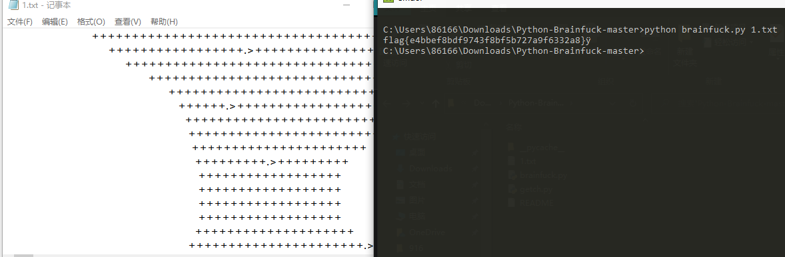
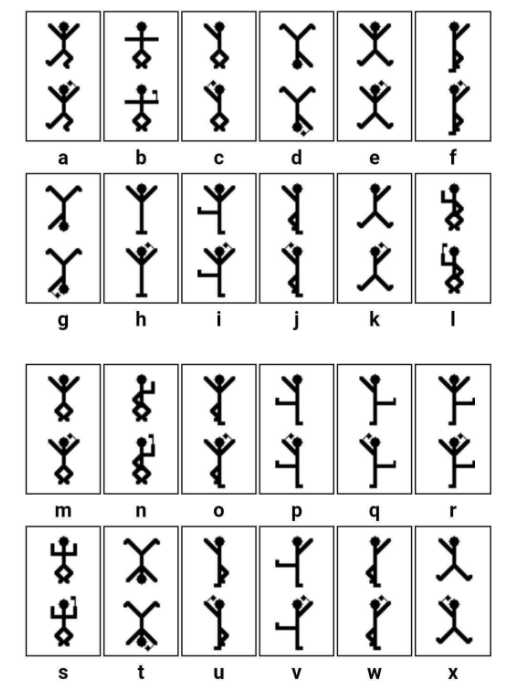
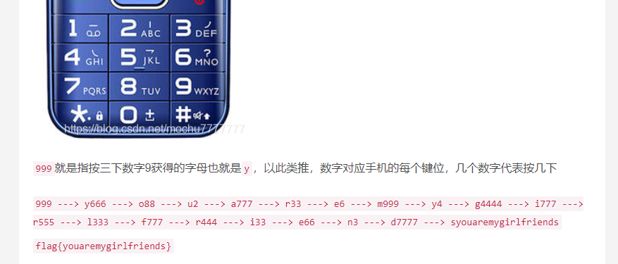

# CTF-Crypher

- [CTF-Crypher](#CTF-Crypher)
    - [brainfuck](#brainfuck)
    - [Ook](#Ook)
    - [Serpent](#Serpent)
    - [核心价值观编码](#核心价值观编码)
    - [盲文加密解密](#盲文加密解密)
    - [福尔摩斯-跳舞的小人](#福尔摩斯-跳舞的小人)
    - [音符加密解密](#音符加密解密)
    - [敲击码](#敲击码)
    - [凯撒加密解密](#凯撒加密解密)
    - [base64](#base64)
    - [base32](#base32)
    - [颜文字加密解密](#颜文字加密解密)
    - [rot13加密解密](#rot13加密解密)
    - [中文电码表](#中文电码表)
    - [五笔编码](#五笔编码)
    - [时间戳](#时间戳)
    - [手机键盘密码](#手机键盘密码)
    - [DES加密解密](#DES加密解密)
## brainfuck

 +++++++++++++++++.>

漏洞利用工具：Python-Brainfuck-master

python brainfuck.py 1.txt



## Ook

在线解密网站：https://www.splitbrain.org/services/ook

## Serpent

蛇 snake 需要密钥

http://serpent.online-domain-tools.com/

## 核心价值观编码

社会主义核心价值观：富强、民主、文明、和谐；自由、平等、公正、法治；爱国、敬业、诚信、友善

http://ctf.ssleye.com/cvencode.html

https://wtool.com.cn/cvencode.html


## 盲文加密解密

https://www.qqxiuzi.cn/bianma/wenbenjiami.php?s=mangwen

## 福尔摩斯-跳舞的小人



## 音符加密解密

https://www.qqxiuzi.cn/bianma/wenbenjiami.php?s=yinyue

## 敲击码

  1  2  3  4  5
1 A  B C/K D  E
2 F  G  H  I  J
3 L  M  N  O  P
4 Q  R  S  T  U
5 V  W  X  Y  Z

..... ../... ./... ./... ../
  5,2     3,1    3,1    3,2
   W       L      L      M

## 凯撒加密解密


## base64

https://base64.us/
## base32

base32和base64原理是一样的，32和64分别是`2^5`和`2^6`。
拿base32举例来说，每一个字符是有5Bit，但是ASCII字符有8Bit，所以base32是用8个base32字符来代替5个ASCII字符。


ToolsFx-1.8.0-jdk11 离线工具

https://www.qqxiuzi.cn/bianma/base.php 在线工具

## 颜文字加密解密

```
ﾟωﾟﾉ= /｀ｍ´）ﾉ ~┻━┻   //*´∇｀*/ ['_']; o=(ﾟｰﾟ)  =_=3; c=(ﾟΘﾟ) =(ﾟｰﾟ)-(ﾟｰﾟ); (ﾟДﾟ) =(ﾟΘﾟ)= (o^_^o)/ (o^_^o);(ﾟДﾟ)={ﾟΘﾟ: '_' ,ﾟωﾟﾉ : ((ﾟωﾟﾉ==3) +'_') [ﾟΘﾟ] ,ﾟｰﾟﾉ :(ﾟωﾟﾉ+ '_')[o^_^o -(ﾟΘﾟ)] ,ﾟДﾟﾉ:((ﾟｰﾟ==3) +'_')[ﾟｰﾟ] }; (ﾟДﾟ) [ﾟΘﾟ] =((ﾟωﾟﾉ==3) +'_') [c^_^o];(ﾟДﾟ) ['c'] = ((ﾟДﾟ)+'_') [ (ﾟｰﾟ)+(ﾟｰﾟ)-(ﾟΘﾟ) ];(ﾟДﾟ) ['o'] = ((ﾟДﾟ)+'_') [ﾟΘﾟ];(ﾟoﾟ)=(ﾟДﾟ) ['c']+(ﾟДﾟ) ['o']+(ﾟωﾟﾉ +'_')[ﾟΘﾟ]+ ((ﾟωﾟﾉ==3) +'_') [ﾟｰﾟ] + ((ﾟДﾟ) +'_') [(ﾟｰﾟ)+(ﾟｰﾟ)]+ ((ﾟｰﾟ==3) +'_') [ﾟΘﾟ]+((ﾟｰﾟ==3) +'_') [(ﾟｰﾟ) - (ﾟΘﾟ)]+(ﾟДﾟ) ['c']+((ﾟДﾟ)+'_') [(ﾟｰﾟ)+(ﾟｰﾟ)]+ (ﾟДﾟ) ['o']+((ﾟｰﾟ==3) +'_') [ﾟΘﾟ];(ﾟДﾟ) ['_'] =(o^_^o) [ﾟoﾟ] [ﾟoﾟ];(ﾟεﾟ)=((ﾟｰﾟ==3) +'_') [ﾟΘﾟ]+ (ﾟДﾟ) .ﾟДﾟﾉ+((ﾟДﾟ)+'_') [(ﾟｰﾟ) + (ﾟｰﾟ)]+((ﾟｰﾟ==3) +'_') [o^_^o -ﾟΘﾟ]+((ﾟｰﾟ==3) +'_') [ﾟ
```

http://www.atoolbox.net/Tool.php?Id=703

## rot13加密解密

http://www.mxcz.net/tools/rot13.aspx

http://www.ab126.com/goju/10818.html

https://rot13.com/

## 中文电码表

例子：ren
壬1103 仁0088 人0086 忍1804 韧7282 任0117 认6126 刃0432
妊1175 纫4771
https://gjy.bift.edu.cn/tzgg/22776.htm

## 五笔编码

例子：bnhn s wwy vffg vffg rrhy fhnv

https://www.qqxiuzi.cn/bianma/wubi.php

## 时间戳

https://tool.chinaz.com/tools/unixtime.aspx

## 手机键盘密码

999*666*88*2*777*33*6*999*4*4444*777*555*333*777*444*33*66*3*7777



## DES加密解密

也可能是3DES

https://www.sojson.com/encrypt_triple_des.html

DES密文开头都是`U2FsdGVkX1`,解密需要密钥
