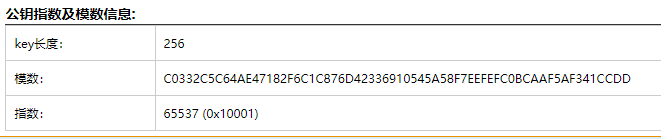
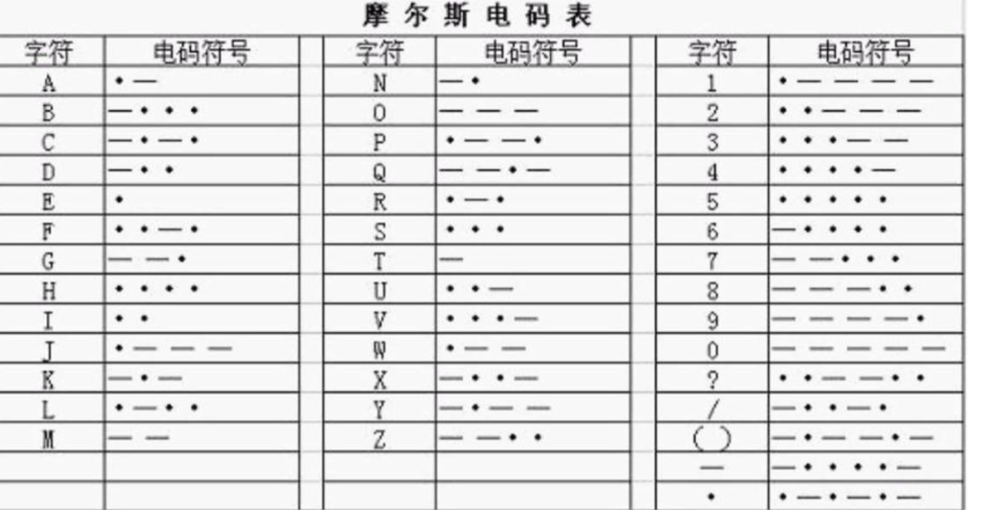
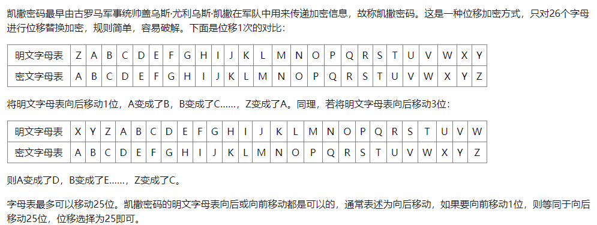
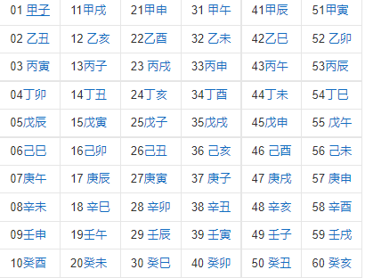
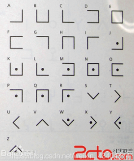
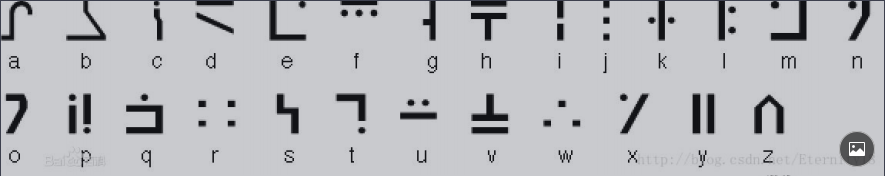

# CTF-Crypher

- [CTF-Crypher](#CTF-Crypher)
    - [现代密码](#现代密码)
      - [MD5](#MD5)
      - [DES加密解密](#DES加密解密)
      - [RSA](#RSA)
        - [分解n](#分解n)
        - [在线公私钥分解](#在线公私钥分解)
        - [已知 e、p、q，求 d](#)
        - [已知e、p、q、密文c，求明文m](#)
        - [已知 e、n、密文 c，求明文 m](#)
        - [已知 e、d、p+q、(p+1)(q+1)、以及密文C，求明文m](#)
        - [已知 p、q、dp、dq、c 求明文 m (dp、dq 泄露)](#)
        - [已知 e1、e2、n (共模攻击) (模不互质)](#)
        - [已知 n、e、dp、c，求m (dp 泄露)](#)
        - [已知 public key、密文 c，求明文 m (公钥提取)](#)
        - [已知 n、e、c、p、q 批量求 m (n 分解) (Roll 按行加密)](#)
        - [e=3 (小公钥指数攻击) (小明文攻击) (tereotyped messages攻击)](#)
        - [已知 e、n，求 d (e极大) (Wiener’s Attack)](#)
        - [已知多个 n、c (中国剩余定理)](#)
        - [已知 n、质数相乘+1 (Pollard's p-1)](#)
        - [已知 p、n、c、e的范围,求 m](#)
        - [已知 c1、c2、n1、n2、e的范围 (同公钥（e，n）加密的密文、具有同 q 的公钥加密的密文)](#)
    - [古典密码](#古典密码)
      - [凯撒加密解密](#凯撒加密解密)
      - [变异凯撒](#变异凯撒)
      - [维吉尼亚密码](#维吉尼亚密码)
      - [栅栏密码加密解密](#栅栏密码加密解密)
      - [60甲子年表](#60甲子年表)
      - [猪圈密码](#猪圈密码)
      - [圣堂武士密码](#圣堂武士密码)
      - [变种密码](#变种密码)
      - [playfair-普莱费尔密码](#playfair-普莱费尔密码)
      - [标准银河字母](#标准银河字母)
      - [福尔摩斯-跳舞的小人](#福尔摩斯-跳舞的小人)
      - [音符加密解密](#音符加密解密)
      - [敲击码](#敲击码)
      - [维吉尼亚密码-vigenere](#维吉尼亚密码-vigenere)
    - [Base](#Base)
      - [Base64](#Base64)
      - [Base32](#Base32)
    - [其它编码](#其它编码)
      - [颜文字加密解密](#颜文字加密解密)
      - [中文电码表](#中文电码表)
      - [五笔编码](#五笔编码)
      - [时间戳](#时间戳)
      - [手机键盘密码](#手机键盘密码)
      - [Rabbit解密](Rabbit解密)
      - [Quoted-printable编码](#Quoted-printable编码)
      - [UUencode](#UUencode)
      - [ROT5/13/18/47](#ROT5/13/18/47)
      - [JSFUCK](#JSFUCK)
      - [曼彻斯特编码](#曼彻斯特编码)
      - [摩斯电码](#摩斯电码)
      - [brainfuck](#brainfuck)
      - [Ook](#Ook)
      - [Serpent](#Serpent)
      - [核心价值观编码](#核心价值观编码)
      - [盲文加密解密](#盲文加密解密)
      - [新约佛论禅](#新约佛论禅)

## 现代密码
## md5

https://www.somd5.com/

https://www.cmd5.com/

## RSA

#### 分解n

factordb - 在线分解质因数, 通常用于分解 n 得到 p q
http://www.factordb.com/

yafu - 离线分解工具

```
yafu "factor(82748279383502845283943271120712436408030814624973629060064917325126552245423)"
yafu-x64.exe "factor(@)" -batchfile 1.txt
```

#### 在线公私钥分解

http://tool.chacuo.net/cryptrsakeyparse

#### 已知 e、p、q，求 d

```py
import gmpy2
p = 473398607161
q = 4511491
e = 17
d = gmpy2.invert(e,(p-1)*(q-1))
print(d)
```

#### 已知 e、n、密文 c，求明文 m

脚本1
```py
import gmpy2
import binascii

e = 65537
n = 1455925529734358105461406532259911790807347616464991065301847
c = 69380371057914246192606760686152233225659503366319332065009
#1.将n分解为p和q
p = 1201147059438530786835365194567
q = 1212112637077862917192191913841

phi = (p-1)*(q-1)
#2.求d
d = gmpy2.invert(e,phi)
#3.m=pow(c,d,n)
m = gmpy2.powmod(c,d,n)
print(binascii.unhexlify(hex(m)[2:]))
#binascii.unhexlify(hexstr):从十六进制字符串hexstr返回二进制数据
```

脚本2
```py
import gmpy2
from Crypto.Util.number import *
from binascii import a2b_hex,b2a_hex
import binascii

e = 65533

c = 27565231154623519221597938803435789010285480123476977081867877272451638645710
#1.将n分解为p和q
p = 262248800182277040650192055439906580479
q = 262854994239322828547925595487519915551
n = p*q

phi = (p-1)*(q-1)
#2.求d
d = gmpy2.invert(e,phi)
#3.m=pow(c,d,n)
m = gmpy2.powmod(c,d,n)
print(binascii.unhexlify(hex(m)[2:]))
#binascii.unhexlify(hexstr):从十六进制字符串hexstr返回二进制数据
```

#### 已知e、p、q、密文c，求明文m

```py
import gmpy2, libnum

c = 26308018356739853895382240109968894175166731283702927002165268998773708335216338997058314157717147131083296551313334042509806229853341488461087009955203854253313827608275460592785607739091992591431080342664081962030557042784864074533380701014585315663218783130162376176094773010478159362434331787279303302718098735574605469803801873109982473258207444342330633191849040553550708886593340770753064322410889048135425025715982196600650740987076486540674090923181664281515197679745907830107684777248532278645343716263686014941081417914622724906314960249945105011301731247324601620886782967217339340393853616450077105125391982689986178342417223392217085276465471102737594719932347242482670320801063191869471318313514407997326350065187904154229557706351355052446027159972546737213451422978211055778164578782156428466626894026103053360431281644645515155471301826844754338802352846095293421718249819728205538534652212984831283642472071669494851823123552827380737798609829706225744376667082534026874483482483127491533474306552210039386256062116345785870668331513725792053302188276682550672663353937781055621860101624242216671635824311412793495965628876036344731733142759495348248970313655381407241457118743532311394697763283681852908564387282605279108

p = 178449493212694205742332078583256205058672290603652616240227340638730811945224947826121772642204629335108873832781921390308501763661154638696935732709724016546955977529088135995838497476350749621442719690722226913635772410880516639651363626821442456779009699333452616953193799328647446968707045304702547915799734431818800374360377292309248361548868909066895474518333089446581763425755389837072166970684877011663234978631869703859541876049132713490090720408351108387971577438951727337962368478059295446047962510687695047494480605473377173021467764495541590394732685140829152761532035790187269724703444386838656193674253139
q = 184084121540115307597161367011014142898823526027674354555037785878481711602257307508985022577801782788769786800015984410443717799994642236194840684557538917849420967360121509675348296203886340264385224150964642958965438801864306187503790100281099130863977710204660546799128755418521327290719635075221585824217487386227004673527292281536221958961760681032293340099395863194031788435142296085219594866635192464353365034089592414809332183882423461536123972873871477755949082223830049594561329457349537703926325152949582123419049073013144325689632055433283354999265193117288252918515308767016885678802217366700376654365502867
e = 0x10001
d = gmpy2.invert(e, (p-1)*(q-1))

m = pow(c, d, p*q)
print(libnum.n2s(m))
```
#### 已知 e、d、p+q、(p+1)(q+1)、以及密文C，求明文m

n = (p+1)*(q+1) - (p+q) - 1

```
p+q : 0x1232fecb92adead91613e7d9ae5e36fe6bb765317d6ed38ad890b4073539a6231a6620584cea5730b5af83a3e80cf30141282c97be4400e33307573af6b25e2ea
(p+1)(q+1) : 0x5248becef1d925d45705a7302700d6a0ffe5877fddf9451a9c1181c4d82365806085fd86fbaab08b6fc66a967b2566d743c626547203b34ea3fdb1bc06dd3bb765fd8b919e3bd2cb15bc175c9498f9d9a0e216c2dde64d81255fa4c05a1ee619fc1fc505285a239e7bc655ec6605d9693078b800ee80931a7a0c84f33c851740
e : 0xe6b1bee47bd63f615c7d0a43c529d219
d : 0x2dde7fbaed477f6d62838d55b0d0964868cf6efb2c282a5f13e6008ce7317a24cb57aec49ef0d738919f47cdcd9677cd52ac2293ec5938aa198f962678b5cd0da344453f521a69b2ac03647cdd8339f4e38cec452d54e60698833d67f9315c02ddaa4c79ebaa902c605d7bda32ce970541b2d9a17d62b52df813b2fb0c5ab1a5
enc_flag : 0x50ae00623211ba6089ddfae21e204ab616f6c9d294e913550af3d66e85d0c0693ed53ed55c46d8cca1d7c2ad44839030df26b70f22a8567171a759b76fe5f07b3c5a6ec89117ed0a36c0950956b9cde880c575737f779143f921d745ac3bb0e379c05d9a3cc6bf0bea8aa91e4d5e752c7eb46b2e023edbc07d24a7c460a34a9a
```


```py
import libnum
a = 0x1232fecb92adead91613e7d9ae5e36fe6bb765317d6ed38ad890b4073539a6231a6620584cea5730b5af83a3e80cf30141282c97be4400e33307573af6b25e2ea
b = 0x5248becef1d925d45705a7302700d6a0ffe5877fddf9451a9c1181c4d82365806085fd86fbaab08b6fc66a967b2566d743c626547203b34ea3fdb1bc06dd3bb765fd8b919e3bd2cb15bc175c9498f9d9a0e216c2dde64d81255fa4c05a1ee619fc1fc505285a239e7bc655ec6605d9693078b800ee80931a7a0c84f33c851740
e = 0xe6b1bee47bd63f615c7d0a43c529d219
d = 0x2dde7fbaed477f6d62838d55b0d0964868cf6efb2c282a5f13e6008ce7317a24cb57aec49ef0d738919f47cdcd9677cd52ac2293ec5938aa198f962678b5cd0da344453f521a69b2ac03647cdd8339f4e38cec452d54e60698833d67f9315c02ddaa4c79ebaa902c605d7bda32ce970541b2d9a17d62b52df813b2fb0c5ab1a5
c= 0x50ae00623211ba6089ddfae21e204ab616f6c9d294e913550af3d66e85d0c0693ed53ed55c46d8cca1d7c2ad44839030df26b70f22a8567171a759b76fe5f07b3c5a6ec89117ed0a36c0950956b9cde880c575737f779143f921d745ac3bb0e379c05d9a3cc6bf0bea8aa91e4d5e752c7eb46b2e023edbc07d24a7c460a34a9a

n = b-a-1

m = pow(c,d,n)

print(libnum.n2s(m))  #（n2s将数值转化为字符串）
```

#### 已知 p、q、dp、dq、c 求明文 m (dp、dq 泄露)

dp、dq含义

dp=d%(p-1)
dq=d%(q-1)

```py
p = 8637633767257008567099653486541091171320491509433615447539162437911244175885667806398411790524083553445158113502227745206205327690939504032994699902053229
q = 12640674973996472769176047937170883420927050821480010581593137135372473880595613737337630629752577346147039284030082593490776630572584959954205336880228469
dp = 6500795702216834621109042351193261530650043841056252930930949663358625016881832840728066026150264693076109354874099841380454881716097778307268116910582929
dq = 783472263673553449019532580386470672380574033551303889137911760438881683674556098098256795673512201963002175438762767516968043599582527539160811120550041
c = 24722305403887382073567316467649080662631552905960229399079107995602154418176056335800638887527614164073530437657085079676157350205351945222989351316076486573599576041978339872265925062764318536089007310270278526159678937431903862892400747915525118983959970607934142974736675784325993445942031372107342103852

import gmpy2
I = gmpy2.invert(q,p)
mp = pow(c,dp,p)
mq = pow(c,dq,q)               #求幂取模运算

m = (((mp-mq)*I)%p)*q+mq       #求明文公式

print(hex(m))                  #转为十六进制
```
然后得到的十六进制hex为字符即可。


#### 已知 e1、e2、n (共模攻击) (模不互质)

如果在 RSA 的使用中使用了相同的模 n 对相同的明文 m 进行了加密，那么就可以在不分解 n 的情况下还原出明文 m 的值。

出现两个加密使用相同的模，可以在不知道私钥的情况下得到明文，这就是RSA中的共模攻击。

```py
from gmpy2 import invert
# 欧几里得算法
def egcd(a, b):
  if a == 0:
    return (b, 0, 1)
  else:
    g, y, x = egcd(b % a, a)
    return (g, x - (b // a) * y, y)

def main():
  n = 22708078815885011462462049064339185898712439277226831073457888403129378547350292420267016551819052430779004755846649044001024141485283286483130702616057274698473611149508798869706347501931583117632710700787228016480127677393649929530416598686027354216422565934459015161927613607902831542857977859612596282353679327773303727004407262197231586324599181983572622404590354084541788062262164510140605868122410388090174420147752408554129789760902300898046273909007852818474030770699647647363015102118956737673941354217692696044969695308506436573142565573487583507037356944848039864382339216266670673567488871508925311154801
  c1 = 22322035275663237041646893770451933509324701913484303338076210603542612758956262869640822486470121149424485571361007421293675516338822195280313794991136048140918842471219840263536338886250492682739436410013436651161720725855484866690084788721349555662019879081501113222996123305533009325964377798892703161521852805956811219563883312896330156298621674684353919547558127920925706842808914762199011054955816534977675267395009575347820387073483928425066536361482774892370969520740304287456555508933372782327506569010772537497541764311429052216291198932092617792645253901478910801592878203564861118912045464959832566051361
  c2 = 18702010045187015556548691642394982835669262147230212731309938675226458555210425972429418449273410535387985931036711854265623905066805665751803269106880746769003478900791099590239513925449748814075904017471585572848473556490565450062664706449128415834787961947266259789785962922238701134079720414228414066193071495304612341052987455615930023536823801499269773357186087452747500840640419365011554421183037505653461286732740983702740822671148045619497667184586123657285604061875653909567822328914065337797733444640351518775487649819978262363617265797982843179630888729407238496650987720428708217115257989007867331698397
  e1 = 11187289
  e2 = 9647291
  s = egcd(e1, e2)
  s1 = s[1]
  s2 = s[2]
  # 求模反元素
  if s1<0:
    s1 = - s1
    c1 = invert(c1, n)
  elif s2<0:
    s2 = - s2
    c2 = invert(c2, n)

  m = pow(c1,s1,n)*pow(c2,s2,n) % n
  print(m)

if __name__ == '__main__':
  main()
```


结果转16进制得到 flag

例题 [BJDCTF2020]rsa_output

```
{21058339337354287847534107544613605305015441090508924094198816691219103399526800112802416383088995253908857460266726925615826895303377801614829364034624475195859997943146305588315939130777450485196290766249612340054354622516207681542973756257677388091926549655162490873849955783768663029138647079874278240867932127196686258800146911620730706734103611833179733264096475286491988063990431085380499075005629807702406676707841324660971173253100956362528346684752959937473852630145893796056675793646430793578265418255919376323796044588559726703858429311784705245069845938316802681575653653770883615525735690306674635167111,2767}

{21058339337354287847534107544613605305015441090508924094198816691219103399526800112802416383088995253908857460266726925615826895303377801614829364034624475195859997943146305588315939130777450485196290766249612340054354622516207681542973756257677388091926549655162490873849955783768663029138647079874278240867932127196686258800146911620730706734103611833179733264096475286491988063990431085380499075005629807702406676707841324660971173253100956362528346684752959937473852630145893796056675793646430793578265418255919376323796044588559726703858429311784705245069845938316802681575653653770883615525735690306674635167111,3659}

message1=20152490165522401747723193966902181151098731763998057421967155300933719378216342043730801302534978403741086887969040721959533190058342762057359432663717825826365444996915469039056428416166173920958243044831404924113442512617599426876141184212121677500371236937127571802891321706587610393639446868836987170301813018218408886968263882123084155607494076330256934285171370758586535415136162861138898728910585138378884530819857478609791126971308624318454905992919405355751492789110009313138417265126117273710813843923143381276204802515910527468883224274829962479636527422350190210717694762908096944600267033351813929448599

message2=11298697323140988812057735324285908480504721454145796535014418738959035245600679947297874517818928181509081545027056523790022598233918011261011973196386395689371526774785582326121959186195586069851592467637819366624044133661016373360885158956955263645614345881350494012328275215821306955212788282617812686548883151066866149060363482958708364726982908798340182288702101023393839781427386537230459436512613047311585875068008210818996941460156589314135010438362447522428206884944952639826677247819066812706835773107059567082822312300721049827013660418610265189288840247186598145741724084351633508492707755206886202876227
```

```py
import gmpy2, libnum

def exgcd(a, b):
    if b==0: return 1, 0
    x, y = exgcd(b, a%b)
    return y, x-a//b*y

n = 21058339337354287847534107544613605305015441090508924094198816691219103399526800112802416383088995253908857460266726925615826895303377801614829364034624475195859997943146305588315939130777450485196290766249612340054354622516207681542973756257677388091926549655162490873849955783768663029138647079874278240867932127196686258800146911620730706734103611833179733264096475286491988063990431085380499075005629807702406676707841324660971173253100956362528346684752959937473852630145893796056675793646430793578265418255919376323796044588559726703858429311784705245069845938316802681575653653770883615525735690306674635167111
e1 = 2767
c1 = 20152490165522401747723193966902181151098731763998057421967155300933719378216342043730801302534978403741086887969040721959533190058342762057359432663717825826365444996915469039056428416166173920958243044831404924113442512617599426876141184212121677500371236937127571802891321706587610393639446868836987170301813018218408886968263882123084155607494076330256934285171370758586535415136162861138898728910585138378884530819857478609791126971308624318454905992919405355751492789110009313138417265126117273710813843923143381276204802515910527468883224274829962479636527422350190210717694762908096944600267033351813929448599
e2 = 3659
c2 = 11298697323140988812057735324285908480504721454145796535014418738959035245600679947297874517818928181509081545027056523790022598233918011261011973196386395689371526774785582326121959186195586069851592467637819366624044133661016373360885158956955263645614345881350494012328275215821306955212788282617812686548883151066866149060363482958708364726982908798340182288702101023393839781427386537230459436512613047311585875068008210818996941460156589314135010438362447522428206884944952639826677247819066812706835773107059567082822312300721049827013660418610265189288840247186598145741724084351633508492707755206886202876227

a, b = exgcd(e1, e2)
m = gmpy2.powmod(c1, a, n) * gmpy2.powmod(c2, b, n) % n
print(libnum.n2s(m))
```
#### 已知 n、e、dp、c，求m (dp 泄露)

dp=d%(p-1)

```py
import gmpy2 as gp

e = 65537
n = gp.mpz(248254007851526241177721526698901802985832766176221609612258877371620580060433101538328030305219918697643619814200930679612109885533801335348445023751670478437073055544724280684733298051599167660303645183146161497485358633681492129668802402065797789905550489547645118787266601929429724133167768465309665906113)
dp = gp.mpz(905074498052346904643025132879518330691925174573054004621877253318682675055421970943552016695528560364834446303196939207056642927148093290374440210503657)

c = gp.mpz(140423670976252696807533673586209400575664282100684119784203527124521188996403826597436883766041879067494280957410201958935737360380801845453829293997433414188838725751796261702622028587211560353362847191060306578510511380965162133472698713063592621028959167072781482562673683090590521214218071160287665180751)

for x in range(1, e):
    if(e*dp%x==1):
        p=(e*dp-1)//x+1
        if(n%p!=0):
            continue
        q=n//p
        phin=(p-1)*(q-1)
        d=gp.invert(e, phin)
        m=gp.powmod(c, d, n)
        if(len(hex(m)[2:])%2==1):
            continue
        print('--------------')
        print(m)
        print(hex(m)[2:])
        print(bytes.fromhex(hex(m)[2:]))
```


#### 已知 public key、密文 c，求明文 m (公钥提取)

给出一个 pub.key ,一个 flag.enc

通过在线工具解析 RSA 密钥指数、模数



http://tool.chacuo.net/cryptrsakeyparse

```py
import gmpy2
import rsa

e=65537
n=86934482296048119190666062003494800588905656017203025617216654058378322103517
p=285960468890451637935629440372639283459
q=304008741604601924494328155975272418463

phin = (p-1) * (q-1)
d=gmpy2.invert(e, phin)

key=rsa.PrivateKey(n,e,int(d),p,q)

with open("flag.enc","rb") as f:
    f=f.read()
    print(rsa.decrypt(f,key))
```


#### 已知 n、e、c、p、q 批量求 m (n 分解) (Roll 按行加密)

```
{920139713,19}

704796792
752211152
274704164
18414022
368270835
483295235
263072905
459788476
483295235
459788476
663551792
475206804
459788476
428313374
475206804
459788476
425392137
704796792
458265677
341524652
483295235
534149509
425392137
428313374
425392137
341524652
458265677
263072905
483295235
828509797
341524652
425392137
475206804
428313374
483295235
475206804
459788476
306220148
```

```py
import gmpy2
N,p,q,e=920139713,49891,18443,19
phi = (p-1)*(q-1)
d=gmpy2.invert(e,phi)
result=[]

with open("c.txt","r") as f:
  for c in f.readlines():
    c=c.strip('\n')
    result.append(chr(pow(int(c),d,N)))

flag=''
for i in result:
  flag+=i
  print(flag)
```

#### e=3 (小公钥指数攻击) (小明文攻击) (tereotyped messages攻击)

```
#n:  0x52d483c27cd806550fbe0e37a61af2e7cf5e0efb723dfc81174c918a27627779b21fa3c851e9e94188eaee3d5cd6f752406a43fbecb53e80836ff1e185d3ccd7782ea846c2e91a7b0808986666e0bdadbfb7bdd65670a589a4d2478e9adcafe97c6ee23614bcb2ecc23580f4d2e3cc1ecfec25c50da4bc754dde6c8bfd8d1fc16956c74d8e9196046a01dc9f3024e11461c294f29d7421140732fedacac97b8fe50999117d27943c953f18c4ff4f8c258d839764078d4b6ef6e8591e0ff5563b31a39e6374d0d41c8c46921c25e5904a817ef8e39e5c9b71225a83269693e0b7e3218fc5e5a1e8412ba16e588b3d6ac536dce39fcdfce81eec79979ea6872793L
#e:  0x3
#c:0x10652cdfaa6b63f6d7bd1109da08181e500e5643f5b240a9024bfa84d5f2cac9310562978347bb232d63e7289283871efab83d84ff5a7b64a94a79d34cfbd4ef121723ba1f663e514f83f6f01492b4e13e1bb4296d96ea5a353d3bf2edd2f449c03c4a3e995237985a596908adc741f32365
so,how to get the message?
```

低加密指数攻击,e 比较小，一般为 3

公钥中的加密指数 e 很小，但是模数 n 很大

有 RSA 加密公式： C=M^e % n (C 密文，M 明文)

则：

当 M^e < n 时，C = M^e ，所以对 C 开方就能得到 M

当 M^e ＞ n 时，此时用爆破的方法

假设我们 Ｍ^e / n 的商为 k 余数为 C，则Ｍ^e = kn + C，对 K 进行爆破，只要 k 满足 kn + C 能够开 e 次方就可以得明文

```py
# -*- coding: utf-8 -*-#
#python3
from gmpy2 import iroot
import libnum
e = 0x3
n = 0x52d483c27cd806550fbe0e37a61af2e7cf5e0efb723dfc81174c918a27627779b21fa3c851e9e94188eaee3d5cd6f752406a43fbecb53e80836ff1e185d3ccd7782ea846c2e91a7b0808986666e0bdadbfb7bdd65670a589a4d2478e9adcafe97c6ee23614bcb2ecc23580f4d2e3cc1ecfec25c50da4bc754dde6c8bfd8d1fc16956c74d8e9196046a01dc9f3024e11461c294f29d7421140732fedacac97b8fe50999117d27943c953f18c4ff4f8c258d839764078d4b6ef6e8591e0ff5563b31a39e6374d0d41c8c46921c25e5904a817ef8e39e5c9b71225a83269693e0b7e3218fc5e5a1e8412ba16e588b3d6ac536dce39fcdfce81eec79979ea6872793
c = 0x10652cdfaa6b63f6d7bd1109da08181e500e5643f5b240a9024bfa84d5f2cac9310562978347bb232d63e7289283871efab83d84ff5a7b64a94a79d34cfbd4ef121723ba1f663e514f83f6f01492b4e13e1bb4296d96ea5a353d3bf2edd2f449c03c4a3e995237985a596908adc741f32365

k = 0
while 1:
    res = iroot(c+k*n,e)  #c+k*n 开3次方根 能开3次方即可
    #print(res)
    #res = (mpz(13040004482819713819817340524563023159919305047824600478799740488797710355579494486728991357), True)
    if(res[1] == True):
        print(libnum.n2s(int(res[0]))) #转为字符串
        break
    k=k+1
```


#### 已知 e、n，求 d (e极大) (Wiener’s Attack)

https://github.com/pablocelayes/rsa-wiener-attack

低解密指数攻击:e过大 n分解不出来


python2 带工具，在rsa-wiener-attack-master目录下kali虚拟机执行，python2 hello.py即可
```py

import hashlib
import RSAwienerHacker
N = 101991809777553253470276751399264740131157682329252673501792154507006158434432009141995367241962525705950046253400188884658262496534706438791515071885860897552736656899566915731297225817250639873643376310103992170646906557242832893914902053581087502512787303322747780420210884852166586717636559058152544979471
e = 46731919563265721307105180410302518676676135509737992912625092976849075262192092549323082367518264378630543338219025744820916471913696072050291990620486581719410354385121760761374229374847695148230596005409978383369740305816082770283909611956355972181848077519920922059268376958811713365106925235218265173085
d =  RSAwienerHacker.hack_RSA(e,N)
print(d)
flag = "flag{" + hashlib.md5(hex(d)).hexdigest() + "}"
print(flag)
#8920758995414587152829426558580025657357328745839747693739591820283538307445
#flag{47bf28da384590448e0b0d23909a25a4}

```

python3下MD5有问题
```py
import owiener
e = 3047442173541658754667464233797118324917469250436575767227172319344577259865313428705759330024959317716760816959590728238918140105663188172228696589411452947738069773833351725455888549656717874059636289036277785342126992626060696063089487811946920569580454880169977542532087635095357205433679009382368108273

n = 135568509670260054049994954417860747085442883428459182441559553532993752593294067458983143521109377661295622146963670193783017382697726454953197805014428888491744355387957923382241961401063461549210355871385000347645387907568135032087942016502668629010859519249039662555733548461551175133582871220209515648241

d = owiener.attack(e, n)

print(d)
# flag = "flag{" + hashlib.md5(hex(d).encode("utf-8")).hexdigest() + "}"
# print(flag)

#8920758995414587152829426558580025657357328745839747693739591820283538307445
#flag{47bf28da384590448e0b0d23909a25a4}
```

#### 已知多个 n、c (中国剩余定理)

```py
from gmpy2 import *
from Crypto.Util.number import *
from functools import reduce

# 将5进制数转换为10进制数  int('',5)
N1 = int('331310324212000030020214312244232222400142410423413104441140203003243002104333214202031202212403400220031202142322434104143104244241214204444443323000244130122022422310201104411044030113302323014101331214303223312402430402404413033243132101010422240133122211400434023222214231402403403200012221023341333340042343122302113410210110221233241303024431330001303404020104442443120130000334110042432010203401440404010003442001223042211442001413004',5)
c1 = int('310020004234033304244200421414413320341301002123030311202340222410301423440312412440240244110200112141140201224032402232131204213012303204422003300004011434102141321223311243242010014140422411342304322201241112402132203101131221223004022003120002110230023341143201404311340311134230140231412201333333142402423134333211302102413111111424430032440123340034044314223400401224111323000242234420441240411021023100222003123214343030122032301042243',5)

N2 = int('302240000040421410144422133334143140011011044322223144412002220243001141141114123223331331304421113021231204322233120121444434210041232214144413244434424302311222143224402302432102242132244032010020113224011121043232143221203424243134044314022212024343100042342002432331144300214212414033414120004344211330224020301223033334324244031204240122301242232011303211220044222411134403012132420311110302442344021122101224411230002203344140143044114',5)
c2 = int('112200203404013430330214124004404423210041321043000303233141423344144222343401042200334033203124030011440014210112103234440312134032123400444344144233020130110134042102220302002413321102022414130443041144240310121020100310104334204234412411424420321211112232031121330310333414423433343322024400121200333330432223421433344122023012440013041401423202210124024431040013414313121123433424113113414422043330422002314144111134142044333404112240344',5)

N3 = int('332200324410041111434222123043121331442103233332422341041340412034230003314420311333101344231212130200312041044324431141033004333110021013020140020011222012300020041342040004002220210223122111314112124333211132230332124022423141214031303144444134403024420111423244424030030003340213032121303213343020401304243330001314023030121034113334404440421242240113103203013341231330004332040302440011324004130324034323430143102401440130242321424020323',5)
c3 = int('10013444120141130322433204124002242224332334011124210012440241402342100410331131441303242011002101323040403311120421304422222200324402244243322422444414043342130111111330022213203030324422101133032212042042243101434342203204121042113212104212423330331134311311114143200011240002111312122234340003403312040401043021433112031334324322123304112340014030132021432101130211241134422413442312013042141212003102211300321404043012124332013240431242',5)

N = [N1,N2,N3]
c = [c1,c2,c3]

# 中国剩余定理算法
def chinese_remainder(modulus, remainders):
    Sum = 0
    prod = reduce(lambda a, b: a*b, modulus)
    for m_i, r_i in zip(modulus, remainders):
        p = prod // m_i
        Sum += r_i * (inverse(p,m_i)*p)
    return Sum % prod
e = 3

# print(chinese_remainder(N,c))
pow_m_e = chinese_remainder(N,c)

# pow_m_e = 17446992834638639179129969961058029457462398677361658450137832328330435503838651797276948890990069700515669656391607670623897280684064423087023742140145529356863469816868212911716782075239982647322703714504545802436551322108638975695013439206776300941300053940942685511792851350404139366581130688518772175108412341696958930756520037
m = iroot(pow_m_e,e)[0]

print(long_to_bytes(m))
```

#### 已知 n、质数相乘+1 (Pollard's p-1)

```py
from random import choice
from Crypto.Util.number import isPrime, sieve_base as primes
from flag import flag

def getPrime(bits):
    while True:
        n = 2
        while n.bit_length() < bits:
            n *= choice(primes)
        if isPrime(n + 1):
            return n + 1

e = 0x10001
m = int.from_bytes(flag.encode(), 'big')
p, q = [getPrime(2048) for _ in range(2)]
n = p * q
c = pow(m, e, n)

# n = 32849718197337581823002243717057659218502519004386996660885100592872201948834155543125924395614928962750579667346279456710633774501407292473006312537723894221717638059058796679686953564471994009285384798450493756900459225040360430847240975678450171551048783818642467506711424027848778367427338647282428667393241157151675410661015044633282064056800913282016363415202171926089293431012379261585078566301060173689328363696699811123592090204578098276704877408688525618732848817623879899628629300385790344366046641825507767709276622692835393219811283244303899850483748651722336996164724553364097066493953127153066970594638491950199605713033004684970381605908909693802373826516622872100822213645899846325022476318425889580091613323747640467299866189070780620292627043349618839126919699862580579994887507733838561768581933029077488033326056066378869170169389819542928899483936705521710423905128732013121538495096959944889076705471928490092476616709838980562233255542325528398956185421193665359897664110835645928646616337700617883946369110702443135980068553511927115723157704586595844927607636003501038871748639417378062348085980873502535098755568810971926925447913858894180171498580131088992227637341857123607600275137768132347158657063692388249513
# c = 26308018356739853895382240109968894175166731283702927002165268998773708335216338997058314157717147131083296551313334042509806229853341488461087009955203854253313827608275460592785607739091992591431080342664081962030557042784864074533380701014585315663218783130162376176094773010478159362434331787279303302718098735574605469803801873109982473258207444342330633191849040553550708886593340770753064322410889048135425025715982196600650740987076486540674090923181664281515197679745907830107684777248532278645343716263686014941081417914622724906314960249945105011301731247324601620886782967217339340393853616450077105125391982689986178342417223392217085276465471102737594719932347242482670320801063191869471318313514407997326350065187904154229557706351355052446027159972546737213451422978211055778164578782156428466626894026103053360431281644645515155471301826844754338802352846095293421718249819728205538534652212984831283642472071669494851823123552827380737798609829706225744376667082534026874483482483127491533474306552210039386256062116345785870668331513725792053302188276682550672663353937781055621860101624242216671635824311412793495965628876036344731733142759495348248970313655381407241457118743532311394697763283681852908564387282605279108
```

注意到生成质数的过程，是在质数库里面选一堆质数乘起来，最后加上 1。这会导致 拥有小因子。采用 Pollard's p-1 攻击


python2环境下运行，需要pip2 install primefac
```py
python -m primefac -vs -m=p-1 32849718197337581823002243717057659218502519004386996660885100592872201948834155543125924395614928962750579667346279456710633774501407292473006312537723894221717638059058796679686953564471994009285384798450493756900459225040360430847240975678450171551048783818642467506711424027848778367427338647282428667393241157151675410661015044633282064056800913282016363415202171926089293431012379261585078566301060173689328363696699811123592090204578098276704877408688525618732848817623879899628629300385790344366046641825507767709276622692835393219811283244303899850483748651722336996164724553364097066493953127153066970594638491950199605713033004684970381605908909693802373826516622872100822213645899846325022476318425889580091613323747640467299866189070780620292627043349618839126919699862580579994887507733838561768581933029077488033326056066378869170169389819542928899483936705521710423905128732013121538495096959944889076705471928490092476616709838980562233255542325528398956185421193665359897664110835645928646616337700617883946369110702443135980068553511927115723157704586595844927607636003501038871748639417378062348085980873502535098755568810971926925447913858894180171498580131088992227637341857123607600275137768132347158657063692388249513
```

#### 已知 p、n、c、e的范围,求 m

```
p = 177077389675257695042507998165006460849
n = 37421829509887796274897162249367329400988647145613325367337968063341372726061
c = ==gMzYDNzIjMxUTNyIzNzIjMyYTM4MDM0gTMwEjNzgTM2UTN4cjNwIjN2QzM5ADMwIDNyMTO4UzM2cTM5kDN2MTOyUTO5YDM0czM3MjM
```

```py
from base64 import b64encode as b32encode
from gmpy2 import invert,gcd,iroot
from Crypto.Util.number import *
from binascii import a2b_hex,b2a_hex
import random

flag = "******************************"

nbit = 128

p = getPrime(nbit)
q = getPrime(nbit)
n = p*q

print p
print n

phi = (p-1)*(q-1)

e = random.randint(50000,70000)

while True:
	if gcd(e,phi) == 1:
		break;
	else:
		e -= 1;

c = pow(int(b2a_hex(flag),16),e,n)

print b32encode(str(c))[::-1]

# 2373740699529364991763589324200093466206785561836101840381622237225512234632
```

给了 e 的范围,爆破即可

```py
#!/usr/bin/env python
# -*- coding:utf-8 -*-
from base64 import b64encode as b32encode
from base64 import b64decode
from gmpy2 import invert, gcd, iroot
from Crypto.Util.number import *

p = 177077389675257695042507998165006460849
n = 37421829509887796274897162249367329400988647145613325367337968063341372726061
c64 = '==gMzYDNzIjMxUTNyIzNzIjMyYTM4MDM0gTMwEjNzgTM2UTN4cjNwIjN2QzM5ADMwIDNyMTO4UzM2cTM5kDN2MTOyUTO5YDM0czM3MjM'
c = int ( b64decode ( str ( c64)[::-1] ) )
print ( c )
q = n // p
phi = (p - 1) * (q - 1)
for e in range ( 50000, 70000 ):
    if  gcd ( e, phi ) == 1:
        d = invert ( e, phi )
        m = pow ( c, d, n )
        flag=str(long_to_bytes(m))
        if 'flag' in flag or 'CTF' in flag or ("{" in flag and '}'in flag):
            print(flag)
```

#### 已知 c1、c2、n1、n2、e的范围 (同公钥（e，n）加密的密文、具有同 q 的公钥加密的密文)

```py
from Crypto.Util.number import getPrime,bytes_to_long

flag=open("flag","rb").read()

p=getPrime(1024)
q=getPrime(1024)
assert(e<100000)
n=p*q
m=bytes_to_long(flag)
c=pow(m,e,n)
print c,n
print pow(294,e,n)

p=getPrime(1024)
n=p*q
m=bytes_to_long("BJD"*32)
c=pow(m,e,n)
print c,n

'''
output:
12641635617803746150332232646354596292707861480200207537199141183624438303757120570096741248020236666965755798009656547738616399025300123043766255518596149348930444599820675230046423373053051631932557230849083426859490183732303751744004874183062594856870318614289991675980063548316499486908923209627563871554875612702079100567018698992935818206109087568166097392314105717555482926141030505639571708876213167112187962584484065321545727594135175369233925922507794999607323536976824183162923385005669930403448853465141405846835919842908469787547341752365471892495204307644586161393228776042015534147913888338316244169120  13508774104460209743306714034546704137247627344981133461801953479736017021401725818808462898375994767375627749494839671944543822403059978073813122441407612530658168942987820256786583006947001711749230193542370570950705530167921702835627122401475251039000775017381633900222474727396823708695063136246115652622259769634591309421761269548260984426148824641285010730983215377509255011298737827621611158032976420011662547854515610597955628898073569684158225678333474543920326532893446849808112837476684390030976472053905069855522297850688026960701186543428139843783907624317274796926248829543413464754127208843070331063037
381631268825806469518166370387352035475775677163615730759454343913563615970881967332407709901235637718936184198930226303761876517101208677107311006065728014220477966000620964056616058676999878976943319063836649085085377577273214792371548775204594097887078898598463892440141577974544939268247818937936607013100808169758675042264568547764031628431414727922168580998494695800403043312406643527637667466318473669542326169218665366423043579003388486634167642663495896607282155808331902351188500197960905672207046579647052764579411814305689137519860880916467272056778641442758940135016400808740387144508156358067955215018
979153370552535153498477459720877329811204688208387543826122582132404214848454954722487086658061408795223805022202997613522014736983452121073860054851302343517756732701026667062765906277626879215457936330799698812755973057557620930172778859116538571207100424990838508255127616637334499680058645411786925302368790414768248611809358160197554369255458675450109457987698749584630551177577492043403656419968285163536823819817573531356497236154342689914525321673807925458651854768512396355389740863270148775362744448115581639629326362342160548500035000156097215446881251055505465713854173913142040976382500435185442521721  12806210903061368369054309575159360374022344774547459345216907128193957592938071815865954073287532545947370671838372144806539753829484356064919357285623305209600680570975224639214396805124350862772159272362778768036844634760917612708721787320159318432456050806227784435091161119982613987303255995543165395426658059462110056431392517548717447898084915167661172362984251201688639469652283452307712821398857016487590794996544468826705600332208535201443322267298747117528882985955375246424812616478327182399461709978893464093245135530135430007842223389360212803439850867615121148050034887767584693608776323252233254261047
'''
```

两个 n 值公用了一个 q，可以通过 gcd 函数很快找到 q 的值，就可以求出两个 p 的值

此时就差 e 就能解出题目，e 小于 100000，又有关系式 output=pow(294,e,n)，可以通过爆破 e 的取值很快得到 e

解法一：
```py
# python2
from gmpy2 import *
from Crypto.Util.number import *
c1=12641635617803746150332232646354596292707861480200207537199141183624438303757120570096741248020236666965755798009656547738616399025300123043766255518596149348930444599820675230046423373053051631932557230849083426859490183732303751744004874183062594856870318614289991675980063548316499486908923209627563871554875612702079100567018698992935818206109087568166097392314105717555482926141030505639571708876213167112187962584484065321545727594135175369233925922507794999607323536976824183162923385005669930403448853465141405846835919842908469787547341752365471892495204307644586161393228776042015534147913888338316244169120
n1=13508774104460209743306714034546704137247627344981133461801953479736017021401725818808462898375994767375627749494839671944543822403059978073813122441407612530658168942987820256786583006947001711749230193542370570950705530167921702835627122401475251039000775017381633900222474727396823708695063136246115652622259769634591309421761269548260984426148824641285010730983215377509255011298737827621611158032976420011662547854515610597955628898073569684158225678333474543920326532893446849808112837476684390030976472053905069855522297850688026960701186543428139843783907624317274796926248829543413464754127208843070331063037
c2=979153370552535153498477459720877329811204688208387543826122582132404214848454954722487086658061408795223805022202997613522014736983452121073860054851302343517756732701026667062765906277626879215457936330799698812755973057557620930172778859116538571207100424990838508255127616637334499680058645411786925302368790414768248611809358160197554369255458675450109457987698749584630551177577492043403656419968285163536823819817573531356497236154342689914525321673807925458651854768512396355389740863270148775362744448115581639629326362342160548500035000156097215446881251055505465713854173913142040976382500435185442521721
n2=12806210903061368369054309575159360374022344774547459345216907128193957592938071815865954073287532545947370671838372144806539753829484356064919357285623305209600680570975224639214396805124350862772159272362778768036844634760917612708721787320159318432456050806227784435091161119982613987303255995543165395426658059462110056431392517548717447898084915167661172362984251201688639469652283452307712821398857016487590794996544468826705600332208535201443322267298747117528882985955375246424812616478327182399461709978893464093245135530135430007842223389360212803439850867615121148050034887767584693608776323252233254261047
q=gcd(n1,n2)
#print(q)
#99855353761764939308265951492116976798674681282941462516956577712943717850048051273358745095906207085170915794187749954588685850452162165059831749303473106541930948723000882713453679904525655327168665295207423257922666721077747911860159181041422993030618385436504858943615630219459262419715816361781062898911

output=381631268825806469518166370387352035475775677163615730759454343913563615970881967332407709901235637718936184198930226303761876517101208677107311006065728014220477966000620964056616058676999878976943319063836649085085377577273214792371548775204594097887078898598463892440141577974544939268247818937936607013100808169758675042264568547764031628431414727922168580998494695800403043312406643527637667466318473669542326169218665366423043579003388486634167642663495896607282155808331902351188500197960905672207046579647052764579411814305689137519860880916467272056778641442758940135016400808740387144508156358067955215018
for i in range(100000):
	res=pow(294,i,n1)
	if (res==output):
		#print(i)
		#52361
		e=i
		break
e=52361
p=n1//q
phi=(p-1)*(q-1)
d=invert(e,phi)
m=pow(c1,d,n1)
flag=long_to_bytes(m)
print(flag)
#BJD{p_is_common_divisor}
```

解法二:
```py
import gmpy2
from Crypto.Util.number import *
# flag=open("flag","rb").read()

# p=getPrime(1024)
# q=getPrime(1024)
# assert(e<100000)
# n=p*q
# m=bytes_to_long(flag)
# c=pow(m,e,n)
# print c,n
# print pow(294,e,n)

# p=getPrime(1024)
# n=p*q
# m=bytes_to_long("BJD"*32)
# c=pow(m,e,n)
# print c,n

#output:
c = 12641635617803746150332232646354596292707861480200207537199141183624438303757120570096741248020236666965755798009656547738616399025300123043766255518596149348930444599820675230046423373053051631932557230849083426859490183732303751744004874183062594856870318614289991675980063548316499486908923209627563871554875612702079100567018698992935818206109087568166097392314105717555482926141030505639571708876213167112187962584484065321545727594135175369233925922507794999607323536976824183162923385005669930403448853465141405846835919842908469787547341752365471892495204307644586161393228776042015534147913888338316244169120
n = 13508774104460209743306714034546704137247627344981133461801953479736017021401725818808462898375994767375627749494839671944543822403059978073813122441407612530658168942987820256786583006947001711749230193542370570950705530167921702835627122401475251039000775017381633900222474727396823708695063136246115652622259769634591309421761269548260984426148824641285010730983215377509255011298737827621611158032976420011662547854515610597955628898073569684158225678333474543920326532893446849808112837476684390030976472053905069855522297850688026960701186543428139843783907624317274796926248829543413464754127208843070331063037
#n和e相同
_294c = 381631268825806469518166370387352035475775677163615730759454343913563615970881967332407709901235637718936184198930226303761876517101208677107311006065728014220477966000620964056616058676999878976943319063836649085085377577273214792371548775204594097887078898598463892440141577974544939268247818937936607013100808169758675042264568547764031628431414727922168580998494695800403043312406643527637667466318473669542326169218665366423043579003388486634167642663495896607282155808331902351188500197960905672207046579647052764579411814305689137519860880916467272056778641442758940135016400808740387144508156358067955215018
#e相同
BJDc = 979153370552535153498477459720877329811204688208387543826122582132404214848454954722487086658061408795223805022202997613522014736983452121073860054851302343517756732701026667062765906277626879215457936330799698812755973057557620930172778859116538571207100424990838508255127616637334499680058645411786925302368790414768248611809358160197554369255458675450109457987698749584630551177577492043403656419968285163536823819817573531356497236154342689914525321673807925458651854768512396355389740863270148775362744448115581639629326362342160548500035000156097215446881251055505465713854173913142040976382500435185442521721
BJDn = 12806210903061368369054309575159360374022344774547459345216907128193957592938071815865954073287532545947370671838372144806539753829484356064919357285623305209600680570975224639214396805124350862772159272362778768036844634760917612708721787320159318432456050806227784435091161119982613987303255995543165395426658059462110056431392517548717447898084915167661172362984251201688639469652283452307712821398857016487590794996544468826705600332208535201443322267298747117528882985955375246424812616478327182399461709978893464093245135530135430007842223389360212803439850867615121148050034887767584693608776323252233254261047

#n 和 BJDn公用了一个 q 用gcd欧几里得算法求得p
q = gmpy2.gcd(n,BJDn)
p = n // q
# 此时知道e即可解题 因为我们知道pow(294,e,n) 还知道e的范围所以可以**e
for e in range(100000):
    if _294c == pow(294,e,n):
        print('e = ',e)
        break
#e =  52361
m = pow(c, gmpy2.invert(e, (q-1) * (p-1)), n)
print(long_to_bytes(m))
#b'BJD{p_is_common_divisor}'
```

## UUencode

Uuencode是二进制信息和文字信息之间的转换编码，也就是机器和人眼识读的转换。

http://www.hiencode.com/uu.html
https://www.qqxiuzi.cn/bianma/uuencode.php

## ROT5/13/18/47

https://www.qqxiuzi.cn/bianma/ROT5-13-18-47.php

ROT5：只对数字进行编码，用当前数字往前数的第5个数字替换当前数字，例如当前为0，编码后变成5，当前为1，编码后变成6，以此类推顺序循环。
ROT13：只对字母进行编码，用当前字母往前数的第13个字母替换当前字母，例如当前为A，编码后变成N，当前为B，编码后变成O，以此类推顺序循环。
ROT18：这是一个异类，本来没有，它是将ROT5和ROT13组合在一起，为了好称呼，将其命名为ROT18。
ROT47：对数字、字母、常用符号进行编码，按照它们的ASCII值进行位置替换，用当前字符ASCII值往前数的第47位对应字符替换当前字符，例如当前为小写字母z，编码后变成大写字母K，当前为数字0，编码后变成符号_。用于ROT47编码的字符其ASCII值范围是33－126

## JSFUCK

F12-console

https://www.bugku.com/tools/jsfuck/#

https://utf-8.jp/public/jsfuck.html

https://github.com/aemkei/jsfuck

## 曼彻斯特编码

曼彻斯特编码：曼彻斯特编码将时钟和数据包含在数据流中，在传输代码信息的同时，也将时钟同步信号一起传输到对方，每位编码中有一跳变，不存在直流分量，因此具有自同步能力和良好的抗干扰性能。但每一个码元都被调成两个电平，所以数据传输速率只有调制速率的1/2。

曼彻斯特编码表示0或1有两种不同的方法：
第一种G. E. Thomas, Andrew S. Tanenbaum1949年提出的，它规定0是由低-高的电平跳变表示，1是高-低的电平跳变。
按此规则有：

编码0101（即0x5），表示原数据为00；
编码1001（0x9）表示10；
编码0110（0x6）表示01；
编码1010（0xA）表示11。
第二种IEEE 802.4（令牌总线）和低速版的IEEE 802.3（以太网）中规定, 按照这样的说法, 低-高电平跳变表示1, 高-低的电平跳变表示0。
编码0101（0x5）表示11；
编码1001（0x9）表示01；
编码0110（0x6）表示10；
编码1010（0xA）表示00；

解密脚本
```py
def conv(s):
    return hex(int(s, 2))[2:]

def IEEE802(bs):
    pass
    dict = {
        "0101": "11",
        "1001": "01",
        "0110": "10",
        "1010": "00"
    }
    bs=str(bs)
    print bs
    r = ""
    for j in range(0, len(bs), 4):
        i=bs[j:j+4]
        if i in dict.keys():
            r += dict[i]
    return r

n = 0x5555555595555A65556AA696AA6666666955 # 密文
flag = ''
bs = '0' + bin(n)[2:]
r = ''
print bs
r = IEEE802(bs)

for i in range(0, len(r), 8):
    tmp = r[i:i + 8][::-1]
    flag += conv(tmp[:4])
    flag += conv(tmp[4:])
print flag.upper()
```

## 摩斯电码

.. .-.. --- ...- . -.-- --- ..-

https://www.ip138.com/mosi/



## brainfuck

 +++++++++++++++++.>

漏洞利用工具：Python-Brainfuck-master

python brainfuck.py 1.txt


## Ook

在线解密网站：https://www.splitbrain.org/services/ook

## Serpent

蛇 snake 需要密钥

http://serpent.online-domain-tools.com/

## 核心价值观编码

社会主义核心价值观：富强、民主、文明、和谐；自由、平等、公正、法治；爱国、敬业、诚信、友善

http://ctf.ssleye.com/cvencode.html

https://wtool.com.cn/cvencode.html


## 盲文加密解密

https://www.qqxiuzi.cn/bianma/wenbenjiami.php?s=mangwen

## 福尔摩斯-跳舞的小人


## 音符加密解密

https://www.qqxiuzi.cn/bianma/wenbenjiami.php?s=yinyue

## 敲击码

  1  2  3  4  5
1 A  B C/K D  E
2 F  G  H  I  J
3 L  M  N  O  P
4 Q  R  S  T  U
5 V  W  X  Y  Z

..... ../... ./... ./... ../
  5,2     3,1    3,1    3,2
   W       L      L      M

## 维吉尼亚密码-vigenere

https://www.guballa.de/vigenere-solver
## 古典密码

### 凯撒加密解密



26个字母位移密码

https://www.qqxiuzi.cn/bianma/kaisamima.php

https://quipqiup.com/

### 变异凯撒

常规的凯撒密码是对每个字母做相同单位的移位。变异凯撒每个字母的移位可能各不相同。

往往是ASCII的移位密码，将密码转为如flag{}等格式，寻找规律

```py
c = "afZ_r9VYfScOeO_UL^RWUc"
move = 5

flag = ""
for i in c:
    flag += chr(ord(i)+ move)
    move = move +1

print(flag)
```


### 维吉尼亚密码

维吉尼亚密码是在凯撒密码基础上产生的一种加密方法，它将凯撒密码的全部25种位移排序为一张表，与原字母序列共同组成26行及26列的字母表。另外，维吉尼亚密码必须有一个密钥，这个密钥由字母组成，最少一个，最多可与明文字母数量相等。

https://www.qqxiuzi.cn/bianma/weijiniyamima.php

需要密钥

### 栅栏密码加密解密

栅栏密码是一种简单的移动字符位置的加密方法，规则简单，容易破解。栅栏密码的加密方式：把文本按照一定的字数分成多个组，取每组第一个字连起来得到密文1，再取每组第二个字连起来得到密文2……最后把密文1、密文2……连成整段密文。

明文：栅栏密码加密规则示例
每组字数：5

按照字数先把明文分成：
栅栏密码加
密规则示例

先取每组第一个字：栅密
再取每组第二个字：栏规
……

最后得到“栅密栏规密则码示加例”。


在线网站：
https://www.qqxiuzi.cn/bianma/zhalanmima.php

http://www.metools.info/code/fence154.html

## Base
### Base64

https://base64.us/
### Base32

base32和base64原理是一样的，32和64分别是`2^5`和`2^6`。
拿base32举例来说，每一个字符是有5Bit，但是ASCII字符有8Bit，所以base32是用8个base32字符来代替5个ASCII字符。


ToolsFx-1.8.0-jdk11 离线工具

https://www.qqxiuzi.cn/bianma/base.php 在线工具

## 颜文字加密解密

```
ﾟωﾟﾉ= /｀ｍ´）ﾉ ~┻━┻   //*´∇｀*/ ['_']; o=(ﾟｰﾟ)  =_=3; c=(ﾟΘﾟ) =(ﾟｰﾟ)-(ﾟｰﾟ); (ﾟДﾟ) =(ﾟΘﾟ)= (o^_^o)/ (o^_^o);(ﾟДﾟ)={ﾟΘﾟ: '_' ,ﾟωﾟﾉ : ((ﾟωﾟﾉ==3) +'_') [ﾟΘﾟ] ,ﾟｰﾟﾉ :(ﾟωﾟﾉ+ '_')[o^_^o -(ﾟΘﾟ)] ,ﾟДﾟﾉ:((ﾟｰﾟ==3) +'_')[ﾟｰﾟ] }; (ﾟДﾟ) [ﾟΘﾟ] =((ﾟωﾟﾉ==3) +'_') [c^_^o];(ﾟДﾟ) ['c'] = ((ﾟДﾟ)+'_') [ (ﾟｰﾟ)+(ﾟｰﾟ)-(ﾟΘﾟ) ];(ﾟДﾟ) ['o'] = ((ﾟДﾟ)+'_') [ﾟΘﾟ];(ﾟoﾟ)=(ﾟДﾟ) ['c']+(ﾟДﾟ) ['o']+(ﾟωﾟﾉ +'_')[ﾟΘﾟ]+ ((ﾟωﾟﾉ==3) +'_') [ﾟｰﾟ] + ((ﾟДﾟ) +'_') [(ﾟｰﾟ)+(ﾟｰﾟ)]+ ((ﾟｰﾟ==3) +'_') [ﾟΘﾟ]+((ﾟｰﾟ==3) +'_') [(ﾟｰﾟ) - (ﾟΘﾟ)]+(ﾟДﾟ) ['c']+((ﾟДﾟ)+'_') [(ﾟｰﾟ)+(ﾟｰﾟ)]+ (ﾟДﾟ) ['o']+((ﾟｰﾟ==3) +'_') [ﾟΘﾟ];(ﾟДﾟ) ['_'] =(o^_^o) [ﾟoﾟ] [ﾟoﾟ];(ﾟεﾟ)=((ﾟｰﾟ==3) +'_') [ﾟΘﾟ]+ (ﾟДﾟ) .ﾟДﾟﾉ+((ﾟДﾟ)+'_') [(ﾟｰﾟ) + (ﾟｰﾟ)]+((ﾟｰﾟ==3) +'_') [o^_^o -ﾟΘﾟ]+((ﾟｰﾟ==3) +'_') [ﾟ
```

http://www.atoolbox.net/Tool.php?Id=703


## 中文电码表

例子：ren
壬1103 仁0088 人0086 忍1804 韧7282 任0117 认6126 刃0432
妊1175 纫4771

https://dianma.bmcx.com/

https://gjy.bift.edu.cn/tzgg/22776.htm

## 五笔编码

例子：bnhn s wwy vffg vffg rrhy fhnv

https://www.qqxiuzi.cn/bianma/wubi.php

## 时间戳

https://tool.chinaz.com/tools/unixtime.aspx

## 手机键盘密码

999*666*88*2*777*33*6*999*4*4444*777*555*333*777*444*33*66*3*7777


## 26键盘密码


第一行键盘数字对应字母，再转为手机键盘密码
## DES加密解密

也可能是3DES

https://www.sojson.com/encrypt_triple_des.html

DES密文开头都是`U2FsdGVkX1`,解密需要密钥

## Rabbit解密

在线网站
https://www.sojson.com/encrypt_rabbit.html
## Quoted-printable编码

Quoted-printable可译为“可打印字符引用编码”，Quoted-printable将任何8-bit字节值可编码为3个字符：一个等号"=“后跟随两个十六进制数字(0–9或A–F)表示该字节的数值。例如，ASCII码换页符（十进制值为12）可以表示为”=0C"，

在线解密网站：
http://www.mxcz.net/tools/QuotedPrintable.aspx


## 60甲子年表

```
01 甲子
11甲戌
21甲申
31 甲午
41甲辰
51甲寅
02 乙丑
12 乙亥
22乙酉
32 乙未
42乙巳
52 乙卯
03 丙寅
13丙子
23 丙戌
33丙申
43丙午
53丙辰
04丁卯
14丁丑
24丁亥
34丁酉
44丁未
54丁巳
05戊辰
15戊寅
25戊子
35戊戌
45戊申
55 戊午
06己巳
16己卯
26己丑
36 己亥
46 己酉
56 己未
07庚午
17 庚辰
27庚寅
37 庚子
47 庚戌
57 庚申
08辛未
18 辛巳
28 辛卯
38 辛丑
48 辛亥
58 辛酉
09壬申
19壬午
29 壬辰
39 壬寅
49 壬子
59 壬戌
10癸酉
20癸未
30 癸巳
40 癸卯
50 癸丑
60 癸亥
```

算完后一般还需要再加上60



## 猪圈密码

http://www.hiencode.com/pigpen.html



## 圣堂武士密码

圣堂武士密码(Templar Cipher)是共济会的“猪圈密码”的一个变种，一直被共济会圣殿骑士用。明文字母和对应密文：


## 变种密码


## playfair-普莱费尔密码

http://rumkin.com/tools/cipher/playfair.php

## 标准银河字母



## 新约佛论禅

佛曰加密

http://hi.pcmoe.net/buddha.html
