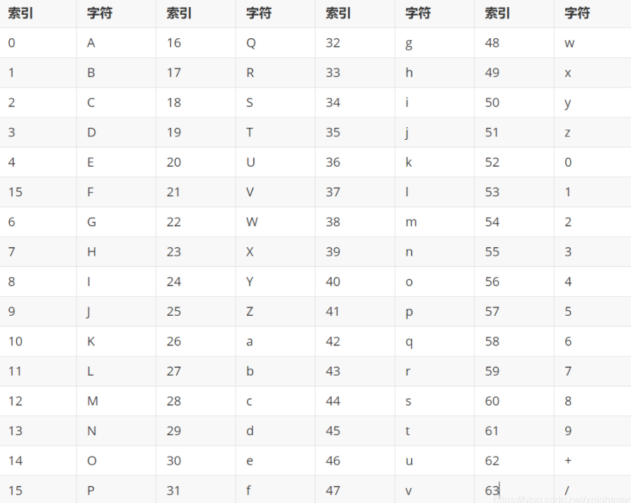
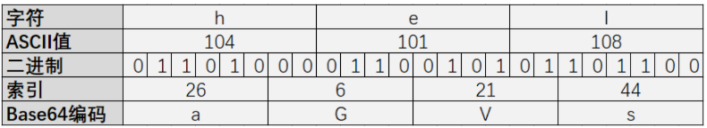
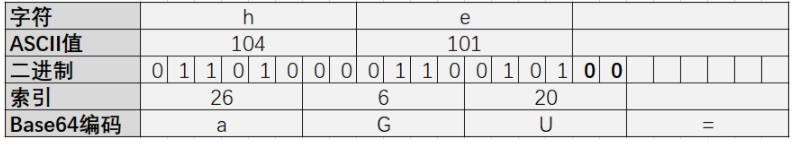
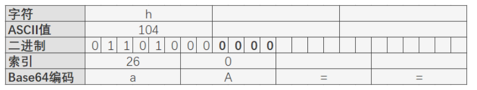
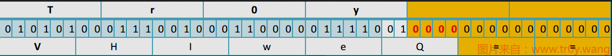
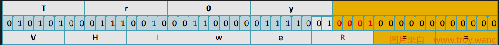

# Base64

BASE64 是一种编码方式, 是一种可逆的编码方式.
编码后的数据是一个字符串, 包含的字符为:` A-Za-z0-9+/`
共 64 个字符：`26 + 26 + 10 + 1 + 1 = 64`
其实是 65 个字符, `=` 是填充字符.



`一个字符ASCII是8位一组 一个base64单元要6位一组`

## 编码

编码时，将要编码的内容转换为二进制数据，每6位作为一组，从表中找到对应的字符。因为ASCII编码8位表示一个字符，`3个ASCII刚好可以编码成4个字符`（3*8=4*6），因此一般以3个ASCII字符为一个编码的基本单位：`



上面说的字符串长度为 3 个字节的数据位数是 8x3=24, 可以精确地分成 6x4.

但需要编码的文本字节数并不总是3的倍数，不可避免会遇见最后只剩下2个或1个字符的情况，需要特殊处理：

%3=2的情况：



%3=1的情况：



## 解码

解码就是编码的逆过程



1.把 Base64 字符串去掉等号, 转为二进制数(VHIweQ== -> VHIweQ -> 010101000111001000110000011110010000)

2.从左到右, 8 个位一组, 多余位的扔掉, 转为对应的 ASCII 码(01010100 01110010 00110000 01111001 0000 -> 扔掉最后 4 位 -> 01010100 01110010 00110000 01111001 -> Tr0y)


### base64隐写原理

注意红色部分，在解码时候将其丢弃了，所以丢弃的值不会影响解码结果，所以可以在这里进行隐写。

为什么等号的那部分 0 不能用于隐写? 因为修改那里的二进制值会导致等号数量变化, 解码的第 1 步会受影响. 自然也就破坏了源字符串.
而红色部分的 0 是作为最后一个字符二进制的组成部分, 还原时只用到了最后一个字符二进制的前部分, 后面的部分就不会影响还原.

唯一的影响就是最后一个字符会变化. 如下图



如果你直接解密’VHIweQ==’与’VHIweR==’, 得到的结果都是’Tr0y’.

当然, 一行 base64 顶多能有 2 个等号, 也就是有 2*2 位的可隐写位. 所以我们得弄很多行, 才能隐藏一个字符串, 这也是为什么题目给了一大段 base64 的原因.
接下来, 把要隐藏的 flag 转为 8 位二进制, 塞进去就行了.

加密(python2)
```py
# -*- coding: cp936 -*-
import base64

flag = 'Tr0y{Base64isF4n}' #flag
bin_str = ''.join([bin(ord(c)).replace('0b', '').zfill(8) for c in flag]) # 转为二进制并将0b去除 前面填充0符合8位

base64chars = 'ABCDEFGHIJKLMNOPQRSTUVWXYZabcdefghijklmnopqrstuvwxyz0123456789+/'

with open('0.txt', 'rb') as f0, open('1.txt', 'wb') as f1: #'0.txt'是明文, '1.txt'用于存放隐写后的 base64
    for line in f0.readlines():
        rowstr = base64.b64encode(line.replace('\n', ''))
        equalnum = rowstr.count('=') # 计算每行有多少个等号

        if equalnum and len(bin_str):
            offset = int('0b'+bin_str[:equalnum * 2], 2)
            char = rowstr[len(rowstr) - equalnum - 1]
            rowstr = rowstr.replace(char, base64chars[base64chars.index(char) + offset])
            bin_str = bin_str[equalnum*2:]

        f1.write(rowstr + '\n')
```

解密(python2)
```py
# -*- coding: cp936 -*-

b64chars = 'ABCDEFGHIJKLMNOPQRSTUVWXYZabcdefghijklmnopqrstuvwxyz0123456789+/'

with open('1.txt', 'rb') as f:
    bin_str = ''
    for line in f.readlines():
        stegb64 = ''.join(line.split()) # 读取文本每一行
        rowb64 =  ''.join(stegb64.decode('base64').encode('base64').split()) # 把内容编码成原生base64

        offset = abs(b64chars.index(stegb64.replace('=','')[-1])-b64chars.index(rowb64.replace('=','')[-1])) # 文本的base64 - 原生base64
        equalnum = stegb64.count('=') #no equalnum no offset
        if equalnum:
            bin_str += bin(offset)[2:].zfill(equalnum * 2)

        print ''.join([chr(int(bin_str[i:i + 8], 2)) for i in xrange(0, len(bin_str), 8)]) #8 位一组
```


## 参考文章

- [神奇的base64隐写](https://www.tr0y.wang/2017/06/14/Base64steg/)
- [base64隐写](https://blog.csdn.net/xnightmare/article/details/103774379)

