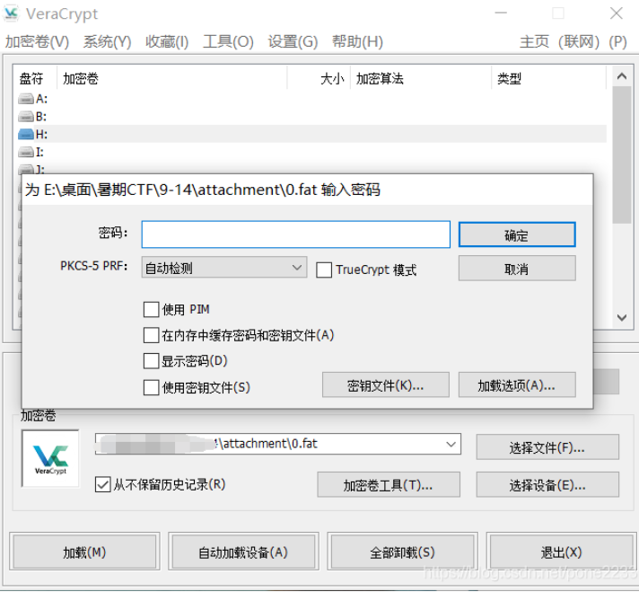
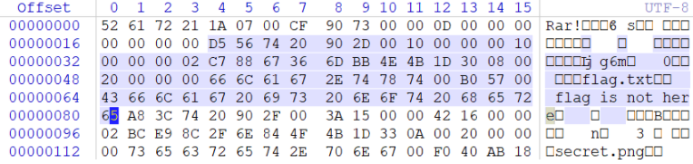
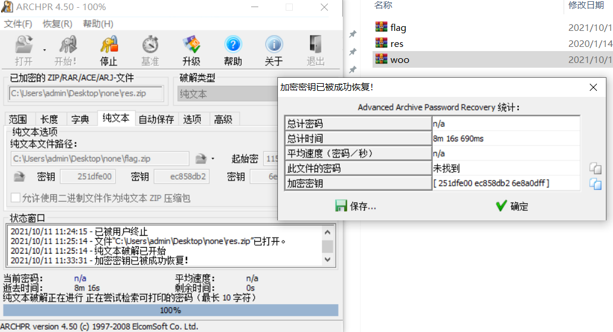
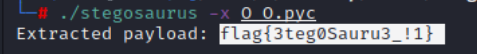
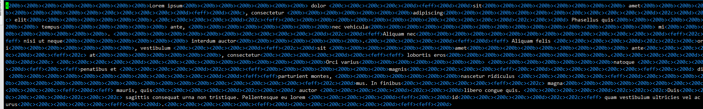
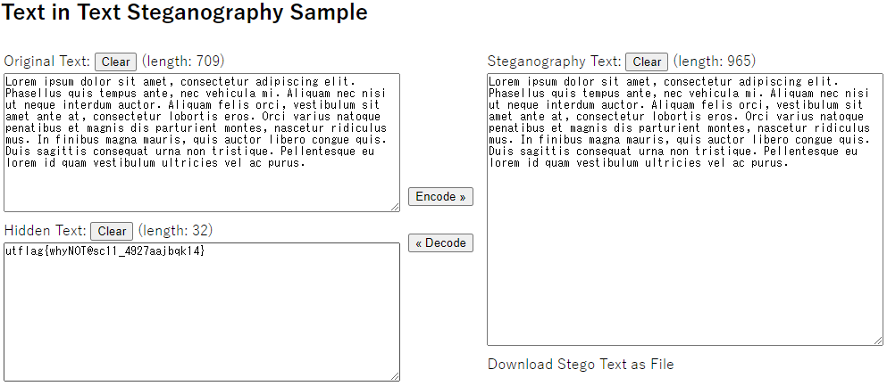
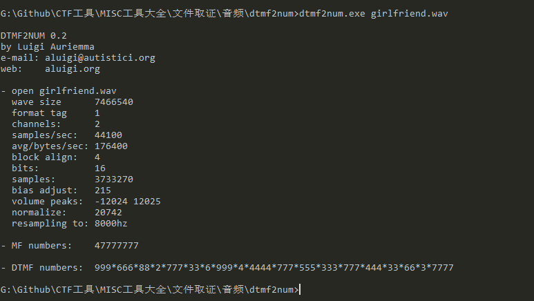
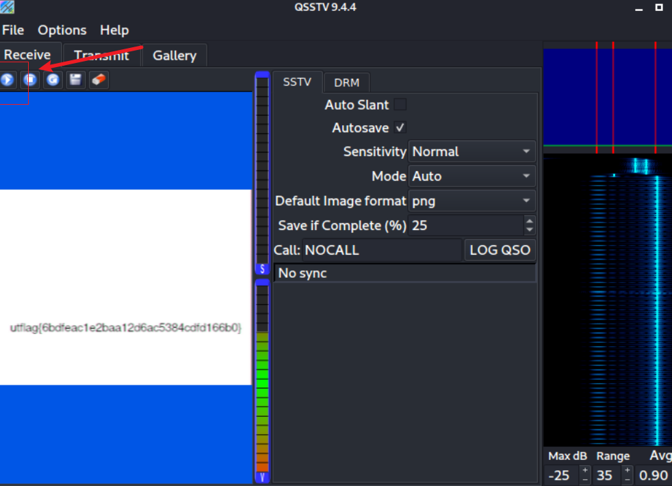

# CTF-Misc

- [CTF-Misc](#CTF-Misc)
    - [时间取证](#时间取证)
        - [时间戳](#时间戳)
    - [内存取证](#内存取证)
        - [iso](#iso)
        - [Volatility](#Volatility)
        - [fat](#fat)
    - [文件取证](#文件取证)
        - [Notepad++](#Notepad++)
        - [010editor](#010editor)
            - [编码](#编码)
            - [修改长宽](#修改长宽)
            - [粘贴复制二进制](#粘贴复制二进制)
            - [IDAT标识缺失](#IDAT标识缺失)
        - [二维码扫描](#二维码扫描)
            - [QR-Research](#QR-Research)
            - [汉信码](#汉信码)
        - [ELF](#ELF)
        - [反转](#反转)
        - [grep](#grep)
        - [stegsolve](#stegsolve)
        - [右键查看属性](#右键查看属性)
        - [常见文件头](#常见文件头)
        - [binwalk](#binwalk)
            - [dd](#dd)
        - [foremost](#foremost)
        - [压缩包分析文件头](#压缩包分析文件头)
            - [RAR](#RAR)
        - [加密的压缩包zip](#加密的压缩包zip)
            - [伪加密](#伪加密)
            - [弱密码](#弱密码)
            - [zip-图片](#zip图片)
            - [CRC32爆破](#CRC32爆破)
            - [明文攻击](#明文攻击)
        - [爆破压缩包](#爆破压缩包)
            - [掩码爆破](#掩码爆破)
        - [BGP](#BGP)
        - [7z](#7z)
        - [vmdk](#vmdk)
        - [图片拼接](#图片拼接)
        - [F5-steganography](#F5-steganography)
        - [outguess](#outguess)
        - [盲水印](#盲水印)
        - [频域盲水印](#频域盲水印)
        - [base64隐写](#base64隐写)
        - [ScreenToGif](#ScreenToGif)
        - [exiftool](#exiftool)
        - [strings](#strings)
        - [pyc反编译](#pyc反编译)
        - [pyc隐写](#pyc隐写)
        - [LSB隐写](#LSB隐写)
        - [TTL隐写](#TTL隐写)
        - [时间隐写](#时间隐写)
        - [零宽度字节隐写](#零宽度字节隐写)
        - [编程语言](#编程语言)
            - [logo语言解释器](#logo语言解释器)
            - [G语言解释器](#G语言解释器)
    - [流量取证](#流量取证)
        - [wireshark](#wireshark)
            - [tshark](#tshark)
            - [lsass.dmp](#lsass.dmp)
            - [UsbKeyboardDataHacker](#UsbKeyboardDataHacker)
            - [私钥解密](#私钥解密)
            - [流量包提取数据](#流量包提取数据)
    - [音频取证](#音频取证)
        - [Audacity](#Audacity)
        - [dtmf2num](#dtmf2num)
        - [音频LSB隐写](#音频LSB隐写)
        - [Steghide](#Steghide)
        - [频谱图](#频谱图)
        - [qsstv](#qsstv)
    - [磁盘取证](#磁盘取证)
        - [Ntfs隐写](#Ntfs隐写)
    - [DOC取证](#DOC取证)
        - [密码爆破](#密码爆破)
        - [隐藏文字](#隐藏文字)

- [文章](#文章)
    - https://ctf-wiki.org/misc/introduction/

## 时间取证

### 时间戳

https://tool.chinaz.com/tools/unixtime.aspx
## 内存取证

### ISO

用foremost分离

### Volatility

Volatility是一款开源内存取证框架，能够对导出的内存镜像进行分析，通过获取内核数据结构，使用插件获取内存的详细情况以及系统的运行状态。

```bash
git clone https://github.com/volatilityfoundation/volatility.git

# pip install pycrypto

官方Github：https://github.com/volatilityfoundation

支持pyhton2: https://github.com/volatilityfoundation/volatility

支持python3：https://github.com/volatilityfoundation/volatility3
```

用法：
```bash
# 先通过 imageinfo 获取系统信息
python2 vol.py -f Target.vmem imageinfo
python2 vol.py -f ../memory.img imageinfo

# 查看进程
python2 vol.py -f ../memory.img --profile=Win2003SP1x86 pslist

# 查看cmd命令使用记录
python2 vol.py -f ../memory.img --profile=Win2003SP1x86 cmdscan

# 将DumpIT.exe进程dump下来 -p为进程号
python2 vol.py -f ../memory.img --profile=Win2003SP1x86 memdump -p 1992 --dump-dir=../

# 分离dmp
foremost 1992.dmp
# 使用hashdump命令获取用户名
python2 vol.py -f Target.vmem --profile=Win7SP1x64 hashdump

# lsadump命令获取最后登录的用户
python2 vol.py -f Target.vmem --profile=Win7SP1x64 lsadump
```

用mimikatz插件获取
```
python2 -m pip install construct
cp mimikatz.py /volatility/plugins/
python2 vol.py  -f tmp.vmem --profile=Win7SP1x64 mimikatz
```

### fat

VeraCrypt 进行挂载

需要挂载密码，可猜测，任意选一个挂载盘

不同的密码能开启不同的盘



打不开的文件可以winhex->工具->打开磁盘
## 文件取证

### Notepad++

右上角插件可转换 hex->Ascii
### 010Editor

**如何导入十六进制文件**

文件->导入十六进制文件

安装插件：Templates
### 编码

### 修改长宽

一般在第二行 6 7列

6是宽 7是高

### 粘贴复制二进制

编辑->粘贴为

编辑->复制为

### IDAT标识缺失

对比好的png，利用png插件来增加IDAT标识

## 二维码

### QR-Research

### 汉信码

需要用手机app 中国编码扫描
## ELF

./ 执行即可

## 反转

```bash
cat 1 | rev
```
## grep

linux之用 grep -r 关键字 快速搜索在目录下面的含有关键字的文件

`grep -r 'CTF' ./output `

## stegsolve

Frame Browser:帧浏览器   主要是对GIF之类的动图进行分解，把动图一帧帧的放，有时候会是二维码
### 右键查看属性

右键查看属性-详情信息-备注
### 常见文件头

https://vxhly.github.io/views/windows/file-header-and-tail.html#%E4%BB%8E-ultraedit-%E6%8F%90%E5%8F%96%E7%9A%84%E6%96%87%E4%BB%B6%E5%A4%B4%E4%BF%A1%E6%81%AF

```
JPEG (jpg)，                        　　文件头：FFD8FF E0　　　　　　　　　　　　　　　　　　　　 文件尾：FF D9　　　　　　　　　　　　　　　
PNG (png)，                       　　 文件头：89504E47　　　　　　　　　　　　　　　　　　　　　　文件尾：AE 42 60 82
GIF89 (gif)，                           　　文件头：4749463839　　　　　　　　　　　　　　　　　　　　　　文件尾：00 3B                                                                 ZIP Archive (zip)，                     文件头：504B0304　　　　　　　　　　　　　　　　　　　　　　文件尾：50 4B

TIFF (tif)，                           　  文件头：49492A00　　　　　　　　　　　　　　　　　　　　　　文件尾：
Windows Bitmap (bmp)，      　  文件头：424D　　　　　　　　　　　　　　　　　　　　　　　　 文件尾：
CAD (dwg)，                        　  文件头：41433130　　　　　　　　　　　　　　　　　　　　　　文件尾：
Adobe Photoshop (psd)，          文件头：38425053　　　　　　　　　　　　　　　　　　　　　　文件尾：
Rich Text Format (rtf)，             文件头：7B5C727466　　　　　　　　　　　　　　　　　　　　  文件尾：
XML (xml)，                              文件头：3C3F786D6C　　　　　　　　　　　　　　　　　　　　 文件尾：
HTML (html)，                           文件头：68746D6C3E
Email [thorough only] (eml)，     文件头：44656C69766572792D646174653A
Outlook Express (dbx)，            文件头：CFAD12FEC5FD746F
Outlook (pst)，                         文件头：2142444E
MS Word/Excel (xls.or.doc)，      文件头：D0CF11E0
MS Access (mdb)，                    文件头：5374616E64617264204A
WordPerfect (wpd)，                  文件头：FF575043
Adobe Acrobat (pdf)，               文件头：255044462D312E
Quicken (qdf)，                         文件头：AC9EBD8F
Windows Password (pwl)，         文件头：E3828596

RAR Archive (rar)，                    文件头：526172211A0700 文件尾：0700
Wave (wav)，                            文件头：57415645
AVI (avi)，                                 文件头：41564920
Real Audio (ram)，                     文件头：2E7261FD
Real Media (rm)，                       文件头：2E524D46
MPEG (mpg)，                           文件头：000001BA
MPEG (mpg)，                           文件头：000001B3
Quicktime (mov)，                     文件头：6D6F6F76
Windows Media (asf)，               文件头：3026B2758E66CF11
MIDI (mid)，                              文件头：4D546864
```
### binwalk

kali
```py
binwalk xxx
binwalk -e xxx
```

```
XML document, version: "1.0"

表示ppt文件、docx文件
```

### dd

分离指定命令

```bash
dd if=attachment.jpg of=test.zip skip=21639 bs=1
```

### foremost

kali下用foremost

### 压缩包分析文件头

https://blog.csdn.net/Claming_D/article/details/105899397


#### RAR



```
D5 56 ：HEAD_CRC，2字节，也就是文件头部分的crc校验值
74 ：HEAD_TYPE，1字节，块类型，74表示块类型是文件头
20 90 ：HEAD_FLAGS，2字节，位标记，这块在资料上没找到对应的数值，不知道20 90代表什么意思。
2D 00 ：HEAD_SIZE，2字节，文件头的全部大小（包含文件名和注释）
10 00 00 00 ：PACK_SIZE，4字节，已压缩文件大小
10 00 00 00 ：UNP_SIZE，4字节，未压缩文件大小
02：HOST_OS，1字节，保存压缩文件使用的操作系统，02代表windows
C7 88 67 36：FILE_CRC，4字节，文件的CRC值
6D BB 4E 4B ：FTIME，4字节，MS DOS 标准格式的日期和时间
1D：UNP_VER，1字节，解压文件所需要的最低RAR版本
30：METHOD，1字节，压缩方式，这里是存储压缩
08 00 ：NAME_SIZE，2字节，表示文件名大小，这里文件名大小是8字节（flag.txt）
20 00 00 00 ：ATTR，4字节，表示文件属性这里是txt文件
66 6C 61 67 2E 74 78 74：FILE_NAME（文件名） ，NAME_SIZE字节大小，这里NAME_SIZE大小为8
再往后是txt文件内容，一直到第六行 65 结束，下面是另一个文件块的开始

这个块中存在两个crc值，一个是文件头块中从块类型到文件名这38个字节的校验，后一个则是压缩包中所包含文件的crc校验，解压时，会计算解压后生成文件的crc值，如果等于这里的crc，则解压完成，如果不同，则报错中断。
```
### 加密的压缩包zip


#### 伪加密

用winhex查看全局加密标志和局部加密标志

工具：ZipCenOp.jar

`java -jar ZipCenOp.jar r 111.zip` 解密

#### 弱密码

题目中会有提示或者给出字典，直接爆破
#### zip—图片

一般是隐写题目，从图片中找出密码
#### CRC32爆破

一般用于压缩包里文件内容较短时

CRC32校验爆破原理说明：

CRC32:CRC本身是“冗余校验码”的意思，CRC32则表示会产生一个32bit（8位十六进制数）的校验值。


在产生CRC32时，源数据块的每一位都参与了运算，因此即使数据块中只有一位发生改变也会得到不同的CRC32值，利用这个原理我们可以直接爆破出加密文件的内容。

#### 明文攻击

题给的压缩包里面有一个flag.txt，和刚解压出的txt大小相同，则可以明文攻击

攻击时要注意txt重新压缩（找对应的压缩软件winrar）

用archpr2明文攻击 - 破解类型 纯文本/明文攻击

爆破时间较长 点击确定保存为zip文件，解压出现flag


### 爆破压缩包

archpr2 可爆破rar
{vI0_l3t_Ev3rg@RdeN}
#### 掩码爆破

archpr工具可掩码爆破

掩码:知道密码中的一部分,只需按规则构造其余部分

15????????.??

结合时间戳

#### 生日爆破

19700000-20000000

### BGP

BPG（Better Portable Graphics）是一种新的图像格式。它的目的是在质量或文件大小有问题时替换 JPEG 图像格式

工具下载地址：https://bellard.org/bpg/

直接将BGP拖动到bgview.exe即可
### 7z

linux下7z解压vmdk更完整，windows下7z有问题

```bash
7z x flag.vmdk
```

### vmdk

VMDK：（VMWare Virtual Machine Disk Format）是虚拟机VMware创建的虚拟硬盘格式，文件存在于VMware文件系统中，被称为VMFS（虚拟机文件系统）

遇到vmdk可以试试使用7z这个压缩软件打开

### 图片拼接

kali

```bash
montage -tile 10x12 -geometry 200x100+0+0 *jpg flag.jpg
gaps --image=flag.jpg --generations=40 --population=120 --size=100
```

环境安装：
```
apt-get install graphicsmagick-imagemagick-compat
git clone https://github.com/nemanja-m/gaps.git
cd gaps
python3 set-up.py install
pip3 install -r requirement.txt
```
### F5-steganography

```bash
git clone https://github.com/matthewgao/F5-steganography

java Extract 文件
java Extract 文件 -p 密码 -e 输出文件
```


### outguess

```bash
git clone https://github.com/crorvick/outguess
cd outguess
./configure && make && make install

# 加密
outguess -k "my secret key" -d hidden.txt demo.jpg out.jpg

# 解密
 outguess -k "my secret key" -r out.jpg hidden.txt

```

### 盲水印

https://github.com/chishaxie/BlindWaterMark


```py

pip install -r requirements.txt

#requirements.txt里面版本有点问题，修改别的版本即可
#合成盲水印图
python bwm.py encode hui.png wm.png hui_with_wm.png

#提取图中的盲水印 (需要原图)
python bwm.py decode hui.png hui_with_wm.png wm_from_hui.png
```

### 频域盲水印

https://github.com/linyacool/blind-watermark

```py
import cv2
import numpy as np
import random
import os
from argparse import ArgumentParser

ALPHA = 5

def build_parser():
    parser = ArgumentParser()
    parser.add_argument('--original', dest='ori', required=True)
    parser.add_argument('--image', dest='img', required=True)
    parser.add_argument('--result', dest='res', required=True)
    parser.add_argument('--alpha', dest='alpha', default=ALPHA)
    return parser

def main():
    parser = build_parser()
    options = parser.parse_args()
    ori = options.ori
    img = options.img
    res = options.res
    alpha = options.alpha
    if not os.path.isfile(ori):
        parser.error("original image %s does not exist." % ori)
    if not os.path.isfile(img):
        parser.error("image %s does not exist." % img)
    decode(ori, img, res, alpha)

def decode(ori_path, img_path, res_path, alpha):
    ori = cv2.imread(ori_path)
    img = cv2.imread(img_path)
    ori_f = np.fft.fft2(ori)
    img_f = np.fft.fft2(img)
    height, width = ori.shape[0], ori.shape[1]
    watermark = (ori_f - img_f) / alpha
    watermark = np.real(watermark)
    res = np.zeros(watermark.shape)
    random.seed(height + width)
    x = range(height / 2)
    y = range(width)
    random.shuffle(x)
    random.shuffle(y)
    for i in range(height / 2):
        for j in range(width):
            res[x[i]][y[j]] = watermark[i][j]
    cv2.imwrite(res_path, res, [int(cv2.IMWRITE_JPEG_QUALITY), 100])

if __name__ == '__main__':
    main()
```

```py
# 如果报错装这个
pip install opencv-python==4.2.0.32 -i http://mirrors.aliyun.com/pypi/simple --trusted-host mirrors.aliyun.com

# 解密命令
python2 pinyubwm.py --original huyao.png --image stillhuyao.png --result out.png

```
### base64隐写


### ScreenToGif

gif分帧工具

打开编辑器拖进图片即可

### exiftool

跟右键查看属性类似 一个升级版

用于读写和处理图像

exiftool attachment.jpg

kali:

`exiftool * | grep flag`


也可以用kali下的strings 4.png

### strings

 打印文件中可打印的字符

strings 4.png
### pyc反编译

https://tool.lu/pyc/

### pyc隐写
https://github.com/AngelKitty/stegosaurus

https://zhuanlan.zhihu.com/p/51226097

Stegosaurus 是一款隐写工具，它允许我们在 Python 字节码文件( pyc 或 pyo )中嵌入任意 Payload 。由于编码密度较低，因此我们嵌入 Payload 的过程既不会改变源代码的运行行为，也不会改变源文件的文件大小。 Payload 代码会被分散嵌入到字节码之中，所以类似 strings 这样的代码工具无法查找到实际的 Payload 。 Python 的 dis 模块会返回源文件的字节码，然后我们就可以使用 Stegosaurus 来嵌入 Payload 了。


python -m stegosaurus aaa.py -s --payload "test{123}"

./stegosaurus -x O_O.pyc

直接用github releases已经打包好的bin文件 kali下运行


### LSB隐写

1. Stegosolve

- Anglyse-Data-Extract 选择Bit Planes 的0 红绿蓝都试试 -save bin

2.？
https://github.com/livz/cloacked-pixel

python2 lsb.py extract 1.png 1.txt 123456

### TTL隐写

https://www.cnblogs.com/yunqian2017/p/14671031.html

TTL隐写中用到四个值：00 111111（63）,01 111111（127）,10 111111（191）,11 111111（255）,解密的时候只取前两位，然后转换成ascii

```
IP报文在路由间穿梭的时候每经过一个路由，TTL就会减1，当TTL为0的时候，该报文就会被丢弃。
    TTL所占的位数是8位，也就是0-255的范围，但是在大多数情况下通常只需要经过很小的跳数就能完成报文的转发，
    远远比上限255小得多，所以我们可以用TTL值的前两位来进行传输隐藏数据。
    如：须传送H字符，只需把H字符换成二进制，每两位为一组，每次填充到TTL字段的开头两位并把剩下的6位设置为1（xx111111），这样发4个IP报文即可传送1个字节。
```

### 时间隐写

例子：得到一张flag.gif。考虑一下每帧停顿的时间。

使用`identify`命令。

`identify -format “%T” flag.gif`

会得到一串数字

### 零宽度字节隐写

http://330k.github.io/misc_tools/unicode_steganography.html

vim打开可以发现有很多<200b>






### 编程语言
#### logo语言解释器

```
cs pu lt 90 fd 500 rt 90 pd fd 100 rt 90 repeat 18[fd 5 rt 10]
```

https://www.calormen.com/jslogo/

#### G语言解释器

https://ncviewer.com/
## 流量取证

### Wireshark

过滤POST包

```
http.request.method==POST
```

去掉404
```
http.response.code !=404
```


搜索有没有包含"flag"的包
```
ip.contains "flag"
```

tcp流
```
tcp.stream eq 0
```
#### tshark

```
tshark -r sqltest.pcapng -Y "http.request" -T fields -e http.request.full_uri > data.txt
```

-r 读取文件
-Y 过滤语句
-T pdml|ps|text|fields|psml,设置解码结果输出的格式
-e 输出特定字段

http.request.uri http请求的uri部分

#### lsass.dmp

lsass是windows系统的一个进程，用于本地安全和登陆策略。mimikatz可以从 lsass.exe 里获取windows处于active状态账号明文密码。本题的lsass.dmp就是内存运行的镜像，也可以提取到账户密码

https://github.com/gentilkiwi/mimikatz/releases/

以管理员身份运行
```
privilege::debug
sekurlsa::minidump lsass.dmp
sekurlsa::logonpasswords full

```


### UsbKeyboardDataHacker

usb取证 wireshark里全是USB协议流量数据包可用UsbKeyboardDataHacker工具提取

https://github.com/WangYihang/UsbKeyboardDataHacker

`python UsbKeyboardHacker.py data.pcap`

### 私钥解密

在流量包发现私钥后另存为本地1.key

编辑->首选项->protocols->TLS 把1.key导入即可，追踪TLS流

例题：greatescape

### 流量包提取数据

以下是提取ICMP最后8位的例子
```py
from scapy.all import *

packets = rdpcap('out.pcapng')

for packet in packets:
    if packet.haslayer(ICMP):
        if packet[ICMP].type == 0:
            print packet[ICMP].load[-8:]

```
## 音频取证

### Audacity

关于摩斯电码的一个小技巧

文件->导出为wav（若有两个声道，则先分离立体声到单音道）


kali(kali右上角要开启声音)
```bash
morse2ascii good.wav
```


将`t`替换为`-`，e替换为`.`


### dtmf2num


DTMF拨号音识别

dtmf2num.exe girlfriend.wav



### 音频LSB隐写

SilentEye工具解码

### Steghide

Steghide是一个可以将文件隐藏到图片或音频中的工具

```bash
apt-get install steghide

# 隐藏文件
steghide embed -cf [图片文件载体] -ef [待隐藏文件]
steghide embed -cf 1.jpg -ef 1.txt

# 查看图片中嵌入的文件信息
steghide info 1.jpg

# 提取图片中隐藏的文件
steghide extract -sf 1.jpg
```

### 频谱图

https://www.sonicvisualiser.org/download.html

layer->Add Peak Frequency Spectrogram或者Shift+K

### qsstv

慢扫描电视（SSTV）
慢扫描电视（Slow-scan television）是业余无线电爱好者的一种主要图片传输方法，慢扫描电视通过无线电传输和接收单色或彩色静态图片。


kali安装QSSTV

`apt-get install qsstv`

Options->Configuration->Sound勾选From file

然后点击这个小按钮，选择attachment.wav开始解码



## 磁盘取证

### Ntfs隐写

工具：NtfsStreamsEditor

虚拟机 有些需要winrar解压才能提取到

## DOC取证

flag有时候把颜色设置为白色 需要全选换成可见颜色

https://www.cnblogs.com/WhiteHatKevil/articles/10051582.html

### 密码爆破

https://down.52pojie.cn/?query=

Accent OFFICE Password Recovery v5.1 CracKed By Hmily[LCG][LSG]

一般猜测四位纯数字

### 隐藏文字

文件->选项->显示->隐藏文字

格式刷或者右键文字隐藏去掉 就可以复制