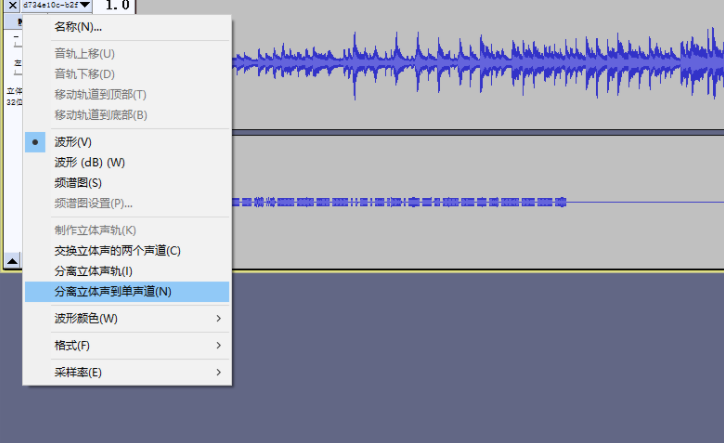
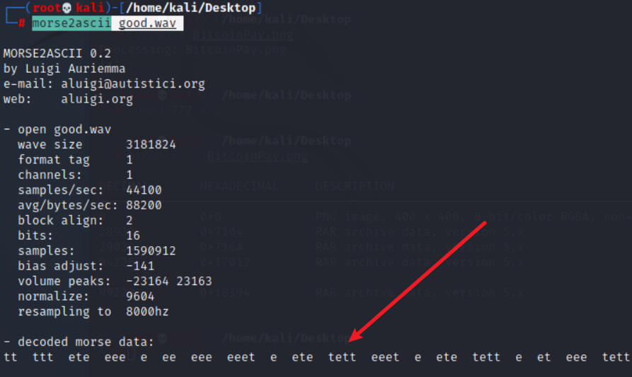

# CTF-Misc

- [CTF-Misc](#CTF-Misc)
    - [内存取证](#内存取证)
        - [Volatility](#Volatility)
    - [文件取证](#文件取证)
        - [stegsolve](#stegsolve)
        - [右键查看属性](#右键查看属性)
        - [常见文件头](#常见文件头)
        - [binwalk](#binwalk)
        - [foremost](#foremost)
        - [爆破压缩包](#爆破压缩包)
        - [7z](#7z)
        - [F5-steganography](#F5-steganography)
        - [outguess](#outguess)
        - [base64隐写](#base64隐写)
        - [ScreenToGif](#ScreenToGif)
    - [流量取证](#流量取证)
        - [wireshark](#wireshark)
    - [音频取证](#音频取证)
        - [Audacity](#Audacity)
    - [磁盘取证](#磁盘取证)
        - [Ntfs隐写](#Ntfs隐写)
## 内存取证

### Volatility

Volatility是一款开源内存取证框架，能够对导出的内存镜像进行分析，通过获取内核数据结构，使用插件获取内存的详细情况以及系统的运行状态。

```bash
git clone https://github.com/volatilityfoundation/volatility.git

# pip install pycrypto

官方Github：https://github.com/volatilityfoundation

支持pyhton2: https://github.com/volatilityfoundation/volatility

支持python3：https://github.com/volatilityfoundation/volatility3
```

用法：
```bash
# 先通过 imageinfo 获取系统信息
python2 vol.py -f Target.vmem imageinfo

# 使用hashdump命令获取用户名
python2 vol.py -f Target.vmem --profile=Win7SP1x64 hashdump

# lsadump命令获取最后登录的用户
python2 vol.py -f Target.vmem --profile=Win7SP1x64 lsadump
```

用mimikatz插件获取
```
python2 -m pip install construct
cp mimikatz.py /volatility/plugins/
python2 vol.py  -f tmp.vmem --profile=Win7SP1x64 mimikatz
```

## 文件取证

## stegsolve

Frame Browser:帧浏览器   主要是对GIF之类的动图进行分解，把动图一帧帧的放，有时候会是二维码
### 右键查看属性

右键查看属性-详情信息-备注
### 常见文件头

```
JPEG (jpg)，                        　　文件头：FFD8FF　　　　　　　　　　　　　　　　　　　　　　　 文件尾：FF D9　　　　　　　　　　　　　　　
PNG (png)，                       　　 文件头：89504E47　　　　　　　　　　　　　　　　　　　　　　文件尾：AE 42 60 82
GIF89 (gif)，                           　　文件头：4749463839　　　　　　　　　　　　　　　　　　　　　　文件尾：00 3B                                                                 ZIP Archive (zip)，                     文件头：504B0304　　　　　　　　　　　　　　　　　　　　　　文件尾：50 4B

TIFF (tif)，                           　  文件头：49492A00　　　　　　　　　　　　　　　　　　　　　　文件尾：
Windows Bitmap (bmp)，      　  文件头：424D　　　　　　　　　　　　　　　　　　　　　　　　 文件尾：
CAD (dwg)，                        　  文件头：41433130　　　　　　　　　　　　　　　　　　　　　　文件尾：
Adobe Photoshop (psd)，          文件头：38425053　　　　　　　　　　　　　　　　　　　　　　文件尾：
Rich Text Format (rtf)，             文件头：7B5C727466　　　　　　　　　　　　　　　　　　　　  文件尾：
XML (xml)，                              文件头：3C3F786D6C　　　　　　　　　　　　　　　　　　　　 文件尾：
HTML (html)，                           文件头：68746D6C3E
Email [thorough only] (eml)，     文件头：44656C69766572792D646174653A
Outlook Express (dbx)，            文件头：CFAD12FEC5FD746F
Outlook (pst)，                         文件头：2142444E
MS Word/Excel (xls.or.doc)，      文件头：D0CF11E0
MS Access (mdb)，                    文件头：5374616E64617264204A
WordPerfect (wpd)，                  文件头：FF575043
Adobe Acrobat (pdf)，               文件头：255044462D312E
Quicken (qdf)，                         文件头：AC9EBD8F
Windows Password (pwl)，         文件头：E3828596

RAR Archive (rar)，                    文件头：52617221
Wave (wav)，                            文件头：57415645
AVI (avi)，                                 文件头：41564920
Real Audio (ram)，                     文件头：2E7261FD
Real Media (rm)，                       文件头：2E524D46
MPEG (mpg)，                           文件头：000001BA
MPEG (mpg)，                           文件头：000001B3
Quicktime (mov)，                     文件头：6D6F6F76
Windows Media (asf)，               文件头：3026B2758E66CF11
MIDI (mid)，                              文件头：4D546864
```
### binwalk

```py
python binwalk.py mianju.jpg

# 从图片中分离 -e
python binwalk.py -e mianju.jpg

```

### foremost

kali下用foremost

### 爆破压缩包

archpr2 可爆破rar

### 7z

linux下7z解压vmdk更完整，windows下7z有问题

```bash
7z x flag.vmdk
```

### F5-steganography

```bash
git clone https://github.com/matthewgao/F5-steganography

java Extract 文件
java Extract 文件 -p 密码 -e 输出文件
```


### outguess

```bash
git clone https://github.com/crorvick/outguess
cd outguess
./configure && make && make install

# 加密
outguess -k "my secret key" -d hidden.txt demo.jpg out.jpg

# 解密
 outguess -k "my secret key" -r out.jpg hidden.txt

```

### base64隐写


### ScreenToGif

gif分帧工具

打开编辑器拖进图片即可
## 流量取证

### Wireshark

过滤POST包

http.request.method==POST


## 音频取证

### Audacity

关于摩斯电码的一个小技巧

文件->导出为wav（若有两个声道，则先分离立体声到单音道）




kali(kali右上角要开启声音)
```bash
morse2ascii good.wav
```



将`t`替换为`-`，e替换为`.`

## 磁盘取证

### Ntfs隐写

工具：NtfsStreamsEditor