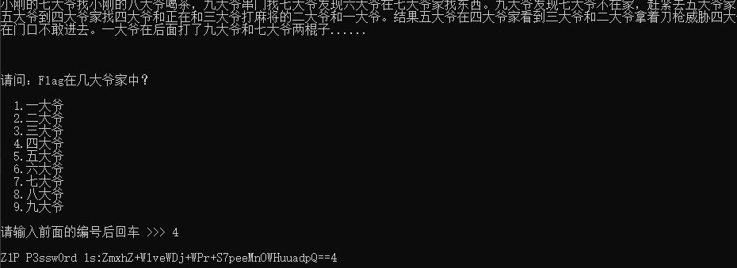

# BMZCTF-MISC

- [BMZCTF-MISC](#BMZCTF-MISC)
    - [真正的CTFer](#真正的CTFer)
    - [解不开的秘密](#解不开的秘密)
    - [技协杯-签到](#技协杯-签到)
    - [SDNISC2020_简单数据包](#SDNISC2020_简单数据包)
    - [2018-HEBTUCTF-签到题](#2018-HEBTUCTF-签到题)
    - [2018-HEBTUCTF-你可能需要一个wireshark](#2018-HEBTUCTF-你可能需要一个wireshark)
    - [MISC_你猜猜flag](#MISC_你猜猜flag)
    - [2018-护网杯-迟来的签到题](#2018-护网杯-迟来的签到题)
    - [签到题](#签到题)
    - [日志审计](#日志审计)
    - [哆啦A梦](#哆啦A梦)
    - [flag就在这](#flag就在这)
    - [Fix-it](#Fix-it)
    - [flag](#flag)
    - [宝宝](#宝宝)
    - [赢战2019](#赢战2019)
    - [海量的txt文件](#海量的txt文件)
    - [2018-hackergame-Word-文档](#2018-hackergame-Word-文档)
    - [神秘压缩包](#神秘压缩包)
    - [2020首届祥云杯-到点了](#2020首届祥云杯-到点了)
    - [小明的演讲](#小明的演讲)
    - [Traffic_Light](#Traffic_Light)
    - [SDNISC2020_过去和现在](#SDNISC2020_过去和现在)


## 真正的CTFer

文件取证->图片分析->修改宽高


flag{d2b5543c2f8aa8229057872dd85ce5a9}


## 解不开的秘密

密码取证->VNC

base16->base64得到

```
Windows Registry Editor Version 5.00

[HKEY_CURRENT_USER\Software\RealVNC]

[HKEY_CURRENT_USER\Software\RealVNC\vnclicensewiz]
"_AnlClientId"="8f5cc378-2e1d-4670-80e0-d2d81d882561"
"_AnlSelected"="0"
"_AnlInclRate"="0.0025"

[HKEY_CURRENT_USER\Software\RealVNC\vncserver]

[HKEY_CURRENT_USER\Software\RealVNC\VNCViewer4]
"dummy"=""

[HKEY_CURRENT_USER\Software\RealVNC\VNCViewer4\MRU]
"00"="127.0.0.1"
"Order"=hex:00,01
"01"="127.0.0.1:5900"

[HKEY_CURRENT_USER\Software\RealVNC\WinVNC4]
"Password"=hex:37,5e,be,86,70,b3,c6,f3
"SecurityTypes"="VncAuth"
"ReverseSecurityTypes"="None"
"QueryConnect"=dword:00000000
"PortNumber"=dword:0000170c
"LocalHost"=dword:00000000
"IdleTimeout"=dword:00000e10
"HTTPPortNumber"=dword:000016a8
"Hosts"="+,"
"AcceptKeyEvents"=dword:00000001
"AcceptPointerEvents"=dword:00000001
"AcceptCutText"=dword:00000001
"SendCutText"=dword:00000001
"DisableLocalInputs"=dword:00000000
"DisconnectClients"=dword:00000001
"AlwaysShared"=dword:00000000
"NeverShared"=dword:00000000
"DisconnectAction"="None"
"RemoveWallpaper"=dword:00000000
"RemovePattern"=dword:00000000
"DisableEffects"=dword:00000000
"UseHooks"=dword:00000001
"PollConsoleWindows"=dword:00000001
"CompareFB"=dword:00000001
"Protocol3.3"=dword:00000000
"dummy"=""
```

其中
[HKEY_CURRENT_USER\Software\RealVNC]
"Password"=hex:37,5e,be,86,70,b3,c6,f3

用VNC工具破解https://github.com/x0rz4/vncpwd

`vncpwd.exe 375ebe8670b3c6f3`


得到!QAZ2wsx 拿去解压docx


flag{aec1294a146b8ece1e3a295e557e198c}

## 技协杯-签到

docx解压


flag{873f6218-dc48-11ea-a3b9-dca90498a2db}

## SDNISC2020_简单数据包

wireshark打不开，就直接拿去binalk跑，发现有压缩包 直接分离，得到一串字符串，base64解码皆可

flag{sdnisc_net_sQ2X3Q9x}

## 2018-HEBTUCTF-签到题

解压后010在结尾处发现flag

HEBTUCTF{lkfdlfnqwnoidasfmaklmf}

## 2018-HEBTUCTF-你可能需要一个wireshark


追踪POST的第二个HTTP流


SEVCVFVDVEYlN0JmMWFnXzFzX3czbl9kNG8lN0Q=

HEBTUCTF{f1ag_1s_w3n_d4o}

## MISC_你猜猜flag

flag.exe



输入4 base64解码是 flag好像可以猜出来

将flag.exe拖去binwalk发现压缩包，要密码，ZmxhZ+WlveWDj+WPr+S7peeMnOWHuuadpQ==4

解压后 txt打开mdb搜索flag皆可

## 2018-护网杯-迟来的签到题

提示异或

```py
import base64
import string

flag = ''
a = base64.b64decode('AAoHAR1TIiIkUFUjUFQgVyInVSVQJVFRUSNRX1YgXiJSVyJQVRs=')

for i in string.printable:
    for j in a:
        flag += chr( ord(i) ^ j)
    print(flag + '\n')
```


## 签到题

关注公众号：白帽子社区，回复关键字：BMZCTF 获取flag

BMZCTF{W3lc0me_t0_BMZCTF!}

## 日志审计

```
192.168.0.1 - - [13/Oct/2018:12:38:14  0000] "GET /flag.php?user=hence' AND ORD(MID((SELECT IFNULL(CAST(secret AS CHAR),0x20) FROM haozi.secrets ORDER BY secret LIMIT 0,1),1,1))=102-- pZaF HTTP/1.1" 200 327 "-" "sqlmap/1.2#pip (http://sqlmap.org)"
192.168.0.1 - - [13/Oct/2018:12:38:14  0000] "GET /flag.php?user=hence' AND ORD(MID((SELECT IFNULL(CAST(secret AS CHAR),0x20) FROM haozi.secrets ORDER BY secret LIMIT 0,1),2,1))=108-- pZaF HTTP/1.1" 200 327 "-" "sqlmap/1.2#pip (http://sqlmap.org)"
192.168.0.1 - - [13/Oct/2018:12:38:14  0000] "GET /flag.php?user=hence' AND ORD(MID((SELECT IFNULL(CAST(secret AS CHAR),0x20) FROM haozi.secrets ORDER BY secret LIMIT 0,1),3,1))=97-- pZaF HTTP/1.1" 200 327 "-" "sqlmap/1.2#pip (http://sqlmap.org)"
192.168.0.1 - - [13/Oct/2018:12:38:14  0000] "GET /flag.php?user=hence' AND ORD(MID((SELECT IFNULL(CAST(secret AS CHAR),0x20) FROM haozi.secrets ORDER BY secret LIMIT 0,1),4,1))=103-- pZaF HTTP/1.1" 200 327 "-" "sqlmap/1.2#pip (http://sqlmap.org)"
192.168.0.1 - - [13/Oct/2018:12:38:14  0000] "GET /flag.php?user=hence' AND ORD(MID((SELECT IFNULL(CAST(secret AS CHAR),0x20) FROM haozi.secrets ORDER BY secret LIMIT 0,1),5,1))=123-- pZaF HTTP/1.1" 200 327 "-" "sqlmap/1.2#pip (http://sqlmap.org)"
192.168.0.1 - - [13/Oct/2018:12:38:14  0000] "GET /flag.php?user=hence' AND ORD(MID((SELECT IFNULL(CAST(secret AS CHAR),0x20) FROM haozi.secrets ORDER BY secret LIMIT 0,1),6,1))=109-- pZaF HTTP/1.1" 200 327 "-" "sqlmap/1.2#pip (http://sqlmap.org)"
192.168.0.1 - - [13/Oct/2018:12:38:14  0000] "GET /flag.php?user=hence' AND ORD(MID((SELECT IFNULL(CAST(secret AS CHAR),0x20) FROM haozi.secrets ORDER BY secret LIMIT 0,1),7,1))=97-- pZaF HTTP/1.1" 200 327 "-" "sqlmap/1.2#pip (http://sqlmap.org)"
192.168.0.1 - - [13/Oct/2018:12:38:14  0000] "GET /flag.php?user=hence' AND ORD(MID((SELECT IFNULL(CAST(secret AS CHAR),0x20) FROM haozi.secrets ORDER BY secret LIMIT 0,1),8,1))=121-- pZaF HTTP/1.1" 200 327 "-" "sqlmap/1.2#pip (http://sqlmap.org)"
192.168.0.1 - - [13/Oct/2018:12:38:14  0000] "GET /flag.php?user=hence' AND ORD(MID((SELECT IFNULL(CAST(secret AS CHAR),0x20) FROM haozi.secrets ORDER BY secret LIMIT 0,1),9,1))=105-- pZaF HTTP/1.1" 200 327 "-" "sqlmap/1.2#pip (http://sqlmap.org)"
192.168.0.1 - - [13/Oct/2018:12:38:14  0000] "GET /flag.php?user=hence' AND ORD(MID((SELECT IFNULL(CAST(secret AS CHAR),0x20) FROM haozi.secrets ORDER BY secret LIMIT 0,1),10,1))=121-- pZaF HTTP/1.1" 200 327 "-" "sqlmap/1.2#pip (http://sqlmap.org)"
192.168.0.1 - - [13/Oct/2018:12:38:14  0000] "GET /flag.php?user=hence' AND ORD(MID((SELECT IFNULL(CAST(secret AS CHAR),0x20) FROM haozi.secrets ORDER BY secret LIMIT 0,1),11,1))=97-- pZaF HTTP/1.1" 200 327 "-" "sqlmap/1.2#pip (http://sqlmap.org)"
192.168.0.1 - - [13/Oct/2018:12:38:14  0000] "GET /flag.php?user=hence' AND ORD(MID((SELECT IFNULL(CAST(secret AS CHAR),0x20) FROM haozi.secrets ORDER BY secret LIMIT 0,1),12,1))=104-- pZaF HTTP/1.1" 200 327 "-" "sqlmap/1.2#pip (http://sqlmap.org)"
192.168.0.1 - - [13/Oct/2018:12:38:14  0000] "GET /flag.php?user=hence' AND ORD(MID((SELECT IFNULL(CAST(secret AS CHAR),0x20) FROM haozi.secrets ORDER BY secret LIMIT 0,1),13,1))=101-- pZaF HTTP/1.1" 200 327 "-" "sqlmap/1.2#pip (http://sqlmap.org)"
192.168.0.1 - - [13/Oct/2018:12:38:14  0000] "GET /flag.php?user=hence' AND ORD(MID((SELECT IFNULL(CAST(secret AS CHAR),0x20) FROM haozi.secrets ORDER BY secret LIMIT 0,1),14,1))=105-- pZaF HTTP/1.1" 200 327 "-" "sqlmap/1.2#pip (http://sqlmap.org)"
192.168.0.1 - - [13/Oct/2018:12:38:14  0000] "GET /flag.php?user=hence' AND ORD(MID((SELECT IFNULL(CAST(secret AS CHAR),0x20) FROM haozi.secrets ORDER BY secret LIMIT 0,1),15,1))=49-- pZaF HTTP/1.1" 200 327 "-" "sqlmap/1.2#pip (http://sqlmap.org)"
192.168.0.1 - - [13/Oct/2018:12:38:14  0000] "GET /flag.php?user=hence' AND ORD(MID((SELECT IFNULL(CAST(secret AS CHAR),0x20) FROM haozi.secrets ORDER BY secret LIMIT 0,1),16,1))=57-- pZaF HTTP/1.1" 200 327 "-" "sqlmap/1.2#pip (http://sqlmap.org)"
192.168.0.1 - - [13/Oct/2018:12:38:14  0000] "GET /flag.php?user=hence' AND ORD(MID((SELECT IFNULL(CAST(secret AS CHAR),0x20) FROM haozi.secrets ORDER BY secret LIMIT 0,1),17,1))=54-- pZaF HTTP/1.1" 200 327 "-" "sqlmap/1.2#pip (http://sqlmap.org)"
192.168.0.1 - - [13/Oct/2018:12:38:14  0000] "GET /flag.php?user=hence' AND ORD(MID((SELECT IFNULL(CAST(secret AS CHAR),0x20) FROM haozi.secrets ORDER BY secret LIMIT 0,1),18,1))=53-- pZaF HTTP/1.1" 200 327 "-" "sqlmap/1.2#pip (http://sqlmap.org)"
192.168.0.1 - - [13/Oct/2018:12:38:14  0000] "GET /flag.php?user=hence' AND ORD(MID((SELECT IFNULL(CAST(secret AS CHAR),0x20) FROM haozi.secrets ORDER BY secret LIMIT 0,1),19,1))=97-- pZaF HTTP/1.1" 200 327 "-" "sqlmap/1.2#pip (http://sqlmap.org)"
192.168.0.1 - - [13/Oct/2018:12:38:14  0000] "GET /flag.php?user=hence' AND ORD(MID((SELECT IFNULL(CAST(secret AS CHAR),0x20) FROM haozi.secrets ORDER BY secret LIMIT 0,1),20,1))=101-- pZaF HTTP/1.1" 200 327 "-" "sqlmap/1.2#pip (http://sqlmap.org)"
192.168.0.1 - - [13/Oct/2018:12:38:14  0000] "GET /flag.php?user=hence' AND ORD(MID((SELECT IFNULL(CAST(secret AS CHAR),0x20) FROM haozi.secrets ORDER BY secret LIMIT 0,1),21,1))=55-- pZaF HTTP/1.1" 200 327 "-" "sqlmap/1.2#pip (http://sqlmap.org)"
192.168.0.1 - - [13/Oct/2018:12:38:14  0000] "GET /flag.php?user=hence' AND ORD(MID((SELECT IFNULL(CAST(secret AS CHAR),0x20) FROM haozi.secrets ORDER BY secret LIMIT 0,1),22,1))=53-- pZaF HTTP/1.1" 200 327 "-" "sqlmap/1.2#pip (http://sqlmap.org)"
192.168.0.1 - - [13/Oct/2018:12:38:14  0000] "GET /flag.php?user=hence' AND ORD(MID((SELECT IFNULL(CAST(secret AS CHAR),0x20) FROM haozi.secrets ORDER BY secret LIMIT 0,1),23,1))=54-- pZaF HTTP/1.1" 200 327 "-" "sqlmap/1.2#pip (http://sqlmap.org)"
192.168.0.1 - - [13/Oct/2018:12:38:14  0000] "GET /flag.php?user=hence' AND ORD(MID((SELECT IFNULL(CAST(secret AS CHAR),0x20) FROM haozi.secrets ORDER BY secret LIMIT 0,1),24,1))=57-- pZaF HTTP/1.1" 200 327 "-" "sqlmap/1.2#pip (http://sqlmap.org)"
192.168.0.1 - - [13/Oct/2018:12:38:14  0000] "GET /flag.php?user=hence' AND ORD(MID((SELECT IFNULL(CAST(secret AS CHAR),0x20) FROM haozi.secrets ORDER BY secret LIMIT 0,1),38,1))=125-- pZaF HTTP/1.1" 200 327 "-" "sqlmap/1.2#pip (http://sqlmap.org)"
```

102 108 97 103 123 109 97 121 105 121 97 104 101 105 49 57 54 53 97 101 55 53 54 57 125

flag{mayiyahei1965ae7569}

## 哆啦A梦

binwalk分离出png图片，修改高宽后是二维码，qr扫描即可


ZmxhZ3tDdGZfMjAxOF92ZXJ5X2dvb2R9

flag{Ctf_2018_very_good}

## flag就在这

无法打开压缩包，010查看补全 50 4B压缩包头

打开后需要密码，用ziperello爆破即可

## Fix-it

用PS修复，快速选择左上角方框，复制图层到右上角和左下角


flag{easyQRcode}

## flag

010打开，base64解码可以发现是png格式，利用base64解码转图片

https://the-x.cn/base64

在线转换即可

flag{base64_wow}

## 宝宝

扫描后没啥东西，foremost分离出压缩包

猜测密码为babybaby成功解压

将flag后缀改为png扫描后得到flag

flag{ThIs_Is_QR_Code}

## 赢战2019

foremost分离出二维码，扫描后没啥东西，直接上stegsolve隐写，发现左下角有flag


flag{You_ARE_SOsmart}

## 海量的txt文件

用grep全局搜索，刚开始flag没搜到，尝试用其它关键词如key

`grep -rn 'key' ./*`


## 2018-hackergame-Word-文档

改为zip格式，发现flag

## 神秘压缩包

压缩包密码用base64转图片即可

解压后是一堆二维码，可用微微二维码工具批量解压

整理后二进制转字符即可

flag{QRcode1sUseful}

## 2020首届祥云杯-到点了

一共三个文档

第一个文档 打开隐藏文字：提示8位字母数字

第二个文档 需要密码，根据上一个提示 可以看到文档日期刚好8位

20201024

移动图片 全选加颜色 放大

AABBAABBBAABBBAAAABBABBABABAAAAABBAAABBBBAABBBAABABABBAAABAAAABAABAABBABAAAAABAA

培根密码，解密得到

GOODNIGHTSWEETIE

第三个文档 改为zip发现有另外一个压缩包，解压后bmp ，接下来思路是bmp解密，用wbstego4.3open 保存为txt得到flag

## 小明的演讲

下载后ppt文件 改为zip解压 发现有flag.zip以及对应密码密文

第一个 中文电码 2053250813784316 转换为 我是密码

第二个 乱码 用010打开开头改为 FE FF即可正常显示 我也是密码

组合起来就是 我是密码我也是密码 解压得到

c3Nzc3Nzc3Nzc3Nzc3Nzc3Nzc3Nzc3Nzc3NzZmxhZ3twcHR4cG93ZXJwb2ludH0=

flag{pptxpowerpoint}

## Traffic_Light

用screentogif分离图片

1、发现第2的倍数的图片都是没有灯亮的。忽略不计。
2、绿灯和红灯总和为8或8的倍数时，下一张一定是黄色。
由此可以推断为二进制。绿为1，红为0，黄为空格。
写脚本进行编码：

```py
# -*-coding: utf-8 -*-
from PIL import Image

binstr = ""
flag = ""

def decode(s):
    return ''.join([chr(i) for i in [int(b, 2) for b in s.split(' ')]])

for i in range(1168):
    image=Image.open(r'./202011/'+str(i)+'.png')
    # print (image.getpixel((115,55)))#输出颜色值
    # print (image.getpixel((115,145)))
    tmp1 = image.getpixel((115,55))
    tmp2 = image.getpixel((115,150))
    # print (type(tmp1))
    if(tmp1[0] > 250):
        binstr += '1'
    elif(tmp2[1] > 250):
        binstr += '0'
    else:
        binstr += ''
print (binstr)

for i in range(len(binstr)):
    if i%8==0:
        flag +=decode(binstr[i:i+8])
print(flag)
```

flag{Pl34s3_p4y_4tt3nt10n_t0_tr4ff1c_s4f3ty_wh3n_y0u_4r3_0uts1d3}

## SDNISC2020_过去和现在