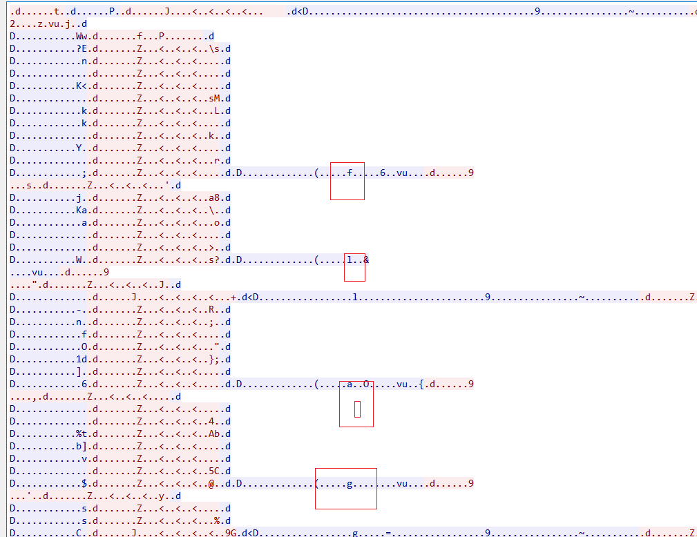

# BMZCTF-MISC

- [BMZCTF-MISC](#BMZCTF-MISC)
    - [真正的CTFer](#真正的CTFer)
    - [解不开的秘密](#解不开的秘密)
    - [技协杯-签到](#技协杯-签到)
    - [SDNISC2020_简单数据包](#SDNISC2020_简单数据包)
    - [2018-HEBTUCTF-签到题](#2018-HEBTUCTF-签到题)
    - [2018-HEBTUCTF-你可能需要一个wireshark](#2018-HEBTUCTF-你可能需要一个wireshark)
    - [MISC_你猜猜flag](#MISC_你猜猜flag)
    - [2018-护网杯-迟来的签到题](#2018-护网杯-迟来的签到题)
    - [签到题](#签到题)
    - [日志审计](#日志审计)
    - [哆啦A梦](#哆啦A梦)
    - [flag就在这](#flag就在这)
    - [Fix-it](#Fix-it)
    - [flag](#flag)
    - [宝宝](#宝宝)
    - [赢战2019](#赢战2019)
    - [海量的txt文件](#海量的txt文件)
    - [2018-hackergame-Word-文档](#2018-hackergame-Word-文档)
    - [神秘压缩包](#神秘压缩包)
    - [2020首届祥云杯-到点了](#2020首届祥云杯-到点了)
    - [小明的演讲](#小明的演讲)
    - [Traffic_Light](#Traffic_Light)
    - [SDNISC2020_过去和现在](#SDNISC2020_过去和现在)
    - [2018-QCTF-X-man-A-face](#2018-QCTF-X-man-A-face)
    - [内存取证三项](#内存取证三项)
    - [pcap_analysis](#pcap_analysis)
    - [2018-HEBTUCTF-句末大佬的lsb](#2018-HEBTUCTF-句末大佬的lsb)
    - [533](#533)
    - [memory](#memory)
    - [山东省大学生网络技术大赛-pic](#山东省大学生网络技术大赛-pic)
    - [2020首届祥云杯-进制反转](#2020首届祥云杯-进制反转)
    - [泰湖杯-MISC](#泰湖杯-MISC)
    - [pcap](#pcap)
    - [2018-SUCTF-single-dog](#2018-SUCTF-single-dog)
    - [技协杯-我的密码呢](#技协杯-我的密码呢)
    - [SDNISC2020_CTF的起源](#SDNISC2020_CTF的起源)
    - [MISC_tiga](#MISC_tiga)
    - [headache](#headache)
    - [2018-HEBTUCTF-ZIP安全](#2018-HEBTUCTF-ZIP安全)
    - [可乐加冰](#可乐加冰)
    - [SDNISC2020_简单js](#SDNISC2020_简单js)
    - [BJDCTF-2020-Misc-你猜我是个啥](#BJDCTF-2020-Misc-你猜我是个啥)
    - [penpig](#penpig)
    - [Administrator's_secret](#Administrator's_secret)
    - [技协杯-S&M](#技协杯-S&M)
    - [2020第三届安洵杯-BeCare4](#2020第三届安洵杯-BeCare4)
    - [2020第三届安洵杯-套娃](#2020第三届安洵杯-套娃)
    - [BJDCTF-2020-Misc-藏藏](#BJDCTF-2020-Misc-藏藏)
    - [bmp](#bmp)
    - [2020首届祥云杯-带音乐家](#2020首届祥云杯-带音乐家)
    - [2020第三届安洵杯-王牌特工](#2020第三届安洵杯-王牌特工)
    - [2018-QCTF-X-man-Keyword](#2018-QCTF-X-man-Keyword)
    - [小明的演讲t](#小明的演讲t)
    - [2018-SUCTF-follow-me](#2018-SUCTF-follow-me)
    - [misc_bbmpp](#misc_bbmpp)
    - [suspicion](#suspicion)
    - [山东省大学生网络技术大赛-morse](#山东省大学生网络技术大赛-morse)
    - [2020首届祥云杯-xixixi](#2020首届祥云杯-xixixi)
    - [crymisc](#crymisc)
    - [BJDCTF-2020-Misc-一叶障目](#BJDCTF-2020-Misc-一叶障目)
    - [2018-hackergame-游园会的集章卡片](#2018-hackergame-游园会的集章卡片)
    - [2021-MAR-DASCTF-简单的png隐写](#2021-MAR-DASCTF-简单的png隐写)
    - [2021-红明谷-我的心是冰冰的](#2021-红明谷-我的心是冰冰的)
    - [RoarCTF2020-Hi_433MHz](#RoarCTF2020-Hi_433MHz)
    - [你能发现蛛丝马迹吗](#你能发现蛛丝马迹吗)
    - [base_python](#base_python)
    - [RoarCTF2020-Hi_433MHz](#RoarCTF2020-Hi_433MHz)
    - [BJDCTF-2020-Misc-just-a-rar](#BJDCTF-2020-Misc-just-a-rar)
    - [2018-redhat-NotOnlyWireshark](#2018-redhat-NotOnlyWireshark)
    - [TallShanBen](#TallShanBen)
    - [one-by-one](#one-by-one)
    - [凯撒也喜欢二进制](#凯撒也喜欢二进制)
    - [2021年祥云杯-鸣雏恋](#2021年祥云杯-鸣雏恋)
    - [2018-QCTF-picture](#2018-QCTF-picture)
    - [2018-护网杯-easy_dump](#2018-护网杯-easy_dump)

## 真正的CTFer

文件取证->图片分析->修改宽高


flag{d2b5543c2f8aa8229057872dd85ce5a9}


## 解不开的秘密

密码取证->VNC

base16->base64得到

```
Windows Registry Editor Version 5.00

[HKEY_CURRENT_USER\Software\RealVNC]

[HKEY_CURRENT_USER\Software\RealVNC\vnclicensewiz]
"_AnlClientId"="8f5cc378-2e1d-4670-80e0-d2d81d882561"
"_AnlSelected"="0"
"_AnlInclRate"="0.0025"

[HKEY_CURRENT_USER\Software\RealVNC\vncserver]

[HKEY_CURRENT_USER\Software\RealVNC\VNCViewer4]
"dummy"=""

[HKEY_CURRENT_USER\Software\RealVNC\VNCViewer4\MRU]
"00"="127.0.0.1"
"Order"=hex:00,01
"01"="127.0.0.1:5900"

[HKEY_CURRENT_USER\Software\RealVNC\WinVNC4]
"Password"=hex:37,5e,be,86,70,b3,c6,f3
"SecurityTypes"="VncAuth"
"ReverseSecurityTypes"="None"
"QueryConnect"=dword:00000000
"PortNumber"=dword:0000170c
"LocalHost"=dword:00000000
"IdleTimeout"=dword:00000e10
"HTTPPortNumber"=dword:000016a8
"Hosts"="+,"
"AcceptKeyEvents"=dword:00000001
"AcceptPointerEvents"=dword:00000001
"AcceptCutText"=dword:00000001
"SendCutText"=dword:00000001
"DisableLocalInputs"=dword:00000000
"DisconnectClients"=dword:00000001
"AlwaysShared"=dword:00000000
"NeverShared"=dword:00000000
"DisconnectAction"="None"
"RemoveWallpaper"=dword:00000000
"RemovePattern"=dword:00000000
"DisableEffects"=dword:00000000
"UseHooks"=dword:00000001
"PollConsoleWindows"=dword:00000001
"CompareFB"=dword:00000001
"Protocol3.3"=dword:00000000
"dummy"=""
```

其中
[HKEY_CURRENT_USER\Software\RealVNC]
"Password"=hex:37,5e,be,86,70,b3,c6,f3

用VNC工具破解https://github.com/x0rz4/vncpwd

`vncpwd.exe 375ebe8670b3c6f3`


得到!QAZ2wsx 拿去解压docx


flag{aec1294a146b8ece1e3a295e557e198c}

## 技协杯-签到

docx解压


flag{873f6218-dc48-11ea-a3b9-dca90498a2db}

## SDNISC2020_简单数据包

wireshark打不开，就直接拿去binalk跑，发现有压缩包 直接分离，得到一串字符串，base64解码皆可

flag{sdnisc_net_sQ2X3Q9x}

## 2018-HEBTUCTF-签到题

解压后010在结尾处发现flag

HEBTUCTF{lkfdlfnqwnoidasfmaklmf}

## 2018-HEBTUCTF-你可能需要一个wireshark


追踪POST的第二个HTTP流


SEVCVFVDVEYlN0JmMWFnXzFzX3czbl9kNG8lN0Q=

HEBTUCTF{f1ag_1s_w3n_d4o}

## MISC_你猜猜flag

flag.exe


输入4 base64解码是 flag好像可以猜出来

将flag.exe拖去binwalk发现压缩包，要密码，ZmxhZ+WlveWDj+WPr+S7peeMnOWHuuadpQ==4

解压后 txt打开mdb搜索flag皆可

## 2018-护网杯-迟来的签到题

提示异或

```py
import base64
import string

flag = ''
a = base64.b64decode('AAoHAR1TIiIkUFUjUFQgVyInVSVQJVFRUSNRX1YgXiJSVyJQVRs=')

for i in string.printable:
    for j in a:
        flag += chr( ord(i) ^ j)
    print(flag + '\n')
```


## 签到题

关注公众号：白帽子社区，回复关键字：BMZCTF 获取flag

BMZCTF{W3lc0me_t0_BMZCTF!}

## 日志审计

```
192.168.0.1 - - [13/Oct/2018:12:38:14  0000] "GET /flag.php?user=hence' AND ORD(MID((SELECT IFNULL(CAST(secret AS CHAR),0x20) FROM haozi.secrets ORDER BY secret LIMIT 0,1),1,1))=102-- pZaF HTTP/1.1" 200 327 "-" "sqlmap/1.2#pip (http://sqlmap.org)"
192.168.0.1 - - [13/Oct/2018:12:38:14  0000] "GET /flag.php?user=hence' AND ORD(MID((SELECT IFNULL(CAST(secret AS CHAR),0x20) FROM haozi.secrets ORDER BY secret LIMIT 0,1),2,1))=108-- pZaF HTTP/1.1" 200 327 "-" "sqlmap/1.2#pip (http://sqlmap.org)"
192.168.0.1 - - [13/Oct/2018:12:38:14  0000] "GET /flag.php?user=hence' AND ORD(MID((SELECT IFNULL(CAST(secret AS CHAR),0x20) FROM haozi.secrets ORDER BY secret LIMIT 0,1),3,1))=97-- pZaF HTTP/1.1" 200 327 "-" "sqlmap/1.2#pip (http://sqlmap.org)"
192.168.0.1 - - [13/Oct/2018:12:38:14  0000] "GET /flag.php?user=hence' AND ORD(MID((SELECT IFNULL(CAST(secret AS CHAR),0x20) FROM haozi.secrets ORDER BY secret LIMIT 0,1),4,1))=103-- pZaF HTTP/1.1" 200 327 "-" "sqlmap/1.2#pip (http://sqlmap.org)"
192.168.0.1 - - [13/Oct/2018:12:38:14  0000] "GET /flag.php?user=hence' AND ORD(MID((SELECT IFNULL(CAST(secret AS CHAR),0x20) FROM haozi.secrets ORDER BY secret LIMIT 0,1),5,1))=123-- pZaF HTTP/1.1" 200 327 "-" "sqlmap/1.2#pip (http://sqlmap.org)"
192.168.0.1 - - [13/Oct/2018:12:38:14  0000] "GET /flag.php?user=hence' AND ORD(MID((SELECT IFNULL(CAST(secret AS CHAR),0x20) FROM haozi.secrets ORDER BY secret LIMIT 0,1),6,1))=109-- pZaF HTTP/1.1" 200 327 "-" "sqlmap/1.2#pip (http://sqlmap.org)"
192.168.0.1 - - [13/Oct/2018:12:38:14  0000] "GET /flag.php?user=hence' AND ORD(MID((SELECT IFNULL(CAST(secret AS CHAR),0x20) FROM haozi.secrets ORDER BY secret LIMIT 0,1),7,1))=97-- pZaF HTTP/1.1" 200 327 "-" "sqlmap/1.2#pip (http://sqlmap.org)"
192.168.0.1 - - [13/Oct/2018:12:38:14  0000] "GET /flag.php?user=hence' AND ORD(MID((SELECT IFNULL(CAST(secret AS CHAR),0x20) FROM haozi.secrets ORDER BY secret LIMIT 0,1),8,1))=121-- pZaF HTTP/1.1" 200 327 "-" "sqlmap/1.2#pip (http://sqlmap.org)"
192.168.0.1 - - [13/Oct/2018:12:38:14  0000] "GET /flag.php?user=hence' AND ORD(MID((SELECT IFNULL(CAST(secret AS CHAR),0x20) FROM haozi.secrets ORDER BY secret LIMIT 0,1),9,1))=105-- pZaF HTTP/1.1" 200 327 "-" "sqlmap/1.2#pip (http://sqlmap.org)"
192.168.0.1 - - [13/Oct/2018:12:38:14  0000] "GET /flag.php?user=hence' AND ORD(MID((SELECT IFNULL(CAST(secret AS CHAR),0x20) FROM haozi.secrets ORDER BY secret LIMIT 0,1),10,1))=121-- pZaF HTTP/1.1" 200 327 "-" "sqlmap/1.2#pip (http://sqlmap.org)"
192.168.0.1 - - [13/Oct/2018:12:38:14  0000] "GET /flag.php?user=hence' AND ORD(MID((SELECT IFNULL(CAST(secret AS CHAR),0x20) FROM haozi.secrets ORDER BY secret LIMIT 0,1),11,1))=97-- pZaF HTTP/1.1" 200 327 "-" "sqlmap/1.2#pip (http://sqlmap.org)"
192.168.0.1 - - [13/Oct/2018:12:38:14  0000] "GET /flag.php?user=hence' AND ORD(MID((SELECT IFNULL(CAST(secret AS CHAR),0x20) FROM haozi.secrets ORDER BY secret LIMIT 0,1),12,1))=104-- pZaF HTTP/1.1" 200 327 "-" "sqlmap/1.2#pip (http://sqlmap.org)"
192.168.0.1 - - [13/Oct/2018:12:38:14  0000] "GET /flag.php?user=hence' AND ORD(MID((SELECT IFNULL(CAST(secret AS CHAR),0x20) FROM haozi.secrets ORDER BY secret LIMIT 0,1),13,1))=101-- pZaF HTTP/1.1" 200 327 "-" "sqlmap/1.2#pip (http://sqlmap.org)"
192.168.0.1 - - [13/Oct/2018:12:38:14  0000] "GET /flag.php?user=hence' AND ORD(MID((SELECT IFNULL(CAST(secret AS CHAR),0x20) FROM haozi.secrets ORDER BY secret LIMIT 0,1),14,1))=105-- pZaF HTTP/1.1" 200 327 "-" "sqlmap/1.2#pip (http://sqlmap.org)"
192.168.0.1 - - [13/Oct/2018:12:38:14  0000] "GET /flag.php?user=hence' AND ORD(MID((SELECT IFNULL(CAST(secret AS CHAR),0x20) FROM haozi.secrets ORDER BY secret LIMIT 0,1),15,1))=49-- pZaF HTTP/1.1" 200 327 "-" "sqlmap/1.2#pip (http://sqlmap.org)"
192.168.0.1 - - [13/Oct/2018:12:38:14  0000] "GET /flag.php?user=hence' AND ORD(MID((SELECT IFNULL(CAST(secret AS CHAR),0x20) FROM haozi.secrets ORDER BY secret LIMIT 0,1),16,1))=57-- pZaF HTTP/1.1" 200 327 "-" "sqlmap/1.2#pip (http://sqlmap.org)"
192.168.0.1 - - [13/Oct/2018:12:38:14  0000] "GET /flag.php?user=hence' AND ORD(MID((SELECT IFNULL(CAST(secret AS CHAR),0x20) FROM haozi.secrets ORDER BY secret LIMIT 0,1),17,1))=54-- pZaF HTTP/1.1" 200 327 "-" "sqlmap/1.2#pip (http://sqlmap.org)"
192.168.0.1 - - [13/Oct/2018:12:38:14  0000] "GET /flag.php?user=hence' AND ORD(MID((SELECT IFNULL(CAST(secret AS CHAR),0x20) FROM haozi.secrets ORDER BY secret LIMIT 0,1),18,1))=53-- pZaF HTTP/1.1" 200 327 "-" "sqlmap/1.2#pip (http://sqlmap.org)"
192.168.0.1 - - [13/Oct/2018:12:38:14  0000] "GET /flag.php?user=hence' AND ORD(MID((SELECT IFNULL(CAST(secret AS CHAR),0x20) FROM haozi.secrets ORDER BY secret LIMIT 0,1),19,1))=97-- pZaF HTTP/1.1" 200 327 "-" "sqlmap/1.2#pip (http://sqlmap.org)"
192.168.0.1 - - [13/Oct/2018:12:38:14  0000] "GET /flag.php?user=hence' AND ORD(MID((SELECT IFNULL(CAST(secret AS CHAR),0x20) FROM haozi.secrets ORDER BY secret LIMIT 0,1),20,1))=101-- pZaF HTTP/1.1" 200 327 "-" "sqlmap/1.2#pip (http://sqlmap.org)"
192.168.0.1 - - [13/Oct/2018:12:38:14  0000] "GET /flag.php?user=hence' AND ORD(MID((SELECT IFNULL(CAST(secret AS CHAR),0x20) FROM haozi.secrets ORDER BY secret LIMIT 0,1),21,1))=55-- pZaF HTTP/1.1" 200 327 "-" "sqlmap/1.2#pip (http://sqlmap.org)"
192.168.0.1 - - [13/Oct/2018:12:38:14  0000] "GET /flag.php?user=hence' AND ORD(MID((SELECT IFNULL(CAST(secret AS CHAR),0x20) FROM haozi.secrets ORDER BY secret LIMIT 0,1),22,1))=53-- pZaF HTTP/1.1" 200 327 "-" "sqlmap/1.2#pip (http://sqlmap.org)"
192.168.0.1 - - [13/Oct/2018:12:38:14  0000] "GET /flag.php?user=hence' AND ORD(MID((SELECT IFNULL(CAST(secret AS CHAR),0x20) FROM haozi.secrets ORDER BY secret LIMIT 0,1),23,1))=54-- pZaF HTTP/1.1" 200 327 "-" "sqlmap/1.2#pip (http://sqlmap.org)"
192.168.0.1 - - [13/Oct/2018:12:38:14  0000] "GET /flag.php?user=hence' AND ORD(MID((SELECT IFNULL(CAST(secret AS CHAR),0x20) FROM haozi.secrets ORDER BY secret LIMIT 0,1),24,1))=57-- pZaF HTTP/1.1" 200 327 "-" "sqlmap/1.2#pip (http://sqlmap.org)"
192.168.0.1 - - [13/Oct/2018:12:38:14  0000] "GET /flag.php?user=hence' AND ORD(MID((SELECT IFNULL(CAST(secret AS CHAR),0x20) FROM haozi.secrets ORDER BY secret LIMIT 0,1),38,1))=125-- pZaF HTTP/1.1" 200 327 "-" "sqlmap/1.2#pip (http://sqlmap.org)"
```

102 108 97 103 123 109 97 121 105 121 97 104 101 105 49 57 54 53 97 101 55 53 54 57 125

flag{mayiyahei1965ae7569}

## 哆啦A梦

binwalk分离出png图片，修改高宽后是二维码，qr扫描即可


ZmxhZ3tDdGZfMjAxOF92ZXJ5X2dvb2R9

flag{Ctf_2018_very_good}

## flag就在这

无法打开压缩包，010查看补全 50 4B压缩包头

打开后需要密码，用ziperello爆破即可

## Fix-it

用PS修复，快速选择左上角方框，复制图层到右上角和左下角


flag{easyQRcode}

## flag

010打开，base64解码可以发现是png格式，利用base64解码转图片

https://the-x.cn/base64

在线转换即可

flag{base64_wow}

## 宝宝

扫描后没啥东西，foremost分离出压缩包

猜测密码为babybaby成功解压

将flag后缀改为png扫描后得到flag

flag{ThIs_Is_QR_Code}

## 赢战2019

foremost分离出二维码，扫描后没啥东西，直接上stegsolve隐写，发现左下角有flag


flag{You_ARE_SOsmart}

## 海量的txt文件

用grep全局搜索，刚开始flag没搜到，尝试用其它关键词如key

`grep -rn 'key' ./*`


## 2018-hackergame-Word-文档

改为zip格式，发现flag

## 神秘压缩包

压缩包密码用base64转图片即可

解压后是一堆二维码，可用微微二维码工具批量解压

整理后二进制转字符即可

flag{QRcode1sUseful}

## 2020首届祥云杯-到点了

一共三个文档

第一个文档 打开隐藏文字：提示8位字母数字

第二个文档 需要密码，根据上一个提示 可以看到文档日期刚好8位

20201024

移动图片 全选加颜色 放大

AABBAABBBAABBBAAAABBABBABABAAAAABBAAABBBBAABBBAABABABBAAABAAAABAABAABBABAAAAABAA

培根密码，解密得到

GOODNIGHTSWEETIE

第三个文档 改为zip发现有另外一个压缩包，解压后bmp ，接下来思路是bmp解密，用wbstego4.3open 保存为txt得到flag

## 小明的演讲

下载后ppt文件 改为zip解压 发现有flag.zip以及对应密码密文

第一个 中文电码 2053250813784316 转换为 我是密码

第二个 乱码 用010打开开头改为 FE FF即可正常显示 我也是密码

组合起来就是 我是密码我也是密码 解压得到

c3Nzc3Nzc3Nzc3Nzc3Nzc3Nzc3Nzc3Nzc3NzZmxhZ3twcHR4cG93ZXJwb2ludH0=

flag{pptxpowerpoint}

## Traffic_Light

用screentogif分离图片

1、发现第2的倍数的图片都是没有灯亮的。忽略不计。
2、绿灯和红灯总和为8或8的倍数时，下一张一定是黄色。
由此可以推断为二进制。绿为1，红为0，黄为空格。
写脚本进行编码：

```py
# -*-coding: utf-8 -*-
from PIL import Image

binstr = ""
flag = ""

def decode(s):
    return ''.join([chr(i) for i in [int(b, 2) for b in s.split(' ')]])

for i in range(1168):
    image=Image.open(r'./202011/'+str(i)+'.png')
    # print (image.getpixel((115,55)))#输出颜色值
    # print (image.getpixel((115,145)))
    tmp1 = image.getpixel((115,55))
    tmp2 = image.getpixel((115,150))
    # print (type(tmp1))
    if(tmp1[0] > 250):
        binstr += '1'
    elif(tmp2[1] > 250):
        binstr += '0'
    else:
        binstr += ''
print (binstr)

for i in range(len(binstr)):
    if i%8==0:
        flag +=decode(binstr[i:i+8])
print(flag)
```

flag{Pl34s3_p4y_4tt3nt10n_t0_tr4ff1c_s4f3ty_wh3n_y0u_4r3_0uts1d3}

## SDNISC2020_过去和现在

binwalk -e分离 在21154发现flag

flag{fc25cbb7b85959fe03738241a96bf23d}

## 2018-QCTF-X-man-A-face

ps补全二维码 但qr扫不出来，微信扫可以

KFBVIRT3KBZGK5DUPFPVG2LTORSXEX2XNBXV6QTVPFZV6TLFL5GG6YTTORSXE7I=

base32解码

QCTF{Pretty_Sister_Who_Buys_Me_Lobster}

## 内存取证三项

一天下午小白出去吃饭，临走之前还不忘锁了电脑，这时同寝室的小黑想搞点事情，懂点黑客和社工知识的小黑经过多次尝试获得了密码成功进入电脑，于是便悄悄在电脑上动起手脚了，便在桌面上写着什么，想给小白一个惊喜，同时还传送着小白的机密文件，正巧这时小白刚好回来，两人都吓了一跳，小黑也不管自己在电脑上留下的操作急忙离开电脑，故作淡定的说：“我就是随便看看”。
1.小黑写的啥，据说是flag？
2.那么问题来了，小白的密码是啥？
3.小黑发送的机密文件里面到底是什么

1.根据提示小黑在使用记事本编写文本

可疑进程
```
explorer.exe 1416
notepad.exe 280
cmd.exe 1568
nc.exe 120
DumpIt.exe 392
```

```
python2 vol.py -f L-12A6C33F43D74-20161114-125252.raw imageinfo

python2 vol.py -f L-12A6C33F43D74-20161114-125252.raw --profile=WinXPSP2x86 pslist

python2 vol.py notepad -f L-12A6C33F43D74-20161114-125252.raw --profile=WinXPSP2x86
```

得到hex值，解码为flag{W3lec0me_7o_For3n5ics}

2.第二个提示需要提取密码

这个需要破解ntlm hash 后面再补

3.第三个查看cmd.exe

```
python2 vol.py -f L-12A6C33F43D74-20161114-125252.raw --profile=WinXPSP2x86 cmdscan

python2 vol.py -f L-12A6C33F43D74-20161114-125252.raw --profile=WinXPSP2x86 dumpfiles -Q 0x0000000002c61318 --dump-dir=./
```

得到zip压缩包，ziperello爆破8位纯数字，提示是生日

## pcap_analysis

在工控系统网关截取了一段流量，请分析这段流量并找出其中利用Modbus协议写寄存器的数据。注意，得到的flag请使用BMZCTF{}格式提交

提示modbus协议，过滤流即可，追踪TCP流拼接flag

BMZCTF{323f986d429a689d3b96ad12dc5cbc701db0af55}

## 2018-HEBTUCTF-句末大佬的lsb

lsb隐写，密码是句末的姓 chen

`python2 lsb.py extract jumo.png 1.txt chen `

HEBTUCTF{wuinoknadsflmladflnef}

## 533

爆破压缩包，提示密码范围为000000000-999999999

用ziperello爆破即可 548751269

爆破出533.zip,该压缩文件下有3个加密的文本


考点：crc32爆破


flag{CRC32}
## memory

分析内存镜像,破解管理员的登录密码,flag为明文密码的MD5值

```py
python2 vol.py -f memory imageinfo
python2 vol.py -f memory --profile=WinXPSP2x86 hashdump
```

把内存中所有用户的hash全部dump出来

```
Administrator:500:0182bd0bd4444bf867cd839bf040d93b:c22b315c040ae6e0efee3518d830362b:::
Guest:501:aad3b435b51404eeaad3b435b51404ee:31d6cfe0d16ae931b73c59d7e0c089c0:::
HelpAssistant:1000:132893a93031a4d2c70b0ba3fd87654a:fe572c566816ef495f84fdca382fd8bb:::
```

另存为hash.txt

```
john --wordlist=/usr/share/john/password.lst --rule --format=NT hash.txt
```

flag{25f9e794323b453885f5181f1b624d0b}

## 山东省大学生网络技术大赛-pic

stegsolve lsb提取数据发现7z

7z里全是3字节的文本，可以crc32爆破

```py
import binascii
import string

def crack_crc():
    print('-------------Start Crack CRC-------------')
    crc_list = [0x40e61be5,0x91c7b4a0,0xf4fd5e1c,0x02658101,0x92d786fd,0x03b3ea6a]
    comment = ''
    chars = string.printable
    for crc_value in crc_list:
        for char1 in chars:
            for char2 in chars:
                for char3 in chars:
                    res_char = char1 + char2 + char3#获取遍历的任意3Byte字符
                    char_crc = binascii.crc32(res_char.encode())#获取遍历字符的CRC32值
                    calc_crc = char_crc & 0xffffffff#将遍历的字符的CRC32值与0xffffffff进行与运算
                    if calc_crc == crc_value:#将获取字符的CRC32值与每个文件的CRC32值进行匹配
                        print('[+] {}: {}'.format(hex(crc_value),res_char))
                        comment += res_char
    print('-----------CRC Crack Completed-----------')
    print('Result: {}'.format(comment))

if __name__ == '__main__':
    crack_crc()
```

flag{CRC32/233333}

## 2020首届祥云杯-进制反转

电脑中到底使用的是什么进制呢？真是麻烦，有时候还是手机好用。结果用BMZCTF{}包住，并且全为大写


在加密标识处 将1改为0

解压得到flag.wav

音频时间反转-听歌识曲

BMZCTF{TOOGOODATGOODBYES}

## 泰湖杯-MISC

伪加密
```java
java -jar ZipCenOp.jar r 715e25aec2a24ac79ab6e74497cafb80.zip
```

doc隐写 隐藏文字 密钥是网址可以猜出是希尔密码

http://www.atoolbox.net/Tool.php?Id=914

得到love and peaceee

rabbit解密

LR2TMNLCGBOHKNDGGVRFY5JWGZTDAXDVMZTDCYK4OU4GCZRYLR2TSNTCHBOHKNJUMM4VY5JVGBSTOXDVHE3DIZC4OU2TIM3ELR2TQYLGHBOHKOJWGQYFY5JWGQ3DSXDVHE3GEOC4OU2TAZJXLR2TOZRTMROHKOBVME4VY5JVGRQTIXDVHAYDEOC4OU4GCZRYLR2TSNTCHBOHKNRRGY3VY5JVHA2WKXDVHAZDOMS4OU2WGMDBLR2TKNDDHFOHKODGMU3FY5JYMFSTMXDVG5QTOYK4OU3DENBQLR2TSNRUMROHKNRSGEYVY5JVMZTDKXDVHE3GEOC4OU3TSNJXLR2TQYLFGZOHKNLGMY2VY5JVGRRTSXDVHE3DIMC4OU2TMYRULR2TKNDDHFOHKNJWMM4VY5JUMZSWKXDVGU4TGN24OU4TMM3GLR2TMY3FGJOHKOBSG4ZFY5JYGM4GCXDVGVRGGMS4OU4GCZJWLR2TKOBVMVOHKNJUHEZFY5JYGM4GCXDVG43TGZK4OU3DEMJRLR2TKNDDHFOHKNRSGQYFY5JUMYYGMXDVHAYDKZK4OU4DKYJZLR2TSNTCHBOHKNRRGBSFY5JZGVRWIXDVGU2DGNS4OU3DENBQLR2TIZTFMVOHKNRWGJTFY5JYGI3TEXDVGY2DMOK4OU4GCMZWLR2TKNTCGROHKNJUMM4VY5JZHA2TQXDVGYYTAZC4OU2TIYZZLR2TKMZXGNOHKNDGMVSVY5JVGRRTSXDVG5QTOYK4OU4DOMLDLR2TSNRUGBOHKNJWMM4VY5JUMYYGMXDVGVTGMNK4OU2TIYZZLR2TMNBWHFOHKNJUMM4VY5JUMVQTMXDVHAZTQYK4OU2TIYZZLR2TONZTMVOHKNJUME2FY5JVHE4DEXDVHE4DKOC4OU2TSOBS

base32解密

\u65b0\u4f5b\u66f0\uff1a\u8af8\u96b8\u54c9\u50e7\u964d\u543d\u8af8\u9640\u6469\u96b8\u50e7\u7f3d\u85a9\u54a4\u8028\u8af8\u96b8\u6167\u585e\u8272\u5c0a\u54c9\u8fe6\u8ae6\u7a7a\u6240\u964d\u6211\u5ff5\u96b8\u7957\u8ae6\u5ff5\u54c9\u9640\u56b4\u54c9\u56c9\u4fee\u5937\u963f\u6ce2\u8272\u838a\u5bc2\u8ae6\u585e\u5492\u838a\u773e\u6211\u54c9\u6240\u4f0f\u805e\u85a9\u96b8\u610d\u95cd\u5436\u6240\u4fee\u662f\u8272\u6469\u8a36\u56b4\u54c9\u9858\u610d\u54c9\u5373\u4fee\u54c9\u7a7a\u871c\u9640\u56c9\u4f0f\u5ff5\u54c9\u6469\u54c9\u4ea6\u838a\u54c9\u773e\u54a4\u5982\u9858\u5982

unicode解密

新佛曰：諸隸哉僧降吽諸陀摩隸僧缽薩咤耨諸隸慧塞色尊哉迦諦空所降我念隸祗諦念哉陀嚴哉囉修夷阿波色莊寂諦塞咒莊眾我哉所伏聞薩隸愍闍吶所修是色摩訶嚴哉願愍哉即修哉空蜜陀囉伏念哉摩哉亦莊哉眾咤如願如

佛解密

Live beautifully, dream passionately, love completely.

拿去解压得到fun.wav 频谱分析


flag{m1sc_1s_funny2333}

## pcap

请分析附件中的dnp3协议 。注意，得到的flag请使用BMZCTF{}格式提交



flag{d989e2b92ea671f5d30efb8956eab1427625c}

BMZCTF{d989e2b92ea671f5d30efb8956eab1427625c}

## 2018-SUCTF-single-dog

foremost分离出压缩包

颜文字解密

SUCTF{happy double eleven}

## 技协杯-我的密码呢

图片显示


C3m67uup

还有个带密码的压缩包，可以猜测archpr爆破 后面涂掉的部分大概2-4位

archpr无法打开压缩包，说是不支持版本，010打开，修改版本号819为0即可

掩码爆破，得到密码：C3m67uup8Qs


flag{t0y_h4sh3d_aNd_hav3_fun_f0r_1t!}

## SDNISC2020_CTF的起源

考点：base64隐写

flag{944776b2c95a350bb27d7038d42b273a}

## MISC_Snake

压缩包注释发现ook密码，解密得到

https://www.splitbrain.org/services/ook

password: doyoulikesnake?

解压后可以发现process是明文的异或，根据逆推出解密

```py
with open ('snake.jpg','wb') as flag:
    with open('data.jpg','rb') as f:
        for i in f.read():
            if (i % 2 == 0):
                i = (i+1) ^ 128
            else:
                i = (i-1) ^128
            i = bytes([i])
            flag.write(i)
```

得到一张🐍的图片，先拿到stegsolve发现hint


serpent密码，但需要密钥，密钥应该从图片中找

steghide隐写，不需要密码，得到key.txt

key: VivaLaVida

拿去serpent解密data文件，得到内容只有w和b的文件

能想到w是white，b是black，批量替换，w为1，b为0，而且有40000个字符，那就是200*200的正方形，编写脚本绘制图片

```py
from PIL import Image
with open ("1.txt",'r') as d:
	flag = Image.new('L',(200,200))
	plain = d.read()
	i = 0
	for x in range(200):
		for y in range(200):
			if (plain[i] == '0'):
				flag.putpixel([x,y],0)
			else:
				flag.putpixel([x,y],255)
			i += 1
	flag.show()
```


flag{67bd09fc-e252-4c21-858f-2a7d698d555f}

## MISC_tiga

考点：零宽字节隐写

https://yuanfux.github.io/zero-width-web/


Password: GiveTiGaGuang!

解压后，发现有7个password.txt 大小均为3.txt crc32爆破

T&hg%WL0^rm@c!VK$xEt~ 解压得到youcanalso.zip

接下来分析图片，010打开发现结尾有youcanalso.zip password isten numbers

提示压缩包是10位数字，爆破即可

2001701725

考点：明文攻击

得到密码：1amT1G@，得到flag.txt 发现是504B开头的 粘贴到010转为十六进制，更改为doc文件，点击显示隐藏文字

考点：base64全家桶

basecrack一把梭即可

flag{8fa3e8c4-0121-4f2a-a7f0-0a60032e3763}

## headache

暴力破解密码为123456


flag{uh, I feel not good... I can't remember the flag. Maybe you can help me..
Here is my prescription: JFIF

修改文件头为FF D8即可

flag{C13H18O2}

## 2018-HEBTUCTF-ZIP安全

ziperello暴力破解:20181028

解压得到PartFlag&hint.zip 和Flag.zip两个压缩文件


前者伪加密，得到zip的文件尾

将flag.zip的开头hint.txt复制出来，补上文件尾

接下来就是明文攻击了

得到密码 ZipC00l!
HEBTUCTF{Z1p_so_Comp1ex}

## 可乐加冰

有快乐肥宅水的比赛，才是真正的快乐。 注意，得到的flag请使用BMZCTF{}格式提交

binwalk -e 分离信息，010打开2AE96


可以看到十六进制区全是十进制的值，可以猜测十进制转字符得到

```
S.$$$_+S.$__$+S.___+S.__$+S.$$$$+S.$$$_+S.$__$+S.__$+"-"+S.$_$$+S.$_$_+S.$$_$+S.$$_+"-"+S.$__+S.$_$_+S.$$$$+S.$$$+"-"+S.$__$+S.$__$+S.$$_+S._$$+"-"+S.$$_$+S.$_$_+S.$$_$+S.$___+S.__$+S._$_+S.$$$$+S.$_$+S.$$_+S._$_+S.$__+S.$$_$
```

将 S替换成$，补上jjencode开头结尾
jjencode解密

```
$=~[];$={___:++$,$$$$:(![]+"")[$],__$:++$,$_$_:(![]+"")[$],_$_:++$,$_$$:({}+"")[$],$$_$:($[$]+"")[$],_$$:++$,$$$_:(!""+"")[$],$__:++$,$_$:++$,$$__:({}+"")[$],$$_:++$,$$$:++$,$___:++$,$__$:++$};$.$_=($.$_=$+"")[$.$_$]+($._$=$.$_[$.__$])+($.$$=($.$+"")[$.__$])+((!$)+"")[$._$$]+($.__=$.$_[$.$$_])+($.$=(!""+"")[$.__$])+($._=(!""+"")[$._$_])+$.$_[$.$_$]+$.__+$._$+$.$;$.$$=$.$+(!""+"")[$._$$]+$.__+$._+$.$+$.$$;$.$=($.___)[$.$_][$.$_];$.$($.$($.$$+"\""+$.$$$_+$.$__$+$.___+$.__$+$.$$$$+$.$$$_+$.$__$+$.__$+"-"+$.$_$$+$.$_$_+$.$$_$+$.$$_+"-"+$.$__+$.$_$_+$.$$$$+$.$$$+"-"+$.$__$+$.$__$+$.$$_+$._$$+"-"+$.$$_$+$.$_$_+$.$$_$+$.$___+$.__$+$._$_+$.$$$$+$.$_$+$.$$_+$._$_+$.$__+$.$$_$+"\"")())();
```

BMZCTF{e901fe91-bad6-4af7-9963-dad812f5624d}

## SDNISC2020_简单js

下载后是个JS文件

```js
/**
 * Pseudo md5 hash function
 * @param {string} string
 * @param {string} method The function method, can be 'ENCRYPT' or 'DECRYPT'
 * @return {string}
 */
function pseudoHash(string, method) {
  // Default method is encryption
  if (!('ENCRYPT' == method || 'DECRYPT' == method)) {
    method = 'ENCRYPT';
  }
  // Run algorithm with the right method
  if ('ENCRYPT' == method) {
    // Variable for output string
    var output = '';
    // Algorithm to encrypt
    for (var x = 0, y = string.length, charCode, hexCode; x < y; ++x) {
      charCode = string.charCodeAt(x);
      if (128 > charCode) {
        charCode += 128;
      } else if (127 < charCode) {
        charCode -= 128;
      }
      charCode = 255 - charCode;
      hexCode = charCode.toString(16);
      if (2 > hexCode.length) {
        hexCode = '0' + hexCode;
      }
      output += hexCode;
    }
    // Return output
    return output;
  } else if ('DECRYPT' == method) {
    // DECODE MISS
    // Return ASCII value of character
    return string;
  }
}
document.getElementById('password').value = pseudoHash('19131e18041b1d4c47191d19194f1949481a481a1d4c1c461b4d484b191b4e474f1e4b1d4c02', 'DECRYPT');
```

编写对应的解码代码

```py
s = "19131e18041b1d4c47191d19194f1949481a481a1d4c1c461b4d484b191b4e474f1e4b1d4c02"

for i in range(0,(len/2)):
    tmp = "0x" + s[i*2:i*2+2]
    tmp = 255 - int(tmp,16)
        if tmp <128:
            tmp += 128
        else:
            tmp -= 128
        tmp = chr(tmp)
    print(tmp,end='')
```

## 掘地三尺

隐藏文字+全选颜色


flag{real_

下面的复制可以发现是十六进制，且为jpg的文件头，全都拿到010editor转换为1.jpg


结尾处提示hide deepth:106 可以猜测修改图片高度，利用010editor插件修改即可


flag{real_deep_

接着是steghide爆破 上脚本即可 password


flag{real_deep_doc}

## BJDCTF-2020-Misc-你猜我是个啥

010打开发现是png头 修改后缀打开发现二维码 扫描后提示flag不在这

010在结尾发现flag
flag{i_am_fl@g}

## penpig

传统猪圈密码

FLAG{YYYYY_YWWW@}

## Administrator's_secret

```bash
python2 vol.py -f mem.dump imageinfo
python2 vol.py -f mem.dump --profile=Win7SP1x64 pslist
python2 vol.py -f mem.dump --profile=Win7SP1x64 cmdscan

# 导出压缩包
python2 vol.py -f mem.dump --profile=Win7SP1x64 filescan | grep "flag.ccx"
python2 vol.py -f mem.dump --profile=Win7SP1x64 dumpfiles -Q 0x000000003e435890 --dump-dir=./

# 接下来把管理员的密码hash导出来进行破解
python2 vol.py hashdump -f mem.dump --profile=Win7SP1x64

ophcrack破解即可：ABCabc123
```

用CnCrypt打开flag.ccx，输入上面密码即可

flag{now_you_see_my_secret}

## 技协杯-S&M

s7comm 长度为91的发现flag

flag{QKwTZDSBELNPYqzv}

## 技协杯-S&M

flag{8c16c91be3f3287ff5a10167e922b33b}

共模攻击

## 2020第三届安洵杯-BeCare4

打开后是加密的flag.7z和npmtxt，vim查看发现存在零宽字节

零宽度字节隐写：oh,you found the pass:RealV1siBle

解压后得到一张图片，题目提示eye，可以猜想SilentEye

silenteye隐写，直接默认密码

D0g3{1nV1sible_flag_Can_You_find?!}

BMZCTF{1nV1sible_flag_Can_You_find?!}

## 2020第三届安洵杯-套娃

crc32-2字节爆破得到密码，解压

得到easyzip.zip,7z能解压出redeme.txt，因为是伪加密

接着winrar打开把其它文件删掉，只保留redeme-副本.txt,进行明文爆破，得到密码%3#c$v!@

解压得到flag.txt

basecrack一把梭得到fgic__notl{prwc__}az&ceadi@

栅栏密码 3

flag{zip&crc_we_can_do_it}

BMZCTF{zip&crc_we_can_do_it}

## BJDCTF-2020-Misc-藏藏

foremost分离压缩包 二维码扫描

flag{you are the best!}

## BMP

## 2020首届祥云杯-带音乐家

一个加密的压缩包Doc1.rar和decode_it文本，010打开文本发现MDhd，是MIDI文件

用工具velato解密

```cmd
Vlt.exe decode_it
decode_it.exe
```
得到Hello, World! 拿去解压得到Doc1.docx

精灵语：FLAGIS

打开压缩包发现注释有摩斯，放到sublime全选可见

.- . ... -.- . -.-- ----. ..--- .---- ----. ..--- ...-- ..--- ...-- ..--- ..---

摩斯解码AESKEY9219232322 可以看见提示aes


flag{mU51c_And_ch@ract0rs~}

BMZCTF{mU51c_And_ch@ract0rs~}

## 2020第三届安洵杯-王牌特工

Recently,Agent CyzCC has got one secret file from Trump's disk and cracked it successfully without Wushu morality.Can u do the same thing?。注意，得到的flag请使用BMZCTF{}格式提交。

```bash
file findme
# findme: Linux rev 1.0 ext3 filesystem data, UUID=f2b1e8fa-29a6-454b-b6df-6182044790bc (large files)
mount findme /mnt
cd /mnt
ls
# flagbox key.txt
cat key.txt
# key:a_cool_key
# use Veracrypt
```

提示用veracrypt挂载


提示flag是假的，尝试别的思路，修复磁盘

```bash
extundelete findme --restore-all
cd RECOVERED_FILES
ls -al
file .coolboy.swp
cat .coolboy.swp
# 55qE5a+G56CBOnRoaXNfaXNfYV90cnVlX2tleQ==
```

this_is_a_true_key 再拿去挂载

flag{you_are_a_cool_boy}

BMZCTF{you_are_a_cool_boy}

## 2018-QCTF-X-man-Keyword

stegsolve查看头部好像有东西，拿去lsb隐写

```py
python2 lsb.py extract X-man-Keyword.png 1.txt lovekfc
```

得到
PVSF{vVckHejqBOVX9C1c13GFfkHJrjIQeMwf}

看起来是替换密码，题目提示一种把关键词提前的置换

可以想到是Nihilist 密码

得到QCTF{cCgeLdnrIBCX9G1g13KFfeLNsnMRdOwf}

## 小明的演讲t

下载后是ppt文件，改为zip即可，在里面发现zip和两段文本

2053250813784316 中文电码-> 我是密码

010改为FF FE即可 我也是密码

我是密码我也是密码

解压即可解码

## 2018-SUCTF-follow-me

导出为http对象，拿到linux搜索

```bash
grep -r 'CTF' ./follow-me
```

SUCTF{password_is_not_weak}

## misc_bbmpp

题目提示10w也就是100000 六位

可以猜想压缩包爆破6位纯数字，爆破得到333520

010打开发现前面缺少了头，且文件大小对不上，猜想是去掉了文件头类型(2字节)和文件大小(4字节)，插入6字节


修改后缀名bmp得到flag

flag{G0od_j0b}

## suspicion

```bash
python2 vol.py -f mem.vmem imageinfo
python2 vol.py -f mem.vmem --profile=WinXPSP2x86 pslist
python2 vol.py -f mem.vmem --profile=WinXPSP2x86 memdump -p 2012 -D ./
```

推测题目所给的另一个文件是使用TrueCrypt进行加密了的。进程没有退出，那么加密的密钥有可能就在进程中，将该进程作为文件导出。

然后使用Elcomsoft Forensic Disk Decryptor进行解密，首先在导出的内存镜像中搜索key.


PCTF{T2reCrypt_15_N07_S3cu2e}

https://blog.csdn.net/mochu7777777/article/details/113007749

## 山东省大学生网络技术大赛-morse

stego100.wav

audacity打开放大可以发现摩斯电码


解码得到5BC925649CB0188F52E617D70929191C

flag{5BC925649CB0188F52E617D70929191C}

## 2020首届祥云杯-xixixi

打开是new.vhd文件，vhd是微软虚拟磁盘文件，用diskgenius挂载


得到一张图片和两个py

```py
import struct

class FAT32Parser(object):
	def __init__(self, vhdFileName):
		with open(vhdFileName, 'rb') as f:
			self.diskData = f.read()
		self.DBR_off = self.GetDBRoff()
		self.newData = ''.join(self.diskData)

	def GetDBRoff(self):
		DPT_off = 0x1BE
		target = self.diskData[DPT_off+8:DPT_off+12]
		DBR_sector_off, = struct.unpack("<I", target)
		return DBR_sector_off * 512

	def GetFAT1off(self):
		target = self.diskData[self.DBR_off+0xE:self.DBR_off+0x10]
		FAT1_sector_off, = struct.unpack("<H", target)
		return self.DBR_off + FAT1_sector_off * 512

	def GetFATlength(self):
		target = self.diskData[self.DBR_off+0x24:self.DBR_off+0x28]
		FAT_sectors, = struct.unpack("<I", target)
		return FAT_sectors * 512

	def GetRootoff(self):
		FAT_length = self.GetFATlength()
		FAT2_off = self.GetFAT1off() + FAT_length
		return FAT2_off + FAT_length

	def Cluster2FAToff(self, cluster):
		FAT1_off = self.GetFAT1off()
		return FAT1_off + cluster * 4

	def Cluster2DataOff(self, cluster):
		rootDir_off = self.GetRootoff()
		return rootDir_off + (cluster - 2) * 512
```

```py
import struct
from xixi import FAT32Parser
from xixixi import Padding, picDepartList

def EncodePieces():
	global clusterList
	res = []
	Range = len(picDepartList)    # 58
	# GetRandomClusterList(n) - Generate a random cluster list with length n
	clusterList = GetRandomClusterList(Range)

	for i in range(Range):
		if i != Range - 1:
			newCRC = struct.pack("<I", clusterList[i+1])
			plainData = picDepartList[i][:-4] + newCRC
		else:
			plainData = picDepartList[i]

		# Show the first piece to him, hhh
		if i == 0:
			newPiece = plainData
		else:
			newPiece = ''
			key = clusterList[i] & 0xFE
			for j in plainData:
				newPiece += chr(ord(j) ^ key)
		# Padding() -- Fill to an integral multiple of 512 with \xFF
		res.append(Padding(newPiece))
	return res
```

参考上面给出的脚本进行还原，还原脚本参考的是Timeline Sec团队的脚本

```py
# -*- coding: utf-8 -*-
# @Project: Hello Python!
# @File   : exp
# @Author : Tr0jAn <Tr0jAn@birkenwald.cn>
# @Date   : 2020-11-22
import struct
import binascii

class FAT32Parser(object):
  def __init__(self, vhdFileName):
    with open(vhdFileName, 'rb') as f:
      self.diskData = f.read()
    self.DBR_off = self.GetDBRoff()
    self.newData = ''.join(str(self.diskData))


  def GetDBRoff(self):
    DPT_off = 0x1BE
    target = self.diskData[DPT_off+8:DPT_off+12]
    DBR_sector_off, = struct.unpack("<I", target)
    return DBR_sector_off * 512


  def GetFAT1off(self):
    target = self.diskData[self.DBR_off+0xE:self.DBR_off+0x10]
    FAT1_sector_off, = struct.unpack("<H", target)
    return self.DBR_off + FAT1_sector_off * 512


  def GetFATlength(self):
    target = self.diskData[self.DBR_off+0x24:self.DBR_off+0x28]
    FAT_sectors, = struct.unpack("<I", target)
    return FAT_sectors * 512


  def GetRootoff(self):
    FAT_length = self.GetFATlength()
    FAT2_off = self.GetFAT1off() + FAT_length
    return FAT2_off + FAT_length


  def Cluster2FAToff(self, cluster):
    FAT1_off = self.GetFAT1off()
    return FAT1_off + cluster * 4


  def Cluster2DataOff(self, cluster):
    rootDir_off = self.GetRootoff()
    return rootDir_off + (cluster - 2) * 512

    
def read(n):
    global key
    binary = b''
    for i in vhd.read(n):
        binary += (i ^ (key & 0xFE)).to_bytes(length=1, byteorder='big', signed=False)
    return binary


FAT = FAT32Parser("new.vhd")
vhd = open("new.vhd", "rb")
vhd.seek(0x27bae00)  # 定位磁盘中图片位置
flag = open("flag.png", "wb")
flag.write(vhd.read(8))  # 写入png头
key = 0
while True:
    d = read(8)
    length, cType = struct.unpack(">I4s", d)
    print(length, cType)  # length为数据长度，cType为数据块类型
    data = read(length)
    CRC = struct.unpack(">I", read(4))[0]
    print(CRC)
    rCRC = binascii.crc32(cType + data) & 0xffffffff
    print(rCRC)
    rDATA = struct.pack(">I", length) + cType + data + struct.pack(">I", rCRC)
    flag.write(rDATA)
    if CRC != rCRC:  # CRC错误的IDAT数据块
        b_endian = struct.pack(">I", CRC)
        clusterList = struct.unpack("<I", b_endian)[0]
        print(clusterList)
        vhd.seek(FAT.Cluster2DataOff(clusterList))
        key = clusterList & 0xFE
    if cType == b"IEND":
        break
```

flag{0cfdd1ad80807da6c0413de606bb0ae4}

BMZCTF{0cfdd1ad80807da6c0413de606bb0ae4}


## crymisc

改为后缀zip,伪加密得到图片

010打开，在ZIP文件尾处发现base64

SSB3YXMgcmVqZWN0ZWQuLi4uLi5USElTIElTIFRIRSBQQVNTV09SRDpJIFdhbm5hIENyeXl5ISEh

I was rejected......THIS IS THE PASSWORD:I Wanna Cryyy!!!

接下来提取压缩包


添加50 4B 即可，输入密码解压

emoj解密

GACTF{H4ppy_Mi5c_H4ppy_L1fe}

## BJDCTF-2020-Misc-一叶障目

010打开后CRC匹配错误，一般是宽高问题，修改为FF FF即可得到flag

xaflag{66666}

## 2018 hackergame 游园会的集章卡片

```html
<!DOCTYPE html>
<html lang="en">
<head>
  <meta charset="UTF-8">
  <title>card</title>
  <style>
    div {
      height: 125px;
    }
  </style>
</head>
<body>
<div>
  <!--
  --><!--
  --><!--
  --><!--
  -->
</div>
<div>
  <!--
  --><!--
  --><!--
  --><!--
  -->
</div>
<div>
  <!--
  --><!--
  --><!--
  --><!--
  -->
</div>
<div>
  <!--
  --><!--
  --><!--
  --><!--
  -->
</div>
<div>
  <!--
  --><!--
  --><!--
  --><!--
  -->
</div>
</body>
```


flag{H4PPY_1M4GE_PR0CE551NG}

## 2021-MAR-DASCTF-简单的png隐写

伪加密,pngchek检查hint.png可以发现缺块


分为两张图片，将后面的也就是910H后面复制，加上png头和IHDR可新建为图片


可以看到提示outguess，密码为 89504E

outguess -k "89504E" -r flag.jpg hidden.txt

得到base64

```
MUY4QjA4MDg5MTgwNzg1RTAwMDM2NjZDNjE2NzJFNzQ3ODc0MDA0QkNCNDk0Q0FGMzZCMDMwMzQ0RDM1NDlCNjRDMzMzNTMzMzRCMTQ4MzVCNzQ4NEEzNTMzNDg0OTMyMzU0QjRFMzUzMTQ5MzFCNUFDRTVFMjAyMDA0NjhCMjIzRjI4MDAwMDAw
```

```
1F8B08089180785E0003666C61672E747874004BCB494CAF36B030344D3549B64C33353334B14835B7484A3533484932354B4E35314931B5ACE5E20200468B223F28000000
```

可以看出是gzip文件头

另存为gzip即可

flag{0815e4c9f56148e78be60db56ce44d59}

## 2021-红明谷-我的心是冰冰的

rar伪加密，第二十四个字节改为80即可

java盲水印

```java
java -jar BlindWatermark.jar decode -c bingbing.jpg decode.jpg
```

gnibgnib，解压得到usb流量，提取

```bash
python UsbKeyboardDataHacker.py bingbing.pcapng
```

删掉`2<DEL>`

666c61677b38663965643266393333656631346138643035323364303334396531323939637d

flag{8f9ed2f933ef14a8d0523d0349e1299c}

## 你能发现蛛丝马迹吗

```bash
python2 vol.py -f memory.img imageinfo
python2 vol.py -f memory.img --profile=Win2003SP1x86 pslist
python2 vol.py -f memory.img --profile=Win2003SP1x86 memdump -p 3660 --dump-dir=./
# 得到二维码png和key iv
```

jfXvUoypb8p3zvmPks8kJ5Kt0vmEw0xUZyRGOicraY4=

aes解密

flag{F0uNd_s0m3th1ng_1n_M3mory}

## base_python

提示：你真的了解base的原理吗？

下载后是很大的base文件，里面都是混合起来的base，需要匹配解码

python中只有base16 32 64 和85才可以解码

```py
import re
import base64
with open('base_python.txt','r') as f:
    decode = f.read()
    try:
        for i in range(30):
         s = re.compile(r'[a-z]|[=]').findall(decode)
         s1 = re.compile(r'[0189]').findall(decode)
         s2 = re.compile(r'[,%;>|){:”’*?@<.(]').findall(decode)
         if 'flag' in decode:
             print(decode)
             print(i)
             break
         elif (bool(s1) == False) and  (bool(s2) ==False) :
             decode = base64.b32decode(decode)
         elif bool(s) == True and bool(s2) == False :
             decode = base64.b64decode(decode)
         elif bool(s2) == True:
             decode = base64.b85decode(decode)
         else :
             decode = base64.b16decode(decode)
         decode = str(decode, encoding='utf-8')
    except:
        print(decode)
f.close()
print(decode)
```

flag{94ae929146bb4ac5fa433935f91c8869}

## RoarCTF2020-Hi_433MHz

打开后是rf.s8，用audacity 导入原始数据即可，放大查看


猜想第一个字符是f，f的二进制是01100110 ，可以猜出编码方式：连续的信号代表1、连续的无信号代表0，短的信号脉冲用于每位间的分割，每组信号编码一个字符的8位ASCII码。这里借用网图：


flag{25c21b0d-6a11-4312-971b-428d01cdc534}

BMZCTF{25c21b0d-6a11-4312-971b-428d01cdc534}

## BJDCTF-2020-Misc-just-a-rar

archpr2爆破得到密码2016

010打开发现flag

flag{Wadf_123}

## 2018-redhat-NotOnlyWireshark


提取zip

```
tshark -r NotOnlyWireshark.pcapng -e http.request.uri -T fields -Y 'http.request.uri' | grep -P 'name=[A-F0-9]{3}' | awk -F '=' '{printf $2}'
```

得到
```
123404B03040A0001080000739C8C4B7B36E495200000001400000004000000666C616781CD460EB62015168D9E64B06FC1712365FDE5F987916DD8A52416E83FDE98FB504B01023F000A0001080000739C8C4B7B36E4952000000014000000040024000000000000002000000000000000666C61670A00200000000000010018000DB39B543D73D301A1ED91543D73D301F99066543D73D301504B0506000000000100010056000000420000000000
```

将1234改为5，可以发现是zip数据流
```
504B03040A0001080000739C8C4B7B36E495200000001400000004000000666C616781CD460EB62015168D9E64B06FC1712365FDE5F987916DD8A52416E83FDE98FB504B01023F000A0001080000739C8C4B7B36E4952000000014000000040024000000000000002000000000000000666C61670A00200000000000010018000DB39B543D73D301A1ED91543D73D301F99066543D73D301504B0506000000000100010056000000420000000000
```

压缩包有密码，回到流量包搜索关键字key

密码是?id=1128%23

flag{1m_s0_ang4y_1s}

## TallShanBen


flag{Sh4n_B3n}

## one-by-one

0.png提示crc错误，修改宽高得到密码

KEEPQUIET

silenteye解密

flag{that's_all???}

## 凯撒也喜欢二进制

notepad打开发现少了一位，在前面加0

每8位一组hex解码

```py
with open("./cipher.txt","r") as f:
    data = f.read()
    for i in range(0,len(data),8):
        # print(data[i:i+8])
        print(chr(int(data[i:i+8],2)),end="")
```

```py
MM2WMMBZMNSTKZLGHFRWCZDCGNRDGYRRME4DSY3EMRSWCZJQHFRWGOLFMVQWCOLDMM3GIZDFMVTDEZJVMVTDSY3DHBSWEZLFMVSWMNJZMNSTKZLGHFRWMMDFMVSGIZRSMUYWKODFGVSWCZJTHFRWMMDFMI4WGYZQMVRGMMTFGFSWKOLDMYYGKYRZMNSTSZJRMUYWMMBZMNRTQZRRMRTGKNLFGE4WGYZZMRSGKYLFGFTDAZRQMUYWCYJZMNRTIZJRHFRWMMDFGFSTQZJYMVTDSY3FGRSTCZLFHFRWMMDFGRSGIZRQHFRWKZTFGRSTCOLDMU2WKZRZMNSWCZLCMYYDSY3EMRSWCOLDMVRGKZLFMNSTIZDEMVQTSY3EMRSWMOLDMVTGKNDFGE4WGZJUMRSGKMBZMNSGKZJRMUYWKYJZMNTDAZLCMU4GKMBZMNSTEZLFMVRGKOJZMNSGIOLDMY2WKYTGGFSWCZJTHFRWIZDFGNSTCYLBHFRWKMTFHBSGIZJTMY3WEMTFGFRDCZJQMIZGKMLBMZRDKZDFMIYWCZLFGBRDKZJRMIZWKMLBMNSGMYRSMIZWCZDCGFQWMZDEMIZGCY3EMZSGKYRRMRTGCZTEMZTDSOLDMM2GKMJZMNSWCZLCMYZTSY3FMZSGIZRVMVTDSY3GGBSTIZDEMYYDSY3FGRSTCOLDMYZWKNLFHBSTQOLDMYYGKZLEMRTDEZJRMU4DSY3GGNSTKZRQMU2DSY3FGRSTCZLFHFRWMMDFMI4WGY3DMRSGKZLFGVSWMOLDMYYGKYRZMNSTSZJRMUYWMMBZMNSTIZJRMVSTSY3FGJSGIZRQMU2GKMLFMVQTQOLDMYZWKNDFMI4WGZJUMRSGKZRZMNSWKZJRMRTGKMLFMFTDAZJYMY2TSY3EMVSTCZJRMVQTSY3FMVSTCZJYMUYWIZDFMZSTCZJQHFRWKMTFMVSWEZJZHFRWMMDFGRSTCOLDMJSWIZDFMZTDAZJVMU4GKODFGFQWC===
```

base32解码得到

```
c5f09ce5ef9cadb3b3b1a89cddeae09cc9eeaa9cc6ddeef2e5ef9cc8ebeeeef59ce5ef9cf0eeddf2e1e8e5eae39cf0eb9cc0ebf2e1ee9cf0eb9ce9e1e1f09cc8f1dfe5e19cc9ddeae1f0f0e1aa9cc4e19cf0e1e8e8ef9ce4e1ee9cf0e4ddf09cefe4e19ce5ef9ceaebf09cddea9cebeeece4ddea9cddef9cefe4e19ce4dde09cdee1e1ea9cf0ebe8e09ce2eeebe99cdd9cf5ebf1eae39cdde3e1aa9ce2e8dde3f7b2e1b1e0b2e1afb5deb1aee0b5e1b3e1acdfb2b3adb1afddb2acdfdeb1dfafdff99cc4e19ceaebf39cefddf5ef9cf0e4ddf09ce4e19cf3e5e8e89cf0eeddf2e1e89cf3e5f0e49ce4e1ee9cf0eb9cccddeee5ef9cf0eb9ce9e1e1f09ce4e1ee9ce2ddf0e4e1eea89cf3e4eb9ce4ddef9ceee1dfe1eaf0e8f59cdee1e1ea9ceee1e8e1ddefe1e09ce2eeebe99cf0e4e19cbeddeff0e5e8e8e1aa
```

可以发现普遍hex偏大，可以尝试减少

```py
s = "c5f09ce5ef9cadb3b3b1a89cddeae09cc9eeaa9cc6ddeef2e5ef9cc8ebeeeef59ce5ef9cf0eeddf2e1e8e5eae39cf0eb9cc0ebf2e1ee9cf0eb9ce9e1e1f09cc8f1dfe5e19cc9ddeae1f0f0e1aa9cc4e19cf0e1e8e8ef9ce4e1ee9cf0e4ddf09cefe4e19ce5ef9ceaebf09cddea9cebeeece4ddea9cddef9cefe4e19ce4dde09cdee1e1ea9cf0ebe8e09ce2eeebe99cdd9cf5ebf1eae39cdde3e1aa9ce2e8dde3f7b2e1b1e0b2e1afb5deb1aee0b5e1b3e1acdfb2b3adb1afddb2acdfdeb1dfafdff99cc4e19ceaebf39cefddf5ef9cf0e4ddf09ce4e19cf3e5e8e89cf0eeddf2e1e89cf3e5f0e49ce4e1ee9cf0eb9cccddeee5ef9cf0eb9ce9e1e1f09ce4e1ee9ce2ddf0e4e1eea89cf3e4eb9ce4ddef9ceee1dfe1eaf0e8f59cdee1e1ea9ceee1e8e1ddefe1e09ce2eeebe99cf0e4e19cbeddeff0e5e8e8e1aa"

flag = ''
for j in range(200):
    flag =''
    for i in range(0,len(s),2):
       flag +=  chr(int(s[i:i+2],16)-j)
    if 'flag{' in flag:
        print(flag)
    else:
        pass
```

flag{6e5d6e39b52d9e7e0c67153a60cb5c3c}

## 2021年祥云杯-鸣雏恋

word改为zip发现key.txt和加密的压缩包

key.txt:零宽字节隐写
Because I like naruto best

解压后是一堆129488张图片，但类型只有两种鸣人和雏田照片

这里是读取压缩包图片，根据图片大小来判断1和0
```py
import zipfile
lis = []
result = ""
data = ""
size = 1
with zipfile.ZipFile('love.zip', 'r') as zipobj: #读取压缩包
    for file_name in zipobj.namelist(): #遍历名称
        info = zipobj.getinfo(file_name)
        file_name = file_name.encode('cp437').decode('gbk')
        lis.append([file_name,info.file_size])
# print(lis)
del lis[0]
for i in range(len(lis)): #处理文件名和数据
    lis[i][0] = lis[i][0].replace("out/","")
    lis[i][0] = lis[i][0].replace(".png", "")
    lis[i][0] = int(lis[i][0])
    if lis[i][1]==262: # 判断文件大小
        lis[i][1]='0'
    else:
        lis[i][1]='1'
# print(lis)
lis = sorted(lis)
# print(lis)
for i in range(len(lis)):
    data += lis[i][1] #数据大小
    if len(data)%8==0: #集齐八位二进制时
        result+=chr(int(data,2))
        data=""
with open("2.txt","w") as fp:
    fp.write(result)
```

base64转图片得到flag

## 2018-QCTF-picture

Just misc it
hint：注意文件名（非hash部分）
原文件名：bd4408a3-9835-4962-a9af-6acf6cc56b26.wwjkwywq-2a7c8b1b70e00a010c92cab0394c6f93

lsb隐写:
```bash
python2 lsb.py extract 1.png 1.txt wwjkwywq
```

得到

```
#_*_ coding:utf-8 _*_
import re
import sys

ip=  (58, 50, 42, 34, 26, 18, 10, 2,
      60, 52, 44, 36, 28, 20, 12, 4,
      62, 54, 46, 38, 30, 22, 14, 6,
      64, 56, 48, 40, 32, 24, 16, 8,
      57, 49, 41, 33, 25, 17, 9 , 1,
      59, 51, 43, 35, 27, 19, 11, 3,
      61, 53, 45, 37, 29, 21, 13, 5,
      63, 55, 47, 39, 31, 23, 15, 7)

ip_1=(40, 8, 48, 16, 56, 24, 64, 32,
      39, 7, 47, 15, 55, 23, 63, 31,
      38, 6, 46, 14, 54, 22, 62, 30,
      37, 5, 45, 13, 53, 21, 61, 29,
      36, 4, 44, 12, 52, 20, 60, 28,
      35, 3, 43, 11, 51, 19, 59, 27,
      34, 2, 42, 10, 50, 18, 58, 26,
      33, 1, 41,  9, 49, 17, 57, 25)

e  =(32, 1,  2,  3,  4,  5,  4,  5, 
       6, 7,  8,  9,  8,  9, 10, 11, 
      12,13, 12, 13, 14, 15, 16, 17,
      16,17, 18, 19, 20, 21, 20, 21,
      22, 23, 24, 25,24, 25, 26, 27,
      28, 29,28, 29, 30, 31, 32,  1)
 
p=(16,  7, 20, 21, 29, 12, 28, 17,
     1, 15, 23, 26,  5, 18, 31, 10, 
     2,  8, 24, 14, 32, 27,  3,  9,
     19, 13, 30, 6, 22, 11,  4,  25)

s=[ [[14, 4, 13,  1,  2, 15, 11,  8,  3, 10,  6, 12,  5,  9,  0,  7],
     [0, 15,  7,  4, 14,  2, 13,  1, 10,  6, 12, 11,  9,  5,  3,  8],
     [4,  1, 14,  8, 13,  6,  2, 11, 15, 12,  9,  7,  3, 10,  5,  0],    
     [15, 12,  8,  2,  4,  9,  1,  7,  5, 11,  3, 14, 10,  0,  6, 13]],

     [[15,  1,  8, 14,  6, 11,  3,  4,  9,  7,  2, 13, 12,  0,  5, 10],     
     [3, 13,  4,  7, 15,  2,  8, 14, 12,  0,  1, 10,  6,  9, 11,  5],     
     [0, 14,  7, 11, 10,  4, 13,  1,  5,  8, 12,  6,  9,  3,  2, 15],     
     [13,  8, 10,  1,  3, 15,  4,  2, 11,  6,  7, 12,  0,  5, 14,  9]],

     [[10,  0,  9, 14,  6,  3, 15,  5,  1, 13, 12,  7, 11,  4,  2,  8],     
     [13,  7,  0,  9,  3,  4,  6, 10,  2,  8,  5, 14, 12, 11, 15,  1],   
     [13,  6,  4,  9,  8, 15,  3,  0, 11,  1,  2, 12,  5, 10, 14,  7],     
     [1, 10, 13,  0,  6,  9,  8,  7,  4, 15, 14,  3, 11,  5,  2, 12]],

    [[7, 13, 14,  3,  0,  6,  9, 10,  1,  2,  8,  5, 11,  12,  4, 15],     
     [13,  8, 11,  5,  6, 15,  0,  3,  4,  7,  2, 12,  1, 10, 14,9],     
     [10,  6,  9,  0, 12, 11,  7, 13, 15,  1,  3, 14,  5,  2,  8,  4],     
     [3, 15,  0,  6, 10,  1, 13,  8,  9,  4,  5, 11, 12,  7,  2, 14]],


    [[2, 12,  4,  1,  7, 10, 11,  6,  8,  5,  3, 15, 13,  0, 14,  9],     
     [14, 11,  2, 12,  4,  7, 13,  1,  5,  0, 15, 10,  3,  9,  8,  6],     
     [4,  2,  1, 11, 10, 13,  7,  8, 15,  9, 12,  5,  6,  3,  0, 14],     
     [11,  8, 12,  7,  1, 14,  2, 13,  6, 15,  0,  9, 10,  4,  5,  3]],

    [[12,  1, 10, 15,  9,  2,  6,  8,  0, 13,  3,  4, 14,  7,  5, 11],
     [10, 15,  4,  2,  7, 12,  9,  5,  6,  1, 13, 14,  0, 11,  3,  8],     
     [9, 14, 15,  5,  2,  8, 12,  3,  7,  0,  4, 10,  1, 13, 11,  6],     
     [4,  3,  2, 12,  9,  5, 15, 10, 11, 14,  1,  7,  6,  0,  8, 13]],

    [[4, 11,  2, 14, 15,  0,  8, 13,  3, 12,  9,  7,  5, 10,  6,  1],     
     [13,  0, 11,  7,  4,  9,  1, 10, 14,  3,  5, 12,  2, 15,  8,  6],     
     [1,  4, 11, 13, 12,  3,  7, 14, 10, 15,  6,  8,  0,  5,  9,  2],     
     [6, 11, 13,  8,  1,  4, 10,  7,  9,  5,  0, 15, 14,  2,  3, 12]],

   [[13,  2,  8,  4,  6, 15, 11,  1, 10,  9,  3, 14,  5,  0, 12,  7],     
     [1, 15, 13,  8, 10,  3,  7,  4, 12,  5,  6, 11,  0, 14,  9,  2],     
     [7, 11,  4,  1,  9, 12, 14,  2,  0,  6, 10, 13, 15,  3,  5,  8],     
     [2,  1, 14,  7,  4, 10,  8, 13, 15, 12,  9,  0,  3,  5,  6, 11]]]
     
pc1=(57, 49, 41, 33, 25, 17,  9,
       1, 58, 50, 42, 34, 26, 18,
      10,  2, 59, 51, 43, 35, 27,
      19, 11,  3, 60, 52, 44, 36,
      63, 55, 47, 39, 31, 23, 15,
       7, 62, 54, 46, 38, 30, 22,
      14,  6, 61, 53, 45, 37, 29,
      21, 13,  5, 28, 20, 12, 4);

pc2= (14, 17, 11, 24,  1,  5,  3, 28,
      15,  6, 21, 10, 23, 19, 12,  4, 
      26,  8, 16,  7, 27, 20, 13,  2, 
      41, 52, 31, 37, 47, 55, 30, 40, 
      51, 45, 33, 48, 44, 49, 39, 56, 
      34, 53, 46, 42, 50, 36, 29, 32)

d = (  1,  1,  2,  2,  2,  2,  2,  2, 1, 2, 2, 2, 2, 2, 2, 1)

__all__=['desencode']
class DES():

	def __init__(self):
		pass

	def code(self,from_code,key,code_len,key_len):
		output=""
		trun_len=0

		code_string=self._functionCharToA(from_code,code_len)
		code_key=self._functionCharToA(key,key_len)

		if code_len%16!=0:
			real_len=(code_len/16)*16+16
		else:
			real_len=code_len

		if key_len%16!=0:
			key_len=(key_len/16)*16+16
		key_len*=4


		trun_len=4*real_len

		for i in range(0,trun_len,64):
			run_code=code_string[i:i+64]
			l=i%key_len
			run_key=code_key[l:l+64]


			run_code= self._codefirstchange(run_code)
			run_key= self._keyfirstchange(run_key)

			for j in range(16):

				code_r=run_code[32:64]
				code_l=run_code[0:32]

				run_code=code_r

				code_r= self._functionE(code_r)

				key_l=run_key[0:28]
				key_r=run_key[28:56]
				key_l=key_l[d[j]:28]+key_l[0:d[j]]
				key_r=key_r[d[j]:28]+key_r[0:d[j]]
				run_key=key_l+key_r
				key_y= self._functionKeySecondChange(run_key)


				code_r= self._codeyihuo(code_r,key_y)

				code_r= self._functionS(code_r)

				code_r= self._functionP(code_r)

				code_r= self._codeyihuo(code_l,code_r)
				run_code+=code_r

			code_r=run_code[32:64]
			code_l=run_code[0:32]
			run_code=code_r+code_l

			output+=self._functionCodeChange(run_code)
		return output

	def _codeyihuo(self,code,key):
		code_len=len(key)
		return_list=''
		for i in range(code_len):
			if code[i]==key[i]:
				return_list+='0'
			else:
				return_list+='1'
		return return_list

	def _codefirstchange(self,code):
		changed_code=''
		for i in range(64):
			changed_code+=code[ip[i]-1]
		return changed_code


	def _keyfirstchange (self,key):
		changed_key=''
		for i in range(56):
			changed_key+=key[pc1[i]-1]
		return changed_key


	def _functionCodeChange(self, code):
		lens=len(code)/4
		return_list=''
		for i in range(lens):
			list=''
			for j in range(4):
				list+=code[ip_1[i*4+j]-1]
			return_list+="%x" %int(list,2)
		return return_list


	def _functionE(self,code):
		return_list=''
		for i in range(48):
			return_list+=code[e[i]-1]
		return return_list


	def _functionP(self,code):
		return_list=''
		for i in range(32):
			return_list+=code[p[i]-1]
		return return_list


	def _functionS(self, key):
		return_list=''
		for i in range(8):
			row=int( str(key[i*6])+str(key[i*6+5]),2)
			raw=int(str( key[i*6+1])+str(key[i*6+2])+str(key[i*6+3])+str(key[i*6+4]),2)
			return_list+=self._functionTos(s[i][row][raw],4)

		return return_list


	def _functionKeySecondChange(self,key):
		return_list=''
		for i in range(48):
			return_list+=key[pc2[i]-1]
		return return_list


	def _functionCharToA(self,code,lens):
		return_code=''
		lens=lens%16
		for key in code:
			code_ord=int(key,16)
			return_code+=self._functionTos(code_ord,4)
		if lens!=0:
			return_code+='0'*(16-lens)*4
		return return_code


	def _functionTos(self,o,lens):
		return_code=''
		for i in range(lens):
			return_code=str(o>>i &1)+return_code
		return return_code


def tohex(string):
	return_string=''
	for i in string:
		return_string+="%02x"%ord(i)
	return return_string

def tounicode(string):
	return_string=''
	string_len=len(string)
	for i in range(0,string_len,2):
		return_string+=chr(int(string[i:i+2],16))
	return return_string


def desencode(from_code,key):

	from_code=tohex(from_code)
	key=tohex(key)

	des=DES()
	key_len=len(key)
	string_len=len(from_code)

	if string_len<1 or key_len<1:
		print 'error input'
		return False
	key_code= des.code(from_code,key,string_len,key_len)
	return key_code


if __name__  == '__main__':
	if(desencode(sys.argv[1],'mtqVwD4JNRjw3bkT9sQ0RYcZaKShU4sf')=='e3fab29a43a70ca72162a132df6ab532535278834e11e6706c61a1a7cefc402c8ecaf601d00eee72'):
		print 'correct.'
	else:
		print 'try again.'
```

https://github.com/liupengs/DES_Python

python des_1.py

e3fab29a43a70ca72162a132df6ab532535278834e11e6706c61a1a7cefc402c8ecaf601d00eee72

mtqVwD4JNRjw3bkT9sQ0RYcZaKShU4sf

QCTF{eCy0AALMDH9rLoBnWnTigXpYPkgU0sU4}

https://blog.ihomura.cn/2018/07/25/WriteUp-QCTF-keyword-picture/

## 2018-护网杯-easy_dump

the flag format:flag{}

```bash
python2 vol.py -f easy_dump.img imageinfo
python2 vol.py -f easy_dump.img --profile=Win7SP1x64 pslist
python2 vol.py notepad -f easy_dump.img --profile=Win7SP1x64
# 提示profile不支持此插件，直接dump下来看看

python2 vol.py -f easy_dump.img --profile=Win7SP1x64 memdump --dump-dir=./ -p 2952

strings -e l 2952.dmp | grep "flag{"
# flag{flag is not here,but I put an strange jpg for you,hope you like it :)}

python2 vol.py -f easy_dump.img --profile=Win7SP1x64 filescan | grep -ia .jpg
# 搜索jpg图片

python2 vol.py -f easy_dump.img --profile=Win7SP1x64 dumpfiles -Q 0x00000000235c8770 --dump-dir=./
# dump下jpg文件
```

binwalk分离出压缩包，解压后是message.img

```bash
file message.img
# ext文件，需要挂载
mount message.img /mnt
cd /mnt
ls -al /mnt
```


转为二维码
```bash
sudo apt-get install gnuplot
gnuplot
plot "文件名"
```

扫描二维码得到

Here is the vigenere key: aeolus, but i deleted the encrypted message。

vim -r恢复交换文件得到密文

yispn!buwh_qcfd_ebo_mglzs

维吉尼亚解密
yeeet!just_find_and_solve

flag{yeeet!just_find_and_solve}