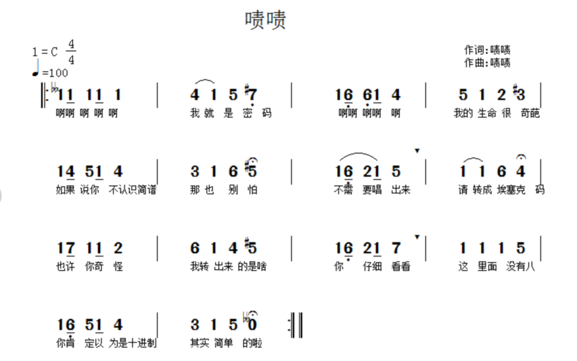
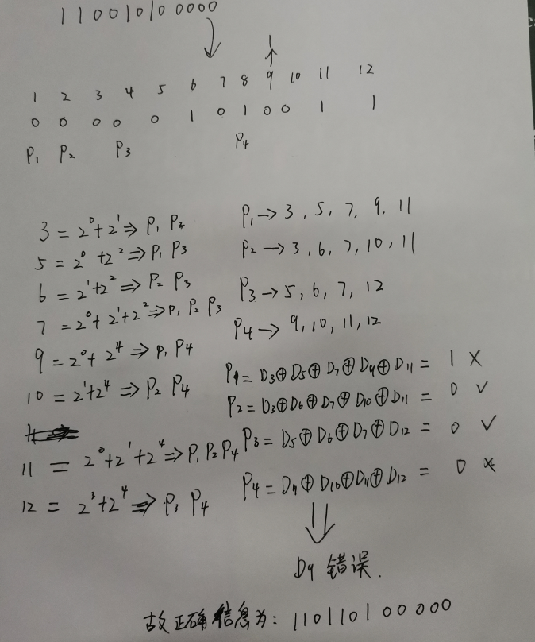

# BUUCTF-Crypto

- [BUUCTF-Crypto](#BUUCTF-Crypto)
    - [MD5](#MD5)
    - [一眼就解密](#一眼就解密)
    - [Url编码](#Url编码)
    - [看我回旋踢](#看我回旋踢)
    - [摩丝](#摩丝)
    - [password](#password)
    - [变异凯撒](#变异凯撒)
    - [Quoted-printable](#Quoted-printable)
    - [Rabbit](#Rabbit)
    - [篱笆墙的影子](#篱笆墙的影子)
    - [丢失的MD5](#丢失的MD5)
    - [Alice与Bob](#Alice与Bob)
    - [RSA](#RSA)
    - [大帝的密码武器](#大帝的密码武器)
    - [Windows系统密码](#Windows系统密码)
    - [信息化时代的步伐](#信息化时代的步伐)
    - [传统知识+古典密码](#传统知识+古典密码)
    - [凯撒？替换？呵呵!](#凯撒？替换？呵呵!)
    - [RSA1](#RSA1)
    - [萌萌哒的八戒](#萌萌哒的八戒)
    - [权限获得第一步](#权限获得第一步)
    - [old-fashion](#old-fashion)
    - [世上无难事](#世上无难事)
    - [RSA3](#RSA3)
    - [RSA2](#RSA2)
    - [异性相吸](#异性相吸)
    - [Uencode](#Uencode)
    - [还原大师](#还原大师)
    - [RSA](#RSA)
    - [Morse](#Morse)
    - [RSAROLL](#RSAROLL)
    - [robomunication](#robomunication)
    - [DangerousRSA](#DangerousRSA)
    - [Cipher](#Cipher)
    - [basic-rsa](#basic-rsa)
    - [CheckIn](#CheckIn)
    - [BabyRSA](#BabyRSA)
    - [达芬奇密码](#达芬奇密码)
    - [rsa2](#rsa2)
    - [rsa4](#rsa4)
    - [密码学的心声](#密码学的心声)
    - [这是base??](#这是base??)
    - [传感器](#传感器)
    - [rot](#rot)
    - [Keyboard](#Keyboard)
    - [childRSA](#childRSA)
    - [这是什么](#childRSA)
    - [bbbbbbrsa](#bbbbbbrsa)
    - [古典密码知多少](#古典密码知多少)
    - [佛说：只能四天](#佛说：只能四天)
    - [RSA](#RSA)
    - [天干地支+甲子](#天干地支+甲子)
    - [vigenere](#vigenere)
    - [signin](#signin)
    - [crypto-rsa0](#crypto-rsa0)
    - [keyboard](#keyboard)
    - [babyrsa](#babyrsa)
    - [SameMod](#SameMod)
    - [一张谍报](#一张谍报)
    - [yxx](#yxx)
    - [这是什么觅](#这是什么觅)
    - [BJDCTF2020-easyrsa](#BJDCTF2020-easyrsa)
    - [浪里淘沙](#浪里淘沙)
    - [AFCTF2018-Vigenère](#AFCTF2018-Vigenère)
    - [ACTF新生赛2020-crypto-rsa3](#ACTF新生赛2020-crypto-rsa3)
    - [NCTF2019-babyRSA](#NCTF2019-babyRSA)
    - [AFCTF2018-你能看出这是什么加密么](#AFCTF2018-你能看出这是什么加密么)
    - [AFCTF2018-可怜的RSA](#AFCTF2018-可怜的RSA)
    - [RoarCTF2019-babyRSA](#RoarCTF2019-babyRSA)
    - [ACTF新生赛2020-crypto-classic0](#ACTF新生赛2020-crypto-classic0)
    - [鸡藕椒盐味](#鸡藕椒盐味)
    - [网鼎杯2020青龙组-boom](#网鼎杯2020青龙组-boom)
    - [WUSTCTF2020-B@se](#WUSTCTF2020-B@se)
    - [ACTF-2020-crypto-classic1](#ACTF-2020-crypto-classic1)
    - [AFCTF2018-Single](#AFCTF2018-Single)
    - [NPUCTF2020-Classical-Cipher](#NPUCTF2020-Classical-Cipher)
    - [UTCTF2020-basic-crypto](#UTCTF2020-basic-crypto)
    - [四面八方](#四面八方)
## MD5

md5解密 admin1

## 一眼就解密

下面的字符串解密后便能获得flag：ZmxhZ3tUSEVfRkxBR19PRl9USElTX1NUUklOR30= 注意：得到的 flag 请包上 flag{} 提交

base64解密

## Url编码

url解码

## 看我回旋踢

synt{5pq1004q-86n5-46q8-o720-oro5on0417r1}

凯撒解密

flag{5cd1004d-86a5-46d8-b720-beb5ba0417e1}

## 摩丝

.. .-.. --- ...- . -.-- --- ..-

摩斯电码

## password

姓名：张三
生日：19900315

key格式为key{xxxxxxxxxx}

flag{zs19900315}

## 变异凯撒

加密密文：afZ_r9VYfScOeO_UL^RWUc
格式：flag{ }

afZ_ => flag
rc => {}

a -> f 5
f -> l 6
Z -> a 7
_ -> g 8

```py
c = "afZ_r9VYfScOeO_UL^RWUc"
move = 5

flag = ""
for i in c:
    flag += chr(ord(i)+ move)
    move = move +1

print(flag)
```

## Quoted-printable

=E9=82=A3=E4=BD=A0=E4=B9=9F=E5=BE=88=E6=A3=92=E5=93=A6

Quoted-printable编码

在线解密网站：
http://www.mxcz.net/tools/QuotedPrintable.aspx

flag{那你也很棒哦}

## Rabbit

U2FsdGVkX1/+ydnDPowGbjjJXhZxm2MP2AgI

Rabbit解密

https://www.sojson.com/encrypt_rabbit.html


## 篱笆墙的影子

felhaagv{ewtehtehfilnakgw}

栅栏加密 每组2个字符

## 丢失的MD5
md5.py
```py
import hashlib
for i in range(32,127):
    for j in range(32,127):
        for k in range(32,127):
            m=hashlib.md5()
            m.update('TASC'+chr(i)+'O3RJMV'+chr(j)+'WDJKX'+chr(k)+'ZM')
            des=m.hexdigest()
            if 'e9032' in des and 'da' in des and '911513' in des:
                print des
```

直接python2运行

e9032994dabac08080091151380478a2


## Alice与Bob

密码学历史中，有两位知名的杰出人物，Alice和Bob。他们的爱情经过置换和轮加密也难以混淆，即使是没有身份认证也可以知根知底。就像在数学王国中的素数一样，孤傲又热情。下面是一个大整数:98554799767,请分解为两个素数，分解后，小的放前面，大的放后面，合成一个新的数字，进行md5的32位小写哈希，提交答案。 注意：得到的 flag 请包上 flag{} 提交

yafu-x64.exe "factor(98554799767)"

101999966233

flag{d450209323a847c8d01c6be47c81811a}
## RSA

在一次RSA密钥对生成中，假设p=473398607161，q=4511491，e=17
求解出d作为flag提交

```py
# 已知 p q e 求 d
import gmpy2
p = 473398607161
q = 4511491
e = 17
n = (p-1)*(q-1)
d = gmpy2.invert(e,n)
print(d)
```

flag{125631357777427553}

## rsarsa

Math is cool! Use the RSA algorithm to decode the secret message, c, p, q, and e are parameters for the RSA algorithm.


p =  9648423029010515676590551740010426534945737639235739800643989352039852507298491399561035009163427050370107570733633350911691280297777160200625281665378483
q =  11874843837980297032092405848653656852760910154543380907650040190704283358909208578251063047732443992230647903887510065547947313543299303261986053486569407
e =  65537
c =  83208298995174604174773590298203639360540024871256126892889661345742403314929861939100492666605647316646576486526217457006376842280869728581726746401583705899941768214138742259689334840735633553053887641847651173776251820293087212885670180367406807406765923638973161375817392737747832762751690104423869019034

Use RSA to find the secret message

这道题是最基础的RSA题，p,q,e,c全部给出，直接计算出私钥d，再进行解密即可

```py
# 已知 p q e c 求 m

import gmpy2
p =9648423029010515676590551740010426534945737639235739800643989352039852507298491399561035009163427050370107570733633350911691280297777160200625281665378483
q =11874843837980297032092405848653656852760910154543380907650040190704283358909208578251063047732443992230647903887510065547947313543299303261986053486569407
e =  65537
n = p*q
c =83208298995174604174773590298203639360540024871256126892889661345742403314929861939100492666605647316646576486526217457006376842280869728581726746401583705899941768214138742259689334840735633553053887641847651173776251820293087212885670180367406807406765923638973161375817392737747832762751690104423869019034


d = gmpy2.invert(e,(p-1)*(q-1)) # d是私钥
m = gmpy2.powmod(c,d,n)  # 幂取模，结果是 C = (M^e) mod n
print(m)
```

flag{5577446633554466577768879988}

## 大帝的密码武器

公元前一百年，在罗马出生了一位对世界影响巨大的人物，他生前是罗马三巨头之一。他率先使用了一种简单的加密函，因此这种加密方法以他的名字命名。
以下密文被解开后可以获得一个有意义的单词：FRPHEVGL
你可以用这个相同的加密向量加密附件中的密文，作为答案进行提交。

改后缀名解压，凯撒移位13解密得到单词SECURITY，说明位移13，ComeChina加密13得到：flag{PbzrPuvan}

## Windows系统密码

md5解密

## 信息化时代的步伐

https://dianma.bmcx.com/

中文电码

## 传统知识+古典密码

小明某一天收到一封密信，信中写了几个不同的年份
          辛卯，癸巳，丙戌，辛未，庚辰，癸酉，己卯，癸巳。
          信的背面还写有“+甲子”，请解出这段密文。

key值：CTF{XXX}


第一个60甲子年表 28 30 23 8 17 10 16 30 一个甲子60年

88 90 83 68 77 70 76 90

ASCII解密得到XZSDMFLZ

栅栏解密2 再凯撒解密SHUANGYU

## 凯撒？替换？呵呵!

MTHJ{CUBCGXGUGXWREXIPOYAOEYFIGXWRXCHTKHFCOHCFDUCGTXZOHIXOEOWMEHZO} 注意：得到的 flag 请包上 flag{} 提交, flag{小写字母}


https://quipqiup.com/

MTHJ=flag

flag{substitutioncipherdecryptionisalwayseasyjustlikeapieceofcake}

## RSA1

```
p = 8637633767257008567099653486541091171320491509433615447539162437911244175885667806398411790524083553445158113502227745206205327690939504032994699902053229
q = 12640674973996472769176047937170883420927050821480010581593137135372473880595613737337630629752577346147039284030082593490776630572584959954205336880228469
dp = 6500795702216834621109042351193261530650043841056252930930949663358625016881832840728066026150264693076109354874099841380454881716097778307268116910582929
dq = 783472263673553449019532580386470672380574033551303889137911760438881683674556098098256795673512201963002175438762767516968043599582527539160811120550041
c = 24722305403887382073567316467649080662631552905960229399079107995602154418176056335800638887527614164073530437657085079676157350205351945222989351316076486573599576041978339872265925062764318536089007310270278526159678937431903862892400747915525118983959970607934142974736675784325993445942031372107342103852
```

已知 p、q、dp、dq、c 求明文 m (dp、dq 泄露)

脚本跑即可

## 萌萌哒的八戒

猪圈密码

w h e n t h e p i g w a n t t o e a t

## 权限获得第一步

md5解密

## old-fashion

Os drnuzearyuwn, y jtkjzoztzoes douwlr oj y ilzwex eq lsdexosa kn pwodw tsozj eq ufyoszlbz yrl rlufydlx pozw douwlrzlbz, ydderxosa ze y rlatfyr jnjzli; mjy gfbmw vla xy wbfnsy symmyew (mjy vrwm qrvvrf), hlbew rd symmyew, mebhsymw rd symmyew, vbomgeyw rd mjy lxrzy, lfk wr dremj. Mjy eyqybzye kyqbhjyew mjy myom xa hyedrevbfn lf bfzyewy wgxwmbmgmbrf. Wr mjy dsln bw f1_2jyf-k3_jg1-vb-vl_l

凯撒解密

## 世上无难事

以下是某国现任总统外发的一段指令，经过一种奇异的加密方式，毫无规律，看来只能分析了。请将这段语句还原成通顺语句，并从中找到key作为答案提交，答案是32位，包含小写字母。 注意：得到的 flag 请包上 flag{} 提交

VIZZB IFIUOJBWO NVXAP OBC XZZ UKHVN IFIUOJBWO HB XVIXW XAW VXFI X QIXN VBD KQ IFIUOJBWO WBKAH NBWXO VBD XJBCN NKG QLKEIU DI XUI VIUI DKNV QNCWIANQ XN DXPIMKIZW VKHV QEVBBZ KA XUZKAHNBA FKUHKAKX XAW DI VXFI HBN QNCWIANQ NCAKAH KA MUBG XZZ XEUBQQ XGIUKEX MUBG PKAWIUHXUNIA NVUBCHV 12NV HUXWI XAW DI XUI SCQN QB HZXW NVXN XZZ EBCZW SBKA CQ NBWXO XAW DI DXAN NB NVXAP DXPIMKIZW MBU JIKAH QCEV XA BCNQNXAWKAH VBQN HKFI OBCUQIZFIQ X JKH UBCAW BM XLLZXCQI XAW NVI PIO KQ 640I11012805M211J0XJ24MM02X1IW09

同上

## RSA3

```
c1=22322035275663237041646893770451933509324701913484303338076210603542612758956262869640822486470121149424485571361007421293675516338822195280313794991136048140918842471219840263536338886250492682739436410013436651161720725855484866690084788721349555662019879081501113222996123305533009325964377798892703161521852805956811219563883312896330156298621674684353919547558127920925706842808914762199011054955816534977675267395009575347820387073483928425066536361482774892370969520740304287456555508933372782327506569010772537497541764311429052216291198932092617792645253901478910801592878203564861118912045464959832566051361
n=22708078815885011462462049064339185898712439277226831073457888403129378547350292420267016551819052430779004755846649044001024141485283286483130702616057274698473611149508798869706347501931583117632710700787228016480127677393649929530416598686027354216422565934459015161927613607902831542857977859612596282353679327773303727004407262197231586324599181983572622404590354084541788062262164510140605868122410388090174420147752408554129789760902300898046273909007852818474030770699647647363015102118956737673941354217692696044969695308506436573142565573487583507037356944848039864382339216266670673567488871508925311154801
e1=11187289
c2=18702010045187015556548691642394982835669262147230212731309938675226458555210425972429418449273410535387985931036711854265623905066805665751803269106880746769003478900791099590239513925449748814075904017471585572848473556490565450062664706449128415834787961947266259789785962922238701134079720414228414066193071495304612341052987455615930023536823801499269773357186087452747500840640419365011554421183037505653461286732740983702740822671148045619497667184586123657285604061875653909567822328914065337797733444640351518775487649819978262363617265797982843179630888729407238496650987720428708217115257989007867331698397
e2=9647291
```
共模攻击

脚本跑即可

## RSA2

```
e = 65537
n = 248254007851526241177721526698901802985832766176221609612258877371620580060433101538328030305219918697643619814200930679612109885533801335348445023751670478437073055544724280684733298051599167660303645183146161497485358633681492129668802402065797789905550489547645118787266601929429724133167768465309665906113
dp = 905074498052346904643025132879518330691925174573054004621877253318682675055421970943552016695528560364834446303196939207056642927148093290374440210503657

c = 140423670976252696807533673586209400575664282100684119784203527124521188996403826597436883766041879067494280957410201958935737360380801845453829293997433414188838725751796261702622028587211560353362847191060306578510511380965162133472698713063592621028959167072781482562673683090590521214218071160287665180751
```
脚本跑

## 异性相吸

最近出现了一个奇葩观点，说性别都不一样，怎么能谈恋爱？为了证明这个观点错误，请大家证明异性是相吸的。 注意：得到的 flag 请包上 flag{} 提交

key.txt
```
asadsasdasdasdasdasdasdasdasdasdqwesqf
```

密文
```
ἇ̀Ј唒ဃ塔屋䩘卖剄䐃堂ن䝔嘅均ቄ䩝ᬔ
```

两者二进制异或即可

## Unencode

```
89FQA9WMD<V1A<V1S83DY.#<W3$Q,2TM]
```

http://ctf.ssleye.com/uu.html

## 还原大师

我们得到了一串神秘字符串：TASC?O3RJMV?WDJKX?ZM,问号部分是未知大写字母，为了确定这个神秘字符串，我们通过了其他途径获得了这个字串的32位MD5码。但是我们获得它的32位MD5码也是残缺不全，E903???4DAB????08?????51?80??8A?,请猜出神秘字符串的原本模样，并且提交这个字串的32位MD5码作为答案。 注意：得到的 flag 请包上 flag{} 提交

md5爆破

```py
import hashlib

plaintext = 'TASC?O3RJMV?WDJKX?ZM' # 需要还原的密文

for i in range(26):
	temp1 = plaintext.replace('?',str(chr(65+i)),1) # 替换不超过1次
	for j in range(26):
		temp2 = temp1.replace('?',chr(65+j),1) # 替换第2个问号
		for n in range(26):
			temp3 = temp2.replace('?',chr(65+n),1) # 替换第3个问号
			s = hashlib.md5(temp3.encode('utf8')).hexdigest().upper()#注意大小写
			if s[:4] == 'E903':    #检查元素
				print (s)       #输出密文
```

flag{E9032994DABAC08080091151380478A2}

## RSA

已知 public key、密文 c，求明文 m (公钥提取)

先用在线工具分解公钥

跑对应的脚本即可

## Morse

-..../.----/-..../-..../-..../...--/--.../....-/-..../-..../--.../-.../...--/.----/--.../...--/..---/--.../--.../....-/...../..-./--.../...--/...--/-----/...../..-./...--/...--/...--/....-/...--/...../--.../----./--.../-..

/替换两个空格，然后摩斯解码

61666374667B317327745F73305F333435797D

hex解码

flag{1s't_s0_345y}

## RSAROLL

```
RSA roll！roll！roll！
Only number and a-z
（don't use editor
which MS provide）
```

```
{920139713,19}

704796792
752211152
274704164
18414022
368270835
483295235
263072905
459788476
483295235
459788476
663551792
475206804
459788476
428313374
475206804
459788476
425392137
704796792
458265677
341524652
483295235
534149509
425392137
428313374
425392137
341524652
458265677
263072905
483295235
828509797
341524652
425392137
475206804
428313374
483295235
475206804
459788476
306220148
```

分解 N 得 p、q

```py
import gmpy2
N,p,q,e=920139713,49891,18443,19
phi = (p-1)*(q-1)
d=gmpy2.invert(e,phi)
result=[]

with open("c.txt","r") as f:
  for c in f.readlines():
    c=c.strip('\n')
    result.append(chr(pow(int(c),d,N)))

flag=''
for i in result:
  flag+=i
  print(flag)
```

## robomunication

## DangerousRSA

```
#n:  0x52d483c27cd806550fbe0e37a61af2e7cf5e0efb723dfc81174c918a27627779b21fa3c851e9e94188eaee3d5cd6f752406a43fbecb53e80836ff1e185d3ccd7782ea846c2e91a7b0808986666e0bdadbfb7bdd65670a589a4d2478e9adcafe97c6ee23614bcb2ecc23580f4d2e3cc1ecfec25c50da4bc754dde6c8bfd8d1fc16956c74d8e9196046a01dc9f3024e11461c294f29d7421140732fedacac97b8fe50999117d27943c953f18c4ff4f8c258d839764078d4b6ef6e8591e0ff5563b31a39e6374d0d41c8c46921c25e5904a817ef8e39e5c9b71225a83269693e0b7e3218fc5e5a1e8412ba16e588b3d6ac536dce39fcdfce81eec79979ea6872793L
#e:  0x3
#c:0x10652cdfaa6b63f6d7bd1109da08181e500e5643f5b240a9024bfa84d5f2cac9310562978347bb232d63e7289283871efab83d84ff5a7b64a94a79d34cfbd4ef121723ba1f663e514f83f6f01492b4e13e1bb4296d96ea5a353d3bf2edd2f449c03c4a3e995237985a596908adc741f32365
so,how to get the message?
```

```py
# -*- coding: utf-8 -*-#
#python3
from gmpy2 import iroot
import libnum
e = 0x3
n = 0x52d483c27cd806550fbe0e37a61af2e7cf5e0efb723dfc81174c918a27627779b21fa3c851e9e94188eaee3d5cd6f752406a43fbecb53e80836ff1e185d3ccd7782ea846c2e91a7b0808986666e0bdadbfb7bdd65670a589a4d2478e9adcafe97c6ee23614bcb2ecc23580f4d2e3cc1ecfec25c50da4bc754dde6c8bfd8d1fc16956c74d8e9196046a01dc9f3024e11461c294f29d7421140732fedacac97b8fe50999117d27943c953f18c4ff4f8c258d839764078d4b6ef6e8591e0ff5563b31a39e6374d0d41c8c46921c25e5904a817ef8e39e5c9b71225a83269693e0b7e3218fc5e5a1e8412ba16e588b3d6ac536dce39fcdfce81eec79979ea6872793
c = 0x10652cdfaa6b63f6d7bd1109da08181e500e5643f5b240a9024bfa84d5f2cac9310562978347bb232d63e7289283871efab83d84ff5a7b64a94a79d34cfbd4ef121723ba1f663e514f83f6f01492b4e13e1bb4296d96ea5a353d3bf2edd2f449c03c4a3e995237985a596908adc741f32365

k = 0
while 1:
    res = iroot(c+k*n,e)  #c+k*n 开3次方根 能开3次方即可
    #print(res)
    #res = (mpz(13040004482819713819817340524563023159919305047824600478799740488797710355579494486728991357), True)
    if(res[1] == True):
        print(libnum.n2s(int(res[0]))) #转为字符串
        break
    k=k+1
```

flag{25df8caf006ee5db94d48144c33b2c3b}

## Cipher

还能提示什么呢？公平的玩吧（密钥自己找） Dncnoqqfliqrpgeklwmppu 注意：得到的 flag 请包上 flag{} 提交, flag{小写字母}

密钥 playfair

http://rumkin.com/tools/cipher/playfair.php


flag{itisnotaproblemhavefun}

## basic-rsa

```py
import gmpy2
from Crypto.Util.number import *
from binascii import a2b_hex,b2a_hex

flag = "*****************"

p = 262248800182277040650192055439906580479
q = 262854994239322828547925595487519915551

e = 65533
n = p*q


c = pow(int(b2a_hex(flag),16),e,n)

print c

# 27565231154623519221597938803435789010285480123476977081867877272451638645710
```

```py
import gmpy2
from Crypto.Util.number import *
from binascii import a2b_hex,b2a_hex
import binascii

e = 65533

c = 27565231154623519221597938803435789010285480123476977081867877272451638645710
#1.将n分解为p和q
p = 262248800182277040650192055439906580479
q = 262854994239322828547925595487519915551
n = p*q

phi = (p-1)*(q-1)
#2.求d
d = gmpy2.invert(e,phi)
#3.m=pow(c,d,n)
m = gmpy2.powmod(c,d,n)
print(binascii.unhexlify(hex(m)[2:]))
#binascii.unhexlify(hexstr):从十六进制字符串hexstr返回二进制数据
```

## CheckIn

dikqTCpfRjA8fUBIMD5GNDkwMjNARkUwI0BFTg==

base64解码

`v)*L*_F0<}@H0>F49023@FE0#@EN`

rot47编码

GXY{Y0u_kNow_much_about_Rot}

## BabyRSA

已知 e、d、p+q、(p+1)(q+1)、以及密文C，求明文m

```
p+q : 0x1232fecb92adead91613e7d9ae5e36fe6bb765317d6ed38ad890b4073539a6231a6620584cea5730b5af83a3e80cf30141282c97be4400e33307573af6b25e2ea
(p+1)(q+1) : 0x5248becef1d925d45705a7302700d6a0ffe5877fddf9451a9c1181c4d82365806085fd86fbaab08b6fc66a967b2566d743c626547203b34ea3fdb1bc06dd3bb765fd8b919e3bd2cb15bc175c9498f9d9a0e216c2dde64d81255fa4c05a1ee619fc1fc505285a239e7bc655ec6605d9693078b800ee80931a7a0c84f33c851740
e : 0xe6b1bee47bd63f615c7d0a43c529d219
d : 0x2dde7fbaed477f6d62838d55b0d0964868cf6efb2c282a5f13e6008ce7317a24cb57aec49ef0d738919f47cdcd9677cd52ac2293ec5938aa198f962678b5cd0da344453f521a69b2ac03647cdd8339f4e38cec452d54e60698833d67f9315c02ddaa4c79ebaa902c605d7bda32ce970541b2d9a17d62b52df813b2fb0c5ab1a5
enc_flag : 0x50ae00623211ba6089ddfae21e204ab616f6c9d294e913550af3d66e85d0c0693ed53ed55c46d8cca1d7c2ad44839030df26b70f22a8567171a759b76fe5f07b3c5a6ec89117ed0a36c0950956b9cde880c575737f779143f921d745ac3bb0e379c05d9a3cc6bf0bea8aa91e4d5e752c7eb46b2e023edbc07d24a7c460a34a9a
```

脚本跑

## 达芬奇密码

达芬奇一直是一个有争议的画家，科学家。。。小明为了研究他，从网上找到了名画蒙娜丽莎，一天深夜，小明突然从蒙娜丽莎背后的天空中看到了一串神秘的数字。顺带告诉小明达芬奇家窗台上有一串数字是关键。小明千里迢迢找到了这串数字，请将这个送分题做出来，亲，包邮哦（答案是一串32位十进制数字） 注意：得到的 flag 请包上 flag{} 提交

达芬奇隐藏在蒙娜丽莎中的数字列:1 233 3 2584 1346269 144 5 196418 21 1597 610 377 10946 89 514229 987 8 55 6765 2178309 121393 317811 46368 4181 1 832040 2 28657 75025 34 13 17711
记录在达芬奇窗台口的神秘数字串:3696885388211672554734217695228

## rsa2

```py

N = 101991809777553253470276751399264740131157682329252673501792154507006158434432009141995367241962525705950046253400188884658262496534706438791515071885860897552736656899566915731297225817250639873643376310103992170646906557242832893914902053581087502512787303322747780420210884852166586717636559058152544979471
e = 46731919563265721307105180410302518676676135509737992912625092976849075262192092549323082367518264378630543338219025744820916471913696072050291990620486581719410354385121760761374229374847695148230596005409978383369740305816082770283909611956355972181848077519920922059268376958811713365106925235218265173085

import hashlib
flag = "flag{" + hashlib.md5(hex(d)).hexdigest() + "}"
```

```py
https://github.com/pablocelayes/rsa-wiener-attack

低解密指数攻击:e过大 n分解不出来


python2 带工具，在rsa-wiener-attack-master目录下kali虚拟机执行，python2 hello.py即可
```py

import hashlib
import RSAwienerHacker
N = 101991809777553253470276751399264740131157682329252673501792154507006158434432009141995367241962525705950046253400188884658262496534706438791515071885860897552736656899566915731297225817250639873643376310103992170646906557242832893914902053581087502512787303322747780420210884852166586717636559058152544979471
e = 46731919563265721307105180410302518676676135509737992912625092976849075262192092549323082367518264378630543338219025744820916471913696072050291990620486581719410354385121760761374229374847695148230596005409978383369740305816082770283909611956355972181848077519920922059268376958811713365106925235218265173085
d =  RSAwienerHacker.hack_RSA(e,N)
print(d)
flag = "flag{" + hashlib.md5(hex(d)).hexdigest() + "}"
print(flag)
#8920758995414587152829426558580025657357328745839747693739591820283538307445
#flag{47bf28da384590448e0b0d23909a25a4}
```

## RSA4

```py
N = 331310324212000030020214312244232222400142410423413104441140203003243002104333214202031202212403400220031202142322434104143104244241214204444443323000244130122022422310201104411044030113302323014101331214303223312402430402404413033243132101010422240133122211400434023222214231402403403200012221023341333340042343122302113410210110221233241303024431330001303404020104442443120130000334110042432010203401440404010003442001223042211442001413004 
c = 310020004234033304244200421414413320341301002123030311202340222410301423440312412440240244110200112141140201224032402232131204213012303204422003300004011434102141321223311243242010014140422411342304322201241112402132203101131221223004022003120002110230023341143201404311340311134230140231412201333333142402423134333211302102413111111424430032440123340034044314223400401224111323000242234420441240411021023100222003123214343030122032301042243

N = 302240000040421410144422133334143140011011044322223144412002220243001141141114123223331331304421113021231204322233120121444434210041232214144413244434424302311222143224402302432102242132244032010020113224011121043232143221203424243134044314022212024343100042342002432331144300214212414033414120004344211330224020301223033334324244031204240122301242232011303211220044222411134403012132420311110302442344021122101224411230002203344140143044114 
c = 112200203404013430330214124004404423210041321043000303233141423344144222343401042200334033203124030011440014210112103234440312134032123400444344144233020130110134042102220302002413321102022414130443041144240310121020100310104334204234412411424420321211112232031121330310333414423433343322024400121200333330432223421433344122023012440013041401423202210124024431040013414313121123433424113113414422043330422002314144111134142044333404112240344

N = 332200324410041111434222123043121331442103233332422341041340412034230003314420311333101344231212130200312041044324431141033004333110021013020140020011222012300020041342040004002220210223122111314112124333211132230332124022423141214031303144444134403024420111423244424030030003340213032121303213343020401304243330001314023030121034113334404440421242240113103203013341231330004332040302440011324004130324034323430143102401440130242321424020323 
c = 10013444120141130322433204124002242224332334011124210012440241402342100410331131441303242011002101323040403311120421304422222200324402244243322422444414043342130111111330022213203030324422101133032212042042243101434342203204121042113212104212423330331134311311114143200011240002111312122234340003403312040401043021433112031334324322123304112340014030132021432101130211241134422413442312013042141212003102211300321404043012124332013240431242
```
中国剩余定理

脚本跑

## 密码学的心声



明显的八进制->十进制->ASCII

```py
s = '111 114 157 166 145 123 145 143 165 162 151 164 171 126 145 162 171 115 165 143 150'
tmp = [s.split(' ')[i] for i in range(len(s.split(' ')))]
cipher = ''
for i in tmp:
    cipher += chr(int(i,8))
flag = "flag{"+cipher+"}"
print(flag)
 ```

## 这是base??

```
dict:{0: 'J', 1: 'K', 2: 'L', 3: 'M', 4: 'N', 5: 'O', 6: 'x', 7: 'y', 8: 'U', 9: 'V', 10: 'z', 11: 'A', 12: 'B', 13: 'C', 14: 'D', 15: 'E', 16: 'F', 17: 'G', 18: 'H', 19: '7', 20: '8', 21: '9', 22: 'P', 23: 'Q', 24: 'I', 25: 'a', 26: 'b', 27: 'c', 28: 'd', 29: 'e', 30: 'f', 31: 'g', 32: 'h', 33: 'i', 34: 'j', 35: 'k', 36: 'l', 37: 'm', 38: 'W', 39: 'X', 40: 'Y', 41: 'Z', 42: '0', 43: '1', 44: '2', 45: '3', 46: '4', 47: '5', 48: '6', 49: 'R', 50: 'S', 51: 'T', 52: 'n', 53: 'o', 54: 'p', 55: 'q', 56: 'r', 57: 's', 58: 't', 59: 'u', 60: 'v', 61: 'w', 62: '+', 63: '/', 64: '='}

chipertext:
FlZNfnF6Qol6e9w17WwQQoGYBQCgIkGTa9w3IQKw
```

先把密文对dict表替换，再进行base64解码

```py
// An highlighted block
import base64
dict={0: 'J', 1: 'K', 2: 'L', 3: 'M', 4: 'N', 5: 'O', 6: 'x', 7: 'y', 8: 'U', 9: 'V', 10: 'z', 11: 'A', 12: 'B', 13: 'C', 14: 'D', 15: 'E', 16: 'F', 17: 'G', 18: 'H', 19: '7', 20: '8', 21: '9', 22: 'P', 23: 'Q', 24: 'I', 25: 'a', 26: 'b', 27: 'c', 28: 'd', 29: 'e', 30: 'f', 31: 'g', 32: 'h',33: 'i', 34: 'j', 35: 'k', 36: 'l', 37: 'm', 38: 'W', 39: 'X', 40: 'Y', 41: 'Z', 42: '0', 43: '1', 44: '2', 45: '3', 46: '4', 47: '5', 48: '6', 49: 'R', 50: 'S', 51: 'T', 52: 'n', 53: 'o', 54: 'p', 55: 'q', 56: 'r', 57: 's', 58: 't', 59: 'u', 60: 'v', 61: 'w', 62: '+', 63: '/', 64: '='}
base64_list = ['A', 'B', 'C', 'D', 'E', 'F', 'G', 'H', 'I', 'J', 'K', 'L', 'M', 'N', 'O', 'P','Q', 'R', 'S', 'T', 'U', 'V', 'W', 'X', 'Y', 'Z', 'a', 'b', 'c', 'd', 'e', 'f','g', 'h', 'i', 'j', 'k', 'l', 'm', 'n', 'o', 'p', 'q', 'r', 's', 't', 'u', 'v','w', 'x', 'y', 'z', '0', '1', '2', '3', '4', '5', '6', '7', '8', '9', '+', '/']

cipher='FlZNfnF6Qol6e9w17WwQQoGYBQCgIkGTa9w3IQKw'
res=''
for i in range(len(cipher)):
    for j in range(64):
        if(dict[j]==cipher[i]):
            res+=base64_list[j]
print(res)
flag=base64.b64decode(res)
print(flag)
#b'BJD{D0_Y0u_kNoW_Th1s_b4se_map}'
```

## 传感器


5555555595555A65556AA696AA6666666955
这是某压力传感器无线数据包解调后但未解码的报文(hex)

已知其ID为0xFED31F，请继续将报文完整解码，提交hex。

提示1：曼联


```py
cipher='5555555595555A65556AA696AA6666666955'
def iee(cipher):
    tmp=''
    for i in range(len(cipher)):
        a=bin(eval('0x'+cipher[i]))[2:].zfill(4)
        tmp=tmp+a[1]+a[3]
        print(tmp)
    plain=[hex(int(tmp[i:i+8][::-1],2))[2:] for i in range(0,len(tmp),8)]
    print(''.join(plain).upper())

iee(cipher)
```

## rot

破解下面的密文：

83 89 78 84 45 86 96 45 115 121 110 116 136 132 132 132 108 128 117 118 134 110 123 111 110 127 108 112 124 122 108 118 128 108 131 114 127 134 108 116 124 124 113 108 76 76 76 76 138 23 90 81 66 71 64 69 114 65 112 64 66 63 69 61 70 114 62 66 61 62 69 67 70 63 61 110 110 112 64 68 62 70 61 112 111 112

flag格式flag{}

```py
a = [83,89,78,84,45,86,96,45,115,121,110,116,136,132,132,132,108,128,117,118,134,110,123,111,110,127,108,112,124,122,108,118,128,108,131,114,127,134,108,116,124,124,113,108,76,76,76,76,138,23,90,81,66,71,64,69,114,65,112,64,66,63,69,61,70,114,62,66,61,62,69,67,70,63,61,110,110,112,64,68,62,70,61,112,111,112]
b = []
for i in a:
    i = i-13
    b.append(i)

for j in b:
    print(chr(j),end='')
```

flag{www_shiyanbar_com_is_very_good_????}
MD5=38e4c352809e150186920aac37190cbc

md5爆破
```py
import hashlib

md5 = '38e4c352809e150186920aac37190cbc'
flag = 'flag{www_shiyanbar_com_is_very_good_'
for i in range(49,123):
    for j in range(49,123):
        for k in range(49,123):
            for l in range(49,123):
                flag += chr(i) + chr(j) + chr(k) + chr(l) + '}'
                if hashlib.md5(flag.encode('utf8')).hexdigest() == md5:
                    print(flag)
                flag = flag[:-5] # 恢复原生状态
```


## Keyboard

```
ooo yyy ii w uuu ee uuuu yyy uuuu y w uuu i i rr w i i rr rrr uuuu rrr uuuu t ii uuuu i w u rrr ee www ee yyy eee www w tt ee
```

```py
# -*- coding:utf-8 -*-
# Author : Konmu
# [NCTF2019]Keyboard

chiper='ooo yyy ii w uuu ee uuuu yyy uuuu y w uuu i i rr w i i rr rrr uuuu rrr uuuu t ii uuuu i w u rrr ee www ee yyy eee www w tt ee'
chiper=chiper.split(' ')

keys=['q','w','e','r','t','y','u','i','o']
values=[1,2,3,4,5,6,7,8,9]
dicts=dict(zip(keys,values))

jiugongge=['   ','abc','def','ghi','jkl','mno','pqrs','tuv','wxyz']
new_dicts=dict(zip(values,jiugongge))

for i in range(len(chiper)):
    temp=dicts.get(chiper[i][0])
    print(''.join(new_dicts[temp][len(chiper[i])-1]),end='')
```

youaresosmartthatthisisjustapieceofcake

## childRSA

```py
from random import choice
from Crypto.Util.number import isPrime, sieve_base as primes
from flag import flag


def getPrime(bits):
    while True:
        n = 2
        while n.bit_length() < bits:
            n *= choice(primes)
        if isPrime(n + 1):
            return n + 1

e = 0x10001
m = int.from_bytes(flag.encode(), 'big')
p, q = [getPrime(2048) for _ in range(2)]
n = p * q
c = pow(m, e, n)

# n = 32849718197337581823002243717057659218502519004386996660885100592872201948834155543125924395614928962750579667346279456710633774501407292473006312537723894221717638059058796679686953564471994009285384798450493756900459225040360430847240975678450171551048783818642467506711424027848778367427338647282428667393241157151675410661015044633282064056800913282016363415202171926089293431012379261585078566301060173689328363696699811123592090204578098276704877408688525618732848817623879899628629300385790344366046641825507767709276622692835393219811283244303899850483748651722336996164724553364097066493953127153066970594638491950199605713033004684970381605908909693802373826516622872100822213645899846325022476318425889580091613323747640467299866189070780620292627043349618839126919699862580579994887507733838561768581933029077488033326056066378869170169389819542928899483936705521710423905128732013121538495096959944889076705471928490092476616709838980562233255542325528398956185421193665359897664110835645928646616337700617883946369110702443135980068553511927115723157704586595844927607636003501038871748639417378062348085980873502535098755568810971926925447913858894180171498580131088992227637341857123607600275137768132347158657063692388249513
# c = 26308018356739853895382240109968894175166731283702927002165268998773708335216338997058314157717147131083296551313334042509806229853341488461087009955203854253313827608275460592785607739091992591431080342664081962030557042784864074533380701014585315663218783130162376176094773010478159362434331787279303302718098735574605469803801873109982473258207444342330633191849040553550708886593340770753064322410889048135425025715982196600650740987076486540674090923181664281515197679745907830107684777248532278645343716263686014941081417914622724906314960249945105011301731247324601620886782967217339340393853616450077105125391982689986178342417223392217085276465471102737594719932347242482670320801063191869471318313514407997326350065187904154229557706351355052446027159972546737213451422978211055778164578782156428466626894026103053360431281644645515155471301826844754338802352846095293421718249819728205538534652212984831283642472071669494851823123552827380737798609829706225744376667082534026874483482483127491533474306552210039386256062116345785870668331513725792053302188276682550672663353937781055621860101624242216671635824311412793495965628876036344731733142759495348248970313655381407241457118743532311394697763283681852908564387282605279108
```

已知 n、质数相乘+1 (Pollard's p-1)

注意到生成质数的过程，是在质数库里面选一堆质数乘起来，最后加上 1。这会导致 拥有小因子。采用 Pollard's p-1 攻击

```bash
python -m primefac -vs -m=p-1 32849718197337581823002243717057659218502519004386996660885100592872201948834155543125924395614928962750579667346279456710633774501407292473006312537723894221717638059058796679686953564471994009285384798450493756900459225040360430847240975678450171551048783818642467506711424027848778367427338647282428667393241157151675410661015044633282064056800913282016363415202171926089293431012379261585078566301060173689328363696699811123592090204578098276704877408688525618732848817623879899628629300385790344366046641825507767709276622692835393219811283244303899850483748651722336996164724553364097066493953127153066970594638491950199605713033004684970381605908909693802373826516622872100822213645899846325022476318425889580091613323747640467299866189070780620292627043349618839126919699862580579994887507733838561768581933029077488033326056066378869170169389819542928899483936705521710423905128732013121538495096959944889076705471928490092476616709838980562233255542325528398956185421193665359897664110835645928646616337700617883946369110702443135980068553511927115723157704586595844927607636003501038871748639417378062348085980873502535098755568810971926925447913858894180171498580131088992227637341857123607600275137768132347158657063692388249513
```

```py
import gmpy2, libnum

c = 26308018356739853895382240109968894175166731283702927002165268998773708335216338997058314157717147131083296551313334042509806229853341488461087009955203854253313827608275460592785607739091992591431080342664081962030557042784864074533380701014585315663218783130162376176094773010478159362434331787279303302718098735574605469803801873109982473258207444342330633191849040553550708886593340770753064322410889048135425025715982196600650740987076486540674090923181664281515197679745907830107684777248532278645343716263686014941081417914622724906314960249945105011301731247324601620886782967217339340393853616450077105125391982689986178342417223392217085276465471102737594719932347242482670320801063191869471318313514407997326350065187904154229557706351355052446027159972546737213451422978211055778164578782156428466626894026103053360431281644645515155471301826844754338802352846095293421718249819728205538534652212984831283642472071669494851823123552827380737798609829706225744376667082534026874483482483127491533474306552210039386256062116345785870668331513725792053302188276682550672663353937781055621860101624242216671635824311412793495965628876036344731733142759495348248970313655381407241457118743532311394697763283681852908564387282605279108

p = 178449493212694205742332078583256205058672290603652616240227340638730811945224947826121772642204629335108873832781921390308501763661154638696935732709724016546955977529088135995838497476350749621442719690722226913635772410880516639651363626821442456779009699333452616953193799328647446968707045304702547915799734431818800374360377292309248361548868909066895474518333089446581763425755389837072166970684877011663234978631869703859541876049132713490090720408351108387971577438951727337962368478059295446047962510687695047494480605473377173021467764495541590394732685140829152761532035790187269724703444386838656193674253139
q = 184084121540115307597161367011014142898823526027674354555037785878481711602257307508985022577801782788769786800015984410443717799994642236194840684557538917849420967360121509675348296203886340264385224150964642958965438801864306187503790100281099130863977710204660546799128755418521327290719635075221585824217487386227004673527292281536221958961760681032293340099395863194031788435142296085219594866635192464353365034089592414809332183882423461536123972873871477755949082223830049594561329457349537703926325152949582123419049073013144325689632055433283354999265193117288252918515308767016885678802217366700376654365502867
e = 0x10001
d = gmpy2.invert(e, (p-1)*(q-1))

m = pow(c, d, p*q)
# print(libnum.n2s(m)) 这个有问题 手动即可
```

## 这是什么

后缀改为doc，JSFUCK解密

## bbbbbbrsa

```
p = 177077389675257695042507998165006460849
n = 37421829509887796274897162249367329400988647145613325367337968063341372726061
c = ==gMzYDNzIjMxUTNyIzNzIjMyYTM4MDM0gTMwEjNzgTM2UTN4cjNwIjN2QzM5ADMwIDNyMTO4UzM2cTM5kDN2MTOyUTO5YDM0czM3MjM
```

```py
from base64 import b64encode as b32encode
from gmpy2 import invert,gcd,iroot
from Crypto.Util.number import *
from binascii import a2b_hex,b2a_hex
import random

flag = "******************************"

nbit = 128

p = getPrime(nbit)
q = getPrime(nbit)
n = p*q

print p
print n

phi = (p-1)*(q-1)

e = random.randint(50000,70000)

while True:
	if gcd(e,phi) == 1:
		break;
	else:
		e -= 1;

c = pow(int(b2a_hex(flag),16),e,n)

print b32encode(str(c))[::-1]

# 2373740699529364991763589324200093466206785561836101840381622237225512234632
```

给出e的范围，用脚本爆破即可

## 古典密码知多少

猪圈密码+圣堂武士密码+标准银河字母

FGCPFLIRTUASYON

最后栅栏密码3解密

flag{CRYPTOFUN}

## 佛说：只能四天

尊即寂修我劫修如婆愍闍嚤婆莊愍耨羅嚴是喼婆斯吶眾喼修迦慧迦嚩喼斯願嚤摩隸所迦摩吽即塞願修咒莊波斯訶喃壽祗僧若即亦嘇蜜迦須色喼羅囉咒諦若陀喃慧愍夷羅波若劫蜜斯哆咒塞隸蜜波哆咤慧聞亦吽念彌諸嘚嚴諦咒陀叻咤叻諦缽隸祗婆諦嚩阿兜宣囉吽色缽吶諸劫婆咤咤喼愍尊寂色缽嘚闍兜阿婆若叻般壽聞彌即念若降宣空陀壽愍嚤亦喼寂僧迦色莊壽吽哆尊僧喼喃壽嘚兜我空所吶般所即諸吽薩咤諸莊囉隸般咤色空咤亦喃亦色兜哆嘇亦隸空闍修眾哆咒婆菩迦壽薩塞宣嚩缽寂夷摩所修囉菩阿伏嘚宣嚩薩塞菩波吶波菩哆若慧愍蜜訶壽色咒兜摩缽摩諦劫諸陀即壽所波咤聞如訶摩壽宣咤彌即嚩蜜叻劫嘇缽所摩闍壽波壽劫修訶如嚩嘇囉薩色嚤薩壽修闍夷闍是壽僧劫祗蜜嚴嚩我若空伏諦念降若心吽咤隸嘚耨缽伏吽色寂喃喼吽壽夷若心眾祗喃慧嚴即聞空僧須夷嚴叻心願哆波隸塞吶心須嘇摩咤壽嘚吶夷亦心亦喃若咒壽亦壽囑囑

圣经分为《旧约全书》和《新约全书》

1. 虽然有点不环保，但hint好像是一次性的，得到后就没有利用价值了。
2. 凯撒不是最后一步，by the way，凯撒为什么叫做凯撒？

与佛曰->社会核心价值编码->栅栏解密->凯撒解密->base32

## RSA

[BJDCTF2020]RSA

```py
from Crypto.Util.number import getPrime,bytes_to_long

flag=open("flag","rb").read()

p=getPrime(1024)
q=getPrime(1024)
assert(e<100000)
n=p*q
m=bytes_to_long(flag)
c=pow(m,e,n)
print c,n
print pow(294,e,n)

p=getPrime(1024)
n=p*q
m=bytes_to_long("BJD"*32)
c=pow(m,e,n)
print c,n

'''
output:
12641635617803746150332232646354596292707861480200207537199141183624438303757120570096741248020236666965755798009656547738616399025300123043766255518596149348930444599820675230046423373053051631932557230849083426859490183732303751744004874183062594856870318614289991675980063548316499486908923209627563871554875612702079100567018698992935818206109087568166097392314105717555482926141030505639571708876213167112187962584484065321545727594135175369233925922507794999607323536976824183162923385005669930403448853465141405846835919842908469787547341752365471892495204307644586161393228776042015534147913888338316244169120  13508774104460209743306714034546704137247627344981133461801953479736017021401725818808462898375994767375627749494839671944543822403059978073813122441407612530658168942987820256786583006947001711749230193542370570950705530167921702835627122401475251039000775017381633900222474727396823708695063136246115652622259769634591309421761269548260984426148824641285010730983215377509255011298737827621611158032976420011662547854515610597955628898073569684158225678333474543920326532893446849808112837476684390030976472053905069855522297850688026960701186543428139843783907624317274796926248829543413464754127208843070331063037
381631268825806469518166370387352035475775677163615730759454343913563615970881967332407709901235637718936184198930226303761876517101208677107311006065728014220477966000620964056616058676999878976943319063836649085085377577273214792371548775204594097887078898598463892440141577974544939268247818937936607013100808169758675042264568547764031628431414727922168580998494695800403043312406643527637667466318473669542326169218665366423043579003388486634167642663495896607282155808331902351188500197960905672207046579647052764579411814305689137519860880916467272056778641442758940135016400808740387144508156358067955215018
979153370552535153498477459720877329811204688208387543826122582132404214848454954722487086658061408795223805022202997613522014736983452121073860054851302343517756732701026667062765906277626879215457936330799698812755973057557620930172778859116538571207100424990838508255127616637334499680058645411786925302368790414768248611809358160197554369255458675450109457987698749584630551177577492043403656419968285163536823819817573531356497236154342689914525321673807925458651854768512396355389740863270148775362744448115581639629326362342160548500035000156097215446881251055505465713854173913142040976382500435185442521721  12806210903061368369054309575159360374022344774547459345216907128193957592938071815865954073287532545947370671838372144806539753829484356064919357285623305209600680570975224639214396805124350862772159272362778768036844634760917612708721787320159318432456050806227784435091161119982613987303255995543165395426658059462110056431392517548717447898084915167661172362984251201688639469652283452307712821398857016487590794996544468826705600332208535201443322267298747117528882985955375246424812616478327182399461709978893464093245135530135430007842223389360212803439850867615121148050034887767584693608776323252233254261047
'''
```

已知 c1、c2、n1、n2、e的范围 (同公钥（e，n）加密的密文、具有同 q 的公钥加密的密文

## 天干地支+甲子

得到得字符串用MRCTF{}包裹
一天Eki收到了一封来自Sndav的信，但是他有点迷希望您来解决一下
甲戌
甲寅
甲寅
癸卯
己酉
甲寅
辛丑

60甲子年表 再加60 ASCII解码

## rsa_output

```
{21058339337354287847534107544613605305015441090508924094198816691219103399526800112802416383088995253908857460266726925615826895303377801614829364034624475195859997943146305588315939130777450485196290766249612340054354622516207681542973756257677388091926549655162490873849955783768663029138647079874278240867932127196686258800146911620730706734103611833179733264096475286491988063990431085380499075005629807702406676707841324660971173253100956362528346684752959937473852630145893796056675793646430793578265418255919376323796044588559726703858429311784705245069845938316802681575653653770883615525735690306674635167111,2767}

{21058339337354287847534107544613605305015441090508924094198816691219103399526800112802416383088995253908857460266726925615826895303377801614829364034624475195859997943146305588315939130777450485196290766249612340054354622516207681542973756257677388091926549655162490873849955783768663029138647079874278240867932127196686258800146911620730706734103611833179733264096475286491988063990431085380499075005629807702406676707841324660971173253100956362528346684752959937473852630145893796056675793646430793578265418255919376323796044588559726703858429311784705245069845938316802681575653653770883615525735690306674635167111,3659}

message1=20152490165522401747723193966902181151098731763998057421967155300933719378216342043730801302534978403741086887969040721959533190058342762057359432663717825826365444996915469039056428416166173920958243044831404924113442512617599426876141184212121677500371236937127571802891321706587610393639446868836987170301813018218408886968263882123084155607494076330256934285171370758586535415136162861138898728910585138378884530819857478609791126971308624318454905992919405355751492789110009313138417265126117273710813843923143381276204802515910527468883224274829962479636527422350190210717694762908096944600267033351813929448599

message2=11298697323140988812057735324285908480504721454145796535014418738959035245600679947297874517818928181509081545027056523790022598233918011261011973196386395689371526774785582326121959186195586069851592467637819366624044133661016373360885158956955263645614345881350494012328275215821306955212788282617812686548883151066866149060363482958708364726982908798340182288702101023393839781427386537230459436512613047311585875068008210818996941460156589314135010438362447522428206884944952639826677247819066812706835773107059567082822312300721049827013660418610265189288840247186598145741724084351633508492707755206886202876227
```

共模攻击，脚本跑

## vigenere

维吉尼亚密码-vigenere

flag is mrctf vigenere crypto crack man, please add underscore and curly braces.


flag{vigenere_crypto_crack_man}

## signin

welcome to crypto world！！
密文：424a447b57653163306d655f74345f424a444354467d


## crypto-rsa0
怎么办呢，出题人也太坏了，竟然把压缩包给伪加密了！

9018588066434206377240277162476739271386240173088676526295315163990968347022922841299128274551482926490908399237153883494964743436193853978459947060210411
7547005673877738257835729760037765213340036696350766324229143613179932145122130685778504062410137043635958208805698698169847293520149572605026492751740223
50996206925961019415256003394743594106061473865032792073035954925875056079762626648452348856255575840166640519334862690063949316515750256545937498213476286637455803452890781264446030732369871044870359838568618176586206041055000297981733272816089806014400846392307742065559331874972274844992047849472203390350

```py
from Cryptodome.Util.number import *
import random

FLAG=#hidden, please solve it
flag=int.from_bytes(FLAG,byteorder = 'big')


p=getPrime(512)
q=getPrime(512)

print(p)
print(q)
N=p*q
e=65537
enc = pow(flag,e,N)
print (enc)
```

```py
import gmpy2, libnum

c = 50996206925961019415256003394743594106061473865032792073035954925875056079762626648452348856255575840166640519334862690063949316515750256545937498213476286637455803452890781264446030732369871044870359838568618176586206041055000297981733272816089806014400846392307742065559331874972274844992047849472203390350

p = 9018588066434206377240277162476739271386240173088676526295315163990968347022922841299128274551482926490908399237153883494964743436193853978459947060210411
q = 7547005673877738257835729760037765213340036696350766324229143613179932145122130685778504062410137043635958208805698698169847293520149572605026492751740223
e = 65537
d = gmpy2.invert(e, (p-1)*(q-1))

m = gmpy2.powmod(c, d, p*q)
print(m)
```

## keyboard

```py
得到的flag用
MRCTF{xxxxxx}形式上叫
都为小写字母

6
666
22
444
555
33
7
44
666
66
3
```
手机键盘密码

## babyrsa

c = 28767758880940662779934612526152562406674613203406706867456395986985664083182
n = 73069886771625642807435783661014062604264768481735145873508846925735521695159
e = 65537

flag{just_@_piece_0f_cak3}

## BabyRSA

N=636585149594574746909030160182690866222909256464847291783000651837227921337237899651287943597773270944384034858925295744880727101606841413640006527614873110651410155893776548737823152943797884729130149758279127430044739254000426610922834573094957082589539445610828279428814524313491262061930512829074466232633130599104490893572093943832740301809630847541592548921200288222432789208650949937638303429456468889100192613859073752923812454212239908948930178355331390933536771065791817643978763045030833712326162883810638120029378337092938662174119747687899484603628344079493556601422498405360731958162719296160584042671057160241284852522913676264596201906163
m1=90009974341452243216986938028371257528604943208941176518717463554774967878152694586469377765296113165659498726012712288670458884373971419842750929287658640266219686646956929872115782173093979742958745121671928568709468526098715927189829600497283118051641107305128852697032053368115181216069626606165503465125725204875578701237789292966211824002761481815276666236869005129138862782476859103086726091860497614883282949955023222414333243193268564781621699870412557822404381213804026685831221430728290755597819259339616650158674713248841654338515199405532003173732520457813901170264713085107077001478083341339002069870585378257051150217511755761491021553239
m2=487443985757405173426628188375657117604235507936967522993257972108872283698305238454465723214226871414276788912058186197039821242912736742824080627680971802511206914394672159240206910735850651999316100014691067295708138639363203596244693995562780286637116394738250774129759021080197323724805414668042318806010652814405078769738548913675466181551005527065309515364950610137206393257148357659666687091662749848560225453826362271704292692847596339533229088038820532086109421158575841077601268713175097874083536249006018948789413238783922845633494023608865256071962856581229890043896939025613600564283391329331452199062858930374565991634191495137939574539546

```py
import hashlib
import sympy
from Crypto.Util.number import *

flag = 'GWHT{******}'
secret = '******'

assert(len(flag) == 38)

half = len(flag) / 2

flag1 = flag[:half]
flag2 = flag[half:]

secret_num = getPrime(1024) * bytes_to_long(secret)

p = sympy.nextprime(secret_num)
q = sympy.nextprime(p)

N = p * q

e = 0x10001

F1 = bytes_to_long(flag1)
F2 = bytes_to_long(flag2)

c1 = F1 + F2
c2 = pow(F1, 3) + pow(F2, 3)
assert(c2 < N)

m1 = pow(c1, e, N)
m2 = pow(c2, e, N)

output = open('secret', 'w')
output.write('N=' + str(N) + '\n')
output.write('m1=' + str(m1) + '\n')
output.write('m2=' + str(m2) + '\n')
output.close()
```

已知 e、m1、m2、n、pq 接近 ,求原 m

pq接近,那么 n 应该好分解

e 已经给出来了,flag被加密为 F1 F2，要求 c1、c2 还原 flag

先用 yafu 分解 n

## SameMod

When people use same mod ,what's wrong? 注意：得到的 flag 请包上 flag{} 提交

```
{6266565720726907265997241358331585417095726146341989755538017122981360742813498401533594757088796536341941659691259323065631249,773}
{6266565720726907265997241358331585417095726146341989755538017122981360742813498401533594757088796536341941659691259323065631249,839}

message1=3453520592723443935451151545245025864232388871721682326408915024349804062041976702364728660682912396903968193981131553111537349
message2=5672818026816293344070119332536629619457163570036305296869053532293105379690793386019065754465292867769521736414170803238309535
```

做这题的时候一开始想到是将明文进行hex的，试了一下发现不对，才通过ascii的方式解得，flag需要是可见字符，所以不存在1开头的十位数，所以1开头的肯定是100以上的三位数，由此可解得flags

```py
while i < len(result):
    if result[i]=='1':
        c=chr(int(result[i:i+3]))
        i+=3
    else:
        c=chr(int(result[i:i+2]))
        i+=2
    flag+=c
print(flag)
```

## 一张谍报

国家能源总部经过派出卧底长期刺探，终于找到一个潜伏已久的国外内鬼：三楼能源楼管老王。由于抓捕仓促，老王服毒自尽了。侦查部门搜出老王每日看的报纸原来是特制的情报。聪明的你能从附件的报纸中找出情报么？flag是老王说的暗号。（由于老王的线人曾今做的土匪，所以用的行话） 注意：得到的 flag 请包上 flag{} 提交

```py
#coding:utf-8
str1 = "今天上午，朝歌区梆子公司决定，在每天三更天不亮免费在各大小区门口设卡为全城提供二次震耳欲聋的敲更提醒，呼吁大家早睡早起，不要因为贪睡断送大好人生，时代的符号是前进。为此，全区老人都蹲在该公司东边树丛合力抵制，不给公司人员放行，场面混乱。李罗鹰住进朝歌区五十年了，人称老鹰头，几年孙子李虎南刚从东北当猎户回来，每月还寄回来几块鼹鼠干。李罗鹰当年遇到的老婆是朝歌一枝花，所以李南虎是长得非常秀气的一个汉子。李罗鹰表示：无论梆子公司做的对错，反正不能打扰他孙子睡觉，子曰：‘睡觉乃人之常情’。梆子公司这是连菩萨睡觉都不放过啊。李南虎表示：梆子公司智商捉急，小心居民猴急跳墙！这三伏天都不给睡觉，这不扯淡么！到了中午人群仍未离散，更有人提议要烧掉这个公司，公司高层似乎恨不得找个洞钻进去。直到治安人员出现才疏散人群归家，但是李南虎仍旧表示爷爷年纪大了，睡不好对身体不好。"
str2 = "喵天上午，汪歌区哞叽公司决定，在每天八哇天不全免费在各大小区门脑设卡为全城提供双次震耳欲聋的敲哇提醒，呼吁大家早睡早起，不要因为贪睡断送大好人生，时代的编号是前进。为此，全区眠人都足在该公司流边草丛合力抵制，不给公司人员放行，场面混乱。李罗鸟住进汪歌区五十年了，人称眠鸟顶，几年孙叽李熬值刚从流北当屁户回来，每月还寄回来几块报信干。李罗鸟当年遇到的眠婆是汪歌一枝花，所以李值熬是长得非常秀气的一个汉叽。李罗鸟表示：无论哞叽公司做的对错，反正不能打扰他孙叽睡觉，叽叶：‘睡觉乃人之常情’。哞叽公司这是连衣服睡觉都不放过啊。李值熬表示：哞叽公司智商捉急，小心居民猴急跳墙！这八伏天都不给睡觉，这不扯淡么！到了中午人群仍未离散，哇有人提议要烧掉这个公司，公司高层似乎恨不得找个洞钻进去。直到治安人员出现才疏散人群归家，但是李值熬仍旧表示爷爷年纪大了，睡不好对身体不好。"
str3 = "喵汪哞叽双哇顶，眠鸟足屁流脑，八哇报信断流脑全叽，眠鸟进北脑上草，八枝遇孙叽，孙叽对熬编叶：值天衣服放鸟捉猴顶。鸟对：北汪罗汉伏熬乱天门。合编放行，卡编扯呼。人离烧草，报信归洞，孙叽找爷爷。"

flag = ""
for i in range(len(str3)):
    for j in range(len(str2)):
        if(str3[i] == str2[j]):
            flag += str1[j]
            break

print(flag)
```

## yxx

明文:
lovelovelovelovelovelovelovelove

密文


V

0
0
0


猜测是二进制异或，写脚本即可

## 这是什么觅

图片底部有
F1 W1 S22 S21 T12 S11 W1 S13

发现其中包含的字母都是星期*的首字母。其中，由于T和S开头的都有两个，所以按先后顺序有T1=TUE，T2=THU，S1=SAT，S2=SUN。
所以以上得到的密文应该是从日历中找对应数字。
密文	查表	含义
F1	3	第一个Friday表示的数字
W1	1
S22	12	第二个SUN表示的数字
S21	5
T12	14
S11	4
W1	1
S13	18

找到数字对应的字母，则有
calendar

flag{calendar}

## BJDCTF2020-easyrsa

```py
from Crypto.Util.number import getPrime,bytes_to_long
from sympy import Derivative
from fractions import Fraction
from secret import flag

p=getPrime(1024)
q=getPrime(1024)
e=65537
n=p*q
z=Fraction(1,Derivative(arctan(p),p))-Fraction(1,Derivative(arth(q),q))
m=bytes_to_long(flag)
c=pow(m,e,n)
print(c,z,n)
'''
output:
7922547866857761459807491502654216283012776177789511549350672958101810281348402284098310147796549430689253803510994877420135537268549410652654479620858691324110367182025648788407041599943091386227543182157746202947099572389676084392706406084307657000104665696654409155006313203957292885743791715198781974205578654792123191584957665293208390453748369182333152809882312453359706147808198922916762773721726681588977103877454119043744889164529383188077499194932909643918696646876907327364751380953182517883134591810800848971719184808713694342985458103006676013451912221080252735948993692674899399826084848622145815461035
32115748677623209667471622872185275070257924766015020072805267359839059393284316595882933372289732127274076434587519333300142473010344694803885168557548801202495933226215437763329280242113556524498457559562872900811602056944423967403777623306961880757613246328729616643032628964072931272085866928045973799374711846825157781056965164178505232524245809179235607571567174228822561697888645968559343608375331988097157145264357626738141646556353500994924115875748198318036296898604097000938272195903056733565880150540275369239637793975923329598716003350308259321436752579291000355560431542229699759955141152914708362494482
15310745161336895413406690009324766200789179248896951942047235448901612351128459309145825547569298479821101249094161867207686537607047447968708758990950136380924747359052570549594098569970632854351825950729752563502284849263730127586382522703959893392329333760927637353052250274195821469023401443841395096410231843592101426591882573405934188675124326997277775238287928403743324297705151732524641213516306585297722190780088180705070359469719869343939106529204798285957516860774384001892777525916167743272419958572055332232056095979448155082465977781482598371994798871917514767508394730447974770329967681767625495394441

'''
```

已知 e、n、c,求导得 pq 解 m

## 浪里淘沙

```
我有密集恐惧症，所以大家自求多福吧，把获得的单词连在一起提交即可。（我这里有一串数字：4，8，11，15，16） 注意：得到的 flag 请包上 flag{} 提交
```

```
tonightsuccessnoticenoticewewesuccesstonightweexamplecryptoshouldwebackspacetonightbackspaceexamplelearnwesublimlearnbackspacetheshouldwelearnfoundsublimsystemexamplesublimfoundlearnshouldmorningsublimsystemuserlearnthecryptomorningexamplenoticetonightlearntonightlearntonightsublimenterusermorningfoundtonightweenterfoundnoticethecryptomorningthebackspacelearntonightlearnsublimtonightlearnfoundenterfoundsuccesstonightsuccessuserfoundmorningtonighttheshouldsublimentertonightenterbackspacelearnexamplenoticeexamplefoundsystemsuccesssublimsuccessshouldtonightcryptowelearncryptofoundshouldsublimsublimweentertonightsuccessshouldentertheentercryptouserbackspaceshouldentersystemsuccesssystementerfoundenterlearnexampletonightnoticemorningusertonightlearnmorningtonightfoundfoundsuccessnoticesystementerlearnexamplebackspaceshouldcryptocryptosublimweexampletonighttheshouldthemorningbackspacelearntonightsystemsuccesssuccessbackspacemorningnoticeuserfoundfoundtonightmorningenterenterthefoundbackspacelearnenterentershouldthesystemfounduserlearnlearnsystemnoticetonighttheshouldlearnuserbackspaceweusernoticeshouldthewefoundsystemwecryptocryptowethebackspacesystementershouldtonightsystemnoticemorningsystemweentermorningfoundsuccessusertonightsuccesstonightbackspaceshouldweenterthewesystemusernoticesystemthelearnexamplelearnfoundlearnnoticeexamplesystemthecryptocryptolearnsystemthecryptoenterlearnexamplemorningmorningweenterentersuccessexampleuserthebackspacenoticesublimenterbackspacesuccessbackspacethesublimexamplesystemtheexamplecryptolearnuserexamplelearnsystemusersuccessenterentersuccesstheuserbackspacelearnsuccessbackspacethesublimshouldwebackspaceexamplesuccesssuccesstonightweusershouldsuccessmorningcryptomorningfoundbackspacesublimshouldentershouldnoticesuccessmorningsuccessexamplelearnshouldsublimlearntonightshoulduserbackspacesublimlearncryptosuccessenternoticetonightmorningtonightwesuccessweuserbackspaceexamplewesystemnoticemorningsystemmorningcryptolearnsystemthethefoundcryptouserlearnusersystemwemorningenterexampleshouldlearncryptofoundenterbackspacelearnenterenterbackspaceshouldbackspacetheshouldthesystemshouldshouldsuccessmorningthefoundsystementersystemtonightcryptowelearnexampleexamplesystementerbackspaceshouldtheentersublimtonightfoundfoundsuccesssuccesssystemsublimcryptoshouldentersublimmorninglearnfoundtonightcryptobackspacesuccesscryptowebackspacefoundshouldnoticeshouldmorningnoticesystemcryptosystemlearnsystemnoticemorningsystementerwemorninglearnsuccessfoundwesuccesswetheusercryptousernoticebackspacesuccessshouldtonightmorningentermorninguserenternoticefoundmorningwetonightsystemthecryptotonightcryptosystemuserthefoundexampletonightusersystemcryptosublimmorninguserthefoundbackspaceshouldsuccesscryptotonightsystemnoticebackspaceusershouldenterthecryptomorningwesublimnoticesuccessnoticeusersuccesstonightlearnweuserenterfounduserexampleshouldshouldtonightwelearnthenoticethewefoundmorningexampleshouldexamplethesuccessnoticeenterfoundthecryptonoticeuserlearnuserweenterfoundmorningsystemweexamplenoticethebackspaceexamplesublimtheusermorningtonightthesuccesscryptosuccessusersuccesstonighttonightwelearnenterenterthemorningentersystemcryptobackspacemorningsystemexamplecryptouserexamplelearnsublimsuccessusersystemfoundmorningshouldcryptotonightsublimtheexamplemorningsystemuserexampleweexamplenoticesuccesssublimnoticecryptoshouldbackspaceshouldthetonightfoundsublimbackspacebackspacetonightshouldbackspacesuccesstonightbackspacesuccessmorningsystemcryptobackspaceentertonighttonightnoticelearnshoulduserfoundexamplesystemthesuccessweusertonightcryptousernoticeenternoticebackspaceusersystemfoundusernoticeshouldlearnuserfoundexampleusermorningshouldsuccessmorningmorningexampleexamplefoundsublimfoundenterbackspacenoticelearnfoundmorningcryptonoticecryptoshouldweshouldtonightcryptobackspacesublimcryptosublimenterentersublimentercryptonoticethethesublimexampleenterentershouldlearncryptoentershouldmorninglearnnoticeuserexamplesublimtonightshouldfoundtonightsuccessshouldmorningfoundtheweuserlearnsublimsystembackspacecryptotheusertonightcryptosublimmorningmorningexamplenoticetheenterlearnshouldmorningsublimfoundtonightsublimsublimexamplefounduserexamplethefoundwemorningnoticefoundcryptosuccesssublimsublimexamplethesuccessexamplenoticesuccessbackspacesublimlearnuserexamplesuccesssuccesssystemsuccessmorningmorninglearnexamplemorningtonightfoundbackspaceenternoticemorningentersuccessmorningusermorningbackspacelearncryptoenteruserenteruserthetonighttonightsuccesslearnenterfoundsuccesssystemfoundbackspaceenterlearnsystemsublimcryptoentermorningwetonightshouldlearnenterfoundcryptonoticelearnlearnshouldfoundsuccessexampletonightthesuccessfoundusertonightenterfoundsuccessshouldmorningusernoticemorningsystemsystemsuccessshouldwelearnenterfoundexamplewethefoundweshouldsystemsystemmorningmorningbackspaceshouldentersublimentertonightsuccesssystemsystemcryptousershouldsublimfoundwetonightnoticeexamplewewesuccessfoundusertonightfoundsystemexamplecryptofoundshouldshouldsuccessenterbackspaceexampletonightthelearnnoticeuserlearnsystemsublimfoundlearnsuccesssystemshouldsublimnoticelearnsystemnoticetonightexamplefoundusernoticeenterlearnnoticecryptousersystemmorningthewesystemfoundfoundshouldsystementerenterbackspacesystemsublimcryptousermorninglearnlearntonightsublimlearnenterenterbackspacesystemuserusercryptoentershouldtheusersublimnoticeexamplemorningexamplesublimsublimbackspacesystemexampleshouldsublimlearnfoundenterbackspacelearnmorningmorningfoundthetonightmorningnoticeenterlearnusersystemtonightbackspaceexamplelearntonightbackspaceweshouldcryptosuccessbackspaceexamplesuccesstheshouldmorninguserbackspacelearnthetheshouldcryptocryptotonightbackspacecryptocryptobackspacebackspacenoticeusertonightentermorningfoundweenterexampleenterfoundusersublimsystemtheexampleexamplesystemsuccessusersublimentermorningbackspacesystemfoundlearnsystemshouldsublimsublimentershouldtheusershouldexampleexampleshouldsuccesswelearnfoundsublimshoulduserweentertonightwenoticesublimsystemlearnshouldfoundsuccessuserentersuccessmorningcryptoenteruserfoundexampletonightlearnexampleexamplefoundlearnsuccesssystembackspacecryptonoticethefoundbackspacelearncryptothelearnlearnexamplesuccessnoticenoticesystemmorningcryptotonightnoticenoticeentersuccesscryptoenterbackspacesublimexampleenterfoundtonightcryptotonightsublimnoticesuccesssublimtheentertonighttheshouldthefoundsystemtonightuserbackspacesuccessshouldwebackspacenoticebackspacebackspacenoticewecryptobackspacebackspaceusertonightlearnsuccessmorningusertonightsuccessshouldbackspacecryptoenterentershouldsublimsystemexamplemorningcryptonoticethesuccessthebackspacenoticelearnsublimlearnsuccesscryptothesuccessenternoticecryptosystemsublimsuccesswebackspaceuserenterlearnuserwewemorningsuccesslearncryptobackspacewecryptosystemlearnenterenteruserexamplefoundsystemcryptousernoticefoundusersublimbackspacewesublimnoticemorningshouldexamplenoticecryptoshouldtonightmorningthefoundsystementerentersystemthecryptobackspacesublimlearnsuccessmorningsublimsystemcryptousersublimwesuccessmorningsublimbackspacecryptobackspacesublimthelearnsuccesssublimlearncryptoweweexamplecryptowenoticelearnfoundbackspacesystemsystemexampleshouldlearnsuccesssublimcryptobackspacetonightbackspacemorningmorningnoticeshouldnoticefoundthetheshouldtheshouldfoundfoundcryptosuccessbackspacesuccessshouldweenternoticeweweshouldmorningfoundusersuccessbackspacewenoticeusersuccessenterenterexamplelearnfoundwetonightusercryptothesublimsublimtonightsuccesslearnbackspacetonightentertonightthesublimnoticewefoundcryptobackspaceenterenterlearnlearntonightexamplesystementersublimnoticecryptoshoulduseruserbackspaceuserwesublimmorningwesystemshouldtonighttheusershouldnoticefoundusernoticeentersublimwethewefoundfoundlearnfoundwecryptosystemexamplemorningcryptocryptosublimtheexamplenoticefoundlearnwelearnmorningtheenterthesystemsublimtonightsuccesssystemlearnshouldenterbackspaceentersuccesssuccessbackspaceexamplenoticeentershouldsublimlearnbackspacetheshouldexamplelearnsystemusersublimbackspacebackspacesuccesswelearntonightexamplewecryptoenterwesystemsystemsublimexamplecryptolearnmorningsublimfoundsublimfoundbackspacefoundtonighttonightnoticesuccesssuccessexampleusersuccesstonightsublimcryptosystemweenterexamplesystemthethenoticesublimtonightbackspacenoticesystemexamplethesuccesstonightmorningsuccesstonightwenoticesublimtonightwelearntonightmorningsublimbackspaceenterthetonightenterwecryptofoundtheenternoticebackspacesuccesswesystemuserexamplebackspaceentersuccesstonightsublimwemorningsuccesssuccesswesublimsuccessnoticesublimfoundlearnlearnweexamplecryptonoticelearnweusershoulduserfoundcryptolearnfoundmorningtonightmorningmorningnoticewecryptowewesuccessfoundsublimweuserentershouldshouldshouldsublimbackspacetonightenterwesublimsuccessshouldfoundthethetonightwecryptoweenterfoundcryptoshouldcryptouseruserfoundentersublimsublimthelearntheshouldnoticebackspacefoundsuccessshouldtonightentermorningsystemmorningtonightwenoticelearnbackspaceexampleusershouldnoticesublimsublimexamplethesuccessnoticesystemmorningnoticecryptosystemsublimcryptosystemsuccessshouldmorningbackspaceshouldmorninglearnnoticenoticeshouldthewewesublimsublimnoticeusersuccessentersystemfoundshouldshouldcryptobackspaceusermorningsystemshouldshouldtonightwesublimuserfoundlearnbackspacethetonightmorningexampleuserthefoundbackspaceshouldtonightcryptocryptofounduserexamplenoticecryptousernoticethenoticeshouldweshouldfoundwemorningcryptosuccesslearnfoundtonightsublimnoticenoticewefoundwewesuccesssublimsublimcryptoweexampletonightsuccessfoundshouldsuccesstonightbackspacesystemshouldwesystemnoticebackspaceusersystembackspacewenoticelearnnoticenoticesuccesslearntonightuserlearnsuccessbackspacesuccesswesystemusercryptonoticethesystemusernoticewethesuccessweshouldfoundshouldcryptomorningtonightwethewesuccesslearntheshouldweexampletonightsuccessnoticenoticemorningfoundmorningfoundusersublimsystemsuccessbackspacesuccessmorninguserthefoundweexamplemorningsublimlearnfoundfoundnoticemorningshouldweuserwemorningexamplesuccesssuccessfoundthetheshouldweusershouldtheshouldexamplenoticefoundsuccesssystemfoundshouldsublimbackspacetonightshouldsystemtonightsuccesslearntonightsystemsublimsuccesscryptobackspacesystemsublimmorningmorningshouldmorninglearnsuccesslearnmorningusermorninglearnexamplecryptoshouldbackspacesublimshouldfoundbackspacesystemsystemweexamplesystemtonightsublimmorningmorninguserfoundcryptolearnbackspaceshouldbackspacenoticesublimfoundthecryptousershouldsuccesssystemsuccessshouldsystembackspacesublimshouldsublimsystembackspaceexampleshouldbackspacesublimnoticelearnsublimuserbackspaceusersublimsuccesssublimuserusernoticeshouldsuccessnoticenoticelearnexamplesystemweexamplesublimbackspacebackspacecryptoshouldusercryptosublimbackspacesublimshouldsystemnoticenoticethesuccesssuccesslearnsystemsublimwenoticelearnusersublimsystemusernoticeuserthesuccesslearnwelearnwenoticecryptolearncryptonoticenoticebackspacecryptothecryptousercryptobackspacesuccesslearnthesystemsuccessthesystemsystemcryptosuccessbackspacesublimlearnsublimcryptobackspacelearnsublimusersublimexamplecryptosublimsystemnoticecryptocryptousertheusernoticebackspacenoticenoticethecryptocryptosystembackspacesublimbackspacecryptocryptobackspacesystemuserthenoticesystemsystemsystemusernoticethecryptouserusersystemtheusercryptoexamplenoticecryptoexamplenoticetheexampleexamplethecryptotheusernoticetheexampleexamplecryptotheexampleexamplethenoticethecryptocryptoexampletheexamplecryptocryptothenoticeexamplecryptonoticetheexampleexampleexamplecryptocryptoexampleexamplethenoticethecryptothethethethethetheexampleexamplethetheexampletheexampletheexampleexampleexampleexampleexampleexampleexampleexampleexampleexampleexampleexampleexampleexampleexampleexampleexampleexampleexample
```

词频分析

```py
def d(s):
    print s,a.count(s)
    g=a.replace(s,'')
    return g
```

## AFCTF2018-Vigenère

vigenere解密

## ACTF新生赛2020-crypto-rsa3

```py
from flag import FLAG
from Cryptodome.Util.number import *
import gmpy2
import random

e=65537
p = getPrime(512)
q = int(gmpy2.next_prime(p))
n = p*q
m = bytes_to_long(FLAG)
c = pow(m,e,n)
print(n)
print(c)
```
177606504836499246970959030226871608885969321778211051080524634084516973331441644993898029573612290095853069264036530459253652875586267946877831055147546910227100566496658148381834683037366134553848011903251252726474047661274223137727688689535823533046778793131902143444408735610821167838717488859902242863683
1457390378511382354771000540945361168984775052693073641682375071407490851289703070905749525830483035988737117653971428424612332020925926617395558868160380601912498299922825914229510166957910451841730028919883807634489834128830801407228447221775264711349928156290102782374379406719292116047581560530382210049
```
```

n c p q e

脚本跑

## NCTF2019-babyRSA

```py
from Crypto.Util.number import *
from flag import flag

def nextPrime(n):
    n += 2 if n & 1 else 1
    while not isPrime(n):
        n += 2
    return n

p = getPrime(1024)
q = nextPrime(p)
n = p * q
e = 0x10001
d = inverse(e, (p-1) * (q-1))
c = pow(bytes_to_long(flag.encode()), e, n)

# d = 19275778946037899718035455438175509175723911466127462154506916564101519923603308900331427601983476886255849200332374081996442976307058597390881168155862238533018621944733299208108185814179466844504468163200369996564265921022888670062554504758512453217434777820468049494313818291727050400752551716550403647148197148884408264686846693842118387217753516963449753809860354047619256787869400297858568139700396567519469825398575103885487624463424429913017729585620877168171603444111464692841379661112075123399343270610272287865200880398193573260848268633461983435015031227070217852728240847398084414687146397303110709214913
# c = 5382723168073828110696168558294206681757991149022777821127563301413483223874527233300721180839298617076705685041174247415826157096583055069337393987892262764211225227035880754417457056723909135525244957935906902665679777101130111392780237502928656225705262431431953003520093932924375902111280077255205118217436744112064069429678632923259898627997145803892753989255615273140300021040654505901442787810653626524305706316663169341797205752938755590056568986738227803487467274114398257187962140796551136220532809687606867385639367743705527511680719955380746377631156468689844150878381460560990755652899449340045313521804
```

已知 e、p、q，求 d

## AFCTF2018-你能看出这是什么加密么

p=0x928fb6aa9d813b6c3270131818a7c54edb18e3806942b88670106c1821e0326364194a8c49392849432b37632f0abe3f3c52e909b939c91c50e41a7b8cd00c67d6743b4f

q=0xec301417ccdffa679a8dcc4027dd0d75baf9d441625ed8930472165717f4732884c33f25d4ee6a6c9ae6c44aedad039b0b72cf42cab7f80d32b74061

e=0x10001

c=0x70c9133e1647e95c3cb99bd998a9028b5bf492929725a9e8e6d2e277fa0f37205580b196e5f121a2e83bc80a8204c99f5036a07c8cf6f96c420369b4161d2654a7eccbdaf583204b645e137b3bd15c5ce865298416fd5831cba0d947113ed5be5426b708b89451934d11f9aed9085b48b729449e461ff0863552149b965e22b6

## AFCTF2018-可怜的RSA

- 已知 public key、密文 c，求明文 m (公钥提取)（flag.enc被base64编码）

## RoarCTF2019-babyRSA

```py
import sympy
import random

def myGetPrime():
    A= getPrime(513)
    print(A)
    B=A-random.randint(1e3,1e5)
    print(B)
    return sympy.nextPrime((B!)%A)
p=myGetPrime()
#A1=21856963452461630437348278434191434000066076750419027493852463513469865262064340836613831066602300959772632397773487317560339056658299954464169264467234407
#B1=21856963452461630437348278434191434000066076750419027493852463513469865262064340836613831066602300959772632397773487317560339056658299954464169264467140596

q=myGetPrime()
#A2=16466113115839228119767887899308820025749260933863446888224167169857612178664139545726340867406790754560227516013796269941438076818194617030304851858418927
#B2=16466113115839228119767887899308820025749260933863446888224167169857612178664139545726340867406790754560227516013796269941438076818194617030304851858351026

r=myGetPrime()

n=p*q*r
#n=85492663786275292159831603391083876175149354309327673008716627650718160585639723100793347534649628330416631255660901307533909900431413447524262332232659153047067908693481947121069070451562822417357656432171870951184673132554213690123308042697361969986360375060954702920656364144154145812838558365334172935931441424096270206140691814662318562696925767991937369782627908408239087358033165410020690152067715711112732252038588432896758405898709010342467882264362733
c=pow(flag,e,n)
#e=0x1001
#c=75700883021669577739329316795450706204502635802310731477156998834710820770245219468703245302009998932067080383977560299708060476222089630209972629755965140317526034680452483360917378812244365884527186056341888615564335560765053550155758362271622330017433403027261127561225585912484777829588501213961110690451987625502701331485141639684356427316905122995759825241133872734362716041819819948645662803292418802204430874521342108413623635150475963121220095236776428
#so,what is the flag?
```

已知 e、n、c,由威尔逊定理得 pq 解 m

## ACTF新生赛2020-crypto-classic0

Cipher:
Ygvdmq[lYate[elghqvakl}

哼，压缩包的密码？这是小Z童鞋的生日吧

用azpr爆破 19990306

```c
#include<stdio.h>

char flag[25] = ***

int main()
{
	int i;
	for(i=0;i<25;i++)
	{
		flag[i] -= 3;
		flag[i] ^= 0x7;
		printf("%c",flag[i]);
	}
	return 0;
}
```

```py
cipher='Ygvdmq[lYate[elghqvakl}'

flag = ''

for i in range(len(cipher)):
    flag = ord(cipher[i]) ^ 0x7
    flag += 3
    print ( chr(flag),end='' )
```

## 鸡藕椒盐味

公司食堂最新出了一种小吃，叫鸡藕椒盐味汉堡，售价八块钱，为了促销，上面有一个验证码，输入后可以再换取一个汉堡。但是问题是每个验证码几乎都有错误,而且打印的时候倒了一下。小明买到了一个汉堡，准备还原验证码，因为一个吃不饱啊验证码如下：1100 1010 0000 ,而且打印的时候倒了一下。把答案哈希一下就可以提交了。(答案为正确值(不包括数字之间的空格)的32位md5值的小写形式) 注意：得到的 flag 请包上 flag{} 提交


海明校验码

https://blog.csdn.net/weixin_44831109/article/details/107011597

110110100000

md5加密 d14084c7ceca6359eaac6df3c234dd3b


## RoarCTF2019-RSA

A=(((y%x)**5)%(x%y))**2019+y**316+(y+1)/x
p=next_prime(z*x*y)
q=next_prime(z)
A =  2683349182678714524247469512793476009861014781004924905484127480308161377768192868061561886577048646432382128960881487463427414176114486885830693959404989743229103516924432512724195654425703453612710310587164417035878308390676612592848750287387318129424195208623440294647817367740878211949147526287091298307480502897462279102572556822231669438279317474828479089719046386411971105448723910594710418093977044179949800373224354729179833393219827789389078869290217569511230868967647963089430594258815146362187250855166897553056073744582946148472068334167445499314471518357535261186318756327890016183228412253724
n =  117930806043507374325982291823027285148807239117987369609583515353889814856088099671454394340816761242974462268435911765045576377767711593100416932019831889059333166946263184861287975722954992219766493089630810876984781113645362450398009234556085330943125568377741065242183073882558834603430862598066786475299918395341014877416901185392905676043795425126968745185649565106322336954427505104906770493155723995382318346714944184577894150229037758434597242564815299174950147754426950251419204917376517360505024549691723683358170823416757973059354784142601436519500811159036795034676360028928301979780528294114933347127
c =  41971850275428383625653350824107291609587853887037624239544762751558838294718672159979929266922528917912189124713273673948051464226519605803745171340724343705832198554680196798623263806617998072496026019940476324971696928551159371970207365741517064295956376809297272541800647747885170905737868568000101029143923792003486793278197051326716680212726111099439262589341050943913401067673851885114314709706016622157285023272496793595281054074260451116213815934843317894898883215362289599366101018081513215120728297131352439066930452281829446586562062242527329672575620261776042653626411730955819001674118193293313612128

```py
import gmpy2, libnum, codecs, itertools

x, y = 2, 83
A=(((y%x)**5)%(x%y))**2019+y**316+(y+1)//x
assert A == 2683349182678714524247469512793476009861014781004924905484127480308161377768192868061561886577048646432382128960881487463427414176114486885830693959404989743229103516924432512724195654425703453612710310587164417035878308390676612592848750287387318129424195208623440294647817367740878211949147526287091298307480502897462279102572556822231669438279317474828479089719046386411971105448723910594710418093977044179949800373224354729179833393219827789389078869290217569511230868967647963089430594258815146362187250855166897553056073744582946148472068334167445499314471518357535261186318756327890016183228412253724

n =  117930806043507374325982291823027285148807239117987369609583515353889814856088099671454394340816761242974462268435911765045576377767711593100416932019831889059333166946263184861287975722954992219766493089630810876984781113645362450398009234556085330943125568377741065242183073882558834603430862598066786475299918395341014877416901185392905676043795425126968745185649565106322336954427505104906770493155723995382318346714944184577894150229037758434597242564815299174950147754426950251419204917376517360505024549691723683358170823416757973059354784142601436519500811159036795034676360028928301979780528294114933347127
c =  41971850275428383625653350824107291609587853887037624239544762751558838294718672159979929266922528917912189124713273673948051464226519605803745171340724343705832198554680196798623263806617998072496026019940476324971696928551159371970207365741517064295956376809297272541800647747885170905737868568000101029143923792003486793278197051326716680212726111099439262589341050943913401067673851885114314709706016622157285023272496793595281054074260451116213815934843317894898883215362289599366101018081513215120728297131352439066930452281829446586562062242527329672575620261776042653626411730955819001674118193293313612128

for q in itertools.count(gmpy2.iroot(n//166,2)[0]):
    if n%q == 0:
        break

p = n // q
e = 65537
m = gmpy2.powmod(c, gmpy2.invert(e, (p-1)*(q-1)), n)
print(libnum.n2s(m))
```

## 网鼎杯 2020 青龙组-boom

根据流程解题即可

## WUSTCTF2020-B@se

密文：MyLkTaP3FaA7KOWjTmKkVjWjVzKjdeNvTnAjoH9iZOIvTeHbvD==
JASGBWcQPRXEFLbCDIlmnHUVKTYZdMovwipatNOefghq56rs****kxyz012789+/

oh holy shit, something is missing...

base64扩展

```py
str="JASGBWcQPRXEFLbCDIlmnHUVKTYZdMovwipatNOefghq56rs****kxyz012789+/"
ciper="MyLkTaP3FaA7KOWjTmKkVjWjVzKjdeNvTnAjoH9iZOIvTeHbVD"#(==没有用)
import string
import binascii
# for i in string.ascii_letters+string.digits:
#     if i not in str:
#         print(i)
import itertools
s=['j','u','3','4']
for i in itertools.permutations(s,4):
    ss="JASGBWcQPRXEFLbCDIlmnHUVKTYZdMovwipatNOefghq56rs"+"".join(i)+"kxyz012789+/"
    bins = ""
    for j in ciper:
        bins+=bin(ss.index(j))[2:].zfill(6)
    # print(hex(eval("0b"+bins))[2:-1])
    print(binascii.unhexlify(hex(eval("0b"+bins))[2:-1]))
```
## ACTF-2020-crypto-classic1


```py
c='SRLU{LZPL_S_UASHKXUPD_NXYTFTJT}'
m='ACTF{'
a=[]
for i in range(4):
    a.append(str(ord(c[i])-ord(m[i])))
print(m,end='')
for i in range(5,len(c)):
    if 'A'<= c[i]<= 'Z':
        print(chr((ord(c[i])-int(a[i%4])-ord('A'))%26+ord('A')),end='')
    else:
        print(c[i],end='')
```

## AFCTF2018-Single

```
Jmqrida rva Lfmz (JRL) eu m uqajemf seny xl enlxdomrexn uajiderc jxoqarerexnu. Rvada mda rvdaa jxooxn rcqau xl JRLu: Paxqmdyc, Mrrmjs-Yalanja mny oekay.

Paxqmdyc-urcfa JRLu vmu m jxiqfa xl giaurexnu (rmusu) en dmnza xl jmrazxdeau. Lxd akmoqfa, Wab, Lxdanuej, Jdcqrx, Benmdc xd uxoarvenz afua. Ramo jmn zmen uxoa qxenru lxd atadc uxftay rmus. Oxda qxenru lxd oxda jxoqfejmray rmusu iuimffc. Rva nakr rmus en jvmen jmn ba xqanay xnfc mlrad uxoa ramo uxfta qdatexiu rmus. Rvan rva zmoa reoa eu xtad uio xl qxenru uvxwu cxi m JRL wenad. Lmoxiu akmoqfa xl uijv JRL eu Yaljxn JRL gimfu.

Waff, mrrmjs-yalanja eu mnxrvad enradaurenz seny xl jxoqarerexnu. Vada atadc ramo vmu xwn narwxds(xd xnfc xna vxur) werv tifnmdmbfa uadtejau. Cxid ramo vmu reoa lxd qmrjvenz cxid uadtejau mny yatafxqenz akqfxeru iuimffc. Ux, rvan xdzmnehadu jxnnajru qmdrejeqmnru xl jxoqarerexn mny rva wmdzmoa urmdru! Cxi uvxify qdxrajr xwn uadtejau lxd yalanja qxenru mny vmjs xqqxnanru lxd mrrmjs qxenru. Veurxdejmffc rveu eu m ledur rcqa xl JRLu, atadcbxyc snxwu mbxir YAL JXN JRL - uxoarvenz fesa m Wxdfy Jiq xl mff xrvad jxoqarerexnu.

Oekay jxoqarerexnu omc tmdc qxuuebfa lxdomru. Er omc ba uxoarvenz fesa wmdzmoa werv uqajemf reoa lxd rmus-bmuay afaoanru (a.z. IJUB eJRL).

JRL zmoau xlran rxijv xn omnc xrvad muqajru xl enlxdomrexn uajiderc: jdcqrxzdmqvc, urazx, benmdc mnmfcueu, datadua anzanaadenz, oxbefa uajiderc mny xrvadu. Zxxy ramou zanadmffc vmta urdxnz useffu mny akqadeanja en mff rvaua euuiau.

Iuimffc, lfmz eu uxoa urdenz xl dmnyxo ymrm xd rakr en uxoa lxdomr. Akmoqfa mljrl{Xv_I_lxiny_er_neja_rDc}
```

```c
#include <bits/stdc++.h>
using namespace std;
int main()
{
	freopen("Plain.txt","r",stdin);
	freopen("Cipher.txt","w",stdout);
	map<char, char> f;
	int arr[26];
	for(int i=0;i<26;++i){
		arr[i]=i;
	}
	random_shuffle(arr,arr+26);
	for(int i=0;i<26;++i){
		f['a'+i]='a'+arr[i];
		f['A'+i]='A'+arr[i];
	}
	char ch;
	while((ch=getchar())!=EOF){
		if(f.count(ch)){
			putchar(f[ch]);
		}else{
			putchar(ch);
		}
	}
	return 0;
}
```

这是古典密码学中经典的加密方式，单表替换。将 a-z 映射到 a-z 排列。

密文很长，且最后有个类似flag的结构，直接拿去字频分析就得到了flag


## NPUCTF2020-Classical-Cipher

解密后的flag请用flag{}包裹

压缩包密码：gsv_pvb_rh_zgyzhs

对应明文：   ***_key_**_******

词频分析

http://quipqiup.com/

the_key_is_atbash

classicalcode

flag{classicalcode}

## UTCTF2020-basic-crypto

二进制转字符
```py
c ="01010101 01101000 00101101 01101111 01101000 00101100 00100000 01101100 01101111 01101111 01101011 01110011 00100000 01101100 01101001 01101011 01100101 00100000 01110111 01100101 00100000 01101000 01100001 01110110 01100101 00100000 01100001 01101110 01101111 01110100 01101000 01100101 01110010 00100000 01100010 01101100 01101111 01100011 01101011 00100000 01101111 01100110 00100000 01110100 01100101 01111000 01110100 00101100 00100000 01110111 01101001 01110100 01101000 00100000 01110011 01101111 01101101 01100101 00100000 01110011 01101111 01110010 01110100 00100000 01101111 01100110 00100000 01110011 01110000 01100101 01100011 01101001 01100001 01101100 00100000 01100101 01101110 01100011 01101111 01100100 01101001 01101110 01100111 00101110 00100000 01000011 01100001 01101110 00100000 01111001 01101111 01110101 00100000 01100110 01101001 01100111 01110101 01110010 01100101 00100000 01101111 01110101 01110100 00100000 01110111 01101000 01100001 01110100 00100000 01110100 01101000 01101001 01110011 00100000 01100101 01101110 01100011 01101111 01100100 01101001 01101110 01100111 00100000 01101001 01110011 00111111 00100000 00101000 01101000 01101001 01101110 01110100 00111010 00100000 01101001 01100110 00100000 01111001 01101111 01110101 00100000 01101100 01101111 01101111 01101011 00100000 01100011 01100001 01110010 01100101 01100110 01110101 01101100 01101100 01111001 00101100 00100000 01111001 01101111 01110101 00100111 01101100 01101100 00100000 01101110 01101111 01110100 01101001 01100011 01100101 00100000 01110100 01101000 01100001 01110100 00100000 01110100 01101000 01100101 01110010 01100101 00100000 01101111 01101110 01101100 01111001 00100000 01100011 01101000 01100001 01110010 01100001 01100011 01110100 01100101 01110010 01110011 00100000 01110000 01110010 01100101 01110011 01100101 01101110 01110100 00100000 01100001 01110010 01100101 00100000 01000001 00101101 01011010 00101100 00100000 01100001 00101101 01111010 00101100 00100000 00110000 00101101 00111001 00101100 00100000 01100001 01101110 01100100 00100000 01110011 01101111 01101101 01100101 01110100 01101001 01101101 01100101 01110011 00100000 00101111 00100000 01100001 01101110 01100100 00100000 00101011 00101110 00100000 01010011 01100101 01100101 00100000 01101001 01100110 00100000 01111001 01101111 01110101 00100000 01100011 01100001 01101110 00100000 01100110 01101001 01101110 01100100 00100000 01100001 01101110 00100000 01100101 01101110 01100011 01101111 01100100 01101001 01101110 01100111 00100000 01110100 01101000 01100001 01110100 00100000 01101100 01101111 01101111 01101011 01110011 00100000 01101100 01101001 01101011 01100101 00100000 01110100 01101000 01101001 01110011 00100000 01101111 01101110 01100101 00101110 00101001 00001010 01010100 01101101 01010110 00110011 01001001 01000111 01001110 01101111 01011001 01010111 01111000 01110011 01011010 01010111 00110101 01101110 01011010 01010011 01000101 01100111 01010001 00110010 01000110 01110101 01001001 01001000 01101100 01110110 01100100 01010011 01000010 01101101 01100001 01010111 01100100 00110001 01100011 01101101 01010101 01100111 01100010 00110011 01010110 00110000 01001001 01001000 01100100 01101111 01011001 01011000 01010001 01101110 01100011 01111001 01000010 01101110 01100010 00110010 01101100 01110101 01011010 01111001 01000010 01110110 01100010 01101001 01000010 01101111 01011010 01011000 01001010 01101100 01010000 01111001 01000010 01001010 01100100 01000011 01000010 01110011 01100010 00110010 00111001 01110010 01100011 01111001 01000010 01110011 01100001 01010111 01110100 01101100 01001001 01001000 01010010 01101111 01011010 01010011 01000010 01110011 01011010 01011000 01010010 00110000 01011010 01011000 01001010 01111010 01001001 01000111 01000110 01111001 01011010 01010011 01000010 01111010 01100001 01000111 01101100 01101101 01100100 01000111 01010110 01101011 01001001 01000111 01001010 00110101 01001001 01001000 01001110 01110110 01100010 01010111 01010101 01100111 01011001 00110010 00111001 01110101 01100011 00110011 01010010 01101000 01100010 01101110 01010001 01110101 01001001 01000011 01101000 01101111 01100001 01010111 00110101 00110000 01001111 01101001 01000010 00110101 01100010 00110011 01010101 01100111 01100010 01010111 01101100 01101110 01100001 01001000 01010001 01100111 01100100 00110010 01000110 01110101 01100100 01000011 01000010 00110000 01100010 01111001 01000010 01111010 01100100 01000111 01000110 01111001 01100100 01000011 01000010 01110011 01100010 00110010 00111001 01110010 01100001 01010111 00110101 01101110 01001001 01001000 01010110 01110111 01001001 01000110 01001010 01110110 01100010 01010111 01000110 01110101 01001001 01001000 01000010 01101100 01100010 00110011 01000010 01110011 01011010 01010011 01101011 01110101 01000011 01101101 01110100 00110010 01011001 01101110 01001110 01111000 01100011 01101101 01010001 01110011 01001001 01000111 01101100 00110101 01011010 01010011 01100100 01101001 01100010 01111001 01000010 01110010 01100100 01101110 01100100 00110101 01011001 00110010 01010001 01100111 01011010 01001000 01001010 01110110 01011001 01101101 00111000 01101000 01001001 01000110 01101000 00110101 01011010 01111001 01000010 01110111 01100101 01010111 01001001 01100111 01011010 01001000 01001010 01110110 01001001 01001000 01000010 01111010 01100101 01000111 01110100 00110010 01001001 01000011 01101000 01110010 01100101 01000111 00110100 01100111 01100100 00110010 01110100 01110000 01100010 01000111 00111000 01100111 01011010 01001000 01001010 01110110 01001001 01001000 01001010 01110010 01011001 01101101 00110101 01110110 01011001 00110010 01010001 01110101 01001100 01101001 00110100 01110000 01001001 01001000 01110000 01110010 01011001 01101101 01010001 00110110 01001001 01000111 01110011 01100111 01011001 00110010 01010110 01110011 01011001 00110010 01010010 01111010 01011010 01000111 01010110 01101011 01100011 00110011 01101100 00110100 01001001 01000111 00110001 01111010 01100101 01101110 01001010 01110110 01011001 01101001 00110100 01100111 01010101 00110011 01100111 01100111 01011010 01001000 01001010 01110110 01001001 01001000 01000010 00110101 01100100 01101110 01011010 00110101 01011010 00110011 01001110 00110100 01100011 01010011 01000010 01101011 01100010 00110010 01101000 01101011 01001100 01000011 01000010 01010100 01001010 00110010 01011010 01110110 01001001 01000111 01010010 01110010 01100100 01010111 00111001 00110100 01001001 01001000 01100100 01110000 01001001 01001000 01100100 01110110 01011001 00110010 01001110 01110010 01100011 01010111 00111000 01100111 01100001 00110011 01101000 01110101 01001001 01000111 01001010 01110110 01100101 01101110 01011010 01110010 01100010 01010111 00111001 01110101 01001001 01000111 00111001 01101101 01100010 00110010 01001010 01110000 01001001 01000111 01110100 00110010 01100101 01101110 01001010 01110010 01100010 01000111 00111001 01101011 01100011 00110010 00110000 01100111 01100010 01011000 01001010 01110010 01011001 01101101 01110100 01110100 01011010 01000111 00111001 01101001 01001001 01000111 01100100 01111010 01011010 01001000 01001001 01100111 01100001 01111001 01000010 01110100 01100101 01010111 01001010 01101001 01100010 00110010 01001110 00110110 01100101 01011000 01101000 01110101 01100010 00110011 01101000 01110100 01100010 01111001 01000010 01101011 01100101 01010011 01000010 01110010 01001001 01000111 00110101 01111010 01100011 01001000 01000010 01110110 01011001 01101101 00111001 00110100 01011010 01000011 01000010 01110100 01100011 01101101 01110100 01101001 01100001 00110010 00110001 01101011 01100010 00110010 01001001 01100111 01001100 01010011 01000010 00110001 01100101 01001000 01101100 01101110 01100101 01000011 01000010 01110010 01011001 01111001 01000010 01110010 01001001 01000111 01001110 01101100 01100010 01000111 01001110 01101011 01100011 00110010 01010010 01101100 01011010 01001000 01001110 00110101 01100101 01000011 01000010 01110100 01100011 00110011 01110000 01111001 01100010 00110010 01001001 01110101 01001001 01000101 00110001 01110010 01100101 01000011 01000010 01110000 01100101 01010111 01010101 01100111 01100011 01001000 01001110 00110100 01100010 01101001 01000010 01101011 01100011 01101101 00111000 01100111 01100011 01001000 01001110 00110100 01100001 00110011 01011001 01100111 01100011 01001000 01011010 01110010 01100011 01010100 00111000 01100111 01100011 01101110 01001110 00110100 01011010 01000100 01101111 01100111 01010010 00110010 00111000 01100111 01100100 01011000 01101000 00110101 01011010 01111001 01000010 01101011 01100011 01101101 01110100 01101011 01001001 01000111 01010010 01111001 01100010 01111001 01000010 01110111 01100100 01101101 01110100 01111000 01001001 01001000 01001110 01101010 01001001 01001000 01000110 00110101 01100011 00110011 01101000 01111000 01001001 01000111 01010010 00110101 01001001 01000111 01111000 01110110 01001001 01001000 01101100 01110111 01001001 01000111 01010010 01111001 01100010 01111001 01000010 01110111 01100101 01010111 01001010 00110011 01100001 00110010 01010001 01100111 01011010 01010111 01010010 01110111 01100100 01101101 01110100 01111000 01100101 01111001 00110100 01110101 01001100 01101110 00110000 01100111 01001100 01010011 01000010 01101110 01100011 01101110 01001110 01110100 01100011 01101001 01000010 00110011 01100010 00110010 01110100 00110100 01011001 01111001 01000010 01101011 01100011 01101101 01110100 01101011 01001001 01001000 01001110 01110111 01001001 01000111 01101100 00110101 01011010 01010011 01000010 01101010 01100010 00110010 00111000 01100111 01011010 01001000 01001010 01110010 01011010 01000011 01000010 00110110 01100001 00110010 01010010 01101011 01100010 00110010 01001010 00110100 01001100 01000011 01000010 01110000 01100101 01010111 01010101 01100111 01100100 01011000 01101000 00110101 01011010 01111001 01000010 01101110 01100011 01101101 01110100 01101011 01001001 01000111 01010010 01111001 01100010 01111001 01000010 01110100 01100101 01010111 01001010 01101001 01100010 00110010 01001110 00110110 01100101 01011000 01101000 01110101 01100010 00110011 01101000 01110100 01100010 00110010 01001101 01100111 01100011 01001000 01101100 01101001 01001001 01000111 01010101 01110011 01001001 01000111 01010001 01110011 01001001 01001000 01000001 01110011 01001001 01001000 01011001 01100111 01100001 01111001 01110111 01100111 01100001 00110011 01101000 01110101 01001001 01001000 01000101 01100111 01100001 00110010 01001010 01110110 01001100 01101001 01000010 01001010 01100101 01010111 01010101 01100111 01100010 01010111 01110100 00110100 01001001 01001000 01110000 01101001 01100101 01010111 01111000 01110010 01100010 01001000 01011010 01110000 01001001 01000111 01100100 00110101 01011001 01101110 01010101 01100111 01100101 01010111 01010110 01101011 01001001 01000111 01010010 01111001 01100010 01111001 01000010 01101001 01100010 00110011 01100100 01110010 01100011 00110011 01101000 01111010 01100101 01001000 01000101 01100111 01100010 01011000 01001010 01110010 01011001 01101101 01110100 01110100 01011010 01000111 00111001 01101001 01011001 01111001 01000010 01110011 01100001 01010011 01000010 01101001 01100010 00110011 01110000 00110010 01100001 00110010 00110001 01111010 01100101 01001000 01000101 01100111 01011010 01001000 01001010 01110110 01100100 01111001 01000010 01110010 01100101 01000111 00110100 01100111 01100011 00110011 01101000 01110111 01100010 00110010 01001010 01101001 01100011 00110011 01101000 01111000 01001001 01000111 00110001 00110101 01100100 00110011 01100100 00110101 01100101 01000011 01000010 01101110 01100101 01010111 01001010 01110101 01011001 01111001 01000010 01111010 01100101 01000011 01000010 01101011 01100011 01101101 00111000 01100111 01010100 00110011 01101000 01111000 01100100 01101110 01001110 01101010 01100011 01101001 01000010 00110010 01100001 00110011 01101000 01111000 01011010 01010111 01110100 01111000 01100010 01111001 00110100 01100111 01010011 00110011 01101000 00110101 01011010 01001000 01001010 01110110 01011001 01101001 01000010 01111000 01011001 01101101 00111001 01110010 01011010 01000011 01000010 00110011 01100010 00110010 01010010 01111001 01100101 01010111 00110100 01100111 01100011 00110010 01001101 01100111 01011010 01001000 01101011 01100111 01011010 01010111 01001110 01110110 01001001 01001000 01000010 01101001 01100010 00110010 01000110 01101100 01100010 00110011 01101000 01110100 01100001 01010011 01000010 01110010 01100101 01000111 01110100 00110010 01100001 01010111 01001110 01111010 01011001 01111010 01101111 01100111 01011010 00110010 00111000 01100111 01100100 01011000 01101000 00110101 01011010 01111001 01000010 01101011 01100011 01101101 01110100 01101011 01001001 01000011 01100100 01110110 01001010 01111001 01000010 01101010 01100011 01101110 01101100 01101110 01011001 01111001 01000010 01101100 01100101 01101001 01000010 00110011 01100101 01010111 01001110 01101011 01001001 01001000 01101100 01110111 01011010 01000111 00111001 00110100 01001001 01001000 01001110 00110100 01001001 01000111 01010010 01111001 01100010 01111001 01000010 01110010 01100100 01101110 01110000 01111001 01100001 00110010 01111000 01110110 01011010 01000011 01110111 01100111 01011001 00110011 01101011 01100111 01011010 01001000 01001010 01110010 01011010 01000011 01100100 01101010 01001001 01001000 01110000 01101001 01100101 01010111 01111000 01110010 01100010 01001000 01011010 01110000 01001001 01000111 01010010 01111001 01100010 01111001 01000010 00110011 01100101 01010111 01001110 01101011 01001001 01000111 00110001 00110101 01100100 00110011 01100100 00110101 01100101 01000011 01000010 01110100 01100011 01101101 01110100 01101001 01100001 00110010 00110001 01101011 01100010 00110010 01001001 01100111 01100011 00110011 01100111 01100111 01011010 01001000 01001010 01110110 01001001 01000111 01010010 01110110 01100001 01000111 01010001 01110011 01001001 01001000 01000010 00110101 01100100 01101110 01011010 00110101 01011010 00110010 00111001 01110101 01001001 01000111 01111000 01110000 01001001 01000011 01100100 01101011 01001010 01111001 01110111 01100111 01100001 00110011 01101000 01110101 01001001 01000111 01001110 00110101 01001001 01001000 01101100 00110100 01001100 01101001 01000010 01011010 01100101 01000111 00110001 01110110 01001001 01000111 01101100 00110101 01011010 01010011 01000010 00110001 01100101 01001000 01101100 01101110 01001001 01000111 01110011 01100111 01100011 01000111 00111001 01101110 01001001 01000111 00110001 01111001 01100001 00110010 01001010 01110010 01100010 01010111 01010010 01110110 01011001 01101101 01001101 01110011 01001001 01000111 01101100 00110101 01011010 01010011 01000010 01110100 01100001 00110011 01100111 01100111 01100011 00110011 01101000 01110111 01100010 00110010 01001001 01100111 01011010 01001000 01001010 01110110 01001001 01000111 01001010 01110110 01011001 00110010 01010001 01100111 01100101 01011000 01000001 01100111 01011010 01001000 01001010 01110110 01001001 01000111 01100100 00110101 01011001 01101101 00110101 01101010 01001001 01000111 01111000 01110010 01011001 00110010 00111001 01110101 01001001 01001000 01101100 00110100 01001001 01000111 00110001 00110101 01100100 00110011 01100100 00110101 01100101 01000011 01000010 01101110 01100101 01010111 01001010 01110101 01011001 01111001 01000010 01101011 01100011 01101101 01110100 01101011 01001001 01000111 01001110 01111001 01100101 01010111 01100011 01100111 01011010 01011000 01101111 01100111 01100011 00110011 01100111 01100111 01011010 01001000 01001010 01110110 01001001 01000101 00111001 00110100 01100011 01011000 01011010 01111010 01011001 00110011 01001001 01100111 01100100 01101101 01110100 00110100 01100011 01010111 01010110 01110010 01100011 01010111 00111000 01110101 01000011 01101110 01001010 01101110 01100001 01000111 00110101 00110100 01100011 00110010 01010010 01101101 01100101 01011000 01001110 01101011 01100100 01000111 01100100 01101111 01100100 01010011 01000101 01100111 01100011 01010111 01100100 01101101 01001001 01000111 01101100 01111010 01011001 01010111 01110011 01100111 01011001 00110011 01010010 01101111 01100100 01001000 01010110 01110000 01100001 00110010 01010101 01100111 01011010 01000111 01101100 01110010 01001001 01001000 01110000 01110010 01100010 01101110 01010010 01101111 01100001 01000111 01110100 00110100 01001001 01001000 01001010 00110100 01100011 01010111 01111000 01101011 01011010 00110010 00110101 00110100 01100011 00110010 01111000 01110000 01100011 01010011 01000010 01111001 01100001 01011000 01001110 00110101 01100101 01010111 01110100 01101111 01100010 01101101 01110011 01110101 01001001 01000111 01101100 01110010 01100101 01000111 01110011 01100111 01100100 01001000 01010101 01100111 01100011 01111001 01000010 01101010 01100101 01011000 01001110 01110101 01001001 01000111 01001110 01101110 01100101 01000011 01000010 01111010 01100101 01011000 01101011 01100111 01100011 01010111 01100100 01101101 01100101 01000011 01000010 01110000 01100011 00110011 01101000 01101100 01001001 01000111 01110100 01101010 01011001 00110010 01100100 00110100 01011010 01001000 01010101 00110110 01001001 01000111 01011010 01101011 01011001 00110011 01101100 01111010 01100010 01101110 01110100 01101111 01001101 01001000 01011010 01100110 01011010 01000111 01101011 00110000 01011010 01001000 01010110 01100110 01100100 01101101 01101011 00110000 01011010 01000110 00111001 00110000 01011000 00110011 01001001 00110000 01100101 01011000 01101100 01100110 01100011 01101110 01101000 01111000 01100010 01000111 01010001 01110111 01100110 01010011 00110100 01100111 01100011 01010111 01100100 01101101 01001001 01001000 01011010 00110000 01100101 01011000 01101011 01100111 01011001 00110011 01010010 01101111 01011010 01010011 01000010 01101011 01100001 01011000 01001110 01101011 01001001 01001000 01001101 01100111 01100101 01010111 01100100 01101011 01001001 01000111 01100100 01101010 01001001 01001000 01001010 00110100 01100011 01010111 01111000 01101011 01011010 00110010 00110101 00110100 01100011 00110010 01111000 01110000 01100011 01010011 01000010 00110000 01100100 01010011 01000010 01110111 01011010 01101110 01010110 01101011 01001001 01001000 01110000 01101101 01100100 01001000 01101100 01101100 01100100 01000111 01101000 01110101 01001001 01000111 01100100 01101010 01011001 01111001 01000010 01101011 01100001 01011000 01010010 00110001 01001001 01001000 01010110 01101110 01100101 01000111 01010001 01100111 01011010 00110010 01001101 01100111 01100101 01101110 01001110 00110001 01100100 01001000 01001001 01100111 01011001 01101101 01101000 01101110 01100100 01101110 01101100 01110010 01011010 01010111 00110101 01110010 01001100 01000011 01000010 01111010 01100001 01000111 01010101 01100111 01100100 01000111 01010001 01100111 01100101 01000111 01110100 01111010 01100101 01011000 01101100 01111000 01001001 01001000 01010010 00110001 01001001 01000111 01101000 01101110 01011010 01000011 01000010 00110001 01011010 01111001 01000010 00110110 01100011 00110010 01010101 01100111 01100011 00110010 01001110 01101011 01100001 00110011 01100111 01100111 01100011 00110011 01101100 00110101 01001100 01101001 01000010 01110000 01011010 00110010 01111000 01110010 01001001 01001000 01000110 01101110 01011010 01101001 01000010 01110010 01100001 01001000 01000010 01101110 01100011 01010111 01110100 01101100 01001001 01000111 01010010 01110000 01100001 01111001 01000010 01111001 01100001 01011000 01001110 00110101 01100101 01010111 01110100 01101111 01100010 01101101 01110011 01101000"

c_list = c.split(" ")
# print(c_list)

c_str = ""
for i in c_list:
    c_str += chr(int(i,2))
print(c_str)
```


然后base64解码->词频分析


## 四面八方

四方门主东方青木看着四面八方涌过来的极客，非常震惊，转头便进入了祖祠中的地下室，发现这丫传自唐朝的密室还设计了英文密码。旁边的石头上（附件中有拓本）刻着密码和密文，大家快帮助门主解出密码(答案为一串通顺语义字符串) 注意：得到的 flag 请包上 flag{} 提交

key1:security
key2:information

密文啊这是，骚年加油：zhnjinhoopcfcuktlj

根据key1:security将确认秘钥1：securityabdfghjklmnopvwxz
根据key2:information确认秘钥2：informatbcdeghjklpsuvwxyz

http://www.metools.info/code/four-square244.html

然后顺序不对，需要词频分析即可

