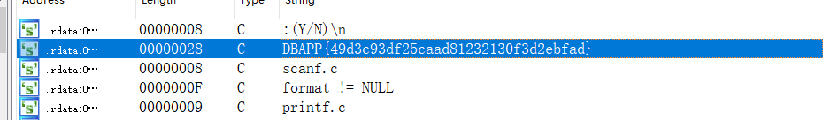

# BUUCTF-Reverse

- [easyre](#easyre)
- [reverse1](#reverse1)
- [reverse2](#reverse2)
- [内涵的软件](#内涵的软件)
- [新年快乐](#新年快乐)
- [xor](#xor)
## easyre

ExenifoPe查看是64位的，丢进ida64跑

shif+F12查看主函数发现flag

## reverse1

exenifope检查是64位的，丢ida64跑

shift+f12发现最后一行{hello_world}很可疑，点进去查看str2 x+tab

关键代码
```c++
  for ( j = 0; ; ++j )
  {
    v8 = j;
    v2 = j_strlen(Str2);
    if ( v8 > v2 )
      break;
    if ( Str2[j] == 111 )
      Str2[j] = 48;
  }
  sub_1400111D1("input the flag:");
  sub_14001128F("%20s", &Str1);
  v3 = j_strlen(Str2);
  if ( !strncmp(&Str1, Str2, v3) )
    sub_1400111D1("this is the right flag!\n");
  else
    sub_1400111D1("wrong flag\n");
  sub_14001113B(&v5, &unk_140019D00);
  return 0i64;
}
```

Str2是{hello_world},这里还有一次数据的变换：

```c++
  for ( j = 0; ; ++j )
  {
    v8 = j;
    v2 = j_strlen(Str2);
    if ( v8 > v2 )
      break;
    if ( Str2[j] == 111 )
      Str2[j] = 48;
  }
```

遍历Str2，111的ascii值为o，48的ascii值为0，也就是说把Str2的所有的o替换成0，所以最终flag是{hell0_w0rld}

## reverse2

64位的ELF文件,丢进ida64跑

shift+f12发现最后一行 hacking_for_fun}可疑 点进去x+tab 查看main

```c++
  pid = fork();
  if ( pid )
  {
    argv = (const char **)&stat_loc;
    waitpid(pid, &stat_loc, 0);
  }
  else
  {
    for ( i = 0; i <= strlen(&flag); ++i )
    {
      if ( *(&flag + i) == 105 || *(&flag + i) == 114 )
        *(&flag + i) = 49;
    }
  }
  printf("input the flag:", argv);
  __isoc99_scanf("%20s", &s2);
  if ( !strcmp(&flag, &s2) )
    result = puts("this is the right flag!");
  else
    result = puts("wrong flag!");
  return result;
}
```

关键代码：
```c++
    for ( i = 0; i <= strlen(&flag); ++i )
    {
      if ( *(&flag + i) == 105 || *(&flag + i) == 114 )
        *(&flag + i) = 49;
    }
```

遍历flag，将i和r 替换成1

flag{hack1ng_fo1_fun}

## 内涵的软件

图片有内涵，exe也可以有内涵，也许你等不到答案，赶快行动起来吧！！！ 注意：得到的 flag 请包上 flag{} 提交

32位程序，丢ida32跑



```c++
 v3 = 5;
  v2 = "DBAPP{49d3c93df25caad81232130f3d2ebfad}";
  while ( v3 >= 0 )
  {
    printf(aD, v3);
    sub_40100A();
    --v3;
  }
  printf(
    "\n"
    "\n"
    "\n"
    "这里本来应该是答案的,但是粗心的程序员忘记把变量写进来了,你要不逆向试试看:(Y/N)\n");
  v1 = 1;
  scanf("%c", &v1);
  if ( v1 == 89 )
  {
    printf(aOdIda);
    result = sub_40100A();
  }
  else
  {
    if ( v1 == 78 )
      printf(asc_425034);
    else
      printf("输入错误,没有提示.");
    result = sub_40100A();
  }
  return result;
}
```

flag{49d3c93df25caad81232130f3d2ebfad}

## 新年快乐

过年了要不做个逆向题庆祝一下新年？说不定会有惊喜哦！注意：flag并非是flag{XXX}形式，就是一个字符串，考验眼力的时候到了！ 注意：得到的 flag 请包上 flag{} 提交

eneinfope查看发现加了upx的壳，需要脱壳

`upx.exe -d 1.exe`

32位程序，打开ida32

```c++
  __main();
  strcpy(Str2, "HappyNewYear!");        // 将字符串复制给 Str2
  memset(Str1, 0, 32);
  printf("please input the true flag:");
  scanf("%s", Str1);                    // 用户输入的为 Str1
  if ( !strncmp(Str1, Str2, strlen(Str2)) )     // 如果 Str1 等于 Str2 则成功
    return puts("this is true flag!");
  else
    return puts("wrong!");
}
```

flag{HappyNewYear!}

## xor
or的敌人，and 有个兄弟叫or,or有个敌人叫xor，那么你能帮助or战胜他的敌人xor吗，xor的奥秘就在附件中，开始战斗吧！ 注意：得到的 flag 请包上 flag{} 提交