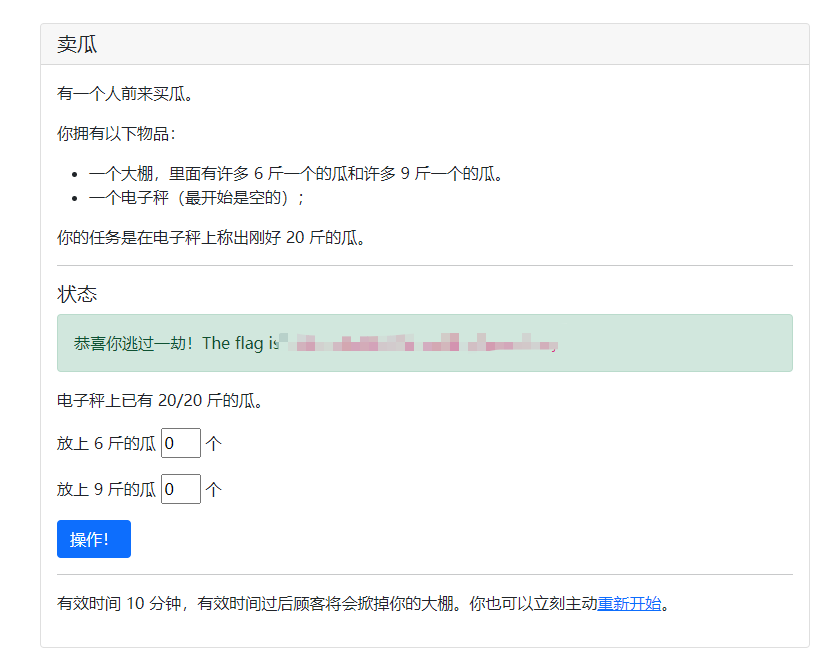
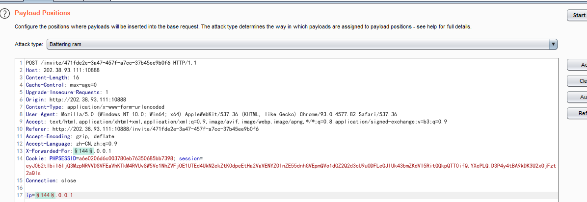

# 签到

http://202.38.93.111:10000/?page=1635000000

# 进制十六——参上

图片泄露十六进制，手打即可

# 卖瓜

是一道溢出题，超过20位就会变成负数

超过20位会变成负数
10000000000000000000

这里我是手动算的

4611686018427387648 会变成负数
4611686018427387647 会变成正数

都输入在6斤的瓜，会变成 -4096/20斤

也就是说

6x+9y = 4116
且x y必须为正整数

所以 x=2 y=456



## FLAG助力大红包

burpsuite 延时爆破+单个payload组爆破

必须为1.5秒一次，否则频率太快

需要伪造X-Forwarded-for：

256次A段爆破




## 猫咪问答

2019-04-21

5
https://lug.ustc.edu.cn/wiki/intro/

## 图之上的信息

可以通过__schema字段来向GraphQL查询哪些类型是可用的。
```
query={
  __schema {
    types {
      name
    }
  }
}

query=
{
  __type (name: "Query") {
    name
    fields {
      name
      type {
        name
        kind
        ofType {
          name
          kind
        }
      }
    }
  }
}
```