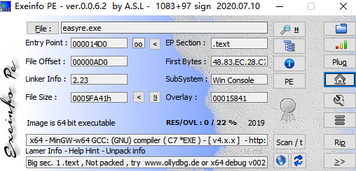

# CTF-Reverse

- [工具](#工具)
    - [查壳](#查壳)
        - [ExeinfoPe](#ExeinfoPe)
    - [脱壳加壳](#脱壳加壳)
        - [UPX](#UPX)
    - [反编译](#反编译)
        - [IDA](#IDA)
            - [常用快捷键](#常用快捷键)
        - [安卓](#安卓)
            - [AndroidKiller](#AndroidKiller)

## 工具

### 查壳
#### ExeinfoPe

Exeinfo PE是一个免费的查壳利器,基本上算是比较完整的万能查壳软件

支持查看加密程序的PE信息、编译信息、是否加壳、输入输出表、入口地址等信息

如图显示Image is 64 bit executable则用ida 64位打开
### 脱壳加壳
#### UPX

### 反编译

#### IDA

##### 常用快捷键

- shift+F12 显示字符串表
    - x点击选择，tab可查看伪代码
#### 安卓

##### AndroidKiller

Android Killer是一款可以对APK进行反编译的工具，它能够对反编译后的Smali文件进行修改，并将修改后的文件进行打包。