# 密码学-Crypher

> 文章作者 RyuZU & r0fus0d & Kite
## 大纲
- [密码学简介](#密码学简介)
- [计算机相关编码](#计算机相关编码)
    - [字母表编码](#字母表编码)
    - [ASCII编码](#ASCII编码)
    - [URL编码](#URL编码)
    - [Unicode编码](#Unicode编码)
    - [UTF-7编码](#UTF-7编码)
    - [摩斯电码](#摩斯电码)
    - [Base](#Base)
        - [base16](#base16)
        - [Base32](#Base32)
        - [base58](#base58)
        - [Base62](#Base62)
        - [Base64](#Base64)
        - [Base85](#Base85)
        - [base91](#base91)
        - [base92](#base92)
        - [base100](#base100)
    - [JSFUCK](#JSFUCK)
    - [UUencode](#UUencode)

- [现代密码](#现代密码)
    - [MD5](#MD5)
    - [DES](#DES)
    - [AES](#AES)
    - [RSA](#RSA)
        - [分解n](#分解n)
        - [公私钥分解](#公私钥分解)
        - [已知 e、p、q，求 d](#)
        - [已知 e、d、c ,求 m](#)
        - [已知e、p、q、密文c，求明文m](#)
        - [已知 e、n、密文 c，求明文 m](#)
        - [已知 e、n、c,由威尔逊定理得 pq 解 m](#)
        - [已知 e、n、c,求导得 pq 解 m](#)
        - [已知 e、d、p+q、(p+1)(q+1)、以及密文C，求明文m](#)
        - [已知 p、q、dp、dq、c 求明文 m (dp、dq 泄露)](#)
        - [已知 e1、e2、n (共模攻击) (模不互质)](#)
        - [共模攻击+base64隐写](#)
        - [已知 n、e、dp、c，求m (dp 泄露)](#)
        - [已知 public key、密文 c，求明文 m (公钥提取)](#)
        - [已知 n、e、c、p、q 批量求 m (n 分解) (Roll 按行加密)](#)
        - [e=3 (小公钥指数攻击) (小明文攻击) (tereotyped messages攻击)](#)
        - [已知 e、n，求 d (e极大) (Wiener’s Attack)](#)
        - [已知多个 n、c (中国剩余定理)](#)
        - [已知 n、质数相乘+1 (Pollard's p-1)](#)
        - [已知 p、n、c、e的范围,求 m](#)
        - [已知 c1、c2、n1、n2、e的范围 (同公钥（e，n）加密的密文、具有同 q 的公钥加密的密文)](#)
        - [已知 e、m1、m2、n、pq 接近 ,求原 m](#)
- [古典密码](#古典密码)
    - [单表代换加密](#单表代换加密)
        - [词频分析](#词频分析)
        - [凯撒密码](#凯撒密码)
        - [移位密码-变异凯撒](#移位密码-变异凯撒)
        - [ROT5/13/18/47](#ROT5/13/18/47)

    - [多表代换加密](#多表代换加密)
        - [playfair-普莱费尔密码](#playfair-普莱费尔密码)
        - [维吉尼亚密码-vigenere](#维吉尼亚密码-vigenere)

    - [其它类型加密](#其它类型加密)
        - [培根密码](#培根密码)
        - [栅栏密码](#栅栏密码)
        - [60甲子年表](#60甲子年表)
        - [传统猪圈密码](#传统猪圈密码)
        - [猪圈变种密码](#猪圈变种密码)
        - [古埃及象形文字](#古埃及象形文字)
        - [圣堂武士密码](#圣堂武士密码)
        - [标准银河字母](#标准银河字母)
        - [精灵语](#精灵语)
        - [福尔摩斯-跳舞的小人](#福尔摩斯-跳舞的小人)
        - [音符密码](#音符密码)
        - [敲击码](#敲击码)
        - [四方密码](#四方密码)
        - [Nihilist](#Nihilist)
        - [WingDing编码](#WingDing编码)

- [其它密码](#其它密码)
    - [Emoji表情编码](#Emoji表情编码)
    - [jjencode](#jjencode)
    - [aaencode](#aaencode)
    - [中文电码表](#中文电码表)
    - [五笔编码](#五笔编码)
    - [时间戳](#时间戳)
    - [手机键盘密码](#手机键盘密码)
    - [26键盘密码](#26键盘密码)
    - [希尔密码](#希尔密码)
    - [Rabbit解密](Rabbit解密)
    - [Quoted-printable编码](#Quoted-printable编码)
    - [UUencode](#UUencode)
    - [曼彻斯特编码](#曼彻斯特编码)
    - [brainfuck](#brainfuck)
    - [Ook](#Ook)
    - [Serpent](#Serpent)
    - [核心价值观编码](#核心价值观编码)
    - [盲文加密解密](#盲文加密解密)
    - [新约佛论禅](#新约佛论禅)
    - [DotCode点码](#DotCode点码)
    - [校验码](#校验码)
        - [奇偶校验码](#奇偶校验码)
        - [循环冗余码](#循环冗余码)
        - [海明校验码](#海明校验码)


- [数学](#数学)
    - [一元二次方程在线](#一元二次方程在线)

- [文章工具](#)
    - https://ctf-wiki.org/crypto/introduction/
    - https://wiki.ffffffff0x.com/1earn/security/crypto/crypto
    - https://zgjx6.github.io/2018/02/14/CTF%E5%AD%A6%E4%B9%A0%E7%AC%94%E8%AE%B0/
    - https://github.com/guyoung/CaptfEncoder

## 密码学简介

密码学（Cryptography）一般可分为古典密码学和现代密码学。

其中，古典密码学，作为一种实用性艺术存在，其编码和破译通常依赖于设计者和敌手的创造力与技巧，并没有对密码学原件进行清晰的定义。古典密码学主要包含以下几个方面：

- 单表替换加密（Monoalphabetic Cipher）
- 多表替换加密（Polyalphabetic Cipher）
- 奇奇怪怪的加密方式

现代密码学主要包含以下几个方面：

- 对称加密（Symmetric Cryptography），以 DES，AES，RC4 为代表。
- 非对称加密（Asymmetric Cryptography），以 RSA，ElGamal，椭圆曲线加密为代表。
- 哈希函数（Hash Function），以 MD5，SHA-1，SHA-512 等为代表。
- 数字签名（Digital Signature），以 RSA 签名，ElGamal 签名，DSA 签名为代表。

其中，对称加密体制主要分为两种方式：

- 分组密码（Block Cipher），又称为块密码。
- 序列密码（Stream Cipher），又称为流密码。

一般来说，密码设计者的根本目标是保障信息及信息系统的
- 机密性（Confidentiality）
- 完整性（Integrity）
- 可用性（Availability）
- 认证性（Authentication）
- 不可否认性（Non-repudiation）

一般来说，我们都会假设攻击者已知待破解的密码体制，而攻击类型通常分为以下四种：

- 唯密文攻击：只拥有密文
- 已知明文攻击：拥有密文与对应的明文
- 选择明文攻击：拥有加密权限，能够对明文加密后获得相应密文
- 选择密文攻击：拥有解密权限，能够对密文解密后获得相应明文
## 计算机相关编码

### 字母表编码

A-Z/a-z 对应 1-26 或者 0-25

ABCDEFGHIJKLMNOPQRSTUVWXYZ
### ASCII编码

ASCII 编码大致可以分作三部分组成:

- 第一部分是:ASCII 非打印控制字符;
- 第二部分是:ASCII 打印字符,也就是 CTF 中常用到的转换;
- 第三部分是:扩展 ASCII 打印字符.

我们一般使用的 ascii 编码的时候采用的都是可见字符，而且主要是如下字符

- 0-9, 48-57
- A-Z, 65-90
- a-z, 97-122

编码转换示例:
> 源文本: The quick brown fox jumps over the lazy dog

ASCII编码对应十进制:


> 84 104 101 32 113 117 105 99 107 32 98 114 111 119 110 32 102111 120 32 106 117 109 112 115 32 111 118 101 114 32 116104 101 32 108 97 122 121 32 100 111 103

对应可以转换成二进制,八进制,十六进制等.

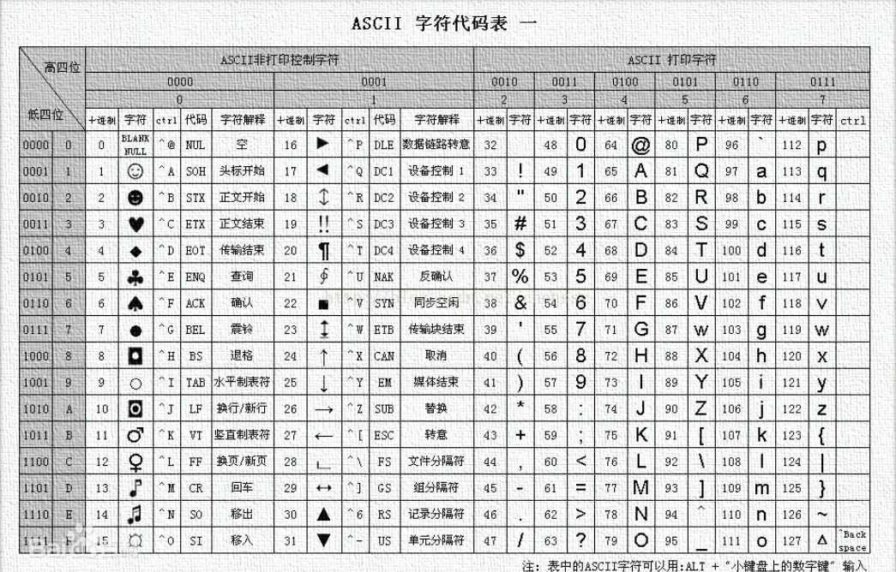

### URL编码

https://tool.chinaz.com/tools/urlencode.aspx

### Unicode编码

http://tool.chinaz.com/Tools/unicode.aspx
### UTF-7编码

TF-7 (7-位元 Unicode 转换格式（Unicode Transformation Format，简写成 UTF））是一种可变长度字符编码方式，用以将 Unicode 字符以 ASCII 编码的字符串来呈现，可以应用在电子邮件传输之类的应用。

例子：+AGYAbABhAGcAewBkAGgAYgBfADcAdABoAH0-

http://toolswebtop.com/text/process/decode/utf-7
### 摩斯电码

.. .-.. --- ...- . -.-- --- ..-

https://www.ip138.com/mosi/

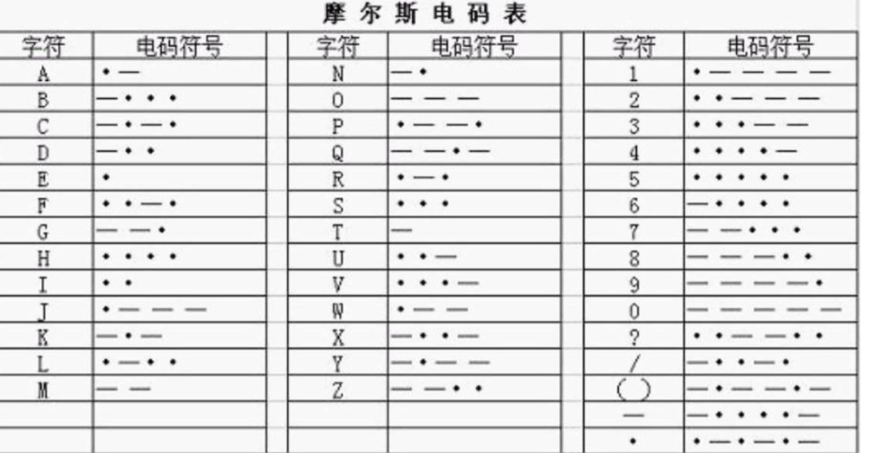

### Base

base64、base32、base16 可以分别编码转化8位字节为6位、5位、4位.16,32,64 分别表示用多少个字符来编码,这里我注重介绍 base64.Base64 常用于在通常处理文本数据的场合,表示、传输、存储一些二进制数据.包括 MIME 的 email,email via MIME,在 XML 中存储复杂数据.

编码原理:Base64 编码要求把3个8位字节转化为4个6位的字节,之后在6位的前面补两个0,形成8位一个字节的形式,6位2进制能表示的最大数是2的6次方是64,这也是为什么是64个字符(A-Z,a-z,0-9,+,/这64个编码字符,=号不属于编码字符,而是填充字符)的原因,这样就需要一张映射表,如下:

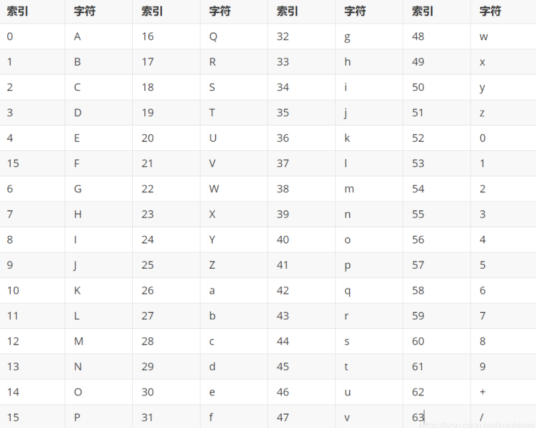


例子(base64):

```
源文本 : T h e
对应 ascii 码 : 84 104 101
8 位 binary : 01010100 01101000 01100101
6 位 binary : 010101 000110 100001 100101
高位补 0 : 000010101 00000110 00100001 00100101
对应 ascii 码 : 21 6 33 37
查表 : V G h l
```

工具：basecrack-4.0,可用于base64全家桶


```bash
python basecrack.py -b xxxx
```

```bash
python basecrack.py --magic
# 然后输入base编码
```

https://github.com/mufeedvh/basecrack

https://www.wishingstarmoye.com/tools/base64
#### Base16

Base16编码使用16个ASCII可打印字符（数字0-9和字母A-F）对任意字节数据进行编码。Base16先获取输入字符串每个字节的二进制值（不足8比特在高位补0），然后将其串联进来，再按照4比特一组进行切分，将每组二进制数分别转换成十进制，在下述表格中找到对应的编码串接起来就是Base16编码。可以看到8比特数据按照4比特切分刚好是两组，所以Base16不可能用到填充符号“=”。


base16 就是 hex

https://www.qqxiuzi.cn/bianma/base.php?type=16

#### Base32

base32和base64原理是一样的，32和64分别是`2^5`和`2^6`。
拿base32举例来说，每一个字符是有5Bit，但是ASCII字符有8Bit，所以base32是用8个base32字符来代替5个ASCII字符。


ToolsFx-1.8.0-jdk11 离线工具

https://www.qqxiuzi.cn/bianma/base.php 在线工具
http://tomeko.net/online_tools/base32.php

#### base58

http://www.metools.info/code/c74.html

#### base62
#### Base64

https://base64.us/
#### base85

http://www.atoolbox.net/Tool.php?Id=934

#### base91

#### base92

http://www.hiencode.com/base92.html

#### base100

### JSFUCK

F12-console

https://www.bugku.com/tools/jsfuck/#

https://utf-8.jp/public/jsfuck.html

https://github.com/aemkei/jsfuck


### UUencode

Uuencode是二进制信息和文字信息之间的转换编码，也就是机器和人眼识读的转换。

http://www.hiencode.com/uu.html
https://www.qqxiuzi.cn/bianma/uuencode.php
## 现代密码
### md5

https://www.somd5.com/

https://www.cmd5.com/
### DES

也可能是3DES

https://www.sojson.com/encrypt_triple_des.html

DES密文开头都是`U2FsdGVkX1`,解密需要密钥

### AES

http://www.jsons.cn/aesencrypt/
http://tool.chacuo.net/cryptaes

需要密钥

给了key(密码)和iv(偏移量)，AES加密
### RSA

#### 分解n

factordb - 在线分解质因数, 通常用于分解 n 得到 p q
http://www.factordb.com/

yafu - 离线分解工具

```
yafu "factor(82748279383502845283943271120712436408030814624973629060064917325126552245423)"
yafu-x64.exe "factor(@)" -batchfile 1.txt
```

#### 公私钥分解

在线网站
http://tool.chacuo.net/cryptrsakeyparse

有误报

本地：
>openssl rsa -pubin -text -modulus -in warmup -in public.key

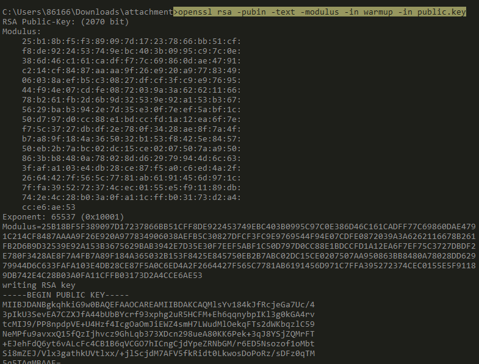

脚本：

```py
from Crypto.PublicKey import RSA
path = r'C:\public.key'
with open(path) as f:
key = RSA.import_key(f.read())
print('e = %d' % key.e)
print('n = %d' % key.n)
```
#### 已知 e、p、q，求 d

```py
import gmpy2
p = 473398607161
q = 4511491
e = 17
d = gmpy2.invert(e,(p-1)*(q-1))
print(d)
```

#### 已知 e、d、c ,求 m

例题 [NCTF2019]babyRSA

```py
from Crypto.Util.number import *
from flag import flag

def nextPrime(n):
    n += 2 if n & 1 else 1
    while not isPrime(n):
        n += 2
    return n

p = getPrime(1024)
q = nextPrime(p)
n = p * q
e = 0x10001
d = inverse(e, (p-1) * (q-1))
c = pow(bytes_to_long(flag.encode()), e, n)

# d = 19275778946037899718035455438175509175723911466127462154506916564101519923603308900331427601983476886255849200332374081996442976307058597390881168155862238533018621944733299208108185814179466844504468163200369996564265921022888670062554504758512453217434777820468049494313818291727050400752551716550403647148197148884408264686846693842118387217753516963449753809860354047619256787869400297858568139700396567519469825398575103885487624463424429913017729585620877168171603444111464692841379661112075123399343270610272287865200880398193573260848268633461983435015031227070217852728240847398084414687146397303110709214913
# c = 5382723168073828110696168558294206681757991149022777821127563301413483223874527233300721180839298617076705685041174247415826157096583055069337393987892262764211225227035880754417457056723909135525244957935906902665679777101130111392780237502928656225705262431431953003520093932924375902111280077255205118217436744112064069429678632923259898627997145803892753989255615273140300021040654505901442787810653626524305706316663169341797205752938755590056568986738227803487467274114398257187962140796551136220532809687606867385639367743705527511680719955380746377631156468689844150878381460560990755652899449340045313521804
```

题目给了 e,d,c三个值，所以由公式 ed=1 mod (q-1)(p-1) 得到 (ed-1)=k * (q-1)(p-1) (设k为整数)

分析题目可知 p,q 接近，p*q 为 2048 位，

所以 (p-1)*(q-1)<=2048 计算可知 e*d-1 是 2064 位的，所以K的取值范围为（pow(2,15),pow(2,16)）

通过爆破 K 的值，可以得到 (p-1)*(q-1) 的值，对 phi 开平方，进而求得 p,q。

```py
from gmpy2 import *
from sympy import *
from libnum import *

e = 0x10001
d = 19275778946037899718035455438175509175723911466127462154506916564101519923603308900331427601983476886255849200332374081996442976307058597390881168155862238533018621944733299208108185814179466844504468163200369996564265921022888670062554504758512453217434777820468049494313818291727050400752551716550403647148197148884408264686846693842118387217753516963449753809860354047619256787869400297858568139700396567519469825398575103885487624463424429913017729585620877168171603444111464692841379661112075123399343270610272287865200880398193573260848268633461983435015031227070217852728240847398084414687146397303110709214913
c = 5382723168073828110696168558294206681757991149022777821127563301413483223874527233300721180839298617076705685041174247415826157096583055069337393987892262764211225227035880754417457056723909135525244957935906902665679777101130111392780237502928656225705262431431953003520093932924375902111280077255205118217436744112064069429678632923259898627997145803892753989255615273140300021040654505901442787810653626524305706316663169341797205752938755590056568986738227803487467274114398257187962140796551136220532809687606867385639367743705527511680719955380746377631156468689844150878381460560990755652899449340045313521804

for k in range(pow(2,15),pow(2,16)):
    if (e*d-1)%k == 0:
        phi = (e*d-1)//k
        P1 = iroot(phi,2)[0]    #  对(q-1)*(p-1)开平方
        p = nextprime(P1)     # 获取素数P
        q_1 = phi//(p-1)      # 得到(q-1)
        q = q_1+1
        if(isprime(q)):       # 对q进行素性检测
                   break
'''
print(p,q)

p=143193611591752210918770476402384783351740028841763223236102885221839966637073188462808195974548579833368313904083095786906479416347681923731100260359652426441593107755892485944809419189348311956308456459523437459969713060653432909873986596042482699670451716296743727525586437248462432327423361080811225076497
q=143193611591752210918770476402384783351740028841763223236102885221839966637073188462808195974548579833368313904083095786906479416347681923731100260359652426441593107755892485944809419189348311956308456459523437459969713060653432909873986596042482699670451716296743727525586437248462432327423361080811225075839
'''
n=p*q
m = pow(c,d,n)
print(n2s(m))
```
#### 已知 e、n、密文 c，求明文 m

脚本1
```py
import gmpy2
import binascii

e = 65537
n = 1455925529734358105461406532259911790807347616464991065301847
c = 69380371057914246192606760686152233225659503366319332065009
#1.将n分解为p和q
p = 1201147059438530786835365194567
q = 1212112637077862917192191913841

phi = (p-1)*(q-1)
#2.求d
d = gmpy2.invert(e,phi)
#3.m=pow(c,d,n)
m = gmpy2.powmod(c,d,n)
print(binascii.unhexlify(hex(m)[2:]))
#binascii.unhexlify(hexstr):从十六进制字符串hexstr返回二进制数据
```

脚本2
```py
import gmpy2
from Crypto.Util.number import *
from binascii import a2b_hex,b2a_hex
import binascii

e = 65533

c = 27565231154623519221597938803435789010285480123476977081867877272451638645710
#1.将n分解为p和q
p = 262248800182277040650192055439906580479
q = 262854994239322828547925595487519915551
n = p*q

phi = (p-1)*(q-1)
#2.求d
d = gmpy2.invert(e,phi)
#3.m=pow(c,d,n)
m = gmpy2.powmod(c,d,n)
print(binascii.unhexlify(hex(m)[2:]))
#binascii.unhexlify(hexstr):从十六进制字符串hexstr返回二进制数据
```

#### 已知 e、n、c,由威尔逊定理得 pq 解 m

例题 [RoarCTF2019]babyRSA

```py
import sympy
import random

def myGetPrime():
    A= getPrime(513)
    print(A)
    B=A-random.randint(1e3,1e5)
    print(B)
    return sympy.nextPrime((B!)%A)
p=myGetPrime()
#A1=21856963452461630437348278434191434000066076750419027493852463513469865262064340836613831066602300959772632397773487317560339056658299954464169264467234407
#B1=21856963452461630437348278434191434000066076750419027493852463513469865262064340836613831066602300959772632397773487317560339056658299954464169264467140596

q=myGetPrime()
#A2=16466113115839228119767887899308820025749260933863446888224167169857612178664139545726340867406790754560227516013796269941438076818194617030304851858418927
#B2=16466113115839228119767887899308820025749260933863446888224167169857612178664139545726340867406790754560227516013796269941438076818194617030304851858351026

r=myGetPrime()

n=p*q*r
#n=85492663786275292159831603391083876175149354309327673008716627650718160585639723100793347534649628330416631255660901307533909900431413447524262332232659153047067908693481947121069070451562822417357656432171870951184673132554213690123308042697361969986360375060954702920656364144154145812838558365334172935931441424096270206140691814662318562696925767991937369782627908408239087358033165410020690152067715711112732252038588432896758405898709010342467882264362733
c=pow(flag,e,n)
#e=0x1001
#c=75700883021669577739329316795450706204502635802310731477156998834710820770245219468703245302009998932067080383977560299708060476222089630209972629755965140317526034680452483360917378812244365884527186056341888615564335560765053550155758362271622330017433403027261127561225585912484777829588501213961110690451987625502701331485141639684356427316905122995759825241133872734362716041819819948645662803292418802204430874521342108413623635150475963121220095236776428
#so,what is the flag?
```

解法
```py
from gmpy2 import*
from libnum import*
from Crypto.Util.number import*
from sympy import*

def get_p_q(A,B):
    tmp = 1
    for i in range(B+1,A-1):
        tmp *= i
        tmp %= A
    tmp_inv = invert(tmp,A)
    result = nextprime(tmp_inv)
    return result

A1=21856963452461630437348278434191434000066076750419027493852463513469865262064340836613831066602300959772632397773487317560339056658299954464169264467234407
B1=21856963452461630437348278434191434000066076750419027493852463513469865262064340836613831066602300959772632397773487317560339056658299954464169264467140596

A2=16466113115839228119767887899308820025749260933863446888224167169857612178664139545726340867406790754560227516013796269941438076818194617030304851858418927
B2=16466113115839228119767887899308820025749260933863446888224167169857612178664139545726340867406790754560227516013796269941438076818194617030304851858351026

n=85492663786275292159831603391083876175149354309327673008716627650718160585639723100793347534649628330416631255660901307533909900431413447524262332232659153047067908693481947121069070451562822417357656432171870951184673132554213690123308042697361969986360375060954702920656364144154145812838558365334172935931441424096270206140691814662318562696925767991937369782627908408239087358033165410020690152067715711112732252038588432896758405898709010342467882264362733
c=75700883021669577739329316795450706204502635802310731477156998834710820770245219468703245302009998932067080383977560299708060476222089630209972629755965140317526034680452483360917378812244365884527186056341888615564335560765053550155758362271622330017433403027261127561225585912484777829588501213961110690451987625502701331485141639684356427316905122995759825241133872734362716041819819948645662803292418802204430874521342108413623635150475963121220095236776428

p=get_p_q(A1,B1)
q=get_p_q(A2,B2)

r = n//p//q

phi = (p-1)*(q-1)*(r-1)

e=0x1001

d= invert(e,phi)

m= pow(c,int(d),n)
print(n2s(m))
```

#### 已知e、p、q、密文c，求明文m

```py
import gmpy2, libnum

c = 26308018356739853895382240109968894175166731283702927002165268998773708335216338997058314157717147131083296551313334042509806229853341488461087009955203854253313827608275460592785607739091992591431080342664081962030557042784864074533380701014585315663218783130162376176094773010478159362434331787279303302718098735574605469803801873109982473258207444342330633191849040553550708886593340770753064322410889048135425025715982196600650740987076486540674090923181664281515197679745907830107684777248532278645343716263686014941081417914622724906314960249945105011301731247324601620886782967217339340393853616450077105125391982689986178342417223392217085276465471102737594719932347242482670320801063191869471318313514407997326350065187904154229557706351355052446027159972546737213451422978211055778164578782156428466626894026103053360431281644645515155471301826844754338802352846095293421718249819728205538534652212984831283642472071669494851823123552827380737798609829706225744376667082534026874483482483127491533474306552210039386256062116345785870668331513725792053302188276682550672663353937781055621860101624242216671635824311412793495965628876036344731733142759495348248970313655381407241457118743532311394697763283681852908564387282605279108

p = 178449493212694205742332078583256205058672290603652616240227340638730811945224947826121772642204629335108873832781921390308501763661154638696935732709724016546955977529088135995838497476350749621442719690722226913635772410880516639651363626821442456779009699333452616953193799328647446968707045304702547915799734431818800374360377292309248361548868909066895474518333089446581763425755389837072166970684877011663234978631869703859541876049132713490090720408351108387971577438951727337962368478059295446047962510687695047494480605473377173021467764495541590394732685140829152761532035790187269724703444386838656193674253139
q = 184084121540115307597161367011014142898823526027674354555037785878481711602257307508985022577801782788769786800015984410443717799994642236194840684557538917849420967360121509675348296203886340264385224150964642958965438801864306187503790100281099130863977710204660546799128755418521327290719635075221585824217487386227004673527292281536221958961760681032293340099395863194031788435142296085219594866635192464353365034089592414809332183882423461536123972873871477755949082223830049594561329457349537703926325152949582123419049073013144325689632055433283354999265193117288252918515308767016885678802217366700376654365502867
e = 0x10001
d = gmpy2.invert(e, (p-1)*(q-1))

m = pow(c, d, p*q)
print(libnum.n2s(m))
```

exp2
```py
import gmpy2
import time
import sympy
from functools import reduce
from Crypto.Util.number import long_to_bytes

p=0x928fb6aa9d813b6c3270131818a7c54edb18e3806942b88670106c1821e0326364194a8c49392849432b37632f0abe3f3c52e909b939c91c50e41a7b8cd00c67d6743b4f

q=0xec301417ccdffa679a8dcc4027dd0d75baf9d441625ed8930472165717f4732884c33f25d4ee6a6c9ae6c44aedad039b0b72cf42cab7f80d32b74061

e=0x10001

c=0x70c9133e1647e95c3cb99bd998a9028b5bf492929725a9e8e6d2e277fa0f37205580b196e5f121a2e83bc80a8204c99f5036a07c8cf6f96c420369b4161d2654a7eccbdaf583204b645e137b3bd15c5ce865298416fd5831cba0d947113ed5be5426b708b89451934d11f9aed9085b48b729449e461ff0863552149b965e22b6
n=p*q
phi=(p-1)*(q-1)
d=gmpy2.invert(e,phi)
m=pow(c,d,n)
print(long_to_bytes(m))

```
#### 已知 e、n、c,求导得 pq 解 m

例题 [BJDCTF2020]easyrsa

```py
from Crypto.Util.number import getPrime,bytes_to_long
from sympy import Derivative
from fractions import Fraction
from secret import flag

p=getPrime(1024)
q=getPrime(1024)
e=65537
n=p*q
z=Fraction(1,Derivative(arctan(p),p))-Fraction(1,Derivative(arth(q),q))
m=bytes_to_long(flag)
c=pow(m,e,n)
print(c,z,n)
'''
output:
7922547866857761459807491502654216283012776177789511549350672958101810281348402284098310147796549430689253803510994877420135537268549410652654479620858691324110367182025648788407041599943091386227543182157746202947099572389676084392706406084307657000104665696654409155006313203957292885743791715198781974205578654792123191584957665293208390453748369182333152809882312453359706147808198922916762773721726681588977103877454119043744889164529383188077499194932909643918696646876907327364751380953182517883134591810800848971719184808713694342985458103006676013451912221080252735948993692674899399826084848622145815461035
32115748677623209667471622872185275070257924766015020072805267359839059393284316595882933372289732127274076434587519333300142473010344694803885168557548801202495933226215437763329280242113556524498457559562872900811602056944423967403777623306961880757613246328729616643032628964072931272085866928045973799374711846825157781056965164178505232524245809179235607571567174228822561697888645968559343608375331988097157145264357626738141646556353500994924115875748198318036296898604097000938272195903056733565880150540275369239637793975923329598716003350308259321436752579291000355560431542229699759955141152914708362494482
15310745161336895413406690009324766200789179248896951942047235448901612351128459309145825547569298479821101249094161867207686537607047447968708758990950136380924747359052570549594098569970632854351825950729752563502284849263730127586382522703959893392329333760927637353052250274195821469023401443841395096410231843592101426591882573405934188675124326997277775238287928403743324297705151732524641213516306585297722190780088180705070359469719869343939106529204798285957516860774384001892777525916167743272419958572055332232056095979448155082465977781482598371994798871917514767508394730447974770329967681767625495394441
'''
```

由加密脚本我们可以得到三个量的值,c,z,n

1.arctan (p)和 arth(q) ，求导后的值分别为 1/(1+p** 2) 和 1/(1-q** 2)
2.通过构造方程组 z=p** 2+q**2, n = p*q , 求出 pq 的值

```py
import gmpy2

e=65537
c=7922547866857761459807491502654216283012776177789511549350672958101810281348402284098310147796549430689253803510994877420135537268549410652654479620858691324110367182025648788407041599943091386227543182157746202947099572389676084392706406084307657000104665696654409155006313203957292885743791715198781974205578654792123191584957665293208390453748369182333152809882312453359706147808198922916762773721726681588977103877454119043744889164529383188077499194932909643918696646876907327364751380953182517883134591810800848971719184808713694342985458103006676013451912221080252735948993692674899399826084848622145815461035
z=32115748677623209667471622872185275070257924766015020072805267359839059393284316595882933372289732127274076434587519333300142473010344694803885168557548801202495933226215437763329280242113556524498457559562872900811602056944423967403777623306961880757613246328729616643032628964072931272085866928045973799374711846825157781056965164178505232524245809179235607571567174228822561697888645968559343608375331988097157145264357626738141646556353500994924115875748198318036296898604097000938272195903056733565880150540275369239637793975923329598716003350308259321436752579291000355560431542229699759955141152914708362494482
n=15310745161336895413406690009324766200789179248896951942047235448901612351128459309145825547569298479821101249094161867207686537607047447968708758990950136380924747359052570549594098569970632854351825950729752563502284849263730127586382522703959893392329333760927637353052250274195821469023401443841395096410231843592101426591882573405934188675124326997277775238287928403743324297705151732524641213516306585297722190780088180705070359469719869343939106529204798285957516860774384001892777525916167743272419958572055332232056095979448155082465977781482598371994798871917514767508394730447974770329967681767625495394441

p=(gmpy2.iroot(z+2*n,2)[0]+gmpy2.iroot(z-2*n,2)[0])//2
print(n%p==0)
q=n//p
d=gmpy2.invert(e,(p-1)*(q-1))
m=gmpy2.powmod(c,d,n)
import binascii
print(binascii.unhexlify(hex(m)[2:]))
```

#### 已知 e、d、p+q、(p+1)(q+1)、以及密文C，求明文m

n = (p+1)*(q+1) - (p+q) - 1

```
p+q : 0x1232fecb92adead91613e7d9ae5e36fe6bb765317d6ed38ad890b4073539a6231a6620584cea5730b5af83a3e80cf30141282c97be4400e33307573af6b25e2ea
(p+1)(q+1) : 0x5248becef1d925d45705a7302700d6a0ffe5877fddf9451a9c1181c4d82365806085fd86fbaab08b6fc66a967b2566d743c626547203b34ea3fdb1bc06dd3bb765fd8b919e3bd2cb15bc175c9498f9d9a0e216c2dde64d81255fa4c05a1ee619fc1fc505285a239e7bc655ec6605d9693078b800ee80931a7a0c84f33c851740
e : 0xe6b1bee47bd63f615c7d0a43c529d219
d : 0x2dde7fbaed477f6d62838d55b0d0964868cf6efb2c282a5f13e6008ce7317a24cb57aec49ef0d738919f47cdcd9677cd52ac2293ec5938aa198f962678b5cd0da344453f521a69b2ac03647cdd8339f4e38cec452d54e60698833d67f9315c02ddaa4c79ebaa902c605d7bda32ce970541b2d9a17d62b52df813b2fb0c5ab1a5
enc_flag : 0x50ae00623211ba6089ddfae21e204ab616f6c9d294e913550af3d66e85d0c0693ed53ed55c46d8cca1d7c2ad44839030df26b70f22a8567171a759b76fe5f07b3c5a6ec89117ed0a36c0950956b9cde880c575737f779143f921d745ac3bb0e379c05d9a3cc6bf0bea8aa91e4d5e752c7eb46b2e023edbc07d24a7c460a34a9a
```


```py
import libnum
a = 0x1232fecb92adead91613e7d9ae5e36fe6bb765317d6ed38ad890b4073539a6231a6620584cea5730b5af83a3e80cf30141282c97be4400e33307573af6b25e2ea
b = 0x5248becef1d925d45705a7302700d6a0ffe5877fddf9451a9c1181c4d82365806085fd86fbaab08b6fc66a967b2566d743c626547203b34ea3fdb1bc06dd3bb765fd8b919e3bd2cb15bc175c9498f9d9a0e216c2dde64d81255fa4c05a1ee619fc1fc505285a239e7bc655ec6605d9693078b800ee80931a7a0c84f33c851740
e = 0xe6b1bee47bd63f615c7d0a43c529d219
d = 0x2dde7fbaed477f6d62838d55b0d0964868cf6efb2c282a5f13e6008ce7317a24cb57aec49ef0d738919f47cdcd9677cd52ac2293ec5938aa198f962678b5cd0da344453f521a69b2ac03647cdd8339f4e38cec452d54e60698833d67f9315c02ddaa4c79ebaa902c605d7bda32ce970541b2d9a17d62b52df813b2fb0c5ab1a5
c= 0x50ae00623211ba6089ddfae21e204ab616f6c9d294e913550af3d66e85d0c0693ed53ed55c46d8cca1d7c2ad44839030df26b70f22a8567171a759b76fe5f07b3c5a6ec89117ed0a36c0950956b9cde880c575737f779143f921d745ac3bb0e379c05d9a3cc6bf0bea8aa91e4d5e752c7eb46b2e023edbc07d24a7c460a34a9a

n = b-a-1

m = pow(c,d,n)

print(libnum.n2s(m))  #（n2s将数值转化为字符串）
```

#### 已知 p、q、dp、dq、c 求明文 m (dp、dq 泄露)

dp、dq含义

dp=d%(p-1)
dq=d%(q-1)

```py
p = 8637633767257008567099653486541091171320491509433615447539162437911244175885667806398411790524083553445158113502227745206205327690939504032994699902053229
q = 12640674973996472769176047937170883420927050821480010581593137135372473880595613737337630629752577346147039284030082593490776630572584959954205336880228469
dp = 6500795702216834621109042351193261530650043841056252930930949663358625016881832840728066026150264693076109354874099841380454881716097778307268116910582929
dq = 783472263673553449019532580386470672380574033551303889137911760438881683674556098098256795673512201963002175438762767516968043599582527539160811120550041
c = 24722305403887382073567316467649080662631552905960229399079107995602154418176056335800638887527614164073530437657085079676157350205351945222989351316076486573599576041978339872265925062764318536089007310270278526159678937431903862892400747915525118983959970607934142974736675784325993445942031372107342103852

import gmpy2
I = gmpy2.invert(q,p)
mp = pow(c,dp,p)
mq = pow(c,dq,q)               #求幂取模运算

m = (((mp-mq)*I)%p)*q+mq       #求明文公式

print(hex(m))                  #转为十六进制
```
然后得到的十六进制hex为字符即可。


#### 已知 e1、e2、n (共模攻击) (模不互质)

如果在 RSA 的使用中使用了相同的模 n 对相同的明文 m 进行了加密，那么就可以在不分解 n 的情况下还原出明文 m 的值。

出现两个加密使用相同的模，可以在不知道私钥的情况下得到明文，这就是RSA中的共模攻击。

```py
from gmpy2 import invert
# 欧几里得算法
def egcd(a, b):
  if a == 0:
    return (b, 0, 1)
  else:
    g, y, x = egcd(b % a, a)
    return (g, x - (b // a) * y, y)

def main():
  n = 22708078815885011462462049064339185898712439277226831073457888403129378547350292420267016551819052430779004755846649044001024141485283286483130702616057274698473611149508798869706347501931583117632710700787228016480127677393649929530416598686027354216422565934459015161927613607902831542857977859612596282353679327773303727004407262197231586324599181983572622404590354084541788062262164510140605868122410388090174420147752408554129789760902300898046273909007852818474030770699647647363015102118956737673941354217692696044969695308506436573142565573487583507037356944848039864382339216266670673567488871508925311154801
  c1 = 22322035275663237041646893770451933509324701913484303338076210603542612758956262869640822486470121149424485571361007421293675516338822195280313794991136048140918842471219840263536338886250492682739436410013436651161720725855484866690084788721349555662019879081501113222996123305533009325964377798892703161521852805956811219563883312896330156298621674684353919547558127920925706842808914762199011054955816534977675267395009575347820387073483928425066536361482774892370969520740304287456555508933372782327506569010772537497541764311429052216291198932092617792645253901478910801592878203564861118912045464959832566051361
  c2 = 18702010045187015556548691642394982835669262147230212731309938675226458555210425972429418449273410535387985931036711854265623905066805665751803269106880746769003478900791099590239513925449748814075904017471585572848473556490565450062664706449128415834787961947266259789785962922238701134079720414228414066193071495304612341052987455615930023536823801499269773357186087452747500840640419365011554421183037505653461286732740983702740822671148045619497667184586123657285604061875653909567822328914065337797733444640351518775487649819978262363617265797982843179630888729407238496650987720428708217115257989007867331698397
  e1 = 11187289
  e2 = 9647291
  s = egcd(e1, e2)
  s1 = s[1]
  s2 = s[2]
  # 求模反元素
  if s1<0:
    s1 = - s1
    c1 = invert(c1, n)
  elif s2<0:
    s2 = - s2
    c2 = invert(c2, n)

  m = pow(c1,s1,n)*pow(c2,s2,n) % n
  print(m)

if __name__ == '__main__':
  main()
```


结果转16进制得到 flag

例题 [BJDCTF2020]rsa_output

```
{21058339337354287847534107544613605305015441090508924094198816691219103399526800112802416383088995253908857460266726925615826895303377801614829364034624475195859997943146305588315939130777450485196290766249612340054354622516207681542973756257677388091926549655162490873849955783768663029138647079874278240867932127196686258800146911620730706734103611833179733264096475286491988063990431085380499075005629807702406676707841324660971173253100956362528346684752959937473852630145893796056675793646430793578265418255919376323796044588559726703858429311784705245069845938316802681575653653770883615525735690306674635167111,2767}

{21058339337354287847534107544613605305015441090508924094198816691219103399526800112802416383088995253908857460266726925615826895303377801614829364034624475195859997943146305588315939130777450485196290766249612340054354622516207681542973756257677388091926549655162490873849955783768663029138647079874278240867932127196686258800146911620730706734103611833179733264096475286491988063990431085380499075005629807702406676707841324660971173253100956362528346684752959937473852630145893796056675793646430793578265418255919376323796044588559726703858429311784705245069845938316802681575653653770883615525735690306674635167111,3659}

message1=20152490165522401747723193966902181151098731763998057421967155300933719378216342043730801302534978403741086887969040721959533190058342762057359432663717825826365444996915469039056428416166173920958243044831404924113442512617599426876141184212121677500371236937127571802891321706587610393639446868836987170301813018218408886968263882123084155607494076330256934285171370758586535415136162861138898728910585138378884530819857478609791126971308624318454905992919405355751492789110009313138417265126117273710813843923143381276204802515910527468883224274829962479636527422350190210717694762908096944600267033351813929448599

message2=11298697323140988812057735324285908480504721454145796535014418738959035245600679947297874517818928181509081545027056523790022598233918011261011973196386395689371526774785582326121959186195586069851592467637819366624044133661016373360885158956955263645614345881350494012328275215821306955212788282617812686548883151066866149060363482958708364726982908798340182288702101023393839781427386537230459436512613047311585875068008210818996941460156589314135010438362447522428206884944952639826677247819066812706835773107059567082822312300721049827013660418610265189288840247186598145741724084351633508492707755206886202876227
```

```py
import gmpy2, libnum

def exgcd(a, b):
    if b==0: return 1, 0
    x, y = exgcd(b, a%b)
    return y, x-a//b*y

n = 21058339337354287847534107544613605305015441090508924094198816691219103399526800112802416383088995253908857460266726925615826895303377801614829364034624475195859997943146305588315939130777450485196290766249612340054354622516207681542973756257677388091926549655162490873849955783768663029138647079874278240867932127196686258800146911620730706734103611833179733264096475286491988063990431085380499075005629807702406676707841324660971173253100956362528346684752959937473852630145893796056675793646430793578265418255919376323796044588559726703858429311784705245069845938316802681575653653770883615525735690306674635167111
e1 = 2767
c1 = 20152490165522401747723193966902181151098731763998057421967155300933719378216342043730801302534978403741086887969040721959533190058342762057359432663717825826365444996915469039056428416166173920958243044831404924113442512617599426876141184212121677500371236937127571802891321706587610393639446868836987170301813018218408886968263882123084155607494076330256934285171370758586535415136162861138898728910585138378884530819857478609791126971308624318454905992919405355751492789110009313138417265126117273710813843923143381276204802515910527468883224274829962479636527422350190210717694762908096944600267033351813929448599
e2 = 3659
c2 = 11298697323140988812057735324285908480504721454145796535014418738959035245600679947297874517818928181509081545027056523790022598233918011261011973196386395689371526774785582326121959186195586069851592467637819366624044133661016373360885158956955263645614345881350494012328275215821306955212788282617812686548883151066866149060363482958708364726982908798340182288702101023393839781427386537230459436512613047311585875068008210818996941460156589314135010438362447522428206884944952639826677247819066812706835773107059567082822312300721049827013660418610265189288840247186598145741724084351633508492707755206886202876227

a, b = exgcd(e1, e2)
m = gmpy2.powmod(c1, a, n) * gmpy2.powmod(c2, b, n) % n
print(libnum.n2s(m))
```

#### 共模攻击+base64隐写

例题 RSA & what

HUB1
```
785095419718268286866508214304816985447077293766819398728046411166917810820484759314291028976498223661229395009474063173705162627037610993539617751905443039278227583504604808251931083818909467613277587874545761074364427549966555519371913859875313577282243053150056274667798049694695703660313532933165449312949725581708965417273055582216295994587600975970124811496270080896977076946000102701030260990598181466447208054713391526313700681341093922240317428173599031624125155188216489476825606191521182034969120343287691181300399683515414809262700457525876691808180257730351707673660380698973884642306898810000633684878715402823143549139850732982897459698089649561190746850698130299458080255582312696873149210028240898137822888492559957665067936573356367589784593119016624072433872744537432005911668494455733330689385141214653091888017782049043434862620306783436169856564175929871100669913438980899219579329897753233450934770193915434791427728636586218049874617231705308003720066269312729135764175698611068808404054125581540114956463603240222497919384691718744014002554201602395969312999994159599536026359879060218056496345745457493919771337601177449899066579857630036350871090452649830775029695488575574985078428560054253180863725364147
1697

412629526163150748619328091306742267675740578011800062477174189782151273970783531227579758540364970485350157944321579108232221072397135934034064481497887079641131808838242743811511451355024436983050572020925065644355566434625618133203024215941534926113892937988520918939061441606915556516246057349589921494351383160036280826024605351878408056180907759973804117263002554923041750587548819746346813966673034182913325507826219961923932100526305289894965216608254252188398580139545189681875824089456195044984585824938384521905334289906422454152976834867304693292466676355760173232407753256256317546190171995276258924613533179898467683358934751999655196790168438343198229183747091108262988777659858609744709324571850262293294975336628234767258858873839342596887193772615000676401522431518310648303975593582965021189182246986957349253156736526071639973844039068996404290548474640668851856078201093335425412842295604919065487301340901573809617549185106072798799159726375235125260509158832996701927878713084753334549129580912412168594170659605421750204835970231909591063407612779337478065175988365401590396247576709343727196106058477166945670117868989025903023998142850338956985816131805349549059377047477131270847579095628384569645636821650
494644347943710545224678831941589086572700792465459558770782213550069709458568349686998660541810166872034041584767487150140111151788221460027897193248273461607411027815984883969396220626358625041781558277804930212654296704055890683796941327712758797770820006623289146990000114915293539639766846910274034245607746230740851938158390562286057002223177609606376329007676845450142537930798148258428701466415483232670659815791064681384406494388237742330786225557303988025468036820082959712050733095860546860468575857084616069132051094882919253745234762029759124776348047587755897123575123506976140900565238840752841856713613368250071926171873213897914794115466890719123299469964019450899291410760762179836946570945555295288184698184555018368687708432612286248476073758067175481771199066581572870175460016017100414479346437034291784837132240891321931601494414908927713208448927221095745802380014441841139882391378410438764884597938773868771896252329517440068673532468372840830510218585255432000690265226016573313570977945083879214961394087065558376158826938257664840570952233832852869328785568175434516247720356520242602299510374317488182738732700078879665745909603766482100138001417023680647717824323143388857817595766172152883484274718248
152942283599728307168144137370127212672611894072038732126041098102628831053000986759260271210671922070555948023688596575415822984026159010574404359474670428678518262175033880513984372909748992727828381694416776740981021730545374002974037896534944567124543272737618380646771071804878796585983783360553761828325817820260204820004421979881871027255562690952334900616675606524933557440263648233514757200263521499508373975003431306847453046714027687108396945719803444444954079308404947126216395526551292104722047878178373207886033071857277857997932255251315982837892164421298202073945919187779856785892717251746704537315003771369737854896595170485152591013676942418134278534037654467840633528916812275267230155352077736583130992587670941654695382287023971261529987384520843829695778029311786431227409189019205818351911572757145556993606643464336196802350204616056286497246016800105003143046120608673496196758720552776772796609670537056331996894322779267635281472481559819839042424017171718303214059720568484939239370144038161541354254182769979771948759413102933987773401644506930205164891773826513161783736386604783484446345744957119469799231796368324927570694496679453313927562345656690240414624431304646248599226046524702364131095964335
79717988936247951265489157583697956031893477858854186991051529161879478488281744062318600470906120960002282886511477294555606503083169449335174864424180701080203993329996226566203834693869525797695969610065991941396723959032680019082506816443041598300477625793433080664346470586416385854692124426348587211026568667694805849554780794033764714016521711467557284846737236374990121316809833819996821592832639024026411520407330206281265390130763948165694574512140518775603040182029818771866749548761938870605590174330887949847420877829240131490902432602005681085180807294176837646062568094875766945890382971790015490163385088144673549085079635083262975154206269679142412897438231719704933258660779310737302680265445437771977749959110744959368586293082016067927548564967400845992380076107522755566531760628823374519718763740378295585535591752887339222947397184116326706799921515431185636740825707782742373783475781052674257292910213843986132987466810027275052416774693363446184518901899202502828670309452622347532932678874990809930682575738653876289384151496807194146308614368821006660626870989784697045160231069428458961107751207771093777394616856305293335603892178327520756554333365975114235981173451368131680404850832773147333013716920
123111353650401158556639983459870663057297871992927053886971224773529636525110628183715748795987525113177540092814119928708272290370336537110381023134637759740716140969662183269370676630325583385284994943164692397459103195434968057377474610500216801375394703781249039351368816958227409657934091741509357152328382960684515093945552479461382281913961956745154260686029997827565075768703774895750561575155143606297116391666385705899138085693913246313778033627210312268959737394553510894720099165193981333775907531107232556909478156441457899797515694348816961762796703443502856101079430585547997496001098926600499728389113862894833789669213630332988693669889340482430613291490613803204484751470676686041002772556117213612152322606737150858116122936539131795111263513114569794532805886643087299918196635113037777138666914296986040549274559835214505300618256105508764026461518876579387159881983544667258537064954616097750399839661065797883103731694314852301848272092388637114950059216922969842082648527035538090054093890365647676119748995243416337805666557501345234056968476142608491830438065401219751688687373709390057521910942736632126729711606256158399963682990881473178216060827021373776598901281958527655543318413664277921492723185984
36869806815936046911848195817405817350259890871483063184373728397968909458432625046025376290214729914038387534731762237978339011724858818860181178811639468996206294711495853807311240013786226884265118119546377272154555615363105236192878292703331473547623021744317034819416624562896226194523639793573028006666236271812390759036235867495803255905843636447252225413871038762657801345647584493917576263471587347202664391908570140389126903204602391093990827188675090199750617303773574821926387194478875191828814971296674530519321530805302667925998711835019806761133078403281404889374663875077339168901297819436499920958268483684335998301056068380228873524800383911402490807139268964095165069610454677558808756444381542173782815227920906224931028457073652453777424387873533280455944646592996920617956675786286711447540353883400282402551158169958389450168079568459656526911857835375748015814860506707921852997096156275804955989964215077733621769938075413007804223217091604613132253046399456747595300404564172224333936405545921819654435437072133387523533568472443532200069133022979195685683508297337961701169394794966256415112246587706103819620428258245999539040721929317130088874161577093962579487428358736401687123174207198251449851429295
```

HUB2
```
785095419718268286866508214304816985447077293766819398728046411166917810820484759314291028976498223661229395009474063173705162627037610993539617751905443039278227583504604808251931083818909467613277587874545761074364427549966555519371913859875313577282243053150056274667798049694695703660313532933165449312949725581708965417273055582216295994587600975970124811496270080896977076946000102701030260990598181466447208054713391526313700681341093922240317428173599031624125155188216489476825606191521182034969120343287691181300399683515414809262700457525876691808180257730351707673660380698973884642306898810000633684878715402823143549139850732982897459698089649561190746850698130299458080255582312696873149210028240898137822888492559957665067936573356367589784593119016624072433872744537432005911668494455733330689385141214653091888017782049043434862620306783436169856564175929871100669913438980899219579329897753233450934770193915434791427728636586218049874617231705308003720066269312729135764175698611068808404054125581540114956463603240222497919384691718744014002554201602395969312999994159599536026359879060218056496345745457493919771337601177449899066579857630036350871090452649830775029695488575574985078428560054253180863725364147
599

592169079372093727306100216011395857825646323934289480976073629037543922902098120901138454462177159996376654176248238979132528728327590301098966139983157980612320563496546128644967731000716697705104079039156276714872147463350811303393260622707024952543509891692246246277965823414460326811240048060543656588688604452353899779068825120910282167004715339763187734797180326976132213325054697165320479166356562518029805927741656605174809726397565772271562066078076105491745903986597877400370206718954975288721072048333678609055008135809089304229015364348490924974097403734627265297637171818849461766523691595241613878709865506436588268999163342945070495338153600520537498539457396582804692959296612715752573140296135784933206146091436617979599749774330699946637591406356289409716084034451049094715202196203486088368791744107629271647320273259836915312794297246589501008666299165717722507702866033454215783240025504356157664454861755286285777763585177751796252655008206383024707883077513745863312079349790275094080707502392866946325796914450602264462588722052297430827681750827349094323968337670311272933785838850649376115667223821665435911506351891489985627506615492005617098615432522564204152887767244129985681083657783356557756654335186
373940646416832740878733255707567753033716583448402000789202767511920210382830343955553654111486728333980557319799362514960627879016797491389812007768832730979916230647641872759001906846747977631675704310179448857128160385701185892914523053669366534408863734305635222625590986006420486092550427301086984563126480814987024980594613542978310129247678826691418335300577577527951623696426435497835228167084738007750914270251001921329521479047662848650808989996085600197309361410863238526802127877523767262921515150984998560136647154865791163316503073285223966216441025637452229043510097323724381056976302288136843260163922706692913035222445496716008888946581535004546355744211680390731257309941902587303353139951102244865270295414474488798335404630458489706639805186573874814586736746232358849677477533671968344154242963289415569487579895910660999043578737461300406937828924818002658292769882181668784501439254131996848948120781562158861495883827848139425862249576454689133681009549361314460818658995959098228995702202268649635363105549975932395335076521137604288520082040121286614922986554652700056148966514178935952363036963217619879899671383604638416567950421350546204434902113156720006282720889591288850271076074941927715678306057176
527630926460622936571385649841758214453416849039412401087443444317101857090904711485538107058823056085840539073345920792871368232355475394571098380596835468509997340505604333730547799560998822989747473780307779717715522787724471724766494090783971030594671013168209717686720448579582618378459567979027822271918653169622428153856198907810040224340270362413432495029672123261375400927159831537760709974778708160583252613784358234858583174544777979242887938827573604837766801998381379999076416444683891078093889686055482709838668356120916040352123019019255084513769603803814947774554028717814638951416291274696771515474086351482107953150253616922787262398450376249126999644026382478413080973933173079111305142716133389111399235545279259017424722601848670061556859163943895466553927946412523750166582734005733378328468250568944945912238495877929717101722314678120172228493787964904072583905721074766711732215815561012960394537195757832959268603775112932862105945720853959285187521763557915356428113876893276879775603217718981852114599706699524551973934242045743122744146361596971245034059345915315495232135483464496114770357536576200511490922413208178149869347802988786513451486411409887164516065062084917556120712465074206435831498113605
8786437178698940322877889807009957616777351844979869726962356553244050911283984280960665761649310895230455072977431415102053987735969326553978994853162483051544656873294555116009995592043183070208706258164840540599577072097104139505857517663273929851202628854185356185647194933800084230503413037858893307713037149307477830536758283681093517617820169181420796105338681582230788318108428132051793761014952837330456262272828627355701464740578197966332613127307037255647286823496355917642353327912440019621838870388091824748629637425759125214639885130163183752378908729773517053259212525494555880921052679512582051516604297098204363525081039382358483926727008679327719083138865969291911863630382097160230960738043575559330264018212774424527719153248563876760067931499029384228993253862501939337758514377472011933279273181144830381169849387893799390755052093069179605579485710343655570028592595882436632426527654452895431758715126580164902410286422637215098476316042367916779431052267545769495994723721129943616294879642305545894912914632980455031755879087401575310699765408473606166727137934224515998416625122213056208800095077933103150699272650116151674702438463062734472714004926103668378506804002740045547964716693536349447660850580
205314962204511500352858372254132533167549960825498949618514841570703199264867431580754674275990554478140637041427842111391746883257447120035947621456863890934062044010795443059281736346976175772415034838334682726635263432655537852942177334888025283748611576171534251461847349566505628290587224150869640386437623371249743165260396675220683302142805646368906930575140628610003919131999295855501215111393294818218799982703289304596989070475000081175510085432290264502023736899104746316830742226946395027029820825791831870857382647221322734605026210073093918331247494307555600335550942340526536281372036612138713881098866303169425501998978400008829873080965592009371176208668290074288903681417933657472279670688597862835627506340169978450918788539270346340385928840299573889292189531738082166408734046381423516467694328971385421907314814283489322619386570046183556572383980777277173349209330683424343658179781015072259378576130442222984963071166207642585589822061597282467850868050737957726423713761694231879497037175627546427449730638216214828463003483408928375620315193290871300316930139260521382533279767663839278693750409419493280753368451508802658272220767624766390639285308433607255253282702383762149755935518922075584637512494819
271453634732502613378948161256470991260052778799128789839624515809143527363206813219580098196957510291648493698144497567392065251244844074992734669490296293997386198359280316655904691639367482203210051809125904410431506925238374843856343243276508280641059690938930957474434518308646618959004216831130099873532714372402117796666560677624822509159287675432413016478948594640872091688482149004426363946048517480052906306290126242866034249478040406351940088231081456109195799442996799641647167552689564613346415247906852055588498305665928450828756152103096629274760601528737639415361467941349982213641454967962723875032638267311935042334584913897338553953961877439389588793074211502597238465542889335363559052368180212013206172712561221352833891640659020253527584706465205486408990762759230842192028381048563437724528409174790022752557512795782713125166158329880702730769957185428522011430144840232256419113631679343171680631630775266488738173707357123139368825087043785842169049943237537188129367275730984789479909103397937113837824575137021012333461552176687570010445744268373840742899299977372834041925102853718964831225250407279578465008537542659673685686242773379131904890865110699190451534445434533919127658976874721029586168106207
```

```py
from Crypto.Util.number import bytes_to_long, getPrime
from random import randint
from gmpy2 import powmod

p = getPrime(2048)
q = getPrime(2048)
N = p*q
Phi = (p-1)*(q-1)
def get_enc_key(N,Phi):
    e = getPrime(N)
    if Phi % e == 0:
        return get_enc_key(N, Phi)
    else:
        return e
e1 = get_enc_key(randint(10, 12), Phi)
e2 = get_enc_key(randint(10, 12), Phi)

fr = open(r"./base64", "rb")  #flag 被 base64
f1 = open(r"./HUB1", "wb")
f2 = open(r"./HUB2", "wb")
base64 = fr.read(255)
f1.write("%d\n%d\n" % (N, e1))  # HUB1 和 HUB2 文件中的是模 N 和私钥 e
f2.write("%d\n%d\n" % (N, e2))  # HUB1 和 HUB2 文件中的是模 N 和私钥 e
while len(base64)>0:            # 共模攻击
    pt = bytes_to_long(base64)
    ct1 = powmod(pt, e1, N)
    ct2 = powmod(pt, e2, N)
    f1.write("\n%d" % ct1)
    f2.write("\n%d" % ct2)
    base64 = fr.read(255)
fr.close()
f1.close()
f2.close()
```

```py
from gmpy2 import*
from libnum import*
from Crypto.Util.number import*
import base64
import binascii

N =785095419718268286866508214304816985447077293766819398728046411166917810820484759314291028976498223661229395009474063173705162627037610993539617751905443039278227583504604808251931083818909467613277587874545761074364427549966555519371913859875313577282243053150056274667798049694695703660313532933165449312949725581708965417273055582216295994587600975970124811496270080896977076946000102701030260990598181466447208054713391526313700681341093922240317428173599031624125155188216489476825606191521182034969120343287691181300399683515414809262700457525876691808180257730351707673660380698973884642306898810000633684878715402823143549139850732982897459698089649561190746850698130299458080255582312696873149210028240898137822888492559957665067936573356367589784593119016624072433872744537432005911668494455733330689385141214653091888017782049043434862620306783436169856564175929871100669913438980899219579329897753233450934770193915434791427728636586218049874617231705308003720066269312729135764175698611068808404054125581540114956463603240222497919384691718744014002554201602395969312999994159599536026359879060218056496345745457493919771337601177449899066579857630036350871090452649830775029695488575574985078428560054253180863725364147
e2 = 599
c21=592169079372093727306100216011395857825646323934289480976073629037543922902098120901138454462177159996376654176248238979132528728327590301098966139983157980612320563496546128644967731000716697705104079039156276714872147463350811303393260622707024952543509891692246246277965823414460326811240048060543656588688604452353899779068825120910282167004715339763187734797180326976132213325054697165320479166356562518029805927741656605174809726397565772271562066078076105491745903986597877400370206718954975288721072048333678609055008135809089304229015364348490924974097403734627265297637171818849461766523691595241613878709865506436588268999163342945070495338153600520537498539457396582804692959296612715752573140296135784933206146091436617979599749774330699946637591406356289409716084034451049094715202196203486088368791744107629271647320273259836915312794297246589501008666299165717722507702866033454215783240025504356157664454861755286285777763585177751796252655008206383024707883077513745863312079349790275094080707502392866946325796914450602264462588722052297430827681750827349094323968337670311272933785838850649376115667223821665435911506351891489985627506615492005617098615432522564204152887767244129985681083657783356557756654335186
c22=373940646416832740878733255707567753033716583448402000789202767511920210382830343955553654111486728333980557319799362514960627879016797491389812007768832730979916230647641872759001906846747977631675704310179448857128160385701185892914523053669366534408863734305635222625590986006420486092550427301086984563126480814987024980594613542978310129247678826691418335300577577527951623696426435497835228167084738007750914270251001921329521479047662848650808989996085600197309361410863238526802127877523767262921515150984998560136647154865791163316503073285223966216441025637452229043510097323724381056976302288136843260163922706692913035222445496716008888946581535004546355744211680390731257309941902587303353139951102244865270295414474488798335404630458489706639805186573874814586736746232358849677477533671968344154242963289415569487579895910660999043578737461300406937828924818002658292769882181668784501439254131996848948120781562158861495883827848139425862249576454689133681009549361314460818658995959098228995702202268649635363105549975932395335076521137604288520082040121286614922986554652700056148966514178935952363036963217619879899671383604638416567950421350546204434902113156720006282720889591288850271076074941927715678306057176
c23=527630926460622936571385649841758214453416849039412401087443444317101857090904711485538107058823056085840539073345920792871368232355475394571098380596835468509997340505604333730547799560998822989747473780307779717715522787724471724766494090783971030594671013168209717686720448579582618378459567979027822271918653169622428153856198907810040224340270362413432495029672123261375400927159831537760709974778708160583252613784358234858583174544777979242887938827573604837766801998381379999076416444683891078093889686055482709838668356120916040352123019019255084513769603803814947774554028717814638951416291274696771515474086351482107953150253616922787262398450376249126999644026382478413080973933173079111305142716133389111399235545279259017424722601848670061556859163943895466553927946412523750166582734005733378328468250568944945912238495877929717101722314678120172228493787964904072583905721074766711732215815561012960394537195757832959268603775112932862105945720853959285187521763557915356428113876893276879775603217718981852114599706699524551973934242045743122744146361596971245034059345915315495232135483464496114770357536576200511490922413208178149869347802988786513451486411409887164516065062084917556120712465074206435831498113605
c24=8786437178698940322877889807009957616777351844979869726962356553244050911283984280960665761649310895230455072977431415102053987735969326553978994853162483051544656873294555116009995592043183070208706258164840540599577072097104139505857517663273929851202628854185356185647194933800084230503413037858893307713037149307477830536758283681093517617820169181420796105338681582230788318108428132051793761014952837330456262272828627355701464740578197966332613127307037255647286823496355917642353327912440019621838870388091824748629637425759125214639885130163183752378908729773517053259212525494555880921052679512582051516604297098204363525081039382358483926727008679327719083138865969291911863630382097160230960738043575559330264018212774424527719153248563876760067931499029384228993253862501939337758514377472011933279273181144830381169849387893799390755052093069179605579485710343655570028592595882436632426527654452895431758715126580164902410286422637215098476316042367916779431052267545769495994723721129943616294879642305545894912914632980455031755879087401575310699765408473606166727137934224515998416625122213056208800095077933103150699272650116151674702438463062734472714004926103668378506804002740045547964716693536349447660850580
c25=205314962204511500352858372254132533167549960825498949618514841570703199264867431580754674275990554478140637041427842111391746883257447120035947621456863890934062044010795443059281736346976175772415034838334682726635263432655537852942177334888025283748611576171534251461847349566505628290587224150869640386437623371249743165260396675220683302142805646368906930575140628610003919131999295855501215111393294818218799982703289304596989070475000081175510085432290264502023736899104746316830742226946395027029820825791831870857382647221322734605026210073093918331247494307555600335550942340526536281372036612138713881098866303169425501998978400008829873080965592009371176208668290074288903681417933657472279670688597862835627506340169978450918788539270346340385928840299573889292189531738082166408734046381423516467694328971385421907314814283489322619386570046183556572383980777277173349209330683424343658179781015072259378576130442222984963071166207642585589822061597282467850868050737957726423713761694231879497037175627546427449730638216214828463003483408928375620315193290871300316930139260521382533279767663839278693750409419493280753368451508802658272220767624766390639285308433607255253282702383762149755935518922075584637512494819
c26=271453634732502613378948161256470991260052778799128789839624515809143527363206813219580098196957510291648493698144497567392065251244844074992734669490296293997386198359280316655904691639367482203210051809125904410431506925238374843856343243276508280641059690938930957474434518308646618959004216831130099873532714372402117796666560677624822509159287675432413016478948594640872091688482149004426363946048517480052906306290126242866034249478040406351940088231081456109195799442996799641647167552689564613346415247906852055588498305665928450828756152103096629274760601528737639415361467941349982213641454967962723875032638267311935042334584913897338553953961877439389588793074211502597238465542889335363559052368180212013206172712561221352833891640659020253527584706465205486408990762759230842192028381048563437724528409174790022752557512795782713125166158329880702730769957185428522011430144840232256419113631679343171680631630775266488738173707357123139368825087043785842169049943237537188129367275730984789479909103397937113837824575137021012333461552176687570010445744268373840742899299977372834041925102853718964831225250407279578465008537542659673685686242773379131904890865110699190451534445434533919127658976874721029586168106207

e1 = 1697
c11=412629526163150748619328091306742267675740578011800062477174189782151273970783531227579758540364970485350157944321579108232221072397135934034064481497887079641131808838242743811511451355024436983050572020925065644355566434625618133203024215941534926113892937988520918939061441606915556516246057349589921494351383160036280826024605351878408056180907759973804117263002554923041750587548819746346813966673034182913325507826219961923932100526305289894965216608254252188398580139545189681875824089456195044984585824938384521905334289906422454152976834867304693292466676355760173232407753256256317546190171995276258924613533179898467683358934751999655196790168438343198229183747091108262988777659858609744709324571850262293294975336628234767258858873839342596887193772615000676401522431518310648303975593582965021189182246986957349253156736526071639973844039068996404290548474640668851856078201093335425412842295604919065487301340901573809617549185106072798799159726375235125260509158832996701927878713084753334549129580912412168594170659605421750204835970231909591063407612779337478065175988365401590396247576709343727196106058477166945670117868989025903023998142850338956985816131805349549059377047477131270847579095628384569645636821650
c12=494644347943710545224678831941589086572700792465459558770782213550069709458568349686998660541810166872034041584767487150140111151788221460027897193248273461607411027815984883969396220626358625041781558277804930212654296704055890683796941327712758797770820006623289146990000114915293539639766846910274034245607746230740851938158390562286057002223177609606376329007676845450142537930798148258428701466415483232670659815791064681384406494388237742330786225557303988025468036820082959712050733095860546860468575857084616069132051094882919253745234762029759124776348047587755897123575123506976140900565238840752841856713613368250071926171873213897914794115466890719123299469964019450899291410760762179836946570945555295288184698184555018368687708432612286248476073758067175481771199066581572870175460016017100414479346437034291784837132240891321931601494414908927713208448927221095745802380014441841139882391378410438764884597938773868771896252329517440068673532468372840830510218585255432000690265226016573313570977945083879214961394087065558376158826938257664840570952233832852869328785568175434516247720356520242602299510374317488182738732700078879665745909603766482100138001417023680647717824323143388857817595766172152883484274718248
c13=152942283599728307168144137370127212672611894072038732126041098102628831053000986759260271210671922070555948023688596575415822984026159010574404359474670428678518262175033880513984372909748992727828381694416776740981021730545374002974037896534944567124543272737618380646771071804878796585983783360553761828325817820260204820004421979881871027255562690952334900616675606524933557440263648233514757200263521499508373975003431306847453046714027687108396945719803444444954079308404947126216395526551292104722047878178373207886033071857277857997932255251315982837892164421298202073945919187779856785892717251746704537315003771369737854896595170485152591013676942418134278534037654467840633528916812275267230155352077736583130992587670941654695382287023971261529987384520843829695778029311786431227409189019205818351911572757145556993606643464336196802350204616056286497246016800105003143046120608673496196758720552776772796609670537056331996894322779267635281472481559819839042424017171718303214059720568484939239370144038161541354254182769979771948759413102933987773401644506930205164891773826513161783736386604783484446345744957119469799231796368324927570694496679453313927562345656690240414624431304646248599226046524702364131095964335
c14=79717988936247951265489157583697956031893477858854186991051529161879478488281744062318600470906120960002282886511477294555606503083169449335174864424180701080203993329996226566203834693869525797695969610065991941396723959032680019082506816443041598300477625793433080664346470586416385854692124426348587211026568667694805849554780794033764714016521711467557284846737236374990121316809833819996821592832639024026411520407330206281265390130763948165694574512140518775603040182029818771866749548761938870605590174330887949847420877829240131490902432602005681085180807294176837646062568094875766945890382971790015490163385088144673549085079635083262975154206269679142412897438231719704933258660779310737302680265445437771977749959110744959368586293082016067927548564967400845992380076107522755566531760628823374519718763740378295585535591752887339222947397184116326706799921515431185636740825707782742373783475781052674257292910213843986132987466810027275052416774693363446184518901899202502828670309452622347532932678874990809930682575738653876289384151496807194146308614368821006660626870989784697045160231069428458961107751207771093777394616856305293335603892178327520756554333365975114235981173451368131680404850832773147333013716920
c15=123111353650401158556639983459870663057297871992927053886971224773529636525110628183715748795987525113177540092814119928708272290370336537110381023134637759740716140969662183269370676630325583385284994943164692397459103195434968057377474610500216801375394703781249039351368816958227409657934091741509357152328382960684515093945552479461382281913961956745154260686029997827565075768703774895750561575155143606297116391666385705899138085693913246313778033627210312268959737394553510894720099165193981333775907531107232556909478156441457899797515694348816961762796703443502856101079430585547997496001098926600499728389113862894833789669213630332988693669889340482430613291490613803204484751470676686041002772556117213612152322606737150858116122936539131795111263513114569794532805886643087299918196635113037777138666914296986040549274559835214505300618256105508764026461518876579387159881983544667258537064954616097750399839661065797883103731694314852301848272092388637114950059216922969842082648527035538090054093890365647676119748995243416337805666557501345234056968476142608491830438065401219751688687373709390057521910942736632126729711606256158399963682990881473178216060827021373776598901281958527655543318413664277921492723185984
c16=36869806815936046911848195817405817350259890871483063184373728397968909458432625046025376290214729914038387534731762237978339011724858818860181178811639468996206294711495853807311240013786226884265118119546377272154555615363105236192878292703331473547623021744317034819416624562896226194523639793573028006666236271812390759036235867495803255905843636447252225413871038762657801345647584493917576263471587347202664391908570140389126903204602391093990827188675090199750617303773574821926387194478875191828814971296674530519321530805302667925998711835019806761133078403281404889374663875077339168901297819436499920958268483684335998301056068380228873524800383911402490807139268964095165069610454677558808756444381542173782815227920906224931028457073652453777424387873533280455944646592996920617956675786286711447540353883400282402551158169958389450168079568459656526911857835375748015814860506707921852997096156275804955989964215077733621769938075413007804223217091604613132253046399456747595300404564172224333936405545921819654435437072133387523533568472443532200069133022979195685683508297337961701169394794966256415112246587706103819620428258245999539040721929317130088874161577093962579487428358736401687123174207198251449851429295

c1 = [c11,c12,c13,c14,c15,c16]
c2 = [c21,c22,c23,c24,c25,c26]

s = ''
a = gcdext(e1,e2)
for i in range(6):
    m = pow(c1[i],a[1],N)*pow(c2[i],a[2],N)%N
    s +=n2s(m)                                        #16进制转字符串
    #s += binascii.unhexlify(hex(m)[2:]).decode()     16进制转字符串（另一种写法）
ans=s.split('\n')   # 通过分隔符\n对 s 内的字符串进行切片操作

# 关键代码
libase64=['A','B','C','D','E','F','G','H','I','J','K','L','M','N','O','P','Q','R','S','T','U','V','W','X','Y','Z','a','b','c','d','e','f','g','h','i','j','k','l','m','n','o','p','q','r','s','t','u','v','w','x','y','z','0','1','2','3','4','5','6','7','8','9','+','/']
def myb64_bytes(str):
    s=''
    temp=str.replace('=','')         #去掉=号
    for i in temp:
        s+=bin(libase64.index(i))[2:].zfill(6)
    return s

def bytes_to_string(str):
    s=''
    for i in range(0,len(str),8):
        s+=chr(eval('0b'+str[i:i+8]))
    return s

flag = ''
for i in ans:
    b=myb64_bytes(i)
    temp=len(b)%8
    if temp !=0:
        flag += b[-temp:]
    else:
        flag=flag

print(bytes_to_string(flag))
```

#### 已知 n、e、dp、c，求m (dp 泄露)

dp=d%(p-1)

```py
import gmpy2 as gp

e = 65537
n = gp.mpz(248254007851526241177721526698901802985832766176221609612258877371620580060433101538328030305219918697643619814200930679612109885533801335348445023751670478437073055544724280684733298051599167660303645183146161497485358633681492129668802402065797789905550489547645118787266601929429724133167768465309665906113)
dp = gp.mpz(905074498052346904643025132879518330691925174573054004621877253318682675055421970943552016695528560364834446303196939207056642927148093290374440210503657)

c = gp.mpz(140423670976252696807533673586209400575664282100684119784203527124521188996403826597436883766041879067494280957410201958935737360380801845453829293997433414188838725751796261702622028587211560353362847191060306578510511380965162133472698713063592621028959167072781482562673683090590521214218071160287665180751)

for x in range(1, e):
    if(e*dp%x==1):
        p=(e*dp-1)//x+1
        if(n%p!=0):
            continue
        q=n//p
        phin=(p-1)*(q-1)
        d=gp.invert(e, phin)
        m=gp.powmod(c, d, n)
        if(len(hex(m)[2:])%2==1):
            continue
        print('--------------')
        print(m)
        print(hex(m)[2:])
        print(bytes.fromhex(hex(m)[2:]))
```


#### 已知 public key、密文 c，求明文 m (公钥提取)

给出一个 pub.key ,一个 flag.enc

通过在线工具解析 RSA 密钥指数、模数

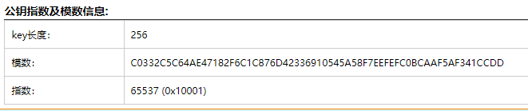

http://tool.chacuo.net/cryptrsakeyparse

```py
import gmpy2
import rsa

e=65537
n=86934482296048119190666062003494800588905656017203025617216654058378322103517
p=285960468890451637935629440372639283459
q=304008741604601924494328155975272418463

phin = (p-1) * (q-1)
d=gmpy2.invert(e, phin)

key=rsa.PrivateKey(n,e,int(d),p,q)

with open("flag.enc","rb") as f:
    f=f.read()
    print(rsa.decrypt(f,key))
```

flag.enc 被 base64 的情况
```py
# -*- coding:utf-8 -*-
from gmpy2 import*
from libnum import*
from Crypto.Cipher import PKCS1_OAEP
from Crypto.PublicKey import RSA
from base64 import b64decode
e = 65537
n = 79832181757332818552764610761349592984614744432279135328398999801627880283610900361281249973175805069916210179560506497075132524902086881120372213626641879468491936860976686933630869673826972619938321951599146744807653301076026577949579618331502776303983485566046485431039541708467141408260220098592761245010678592347501894176269580510459729633673468068467144199744563731826362102608811033400887813754780282628099443490170016087838606998017490456601315802448567772411623826281747245660954245413781519794295336197555688543537992197142258053220453757666537840276416475602759374950715283890232230741542737319569819793988431443
p = 3133337
q = 25478326064937419292200172136399497719081842914528228316455906211693118321971399936004729134841162974144246271486439695786036588117424611881955950996219646807378822278285638261582099108339438949573034101215141156156408742843820048066830863814362379885720395082318462850002901605689761876319151147352730090957556940842144299887394678743607766937828094478336401159449035878306853716216548374273462386508307367713112073004011383418967894930554067582453248981022011922883374442736848045920676341361871231787163441467533076890081721882179369168787287724769642665399992556052144845878600126283968890273067575342061776244939
phi = (q-1)*(p-1)
d = int(invert(e,phi))

key = RSA.construct((n,e,d,q,p))
cipher = PKCS1_OAEP.new(key)

with open('flag.enc','rb') as f:
    f = f.read()
    c = b64decode(f)
    flag = cipher.decrypt(c)
    print(flag)
```

#### 已知 n、e、c、p、q 批量求 m (n 分解) (Roll 按行加密)

```
{920139713,19}

704796792
752211152
274704164
18414022
368270835
483295235
263072905
459788476
483295235
459788476
663551792
475206804
459788476
428313374
475206804
459788476
425392137
704796792
458265677
341524652
483295235
534149509
425392137
428313374
425392137
341524652
458265677
263072905
483295235
828509797
341524652
425392137
475206804
428313374
483295235
475206804
459788476
306220148
```

```py
import gmpy2
N,p,q,e=920139713,49891,18443,19
phi = (p-1)*(q-1)
d=gmpy2.invert(e,phi)
result=[]

with open("c.txt","r") as f:
  for c in f.readlines():
    c=c.strip('\n')
    result.append(chr(pow(int(c),d,N)))

flag=''
for i in result:
  flag+=i
  print(flag)
```

#### e=3 (小公钥指数攻击) (小明文攻击) (tereotyped messages攻击)

```
#n:  0x52d483c27cd806550fbe0e37a61af2e7cf5e0efb723dfc81174c918a27627779b21fa3c851e9e94188eaee3d5cd6f752406a43fbecb53e80836ff1e185d3ccd7782ea846c2e91a7b0808986666e0bdadbfb7bdd65670a589a4d2478e9adcafe97c6ee23614bcb2ecc23580f4d2e3cc1ecfec25c50da4bc754dde6c8bfd8d1fc16956c74d8e9196046a01dc9f3024e11461c294f29d7421140732fedacac97b8fe50999117d27943c953f18c4ff4f8c258d839764078d4b6ef6e8591e0ff5563b31a39e6374d0d41c8c46921c25e5904a817ef8e39e5c9b71225a83269693e0b7e3218fc5e5a1e8412ba16e588b3d6ac536dce39fcdfce81eec79979ea6872793L
#e:  0x3
#c:0x10652cdfaa6b63f6d7bd1109da08181e500e5643f5b240a9024bfa84d5f2cac9310562978347bb232d63e7289283871efab83d84ff5a7b64a94a79d34cfbd4ef121723ba1f663e514f83f6f01492b4e13e1bb4296d96ea5a353d3bf2edd2f449c03c4a3e995237985a596908adc741f32365
so,how to get the message?
```

低加密指数攻击,e 比较小，一般为 3

公钥中的加密指数 e 很小，但是模数 n 很大

有 RSA 加密公式： C=M^e % n (C 密文，M 明文)

则：

当 M^e < n 时，C = M^e ，所以对 C 开方就能得到 M

当 M^e ＞ n 时，此时用爆破的方法

假设我们 Ｍ^e / n 的商为 k 余数为 C，则Ｍ^e = kn + C，对 K 进行爆破，只要 k 满足 kn + C 能够开 e 次方就可以得明文

```py
# -*- coding: utf-8 -*-#
#python3
from gmpy2 import iroot
import libnum
e = 0x3
n = 0x52d483c27cd806550fbe0e37a61af2e7cf5e0efb723dfc81174c918a27627779b21fa3c851e9e94188eaee3d5cd6f752406a43fbecb53e80836ff1e185d3ccd7782ea846c2e91a7b0808986666e0bdadbfb7bdd65670a589a4d2478e9adcafe97c6ee23614bcb2ecc23580f4d2e3cc1ecfec25c50da4bc754dde6c8bfd8d1fc16956c74d8e9196046a01dc9f3024e11461c294f29d7421140732fedacac97b8fe50999117d27943c953f18c4ff4f8c258d839764078d4b6ef6e8591e0ff5563b31a39e6374d0d41c8c46921c25e5904a817ef8e39e5c9b71225a83269693e0b7e3218fc5e5a1e8412ba16e588b3d6ac536dce39fcdfce81eec79979ea6872793
c = 0x10652cdfaa6b63f6d7bd1109da08181e500e5643f5b240a9024bfa84d5f2cac9310562978347bb232d63e7289283871efab83d84ff5a7b64a94a79d34cfbd4ef121723ba1f663e514f83f6f01492b4e13e1bb4296d96ea5a353d3bf2edd2f449c03c4a3e995237985a596908adc741f32365

k = 0
while 1:
    res = iroot(c+k*n,e)  #c+k*n 开3次方根 能开3次方即可
    #print(res)
    #res = (mpz(13040004482819713819817340524563023159919305047824600478799740488797710355579494486728991357), True)
    if(res[1] == True):
        print(libnum.n2s(int(res[0]))) #转为字符串
        break
    k=k+1
```


#### 已知 e、n，求 d (e极大) (Wiener’s Attack)

https://github.com/pablocelayes/rsa-wiener-attack

低解密指数攻击:e过大 n分解不出来


python2 带工具，在rsa-wiener-attack-master目录下kali虚拟机执行，python2 hello.py即可
```py

import hashlib
import RSAwienerHacker
N = 101991809777553253470276751399264740131157682329252673501792154507006158434432009141995367241962525705950046253400188884658262496534706438791515071885860897552736656899566915731297225817250639873643376310103992170646906557242832893914902053581087502512787303322747780420210884852166586717636559058152544979471
e = 46731919563265721307105180410302518676676135509737992912625092976849075262192092549323082367518264378630543338219025744820916471913696072050291990620486581719410354385121760761374229374847695148230596005409978383369740305816082770283909611956355972181848077519920922059268376958811713365106925235218265173085
d =  RSAwienerHacker.hack_RSA(e,N)
print(d)
flag = "flag{" + hashlib.md5(hex(d)).hexdigest() + "}"
print(flag)
#8920758995414587152829426558580025657357328745839747693739591820283538307445
#flag{47bf28da384590448e0b0d23909a25a4}

```

python3下MD5有问题
```py
import owiener
e = 3047442173541658754667464233797118324917469250436575767227172319344577259865313428705759330024959317716760816959590728238918140105663188172228696589411452947738069773833351725455888549656717874059636289036277785342126992626060696063089487811946920569580454880169977542532087635095357205433679009382368108273

n = 135568509670260054049994954417860747085442883428459182441559553532993752593294067458983143521109377661295622146963670193783017382697726454953197805014428888491744355387957923382241961401063461549210355871385000347645387907568135032087942016502668629010859519249039662555733548461551175133582871220209515648241

d = owiener.attack(e, n)

print(d)
# flag = "flag{" + hashlib.md5(hex(d).encode("utf-8")).hexdigest() + "}"
# print(flag)

#8920758995414587152829426558580025657357328745839747693739591820283538307445
#flag{47bf28da384590448e0b0d23909a25a4}
```

#### 已知多个 n、c (中国剩余定理)

```py
from gmpy2 import *
from Crypto.Util.number import *
from functools import reduce

# 将5进制数转换为10进制数  int('',5)
N1 = int('331310324212000030020214312244232222400142410423413104441140203003243002104333214202031202212403400220031202142322434104143104244241214204444443323000244130122022422310201104411044030113302323014101331214303223312402430402404413033243132101010422240133122211400434023222214231402403403200012221023341333340042343122302113410210110221233241303024431330001303404020104442443120130000334110042432010203401440404010003442001223042211442001413004',5)
c1 = int('310020004234033304244200421414413320341301002123030311202340222410301423440312412440240244110200112141140201224032402232131204213012303204422003300004011434102141321223311243242010014140422411342304322201241112402132203101131221223004022003120002110230023341143201404311340311134230140231412201333333142402423134333211302102413111111424430032440123340034044314223400401224111323000242234420441240411021023100222003123214343030122032301042243',5)

N2 = int('302240000040421410144422133334143140011011044322223144412002220243001141141114123223331331304421113021231204322233120121444434210041232214144413244434424302311222143224402302432102242132244032010020113224011121043232143221203424243134044314022212024343100042342002432331144300214212414033414120004344211330224020301223033334324244031204240122301242232011303211220044222411134403012132420311110302442344021122101224411230002203344140143044114',5)
c2 = int('112200203404013430330214124004404423210041321043000303233141423344144222343401042200334033203124030011440014210112103234440312134032123400444344144233020130110134042102220302002413321102022414130443041144240310121020100310104334204234412411424420321211112232031121330310333414423433343322024400121200333330432223421433344122023012440013041401423202210124024431040013414313121123433424113113414422043330422002314144111134142044333404112240344',5)

N3 = int('332200324410041111434222123043121331442103233332422341041340412034230003314420311333101344231212130200312041044324431141033004333110021013020140020011222012300020041342040004002220210223122111314112124333211132230332124022423141214031303144444134403024420111423244424030030003340213032121303213343020401304243330001314023030121034113334404440421242240113103203013341231330004332040302440011324004130324034323430143102401440130242321424020323',5)
c3 = int('10013444120141130322433204124002242224332334011124210012440241402342100410331131441303242011002101323040403311120421304422222200324402244243322422444414043342130111111330022213203030324422101133032212042042243101434342203204121042113212104212423330331134311311114143200011240002111312122234340003403312040401043021433112031334324322123304112340014030132021432101130211241134422413442312013042141212003102211300321404043012124332013240431242',5)

N = [N1,N2,N3]
c = [c1,c2,c3]

# 中国剩余定理算法
def chinese_remainder(modulus, remainders):
    Sum = 0
    prod = reduce(lambda a, b: a*b, modulus)
    for m_i, r_i in zip(modulus, remainders):
        p = prod // m_i
        Sum += r_i * (inverse(p,m_i)*p)
    return Sum % prod
e = 3

# print(chinese_remainder(N,c))
pow_m_e = chinese_remainder(N,c)

# pow_m_e = 17446992834638639179129969961058029457462398677361658450137832328330435503838651797276948890990069700515669656391607670623897280684064423087023742140145529356863469816868212911716782075239982647322703714504545802436551322108638975695013439206776300941300053940942685511792851350404139366581130688518772175108412341696958930756520037
m = iroot(pow_m_e,e)[0]

print(long_to_bytes(m))
```

#### 已知 n、质数相乘+1 (Pollard's p-1)

```py
from random import choice
from Crypto.Util.number import isPrime, sieve_base as primes
from flag import flag

def getPrime(bits):
    while True:
        n = 2
        while n.bit_length() < bits:
            n *= choice(primes)
        if isPrime(n + 1):
            return n + 1

e = 0x10001
m = int.from_bytes(flag.encode(), 'big')
p, q = [getPrime(2048) for _ in range(2)]
n = p * q
c = pow(m, e, n)

# n = 32849718197337581823002243717057659218502519004386996660885100592872201948834155543125924395614928962750579667346279456710633774501407292473006312537723894221717638059058796679686953564471994009285384798450493756900459225040360430847240975678450171551048783818642467506711424027848778367427338647282428667393241157151675410661015044633282064056800913282016363415202171926089293431012379261585078566301060173689328363696699811123592090204578098276704877408688525618732848817623879899628629300385790344366046641825507767709276622692835393219811283244303899850483748651722336996164724553364097066493953127153066970594638491950199605713033004684970381605908909693802373826516622872100822213645899846325022476318425889580091613323747640467299866189070780620292627043349618839126919699862580579994887507733838561768581933029077488033326056066378869170169389819542928899483936705521710423905128732013121538495096959944889076705471928490092476616709838980562233255542325528398956185421193665359897664110835645928646616337700617883946369110702443135980068553511927115723157704586595844927607636003501038871748639417378062348085980873502535098755568810971926925447913858894180171498580131088992227637341857123607600275137768132347158657063692388249513
# c = 26308018356739853895382240109968894175166731283702927002165268998773708335216338997058314157717147131083296551313334042509806229853341488461087009955203854253313827608275460592785607739091992591431080342664081962030557042784864074533380701014585315663218783130162376176094773010478159362434331787279303302718098735574605469803801873109982473258207444342330633191849040553550708886593340770753064322410889048135425025715982196600650740987076486540674090923181664281515197679745907830107684777248532278645343716263686014941081417914622724906314960249945105011301731247324601620886782967217339340393853616450077105125391982689986178342417223392217085276465471102737594719932347242482670320801063191869471318313514407997326350065187904154229557706351355052446027159972546737213451422978211055778164578782156428466626894026103053360431281644645515155471301826844754338802352846095293421718249819728205538534652212984831283642472071669494851823123552827380737798609829706225744376667082534026874483482483127491533474306552210039386256062116345785870668331513725792053302188276682550672663353937781055621860101624242216671635824311412793495965628876036344731733142759495348248970313655381407241457118743532311394697763283681852908564387282605279108
```

注意到生成质数的过程，是在质数库里面选一堆质数乘起来，最后加上 1。这会导致 拥有小因子。采用 Pollard's p-1 攻击


python2环境下运行，需要pip2 install primefac
```py
python -m primefac -vs -m=p-1 32849718197337581823002243717057659218502519004386996660885100592872201948834155543125924395614928962750579667346279456710633774501407292473006312537723894221717638059058796679686953564471994009285384798450493756900459225040360430847240975678450171551048783818642467506711424027848778367427338647282428667393241157151675410661015044633282064056800913282016363415202171926089293431012379261585078566301060173689328363696699811123592090204578098276704877408688525618732848817623879899628629300385790344366046641825507767709276622692835393219811283244303899850483748651722336996164724553364097066493953127153066970594638491950199605713033004684970381605908909693802373826516622872100822213645899846325022476318425889580091613323747640467299866189070780620292627043349618839126919699862580579994887507733838561768581933029077488033326056066378869170169389819542928899483936705521710423905128732013121538495096959944889076705471928490092476616709838980562233255542325528398956185421193665359897664110835645928646616337700617883946369110702443135980068553511927115723157704586595844927607636003501038871748639417378062348085980873502535098755568810971926925447913858894180171498580131088992227637341857123607600275137768132347158657063692388249513
```

#### 已知 p、n、c、e的范围,求 m

```
p = 177077389675257695042507998165006460849
n = 37421829509887796274897162249367329400988647145613325367337968063341372726061
c = ==gMzYDNzIjMxUTNyIzNzIjMyYTM4MDM0gTMwEjNzgTM2UTN4cjNwIjN2QzM5ADMwIDNyMTO4UzM2cTM5kDN2MTOyUTO5YDM0czM3MjM
```

```py
from base64 import b64encode as b32encode
from gmpy2 import invert,gcd,iroot
from Crypto.Util.number import *
from binascii import a2b_hex,b2a_hex
import random

flag = "******************************"

nbit = 128

p = getPrime(nbit)
q = getPrime(nbit)
n = p*q

print p
print n

phi = (p-1)*(q-1)

e = random.randint(50000,70000)

while True:
	if gcd(e,phi) == 1:
		break;
	else:
		e -= 1;

c = pow(int(b2a_hex(flag),16),e,n)

print b32encode(str(c))[::-1]

# 2373740699529364991763589324200093466206785561836101840381622237225512234632
```

给了 e 的范围,爆破即可

```py
#!/usr/bin/env python
# -*- coding:utf-8 -*-
from base64 import b64encode as b32encode
from base64 import b64decode
from gmpy2 import invert, gcd, iroot
from Crypto.Util.number import *

p = 177077389675257695042507998165006460849
n = 37421829509887796274897162249367329400988647145613325367337968063341372726061
c64 = '==gMzYDNzIjMxUTNyIzNzIjMyYTM4MDM0gTMwEjNzgTM2UTN4cjNwIjN2QzM5ADMwIDNyMTO4UzM2cTM5kDN2MTOyUTO5YDM0czM3MjM'
c = int ( b64decode ( str ( c64)[::-1] ) )
print ( c )
q = n // p
phi = (p - 1) * (q - 1)
for e in range ( 50000, 70000 ):
    if  gcd ( e, phi ) == 1:
        d = invert ( e, phi )
        m = pow ( c, d, n )
        flag=str(long_to_bytes(m))
        if 'flag' in flag or 'CTF' in flag or ("{" in flag and '}'in flag):
            print(flag)
```

#### 已知 c1、c2、n1、n2、e的范围 (同公钥（e，n）加密的密文、具有同 q 的公钥加密的密文)

```py
from Crypto.Util.number import getPrime,bytes_to_long

flag=open("flag","rb").read()

p=getPrime(1024)
q=getPrime(1024)
assert(e<100000)
n=p*q
m=bytes_to_long(flag)
c=pow(m,e,n)
print c,n
print pow(294,e,n)

p=getPrime(1024)
n=p*q
m=bytes_to_long("BJD"*32)
c=pow(m,e,n)
print c,n

'''
output:
12641635617803746150332232646354596292707861480200207537199141183624438303757120570096741248020236666965755798009656547738616399025300123043766255518596149348930444599820675230046423373053051631932557230849083426859490183732303751744004874183062594856870318614289991675980063548316499486908923209627563871554875612702079100567018698992935818206109087568166097392314105717555482926141030505639571708876213167112187962584484065321545727594135175369233925922507794999607323536976824183162923385005669930403448853465141405846835919842908469787547341752365471892495204307644586161393228776042015534147913888338316244169120  13508774104460209743306714034546704137247627344981133461801953479736017021401725818808462898375994767375627749494839671944543822403059978073813122441407612530658168942987820256786583006947001711749230193542370570950705530167921702835627122401475251039000775017381633900222474727396823708695063136246115652622259769634591309421761269548260984426148824641285010730983215377509255011298737827621611158032976420011662547854515610597955628898073569684158225678333474543920326532893446849808112837476684390030976472053905069855522297850688026960701186543428139843783907624317274796926248829543413464754127208843070331063037
381631268825806469518166370387352035475775677163615730759454343913563615970881967332407709901235637718936184198930226303761876517101208677107311006065728014220477966000620964056616058676999878976943319063836649085085377577273214792371548775204594097887078898598463892440141577974544939268247818937936607013100808169758675042264568547764031628431414727922168580998494695800403043312406643527637667466318473669542326169218665366423043579003388486634167642663495896607282155808331902351188500197960905672207046579647052764579411814305689137519860880916467272056778641442758940135016400808740387144508156358067955215018
979153370552535153498477459720877329811204688208387543826122582132404214848454954722487086658061408795223805022202997613522014736983452121073860054851302343517756732701026667062765906277626879215457936330799698812755973057557620930172778859116538571207100424990838508255127616637334499680058645411786925302368790414768248611809358160197554369255458675450109457987698749584630551177577492043403656419968285163536823819817573531356497236154342689914525321673807925458651854768512396355389740863270148775362744448115581639629326362342160548500035000156097215446881251055505465713854173913142040976382500435185442521721  12806210903061368369054309575159360374022344774547459345216907128193957592938071815865954073287532545947370671838372144806539753829484356064919357285623305209600680570975224639214396805124350862772159272362778768036844634760917612708721787320159318432456050806227784435091161119982613987303255995543165395426658059462110056431392517548717447898084915167661172362984251201688639469652283452307712821398857016487590794996544468826705600332208535201443322267298747117528882985955375246424812616478327182399461709978893464093245135530135430007842223389360212803439850867615121148050034887767584693608776323252233254261047
'''
```

两个 n 值公用了一个 q，可以通过 gcd 函数很快找到 q 的值，就可以求出两个 p 的值

此时就差 e 就能解出题目，e 小于 100000，又有关系式 output=pow(294,e,n)，可以通过爆破 e 的取值很快得到 e

解法一：
```py
# python2
from gmpy2 import *
from Crypto.Util.number import *
c1=12641635617803746150332232646354596292707861480200207537199141183624438303757120570096741248020236666965755798009656547738616399025300123043766255518596149348930444599820675230046423373053051631932557230849083426859490183732303751744004874183062594856870318614289991675980063548316499486908923209627563871554875612702079100567018698992935818206109087568166097392314105717555482926141030505639571708876213167112187962584484065321545727594135175369233925922507794999607323536976824183162923385005669930403448853465141405846835919842908469787547341752365471892495204307644586161393228776042015534147913888338316244169120
n1=13508774104460209743306714034546704137247627344981133461801953479736017021401725818808462898375994767375627749494839671944543822403059978073813122441407612530658168942987820256786583006947001711749230193542370570950705530167921702835627122401475251039000775017381633900222474727396823708695063136246115652622259769634591309421761269548260984426148824641285010730983215377509255011298737827621611158032976420011662547854515610597955628898073569684158225678333474543920326532893446849808112837476684390030976472053905069855522297850688026960701186543428139843783907624317274796926248829543413464754127208843070331063037
c2=979153370552535153498477459720877329811204688208387543826122582132404214848454954722487086658061408795223805022202997613522014736983452121073860054851302343517756732701026667062765906277626879215457936330799698812755973057557620930172778859116538571207100424990838508255127616637334499680058645411786925302368790414768248611809358160197554369255458675450109457987698749584630551177577492043403656419968285163536823819817573531356497236154342689914525321673807925458651854768512396355389740863270148775362744448115581639629326362342160548500035000156097215446881251055505465713854173913142040976382500435185442521721
n2=12806210903061368369054309575159360374022344774547459345216907128193957592938071815865954073287532545947370671838372144806539753829484356064919357285623305209600680570975224639214396805124350862772159272362778768036844634760917612708721787320159318432456050806227784435091161119982613987303255995543165395426658059462110056431392517548717447898084915167661172362984251201688639469652283452307712821398857016487590794996544468826705600332208535201443322267298747117528882985955375246424812616478327182399461709978893464093245135530135430007842223389360212803439850867615121148050034887767584693608776323252233254261047
q=gcd(n1,n2)
#print(q)
#99855353761764939308265951492116976798674681282941462516956577712943717850048051273358745095906207085170915794187749954588685850452162165059831749303473106541930948723000882713453679904525655327168665295207423257922666721077747911860159181041422993030618385436504858943615630219459262419715816361781062898911

output=381631268825806469518166370387352035475775677163615730759454343913563615970881967332407709901235637718936184198930226303761876517101208677107311006065728014220477966000620964056616058676999878976943319063836649085085377577273214792371548775204594097887078898598463892440141577974544939268247818937936607013100808169758675042264568547764031628431414727922168580998494695800403043312406643527637667466318473669542326169218665366423043579003388486634167642663495896607282155808331902351188500197960905672207046579647052764579411814305689137519860880916467272056778641442758940135016400808740387144508156358067955215018
for i in range(100000):
	res=pow(294,i,n1)
	if (res==output):
		#print(i)
		#52361
		e=i
		break
e=52361
p=n1//q
phi=(p-1)*(q-1)
d=invert(e,phi)
m=pow(c1,d,n1)
flag=long_to_bytes(m)
print(flag)
#BJD{p_is_common_divisor}
```

解法二:
```py
import gmpy2
from Crypto.Util.number import *
# flag=open("flag","rb").read()

# p=getPrime(1024)
# q=getPrime(1024)
# assert(e<100000)
# n=p*q
# m=bytes_to_long(flag)
# c=pow(m,e,n)
# print c,n
# print pow(294,e,n)

# p=getPrime(1024)
# n=p*q
# m=bytes_to_long("BJD"*32)
# c=pow(m,e,n)
# print c,n

#output:
c = 12641635617803746150332232646354596292707861480200207537199141183624438303757120570096741248020236666965755798009656547738616399025300123043766255518596149348930444599820675230046423373053051631932557230849083426859490183732303751744004874183062594856870318614289991675980063548316499486908923209627563871554875612702079100567018698992935818206109087568166097392314105717555482926141030505639571708876213167112187962584484065321545727594135175369233925922507794999607323536976824183162923385005669930403448853465141405846835919842908469787547341752365471892495204307644586161393228776042015534147913888338316244169120
n = 13508774104460209743306714034546704137247627344981133461801953479736017021401725818808462898375994767375627749494839671944543822403059978073813122441407612530658168942987820256786583006947001711749230193542370570950705530167921702835627122401475251039000775017381633900222474727396823708695063136246115652622259769634591309421761269548260984426148824641285010730983215377509255011298737827621611158032976420011662547854515610597955628898073569684158225678333474543920326532893446849808112837476684390030976472053905069855522297850688026960701186543428139843783907624317274796926248829543413464754127208843070331063037
#n和e相同
_294c = 381631268825806469518166370387352035475775677163615730759454343913563615970881967332407709901235637718936184198930226303761876517101208677107311006065728014220477966000620964056616058676999878976943319063836649085085377577273214792371548775204594097887078898598463892440141577974544939268247818937936607013100808169758675042264568547764031628431414727922168580998494695800403043312406643527637667466318473669542326169218665366423043579003388486634167642663495896607282155808331902351188500197960905672207046579647052764579411814305689137519860880916467272056778641442758940135016400808740387144508156358067955215018
#e相同
BJDc = 979153370552535153498477459720877329811204688208387543826122582132404214848454954722487086658061408795223805022202997613522014736983452121073860054851302343517756732701026667062765906277626879215457936330799698812755973057557620930172778859116538571207100424990838508255127616637334499680058645411786925302368790414768248611809358160197554369255458675450109457987698749584630551177577492043403656419968285163536823819817573531356497236154342689914525321673807925458651854768512396355389740863270148775362744448115581639629326362342160548500035000156097215446881251055505465713854173913142040976382500435185442521721
BJDn = 12806210903061368369054309575159360374022344774547459345216907128193957592938071815865954073287532545947370671838372144806539753829484356064919357285623305209600680570975224639214396805124350862772159272362778768036844634760917612708721787320159318432456050806227784435091161119982613987303255995543165395426658059462110056431392517548717447898084915167661172362984251201688639469652283452307712821398857016487590794996544468826705600332208535201443322267298747117528882985955375246424812616478327182399461709978893464093245135530135430007842223389360212803439850867615121148050034887767584693608776323252233254261047

#n 和 BJDn公用了一个 q 用gcd欧几里得算法求得p
q = gmpy2.gcd(n,BJDn)
p = n // q
# 此时知道e即可解题 因为我们知道pow(294,e,n) 还知道e的范围所以可以**e
for e in range(100000):
    if _294c == pow(294,e,n):
        print('e = ',e)
        break
#e =  52361
m = pow(c, gmpy2.invert(e, (q-1) * (p-1)), n)
print(long_to_bytes(m))
#b'BJD{p_is_common_divisor}'
```

#### 已知 e、m1、m2、n、pq 接近 ,求原 m

例题 [GWCTF 2019]BabyRSA

```py
N=636585149594574746909030160182690866222909256464847291783000651837227921337237899651287943597773270944384034858925295744880727101606841413640006527614873110651410155893776548737823152943797884729130149758279127430044739254000426610922834573094957082589539445610828279428814524313491262061930512829074466232633130599104490893572093943832740301809630847541592548921200288222432789208650949937638303429456468889100192613859073752923812454212239908948930178355331390933536771065791817643978763045030833712326162883810638120029378337092938662174119747687899484603628344079493556601422498405360731958162719296160584042671057160241284852522913676264596201906163
m1=90009974341452243216986938028371257528604943208941176518717463554774967878152694586469377765296113165659498726012712288670458884373971419842750929287658640266219686646956929872115782173093979742958745121671928568709468526098715927189829600497283118051641107305128852697032053368115181216069626606165503465125725204875578701237789292966211824002761481815276666236869005129138862782476859103086726091860497614883282949955023222414333243193268564781621699870412557822404381213804026685831221430728290755597819259339616650158674713248841654338515199405532003173732520457813901170264713085107077001478083341339002069870585378257051150217511755761491021553239
m2=487443985757405173426628188375657117604235507936967522993257972108872283698305238454465723214226871414276788912058186197039821242912736742824080627680971802511206914394672159240206910735850651999316100014691067295708138639363203596244693995562780286637116394738250774129759021080197323724805414668042318806010652814405078769738548913675466181551005527065309515364950610137206393257148357659666687091662749848560225453826362271704292692847596339533229088038820532086109421158575841077601268713175097874083536249006018948789413238783922845633494023608865256071962856581229890043896939025613600564283391329331452199062858930374565991634191495137939574539546
```

pq接近,那么 n 应该好分解

e 已经给出来了,flag被加密为 F1 F2，要求 c1、c2 还原 flag

先用 yafu 分解 n

```
P327 = 797862863902421984951231350430312260517773269684958456342860983236184129602390919026048496119757187702076499551310794177917920137646835888862706126924088411570997141257159563952725882214181185531209186972351469946269508511312863779123205322378452194261217016552527754513215520329499967108196968833163329724620251096080377748737
P327 = 797862863902421984951231350430312260517773269684958456342860983236184129602390919026048496119757187702076499551310794177917920137646835888862706126924088411570997141257159563952725882214181185531209186972351469946269508511312863779123205322378452194261217016552527754513215520329499967108196968833163329724620251096080377747699
```


## 古典密码

- 单表替换加密（Monoalphabetic Cipher）
- 多表替换加密（Polyalphabetic Cipher）
- 奇奇怪怪的加密方式

### 单表代换加密

在单表替换加密中，所有的加密方式几乎都有一个共性，那就是明密文一一对应。所以说，一般有以下两种方式来进行破解

- 在密钥空间较小的情况下，采用暴力破解方式
- 在密文长度足够长的时候，使用词频分析，http://quipqiup.com/

当密钥空间足够大，而密文长度足够短的情况下，破解较为困难。

#### 词频分析

在密文长度足够长的时候，使用词频分析，http://quipqiup.com/

#### 凯撒密码

凯撒密码（Caesar）加密时会将明文中的 `每个字母` 都按照其在字母表中的顺序向后（或向前）移动固定数目（`循环移动`）作为密文。例如，当偏移量是左移 3 的时候（解密时的密钥就是 3）：

```
明文字母表：ABCDEFGHIJKLMNOPQRSTUVWXYZ
密文字母表：DEFGHIJKLMNOPQRSTUVWXYZABC
```

使用时，加密者查找明文字母表中需要加密的消息中的每一个字母所在位置，并且写下密文字母表中对应的字母。需要解密的人则根据事先已知的密钥反过来操作，得到原来的明文。例如：

```
明文：THE QUICK BROWN FOX JUMPS OVER THE LAZY DOG
密文：WKH TXLFN EURZQ IRA MXPSV RYHU WKH ODCB GRJ
```

根据偏移量的不同，还存在若干特定的恺撒密码名称：

- 偏移量为 10：Avocat （A→K）
- 偏移量为 13：ROT13
- 偏移量为 -5：Cassis （K 6）
- 偏移量为 -6：Cassette （K 7）

在线网站
https://www.qqxiuzi.cn/bianma/kaisamima.php


#### 移位密码-变异凯撒

常规的凯撒密码是对每个字母做相同单位的移位。变异凯撒每个字母的移位可能各不相同。

往往是ASCII的移位密码，将密码转为如flag{}等格式，寻找规律

```py
c = "afZ_r9VYfScOeO_UL^RWUc"
move = 5

flag = ""
for i in c:
    flag += chr(ord(i)+ move)
    move = move +1

print(flag)
```

#### ROT5/13/18/47

https://www.qqxiuzi.cn/bianma/ROT5-13-18-47.php

ROT5：只对数字进行编码，用当前数字往前数的第5个数字替换当前数字，例如当前为0，编码后变成5，当前为1，编码后变成6，以此类推顺序循环。
ROT13：只对字母进行编码，用当前字母往前数的第13个字母替换当前字母，例如当前为A，编码后变成N，当前为B，编码后变成O，以此类推顺序循环。
ROT18：这是一个异类，本来没有，它是将ROT5和ROT13组合在一起，为了好称呼，将其命名为ROT18。
ROT47：对数字、字母、常用符号进行编码，按照它们的ASCII值进行位置替换，用当前字符ASCII值往前数的第47位对应字符替换当前字符，例如当前为小写字母z，编码后变成大写字母K，当前为数字0，编码后变成符号_。用于ROT47编码的字符其ASCII值范围是33－126

### 多表代换加密

加密后的字母几乎不再保持原来的频率，一般只能通过寻找算法实现对应的弱点进行破解。

#### playfair-普莱费尔密码

http://rumkin.com/tools/cipher/playfair.php

#### 维吉尼亚密码-vigenere

维吉尼亚密码是在凯撒密码基础上产生的一种加密方法，它将凯撒密码的全部25种位移排序为一张表，与原字母序列共同组成26行及26列的字母表。另外，维吉尼亚密码必须有一个密钥，这个密钥由字母组成，最少一个，最多可与明文字母数量相等。

http://www.atoolbox.net/Tool.php?Id=856
https://www.guballa.de/vigenere-solver
https://www.qqxiuzi.cn/bianma/weijiniyamima.php

```py
c='SRLU{LZPL_S_UASHKXUPD_NXYTFTJT}'
m='ACTF{'
a=[]
for i in range(4):
    a.append(str(ord(c[i])-ord(m[i])))
print(m,end='')
for i in range(5,len(c)):
    if 'A'<= c[i]<= 'Z':
        print(chr((ord(c[i])-int(a[i%4])-ord('A'))%26+ord('A')),end='')
    else:
        print(c[i],end='')
```
### 其它类型加密

#### 培根密码

培根密码使用两种不同的字体，代表 A 和 B，结合加密表进行加解密。

```
a	AAAAA	g	AABBA	n	ABBAA	t	BAABA
b	AAAAB	h	AABBB	o	ABBAB	u-v	BAABB
c	AAABA	i-j	ABAAA	p	ABBBA	w	BABAA
d	AAABB	k	ABAAB	q	ABBBB	x	BABAB
e	AABAA	l	ABABA	r	BAAAA	y	BABBA
f	AABAB	m	ABABB	s	BAAAB	z	BABBB
```

上面的是常用的加密表。还有另外的一种加密表，可认为是将 26 个字母从 0 到 25 排序，以二进制表示，A 代表 0，B 代表 1。

下面这一段内容就是明文 steganography 加密后的内容，正常字体是 A，粗体是 B：

To encode a message each letter of the plaintext is replaced by a group of five of the letters 'A' or 'B'.


可以看到，培根密码主要有以下特点

- 只有两种字符
- 每一段的长度为 5
- 加密内容会有特殊的字体之分，亦或者大小写之分。

工具：
http://rumkin.com/tools/cipher/baconian.php

#### 栅栏密码

栅栏密码把要加密的明文分成 N 个一组，然后把每组的第 1 个字连起来，形成一段无规律的话。

```
明文：THERE IS A CIPHER
```
1.去掉空格后变为

```
THEREISACIPHER
```

2.分成两栏，两个一组得到
```
TH ER EI SA CI PH ER
```

3.先取出第一个字母，再取出第二个字母
```
TEESCPE
HRIAIHR
```

4.连在一起就是
```
TEESCPEHRIAIHR
```

在线网站：
https://www.qqxiuzi.cn/bianma/zhalanmima.php
http://www.metools.info/code/fence154.html


#### 60甲子年表

```
01 甲子
11甲戌
21甲申
31 甲午
41甲辰
51甲寅
02 乙丑
12 乙亥
22乙酉
32 乙未
42乙巳
52 乙卯
03 丙寅
13丙子
23 丙戌
33丙申
43丙午
53丙辰
04丁卯
14丁丑
24丁亥
34丁酉
44丁未
54丁巳
05戊辰
15戊寅
25戊子
35戊戌
45戊申
55 戊午
06己巳
16己卯
26己丑
36 己亥
46 己酉
56 己未
07庚午
17 庚辰
27庚寅
37 庚子
47 庚戌
57 庚申
08辛未
18 辛巳
28 辛卯
38 辛丑
48 辛亥
58 辛酉
09壬申
19壬午
29 壬辰
39 壬寅
49 壬子
59 壬戌
10癸酉
20癸未
30 癸巳
40 癸卯
50 癸丑
60 癸亥
```

算完后一般还需要再加上60

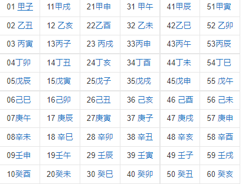


#### 传统猪圈密码


http://www.hiencode.com/pigpen.html

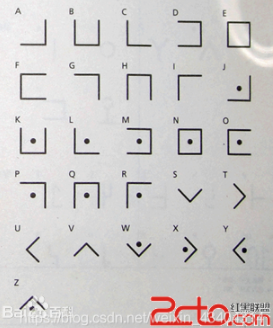

#### 猪圈变种密码


#### 古埃及象形文字

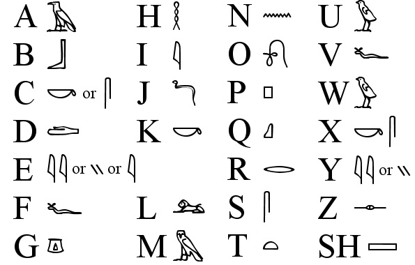
#### 圣堂武士密码

圣堂武士密码(Templar Cipher)是共济会的“猪圈密码”的一个变种，一直被共济会圣殿骑士用。明文字母和对应密文：


#### 标准银河字母

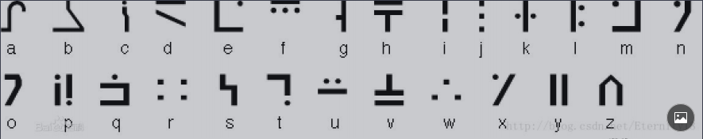


#### 精灵语


#### 福尔摩斯-跳舞的小人

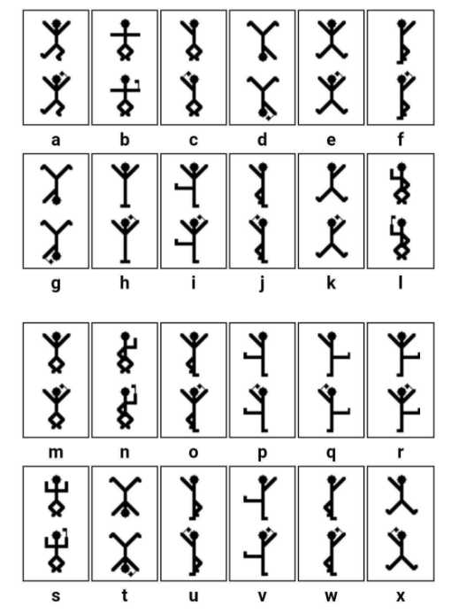

#### 音符密码

https://www.qqxiuzi.cn/bianma/wenbenjiami.php?s=yinyue

#### 敲击码

  1  2  3  4  5
1 A  B C/K D  E
2 F  G  H  I  J
3 L  M  N  O  P
4 Q  R  S  T  U
5 V  W  X  Y  Z

..... ../... ./... ./... ../
  5,2     3,1    3,1    3,2
   W       L      L      M

#### 四方密码

https://zh.wikipedia.org/wiki/%E5%9B%9B%E6%96%B9%E5%AF%86%E7%A2%BC

首先选择两个英文字作密匙，例如example和keyword。对于每一个密匙，将重复出现的字母去除，即example要转成exampl，然后将每个字母顺序放入矩阵，再将余下的字母顺序放入矩阵，便得出加密矩阵。

四方密码用4个5×5的矩阵来加密。每个矩阵都有25个字母（通常会取消Q或将I,J视作同一样，或改进为6×6的矩阵，加入10个数字）。

将这两个加密矩阵放在右上角和左下角，余下的两个角放a到z顺序的矩阵：

加密的步骤：

两个字母一组地分开讯息：（例如hello world变成he ll ow or ld）；

找出第一个字母在左上角矩阵的位置；

同样道理，找第二个字母在右下角矩阵的位置；

找右上角矩阵中，和第一个字母同行，第二个字母同列的字母；

找左下角矩阵中，和第一个字母同列，第二个字母同行的字母；

得到的这两个字母就是加密过的讯息。
he lp me ob iw an ke no bi的加密结果：FY NF NE HW BX AF FO KH MD


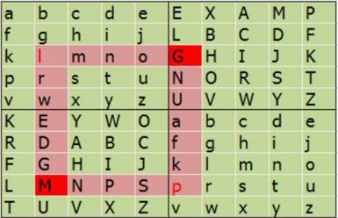

根据key1:security将确认秘钥1：securityabdfghklmnopvwxz
根据key2:information确认秘钥2：informatbcdeghklpsuvwxyz


在线加密解密
- http://www.metools.info/code/four-square244.html
- http://www.hiencode.com/four.html


#### Nihilist

矩阵式替换密码，也称关键字密码 属于Polybius密码的变形种类

原26个英文字母为ABCDEFGHIJKLMNOPQRSTUVWXYZ
把关键字提前后为LOVEKFCABDGHIJMNPQRSTUWXYZ

在置换后的序列里可以发现对应关系P=Q，V=C，S=T，F=F

```py
import string
# enc是待解密的，grid的前半部分是题目给的密钥，然后从A到Z把其他的放到后面
enc='PVSF{vVckHejqBOVX9C1c13GFfkHJrjIQeMwf}' # 密文
grid='LOVEKFC'+'ABDGHIJMNPQRSTUWXY' # 关键字
flag=''

for i in enc:
    if i in string.ascii_lowercase:
        index=grid.lower().index(i)
        flag+=string.ascii_lowercase[index]
        continue
    if i in string.ascii_uppercase:
        index=grid.upper().index(i)
        flag+=string.ascii_uppercase[index]
        continue
    flag+=i
print flag
```

`python nihilist.py`

#### WingDing编码

```
🕈︎❒︎♓︎⧫︎♏︎ ⧫︎♏︎⌧︎⧫︎ ♒︎♏︎❒︎♏︎📬︎ 🕆︎⬧︎♏︎ ✌︎☹︎☹︎ 👍︎✌︎🏱︎💧︎ ♐︎□︎❒︎ 🕈︎👎︎ ☝︎♋︎⬧︎⧫︎♏︎❒︎ ⧫︎❒︎♋︎■︎⬧︎●︎♋︎⧫︎♓︎□︎■︎ 🖳︎✆︎
```

在线网站：https://lingojam.com/WingDing

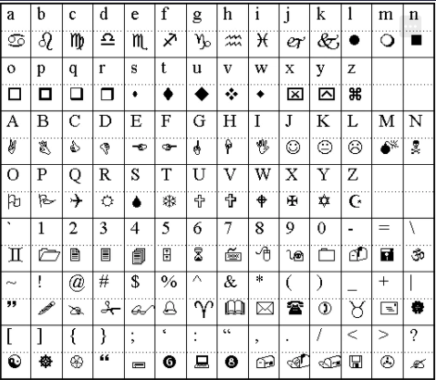

## 其它密码


### Emoji表情编码

http://www.atoolbox.net/Tool.php?Id=937

网上的有时候解不出来，可以用离线工具

https://github.com/pavelvodrazka/ctf-writeups/tree/master/hackyeaster2018/challenges/egg17/files/cracker

本地工具：emoji

### jjencode

jjencode代码，就是将正常的js代码转换成复杂的只有符号的字符串编码,进行加密
如：这样的组合。
```
[$._$_]+$._$+",\\"+$.$__+$.___+"\\"+$.__$+$.__$+$
```

补上jjencode开头结尾

```
#JJencode格式
$=~[];$={___:++$,$$$$:(![]+"")[$],__$:++$,$_$_:(![]+"")[$],_$_:++$,$_$$:({}+"")[$],$$_$:($[$]+"")[$],_$$:++$,$$$_:(!""+"")[$],$__:++$,$_$:++$,$$__:({}+"")[$],$$_:++$,$$$:++$,$___:++$,$__$:++$};$.$_=($.$_=$+"")[$.$_$]+($._$=$.$_[$.__$])+($.$$=($.$+"")[$.__$])+((!$)+"")[$._$$]+($.__=$.$_[$.$$_])+($.$=(!""+"")[$.__$])+($._=(!""+"")[$._$_])+$.$_[$.$_$]+$.__+$._$+$.$;$.$$=$.$+(!""+"")[$._$$]+$.__+$._+$.$+$.$$;$.$=($.___)[$.$_][$.$_];$.$($.$($.$$+"\""+这里放密文+"\"")())();

```

http://www.hiencode.com/jjencode.html

### aaencode

aaencode代码，则是将正常的js代码转为好玩的特殊网络表情符号。

颜文字加密解密

```
ﾟωﾟﾉ= /｀ｍ´）ﾉ ~┻━┻   //*´∇｀*/ ['_']; o=(ﾟｰﾟ)  =_=3; c=(ﾟΘﾟ) =(ﾟｰﾟ)-(ﾟｰﾟ); (ﾟДﾟ) =(ﾟΘﾟ)= (o^_^o)/ (o^_^o);(ﾟДﾟ)={ﾟΘﾟ: '_' ,ﾟωﾟﾉ : ((ﾟωﾟﾉ==3) +'_') [ﾟΘﾟ] ,ﾟｰﾟﾉ :(ﾟωﾟﾉ+ '_')[o^_^o -(ﾟΘﾟ)] ,ﾟДﾟﾉ:((ﾟｰﾟ==3) +'_')[ﾟｰﾟ] }; (ﾟДﾟ) [ﾟΘﾟ] =((ﾟωﾟﾉ==3) +'_') [c^_^o];(ﾟДﾟ) ['c'] = ((ﾟДﾟ)+'_') [ (ﾟｰﾟ)+(ﾟｰﾟ)-(ﾟΘﾟ) ];(ﾟДﾟ) ['o'] = ((ﾟДﾟ)+'_') [ﾟΘﾟ];(ﾟoﾟ)=(ﾟДﾟ) ['c']+(ﾟДﾟ) ['o']+(ﾟωﾟﾉ +'_')[ﾟΘﾟ]+ ((ﾟωﾟﾉ==3) +'_') [ﾟｰﾟ] + ((ﾟДﾟ) +'_') [(ﾟｰﾟ)+(ﾟｰﾟ)]+ ((ﾟｰﾟ==3) +'_') [ﾟΘﾟ]+((ﾟｰﾟ==3) +'_') [(ﾟｰﾟ) - (ﾟΘﾟ)]+(ﾟДﾟ) ['c']+((ﾟДﾟ)+'_') [(ﾟｰﾟ)+(ﾟｰﾟ)]+ (ﾟДﾟ) ['o']+((ﾟｰﾟ==3) +'_') [ﾟΘﾟ];(ﾟДﾟ) ['_'] =(o^_^o) [ﾟoﾟ] [ﾟoﾟ];(ﾟεﾟ)=((ﾟｰﾟ==3) +'_') [ﾟΘﾟ]+ (ﾟДﾟ) .ﾟДﾟﾉ+((ﾟДﾟ)+'_') [(ﾟｰﾟ) + (ﾟｰﾟ)]+((ﾟｰﾟ==3) +'_') [o^_^o -ﾟΘﾟ]+((ﾟｰﾟ==3) +'_') [ﾟ
```

http://www.atoolbox.net/Tool.php?Id=703


### 中文电码表

例子：ren
壬1103 仁0088 人0086 忍1804 韧7282 任0117 认6126 刃0432
妊1175 纫4771

https://dianma.bmcx.com/

https://gjy.bift.edu.cn/tzgg/22776.htm

### 五笔编码

例子：bnhn s wwy vffg vffg rrhy fhnv

https://www.qqxiuzi.cn/bianma/wubi.php

### 时间戳

https://tool.chinaz.com/tools/unixtime.aspx

### 手机键盘密码

999*666*88*2*777*33*6*999*4*4444*777*555*333*777*444*33*66*3*7777

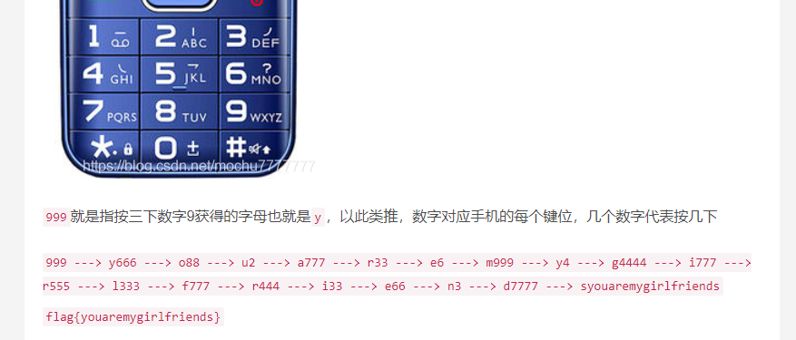

### 26键盘密码


第一行键盘数字对应字母，再转为手机键盘密码

### 希尔密码

http://www.atoolbox.net/Tool.php?Id=914

密钥为网址 如：www.atoolbox.net
### Rabbit解密

在线网站
https://www.sojson.com/encrypt_rabbit.html

需要密钥
### Quoted-printable编码

> 有多个等号

Quoted-printable可译为“可打印字符引用编码”，Quoted-printable将任何8-bit字节值可编码为3个字符：一个等号"=“后跟随两个十六进制数字(0–9或A–F)表示该字节的数值。例如，ASCII码换页符（十进制值为12）可以表示为”=0C"，

在线解密网站：
http://www.mxcz.net/tools/QuotedPrintable.aspx
http://web.chacuo.net/charsetquotedprintable

### 曼彻斯特编码

曼彻斯特编码：曼彻斯特编码将时钟和数据包含在数据流中，在传输代码信息的同时，也将时钟同步信号一起传输到对方，每位编码中有一跳变，不存在直流分量，因此具有自同步能力和良好的抗干扰性能。但每一个码元都被调成两个电平，所以数据传输速率只有调制速率的1/2。

曼彻斯特编码表示0或1有两种不同的方法：
第一种G. E. Thomas, Andrew S. Tanenbaum1949年提出的，它规定0是由低-高的电平跳变表示，1是高-低的电平跳变。
按此规则有：

编码0101（即0x5），表示原数据为00；
编码1001（0x9）表示10；
编码0110（0x6）表示01；
编码1010（0xA）表示11。
第二种IEEE 802.4（令牌总线）和低速版的IEEE 802.3（以太网）中规定, 按照这样的说法, 低-高电平跳变表示1, 高-低的电平跳变表示0。
编码0101（0x5）表示11；
编码1001（0x9）表示01；
编码0110（0x6）表示10；
编码1010（0xA）表示00；

解密脚本
```py
def conv(s):
    return hex(int(s, 2))[2:]

def IEEE802(bs):
    pass
    dict = {
        "0101": "11",
        "1001": "01",
        "0110": "10",
        "1010": "00"
    }
    bs=str(bs)
    print bs
    r = ""
    for j in range(0, len(bs), 4):
        i=bs[j:j+4]
        if i in dict.keys():
            r += dict[i]
    return r

n = 0x5555555595555A65556AA696AA6666666955 # 密文
flag = ''
bs = '0' + bin(n)[2:]
r = ''
print bs
r = IEEE802(bs)

for i in range(0, len(r), 8):
    tmp = r[i:i + 8][::-1]
    flag += conv(tmp[:4])
    flag += conv(tmp[4:])
print flag.upper()
```


### brainfuck

 +++++++++++++++++.>

漏洞利用工具：Python-Brainfuck-master

python brainfuck.py 1.txt


### Ook

在线解密网站：https://www.splitbrain.org/services/ook

### Serpent

蛇 snake 需要密钥

http://serpent.online-domain-tools.com/

### 核心价值观编码

社会主义核心价值观：富强、民主、文明、和谐；自由、平等、公正、法治；爱国、敬业、诚信、友善

http://ctf.ssleye.com/cvencode.html

https://wtool.com.cn/cvencode.html


### 盲文加密解密

https://www.qqxiuzi.cn/bianma/wenbenjiami.php?s=mangwen


### 新约佛论禅

佛曰加密

https://ctf.bugku.com/tool/todousharp
http://hi.pcmoe.net/buddha.html


### DotCode点码

https://products.aspose.app/barcode/zh-hans/recognize/dotcode
https://demo.dynamsoft.com/barcode-reader/
### 校验码

#### 奇偶校验码

用来检测数据传输过程中是否发生错误，是众多校验码中最为简单的一种。

它有两种校验方法：奇校验和偶校验

- 奇校验：原始码流+校验位 总共有奇数个1

- 偶校验：原始码流+校验位 总共有偶数个1

跟CRC类似，也是在原始码流后面，加上校验位。不同的是，它的校验位只有一位，要么是0，要么是1。并且它的校验码还可以放在码流的前面。

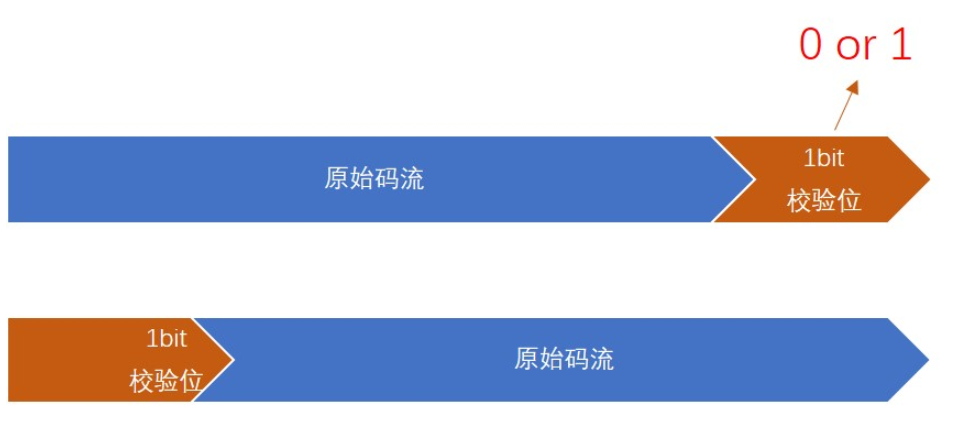


**错误检测能力**

只能检测出奇数个错误。

例如ASCII码 大写字母 A

奇校验 正确码流 11000001

```
错1位 11000011 变成了偶数个1，能检测出错误

错2位 11000010 变成了奇数个1，检测不出错误
```
错1位 01000011 变成了奇数个1，能检测出错误

错3位 11001010 变成了偶数个1，能检测出错误
```

偶校验 正确码流 01000001

错2位 01000010 变成了偶数个1，检测不出错误

错3位 01001010 变成了奇数个1，能检测出错误
```

#### 循环冗余码
#### 海明校验码

海明码公式：`2^k-1 >= n+k` 意思是:可以用来校验错误的数字个数2^k-1 要大于或者等于原数据位数n和校验位数k的和。显然在2^k中我们要留出一个数表示数据正确，所以用 `2^k-1`来代表出错的位数。

[海明码计算步骤](https://blog.csdn.net/jihezhixin/article/details/86579085?utm_medium=distribute.pc_relevant.none-task-blog-BlogCommendFromMachineLearnPai2-4.channel_param&depth_1-utm_source=distribute.pc_relevant.none-task-blog-BlogCommendFromMachineLearnPai2-4.channel_param)

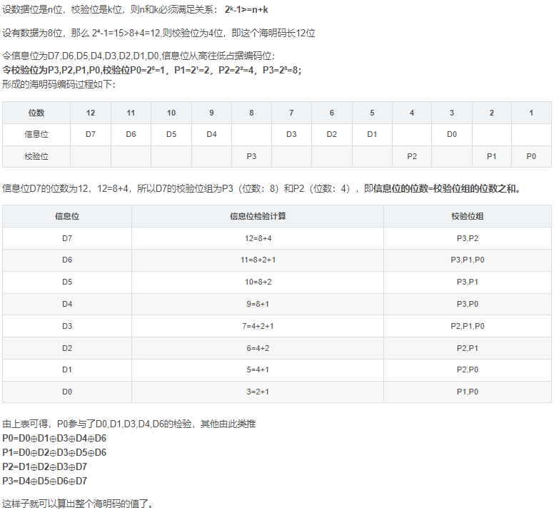

例子：
设数据为01101001，求海明码。

数据位为8，则2⁴-1=15>8+4=12,则校验位为4位，即这个海明码长12位；
D7D6D5D4D3D2D1D0=01101001；
P0=2⁰=1，P1=2¹=2，P2=2²=4，P3=2³=8；
P0=D0⊕D1⊕D3⊕D4⊕D6=1⊕0⊕1⊕0⊕1=1
P1=D0⊕D2⊕D3⊕D5⊕D6=1⊕0⊕1⊕1⊕1=0
P2=D1⊕D2⊕D3⊕D7=0⊕0⊕1⊕0=1
P3=D4⊕D5⊕D6⊕D7=0⊕1⊕1⊕0=0

则海明码为011001001101


https://blog.csdn.net/qq2489021103/article/details/109563484

https://blog.csdn.net/weixin_44831109/article/details/107011597


## 数学

## 一元二次方程在线

http://www.ab126.com/shuxue/8009.html

https://tool.520101.com/calculator/yiyuanerci/


