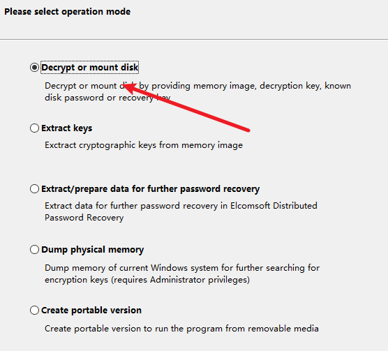

# CTF-Misc

- [CTF-Misc](#CTF-Misc)
    - [时间取证](#时间取证)
        - [时间戳](#时间戳)
    - [内存取证](#内存取证)
        - [iso](#iso)
        - [Volatility](#Volatility)
            - [常见的几个进程](#常见的几个进程)
                - [notepad.exe](#notepad.exe)
                - [TrueCrypt.exe](#TrueCrypt.exe)
                - [DumpIt.exe](#DumpIt.exe)
                - [mspaint.exe](#mspaint.exe)
                - [cmd.exe](#cmd.exe)
        - [fat](#fat)
        - [挂载修复](#挂载修复)
        - [vmdk](#vmdk)
    - [磁盘取证](#磁盘取证)
        - [磁盘分析](#磁盘分析)
            - [DiskGenius](#DiskGenius)
        - [磁盘加密解密](#磁盘加密解密)
            - [VeraCrypt](#VeraCrypt)
    - [文件取证](#文件取证)
        - [stegsolve](#stegsolve)
        - [Notepad++](#Notepad++)
        - [010editor](#010editor)
            - [编码](#编码)
            - [修改长宽](#修改长宽)
            - [粘贴复制二进制](#粘贴复制二进制)
            - [IDAT标识缺失](#IDAT标识缺失)
            - [测试异或](#测试异或)
        - [二维码扫描](#二维码扫描)
            - [QR-Research](#QR-Research)
            - [汉信码](#汉信码)
            - [修补二维码](#修补二维码)
            - [批量二维码](#批量二维码)
            - [字节转二维码](#字节转二维码)
        - [压缩包](#压缩包)
            - [压缩包分析文件头](#压缩包分析文件头)
                - [RAR](#RAR)
            - [加密的压缩包zip](#加密的压缩包zip)
                - [伪加密](#伪加密)
                    - [zip伪加密](#zip伪加密)
                    - [rar伪加密](#rar伪加密)
                - [弱密码](#弱密码)
                - [zip-图片](#zip图片)
                - [CRC32爆破](#CRC32爆破)
                - [明文攻击](#明文攻击)
                - [7z](#7z)
            - [压缩包爆破](#压缩包爆破)
                - [掩码爆破](#掩码爆破)
                - [生日爆破](#生日爆破)
                - [循环解压](#循环解压)
        - [隐写类](#隐写类)
            - [base64隐写](#base64隐写)
                - [base64转图片](#base64转图片)
            - [pyc文件](#pyc文件)
                - [pyc隐写](#pyc隐写)
                - [pyc反编译](#pyc反编译)
            - [水印隐写](#水印隐写)
                - [java盲水印](#java盲水印)
                - [盲水印](#盲水印)
                - [频域盲水印](#频域盲水印)
            - [png隐写](#png隐写)
                - [pngcheck](#pngcheck)
            - [F5隐写](F5隐写)
            - [outguess隐写](#outguess隐写)
            - [LSB隐写](#LSB隐写)
            - [TTL隐写](#TTL隐写)
            - [时间隐写](#时间隐写)
            - [零宽度字节隐写](#零宽度字节隐写)
            - [BMP隐写](#BMP隐写)
            - [SilentEye隐写](#SilentEye隐写)
        - [编程语言](#编程语言)
            - [logo语言解释器](#logo语言解释器)
            - [G语言解释器](#G语言解释器)
            - [Velato](#Velato)
            - [lolcode](#lolcode)
            - [emojicode语言](#emojicode语言)
        - [其它常用操作](#其它常用操作)
            - [Windows](#Windows)
                - [右键查看属性](#右键查看属性)
                - [文本比较](#文本比较)
                    - [Beyond_compare4](#Beyond_compare4)
                - [分帧](#分帧)
                    - [ScreenToGif](#ScreenToGif)
                - [文字识别](#文字识别)
                    - [QCR](#QCR)
                - [字词频率统计](#字词频率统计)
                - [Ps](#Ps)
                    - [颜色十六进制号](#颜色十六进制号)
                - [dnspy](#dnspy)
                - [PowerRename](#PowerRename)
                - [PyInstaller-提取器](#PyInstaller-提取器)
            - [Linux](#Linux)
                - [ELF](#ELF)
                - [字符串反转](#字符串反转)
                - [grep](#grep)
                - [binwalk](#binwalk)
                - [dd](#dd)
                - [foremost](#foremost)
                - [strings](#strings)
                - [exiftool](#exiftool)
                - [图片拼接](#图片拼接)
                - [zsteg](#zsteg)
                - [file](#file)
                - [vim](#vim)
        - [文件格式](#文件格式)
            - [常见文件头](#常见文件头)
            - [其它文件](#其它文件)
                - [apng](#apng)
                - [BGP](#BGP)
                - [OGG](#OGG)
                - [bmp](#bmp)
    - [流量取证](#流量取证)
        - [wireshark](#wireshark)
            - [分组字节流搜索](#分组字节流搜索)
            - [追踪流](#追踪流)
            - [导出HTTP对象](#导出HTTP对象)
            - [tshark](#tshark)
            - [lsass.dmp](#lsass.dmp)
            - [USB流量](#USB流量)
                - [UsbKeyboardDataHacker](#UsbKeyboardDataHacker)
            - [私钥解密](#私钥解密)
            - [流量包提取数据](#流量包提取数据)
            - [大流量统计](#大流量统计)
    - [音频取证](#音频取证)
        - [Audacity](#Audacity)
            - [导入原始数据](#导入原始数据)
        - [dtmf2num](#dtmf2num)
        - [音频LSB隐写](#音频LSB隐写)
        - [Steghide](#Steghide)
            - [steghide爆破](#steghide爆破)
        - [频谱图](#频谱图)
        - [qsstv](#qsstv)
        - [DeepSound](#DeepSound)
    - [磁盘取证](#磁盘取证)
        - [Ntfs隐写](#Ntfs隐写)
    - [DOC取证](#DOC取证)
        - [密码爆破](#密码爆破)
        - [隐藏文字](#隐藏文字)
    - [密码取证](#密码取证)
        - [古典密码类](#古典密码类)
            - [autokey爆破](#autokey爆破)
            - [encrypto](#encrypto)
            - [ALPHUCK](#ALPHUCK)
            - [toy密码](#toy密码)
        - [登录取证](#登录取证)
            - [Mozilla](#Mozilla)
            - [VNC](#VNC)
        - [密码爆破](#密码爆破)
            - [John](#John)
            - [opharack](#opharack)
        - [待分类解密](#待分类解密)
            - [CnCrypt](#CnCrypt)
    - [其它](#其它)
        - [基站定位查询](#基站定位查询)
        - [IP反查域名](#IP反查域名)
        - [坐标取证](#坐标取证)
- [文章](#文章)
    - https://ctf-wiki.org/misc/introduction/

## 时间取证

### 时间戳

https://tool.chinaz.com/tools/unixtime.aspx
## 内存取证

一般是raw、img、iso、dump文件

raw文件是内存取证工具Dumpit提取内存生成的内存转储文件，可以使用类似Volatility等内存取证分析工具进行取证分析。

### ISO

用foremost分离

### Volatility

Volatility是一款开源内存取证框架，能够对导出的内存镜像进行分析，通过获取内核数据结构，使用插件获取内存的详细情况以及系统的运行状态。

[Volatility支持的插件列表](https://www.cnblogs.com/p20050001/p/11892766.html)

```bash
git clone https://github.com/volatilityfoundation/volatility.git

# pip install pycrypto

官方Github：https://github.com/volatilityfoundation

支持pyhton2: https://github.com/volatilityfoundation/volatility

支持python3：https://github.com/volatilityfoundation/volatility3
```

https://mengsec.com/2018/10/20/CTF-Volatility/

用法：
```bash
# 先通过 imageinfo 获取系统信息
python2 vol.py -f Target.vmem imageinfo
python2 vol.py -f ../memory.img imageinfo

# 查看进程
python2 vol.py -f ../memory.img --profile=Win2003SP1x86 pslist

# dump内存
python2 vol.py -f easy_dump.img --profile=Win7SP1x64 memdump -p 2952 --dump-dir=./

# 文件扫描内存中的jpg文件
python2 vol.py -f easy_dump.img --profile=Win7SP1x64 filescan | grep -ia .jpg

# dump文件
python2 vol.py -f easy_dump.img --profile=Win7SP1x64 dumpfiles -Q 0x00000000235c8770 --dump-dir=./

# 查看cmd命令使用记录
python2 vol.py -f ../memory.img --profile=Win2003SP1x86 cmdscan

# 使用hashdump命令获取用户名
python2 vol.py -f Target.vmem --profile=Win7SP1x64 hashdump

# lsadump命令获取最后登录的用户
python2 vol.py -f Target.vmem --profile=Win7SP1x64 lsadump

# 环境变量
volatility -f FILESERV-20211222-032924.raw --profile=Win2003SP2x86 envars
```

用mimikatz插件获取
```
python2 -m pip install construct
cp mimikatz.py /volatility/plugins/
python2 vol.py  -f tmp.vmem --profile=Win7SP1x64 mimikatz
```

**raw文件**

```bash
# 分析镜像
python2 vol.py -f L-12A6C33F43D74-20161114-125252.raw imageinfo
```


```bash
# 查看进程
python2 vol.py -f L-12A6C33F43D74-20161114-125252.raw --profile=WinXPSP2x86 pslist
```


列出可疑进程

```
explorer.exe 1416
notepad.exe 280
cmd.exe 1568
nc.exe 120
DumpIt.exe 392
```


```bash
# 要获取用户的账户密码的话，用hashdump插件把hash值提取出来
python2 vol.py hashdump -f L-12A6C33F43D74-20161114-125252.raw --profile=WinXPSP2x86
```


得到结果如下：
```
Administrator:500:1e27e87bd14ec8af43714428b303e3e4:1e581aafa474dfadfdf83fc31e4fd4ea:::
Guest:501:aad3b435b51404eeaad3b435b51404ee:31d6cfe0d16ae931b73c59d7e0c089c0:::
HelpAssistant:1000:687255e91a0f559b6d75553dbd51f785:b6125736bdd2d5f154fdce59f52e39f1:::
SUPPORT_388945a0:1002:aad3b435b51404eeaad3b435b51404ee:fb41f8d1334fba131974c39bfab09512:::
```

另存为hash.txt文件

`john --wordlist=/usr/share/wordlists/rockyou.txt --rule --format=NT hash.txt `


```bash
# 提取压缩包
python2 vol.py -f L-12A6C33F43D74-20161114-125252.raw --profile=WinXPSP2x86 filescan | grep "P@ssW0rd_is_y0ur_bir7hd4y.zip"

python2 vol.py -f L-12A6C33F43D74-20161114-125252.raw --profile=WinXPSP2x86 dumpfiles -Q 0x0000000002c61318 --dump-dir=./
```


#### 常见的几个进程

##### notepad.exe

notepad.exe是记事本，一般记事本中会有内容hint或者在内存中(还未保存)

```bash
# 用notepad插件列出记事本的内容
python2 vol.py notepad -f L-12A6C33F43D74-20161114-125252.raw --profile=WinXPSP2x86

# 若出现This command does not support the profile Win7SP1x64 则直接通过PID dump notepad.exe的内存
python2 vol.py -f easy_dump.img --profile=Win7SP1x64 memdump --dump-dir=./ -p 2952

# 可以用strings查看dmp 这里由于记事本以16位little-endian存储文本，所以需要使用参数
strings -e l 2952.dmp | grep "flag{" 
```


##### TrueCrypt.exe

推测题目所给的另一个文件是使用TrueCrypt进行加密了的。进程没有退出，那么加密的密钥有可能就在进程中，将该进程作为文件导出。

使用Elcomsoft Forensic Disk Decryptor进行解密




下一步另存为即可，点击mount挂载

工具:ForensicDiskDecryptor

https://www.anxz.com/down/69216.html

序列号激活码：AEFSDRP-LWJQT-52698-FMNVW-84362

winmm.dll放到程序目录下
##### DumpIt.exe

DumpIt是一款绿色免安装的 windows 内存镜像取证工具。利用它我们可以轻松地将一个系统的完整内存镜像下来，并用于后续的调查取证工作。

```bash
# 将DumpIT.exe进程dump下来 -p为进程号
python2 vol.py -f memory.img --profile=Win2003SP1x86 memdump -p 1992 --dump-dir=./

注意，这里1992是explorer.exe的进程

# 分离dmp
foremost 1992.dmp
```
##### mspaint.exe

mspaint.exe是一个画图软件

##### cmd.exe

```bash
# 查看下cmd.exe的使用情况
python2 vol.py -f L-12A6C33F43D74-20161114-125252.raw --profile=WinXPSP2x86 cmdscan
```
### fat

VeraCrypt 进行挂载

需要挂载密码，可猜测，任意选一个挂载盘

不同的密码能开启不同的盘


打不开的文件可以winhex->工具->打开磁盘

### 挂载修复

挂载：指的就是将设备文件中的顶级目录连接到Linux根目录下的某一目录，访问此目录就等同于访问设备。

ext类型的文件需要挂载

```bash
mount attachment.img /mnt
cd /mnt
ls -al /mnt
```

修复：
```bash
extundelete attachment.img --restore-all
# 会在当前生成文件夹，如果没看到东西，尝试ls -al
```

取消挂载
```
umount /mnt/cdrom
```
#### vmdk

VMDK：（VMWare Virtual Machine Disk Format）是虚拟机VMware创建的虚拟硬盘格式，文件存在于VMware文件系统中，被称为VMFS（虚拟机文件系统）

遇到vmdk可以试试使用7z这个压缩软件打开

linux下7z解压vmdk更完整，windows下7z有问题

```bash
7z x flag.vmdk
```

### 磁盘取证

#### 磁盘分析

##### DiskGenius

一般用于对后缀名为VHD文件挂载,VHD是微软虚拟磁盘文件

DiskGenius->磁盘->打开虚拟磁盘文件
DiskGenius->Disk->Open virtual Disk File
#### 磁盘加密解密

##### VeraCrypt

磁盘取证，也可用于挂载，需要密码，且每次不一样的密码都有不一样的结果


## 文件取证

### stegsolve

Frame Browser:帧浏览器   主要是对GIF之类的动图进行分解，把动图一帧帧的放，有时候会是二维码

### Notepad++

右上角插件可转换 hex->Ascii
### 010Editor

**如何导入十六进制文件**

文件->导入十六进制文件

安装插件：Templates
### 编码

### 修改长宽

**png**
一般在第二行 6 7列

6是宽 7是高

也可以用脚本爆破对应正常的宽高


**jpg**

### 粘贴复制二进制

编辑->粘贴为

编辑->复制为

### IDAT标识缺失

对比好的png，利用png插件来增加IDAT标识

### 测试异或

取目标的十六进制与猜测的文件头异或，若都为同一个值，存在异或
## 二维码

### QR-Research

### 汉信码

需要用手机app 中国编码扫描

### 修补二维码

https://merricx.github.io/qrazybox/

完成后tools->extract

### 批量二维码

`微微二维码`

https://pc.wwei.cn/


### 字节转二维码

一个文本只有1和0 而且有40000个字符 那就是200*200的正方形

```py
from PIL import Image
with open ("1.txt",'r') as d:
	flag = Image.new('L',(200,200))
	plain = d.read()
	i = 0
	for x in range(200):
		for y in range(200):
			if (plain[i] == '0'):
				flag.putpixel([x,y],0)
			else:
				flag.putpixel([x,y],255)
			i += 1
	flag.show()
```

### 压缩包分析文件头

https://blog.csdn.net/Claming_D/article/details/105899397


#### RAR


```
D5 56 ：HEAD_CRC，2字节，也就是文件头部分的crc校验值
74 ：HEAD_TYPE，1字节，块类型，74表示块类型是文件头
20 90 ：HEAD_FLAGS，2字节，位标记，这块在资料上没找到对应的数值，不知道20 90代表什么意思。
2D 00 ：HEAD_SIZE，2字节，文件头的全部大小（包含文件名和注释）
10 00 00 00 ：PACK_SIZE，4字节，已压缩文件大小
10 00 00 00 ：UNP_SIZE，4字节，未压缩文件大小
02：HOST_OS，1字节，保存压缩文件使用的操作系统，02代表windows
C7 88 67 36：FILE_CRC，4字节，文件的CRC值
6D BB 4E 4B ：FTIME，4字节，MS DOS 标准格式的日期和时间
1D：UNP_VER，1字节，解压文件所需要的最低RAR版本
30：METHOD，1字节，压缩方式，这里是存储压缩
08 00 ：NAME_SIZE，2字节，表示文件名大小，这里文件名大小是8字节（flag.txt）
20 00 00 00 ：ATTR，4字节，表示文件属性这里是txt文件
66 6C 61 67 2E 74 78 74：FILE_NAME（文件名） ，NAME_SIZE字节大小，这里NAME_SIZE大小为8
再往后是txt文件内容，一直到第六行 65 结束，下面是另一个文件块的开始

这个块中存在两个crc值，一个是文件头块中从块类型到文件名这38个字节的校验，后一个则是压缩包中所包含文件的crc校验，解压时，会计算解压后生成文件的crc值，如果等于这里的crc，则解压完成，如果不同，则报错中断。
```
### 加密的压缩包zip

ARCHPR打不开的原因：(这个档案文件是用xxx版本创建的。目前ARCHPR不支持)

1.版本号不正确,改为0即可


#### 伪加密

用winhex查看全局加密标志和局部加密标志


### zip伪加密
工具：ZipCenOp.jar

`java -jar ZipCenOp.jar r 111.zip` 解密

### rar伪加密


第24个字节，该字节尾数为4表示加密，0表示无加密，将尾数改为0即可解开伪加密

### 注释


压缩包注释一般会提示解压密码思路


#### 弱密码

题目中会有提示或者给出字典，直接爆破
#### zip—图片

一般是隐写题目，从图片中找出密码
#### CRC32爆破

CRC32:CRC本身是“冗余校验码”的意思，CRC32则表示会产生一个32bit（8位十六进制数）的校验值。

每个文件都有唯一的CRC32值，即便数据发生很微小的变化，都会导致CRC32的值变化。假设知道段数据的长度和CRC32值，那么便可穷举数据，与其CRC32的值比较匹配，这样就可以达到暴力破解的目的。但是这么做缺点也很明显，就是`只适用于数据内容较小的文件`

注意：一般数据内容`小于5Bytes(<=4Bytes)`即可尝试通过爆破CRC32穷举数据内容

https://mochu.blog.csdn.net/article/details/110206427


内容为1Byte的CRC爆破
```py
import binascii
import string

def crack_crc():
    print('-------------Start Crack CRC-------------')
    crc_list = [0xda6fd2a0, 0xf6a70, 0x70659eff, 0x862575d]#文件的CRC32值列表，注意顺序
    comment = ''
    chars = string.printable
    for crc_value in crc_list:
        for char1 in chars:
            char_crc = binascii.crc32(char1.encode())#获取遍历字符的CRC32值
            calc_crc = char_crc & 0xffffffff#将获取到的字符的CRC32值与0xffffffff进行与运算
            if calc_crc == crc_value:#将每个字符的CRC32值与每个文件的CRC32值进行匹配
                print('[+] {}: {}'.format(hex(crc_value),char1))
                comment += char1
    print('-----------CRC Crack Completed-----------')
    print('Result: {}'.format(comment))

if __name__ == '__main__':
    crack_crc()
```

内容为2Byte的CRC爆破
```py
import binascii
import string

def crack_crc():
    print('-------------Start Crack CRC-------------')
    crc_list = [0xef347b51, 0xa8f1b31e, 0x3c053787, 0xbbe0a1b]#文件的CRC32值列表，注意顺序
    comment = ''
    chars = string.printable
    for crc_value in crc_list:
        for char1 in chars:
            for char2 in chars:
                res_char = char1 + char2#获取遍历的任意2Byte字符
                char_crc = binascii.crc32(res_char.encode())#获取遍历字符的CRC32值
                calc_crc = char_crc & 0xffffffff#将获取到的字符的CRC32值与0xffffffff进行与运算
                if calc_crc == crc_value:#将获取字符的CRC32值与每个文件的CRC32值进行匹配
                    print('[+] {}: {}'.format(hex(crc_value),res_char))
                    comment += res_char
    print('-----------CRC Crack Completed-----------')
    print('Result: {}'.format(comment))

if __name__ == '__main__':
    crack_crc()
```

内容为3Byte的CRC爆破
```py
import binascii
import string

def crack_crc():
    print('-------------Start Crack CRC-------------')
    crc_list = [0x2b17958, 0xafa8f8df, 0xcc09984b, 0x242026cf]#文件的CRC32值列表，注意顺序
    comment = ''
    chars = string.printable
    for crc_value in crc_list:
        for char1 in chars:
            for char2 in chars:
                for char3 in chars:
                    res_char = char1 + char2 + char3#获取遍历的任意3Byte字符
                    char_crc = binascii.crc32(res_char.encode())#获取遍历字符的CRC32值
                    calc_crc = char_crc & 0xffffffff#将遍历的字符的CRC32值与0xffffffff进行与运算
                    if calc_crc == crc_value:#将获取字符的CRC32值与每个文件的CRC32值进行匹配
                        print('[+] {}: {}'.format(hex(crc_value),res_char))
                        comment += res_char
    print('-----------CRC Crack Completed-----------')
    print('Result: {}'.format(comment))

if __name__ == '__main__':
    crack_crc()
```

内容为4Byte的CRC爆破
```py
import binascii
import string

def crack_crc():
    print('-------------Start Crack CRC-------------')
    crc_list = [0xc0a3a573, 0x3cb6ab1c, 0x85bb0ad4, 0xf4fde00b]#文件的CRC32值列表，注意顺序
    comment = ''
    chars = string.printable
    for crc_value in crc_list:
        for char1 in chars:
            for char2 in chars:
                for char3 in chars:
                    for char4 in chars:
                        res_char = char1 + char2 + char3 + char4#获取遍历的任意4Byte字符
                        char_crc = binascii.crc32(res_char.encode())#获取遍历字符的CRC32值
                        calc_crc = char_crc & 0xffffffff#将遍历的字符的CRC32值与0xffffffff进行与运算
                        if calc_crc == crc_value:#将获取字符的CRC32值与每个文件的CRC32值进行匹配
                            print('[+] {}: {}'.format(hex(crc_value),res_char))
                            comment += res_char
    print('-----------CRC Crack Completed-----------')
    print('Result: {}'.format(comment))

if __name__ == '__main__':
    crack_crc()
```

内容为4-6byte的文件

https://github.com/theonlypwner/crc32

#### 明文攻击

题给的压缩包里面有一个flag.txt，和刚解压出的txt大小相同，则可以明文攻击

有时候需要删掉其他文件，只保留同大小的文件

攻击时要注意txt重新压缩（找对应的压缩软件winrar）

有时候 zip的文件需要bandzip压缩，

用archpr2明文攻击 - 破解类型 纯文本/明文攻击

爆破时间较长 点击确定保存为zip文件，解压出现flag


#### 7z

7z能直接解压伪加密的文件
### 压缩包爆破

archpr2 可爆破rar

#### 掩码爆破

archpr工具可掩码爆破

掩码:知道密码中的一部分,只需按规则构造其余部分

15????????.??

结合时间戳

#### 生日爆破

19700000-20000000

#### 循环解压

```bash
while [ "`find . -type f -name '*.tar.xz' | wc -l`" -gt 0 ]; do
    find -type f -name "*.tar.xz" -exec tar xf '{}' \;
    -exec rm -- '{}' \;;
done;
```

### 隐写类

#### base64隐写

py脚本跑
##### base64转图片

https://the-x.cn/base64 右下角另存为即可

#### pyc文件
##### pyc隐写
https://github.com/AngelKitty/stegosaurus

https://zhuanlan.zhihu.com/p/51226097

Stegosaurus 是一款隐写工具，它允许我们在 Python 字节码文件( pyc 或 pyo )中嵌入任意 Payload 。由于编码密度较低，因此我们嵌入 Payload 的过程既不会改变源代码的运行行为，也不会改变源文件的文件大小。 Payload 代码会被分散嵌入到字节码之中，所以类似 strings 这样的代码工具无法查找到实际的 Payload 。 Python 的 dis 模块会返回源文件的字节码，然后我们就可以使用 Stegosaurus 来嵌入 Payload 了。


python -m stegosaurus aaa.py -s --payload "test{123}"

./stegosaurus -x O_O.pyc

直接用github releases已经打包好的bin文件 kali下运行


##### pyc反编译

https://tool.lu/pyc/

#### 水印隐写


##### java盲水印

https://github.com/ww23/BlindWatermark

只需一张图片

`java -jar BlindWatermark.jar decode -c bingbing.jpg decode.jpg`
##### 盲水印

https://github.com/chishaxie/BlindWaterMark


```py

pip install -r requirements.txt

#requirements.txt里面版本有点问题，修改别的版本即可
#合成盲水印图
python bwm.py encode hui.png wm.png hui_with_wm.png

#提取图中的盲水印 (需要原图)
python bwm.py decode hui.png hui_with_wm.png wm_from_hui.png
```

##### 频域盲水印

https://github.com/linyacool/blind-watermark

```py
import cv2
import numpy as np
import random
import os
from argparse import ArgumentParser

ALPHA = 5

def build_parser():
    parser = ArgumentParser()
    parser.add_argument('--original', dest='ori', required=True)
    parser.add_argument('--image', dest='img', required=True)
    parser.add_argument('--result', dest='res', required=True)
    parser.add_argument('--alpha', dest='alpha', default=ALPHA)
    return parser

def main():
    parser = build_parser()
    options = parser.parse_args()
    ori = options.ori
    img = options.img
    res = options.res
    alpha = options.alpha
    if not os.path.isfile(ori):
        parser.error("original image %s does not exist." % ori)
    if not os.path.isfile(img):
        parser.error("image %s does not exist." % img)
    decode(ori, img, res, alpha)

def decode(ori_path, img_path, res_path, alpha):
    ori = cv2.imread(ori_path)
    img = cv2.imread(img_path)
    ori_f = np.fft.fft2(ori)
    img_f = np.fft.fft2(img)
    height, width = ori.shape[0], ori.shape[1]
    watermark = (ori_f - img_f) / alpha
    watermark = np.real(watermark)
    res = np.zeros(watermark.shape)
    random.seed(height + width)
    x = range(height / 2)
    y = range(width)
    random.shuffle(x)
    random.shuffle(y)
    for i in range(height / 2):
        for j in range(width):
            res[x[i]][y[j]] = watermark[i][j]
    cv2.imwrite(res_path, res, [int(cv2.IMWRITE_JPEG_QUALITY), 100])

if __name__ == '__main__':
    main()
```

```py
# 如果报错装这个
pip install opencv-python==4.2.0.32 -i http://mirrors.aliyun.com/pypi/simple --trusted-host mirrors.aliyun.com

# 解密命令
python2 pinyubwm.py --original huyao.png --image stillhuyao.png --result out.png

```

#### png隐写

#### pngcheck

```bash
pngcheck -v hint.png
```

一般检查png是否缺块

#### F5隐写

F5隐写-steganography

```bash
git clone https://github.com/matthewgao/F5-steganography

java Extract 文件
java Extract 文件 -p 密码 -e 输出文件
```


#### outguess隐写

```bash
git clone https://github.com/crorvick/outguess
cd outguess
./configure && make && make install

# 加密
outguess -k "my secret key" -d hidden.txt demo.jpg out.jpg

# 解密
 outguess -k "my secret key" -r out.jpg hidden.txt

```


#### LSB隐写

一般判断方式 stegsolve lsb观察有东西

1. Stegosolve

- Anglyse-Data-Extract 选择Bit Planes 的0 红绿蓝都试试 -save bin


https://github.com/livz/cloacked-pixel

python2 lsb.py extract 1.png 1.txt 123456

#### TTL隐写

https://www.cnblogs.com/yunqian2017/p/14671031.html

TTL隐写中用到四个值：00 111111（63）,01 111111（127）,10 111111（191）,11 111111（255）,解密的时候只取前两位，然后转换成ascii

```
IP报文在路由间穿梭的时候每经过一个路由，TTL就会减1，当TTL为0的时候，该报文就会被丢弃。
    TTL所占的位数是8位，也就是0-255的范围，但是在大多数情况下通常只需要经过很小的跳数就能完成报文的转发，
    远远比上限255小得多，所以我们可以用TTL值的前两位来进行传输隐藏数据。
    如：须传送H字符，只需把H字符换成二进制，每两位为一组，每次填充到TTL字段的开头两位并把剩下的6位设置为1（xx111111），这样发4个IP报文即可传送1个字节。
```

#### 时间隐写

例子：得到一张flag.gif。考虑一下每帧停顿的时间。

使用`identify`命令。

`identify -format “%T” flag.gif`

会得到一串数字

#### 零宽度字节隐写

vim打开可以发现有很多<200b>

http://330k.github.io/misc_tools/unicode_steganography.html

https://yuanfux.github.io/zero-width-web/


#### BMP隐写

wbStego4.3open 加解密


保存为txt
#### SilentEye隐写

SilentEye是一款免费的图片信息隐藏工具,采用全新的隐写算法和加密算法,帮助用户轻松隐藏在图片中跨平台应用程序设计中。

也可以隐藏声音

https://sourceforge.net/projects/silenteye/

### 编程语言
#### logo语言解释器

```
cs pu lt 90 fd 500 rt 90 pd fd 100 rt 90 repeat 18[fd 5 rt 10]
```

https://www.calormen.com/jslogo/

#### G语言解释器

https://ncviewer.com/


#### Velato

http://velato.net/

Velato是一种编程语言，由Daniel Temkin在 2009 年创建，它使用 MIDI 文件作为源代码：音符的模式决定命令。

文件头为 MThd

Vlt.exe decode_it

会生成decode_it.exe

cmd下运行得到结果

#### lolcode

https://www.dcode.fr/lolcode-language


#### emojicode语言

https://www.emojicode.org/

kali
`emojicodec math.emojic`

- 参考文章：https://mp.weixin.qq.com/s/YjX8TBcyfFhD18kMNM3UcA
### 其它常用操作

#### Windows
##### 右键查看属性

右键查看属性-详情信息-备注

#### 文本比较
##### Beyond_compare4
##### 分帧
###### ScreenToGif

gif分帧工具

打开编辑器拖进图片即可
#### 文字识别
##### QCR

https://www.onlineocr.net/zh_hant/

识别后，需要手动纠正很多容易识别错误的地方

#### 字词频率统计

在线网站：http://www.aihanyu.org/cncorpus/CpsTongji.aspx


#### Ps

##### 颜色十六进制号

用PS的颜色取样器工具，点击图片上的颜色


颜色后两位十六进制转ascii

#### dnspy

dnspy反编译工具

将dll拖进去，右键编辑类 可修改后编译

#### PowerRename

Windows微软的一款批量命名工具软件


#### PyInstaller-提取器

https://github.com/extremecoders-re/pyinstxtractor

PyInstaller Extractor 是一个 Python 脚本，用于提取 PyInstaller 生成的 Windows 可执行文件的内容。可执行文件中的 pyz 文件（通常是 pyc 文件）的内容也被提取出来。

#### Linux

##### ELF

./ 执行即可

##### 字符串反转

```bash
cat 1 | rev
```
##### grep

linux之用 grep -r 关键字 快速搜索在目录下面的含有关键字的文件

```bash
grep -r 'CTF' ./output

grep -rn 'flag{' ./*
grep -rn 'key' ./*
grep -rn 'password' ./*
grep -rn 'ctf' ./*
```
##### binwalk

kali
```py
binwalk xxx
binwalk -e xxx
```

binwalk分离出的zlib文件往往隐藏信息

如：2AE96和2AE96.zlib 2AE96.zlib是压缩的zlib块，2AE96是解压后的zlib块。

```
XML document, version: "1.0"

表示ppt文件、docx文件
```

##### dd

分离指定命令

```bash
dd if=attachment.jpg of=test.zip skip=21639 bs=1
```

##### foremost

kali下用foremost

##### strings

打印文件中可打印的字符

strings 4.png

##### exiftool

跟右键查看属性类似 一个升级版

用于读写和处理图像

exiftool attachment.jpg

kali:

`exiftool * | grep flag`


也可以用kali下的strings 4.png

##### 图片拼接

kali

```bash
montage -tile 10x12 -geometry 200x100+0+0 *jpg flag.jpg
gaps --image=flag.jpg --generations=40 --population=120 --size=100
```

环境安装：
```
apt-get install graphicsmagick-imagemagick-compat
git clone https://github.com/nemanja-m/gaps.git
cd gaps
python3 set-up.py install
pip3 install -r requirement.txt
```
##### zsteg

zsteg可以检测PNG和BMP图片里的隐写数据。

```bash
git clone https://github.com/zed-0xff/zsteg
cd zsteg/
gem install zsteg


# 查看LSB信息
zsteg pcat.png

# 查看所有通道全部信息
zsteg -a 1.png

# 发现DOS扇区数据，用-e命令提取
zsteg -e "b8,rgb,lsb,xy" att.png > diskimage.dat

# testdisk恢复文件
testdisk diskimage.dat
```

##### file

```bash
file xxx
```
可查看文件详情信息


如

```
Linux rev 1.0 ext3 filesystem data, UUID=f2b1e8fa-29a6-454b-b6df-6182044790bc (needs journal recovery) (large files)
```

可知是ext3文件 需要挂载


##### vim

```bash
# 恢复交换文件
vim -r .swp
```
### 文件格式

#### 常见文件头

https://vxhly.github.io/views/windows/file-header-and-tail.html#%E4%BB%8E-ultraedit-%E6%8F%90%E5%8F%96%E7%9A%84%E6%96%87%E4%BB%B6%E5%A4%B4%E4%BF%A1%E6%81%AF

```
JPEG (jpg)，                        　　文件头：FFD8FF E0　　　　　　　　　　　　　　　　　　　　 文件尾：FF D9　　　　　　　　　　　　　　　
PNG (png)，                       　　 文件头：89504E47　　　　　　　　　　　　　　　　　　　　　　文件尾：AE 42 60 82
GIF89 (gif)，                           　　文件头：4749463839　　　　　　　　　　　　　　　　　　　　　　文件尾：00 3B
ZIP Archive (zip)，                     文件头：504B0304　　　　　　　　　　　　　　　　　　　　　　文件尾：50 4B
TIFF (tif)，                           　  文件头：49492A00　　　　　　　　　　　　　　　　　　　　　　文件尾：
Windows Bitmap (bmp)，      　  文件头：424D　　　　　　　　　　　　　　　　　　　　　　　　 文件尾：
CAD (dwg)，                        　  文件头：41433130　　　　　　　　　　　　　　　　　　　　　　文件尾：
Adobe Photoshop (psd)，          文件头：38425053　　　　　　　　　　　　　　　　　　　　　　文件尾：
Rich Text Format (rtf)，             文件头：7B5C727466　　　　　　　　　　　　　　　　　　　　  文件尾：
XML (xml)，                              文件头：3C3F786D6C　　　　　　　　　　　　　　　　　　　　 文件尾：
HTML (html)，                           文件头：68746D6C3E
Email [thorough only] (eml)，     文件头：44656C69766572792D646174653A
Outlook Express (dbx)，            文件头：CFAD12FEC5FD746F
Outlook (pst)，                         文件头：2142444E
MS Word/Excel (xls.or.doc)，      文件头：D0CF11E0
MS Access (mdb)，                    文件头：5374616E64617264204A
WordPerfect (wpd)，                  文件头：FF575043
Adobe Acrobat (pdf)，               文件头：255044462D312E
Quicken (qdf)，                         文件头：AC9EBD8F
Windows Password (pwl)，         文件头：E3828596

RAR Archive (rar)，                    文件头：52 61 72 21 1A 07 00 文件尾：0700
Wave (wav)，                            文件头：57415645
AVI (avi)，                                 文件头：41564920
Real Audio (ram)，                     文件头：2E7261FD
Real Media (rm)，                       文件头：2E524D46
MPEG (mpg)，                           文件头：000001BA
MPEG (mpg)，                           文件头：000001B3
Quicktime (mov)，                     文件头：6D6F6F76
Windows Media (asf)，               文件头：3026B2758E66CF11
MIDI (mid)，                              文件头：4D546864
gzip 文件头：1F 8B
```

#### 其它文件

##### apng

https://products.aspose.app/imaging/zh-hans/image-view

免费在线图像查看器。建议用这个 更高清准确点

kali下用ffmpeg转为gif

```bash
ffmpeg -i girl.apng -f gif out.gif
```
##### BGP

BPG（Better Portable Graphics）是一种新的图像格式。它的目的是在质量或文件大小有问题时替换 JPEG 图像格式

工具下载地址：https://bellard.org/bpg/

直接将BGP拖动到bgview.exe即可

##### OGG

OGG是一种音频压缩格式，扩展为.ogg,用audacity打开

##### bmp

https://www.cnblogs.com/robin-oneway/p/13932982.html


## 流量取证
### Wireshark
#### 过滤器

过滤POST包

```
http.request.method==POST
```

去掉404
```
http.response.code !=404
```

```bash
ip.contains "flag" #
tcp contains "KEY" # 搜索tcp协议有没有KEY关键字
udp contains "flag" # 搜索UDP协议有没有flag关键字
```

tcp流
```
tcp.stream eq 0
```

#### 分组字节流搜索

Ctrl+F 可打开如下


可以快速搜索关键字符串

如：password flag {} 对应比赛需求关键字等

#### 追踪流

例子：TCP追踪流 点击TCP右键追踪流往往有flag以及关键字


#### 导出HTTP对象

文件->导出对象->save all->选择一个文件夹

内容较多的时候可以拖到linux跑 ctf flag啥的

`grep -r 'CTF' ./new/`

#### tshark

```
tshark -r sqltest.pcapng -Y "http.request" -T fields -e http.request.full_uri > data.txt
tshark -r misc4.pcapng -Y "tcp && ip.src == 106.75.209.165" -T fields -e data > 1.txt
```

-r 读取文件
-Y 过滤语句
-T pdml|ps|text|fields|psml,设置解码结果输出的格式
-e 输出特定字段

http.request.uri http请求的uri部分


　-w: -w <outfile|-> 设置raw数据的输出文件。这个参数不设置，tshark将会把解码结果输出到stdout,“-w -”表示把raw输出到stdout。如果要把解码结果输出到文件，使用重定向“>”而不要-w参数。
　　-F: -F <output file type>,设置输出的文件格式，默认是.pcapng,使用tshark -F可列出所有支持的输出文件类型。
　　-V: 增加细节输出;
　　-O: -O <protocols>,只显示此选项指定的协议的详细信息。
　　-P: 即使将解码结果写入文件中，也打印包的概要信息；
　　-S: -S <separator> 行分割符
　　-x: 设置在解码输出结果中，每个packet后面以HEX dump的方式显示具体数据。
　　-T: -T pdml|ps|text|fields|psml,设置解码结果输出的格式，包括text,ps,psml和pdml，默认为text
　　-e: 如果-T fields选项指定，-e用来指定输出哪些字段;
　　-E: -E <fieldsoption>=<value>如果-T fields选项指定，使用-E来设置一些属性，比如
　　　　header=y|n
　　　　separator=/t|/s|<char>
　　　　occurrence=f|l|a
　　　　aggregator=,|/s|<char>
　　-t: -t a|ad|d|dd|e|r|u|ud 设置解码结果的时间格式。“ad”表示带日期的绝对时间，“a”表示不带日期的绝对时间，“r”表示从第一个包到现在的相对时间，“d”表示两个相邻包之间的增量时间（delta）。
　　-u: s|hms 格式化输出秒；
　　-l: 在输出每个包之后flush标准输出
　　-q: 结合-z选项进行使用，来进行统计分析；
　　-X: <key>:<value> 扩展项，lua_script、read_format，具体参见 man pages；
　　-z：统计选项，具体的参考文档;tshark -z help,可以列出，-z选项支持的统计方式。

#### lsass.dmp

lsass是windows系统的一个进程，用于本地安全和登陆策略。mimikatz可以从 lsass.exe 里获取windows处于active状态账号明文密码。本题的lsass.dmp就是内存运行的镜像，也可以提取到账户密码

https://github.com/gentilkiwi/mimikatz/releases/

以管理员身份运行
```
privilege::debug
sekurlsa::minidump lsass.dmp
sekurlsa::logonpasswords full

```

### USB流量

usb取证 wireshark里全是USB协议流量数据包
#### UsbKeyboardDataHacker

https://github.com/WangYihang/UsbKeyboardDataHacker

虚拟机下运行(建议在ubuntu下跑,kali下跑有点问题，主要是tshark问题)

`python UsbKeyboardDataHacker.py bingbing.pcapng`

删掉`2<del>`


**tshark提取USB流量**

```bash
tshark -r bingbing.pcapng -T fields -e usb.capdata > usbdata.txt
```
### 私钥解密

在流量包发现私钥后另存为本地1.key

编辑->首选项->protocols->TLS 把1.key导入即可，追踪TLS流

例题：greatescape

### 流量包提取数据

以下是提取ICMP最后8位的例子
```py
from scapy.all import *

packets = rdpcap('out.pcapng')

for packet in packets:
    if packet.haslayer(ICMP):
        if packet[ICMP].type == 0:
            print packet[ICMP].load[-8:]

```

### 大流量统计

统计出现最多的IP
统计 -> IPv4 Statistics -> All Addresses
## 音频取证

### Audacity

关于摩斯电码的一个小技巧

文件->导出为wav（若有两个声道，则先分离立体声到单音道）


kali(kali右上角要开启声音)
```bash
morse2ascii good.wav
```


将`t`替换为`-`，e替换为`.`

#### 导入原始数据

s8后缀

### dtmf2num


DTMF拨号音识别

dtmf2num.exe girlfriend.wav


### 音频LSB隐写

SilentEye工具解码

### Steghide

Steghide是一个可以将文件隐藏到图片或音频中的工具

```bash
apt-get install steghide

# 隐藏文件
steghide embed -cf [图片文件载体] -ef [待隐藏文件]
steghide embed -cf 1.jpg -ef 1.txt

# 查看图片中嵌入的文件信息
steghide info 1.jpg

# 提取图片中隐藏的文件
steghide extract -sf 1.jpg
```

#### steghide爆破

kali下运行，文件为flag.jpg
```py
#python3运行
from subprocess import *

def foo():
    stegoFile='flag.jpg'#隐写的图片
    extractFile='result.txt'#爆破的密码
    passFile='english.dic'#字典

    errors=['could not extract','steghide --help','Syntax error']
    cmdFormat='steghide extract -sf "%s" -xf "%s" -p "%s"'
    f=open(passFile,'r')

    for line in f.readlines():
        cmd=cmdFormat %(stegoFile,extractFile,line.strip())
        p=Popen(cmd,shell=True,stdout=PIPE,stderr=STDOUT)
        content=str(p.stdout.read(),'gbk')
        for err in errors:
            if err in content:
                break
        else:
            print (content),
            print ('the passphrase is %s' %(line.strip()))
            f.close()
            return

if __name__ == '__main__':
    foo()
    print ('ok')
    pass
```
### 频谱图

https://www.sonicvisualiser.org/download.html

layer->Add Peak Frequency Spectrogram或者Shift+K

audacity 转为频谱图，在声道左侧下拉即可

### qsstv

慢扫描电视（SSTV）
慢扫描电视（Slow-scan television）是业余无线电爱好者的一种主要图片传输方法，慢扫描电视通过无线电传输和接收单色或彩色静态图片。


kali安装QSSTV

`apt-get install qsstv`

Options->Configuration->Sound勾选From file

然后点击这个小按钮，选择attachment.wav开始解码


### DeepSound

https://deepsound.soft112.com/


存在密码的话，需要破解脚本

https://github.com/magnumripper/JohnTheRipper/blob/bleeding-jumbo/run/deepsound2john.py

`python3 deepsound2john.py final_flag.wav>hashes.txt`
`john hashes.txt`


## 磁盘取证

### Ntfs隐写

工具：NtfsStreamsEditor

虚拟机 有些需要winrar、7z解压才能提取到

## DOC取证

flag有时候把颜色设置为白色 需要全选换成可见颜色

https://www.cnblogs.com/WhiteHatKevil/articles/10051582.html

### 密码爆破

https://down.52pojie.cn/?query=

Accent OFFICE Password Recovery v5.1 CracKed By Hmily[LCG][LSG]

一般猜测四位纯数字


### 隐藏文字

文件->选项->显示->隐藏文字

格式刷或者右键文字隐藏去掉 就可以复制

### doc改为zip

ppt也可以改为zip

grep -rn 'flag{' ./*


## 密码取证

https://passwordrecovery.io/zip-file-password-removal/

据说是个在线爆破工具，但用不了 先放着吧
### 古典密码类
#### autokey爆破

py文件下载地址

```
http://www.practicalcryptography.com/cryptanalysis/stochastic-searching/cryptanalysis-autokey-cipher/

配置文件下载地址

http://www.practicalcryptography.com/cryptanalysis/text-characterisation/quadgrams/#a-python-implementation
```

需要先下载三个配置文件，两个txt一个ngram_score.py文件

安装pycipher库

`pip install pycipher`

py文件里改一下要爆破的字符串，python2环境运行

`python2 break_autokey.py`

#### encrypto

https://macpaw.com/encrypto

Encrypto 接受任何文件或文件夹并为其添加 AES-256 加密。通过加密，您知道您的文件非常安全，只有合适的人才能访问它。Encrypto 接受任何文件或文件夹并为其添加 AES-256 加密。通过加密，您知道您的文件非常安全，只有合适的人才能访问它。

.crypto格式

#### ALPHUCK

https://www.dcode.fr/alphuck-language

#### toy密码

https://eprint.iacr.org/2020/301.pdf

```py
list1 = {'M':'ACEG','R':'ADEG','K':'BCEG','S':'BDEG','A':'ACEH','B':'ADEH','L':'BCEH','U':'BDEH','D':'ACEI','C':'ADEI','N':'BCEI','V':'BDEI','H':'ACFG','F':'ADFG','O':'BCFG','W':'BDFG','T':'ACFH','G':'ADFH','P':'BCFH','X':'BDFH','E':'ACFI','I':'ADFI','Q':'BCFI','Y':'BDFI'}
list2 = original_list = ['M','R','K','S','A','B','L','U','D','C','N','V','H','F','O','W','T','G','P','X','E','I','Q','Y']
list2_re =list2[::-1]

ori_str = 'BCEHACEIBDEIBDEHBDEHADEIACEGACFIBDFHACEGBCEHBCFIBDEGBDEGADFGBDEHBDEGBDFHBCEGACFIBCFGADEIADEIADFH'

flag_1 = ''
for i in range(0,len(ori_str),4):
    _val = ori_str[i:i+4]
    for key, val in list1.items():
        if val == _val:
            flag_1 += key
print(flag_1)
flag = ''
for i in flag_1:
    for j,k in enumerate(list2):
        if i == k:
            flag += list2_re[j]
print(flag)
```

### 登录取证

#### Mozilla

https://github.com/lclevy/firepwd

Firepwd.py，一个用于解密 Mozilla 保护密码的开源工具

默认情况下，firepwd.py 处理当前目录中的 key3.db（或 key4.db）和 signons.sqlite（logins.json）文件，但可以使用 -d 选项提供替代目录。不要忘记末尾的“/”。

`python3 firepwd.py logins.json `

#### VNC

https://github.com/x0rz4/vncpwd VNC密码解密工具

`vncpwd.exe 375ebe8670b3c6f3`

例如得到"Password"=hex:37,5e,be,86,70,b3,c6,f3


### 密码爆破

#### John

hashdump出来的NTLM Hash

另存为hash.txt
```
Administrator:500:0182bd0bd4444bf867cd839bf040d93b:c22b315c040ae6e0efee3518d830362b:::
Guest:501:aad3b435b51404eeaad3b435b51404ee:31d6cfe0d16ae931b73c59d7e0c089c0:::
HelpAssistant:1000:132893a93031a4d2c70b0ba3fd87654a:fe572c566816ef495f84fdca382fd8bb:::
```

```bash
john --wordlist=/usr/share/john/password.lst --rule --format=NT hash.txt
```

#### opharack

基于彩虹表的爆破

ophcrack: https://sourceforge.net/projects/ophcrack/
ophcrack-tables: https://ophcrack.sourceforge.io/tables.php

### 待分类解密

#### CnCrypt

https://72k.us/file/20044976-439996462

目前用到解密ccx

在虚拟机打开 需要密码


## 其它

### 基站定位查询
https://v.juhe.cn/cell/Triangulation/index.html?s=inner

### IP反查域名

https://www.ipip.net/ip.html

### 坐标取证

**情况1**
如:坐标转二维码
```
10 10
10 11
10 13
....
```

```bash
sudo apt-get install gnuplot
gnuplot
plot "文件名"
```

**情况2**

```
(376, 38462.085), (485, 49579.895)
```

```py
import matplotlib.pyplot as plt
import numpy as np
import matplotlib as mpl


mpl.rcParams['font.family'] = 'sans-serif'
mpl.rcParams['font.sans-serif'] = 'NSimSun,Times New Roman'

with open('dataset.txt', 'r') as f:
	lines = f.readlines()
	for line in lines:
		line = eval(line)
		for tup in line:
			x, y = tup[0], tup[1]
			plt.plot(x, y, '.', color='black')
			plt.xlabel('x')
			plt.ylabel('y')
plt.title('Data')
plt.legend()
plt.show()
```