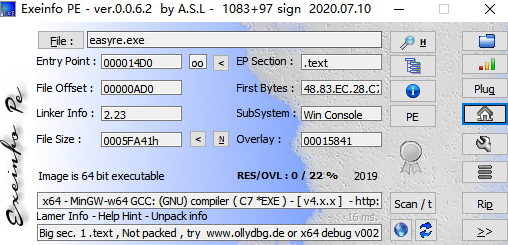
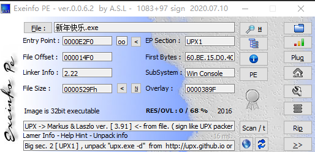

# CTF-Reverse

- [工具](#工具)
    - [查壳](#查壳)
        - [ExeinfoPe](#ExeinfoPe)
    - [脱壳加壳](#脱壳加壳)
        - [UPX](#UPX)
    - [反编译](#反编译)
        - [IDA](#IDA)
            - [常用快捷键](#常用快捷键)
        - [安卓](#安卓)
            - [AndroidKiller](#AndroidKiller)

- [总结文章](#总结文章)
    - [APP反篡改](#APP反篡改)
        - [工具](#工具)

## 工具

### 查壳
#### ExeinfoPe

Exeinfo PE是一个免费的查壳利器,基本上算是比较完整的万能查壳软件

支持查看加密程序的PE信息、编译信息、是否加壳、输入输出表、入口地址等信息

如图显示Image is 64 bit executable则用ida 64位打开

#### file

linux命令

`file 文件名`
### 脱壳加壳
#### UPX

`upx.exe -d 1.exe`

### 反编译

#### IDA

不同版本的IDA打开显示效果不一样，可以多试试
##### 常用快捷键

- shift+F12 显示字符串表
    - x点击选择，tab可查看伪代码
#### 安卓

##### AndroidKiller

Android Killer是一款可以对APK进行反编译的工具，它能够对反编译后的Smali文件进行修改，并将修改后的文件进行打包。

文件名称需要修改，不能超过30个字符

## 总结文章

### #APP反篡改

- 某APP逆向分析与通讯解密：https://blog.thekingofduck.com/post/Android-Program-Reverse-Analysis/
- Android https过反抓包的一些总结：https://www.anquanke.com/post/id/201219
- 部分APP无法代理抓包的原因及解决方法：https://www.cnblogs.com/lulianqi/p/11380794.html#_label1

#### 工具
    - jadx：https://github.com/skylot/jadx