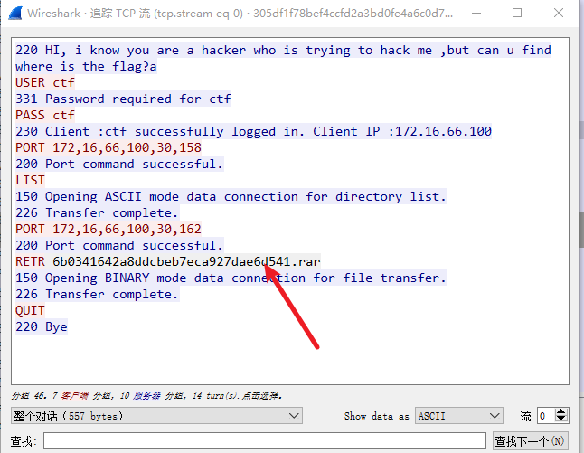

# BUUCTF-MISC

- [BUUCTF-MISC](#BUUCTF-MISC)
    - [二维码扫描](#二维码扫描)
    - [Webshell](#Webshell)
    - [神秘龙卷风](#神秘龙卷风)
    - [面具下的flag](#面具下的flag)
    - [刷新过的图片](#刷新过的图片)
    - [[BJDCTF2020]认真你就输了](#[BJDCTF2020]认真你就输了)
    - [菜刀666](#菜刀666)
    - [[BJDCTF2020]藏藏藏](#[BJDCTF2020]藏藏藏)
    - [秘密文件](#秘密文件)
    - [你猜我是个啥](#你猜我是个啥)
    - [神奇的二维码](#神奇的二维码)
    - [鸡你太美](#鸡你太美)
    - [just_a_rar](#just_a_rar)
    - [穿越时空的思念](#穿越时空的思念)
    - [纳尼](#纳尼)
    - [outguess](#outguess)
    - [我有一只马里奥](#我有一只马里奥)
    - [谁赢了比赛？](#谁赢了比赛？)
    - [excel破解](#excel破解)
    - [gakki](#gakki)
    - [来题中等的吧](#来题中等的吧)
    - [base64隐写](base64隐写)
    - [find_me](#find_me)

## 二维码扫描

sudo apt install zbar-tools

## Webshell 后门

用D盾查杀找webshell

## 神秘龙卷风

下载来是rar压缩包,用archpr2爆破得到文本

内容为brainfuck，解密工具Python-Brainfuck-master得到flag

## 面具下的flag

用binwalk分离图片，得到一个压缩包：74DFE.zip,解压得flag.vmdk

linux下用7z解压vmdk文件

第一个文件明显brainfuck解密：flag{N7F5_AD5

第二个明显Ook解密 : _i5_funny!}

flag{N7F5_AD5_i5_funny!}

## 刷新过的图片

考点：F5隐写

利用F5-steganography利用工具

```java
java Extract Misc.jpg
```

查看output.txt发现开头有PK内容，说明是个ZIP文件头，修改后缀名解压得到flag

## snake.jpg

binwalk分离得到压缩包，里面有cipher和key两个文本，打开key  base64解密得到

`What is Nicki Minaj's favorite song that refers to snakes?`

搜索可得到密码为 anaconda

snake还有另外一个英文翻译：Serpent算法 解密即可

http://serpent.online-domain-tools.com/


## [BJDCTF2020]认真你就输了

binwalk发现flag

## 菜刀666

http.request.method==POST,追踪TCP流发现十六进制FF D8开头FF D9结尾，判断为jpg图片.


```py
import binascii
s = "十六进制内容"
with open('1.jpg','wb') as f:
    f.write(binascii.unhexlify(s))
```

得到一张带密码的图片。binwalk分离流量包得到zip，输入密码即可。

## [BJDCTF2020]藏藏藏

kali下foremost分离,得到压缩包，里面是二维码，识别得到flag

## 秘密文件

深夜里，Hack偷偷的潜入了某公司的内网，趁着深夜偷走了公司的秘密文件，公司的网络管理员通过通过监控工具成功的截取Hack入侵时数据流量，但是却无法分析出Hack到底偷走了什么机密文件，你能帮帮管理员分析出Hack到底偷走了什么机密文件吗？ 注意：得到的 flag 请包上 flag{} 提交

过滤FTP流追踪发现rar包，尝试foremost分解



然后暴力破解即可。

## 你猜我是个啥

用010打开发现png头，修改后缀为png，发现二维码，扫描后说flag不在这,010查看查找flag发现在末尾

## 神奇的二维码

扫描后未发现flag，binwalk分离四个压缩包，其中有一个base64多次得到的密码是第四个压缩包的密码，音频隐写Audacity


文件->导出为wav

kali
```bash
morse2ascii good.wav
```

将`t`替换为`-`，e替换为`.`

flag{morseisveryveryeasy}

## 鸡你太美

比较两张图片，添加丢失的git头

## just_a_rar

archpr爆破即可，是一张图片，右键查看属性发现flag

## 穿越时空的思念

嫦娥当年奔月后，非常后悔，因为月宫太冷清，她想：早知道让后羿自己上来了，带了只兔子真是不理智。于是她就写了一首曲子，诉说的是怀念后羿在的日子。无数年后，小明听到了这首曲子，毅然决定冒充后羿。然而小明从曲子中听不出啥来，咋办。。（该题目为小写的32位字符，提交即可） 注意：得到的 flag 请包上 flag{} 提交

audacity需要先将两个声道分离，分离立体声到单声道，导出文件wav

用kali的morse2ascii得到32位字符

## 纳尼

添加GIF89

## outguess

右键查看图片属性发现 公正民主公正文明公正和谐
核心价值解码得到abc

outguess -k "abc" -r mmm.jpg hidden.txt

## 我有一只马里奥

下载后点击exe出现1.txt，内容为ntfs flag.txt

猜测是ntfs隐写，用NtfsStreamsEditor扫1.txt

## 谁赢了比赛？

binwalk得到压缩包，暴力破解即可

得到gif图片，stegsolve-frame browser 要是对GIF之类的动图进行分解，把动图一帧帧的放，有时候会是二维码

第310帧有一行文字，保存下来单独对其stegsolve red plane 0发现二维码，扫描得到flag

## excel破解

010打开搜索flag

## gakki

binwalk分离压缩包，爆破压缩包得到文本

```
# -*- coding:utf-8 -*-
#Author: mochu7
# 字频统计
alphabet = "abcdefghijklmnopqrstuvwxyzABCDEFGHIJKLMNOPQRSTUVWXYZ1234567890!@#$%^&*()_+- =\\{\\}[]"
strings = open('./flag.txt').read()

result = {}
for i in alphabet:
	counts = strings.count(i) # 计算出现的次数
	i = '{0}'.format(i)
	result[i] = counts

res = sorted(result.items(),key=lambda item:item[1],reverse=True)  # 排序操作 True降序
for data in res:
	print(data)

for i in res:
	flag = str(i[0])
	print(flag[0],end="")
```

## 来题中等的吧

看图识别摩斯电码

.- .-.. .--. .... .- .-.. .- -...

## base64隐写

```py
# -*- coding: cp936 -*-

b64chars = 'ABCDEFGHIJKLMNOPQRSTUVWXYZabcdefghijklmnopqrstuvwxyz0123456789+/'

with open('1.txt', 'rb') as f:
    bin_str = ''
    for line in f.readlines():
        stegb64 = ''.join(line.split()) # 读取文本每一行
        rowb64 =  ''.join(stegb64.decode('base64').encode('base64').split()) # 把内容编码成原生base64

        offset = abs(b64chars.index(stegb64.replace('=','')[-1])-b64chars.index(rowb64.replace('=','')[-1])) # 文本的base64 - 原生base64
        equalnum = stegb64.count('=') #no equalnum no offset
        if equalnum:
            bin_str += bin(offset)[2:].zfill(equalnum * 2)

        print ''.join([chr(int(bin_str[i:i + 8], 2)) for i in xrange(0, len(bin_str), 8)]) #8 位一组
```

## find_me