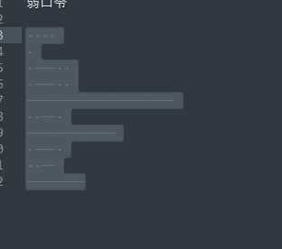

# BUUCTF-MISC

- [BUUCTF-MISC](#BUUCTF-MISC)
    - [二维码扫描](#二维码扫描)
    - [Webshell](#Webshell)
    - [神秘龙卷风](#神秘龙卷风)
    - [面具下的flag](#面具下的flag)
    - [刷新过的图片](#刷新过的图片)
    - [[BJDCTF2020]认真你就输了](#[BJDCTF2020]认真你就输了)
    - [菜刀666](#菜刀666)
    - [[BJDCTF2020]藏藏藏](#[BJDCTF2020]藏藏藏)
    - [秘密文件](#秘密文件)
    - [你猜我是个啥](#你猜我是个啥)
    - [神奇的二维码](#神奇的二维码)
    - [鸡你太美](#鸡你太美)
    - [just_a_rar](#just_a_rar)
    - [穿越时空的思念](#穿越时空的思念)
    - [纳尼](#纳尼)
    - [outguess](#outguess)
    - [我有一只马里奥](#我有一只马里奥)
    - [谁赢了比赛？](#谁赢了比赛？)
    - [excel破解](#excel破解)
    - [gakki](#gakki)
    - [来题中等的吧](#来题中等的吧)
    - [base64隐写](base64隐写)
    - [find_me](#find_me)
    - [sqltest](#sqltest)
    - [伟大的侦探](#伟大的侦探)
    - [黑客帝国](#黑客帝国)
    - [你能看懂音符吗](#你能看懂音符吗)
    - [KO](#KO)
    - [你有没有好好看网课?](#你有没有好好看网课?)
    - [ezmisc](#ezmisc)
    - [喵喵喵](#喵喵喵)
    - [caesar](#caesar)
    - [低个头](#低个头)
    - [弱口令](#弱口令)
    - [john-in-the-middle](#john-in-the-middle)
    - [NTFS数据流](#NTFS数据流)
    - [我吃三明治](#我吃三明治)
    - [single_dog](#single_dog)
## 二维码扫描

sudo apt install zbar-tools

## Webshell 后门

用D盾查杀找webshell

## 神秘龙卷风

下载来是rar压缩包,用archpr2爆破得到文本

内容为brainfuck，解密工具Python-Brainfuck-master得到flag

## 面具下的flag

用binwalk分离图片，得到一个压缩包：74DFE.zip,解压得flag.vmdk

linux下用7z解压vmdk文件

第一个文件明显brainfuck解密：flag{N7F5_AD5

第二个明显Ook解密 : _i5_funny!}

flag{N7F5_AD5_i5_funny!}

## 刷新过的图片

考点：F5隐写

利用F5-steganography利用工具

```java
java Extract Misc.jpg
```

查看output.txt发现开头有PK内容，说明是个ZIP文件头，修改后缀名解压得到flag

## snake.jpg

binwalk分离得到压缩包，里面有cipher和key两个文本，打开key  base64解密得到

`What is Nicki Minaj's favorite song that refers to snakes?`

搜索可得到密码为 anaconda

snake还有另外一个英文翻译：Serpent算法 解密即可

http://serpent.online-domain-tools.com/


## [BJDCTF2020]认真你就输了

binwalk发现flag

## 菜刀666

http.request.method==POST,追踪TCP流发现十六进制FF D8开头FF D9结尾，判断为jpg图片.


```py
import binascii
s = "十六进制内容"
with open('1.jpg','wb') as f:
    f.write(binascii.unhexlify(s))
```

得到一张带密码的图片。binwalk分离流量包得到zip，输入密码即可。

## [BJDCTF2020]藏藏藏

kali下foremost分离,得到压缩包，里面是二维码，识别得到flag

## 秘密文件

深夜里，Hack偷偷的潜入了某公司的内网，趁着深夜偷走了公司的秘密文件，公司的网络管理员通过通过监控工具成功的截取Hack入侵时数据流量，但是却无法分析出Hack到底偷走了什么机密文件，你能帮帮管理员分析出Hack到底偷走了什么机密文件吗？ 注意：得到的 flag 请包上 flag{} 提交

过滤FTP流追踪发现rar包，尝试foremost分解


然后暴力破解即可。

## 你猜我是个啥

用010打开发现png头，修改后缀为png，发现二维码，扫描后说flag不在这,010查看查找flag发现在末尾

## 神奇的二维码

扫描后未发现flag，binwalk分离四个压缩包，其中有一个base64多次得到的密码是第四个压缩包的密码，音频隐写Audacity


文件->导出为wav

kali
```bash
morse2ascii good.wav
```

将`t`替换为`-`，e替换为`.`

flag{morseisveryveryeasy}

## 鸡你太美

比较两张图片，添加丢失的git头

## just_a_rar

archpr爆破即可，是一张图片，右键查看属性发现flag

## 穿越时空的思念

嫦娥当年奔月后，非常后悔，因为月宫太冷清，她想：早知道让后羿自己上来了，带了只兔子真是不理智。于是她就写了一首曲子，诉说的是怀念后羿在的日子。无数年后，小明听到了这首曲子，毅然决定冒充后羿。然而小明从曲子中听不出啥来，咋办。。（该题目为小写的32位字符，提交即可） 注意：得到的 flag 请包上 flag{} 提交

audacity需要先将两个声道分离，分离立体声到单声道，导出文件wav

用kali的morse2ascii得到32位字符

## 纳尼

添加GIF89

## outguess

右键查看图片属性发现 公正民主公正文明公正和谐
核心价值解码得到abc

outguess -k "abc" -r mmm.jpg hidden.txt

## 我有一只马里奥

下载后点击exe出现1.txt，内容为ntfs flag.txt

猜测是ntfs隐写，用NtfsStreamsEditor扫1.txt

## 谁赢了比赛？

binwalk得到压缩包，暴力破解即可

得到gif图片，stegsolve-frame browser 要是对GIF之类的动图进行分解，把动图一帧帧的放，有时候会是二维码

第310帧有一行文字，保存下来单独对其stegsolve red plane 0发现二维码，扫描得到flag

## excel破解

010打开搜索flag

## gakki

binwalk分离压缩包，爆破压缩包得到文本

```
# -*- coding:utf-8 -*-
#Author: mochu7
# 字频统计
alphabet = "abcdefghijklmnopqrstuvwxyzABCDEFGHIJKLMNOPQRSTUVWXYZ1234567890!@#$%^&*()_+- =\\{\\}[]"
strings = open('./flag.txt').read()

result = {}
for i in alphabet:
	counts = strings.count(i) # 计算出现的次数
	i = '{0}'.format(i)
	result[i] = counts

res = sorted(result.items(),key=lambda item:item[1],reverse=True)  # 排序操作 True降序
for data in res:
	print(data)

for i in res:
	flag = str(i[0])
	print(flag[0],end="")
```

## 来题中等的吧

看图识别摩斯电码

.- .-.. .--. .... .- .-.. .- -...

## base64隐写

```py
# -*- coding: cp936 -*-

b64chars = 'ABCDEFGHIJKLMNOPQRSTUVWXYZabcdefghijklmnopqrstuvwxyz0123456789+/'

with open('1.txt', 'rb') as f:
    bin_str = ''
    for line in f.readlines():
        stegb64 = ''.join(line.split()) # 读取文本每一行
        rowb64 =  ''.join(stegb64.decode('base64').encode('base64').split()) # 把内容编码成原生base64

        offset = abs(b64chars.index(stegb64.replace('=','')[-1])-b64chars.index(rowb64.replace('=','')[-1])) # 文本的base64 - 原生base64
        equalnum = stegb64.count('=') #no equalnum no offset
        if equalnum:
            bin_str += bin(offset)[2:].zfill(equalnum * 2)

        print ''.join([chr(int(bin_str[i:i + 8], 2)) for i in xrange(0, len(bin_str), 8)]) #8 位一组
```

## find_me

右键属性发现盲文 解密即可

https://www.qqxiuzi.cn/bianma/wenbenjiami.php?s=mangwen

## sqltest

文件-导出对象-HTTP

我们可以从中推断出正确的ascii值，在对一个字符进行bool判断时，被重复判断的ASCII值就是正确的字符，最后提取到：

```bash
tshark -r sqltest.pcapng -Y "http.request" -T fields -e http.request.full_uri > data.txt
```

https://www.cnblogs.com/yunqian2017/p/15124198.html


102 108 97 103 123 52 55 101 100 98 56 51 48 48 101 100 53 102 57 98 50 56 102 99 53 52 98 48 100 48 57 101 99 100 101 102 55 125

flag{47edb8300ed5f9b28fc54b0d09ecdef7}

## 伟大的侦探

压缩包密码:摂m墷m卪倕ⅲm仈Z
呜呜呜,我忘记了压缩包密码的编码了,大家帮我解一哈。

用010editor打开 EBCDIC编码得到压缩包密码

里面是跳舞的小人

福尔摩斯-跳舞的小人解密

iloveholmesandwllm

## 黑客帝国

Jack很喜欢看黑客帝国电影，一天他正在上网时突然发现屏幕不受控制，出现了很多数据再滚屏，结束后留下了一份神秘的数据文件，难道这是另一个世界给Jack留下的信息？聪明的你能帮Jack破解这份数据的意义吗？ 注意：得到的 flag 请包上 flag{} 提交

打开发现是十六进制文件 用010editor导入十六进制文件，发现rar开头文件，保存到本地为1.rar，暴力破解得到一张损坏的png图片，010查看发现是JFIF，这是jpg格式特征，修改文件头为jpg的得到图片

## 你能看懂音符吗

压缩包损坏，打开010editor 改成Rar文件头，里面有docx

呀！一不小心把文档里的东西弄没了……

010editor继续查看发现PK文件头，修改后缀为zip

在word的document.xml发现

♭♯♪‖¶♬♭♭♪♭‖‖♭♭♬‖♫♪‖♩♬‖♬♬♭♭♫‖♩♫‖♬♪♭♭♭‖¶∮‖‖‖‖♩♬‖♬♪‖♩♫♭♭♭♭♭§‖♩♩♭♭♫♭♭♭‖♬♭‖¶§♭♭♯‖♫∮‖♬¶‖¶∮‖♬♫‖♫♬‖♫♫§=

音符解密即可

## KO

OoK解密

## 你有没有好好看网课?

flag3 6位数字暴力破解得到文档和mp4

根据文档提示 用pr新建项目-导入mp4 在5.20和7.11发现信息

..... ../... ./... ./... ../
  5,2     3,1    3,1    3,2
   W       L      L      M
dXBfdXBfdXA=

wllmup_up_up 输入压缩包得到图片，010editor在末尾发现flag

## ezmisc

修改宽高 在第二行第6 7列  7是高

## 喵喵喵

stegsolve发现在红绿蓝 0位上方有不一样的东西，可以猜测是LSB隐写


保存为二进制文件，修改多余的文件头 再修改宽高 二维码扫描

https://pan.baidu.com/s/1pLT2J4f

NtfsStreamsEditor软件去提取隐藏文件。（这一步我一直提取失败，没搞懂为什么，后来发现下载的压缩包用WinRAR解压才可以提取到隐藏的文件，据大佬说流隐写得用WinRAR解压

最后得到pyc 反编译即可

```bash
#!/usr/bin/env python
# visit https://tool.lu/pyc/ for more information
import base64

def encode():
    flag = '*************'
    ciphertext = []
    for i in range(len(flag)):
        s = chr(i ^ ord(flag[i])) # flag每个字符转为十进制再与i异或 然后转为字符
        if i % 2 == 0:
            s = ord(s) + 10
        else:
            s = ord(s) - 10
        ciphertext.append(str(s))
    return ciphertext[::-1]

def decode():
    flag = ''
    ciphertext = [
        '96',
        '65',
        '93',
        '123',
        '91',
        '97',
        '22',
        '93',
        '70',
        '102',
        '94',
        '132',
        '46',
        '112',
        '64',
        '97',
        '88',
        '80',
        '82',
        '137',
        '90',
        '109',
        '99',
        '112']
    ciphertext = ciphertext[::-1]
    for i in range(len(ciphertext)):
        if i % 2 == 0:
            s = int(ciphertext[i]) - 10
        else:
            s = int(ciphertext[i]) + 10
        s = chr(i ^ s)
        flag +=  s
        print(flag)

if __name__ == '__main__':
    decode()
```

## caesar
题目：caesar

描述：gmbhjtdbftbs

flag格式：XXX 明文

提交：直接提交明文 （小写）

中文翻译是凯撒，解密皆可

## 低个头

题目：低个头

描述：EWAZX RTY TGB IJN IO KL 请破解该密文 f

lag格式：XXX 明文

提交：直接提交明文（大写）

键盘密码


flag{CTF}

## 弱口令

老菜鸡，伤了神，别灰心，莫放弃，试试弱口令 注意：得到的 flag 请包上 flag{} 提交

打开压缩包，有密码，右边可以发现看不见的密码，复制到新文本sublime 全选可看见摩斯密码




.... . .-.. .-.. ----- ..-. --- .-. ..- --

摩斯电码解密得到压缩包密码，解压后是一张女神图片

LSB隐写

python2 lsb.py extract 女神.png 1.txt 123456

## john-in-the-middle

导出http对象文件
也可也foremost
 对logo.png进行stegsolve观察

## NTFS数据流

直接用ntfstreameditor2工具读取

## 我吃三明治

foremost分离两张图片

010打开原图对比 在拼接处发现base32 ，解密得到flag

## single_dog

颜文字解密

http://www.atoolbox.net/Tool.php?Id=703

## SXMgdGhpcyBiYXNlPw==

base64隐写